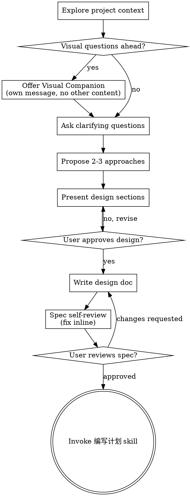

# 将想法梳理成设计

通过自然的协作式对话，帮助把想法转化为完整的设计和规格说明。

先理解当前项目上下文，然后一次只问一个问题来细化想法。当你理解要构建的内容后，提出设计并取得用户批准。

<HARD-GATE>
在你提出设计并且用户批准之前，不要调用任何实现类技能、编写任何代码、搭建任何项目，或采取任何实现动作。无论项目看起来多简单，这都适用于每个项目。
</HARD-GATE>

## 反模式：“这太简单了，不需要设计”

每个项目都要经过这个流程。待办事项列表、单函数工具、配置变更，都一样。“简单”项目最容易因为未经检验的假设而浪费工作。设计可以很短（真正简单的项目只需几句话），但你必须提出设计并取得批准。

## 检查清单

你必须为下面每一项创建任务，并按顺序完成：

1. **探索项目上下文**：检查文件、文档、最近提交
2. **提供视觉辅助**（如果主题会涉及视觉问题）：这必须是独立消息，不能和澄清问题合并。见下方“视觉辅助”章节。
3. **提出澄清问题**：一次一个，理解目的、约束和成功标准
4. **提出 2-3 种方案**：包含取舍和你的建议
5. **呈现设计**：按复杂度划分章节，每个章节后取得用户确认
6. **编写设计文档**：保存到 `docs/superpowers/specs/YYYY-MM-DD-<topic>-design.md` 并提交
7. **规格自审**：快速内联检查占位符、矛盾、歧义、范围（见下方）
8. **用户审阅书面规格**：继续前请用户审阅规格文件
9. **转入实现**：调用 编写计划 技能创建实现计划

## 流程

**终止状态是调用 编写计划。** 不要调用 frontend-design、mcp-builder 或任何其他实现类技能。头脑风暴 之后唯一要调用的技能是 编写计划。

## 流程细节

**理解想法：**

- 先查看当前项目状态（文件、文档、最近提交）
- 在询问细节前先评估范围：如果请求描述了多个独立子系统（例如“构建一个包含聊天、文件存储、计费和分析的平台”），立即指出。不要花时间细化一个本应先拆分的项目。
- 如果项目太大，无法用单个规格覆盖，帮助用户拆成子项目：独立部分是什么、如何关联、按什么顺序构建？然后按正常设计流程梳理第一个子项目。每个子项目都有自己的规格 → 计划 → 实现周期。
- 对范围合适的项目，一次只问一个问题来细化想法
- 能用选择题时优先使用选择题，开放问题也可以
- 每条消息只问一个问题；如果一个主题需要更多探索，拆成多个问题
- 聚焦于理解：目的、约束、成功标准

**探索方案：**

- 提出 2-3 种不同方案，并说明取舍
- 用对话方式展示选项，给出你的建议和理由
- 先给出推荐方案并解释原因

**呈现设计：**

- 当你认为已经理解要构建什么时，呈现设计
- 每个章节按复杂度控制长度：简单内容几句话即可，复杂内容最多约 200-300 词
- 每个章节后询问目前看起来是否正确
- 覆盖：架构、组件、数据流、错误处理、测试
- 如果有内容说不通，准备回头继续澄清

**为隔离和清晰而设计：**

- 将系统拆成更小的单元，每个单元有清晰职责，通过明确接口通信，并且可以独立理解和测试
- 对每个单元，你应该能回答：它做什么、如何使用它、它依赖什么？
- 不读内部实现，别人能否理解一个单元做什么？你能否修改内部实现而不破坏使用方？如果不能，边界需要调整。
- 更小、边界明确的单元也更便于你工作：你更容易推理能放进上下文的代码，文件聚焦时编辑也更可靠。文件变大通常是它承担了太多职责的信号。

**在现有代码库中工作：**

- 提出变更前先探索当前结构。遵循已有模式。
- 如果现有代码的问题会影响当前工作（例如文件过大、边界不清、职责纠缠），把有针对性的改进纳入设计；这就是优秀开发者在所负责代码中顺手改进的方式。
- 不要提出无关重构。始终聚焦于服务当前目标的内容。

## 设计之后

**文档：**

- 将已验证的设计（规格）写入 `docs/superpowers/specs/YYYY-MM-DD-<topic>-design.md`
  - 用户偏好的规格位置优先于这个默认位置
- 如果可用，使用 elements-of-style:writing-clearly-and-concisely 技能
- 将设计文档提交到 git

**规格自审：**
写完规格文档后，用新的视角审阅：

1. **占位符扫描：** 是否有 “TBD”、“TODO”、未完成章节或含糊需求？修复它们。
2. **内部一致性：** 各章节是否相互矛盾？架构是否符合功能描述？
3. **范围检查：** 是否足够聚焦，能进入单个实现计划？还是需要拆分？
4. **歧义检查：** 是否有需求可以被两种方式解释？如果有，选择一种并写明确。

发现问题就内联修复。不需要再次审阅，修好后继续。

**用户审阅门槛：**
规格自审通过后，请用户先审阅书面规格再继续：

> “规格已写入并提交到 `<path>`。请先审阅，如果在开始编写实现计划前还想修改，请告诉我。”

等待用户回复。如果用户要求修改，修改后重新运行规格自审循环。只有用户批准后才继续。

**实现：**

- 调用 编写计划 技能创建详细实现计划
- 不要调用任何其他技能。下一步就是 编写计划。

## 关键原则

- **一次一个问题**：不要用多个问题压倒用户
- **优先选择题**：可行时，选择题比开放问题更容易回答
- **严格 YAGNI**：从所有设计中移除不必要功能
- **探索替代方案**：确定方案前始终提出 2-3 种方案
- **增量确认**：呈现设计，取得批准后再继续
- **保持灵活**：内容说不通时，回头继续澄清

## 视觉辅助

一个基于浏览器的辅助工具，用于在头脑风暴期间展示 mockup、图表和视觉选项。它是工具，不是模式。接受视觉辅助意味着它可用于受益于视觉表达的问题；这不表示每个问题都要通过浏览器完成。

**提供视觉辅助：** 当你预计接下来的问题会涉及视觉内容（mockup、布局、图表）时，单独征求一次同意：
> “我们接下来讨论的一些内容，如果能在浏览器里展示，可能会更容易说明。我可以边推进边做 mockup、图表、对比和其他视觉材料。这个功能还比较新，也可能消耗较多 token。要试试吗？（需要打开一个本地 URL）”

**这个邀请必须是独立消息。** 不要把它和澄清问题、上下文总结或任何其他内容合并。消息只能包含上面的邀请，不能有其他内容。等待用户回复后再继续。如果用户拒绝，继续纯文本头脑风暴。

**逐问题判断：** 即使用户接受，也要对每个问题分别决定使用浏览器还是终端。判断标准是：**用户看到它是否比阅读它更容易理解？**

- **使用浏览器** 展示视觉内容：mockup、线框图、布局对比、架构图、并排视觉设计
- **使用终端** 展示文本内容：需求问题、概念选择、取舍列表、A/B/C/D 文本选项、范围决策

关于 UI 主题的问题不自动等于视觉问题。“这个语境里的个性是什么意思？”是概念问题，使用终端。“哪种向导布局更好？”是视觉问题，使用浏览器。

如果用户同意使用视觉辅助，继续前读取详细指南：
`skills/头脑风暴/visual-companion.md`
