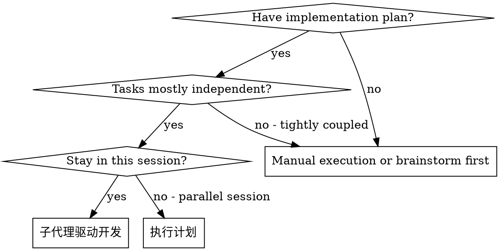
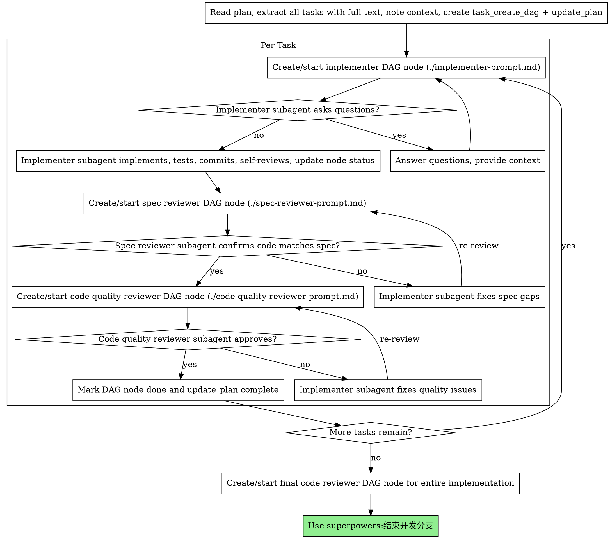

# 子代理驱动开发

通过为每个任务派发新的子代理来执行计划，并在每个任务后进行两阶段审查：先审查规格符合性，再审查代码质量。

**为什么使用子代理：** 你把任务委派给拥有隔离上下文的专门代理。通过精确构造它们的指令和上下文，你可以确保它们保持聚焦并完成任务。它们不应该继承你的会话上下文或历史；你要只构造它们需要的内容。这也能保留你自己的上下文，用于协调工作。

**核心原则：** 每个任务使用新子代理 + 两阶段审查（先规格、后质量）= 高质量、快速迭代

**super-agent-v3 强制前置：** 在本仓库中，子代理生命周期必须先进入 mcp-orch DAG。启动任何实现者或审查者前，先用 `task_create_dag` 建图；用户要求执行时用 `task_start_dag` 启动 run；ready 节点需要指派时用 `task_dispatch_node`；每次状态变化用 `task_update_node` 写入 `running`、`done`、`failed` 或 `blocked`。如果当前环境没有暴露这些工具，先向用户说明限制，不要启动子代理。

## 何时使用



**相比 Executing Plans（并行会话）：**
- 同一会话（无需切换上下文）
- 每个任务使用新子代理（避免上下文污染）
- 每个任务后两阶段审查：先规格符合性，再代码质量
- 迭代更快（任务之间不需要人工介入）

## 流程



## 模型选择

使用能胜任每个角色的最低能力模型，以节省成本并提高速度。

**机械性实现任务**（隔离函数、明确规格、1-2 个文件）：使用快速、便宜的模型。当计划写得足够明确时，大多数实现任务都是机械性的。

**集成和判断任务**（多文件协调、模式匹配、调试）：使用标准模型。

**架构、设计和审查任务**：使用可用的最强模型。

**任务复杂度信号：**
- 触及 1-2 个文件且规格完整 → 便宜模型
- 触及多个文件并有集成问题 → 标准模型
- 需要设计判断或广泛理解代码库 → 最强模型

## 处理实现者状态

实现者子代理会报告四种状态之一。按下面方式处理：

**DONE：** 进入规格符合性审查。

**DONE_WITH_CONCERNS：** 实现者完成了工作，但标记了疑虑。继续前阅读疑虑。如果疑虑涉及正确性或范围，先处理再审查。如果只是观察（例如“这个文件变大了”），记录后继续审查。

**NEEDS_CONTEXT：** 实现者需要未提供的信息。提供缺失上下文并重新派发。

**BLOCKED：** 实现者无法完成任务。评估阻塞：
1. 如果是上下文问题，提供更多上下文并用同一模型重新派发
2. 如果任务需要更多推理，用更强模型重新派发
3. 如果任务太大，拆成更小部分
4. 如果计划本身错误，升级给用户

**绝不要**忽略升级，也不要在没有变化的情况下强迫同一模型重试。如果实现者说卡住了，就需要改变一些东西。

## 提示词模板

- `./implementer-prompt.md`：派发实现者子代理
- `./spec-reviewer-prompt.md`：派发规格符合性审查子代理
- `./code-quality-reviewer-prompt.md`：派发代码质量审查子代理

## 示例工作流

```
You: 我正在使用子代理驱动开发来执行这份计划。

[Read plan file once: docs/superpowers/plans/feature-plan.md]
[Extract all 5 tasks with full text and context]
[Create task_create_dag and update_plan with all tasks]

Task 1: Hook installation script

[Get Task 1 text and context (already extracted)]
[task_start_dag, then task_dispatch_node for implementation subagent with full task text + context]

Implementer: "Before I begin - should the hook be installed at user or system level?"

You: "User level (~/.config/superpowers/hooks/)"

Implementer: "Got it. Implementing now..."
[Later] Implementer:
  - Implemented install-hook command
  - Added tests, 5/5 passing
  - Self-review: Found I missed --force flag, added it
  - Committed

[task_dispatch_node for spec compliance reviewer]
Spec reviewer: ✅ Spec compliant - all requirements met, nothing extra

[Get git SHAs, dispatch code quality reviewer]
Code reviewer: Strengths: Good test coverage, clean. Issues: None. Approved.

[task_update_node status=done; mark Task 1 complete]

Task 2: Recovery modes

[Get Task 2 text and context (already extracted)]
[task_dispatch_node for implementation subagent with full task text + context]

Implementer: [No questions, proceeds]
Implementer:
  - Added verify/repair modes
  - 8/8 tests passing
  - Self-review: All good
  - Committed

[task_dispatch_node for spec compliance reviewer]
Spec reviewer: ❌ Issues:
  - Missing: Progress reporting (spec says "report every 100 items")
  - Extra: Added --json flag (not requested)

[Implementer fixes issues]
Implementer: Removed --json flag, added progress reporting

[Spec reviewer reviews again]
Spec reviewer: ✅ Spec compliant now

[task_dispatch_node for code quality reviewer]
Code reviewer: Strengths: Solid. Issues (Important): Magic number (100)

[Implementer fixes]
Implementer: Extracted PROGRESS_INTERVAL constant

[Code reviewer reviews again]
Code reviewer: ✅ Approved

[Mark Task 2 complete]

...

[After all tasks]
[task_dispatch_node for final code-reviewer]
Final reviewer: All requirements met, ready to merge

Done!
```

## 优势

**相比手动执行：**
- 子代理会自然遵循 TDD
- 每个任务都有新上下文（减少混淆）
- 并行安全（子代理不会相互干扰）
- 子代理可以提问（工作前和工作中都可以）

**相比 Executing Plans：**
- 同一会话（无需交接）
- 持续推进（无需等待）
- 自动审查检查点

**效率提升：**
- 没有文件读取开销（控制者提供完整文本）
- 控制者精确筛选所需上下文
- 子代理一开始就获得完整信息
- 问题在工作开始前暴露（不是结束后）

**质量门槛：**
- 自审在交接前发现问题
- 两阶段审查：规格符合性，然后代码质量
- 审查循环确保修复确实有效
- 规格符合性防止做多或做少
- 代码质量确保实现构建得好

**成本：**
- 更多子代理调用（每个任务一个实现者 + 两个审查者）
- 控制者需要更多准备工作（预先提取所有任务）
- 审查循环增加迭代
- 但能早发现问题（比之后调试更便宜）

## 红旗

**绝不要：**
- 未经用户明确同意就在 main/master 分支上开始实现
- 跳过 `task_create_dag` / `task_start_dag` / `task_dispatch_node` / `task_update_node` 生命周期记录
- 跳过审查（规格符合性或代码质量）
- 带着未修复问题继续
- 并行派发多个实现子代理（会冲突）
- 让子代理读取计划文件（改为提供完整文本）
- 跳过场景上下文（子代理需要理解任务位置）
- 忽略子代理问题（先回答再让它继续）
- 在规格符合性上接受“差不多”（规格审查者发现问题 = 未完成）
- 跳过审查循环（审查者发现问题 = 实现者修复 = 再审查）
- 让实现者自审替代真正审查（两者都需要）
- **在规格符合性 ✅ 前开始代码质量审查**（顺序错误）
- 当任一审查还有未解决问题时进入下一个任务

**如果子代理提问：**
- 清晰完整地回答
- 需要时提供额外上下文
- 不要催它们直接实现

**如果审查者发现问题：**
- 实现者（同一子代理）修复
- 审查者再次审查
- 重复直到批准
- 不要跳过复审

**如果子代理任务失败：**
- 派发带具体指令的修复子代理
- 不要手动修复（会污染上下文）

## 集成

**必需工作流技能：**
- **superpowers:使用git工作区**：必需，开始前设置隔离工作区
- **superpowers:编写计划**：创建此技能执行的计划
- **superpowers:请求代码审查**：审查者子代理使用的代码审查模板
- **superpowers:结束开发分支**：所有任务完成后结束开发

**子代理应使用：**
- **superpowers:测试驱动开发**：子代理为每个任务遵循 TDD

**替代工作流：**
- **superpowers:执行计划**：用于并行会话，而不是同会话执行
