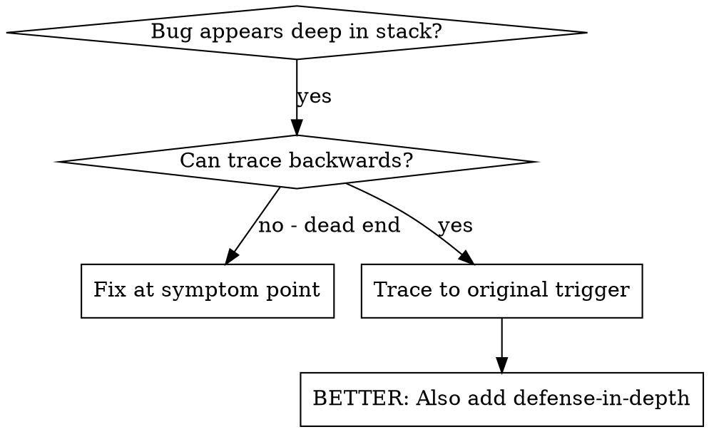
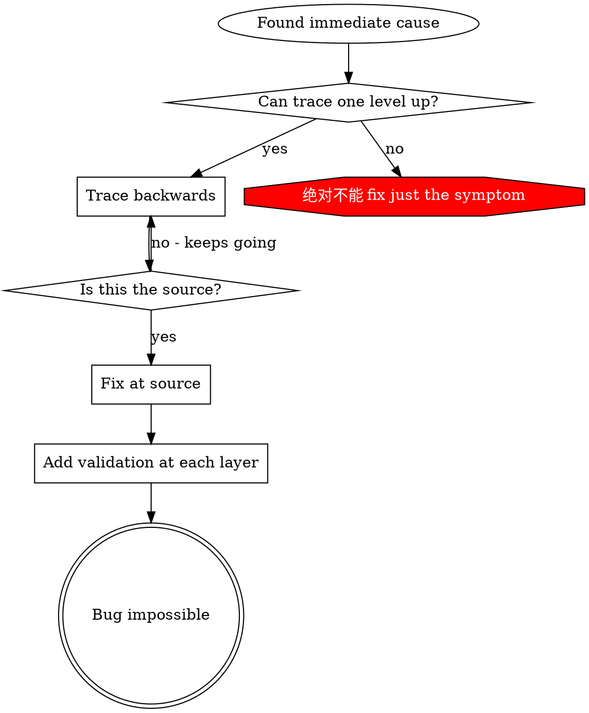

# 根因追踪

## 概览

Bug 常常在调用栈深处显现（在错误目录执行 git init、文件创建到错误位置、数据库用错误路径打开）。你的直觉可能是在错误出现处修复，但那是在处理症状。

**核心原则：** 沿调用链向后追踪，直到找到原始触发点，然后在来源处修复。

## 何时使用



**适用场景：**
- 错误发生在执行深处（不是入口点）
- 堆栈跟踪显示很长调用链
- 不清楚无效数据从哪里来
- 需要找出哪个测试/代码触发问题

## 追踪流程

### 1. 观察症状
```
Error: git init failed in /Users/jesse/project/packages/core
```

### 2. 找到直接原因
**哪段代码直接导致了它？**
```typescript
await execFileAsync('git', ['init'], { cwd: projectDir });
```

### 3. 询问：谁调用了它？
```typescript
WorktreeManager.createSessionWorktree(projectDir, sessionId)
  → called by Session.initializeWorkspace()
  → called by Session.create()
  → called by test at Project.create()
```

### 4. 继续向上追踪
**传入了什么值？**
- `projectDir = ''`（空字符串！）
- 空字符串作为 `cwd` 会解析到 `process.cwd()`
- 那就是源代码目录！

### 5. 找到原始触发点
**空字符串从哪里来？**
```typescript
const context = setupCoreTest(); // Returns { tempDir: '' }
Project.create('name', context.tempDir); // Accessed before beforeEach!
```

## 添加堆栈跟踪

当无法手动追踪时，添加仪表：

```typescript
// Before the problematic operation
async function gitInit(directory: string) {
  const stack = new Error().stack;
  console.error('DEBUG git init:', {
    directory,
    cwd: process.cwd(),
    nodeEnv: process.env.NODE_ENV,
    stack,
  });

  await execFileAsync('git', ['init'], { cwd: directory });
}
```

**关键：** 在测试中使用 `console.error()`（不要用 logger，它可能不会显示）

**运行并捕获：**
```bash
npm test 2>&1 | grep 'DEBUG git init'
```

**分析堆栈跟踪：**
- 查找测试文件名
- 找到触发调用的行号
- 识别模式（同一测试？同一参数？）

## 找出哪个测试造成污染

如果某个东西在测试期间出现，但你不知道是哪一个测试：

使用本目录中的二分脚本 `find-polluter.sh`：

```bash
./find-polluter.sh '.git' 'src/**/*.test.ts'
```

它逐个运行测试，并在第一个污染源处停止。用法见脚本。

## 真实示例：空 projectDir

**症状：** `.git` 创建在 `packages/core/`（源代码）中

**追踪链：**
1. `git init` 在 `process.cwd()` 中运行 ← 空 cwd 参数
2. WorktreeManager 收到空 projectDir
3. Session.create() 传入空字符串
4. 测试在 beforeEach 之前访问了 `context.tempDir`
5. setupCoreTest() 初始返回 `{ tempDir: '' }`

**根因：** 顶层变量初始化访问了空值

**修复：** 将 tempDir 做成 getter；如果在 beforeEach 前访问就抛错

**同时添加纵深防御：**
- 第 1 层：Project.create() 验证目录
- 第 2 层：WorkspaceManager 验证不为空
- 第 3 层：NODE_ENV guard 拒绝在 tmpdir 外执行 git init
- 第 4 层：git init 前记录堆栈

## 关键原则



**绝不要只修错误出现的位置。** 向后追踪，找到原始触发点。

## 堆栈跟踪提示

**测试中：** 使用 `console.error()` 而不是 logger：logger 可能被抑制
**操作前：** 在危险操作前记录日志，不是在失败后
**包含上下文：** 目录、cwd、环境变量、时间戳
**捕获堆栈：** `new Error().stack` 显示完整调用链

## 真实影响

来自调试会话（2025-10-03）：
- 通过 5 层追踪找到根因
- 在来源处修复（getter 验证）
- 添加 4 层防御
- 1847 个测试通过，零污染
