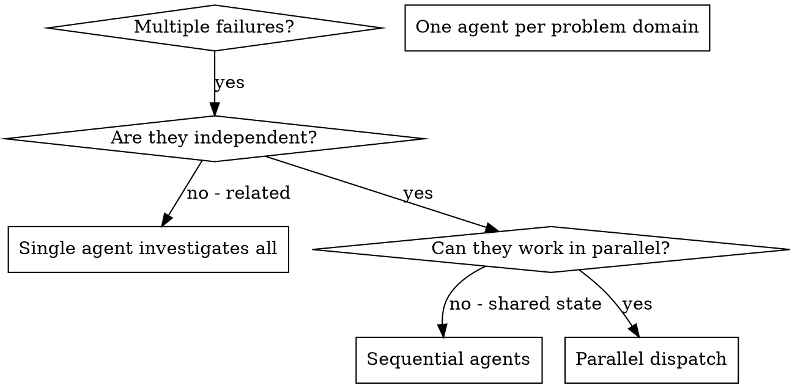

# 调度并行代理

## 概览

你会把任务委派给拥有隔离上下文的专门代理。通过精确编写它们的指令和上下文，你可以确保它们保持聚焦并完成任务。它们不应该继承你的会话上下文或历史；你要只构造它们需要的内容。这也能保留你自己的上下文，用于协调工作。

当你有多个无关失败（不同测试文件、不同子系统、不同 bug）时，逐个调查会浪费时间。每个调查都独立，可以并行进行。

**核心原则：** 每个独立问题域派发一个代理。让它们并发工作。

**super-agent-v3 编排选择：** 并行代理不强制绑定 mcp-orch。优先使用当前平台可用的原生多代理能力；只有需要持久 DAG、重试、租约、cron/wakeup 或结构化交接记录时，才可选使用 `task_create_dag`、`task_start_dag`、`task_dispatch_node`、`task_update_node`。缺少 mcp-go-agent-orchestration 工具不是阻断条件；继续使用可用的子代理能力，或在不适合派发时改为单代理只读分析并说明观测限制。

## 何时使用



**适用场景：**
- 3 个以上测试文件失败，且根因不同
- 多个子系统独立损坏
- 每个问题不需要其他问题的上下文就能理解
- 调查之间没有共享状态

**不适用场景：**
- 失败彼此相关（修复一个可能修复其他）
- 需要理解完整系统状态
- 代理会相互干扰

## 模式

### 1. 识别独立域

按损坏内容分组失败：
- 文件 A 测试：工具批准流程
- 文件 B 测试：批量完成行为
- 文件 C 测试：中止功能

每个域都是独立的：修复工具批准不会影响中止测试。

### 2. 创建聚焦的代理任务

每个代理得到：
- **具体范围：** 一个测试文件或子系统
- **明确目标：** 让这些测试通过
- **约束：** 不要修改其他代码
- **预期输出：** 总结发现和修复内容

### 3. 并行派发

平台原生多代理可直接派发。若本轮明确选择 mcp-orch 记录持久编排状态，可按下面方式建 DAG：

```typescript
task_create_dag({
  dag_key: "fix-independent-test-failures",
  nodes: [
    { node_key: "agent-tool-abort", assigned_to: "worker", depends_on: [] },
    { node_key: "batch-completion", assigned_to: "worker", depends_on: [] },
    { node_key: "tool-approval-race", assigned_to: "worker", depends_on: [] }
  ]
})
task_start_dag("fix-independent-test-failures")
task_dispatch_node("agent-tool-abort", run_id, assigned_to)
task_dispatch_node("batch-completion", run_id, assigned_to)
task_dispatch_node("tool-approval-race", run_id, assigned_to)
```

如果使用平台原生多代理，保留每个子代理的范围、返回摘要、文件改动和验证结果；不需要伪造 DAG/node 证据。

### 4. 审阅并集成

代理返回后：
- 阅读每份总结
- 验证修复之间没有冲突
- 运行完整测试套件
- 集成所有变更

## 代理提示词结构

好的代理提示词具备：
1. **聚焦**：一个清晰的问题域
2. **自包含**：包含理解问题所需的所有上下文
3. **明确输出**：说明代理应该返回什么

```markdown
Fix the 3 failing tests in src/agents/agent-tool-abort.test.ts:

1. "should abort tool with partial output capture" - expects 'interrupted at' in message
2. "should handle mixed completed and aborted tools" - fast tool aborted instead of completed
3. "should properly track pendingToolCount" - expects 3 results but gets 0

These are timing/race condition issues. Your task:

1. Read the test file and understand what each test verifies
2. Identify root cause - timing issues or actual bugs?
3. Fix by:
   - Replacing arbitrary timeouts with event-based waiting
   - Fixing bugs in abort implementation if found
   - Adjusting test expectations if testing changed behavior

Do NOT just increase timeouts - find the real issue.

Return: Summary of what you found and what you fixed.
```

## 常见错误

**❌ 太宽泛：** “修好所有测试” - 代理会迷失方向
**✅ 具体：** “修好 agent-tool-abort.test.ts” - 范围聚焦

**❌ 没有上下文：** “修好这个竞态条件” - 代理不知道在哪里
**✅ 有上下文：** 粘贴错误消息和测试名称

**❌ 没有约束：** 代理可能重构所有内容
**✅ 有约束：** “不要修改生产代码” 或 “只修测试”

**❌ 输出含糊：** “修好它” - 你不知道改了什么
**✅ 输出具体：** “返回根因和变更总结”

## 何时不要使用

**相关失败：** 修一个可能修好其他，先一起调查
**需要完整上下文：** 理解问题需要查看整个系统
**探索性调试：** 你还不知道坏在哪里
**共享状态：** 代理会相互干扰（编辑相同文件、使用相同资源）

## 会话中的真实示例

**场景：** 大型重构后，3 个文件里有 6 个测试失败

**失败：**
- agent-tool-abort.test.ts：3 个失败（计时问题）
- batch-completion-behavior.test.ts：2 个失败（工具未执行）
- tool-approval-race-conditions.test.ts：1 个失败（execution count = 0）

**决策：** 问题域独立：中止逻辑、批量完成、竞态条件彼此分离

**派发：**
```
Agent 1 → Fix agent-tool-abort.test.ts
Agent 2 → Fix batch-completion-behavior.test.ts
Agent 3 → Fix tool-approval-race-conditions.test.ts
```

**结果：**
- Agent 1：用基于事件的等待替换超时
- Agent 2：修复事件结构 bug（threadId 放错位置）
- Agent 3：增加等待，让异步工具执行完成

**集成：** 所有修复彼此独立、无冲突、完整套件通过

**节省时间：** 3 个问题并行解决，而不是串行处理

## 主要收益

1. **并行化**：多个调查同时进行
2. **聚焦**：每个代理范围窄，需跟踪的上下文更少
3. **独立性**：代理不会互相干扰
4. **速度**：用处理 1 个问题的时间解决 3 个问题

## 验证

代理返回后：
1. **审阅每份总结**：理解改了什么
2. **检查冲突**：代理是否编辑了相同代码？
3. **运行完整套件**：验证所有修复能一起工作
4. **抽查**：代理可能犯系统性错误
5. **写回状态**：用 `update_plan` 和报告记录最终状态；如果本轮已选择 mcp-orch，再用 `task_update_node` 写入对应 node。

## 真实影响

来自调试会话（2025-10-03）：
- 3 个文件里有 6 个失败
- 并行派发 3 个代理
- 所有调查并发完成
- 所有修复成功集成
- 代理变更之间零冲突
