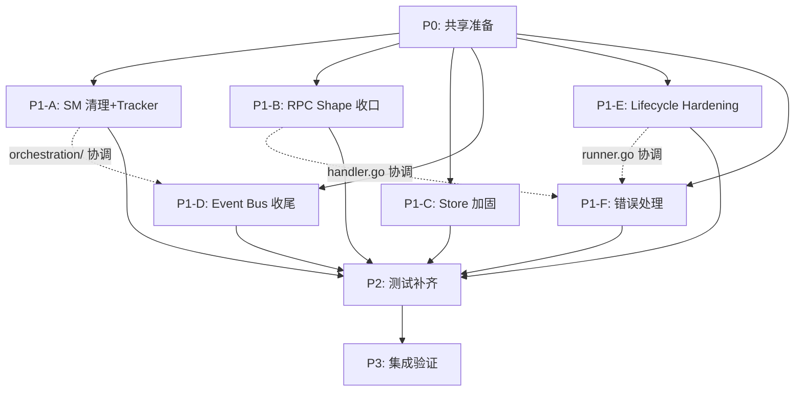

# Framework Audit 修复工作流（v2 — 审查修订版）

> ⚠️ 本版基于 5 个 Codex Agent 交叉审查结论重写，修正了 v1 中的 9 个过时假设。

## 概览

| 属性 | 值 |
|------|-----|
| 来源文档 | `docs/plans/framework_audit.md` (2026-03-26 二次修订版) |
| 预计总耗时 | 14-17h Agent 时间，关键路径 ~8h |
| 可并行任务 | P1-A, P1-B, P1-C, P1-D, P1-E, P1-F |
| 串行依赖 | P0 → [P1-A..F] → P2 → P3 |
| 预计代码量 | ~4,500-6,000 行（v1 高估了已存在代码） |

## 当前合规状态（v2.3 — 老公审查后最终版）

| # | 维度 | 状态 | 处置 | 说明 |
|---|------|------|------|------|
| 1 | fx 依赖注入 | ⚠️ | **P2 快速清理** | 删 5 个无消费者 emitter，8 个 optional 延后 |
| 2 | event bus | ⚠️ | **P2 补发布** | TurnStalled/TurnResumed 2 个零发布事件 |
| 3 | stateless 状态机 | ~~❌~~ | **🏛️ 架构设计 — 已审查收口** | V3 单一 10 态 SM 替代 V2 双层投影，是有意设计 |
| 4 | jrpc2 JSON-RPC | ~~❌~~ | **🏛️ 架构设计 — 已审查收口** | V3 简化 RPC shape，P1 四批已补回关键字段 |
| 5 | **lifecycle** | **⚠️** | **P0 立即修复** | SafeGo goroutine panic policy + signal 收敛 |
| 6 | pgx 数据库 | ✅ | **✅ 已收口** | 原本就合规 |
| 7 | 错误处理（低风险） | ~~❌~~ | **🏛️ 架构设计 — 已审查收口** | ~26 个 tx/close/signal 吞错是合理设计 |
| 7b | **错误处理（高风险）** | **❌** | **P1 修复** | ~12 个 recovery/lifecycle/command 吞错需 LogIgnoredError |
| 8 | import 方向 | ✅ | **✅ P1 会话已修复** | archtest rule15 + SqlcBoundary + DependencyDirection 全绿 |
| 9 | 代码守卫 | ✅ | **✅ P1 会话已修复** | CodeSizeGuard 全绿，包行数上限调到 4500 |
| 10 | two-zone DRY | ⚠️ | **🔄 defer P10** | 不影响功能 |
| 11 | 测试覆盖 | ⚠️ | **P2 补空白** | 随 P1 四批已大幅提升，store/thread repo 空白待补 |
| 12 | **store parity** | **⚠️** | **P1 加固** | DBQuery READ ONLY + AILog keyword 下推 |

## 关键基线修正（v1→v2）

| v1 假设 | 实际状态 | 影响 |
|---------|---------|------|
| awaiting_user_input 未实现 | ✅ `user_input.go` 已实现+测试 | P1-A 删除 A3 |
| prepareLaunchStateLocked 直写状态 | ✅ 已改为 `normalizeLaunchStateLocked` | P1-A 缩减 A1 |
| Approval Family 单一 method | ✅ 已有 `CallbackMethod/SourceMethod` | P1-B 删除 B2 |
| Transport pending/fallback 未接线 | ✅ 已在 approval.go 接线 | P1-B 删除 B3 新建文件 |
| ThreadBinding 无独立 repo | ✅ `binding` 包已有 thread binding 方法 | P1-C 改为扩展 binding |
| AILog 无分类 | ✅ 已有 Category/Method/Status/Model | P1-C 缩减为 keyword 下推 |
| DBQuery 是 placeholder | ✅ 已有真实执行器+安全限制 | P1-C 缩减为 READ ONLY 加固 |
| 零发布事件 9 个 | 实际仅 2 个（TurnStalled/TurnResumed） | P1-D 大幅缩减 |
| 测试覆盖零 | store:33, thread:46, codexapp:24, rpc:37 tests | P2 改为"扩展+补空白" |

## 任务依赖图

## 任务清单（v2.3 — 老公审查后最终版）

### 已收口（不再执行）
- [x] #3 stateless 状态机 — 🏛️ 架构设计决策，已审查收口
- [x] #4 jrpc2 JSON-RPC — 🏛️ 架构设计决策，P1 四批已补回关键字段
- [x] #7-low 错误处理（低风险 ~26 个 tx/close/signal）— 🏛️ 架构设计决策
- [x] #6 pgx 数据库 — ✅ 原本合规
- [x] #8 import 方向 — ✅ P1 会话已修复
- [x] #9 代码守卫 — ✅ P1 会话已修复
- [x] #10 two-zone DRY — 🔄 defer P10

### P0 立即执行（P9 之前）
- [x] P0: 共享准备 — SafeGo + LogIgnoredError 已创建 ✅
- [ ] **#5 lifecycle SafeGo + signal 收敛** (~2h)

### P1 立即执行（P9 之前，与 P0 并行）
- [ ] **#12 store 加固** — DBQuery READ ONLY + AILog keyword 下推 (~0.5h)
- [ ] **#7-high 高风险吞错** — ~12 个 recovery/lifecycle/command 改 LogIgnoredError (~1h)

### P2 与 P9 并行
- [ ] #2 event bus 剩余 — TurnStalled/TurnResumed 补发布 (~0.5h)
- [ ] #11 测试空白 — store/thread repo 专项补 (~2h)
- [ ] #1 fx 快速清理 — 删 5 个 emitter provider (~0.5h)

### P3 集成验证
- [ ] 全量编译 + archtest + 文档更新 (~1h)

## 文件分配矩阵（完整版）

| 文件/目录 | P1-A | P1-B | P1-C | P1-D | P1-E | P1-F | 冲突 |
|----------|:----:|:----:|:----:|:----:|:----:|:----:|:----:|
| `cmd/mcp-orch/orchestration/turn_lifecycle.go` | ✓ | | | | | | 🟢 |
| `cmd/mcp-orch/orchestration/events.go` | ✓ | | | | | | 🟢 |
| `cmd/mcp-orch/orchestration/rpc.go` | | ✓ | | | | | 🟢 |
| `internal/dto/agent/state.go` | ✓ | | | | | | 🟢 |
| `internal/module/turn/tracker.go` | ✓ | | | | | | 🟢 |
| `internal/module/turn/tracker_states.go` (新) | ✓ | | | | | | 🟢 |
| `internal/module/turn/service.go` | ✓ | | | | | | 🟢 **P1-A 独占** |
| `internal/module/turn/interrupt_service.go` | ✓ | | | | | | 🟢 |
| `internal/module/turn/thread_cleanup.go` | ✓ | | | | | | 🟢 |
| `internal/module/turn/interrupt_envelope.go` | ✓ | | | | | | 🟢 |
| `internal/module/thread/rpc.go` | | ✓ | | | | | 🟢 |
| `internal/module/thread/rpc_types.go` | | ✓ | | | | | 🟢 |
| `internal/module/turn/rpc.go` | | ✓ | | | | | 🟢 |
| `internal/module/turn/rpc_types.go` | | ✓ | | | | | 🟢 |
| `internal/module/turn/rpc_helpers.go` | | ✓ | | | | | 🟢 |
| `internal/platform/rpc/handler.go` | | ✓ | | | | | 🟢 **P1-B 独占** |
| `internal/platform/rpc/errors.go` | | ✓ | | | | | 🟢 **P1-B 独占** |
| `internal/platform/rpc/errors_helper.go` | | ✓ | | | | ✓ | 🔴 **协调：P1-F 只加 MapCapabilityError** |
| `internal/platform/rpc/approval.go` | | ✓ | | | | | 🟢 |
| `internal/platform/rpc/push.go` | | ✓ | | | | | 🟢 |
| `internal/store/binding/contract.go` | | | ✓ | | | | 🟢 |
| `internal/store/binding/store.go` | | | ✓ | | | | 🟢 |
| `internal/store/ailog/contract.go` | | | ✓ | | | | 🟢 |
| `internal/store/ailog/store.go` | | | ✓ | | | | 🟢 |
| `internal/store/dbquery/store.go` | | | ✓ | | | | 🟢 |
| `internal/store/dbquery/executor.go` | | | ✓ | | | | 🟢 |
| `sql/queries/*.sql` (如需) | | | ✓ | | | | 🟢 |
| `internal/dto/shared/event.go` | | | | ✓ | | | 🟢 |
| `internal/dto/task/event.go` | | | | ✓ | | | 🟢 |
| `internal/platform/bus/sink.go` | | | | ✓ | | | 🟢 |
| `internal/platform/bus/module.go` | | | | ✓ | | | 🟢 |
| `internal/provider/unified/event_map.go` | | | | ✓ | | | 🟢 |
| `internal/platform/config/timeouts.go` | | | | | ✓ | | 🟢 |
| `internal/app/app.go` | | | | | ✓ | | 🟢 |
| `internal/app/runner.go` | | | | | ✓ | | 🟢 **P1-E 独占** |
| `internal/app/modules.go` | | | | | ✓ | | 🟢 |
| `internal/platform/runner/group.go` | | | | | ✓ | | 🟢 |
| ~~`internal/platform/hooks/dispatcher.go`~~ | | | | | ~~✓~~ | | 🟢 已有自定义 recover，不需 SafeGo |
| `internal/platform/shared/safe_go.go` (新) | | | | | ✓ | | 🟢 |
| `internal/platform/shared/log_error.go` (新) | | | | | | ✓ | 🟢 |
| `internal/provider/codexapp/recovery.go` | | | | | E4 | F1 | 🔴 **:105 P1-E 独占（SafeGo+LogIgnored 统一处理），P1-F 只改 :283/:286** |
| `internal/provider/codexapp/driver.go` | | | | | | ✓ | 🟢 |
| `internal/provider/claudecli/driver.go` | | | | | | ✓ | 🟢 |
| `internal/module/thread/lifecycle.go` | | | | | | ✓ | 🟢 |
| `internal/module/thread/stop.go` | | | | | | ✓ | 🟢 |
| `internal/module/thread/command.go` | | | | | | ✓ | 🟢 |
| `internal/ui/wails/module.go` | | | | | | ✓ | 🟢 |

> 🟢 = 无冲突，🔴 = 需协调（2 处：`errors_helper.go` P1-B/P1-F，`codexapp/recovery.go` P1-E/P1-F）

## 冲突协调规则

| 冲突文件 | 规则 |
|---------|------|
| `internal/platform/rpc/handler.go` | **P1-B 独占**。P1-F 原 F3 子任务并入 P1-B |
| `internal/app/runner.go` | **P1-E 独占**。P1-F 原 runner.go 吞错改由 P1-E 顺手接入 |
| `internal/platform/rpc/errors_helper.go` | P1-B 加 `CodeInvalidParams`，P1-F 加 `MapCapabilityError`，**P1-B 先合并** |
| `cmd/mcp-orch/orchestration/` | P1-A 只改 `turn_lifecycle.go/events.go`，P1-D 只改 event 发布点（不在同一文件） |
| `internal/provider/codexapp/recovery.go` | P1-E SafeGo包装 :105/:260，P1-F LogIgnoredError :105/:283/:286。**不同行可并行，但需确认行号不重叠** |
| `internal/module/turn/service.go` | **P1-A 独占**。P1-E 的 SafeGo :230 等 P1-A tracker 迁移完成后再加 |
| `internal/platform/rpc/errors.go` | **P1-B 独占**（code 常量放这里，不放 errors_helper.go） |

## 显式延期项

以下 audit 建议项**不在本工作流范围**，需单独排期：

| Audit 建议 | 延期原因 |
|-----------|---------|
| #5 provider/session 一致性（placeholder threadID、closed session 复用等） | 需跨模块大改，另起工作流 |
| #6 report requester 真实投递闭环 | 需 UI/消息投递基础设施，另起工作流 |
| #10 fx optional 全面收紧（仅做 5 个 emitter 快速清理） | 需评估 8 个 optional 的替代方案 |
| #13 Two-Zone DRY 深化 | P10 范围 |

## 工作量评估汇总

| 任务 | 新增行 | 修改行 | 新建文件 | 修改文件 | 复杂度 |
|------|-----:|-----:|-------:|-------:|--------|
| P0 准备 | ~50 | ~20 | 2 | 1 | 低 |
| P1-A SM+Tracker | ~350 | ~200 | 1 | 7 | **高** |
| P1-B RPC Shape | ~600 | ~400 | 0 | 8 | **高** |
| P1-C Store 加固 | ~200 | ~100 | 0 | 6 | 中 |
| P1-D Event 收尾 | ~100 | ~100 | 0 | 5 | 低 |
| P1-E Lifecycle | ~250 | ~200 | 1 | 5 | **高** |
| P1-F 错误处理 | ~150 | ~200 | 1 | 10 | 中 |
| P2 测试 | ~2000 | ~300 | 8 | 5 | 高 |
| P3 集成 | ~100 | ~200 | 0 | 5 | 中 |
| **总计** | **~3750** | **~1670** | **~13** | **~51** | |
