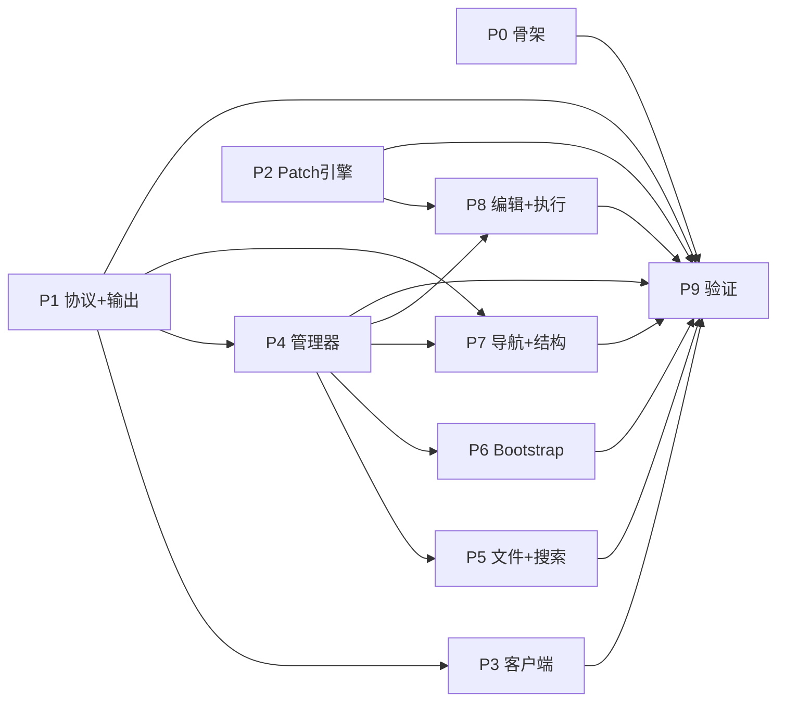

# P9 LSP 工具族

## 概览

| 属性 | 值 |
|------|-----|
| 预计总耗时 | 5.5 小时（关键路径） |
| 生产代码 | ~8,236 行 |
| 测试代码 | ~6,600 行 |
| Agent 数 | 10（9 实现 + 1 验证） |
| 最大并发 | 5 Agent |
| 可并行任务 | S/A/B → C1/C2 → D/E/F/G |
| 串行依赖 | [S,A,B] → [C1,C2](依赖A) → [D,E,F,G](依赖C2/A/B) → V(全部) |

## 任务依赖图



## 任务清单

- [ ] P0: Agent S — 骨架 (cmd/mcp-lsp/ ~210行)
- [ ] P1: Agent A — 协议+输出 (protocol/ + format/ ~1,040行) ⚡ 可与P0/P2并行
- [ ] P2: Agent B — Patch引擎 (edit/ ~776行) ⚡ 可与P0/P1并行
- [ ] P3: Agent C1 — gopls客户端 (client+transport ~580行) ← 依赖P1
- [ ] P4: Agent C2 — 管理器核心 (manager+symbols ~900行) ← 依赖P1
- [ ] P5: Agent D — 文件+搜索+诊断 (~1,220行) ← 依赖P4
- [ ] P6: Agent E — Bootstrap+健康 (~1,030行) ← 依赖P4
- [ ] P7: Agent F — 导航+结构+补全 (~1,060行) ← 依赖P4+P1
- [ ] P8: Agent G — 编辑+执行+胶水 (~1,420行) ← 依赖P4+P2 ★关键路径
- [ ] P9: Agent V — 验证 (build+vet+archtest+冒烟) ← 等待全部

## 文件分配矩阵

| 目录/文件 | S | A | B | C1 | C2 | D | E | F | G | 冲突 |
|-----------|:-:|:-:|:-:|:--:|:--:|:-:|:-:|:-:|:-:|:----:|
| `cmd/mcp-lsp/` | ✓ | | | | | | | | | 🟢 |
| `cmd/mcp-lsp/protocol/` | | ✓ | | | | | | | | 🟢 |
| `cmd/mcp-lsp/format/` | | ✓ | | | | | | | | 🟢 |
| `cmd/mcp-lsp/edit/` | | | ✓ | | | | | | | 🟢 |
| `cmd/mcp-lsp/gopls/client.go` | | | | ✓ | | | | | | 🟢 |
| `cmd/mcp-lsp/gopls/transport.go` | | | | ✓ | | | | | | 🟢 |
| `cmd/mcp-lsp/gopls/manager*.go` | | | | | ✓ | | | | | 🟢 |
| `cmd/mcp-lsp/gopls/gomod.go` | | | | | ✓ | | | | | 🟢 |
| `cmd/mcp-lsp/gopls/bootstrap*.go` | | | | | | | ✓ | | | 🟢 |
| `cmd/mcp-lsp/gopls/state.go` | | | | | | | ✓ | | | 🟢 |
| `cmd/mcp-lsp/gopls/pool.go` | | | | | | | ✓ | | | 🟢 |
| `cmd/mcp-lsp/gopls/recycler.go` | | | | | | | ✓ | | | 🟢 |
| `cmd/mcp-lsp/gopls/cache.go` | | | | | | | ✓ | | | 🟢 |
| `cmd/mcp-lsp/tools/tool_file.go` | | | | | | ✓ | | | | 🟢 |
| `cmd/mcp-lsp/tools/tool_grep.go` | | | | | | ✓ | | | | 🟢 |
| `cmd/mcp-lsp/tools/tool_diagnostics.go` | | | | | | ✓ | | | | 🟢 |
| `cmd/mcp-lsp/search/` | | | | | | ✓ | | | | 🟢 |
| `cmd/mcp-lsp/middleware/budget.go` | | | | | | ✓ | | | | 🟢 |
| `cmd/mcp-lsp/tools/tool_inspect.go` | | | | | | | | ✓ | | 🟢 |
| `cmd/mcp-lsp/tools/tool_xref.go` | | | | | | | | ✓ | | 🟢 |
| `cmd/mcp-lsp/tools/tool_structure.go` | | | | | | | | ✓ | | 🟢 |
| `cmd/mcp-lsp/tools/tool_completion.go` | | | | | | | | ✓ | | 🟢 |
| `cmd/mcp-lsp/tools/tool_edit*.go` | | | | | | | | | ✓ | 🟢 |
| `cmd/mcp-lsp/tools/tool_coderun*.go` | | | | | | | | | ✓ | 🟢 |
| `cmd/mcp-lsp/exec/` | | | | | | | | | ✓ | 🟢 |
| `cmd/mcp-lsp/middleware/logging,recovery,timeout.go` | | | | | | | | | ✓ | 🟢 |
| `docs/plans/迁移/p9-implementation-plan.md` | R | R | R | R | R | R | R | R | R | 🟢 只读 |

> 🟢 = 无冲突。所有 Agent 操作完全独立的文件集，零冲突。

## 关键路径

```
A(1.0h) → C2(0.75h) → G(1.75h) → V(2.0h) = 5.5h
```

## 守卫约束

| 约束 | 限值 |
|------|------|
| 单文件行数 | ≤400 |
| 单函数行数 | ≤80 |
| 圈复杂度 | CC≤10 |
| 单目录文件数 | ≤15 |
| 包总行数 | ≤4500 |
