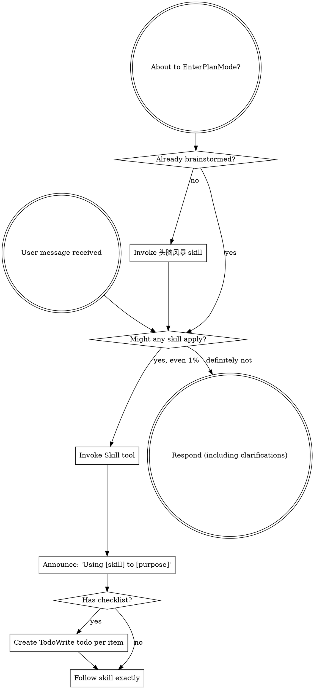

<SUBAGENT-STOP>
如果你是被派发来执行特定任务的子代理，跳过此技能。
</SUBAGENT-STOP>

<EXTREMELY-IMPORTANT>
如果你认为哪怕只有 1% 的可能性某个技能适用于你正在做的事，你也绝对必须调用该技能。

如果某个技能适用于你的任务，你没有选择。你必须使用它。

这不是可协商的。这不是可选的。你不能通过合理化绕开它。
</EXTREMELY-IMPORTANT>

## 指令优先级

Superpowers 技能会覆盖默认系统提示行为，但 **用户指令始终优先**：

1. **用户的显式指令**（CLAUDE.md、GEMINI.md、AGENTS.md、直接请求）：最高优先级
2. **Superpowers 技能**：在冲突处覆盖默认系统行为
3. **默认系统提示**：最低优先级

如果 CLAUDE.md、GEMINI.md 或 AGENTS.md 说“不要使用 TDD”，而某个技能说“始终使用 TDD”，遵循用户指令。用户掌控一切。

## 如何访问技能

**在 Claude Code 中：** 使用 `Skill` 工具。调用技能时，其内容会加载并呈现给你：直接遵循它。绝不要用 Read 工具读取技能文件。

**在 Copilot CLI 中：** 使用 `skill` 工具。技能会从已安装插件中自动发现。`skill` 工具的工作方式与 Claude Code 的 `Skill` 工具相同。

**在 Gemini CLI 中：** 通过 `activate_skill` 工具激活技能。Gemini 会在会话开始时加载技能元数据，并按需激活完整内容。

**在其他环境中：** 查看你的平台文档，了解技能如何加载。

## 平台适配

技能使用 Claude Code 的工具名称。非 CC 平台：查看 `references/copilot-tools.md`（Copilot CLI）、`references/codex-tools.md`（Codex）了解工具等价关系。Gemini CLI 用户会通过 GEMINI.md 自动加载工具映射。

# 使用技能

## 规则

**在任何回应或行动之前调用相关或被请求的技能。** 哪怕只有 1% 的可能性某个技能适用，也意味着你应该调用它来检查。如果调用的技能后来证明不适合当前情况，你不需要使用它。

## 红旗

这些想法意味着停止：你正在合理化：

| 想法 | 现实 |
|---------|---------|
| “这只是个简单问题” | 问题也是任务。检查技能。 |
| “我需要先获得更多上下文” | 技能检查在澄清问题之前。 |
| “我先探索代码库” | 技能告诉你如何探索。先检查。 |
| “我可以快速看一下 git/文件” | 文件缺少对话上下文。检查技能。 |
| “我先收集信息” | 技能告诉你如何收集信息。 |
| “这不需要正式技能” | 如果技能存在，就使用它。 |
| “我记得这个技能” | 技能会变化。读取当前版本。 |
| “这不算任务” | 行动 = 任务。检查技能。 |
| “这个技能太重了” | 简单事情会变复杂。使用它。 |
| “我先只做这一步” | 做任何事前先检查。 |
| “这感觉很有产出” | 无纪律行动会浪费时间。技能能防止这种情况。 |
| “我知道那是什么意思” | 知道概念 ≠ 使用技能。调用它。 |

## 技能优先级

当多个技能可能适用时，按此顺序使用：

1. **流程技能优先**（头脑风暴、debugging）：它们决定如何处理任务
2. **实现技能其次**（frontend-design、mcp-builder）：它们指导执行

“让我们构建 X” → 先 头脑风暴，再实现技能。
“修这个 bug” → 先 debugging，再领域技能。

## 技能类型

**刚性**（TDD、debugging）：严格遵循。不要偏离纪律。

**弹性**（模式）：根据上下文调整原则。

技能本身会告诉你它属于哪种。

## 用户指令

指令说明的是做什么，不是怎么做。“添加 X” 或 “修复 Y” 不表示可以跳过工作流。
