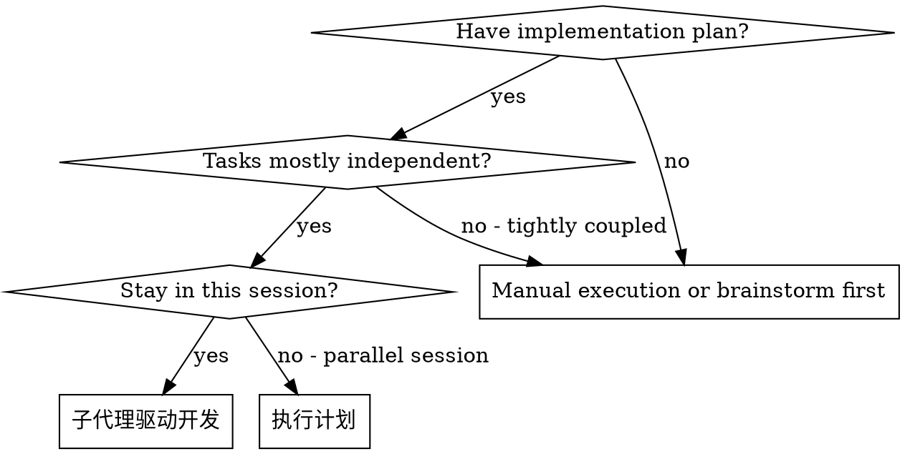

```dot
digraph when_to_use {
    "Have implementation plan?" [shape=diamond];
    "Tasks mostly independent?" [shape=diamond];
    "Stay in this session?" [shape=diamond];
    "子代理驱动开发" [shape=box];
    "执行计划" [shape=box];
    "Manual execution or brainstorm first" [shape=box];

    "Have implementation plan?" -> "Tasks mostly independent?" [label="yes"];
    "Have implementation plan?" -> "Manual execution or brainstorm first" [label="no"];
    "Tasks mostly independent?" -> "Stay in this session?" [label="yes"];
    "Tasks mostly independent?" -> "Manual execution or brainstorm first" [label="no - tightly coupled"];
    "Stay in this session?" -> "子代理驱动开发" [label="yes"];
    "Stay in this session?" -> "执行计划" [label="no - parallel session"];
}
```

**相比 Executing Plans（并行会话）：**
- 同一会话（无需切换上下文）
- 每个任务使用新子代理（避免上下文污染）
- 每个任务后两阶段审查：先规格符合性，再代码质量
- 迭代更快（任务之间不需要人工介入）
