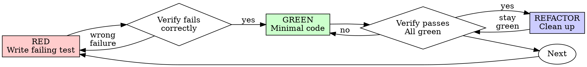

# 测试驱动开发（TDD）

## 概览

先写测试。看它失败。再写最少的代码让它通过。

**核心原则：** 如果你没有看见测试失败，就不知道它是否测试了正确的东西。

**违反规则的字面要求，就是违反规则精神。**

## 何时使用

**始终使用：**
- 新功能
- Bug 修复
- 重构
- 行为变更

**例外（询问你的协作者）：**
- 一次性原型
- 生成代码
- 配置文件

如果你在想“这次就跳过 TDD”，停下。这是合理化借口。

## 铁律

```
NO PRODUCTION CODE WITHOUT A FAILING TEST FIRST
```

在测试前写了代码？删除它。重新开始。

**没有例外：**
- 不要把它保留为“参考”
- 不要在写测试时“改造”它
- 不要看它
- 删除就是删除

从测试重新实现。就是这样。

## 红-绿-重构



### RED：编写失败测试

写一个最小测试，展示应该发生什么。

<Good>
```typescript
test('retries failed operations 3 times', async () => {
  let attempts = 0;
  const operation = () => {
    attempts++;
    if (attempts < 3) throw new Error('fail');
    return 'success';
  };

  const result = await retryOperation(operation);

  expect(result).toBe('success');
  expect(attempts).toBe(3);
});
```
名称清楚，测试真实行为，只测一件事
</Good>

<Bad>
```typescript
test('retry works', async () => {
  const mock = jest.fn()
    .mockRejectedValueOnce(new Error())
    .mockRejectedValueOnce(new Error())
    .mockResolvedValueOnce('success');
  await retryOperation(mock);
  expect(mock).toHaveBeenCalledTimes(3);
});
```
名称含糊，测试的是 mock 而不是代码
</Bad>

**要求：**
- 一个行为
- 名称清晰
- 真实代码（除非不可避免，否则不用 mock）

### 验证 RED：看它失败

**强制执行。绝不要跳过。**

```bash
# Go 单文件改动
./scripts/test_with_guard.sh path/to/file.go

# Go 包改动
./scripts/test_with_guard.sh ./affected/package -count=1

# frontend-app 改动
cd frontend-app && npm test -- path/to/test.test.ts
```

确认：
- 测试失败（不是报错）
- 失败消息符合预期
- 因功能缺失而失败（不是拼写错误）

**测试通过？** 你在测试已有行为。修正测试。

**测试报错？** 修复错误，重新运行，直到它正确失败。

### GREEN：最小代码

写最简单的代码让测试通过。

<Good>
```typescript
async function retryOperation<T>(fn: () => Promise<T>): Promise<T> {
  for (let i = 0; i < 3; i++) {
    try {
      return await fn();
    } catch (e) {
      if (i === 2) throw e;
    }
  }
  throw new Error('unreachable');
}
```
刚好足够通过
</Good>

<Bad>
```typescript
async function retryOperation<T>(
  fn: () => Promise<T>,
  options?: {
    maxRetries?: number;
    backoff?: 'linear' | 'exponential';
    onRetry?: (attempt: number) => void;
  }
): Promise<T> {
  // YAGNI
}
```
过度设计
</Bad>

不要添加功能、重构其他代码，或做超出测试要求的“改进”。

### 验证 GREEN：看它通过

**强制执行。**

```bash
npm test path/to/test.test.ts
```

确认：
- 测试通过
- 其他测试仍通过
- 输出干净（没有错误、警告）

**测试失败？** 修代码，不修测试。

**其他测试失败？** 现在就修。

### REFACTOR：清理

只有在 green 之后：
- 移除重复
- 改进命名
- 提取 helper

保持测试为绿。不要添加行为。

### 重复

为下一个功能写下一个失败测试。

## 好测试

| 质量 | 好 | 坏 |
|---------|------|-----|
| **最小** | 一件事。名称里有 “and”？拆开。 | `test('validates email and domain and whitespace')` |
| **清晰** | 名称描述行为 | `test('test1')` |
| **展示意图** | 展示期望 API | 掩盖代码应该做什么 |

## 为什么顺序重要

**“我之后再写测试来验证它能工作”**

代码之后写的测试会立即通过。立即通过什么也证明不了：
- 可能测试了错误内容
- 可能测试实现而不是行为
- 可能漏掉你忘记的边界情况
- 你从未看见它抓住 bug

测试先行迫使你看到测试失败，证明它确实测试了某些东西。

**“我已经手动测试了所有边界情况”**

手动测试是临时的。你以为自己测了所有内容，但：
- 没有测试记录
- 代码变更时无法重跑
- 压力下很容易忘记情况
- “我试的时候能用” ≠ 全面

自动化测试是系统化的。它每次都以同样方式运行。

**“删除 X 小时工作是浪费”**

沉没成本谬误。时间已经花掉了。现在的选择是：
- 删除并用 TDD 重写（再花 X 小时，高置信度）
- 保留它并事后加测试（30 分钟，低置信度，很可能有 bug）

真正的“浪费”是保留你不能信任的代码。没有真实测试的可工作代码就是技术债。

**“TDD 太教条，务实意味着要适配”**

TDD 就是务实：
- 提交前发现 bug（比事后调试更快）
- 防止回归（测试立即捕获破坏）
- 记录行为（测试展示如何使用代码）
- 支持重构（放心修改，测试会捕获破坏）

“务实”捷径 = 在生产中调试 = 更慢。

**“事后测试也能达到同样目标，这重在精神而不是仪式”**

不。事后测试回答“它做了什么？”测试先行回答“它应该做什么？”

事后测试会被你的实现影响。你测试的是你构建了什么，而不是需求是什么。你验证的是记得的边界情况，不是先发现的边界情况。

测试先行迫使你在实现前发现边界情况。事后测试只是验证你是否记住了一切（你不会）。

30 分钟事后测试 ≠ TDD。你获得覆盖率，但失去测试有效性的证明。

## 常见合理化借口

| 借口 | 现实 |
|--------|---------|
| “太简单，不用测” | 简单代码也会坏。测试只要 30 秒。 |
| “我之后再测” | 立即通过的测试什么也证明不了。 |
| “事后测试也能达到同样目标” | 事后测试 = “这做了什么？” 测试先行 = “这应该做什么？” |
| “已经手动测过” | 临时测试 ≠ 系统化。没有记录，无法重跑。 |
| “删除 X 小时太浪费” | 沉没成本谬误。保留未验证代码是技术债。 |
| “保留作参考，先写测试” | 你会改造它。这就是事后测试。删除就是删除。 |
| “需要先探索” | 可以。丢弃探索结果，然后从 TDD 开始。 |
| “测试很难 = 设计不清” | 听测试的。难测试 = 难使用。 |
| “TDD 会拖慢我” | TDD 比调试快。务实 = 测试先行。 |
| “手动测试更快” | 手动无法证明边界情况。每次变更都要重测。 |
| “现有代码没有测试” | 你正在改进它。为现有代码补测试。 |

## 红旗：停止并重新开始

- 先写代码后写测试
- 实现后补测试
- 测试立即通过
- 说不清测试为什么失败
- “稍后”添加测试
- 为“这次例外”找理由
- “我已经手动测过”
- “事后测试也能达到同样目的”
- “重在精神，不是仪式”
- “保留作参考” 或 “改造现有代码”
- “已经花了 X 小时，删除太浪费”
- “TDD 太教条，我很务实”
- “这次不一样，因为……”

**这些都意味着：删除代码。从 TDD 重新开始。**

## 示例：Bug 修复

**Bug：** 空 email 被接受

**RED**
```typescript
test('rejects empty email', async () => {
  const result = await submitForm({ email: '' });
  expect(result.error).toBe('Email required');
});
```

**验证 RED**
```bash
$ npm test
FAIL: expected 'Email required', got undefined
```

**GREEN**
```typescript
function submitForm(data: FormData) {
  if (!data.email?.trim()) {
    return { error: 'Email required' };
  }
  // ...
}
```

**验证 GREEN**
```bash
$ npm test
PASS
```

**REFACTOR**
必要时提取多字段验证。

## 验证检查清单

标记工作完成前：

- [ ] 每个新函数/方法都有测试
- [ ] 实现前看过每个测试失败
- [ ] 每个测试都因预期原因失败（功能缺失，而不是拼写错误）
- [ ] 写了最小代码让每个测试通过
- [ ] 所有测试通过
- [ ] 输出干净（没有错误、警告）
- [ ] 测试使用真实代码（仅在不可避免时使用 mock）
- [ ] 覆盖边界情况和错误

不能勾选所有项？你跳过了 TDD。重新开始。

## 卡住时

| 问题 | 解决方案 |
|---------|----------|
| 不知道如何测试 | 写理想 API。先写断言。询问你的协作者。 |
| 测试太复杂 | 设计太复杂。简化接口。 |
| 必须 mock 一切 | 代码耦合过高。使用依赖注入。 |
| 测试设置巨大 | 提取 helper。仍复杂？简化设计。 |

## 调试集成

发现 bug？写一个失败测试复现它。遵循 TDD 循环。测试证明修复并防止回归。

绝不要在没有测试的情况下修 bug。

## 测试反模式

添加 mock 或测试工具时，读取 @testing-anti-patterns.md，避免常见陷阱：
- 测试 mock 行为而不是真实行为
- 向生产类添加仅供测试使用的方法
- 在不理解依赖的情况下 mock

## 最终规则

```
Production code → test exists and failed first
Otherwise → not TDD
```

除非你的协作者允许，否则没有例外。
