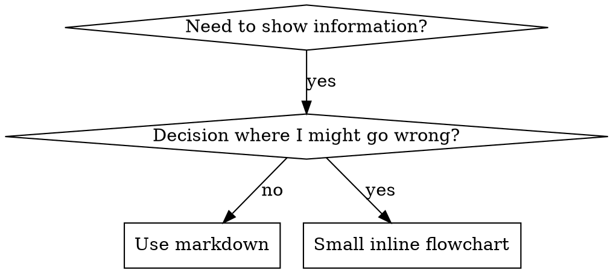

**只在以下情况使用流程图：**
- 非显而易见的决策点
- 你可能太早停止的流程循环
- “何时用 A vs B” 决策

**绝不要为以下内容使用流程图：**
- 参考资料 → 表格、列表
- 代码示例 → Markdown 代码块
- 线性指令 → 编号列表
- 没有语义意义的标签（step1、helper2）

Graphviz 样式规则见 @graphviz-conventions.dot。

**为你的协作者可视化：** 使用本目录中的 `render-graphs.js` 将技能流程图渲染为 SVG：
```bash
./render-graphs.js ../some-skill           # Each diagram separately
./render-graphs.js ../some-skill --combine # All diagrams in one SVG
```
