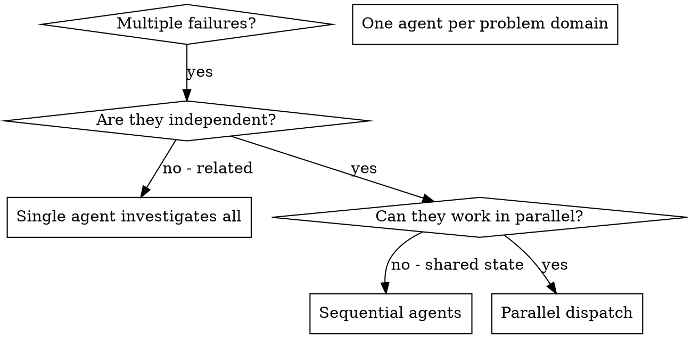

```dot
digraph when_to_use {
    "Multiple failures?" [shape=diamond];
    "Are they independent?" [shape=diamond];
    "Single agent investigates all" [shape=box];
    "One agent per problem domain" [shape=box];
    "Can they work in parallel?" [shape=diamond];
    "Sequential agents" [shape=box];
    "Parallel dispatch" [shape=box];

    "Multiple failures?" -> "Are they independent?" [label="yes"];
    "Are they independent?" -> "Single agent investigates all" [label="no - related"];
    "Are they independent?" -> "Can they work in parallel?" [label="yes"];
    "Can they work in parallel?" -> "Parallel dispatch" [label="yes"];
    "Can they work in parallel?" -> "Sequential agents" [label="no - shared state"];
}
```

**适用场景：**
- 3 个以上测试文件失败，且根因不同
- 多个子系统独立损坏
- 每个问题不需要其他问题的上下文就能理解
- 调查之间没有共享状态

**不适用场景：**
- 失败彼此相关（修复一个可能修复其他）
- 需要理解完整系统状态
- 代理会相互干扰
