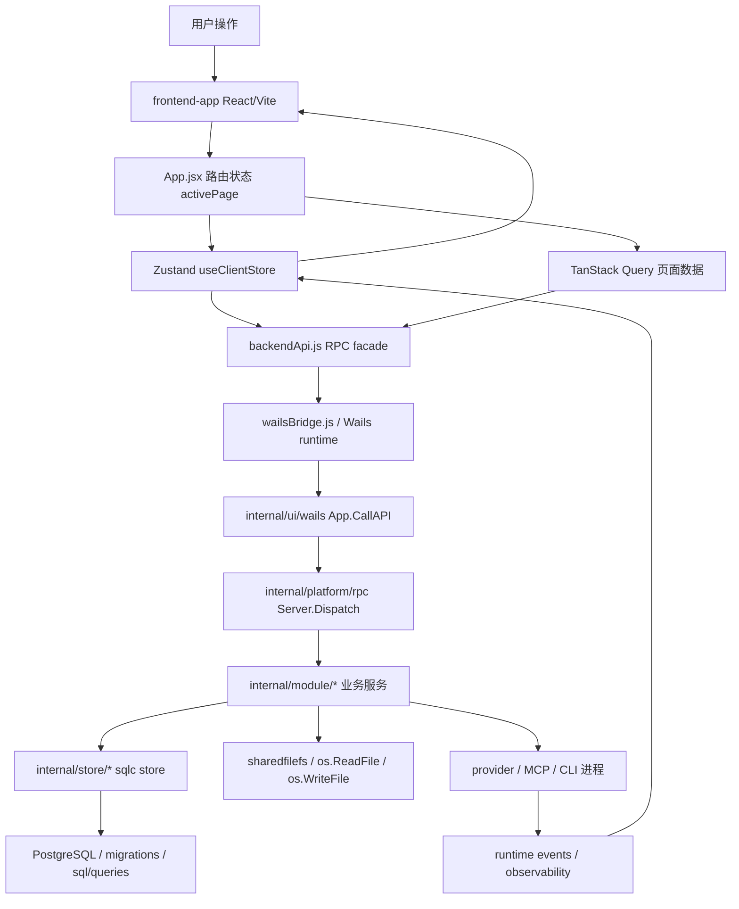
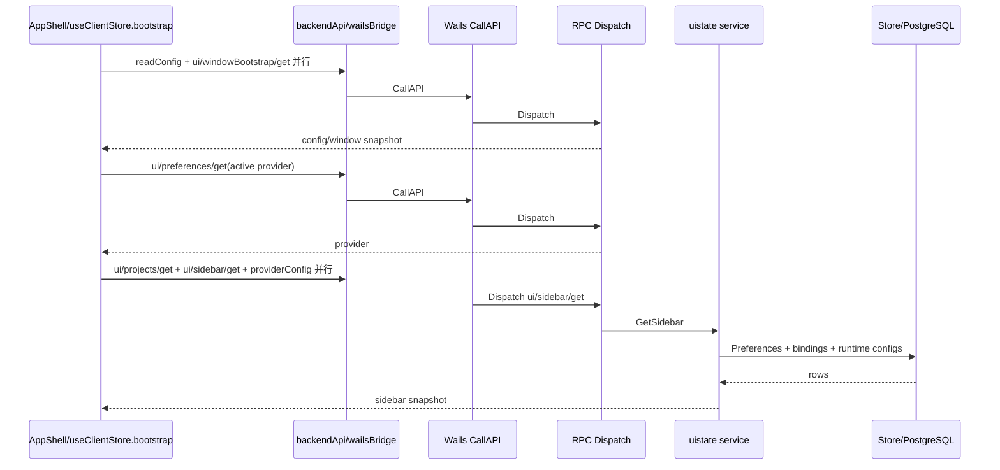
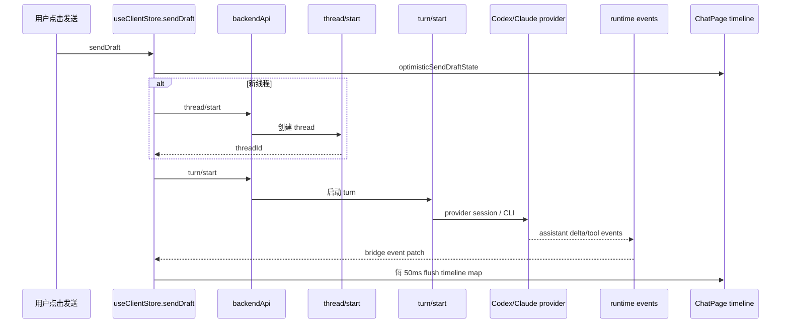
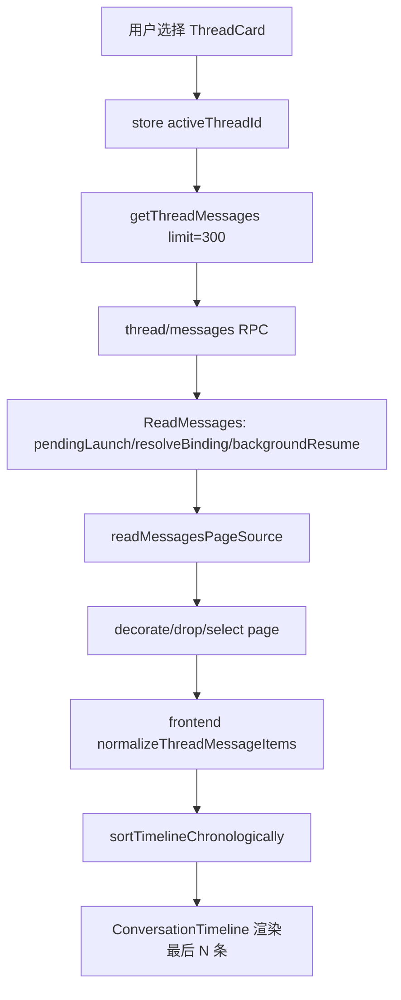
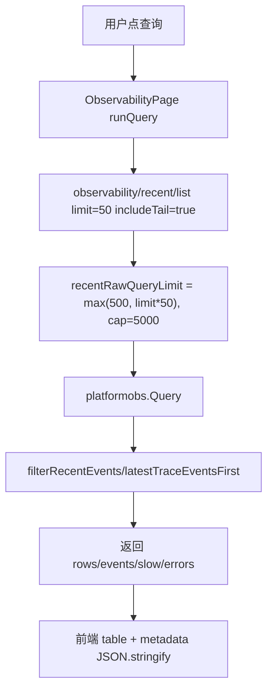

# Super-Dolphin 前后端整体性能指标评估与瓶颈定位

审计日期：2026-06-09
审计范围：当前主线产品面 `frontend-app/` React/Vite UI、`cmd/agent-terminal` Wails 桌面宿主、Go RPC/业务模块、sqlc/PostgreSQL 数据访问层。
执行约束：本报告只做扫描和性能审计，不修改业务代码。后续如需修复，应先确认优先级、修改计划、风险和回滚方案。

## 0. 审计方法与边界

本次结论来自源码扫描、关键调用链阅读和当前构建产物尺寸采样。没有启动真实桌面端做 Chrome Performance / React Profiler / Go pprof 实测，因此 FCP、LCP、P95 等运行时数值在本文中被定义为“指标体系与目标值”，当前风险以代码证据和可验证路径为依据。

已采样的构建体积：

```text
frontend-app/dist     4.1M
frontend-app/src      2.1M

当前 dist 中较大的资源：
580K  assets/chunk-NNHCCRGN-CJl81Ioh.js
528K  assets/index-DXQQpagn.js
428K  assets/cytoscape.esm-FqbQrHcz.js
256K  assets/katex-Vhh-h91d.js
180K  assets/react-core-05sbo8Qa.js
140K  assets/index-BiBIfQcY.css
```

关键判断：

- 当前产品主 UI 是 `frontend-app/`，不是 legacy Vue：`README.md:15`、`docs/doc/codemap/README.md:7`。
- 当前审计未发现可直接定为 P0 的性能缺陷。最值得优先处理的是 P1 级结构性问题：首屏静态加载、Zustand 全局订阅、聊天流式 O(n) 更新、启动多轮 RPC、`ui/sidebar/get` DB enrich 热点。
- 后端已有部分性能观测基础：Wails / RPC 层记录慢调用，但缺少跨端 bytes、React 子组件、DB 查询耗时和文件 IO 耗时的闭环指标。

## 1. 项目性能总览

### 1.1 技术栈识别

| 层级 | 技术栈 | 证据 |
|---|---|---|
| 当前前端 | React 19、Zustand 5、TanStack Query 5、lucide-react、mermaid | `frontend-app/package.json:18-25` |
| 前端构建 | Vite 8、@vitejs/plugin-react、Vitest、ESLint | `frontend-app/package.json:13-16`、`frontend-app/vite.config.js:65-87` |
| 桌面框架 | Wails v3 | `go.mod:18`、`cmd/agent-terminal` 架构说明见 `README.md:9-15` |
| 后端语言 | Go 1.25.7 | `go.mod:3` |
| 后端框架/通信 | Fx、jrpc2、本地 Dispatch + Wails bridge | `go.mod:6`、`go.mod:19`、`internal/platform/rpc/server.go:269-308` |
| 数据库 | PostgreSQL、pgxpool、sqlc | `go.mod:10`、`internal/platform/db/module.go:28-42` |
| 数据访问 | `internal/store` + `sql/queries` + sqlc 生成代码 | `README.md:17-23` |
| 运行时外部进程 | Claude CLI / Codex CLI / MCP sidecar | `README.md:31-35`、`README.md:9-15` |
| 本地存储/文件 | shared_files DB + 磁盘 sharedfile；frontend localStorage 存主题 | `internal/store/sharedfile/store.go:46-73`、`frontend-app/src/App.jsx:94-105` |

### 1.2 模块结构图



### 1.3 前端模块结构

| 模块 | 文件/函数 | 性能角色 |
|---|---|---|
| 应用入口 | `frontend-app/src/main.jsx:28-38` | React root + App 级 Profiler |
| 页面注册/路由 | `frontend-app/src/App.jsx:15-35`、`frontend-app/src/App.jsx:258-287` | activePage 内部分发，无 React Router；所有页面静态 import |
| 全局状态 | `frontend-app/src/entities/client/model/useClientStore.js:5704` | Zustand store，Chat/App 主要状态集中于单 store |
| API 调用层 | `frontend-app/src/shared/api/backendApi.js:22-136` | RPC method 索引与参数校验 |
| Wails bridge | `frontend-app/src/shared/api/wailsBridge.js:801-825` | 每次 RPC 注入 trace、跨桥调用、记录 done/failed |
| 聊天主页面 | `frontend-app/src/pages/chat/ChatPage.jsx` | 最大交互面，包含线程列表、timeline、Markdown/diff/Mermaid 渲染 |
| 文件页面 | `frontend-app/src/pages/files/FilesPage.jsx:57-63`、`:367-386` | dashboard/sharedFiles 全局查询，sharedFilesRevision 触发刷新 |
| 观测页面 | `frontend-app/src/pages/observability/ObservabilityPage.jsx:193-213` | recent/list 查询与 trace 展开 |

### 1.4 后端模块结构

| 模块 | 文件/函数 | 性能角色 |
|---|---|---|
| Wails API 桥 | `internal/ui/wails/binding.go:49-70` | 桌面前后端桥接入口，记录 Wails 调用耗时 |
| RPC Dispatch | `internal/platform/rpc/server.go:269-308` | 本地 jrpc2 dispatch，记录 backend RPC 耗时 |
| UI state/sidebar | `internal/module/uistate/rpc.go:45-54`、`service.go:213-233` | 启动/切项目高频读路径 |
| Thread history | `internal/module/thread/rpc.go:49-51`、`history.go:53-95` | 聊天历史分页读取、binding 解析、session 恢复 |
| Dashboard | `internal/module/dashboard/rpc.go:245-248`、`ui_page.go:54-88` | 页面聚合读，使用 errgroup 并发 loader |
| Shared file | `internal/module/dashboard/rpc.go:275-292`、`internal/store/sharedfile/store.go:133-145` | 列表最多 500 项，详情可读磁盘内容 |
| DB pool | `internal/platform/db/module.go:28-42` | pgxpool 固定 MaxConns=100 |
| SQL 热点 | `sql/queries/*.sql` | 模糊查询、聚合、JSONB tag scan |

## 2. 最可能导致“前端响应慢”的 Top 10 原因

| 排名 | 风险 | 等级 | 代码证据 | 影响 |
|---:|---|---|---|---|
| 1 | 页面级代码没有懒加载，所有页面在 `App.jsx` 顶部静态 import | P1 | `frontend-app/src/App.jsx:5-13`、`:258-287` | 首屏 JS 解析/执行压力高，非当前页面也进入首屏 bundle 依赖图 |
| 2 | AppShell 订阅整个 Zustand store | P1 | `frontend-app/src/App.jsx:352-355` | streaming、sidebar、warnings、revision 更新可能触发 App 级重渲染 |
| 3 | assistant streaming 每 50ms flush，更新 timeline 时 `map` 全数组 | P1 | `useClientStore.js:52`、`:3876-3915` | 长会话中每批 delta 都是 O(n)，UI 线程易被长任务占用 |
| 4 | 启动链路多轮 Wails RPC，且 `getPreference` 在首轮后串行发生 | P1 | `useClientStore.js:4314-4342` | 首屏 ready 依赖跨桥多次往返；`ui/sidebar/get` 慢会拖住启动 |
| 5 | `ui/sidebar/get` 做 Preferences、snapshot、DB enrich，并已有分段耗时日志 | P1 | `uistate/service.go:213-233`、`module.go:127-157` | 切项目/启动/刷新 sidebar 时后端读放大 |
| 6 | ThreadRail 对所有线程 filter + map 渲染，无虚拟列表 | P2 | `ChatPage.jsx:2307-2359` | 线程数多时 sidebar 交互卡顿，hover/rename/delete 状态也触发列表重算 |
| 7 | Timeline 只是“物化窗口”，不是虚拟滚动，且 MutationObserver 监听 subtree/characterData | P2 | `ChatPage.jsx:53-55`、`:5390-5406`、`:5516-5535` | 长消息/流式字符变更触发滚动修正；DOM 和布局压力随消息增长 |
| 8 | Markdown/diff/table/JSON 格式化在 UI 线程同步执行 | P2 | `ChatPage.jsx:4183-4203`、`:4205+`、`:4115` | 大 diff、大 JSON、大 Markdown 会直接阻塞渲染 |
| 9 | Observability recent/list 默认 50 行但后端最多扩大读 2500-5000 原始事件再筛选 | P2 | `ObservabilityPage.jsx:193-213`、`observability/rpc.go:165-180`、`:468-480` | 开发者页面查询可能把后端过滤、前端渲染和 JSON 传输拉高 |
| 10 | shared files 列表/详情含大文本，跨桥传输与 JSON 序列化成本高 | P2 | `FilesPage.jsx:57-63`、`:513-529`、`dashboard/rpc.go:275-292`、`sharedfile/store.go:46-73` | 大 shared file 或 500 项列表时，数据加载和详情打开变慢 |

## 3. 前端性能问题清单

### FE-01 所有页面静态导入，首屏 bundle 偏大

等级：P1
影响范围：首屏加载、桌面启动后首次显示、低性能机器上的 JS parse/execute。
证据：

```jsx
// frontend-app/src/App.jsx:5-13
import { ChatPage } from './pages/chat/ChatPage.jsx';
import { FilesPage } from './pages/files/FilesPage.jsx';
import { MemoryPage } from './pages/memory/MemoryPage.jsx';
import { ObservabilityPage } from './pages/observability/ObservabilityPage.jsx';
import { PromptPage } from './pages/prompts/PromptPage.jsx';
import { SettingsPage } from './pages/settings/SettingsPage.jsx';
import { SkillsPage } from './pages/skills/SkillsPage.jsx';
import { WorkflowPage } from './pages/workflows/WorkflowPage.jsx';
```

`ActivePageContent` 再通过 `store.activePage` 条件渲染页面：`frontend-app/src/App.jsx:258-287`。这意味着非当前页面模块仍参与初始加载。Vite 配置已有依赖级 manualChunks：`frontend-app/vite.config.js:73-83`，但没有页面级切分。当前 dist 仍存在 528K / 580K 业务 chunk。

可验证指标：

- 初始 JS 下载/解析/执行耗时。
- `performance.getEntriesByType('resource')` 中 initial route JS bytes。
- Chrome Performance 的 Scripting 时间。

优化建议：

- 用 `React.lazy` / dynamic import 对 `Prompts`、`Workflow`、`Skills`、`Memory`、`Files`、`Observability`、`Settings` 做页面级懒加载。
- 保持 `ChatPage` 为默认首屏，但 Mermaid/Katex/Cytoscape 继续动态加载。
- 用稳定 skeleton，不让 fallback 改变页面布局。

### FE-02 `AppShell` 订阅整个 Zustand store，导致全局重渲染面过大

等级：P1
影响范围：所有页面，尤其聊天 streaming、sidebar refresh、warnings、revision 事件。
证据：

```jsx
// frontend-app/src/App.jsx:352-355
function AppShell({ skipBootstrap = false }) {
  const store = useClientStore();
  const shell = useAppShellState(store, skipBootstrap);
  return <AppWindow {...shell} store={store} />;
}
```

`useClientStore` 只有全量订阅调用：`frontend-app/src/App.jsx:353`、`frontend-app/src/pages/settings/SettingsPage.jsx:356`。当前未见 `subscribeWithSelector` / shallow selector 用法。store 定义集中在 `frontend-app/src/entities/client/model/useClientStore.js:5704`。

可验证指标：

- App Profiler `actualDuration` 和 render count。
- streaming 时 App、Titlebar、NavRail、ThreadRail、ConversationTimeline 的 render 次数。
- Zustand state patch 频率与每次影响字段数量。

优化建议：

- `AppShell` 改成 selector 订阅：`activePage`、`cwd`、`activeProject`、`bootstrapStatus`、revision 字段分开取。
- Chat 子树通过局部 selector 订阅 timeline、thread list、composer 状态。
- 高更新频率字段，如 streaming delta、runtime stats，避免穿过整个 `store` prop。

### FE-03 聊天流式增量每 50ms flush 且 O(n) 更新 timeline

等级：P1
影响范围：长会话、长回答、模型流式输出、代码 diff 输出。
证据：

```js
// frontend-app/src/entities/client/model/useClientStore.js:52
const ASSISTANT_DELTA_FLUSH_MS = 50;

// frontend-app/src/entities/client/model/useClientStore.js:3876-3889
set((state) => {
  const timelinesByThread = { ...state.timelinesByThread };
  for (const entry of entries) {
    const timeline = timelinesByThread[entry.threadId] || [];
    const nextTimeline = timeline.map((item) => {
      if (item.id !== entry.itemId) return item;
      return { ...item, text: appendAssistantDeltaText(item.text, entry.delta), done: false };
    });
```

每次 flush 对当前 thread timeline `map`，长会话中是 O(n)。如果一个回答持续 60 秒，按 50ms 批量最多约 1200 次 flush，虽然有 buffer 合并，但每次仍可能遍历当前 timeline。

可验证指标：

- `frontend.patch.apply.slow` 事件数量和 duration。
- 单次 assistant delta flush 更新的 timeline 长度。
- Chrome Long Task > 50ms 次数。

优化建议：

- 将 timeline 存储拆成 `{ids, byId}`，更新单 item 为 O(1)，渲染层用 memoized selector 输出可见窗口。
- 对同一 item 的 text append 使用更粗粒度调度：例如 requestAnimationFrame + 最小 100ms 或按字符量阈值。
- 对大文本使用增量渲染或虚拟化 code/diff block。

### FE-04 首屏 bootstrap 多轮跨桥调用，关键路径仍偏长

等级：P1
影响范围：桌面启动、切窗口 bootstrap、后端慢时白屏/加载等待。
证据：

```js
// frontend-app/src/entities/client/model/useClientStore.js:4314-4342
const [config, rawWindowBootstrap] = await Promise.all([readConfig(), getWindowBootstrap()]);
const activeProvider = requireActiveProviderPreference(
  await getPreference({ cwd: scopedCwd, key: PROVIDER_ACTIVE_PREF_KEY }),
  'frontend-app bootstrap',
);
const [projects, sidebar] = await Promise.all([
  getProjects({ cwd: scopedCwd }),
  getSidebarState({ cwd: scopedCwd }),
  runtime.loadProviderConfig(scopedCwd, activeProvider),
]);
```

`readConfig/getWindowBootstrap` 并行，之后 `getPreference` 串行，再并行 `getProjects/getSidebarState/loadProviderConfig`。每个 RPC 走 `backendApi -> wailsBridge.callAPI -> Wails CallAPI -> RPC Dispatch`。

可验证指标：

- 首屏 `bootstrap.start -> bootstrap.ready` duration。
- bootstrap 阶段 RPC 次数、总 bytes、最长 RPC 方法。
- `ui/sidebar/get` 的 `total_ms` 与 `enrich_db_ms`。

优化建议：

- 后端提供合并型 `ui/windowBootstrap/get` 或 `ui/bootstrap/get`，一次返回 config、window snapshot、active provider、projects、sidebar、provider config。
- 若不合并接口，至少将 active provider 和 provider config 合并进 sidebar/bootstrap 返回，减少一轮跨桥等待。
- 前端 UI 先显示基础 shell，sidebar/provider config 后续渐进加载。

### FE-05 Timeline 不是完整虚拟列表，MutationObserver 可能放大滚动开销

等级：P2
影响范围：长线程、长 Markdown、大量图片/代码块、流式输出。
证据：

```js
// frontend-app/src/pages/chat/ChatPage.jsx:53-55
const TIMELINE_INITIAL_MATERIALIZED_MESSAGES = 80;
const TIMELINE_MATERIALIZATION_INCREMENT = 80;

// frontend-app/src/pages/chat/ChatPage.jsx:5393-5402
const observer = new MutationObserver(() => {
  if (...) scrollTimelineElementToBottom(el, false);
});
observer.observe(el, { childList: true, subtree: true, characterData: true });

// frontend-app/src/pages/chat/ChatPage.jsx:5516-5535
const visibleMessages = useMemo(() => messages.slice(visibleStart), [messages, visibleStart]);
```

当前做了“只显示最后 N 条”的物化窗口，但不是基于 item 高度的虚拟滚动。`MutationObserver` 对 subtree 和 characterData 都监听，流式 text 更新会频繁触发滚动修正。

可验证指标：

- 长会话下 DOM 节点数、layout/recalc style 次数。
- MutationObserver 回调频率。
- timeline scroll correction 总耗时。

优化建议：

- 用虚拟列表库或自研轻量 variable-size virtualization，只渲染视口附近消息。
- MutationObserver 改为更窄触发条件，优先用 streaming flush 后显式调度滚动。
- 对代码块、表格、diff 单独虚拟化或折叠渲染。

### FE-06 ThreadRail 全量 filter/map，无虚拟滚动

等级：P2
影响范围：项目会话数多、归档列表多、频繁 hover/rename/delete。
证据：

```jsx
// frontend-app/src/pages/chat/ChatPage.jsx:2307-2359
const activeThreads = store.threads.filter((thread) => !thread.archived);
const archivedThreads = store.threads.filter((thread) => thread.archived);
const visibleThreads = visibleThreadRows(threads, store);
...
{visibleThreads.map((thread) => <ThreadCard key={thread.id} ... />)}
```

可验证指标：

- 线程数 100 / 500 / 1000 下 sidebar render duration。
- hover/rename 时 ThreadCard re-render 数。

优化建议：

- 对 ThreadRail 使用 fixed-size virtualization。
- 把 active/archived/filter 结果 memo 化，并避免 hover 状态导致全列表重渲染。
- 后端 sidebar snapshot 支持分页或最近 N + 搜索。

### FE-07 Markdown/diff/JSON 大文本在 UI 线程同步处理

等级：P2
影响范围：模型输出大 diff、JSON、日志、配置文本，尤其代码审计/工具输出场景。
证据：

```jsx
// frontend-app/src/pages/chat/ChatPage.jsx:4183-4192
{outputText.split('\n').map((line, index) => (
  <span key={`${kind}-${index}`} className={diffLineClass(line)}>{line || ' '}</span>
))}

// frontend-app/src/pages/chat/ChatPage.jsx:4115
return JSON.stringify(JSON.parse(trimmed), null, 2);
```

可验证指标：

- 单条消息字符数、行数与 render duration 的关系。
- StructuredMessage 对 1k/10k/50k 行 diff 的耗时。

优化建议：

- 对超过阈值的 diff/log/code block 默认折叠或按行虚拟化。
- JSON parse/stringify 移到 Web Worker 或按需展开时执行。
- 对 Markdown AST/块解析做 memo，以 `message.id + textRevision` 为 key。

### FE-08 Observability recent 查询读放大与前端格式化风险

等级：P2
影响范围：链路追踪页面、故障排查时的开发者体验。
证据：

```jsx
// frontend-app/src/pages/observability/ObservabilityPage.jsx:193-200
const params = { ...buildRecentParams(), includeTail: true };
const result = await getObservabilityRecent(params);

// internal/module/observability/rpc.go:165-173
limit := normalizeLimit(p.Limit, defaultListLimit)
query := platformobs.Query{Limit: recentRawQueryLimit(limit), IncludeTail: ...}

// internal/module/observability/rpc.go:468-480
rawLimit := displayLimit * recentRawLimitMultiple // 50x
rawLimit min 500, max 5000
```

前端还会对 metadata 做稳定 JSON 输出：`frontend-app/src/pages/observability/ObservabilityPage.jsx:724-727`。

可验证指标：

- recent/list 请求读取原始事件数、返回事件数、响应 bytes。
- 展开 trace 时 metadata JSON stringify 耗时。

优化建议：

- 后端优先按 status/component/method/thread/keyword 下推过滤，减少 rawLimit 放大。
- 返回 recent row 摘要，展开时再取 trace full events。
- 前端对 metadata 大对象延迟格式化。

### FE-09 shared files 列表与详情可能传输大对象

等级：P2
影响范围：共享文件页面、工作流 final output 查看、大文件内容预览。
证据：

```js
// frontend-app/src/pages/files/FilesPage.jsx:57-63
const response = await withTimeout(listSharedFiles(), ...);

// internal/module/dashboard/rpc.go:275-292
"dashboard/sharedFiles" -> svc.ListSharedFiles -> filesResponse{Files, FinalOutputRefs, Retention}

// internal/module/dashboard/ui_page.go:345-348
s.sharedFiles.List(ctx, sharedfilestore.ListFilter{Limit: dashboardMemoryLimit}) // 500

// internal/store/sharedfile/store.go:46-73
data, _, readErr := sharedfilefs.ReadDisk(abs)
mapped.Content = string(data)
```

可验证指标：

- `dashboard/sharedFiles` result bytes。
- shared file detail `readSharedFile` bytes、磁盘读取耗时。
- 500 项列表下 frontend render duration。

优化建议：

- 列表只返回 metadata，不返回 `content`，详情按需读取。
- 大文本详情使用 byte range / preview / download-open 分流。
- finalOutputRefs 与 retention 可分接口或缓存。

### FE-10 现有前端性能埋点粒度不足

等级：P3
影响范围：定位慢页面时只能看到 App 级慢渲染，难定位子组件。
证据：

```js
// frontend-app/src/main.jsx:7-18
const REACT_RENDER_SLOW_MS = 50;
function emitSlowRenderTrace(id, phase, actualDuration) { ... }

// frontend-app/src/main.jsx:32-35
<Profiler id={APP_PROFILER_ID} onRender={emitSlowRenderTrace}>
  <App />
</Profiler>
```

优化建议：

- 给 `ChatPage`、`ThreadRail`、`ConversationTimeline`、`MessageItem`、`FilesPage`、`ObservabilityPage` 增加局部 Profiler。
- 增加 Web Vitals/FCP/LCP/INP/Long Task 采集。
- 将 Zustand patch 字段、timeline length、message bytes 作为 frontend trace metadata。

## 4. 后端性能问题清单

### BE-01 Wails/RPC 层已有慢调用阈值，但缺少 result bytes 与业务阶段明细

等级：P2
影响范围：所有前后端跨桥调用。
证据：

```go
// internal/ui/wails/binding.go:49-70
startedAt := time.Now()
result, err := a.dispatch(ctx, method, params)
duration := time.Since(startedAt)
recordCallAPITrace(... duration ...)

// internal/ui/wails/binding.go:160-168
ui/* threshold = 300ms
thread/start threshold = 1000ms
default threshold = 500ms
```

RPC dispatch 也有相同阈值：`internal/platform/rpc/server.go:269-308`、`:360-375`。但当前 metadata 只记录 `param_bytes` / `param_keys`：`internal/ui/wails/binding.go:116-132`、`internal/platform/rpc/server.go:322-340`，没有 result bytes、handler 内部分段、DB SQL 名称、文件 IO bytes。

优化建议：

- 在 Wails/RPC done 事件增加 `result_bytes`、`result_keys`。
- handler 内部对 DB、文件、provider、process 阶段打 span。
- RPC trace status 目标值按页面分组，而不是所有 `ui/*` 统一 300ms。

### BE-02 `ui/sidebar/get` 是启动和刷新热点，DB enrich 可能成为慢点

等级：P1
慢接口路径：`ui/sidebar/get`
调用链：

```text
frontend bootstrap
-> getSidebarState({cwd})
-> backendApi UI_SIDEBAR_GET
-> Wails CallAPI
-> RPC Dispatch
-> internal/module/uistate/rpc.go NewUIStateHandlers
-> service.GetSidebar
-> sidebarSnapshot
-> enrichFromDB
-> binding store / runtime config reader
```

证据：

```go
// internal/module/uistate/service.go:213-233
prefs := s.GetPreferences(ctx)
snapshot := s.sidebarSnapshot()
s.enrichFromDB(ctx, snapshot.Agents, snapshot.Threads, snapshot.AgentRuntimeByID)
s.logger.Info("ui.sidebar.get.duration",
  "total_ms", ..., "get_prefs_ms", ..., "snapshot_ms", ..., "enrich_db_ms", ...)

// internal/module/uistate/module.go:127-157
byAgent = s.loadBindingIndex(ctx)
batchConfigs, batchRuntimeRead := s.loadBatchConfigs(ctx, threads)
for _, thread := range threads { ... cfg = batchConfigs[threadID] ... }
```

DB 相关证据：

- `ListAgentThreadBindings` 一次取全量 binding：`internal/store/binding/store.go:176-203`。
- SQL 对 `agent_provider_binding` 全量排序：`sql/queries/thread_binding.sql:40-43`。
- runtime config 批量读失败时当前代码“skipping per-thread fallback”：`internal/module/uistate/module.go:119-123`，避免 N+1，但也意味着 batch 失败会损失 enrich 数据。

可验证指标：

- `ui.sidebar.get.duration` 的 `total_ms`、`enrich_db_ms`。
- binding 数、thread 数、runtime config batch 耗时。
- `ui/sidebar/get` result bytes。

优化建议：

- binding 查询按 cwd / active threads 限定，不在 sidebar 刷新时全表拉取。
- runtime config 批量读明确使用可被 pgx 正确 encode 的数组参数，并做单测覆盖。
- sidebar snapshot 分成“轻量列表”和“详情 enrich”，首屏先返回轻量字段。

### BE-03 `thread/messages` 读历史链路会解析 binding、恢复 session，并在后端/前端都做分页整理

等级：P2
慢接口路径：`thread/messages`
调用链：

```text
ChatPage thread selection
-> useClientStore.fetchThreadMessagePage
-> backendApi THREAD_MESSAGES
-> internal/module/thread/rpc.go "thread/messages"
-> service.ReadMessages
-> isThreadPendingLaunch
-> resolveBinding
-> backgroundResumeIfNeeded
-> readMessagesPageSource
-> decorate/drop keepalive/selectMessagesPage
-> frontend normalizeThreadMessageItems
```

证据：

```js
// frontend-app/src/entities/client/model/useClientStore.js:54
const THREAD_MESSAGES_PAGE_SIZE = 300;

// frontend-app/src/entities/client/model/useClientStore.js:3483-3491
const res = await getThreadMessages({ threadId, limit: 300 });
items: normalizeThreadMessageItems(page)

// frontend-app/src/entities/client/model/useClientStore.js:3539-3555
return sortTimelineChronologically(allMessages.map(...).filter(...));
```

```go
// internal/module/thread/history.go:53-95
pendingLaunch := s.isThreadPendingLaunch(...)
binding := s.resolveBinding(...)
s.backgroundResumeIfNeeded(ctx, threadID)
pageResult := s.readMessagesPageSource(...)
messages := decorateThreadMessages(...)
page, err := selectMessagesPage(messages, limit, "")
```

可验证指标：

- `thread/messages` P50/P95 by message count。
- backend returned messages/bytes。
- frontend normalize/sort duration。

优化建议：

- 后端返回已规范化 timeline item，减少前端二次解析。
- 首屏历史页从 300 降到 100-150，向上滚动再加载。
- 给 `thread/messages` 增加 `result_bytes`、`messages_count`、`source`、`read_source_ms` 埋点。

### BE-04 Dashboard 聚合有并发 loader，但部分页面默认拉取量偏大

等级：P2
慢接口路径：`ui/dashboard/get`、`dashboard/sharedFiles`、`dashboard/prompts`、`dashboard/commandCards`。
证据：

```go
// internal/module/dashboard/ui_page.go:17-25
dashboardPageDefaultLimit = 100
dashboardMemoryLimit = 500
dashboardDAGLatestRunLookupLimit = 4

// internal/module/dashboard/ui_page.go:75-87
group, groupCtx := errgroup.WithContext(ctx)
for _, load := range loaders { group.Go(func() error { return load(groupCtx) }) }
```

并发聚合是优点，但 `dashboardMemoryLimit=500`、command/prompt 默认 100 会在桌面桥接场景放大 JSON 传输和前端渲染成本。

优化建议：

- dashboard 首页只返回摘要和前 N 项；列表页使用分页。
- 对 sharedFiles、prompts、commandCards 分接口缓存，按页面焦点加载。
- Dashboard loader 记录每个 loader 的耗时和 rows。

### BE-05 多处 `%keyword% ILIKE` 模糊查询，迁移中未见 trigram/GIN 索引

等级：P1/P2，取决于表数据量。
影响范围：日志、共享文件、命令卡、提示词、审计/交互查询。
证据：

```sql
-- sql/queries/system_log.sql:16-22
OR level ILIKE '%' || $9 || '%'
OR logger ILIKE '%' || $9 || '%'
OR message ILIKE '%' || $9 || '%'
OR raw ILIKE '%' || $9 || '%'

-- sql/queries/shared_file.sql:18
path ILIKE '%' || $1 || '%'

-- sql/queries/command_card.sql:48-52
c.card_key/title/description/command_template ILIKE '%' || $1 || '%'

-- sql/queries/prompt_template.sql:53-63
prompt_key/title/prompt_text ILIKE '%' || keyword || '%'
jsonb_array_elements_text(tags)
```

迁移索引证据：

- `system_logs` 只有 `ts`、`level`、`logger` btree 索引：`migrations/0001_initial_schema.sql:23-34`。
- `shared_files` 有 primary key path 和 `updated_at` 索引：`migrations/0001_initial_schema.sql:70-78`。
- `prompt_templates` 有 `agent_tool`、`enabled` 索引：`migrations/0001_initial_schema.sql:116-133`。
- `rg "gin_trgm|pg_trgm|trgm"` 在 `migrations/`、`sql/schema/`、`sql/queries/` 未发现命中。

可验证指标：

- 对上述 SQL 执行 `EXPLAIN (ANALYZE, BUFFERS)`。
- 表 rows、shared buffers hit/read、sort spill。
- 搜索场景 P95。

优化建议：

- 对高频搜索字段引入 `pg_trgm` GIN 索引，或改成 prefix/search vector。
- 日志搜索拆分：默认按时间/level/component 精确过滤，关键词搜索必须分页并限制时间范围。
- prompt tags 用 GIN JSONB containment 替换逐行 `jsonb_array_elements_text`。

### BE-06 DB pool 固定 MaxConns=100，缺少环境化和等待指标

等级：P3
证据：

```go
// internal/platform/db/module.go:38
poolCfg.MaxConns = 100
```

这不一定是当前瓶颈，但桌面内嵌 PostgreSQL / 本机 PostgreSQL 场景中，100 连接可能过高；并发 dashboard、observability、orchestration 同时跑时也需要 pool wait 指标。

优化建议：

- 暴露 DB pool stats：AcquireCount、AcquireDuration、EmptyAcquireCount、AcquiredConns、IdleConns。
- MaxConns 支持配置，并给桌面默认值和服务器模式默认值分开。

### BE-07 文件 IO 与大文本跨桥没有统一耗时/字节指标

等级：P2
影响范围：sharedfile、code preview、drop text、memory 文件读取。
证据：

- shared file detail 可直接 `ReadDisk` 并把 `[]byte` 转 string 返回：`internal/store/sharedfile/store.go:65-73`。
- Wails code preview 有 `os.ReadFile` / `os.WriteFile` 和打开外部程序：`internal/ui/wails/code_preview.go` 多处。
- Frontend RPC 当前只记录 param preview，缺少 result bytes：`frontend-app/src/shared/api/wailsBridge.js:193-199`、`:801-825`。

优化建议：

- 对 `readSharedFile`、`ui/code/open/save`、drop text 等方法加 `file_bytes`、`io_ms`。
- 大文件读取按 preview/range/open 分流，不默认跨桥传完整内容。

## 5. 前后端链路瓶颈图

### 5.1 启动链路



瓶颈判断：

- 同步阻塞：`getPreference` 在第二轮，`ui/sidebar/get` 在第三轮，是 bootstrap ready 的依赖。
- 可并发/可合并：active provider、projects、sidebar、provider config 可合并到一个 bootstrap snapshot。
- 可缓存：projects、provider config、sidebar 轻量字段。

### 5.2 聊天发送链路



瓶颈判断：

- 同步阻塞：新线程首条消息必须先 `thread/start` 后 `turn/start`，这是语义串行。
- 可优化：在后端提供 `thread/startAndTurn` 原子接口，减少首条消息一次跨桥往返和 rollback 复杂度。
- UI 增量化：timeline item O(1) 更新、message-level memo、虚拟化。

### 5.3 打开历史线程链路



瓶颈判断：

- 不应一次性全量：当前页 300 条对首屏偏大，长消息更明显。
- 可缓存：已读取线程历史按 threadId + before 缓存。
- 可流式/懒加载：older messages 在滚动触顶时读取，默认 100-150 更合适。

### 5.4 Observability 查询链路



瓶颈判断：

- 请求可读放大：展示 50 行可能读取 2500 原始事件。
- 可下推过滤：status/component/method/thread/keyword 应尽量在存储层过滤。
- UI 可增量：trace 展开时再读取完整事件和 metadata。

## 6. 性能指标体系

| 分类 | 指标 | 当前风险 | 目标值 | 采集方式 | 优化方向 |
|---|---|---|---|---|---|
| 前端 | 首屏时间 FCP | 页面静态 import，bundle 偏大 | 桌面冷启 FCP < 1.5s，本地热启 < 800ms | PerformanceObserver + Playwright trace | 页面懒加载、bootstrap 合并 |
| 前端 | LCP | 默认 Chat 首屏受 shell/sidebar 数据影响 | LCP < 2.5s | PerformanceObserver | shell 先渲染、数据渐进加载 |
| 前端 | 交互响应 INP | streaming O(n)、大文本同步渲染 | P75 < 200ms，长任务 0/min | Long Task API + Chrome trace | O(1) timeline、虚拟列表、Worker |
| 前端 | Bundle 体积 | dist 4.1M；528K/580K 大 chunk | 初始 JS gzip < 250KB，单 chunk < 300KB raw | `npm run build` + bundle visualizer | 页面级 split，重依赖按需加载 |
| 前端 | 重渲染次数 | App 全量订阅 store | streaming 时 App 不随每批 delta 重渲染 | React Profiler 子组件埋点 | Zustand selector + memo |
| 前端 | Timeline DOM 数 | 物化窗口非虚拟化 | 可见 DOM < 3000 nodes | Chrome DOM counters | virtualized timeline |
| API | 平均响应时间 | 已有 threshold，缺 P50/P95 汇总 | `ui/*` P50 < 100ms | observability 聚合 | per-method histogram |
| API | P95 响应时间 | `ui/sidebar/get`、`thread/messages` 高风险 | `ui/*` P95 < 300ms，history < 500ms | RPC trace + method histogram | 合并 bootstrap、减 rows/bytes |
| API | IPC/Bridge 调用次数 | bootstrap 多轮 RPC | 首屏关键 RPC <= 2 次 | frontend trace reqId count | bootstrap 聚合 |
| API | IPC/Bridge bytes | 未采集 result bytes | 首屏 result < 500KB | Wails/RPC result_bytes | 列表只传 metadata |
| 后端 | 慢函数 | sidebar enrich、history read、dashboard loaders | 单 loader P95 < 100ms | handler sub-span | 分段埋点、缓存 |
| 后端 | DB 查询耗时 | ILIKE、全量 binding、dashboard list | P95 < 50ms，搜索 < 200ms | EXPLAIN + pg_stat_statements | trigram/GIN、分页 |
| 后端 | 文件 IO 耗时 | sharedfile detail 读磁盘 | P95 < 100ms，大文件走 open/range | io_ms/file_bytes span | preview/range/open |
| 后端 | DB pool 等待 | MaxConns 固定，无 stats | acquire wait P95 < 10ms | pgxpool.Stat | 配置化 MaxConns |
| 桌面端 | IPC/Bridge 调用次数 | 启动/页面刷新多 RPC | 单用户动作 <= 1-3 次关键 RPC | frontend reqId + method | debounce/batch/cache |
| 桌面端 | 大对象传输 | sharedfile/content/log metadata | 单响应 < 1MB，超过走分页/stream | result_bytes | metadata/detail 分离 |

## 7. P0/P1/P2/P3 优先级修复列表

### P0

当前静态审计未发现需要立即阻断发布的 P0 性能缺陷。没有实测崩溃、死锁、无限循环或稳定复现的白屏证据。

### P1

1. 页面级懒加载：拆 `App.jsx` 静态页面 import，降低首屏 bundle。
2. Zustand selector 化：`AppShell`、Chat、Settings 等改局部订阅，减少全局重渲染。
3. Timeline O(n) streaming 更新：将 timeline store 改为 id-indexed 结构或增加 item index。
4. bootstrap 聚合：合并 `readConfig/windowBootstrap/preference/projects/sidebar/providerConfig` 的关键路径。
5. `ui/sidebar/get` enrich 优化：限制 binding 查询范围、完善 batch runtime config、记录 result bytes。
6. SQL 搜索热点：对 system_logs/shared_files/command_cards/prompt_templates 做 EXPLAIN，补索引或改查询策略。

### P2

1. ThreadRail 虚拟列表和 memo。
2. Timeline 真虚拟滚动、MutationObserver 收窄。
3. Markdown/diff/JSON 大文本按需渲染或 worker 化。
4. `thread/messages` 默认 page size 下调，并增加后端规范化 timeline response。
5. Observability recent/list 下推过滤，metadata 延迟格式化。
6. sharedFiles 列表 metadata/detail 分离，详情大文件 preview/range。
7. Dashboard loader 分段耗时和分页。

### P3

1. DB pool MaxConns 环境化与 pgxpool.Stat 采集。
2. 前端子组件 Profiler 埋点。
3. Bundle budget 和 CI 体积阈值。
4. RPC trace 增加 result_keys/result_bytes。
5. 性能回归测试脚本和基准数据集。

## 8. 具体修改建议、风险和回滚方案

### 8.1 第一阶段：只加观测，不改行为

建议变更：

- Wails/RPC trace done 事件增加 `result_bytes`。
- `ui/sidebar/get`、`thread/messages`、dashboard loaders 增加内部 sub-span。
- 前端增加 Web Vitals、Long Task、局部 React Profiler。

风险：

- 埋点本身可能增加少量日志和 JSON 序列化成本。

回滚：

- 所有新增埋点受开关控制，例如 `SUPER_DOLPHIN_PERF_TRACE=1`；默认只记录 slow/error。

### 8.2 第二阶段：首屏与重渲染

建议变更：

- `App.jsx` 页面级 dynamic import。
- `AppShell` 和主要页面改 Zustand selector。
- 保持旧组件导出和测试入口，逐步拆。

风险：

- lazy fallback 可能影响测试快照和路由初始化。
- selector 过细可能漏订阅，导致 UI 不更新。

回滚：

- 保留原 `ActivePageContent` 分支结构；必要时回退单个页面 import。
- 每个 selector 改动配对应渲染/交互测试。

### 8.3 第三阶段：聊天高频路径

建议变更：

- timeline 数据结构增加 `timelineIndexByThread` 或 `byId`，streaming 更新 O(1)。
- Timeline/ThreadRail 虚拟化。
- 大 diff/Markdown 默认折叠或分块渲染。

风险：

- timeline 顺序、reasoning group、展开状态、滚动粘底容易回归。

回滚：

- 先在 store 层做兼容输出，UI 仍消费数组；确认后再改渲染层。
- 保留旧数组更新函数作为短期 fallback，并用测试锁定 timeline 顺序。

### 8.4 第四阶段：后端读路径和 SQL

建议变更：

- `ui/sidebar/get` binding 查询按 cwd/active threads 限定。
- `thread/messages` 返回轻量规范化数据，降低前端转换成本。
- 针对 ILIKE 查询引入 trigram/GIN 或搜索向量，并加分页/时间窗口。

风险：

- 索引迁移会影响数据库启动/迁移时间。
- 查询语义改变可能影响搜索结果排序。

回滚：

- 索引迁移使用 `CREATE INDEX CONCURRENTLY IF NOT EXISTS`。
- 新查询先以新 RPC 或 feature flag 上线，对比旧结果。

## 9. 建议添加的性能埋点

| 埋点 | 位置 | 字段 |
|---|---|---|
| Web Vitals | `frontend-app/src/main.jsx` | FCP、LCP、INP、CLS、route、cwd |
| Long Task | `frontend-app/src/main.jsx` | duration、route、activePage、threadId |
| React 子组件慢渲染 | ChatPage/ThreadRail/Timeline/MessageItem/Files/Observability | component、phase、actualDuration、messageCount/threadCount |
| Zustand patch | `useClientStore` set wrapper | changedKeys、timelineLength、threadCount、duration |
| Assistant delta flush | `flushAssistantDeltasNow` | entries、timelineLength、textBytes、duration |
| RPC result bytes | Wails + RPC done | method、param_bytes、result_bytes、duration |
| `ui/sidebar/get` sub-span | `uistate/service.go` | prefs_ms、snapshot_ms、binding_ms、runtime_config_ms、enrich_db_ms、rows |
| `thread/messages` sub-span | `thread/history.go` | limit、returned、source_ms、decorate_ms、result_bytes |
| dashboard loader span | `dashboard/ui_page.go` | page、loader、rows、duration |
| DB pool stats | periodic observability | acquired、idle、total、acquire_wait_ms |
| File IO | sharedfile/code preview | path_kind、bytes、read_ms/write_ms |

## 10. Benchmark / Profiling 方法

### 10.1 前端

1. Bundle 体积：

```bash
cd frontend-app
npm run build
du -sh dist
find dist/assets -maxdepth 1 -type f -print0 | xargs -0 du -h | sort -h | tail -n 20
```

2. Chrome Performance：

- 启动 `./run-new-ui-desktop.sh`。
- 打开 Chat 首屏、切换 Skills/Files/Observability、打开长线程。
- 记录 Scripting、Rendering、Painting、Long Task、DOM Nodes。

3. React Profiler：

- 场景 A：空白项目启动。
- 场景 B：200/500/1000 threads sidebar。
- 场景 C：300 message 历史 + 10k 行 diff。
- 场景 D：60s streaming 输出。

4. Playwright 性能冒烟：

- 采集 `performance.getEntriesByType('navigation')`。
- 采集 resource bytes、FCP/LCP、longtask count。
- 对同一 fixture 前后比较。

### 10.2 后端

1. RPC 慢接口聚合：

- 从 observability 查询 `backend.rpc.dispatch.done`、`wails.call_api.done`。
- 按 method 聚合 P50/P95/P99、result bytes。

2. Go pprof：

```bash
go test -bench=. ./internal/module/uistate -run '^$' -benchmem
go test -bench=. ./internal/module/thread -run '^$' -benchmem
go test -bench=. ./internal/module/dashboard -run '^$' -benchmem
```

3. SQL：

```sql
EXPLAIN (ANALYZE, BUFFERS)
SELECT ... FROM system_logs WHERE message ILIKE '%keyword%' ORDER BY ts DESC LIMIT 50;

EXPLAIN (ANALYZE, BUFFERS)
SELECT ... FROM shared_files WHERE path ILIKE '%prefix%' ORDER BY updated_at DESC LIMIT 500;
```

4. DB pool：

- 暴露 `pgxpool.Stat()` 到 observability/status。
- 并发跑 dashboard、sidebar、observability 查询，观察 acquire wait。

### 10.3 桌面桥接

1. 统计单用户动作 RPC：

- 启动：`readConfig`、`ui/windowBootstrap/get`、`ui/preferences/get`、`ui/projects/get`、`ui/sidebar/get`、provider config。
- 打开线程：`thread/messages`、可能的 `thread/state/config`。
- 打开 shared file：`dashboard/sharedFiles`、`ui/memory/shared-file/get`。

2. 统计 bytes：

- `param_bytes` 已有；补 `result_bytes` 后按 method 看 top N。

## 11. 可交给开发执行的优化任务清单

| 任务 | 优先级 | 目标文件 | 验收方式 |
|---|---|---|---|
| 增加 RPC result_bytes 和 frontend vitals 埋点 | P1 | `internal/ui/wails/binding.go`、`internal/platform/rpc/server.go`、`frontend-app/src/main.jsx` | observability 能按 method 看到 duration + result_bytes；无敏感内容 |
| 页面级懒加载 | P1 | `frontend-app/src/App.jsx` | `npm run build` 后 initial chunk 下降；各路由测试通过 |
| `AppShell` selector 化 | P1 | `frontend-app/src/App.jsx`、`useClientStore.js` | streaming 时 App render 次数显著下降；App 测试通过 |
| Timeline O(1) delta 更新 | P1 | `frontend-app/src/entities/client/model/useClientStore.js` | 300/1000 messages fixture 下 delta flush duration 下降 |
| `ui/sidebar/get` 分段优化 | P1 | `internal/module/uistate/service.go`、`module.go`、binding store/SQL | `enrich_db_ms` 下降；启动日志无 batch config fallback |
| SQL 搜索 EXPLAIN 和索引计划 | P1 | `sql/queries/*.sql`、`migrations/*` | EXPLAIN 证明搜索不再全表扫；迁移幂等 |
| ThreadRail 虚拟化 | P2 | `frontend-app/src/pages/chat/ChatPage.jsx` | 1000 threads 下 hover/scroll 无明显长任务 |
| Timeline 虚拟滚动 | P2 | `frontend-app/src/pages/chat/ChatPage.jsx` | 1000 messages DOM nodes 受控；滚动定位测试通过 |
| 大 diff/Markdown 分块渲染 | P2 | `ChatPage.jsx` | 10k/50k 行 diff 不阻塞 UI；默认可展开 |
| sharedFiles metadata/detail 分离 | P2 | `dashboard/rpc.go`、`FilesPage.jsx`、sharedfile store | 列表响应不含大 content；详情按需读取 |
| Observability recent 下推过滤 | P2 | `internal/module/observability/rpc.go` | 展示 50 行时 raw query rows 明显减少 |
| DB pool stats | P3 | `internal/platform/db`、observability/status | 能看到 acquire wait、active/idle conns |

## 12. 结论

当前项目的性能风险不是单点函数慢，而是几个结构性放大器叠加：

1. 首屏加载：页面静态 import + 多轮 bootstrap RPC。
2. 高频交互：单一 Zustand store 全量订阅 + streaming timeline O(n) patch。
3. 长内容渲染：Markdown/diff/JSON 大文本在 UI 线程同步处理。
4. 数据链路：sidebar/dashboard/sharedFiles/history 读取量偏大，并通过 Wails JSON 桥接传输。
5. DB 查询：多处 `%keyword% ILIKE` 和 JSONB tag scan 在数据量上来后会成为页面慢的根因。

建议先做“观测补齐 + 首屏/Store/Timeline 三件套”。这三项风险最高、证据最明确，也最容易用 before/after 指标证明收益。SQL 和 sharedFiles 优化应紧随其后，但需要先跑 EXPLAIN 和真实数据量评估，避免为低频小表过早引入复杂索引。
