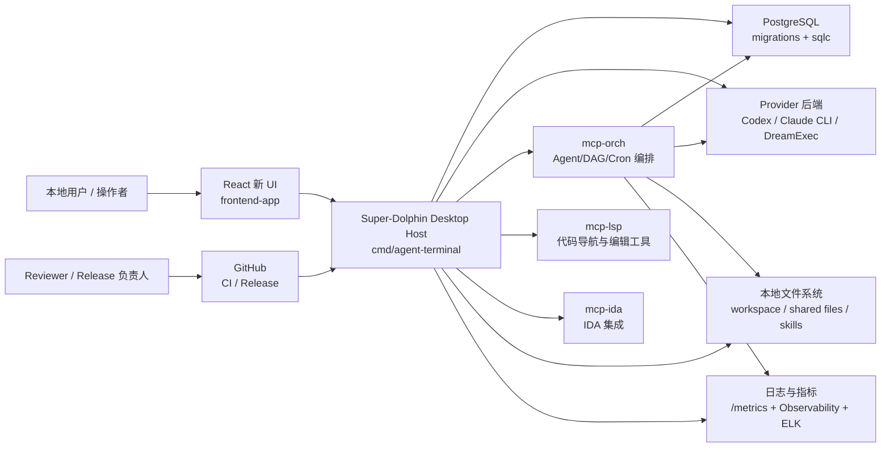
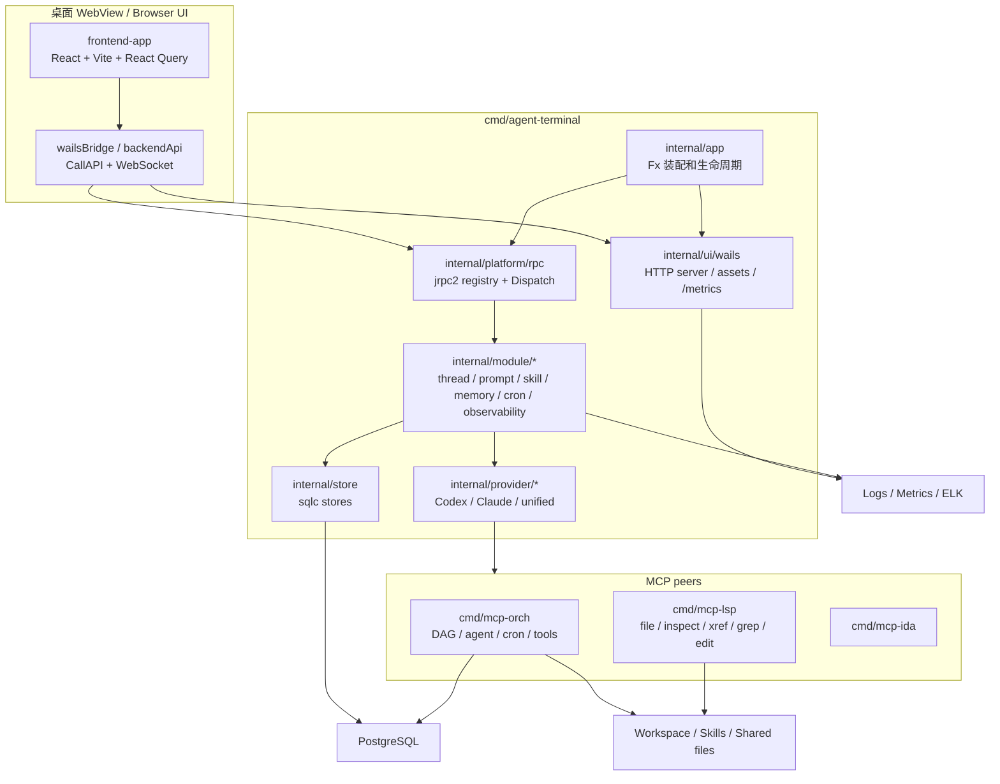
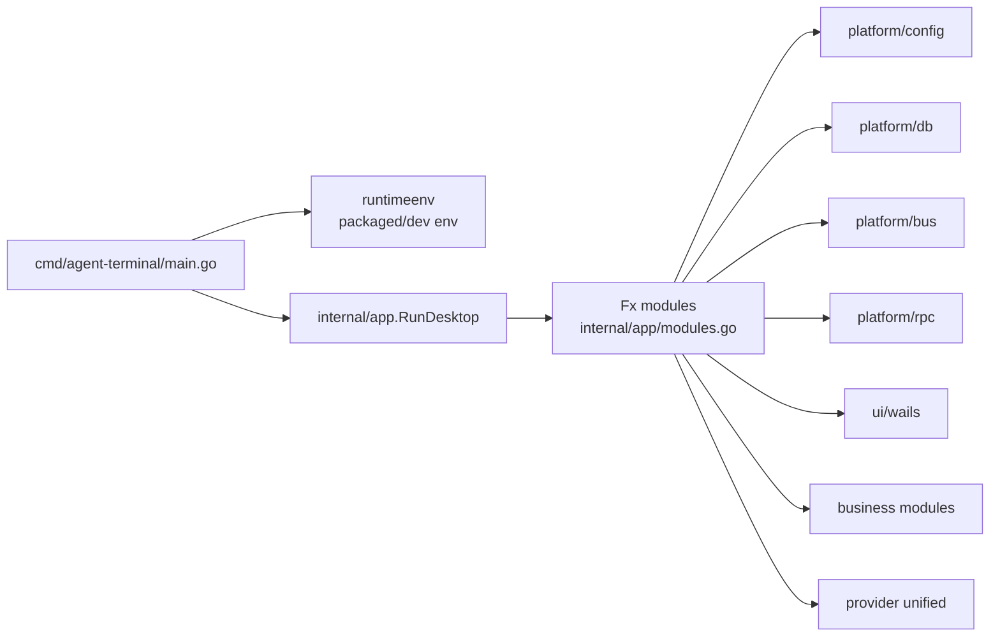
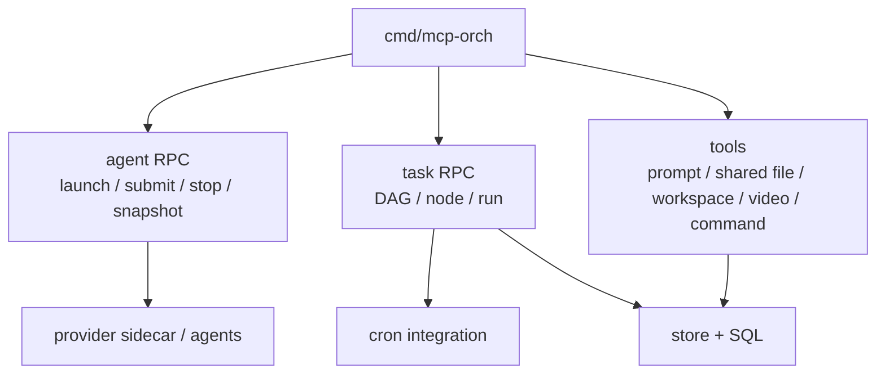
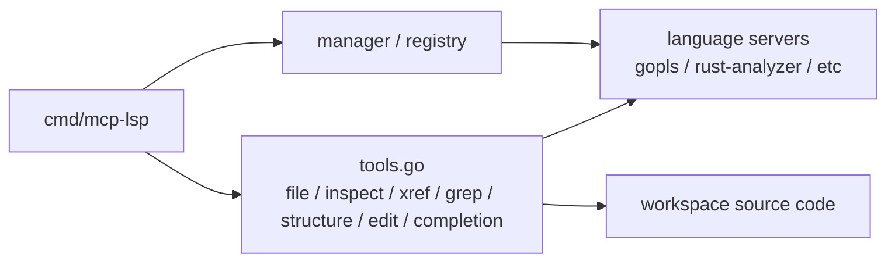
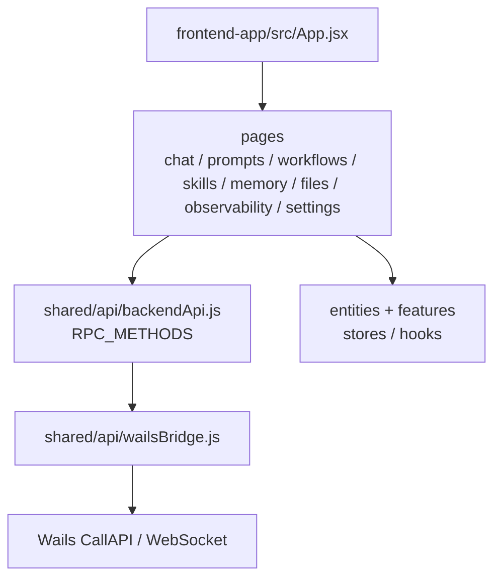

# Step 5-6：系统上下文图、容器图和组件图

## Step 5：系统上下文图

### 上下文说明

- 用户主要通过 `frontend-app` 进入系统。
- 桌面宿主 `cmd/agent-terminal` 提供 Wails 桥、HTTP asset server、JSON-RPC dispatch、模块装配和 provider 适配。
- `mcp-orch` 是独立 peer，用于 agent lifecycle、DAG、cron、toolbridge 和资源工具。
- `mcp-lsp` 是独立 peer，用于代码级工具调用。
- PostgreSQL 是状态源，schema 由 migrations 管理，查询由 sqlc 生成。
- 观测由 `/metrics`、Observability RPC、本地日志和可选 ELK 组成。

## Step 6：容器图

## 组件图：桌面宿主

组件边界：

- `cmd/agent-terminal/main.go` 只做进程角色、运行时环境和桌面入口调用。
- `internal/app/app.go` 负责前置检查、Wails 生命周期、logger 和 Fx app。
- `internal/app/modules.go` 是模块装配中心。注意桌面 app 不内嵌 orchestration module，编排由 `mcp-orch` 负责。

## 组件图：mcp-orch

## 组件图：mcp-lsp

## 组件图：前端

