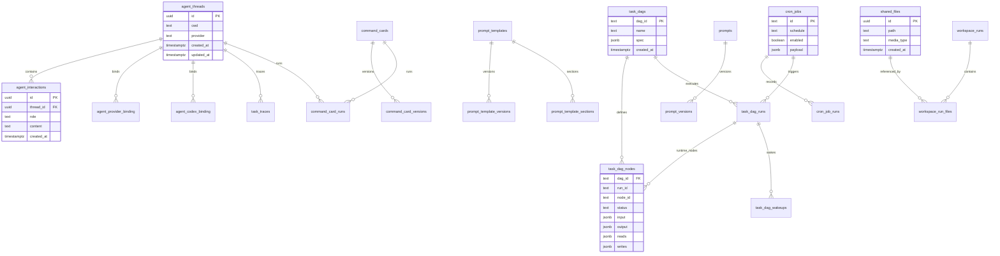

# Step 7：数据库 ER 图和数据字典

## 数据库来源

- 数据库类型：PostgreSQL。
- 迁移目录：`migrations`。
- 基线迁移：`migrations/001_baseline.sql`。
- sqlc 配置：`sqlc.yaml`。
- 查询目录：`sql/queries`。
- 生成目录：`internal/store/sqlc`。
- 数据库模块：`internal/platform/db/module.go`。
- 最低 schema version：代码中读取到 `MinRequiredSchemaVersion=103`。

数据库迁移 runner 只执行向上迁移。`migrations/ROLLBACK.md` 明确说明没有 down migration 机制，回滚必须人工执行 SQL，并同步处理 `schema_migrations` 记录。

## 核心 ER 图

## 数据字典

| 表 | 用途 | 关键字段或约束 | 主要代码入口 |
| --- | --- | --- | --- |
| `schema_migrations` | 记录已应用迁移版本 | version、dirty 状态 | `internal/platform/db/module.go` |
| `agent_threads` | 会话线程主表 | thread id、cwd、provider、归档状态 | `internal/module/thread`、`internal/store` |
| `agent_interactions` | 线程消息和交互记录 | thread_id、role、content、时间 | `internal/module/thread` |
| `agent_provider_binding` | thread 与 provider 的绑定 | `uq_agent_provider_binding_provider_thread` | `internal/provider`、`internal/store` |
| `agent_codex_binding` | Codex provider 绑定状态 | thread、cwd、provider metadata | `internal/provider/codexapp` |
| `agent_status` | agent 运行状态 | agent id、状态、更新时间 | `cmd/mcp-orch` |
| `audit_events` | 审计事件 | actor、action、payload | audit store |
| `system_logs` | 系统日志记录 | level、message、context | observability/store |
| `bus_exception_logs` | 事件总线异常 | topic、error、payload | `internal/platform/bus` |
| `task_dags` | DAG 模板或定义 | dag id、spec、metadata | `cmd/mcp-orch/orchestration` |
| `task_dag_nodes` | DAG 节点定义和运行节点 | dag id、run id、node id、status | `cmd/mcp-orch/orchestration` |
| `task_dag_runs` | DAG 运行记录 | run id、dag id、status、started_at | `cmd/mcp-orch/orchestration` |
| `task_dag_wakeups` | DAG 唤醒和恢复记录 | run id、node id、wake time | cron/orchestration |
| `task_traces` | 任务追踪 | thread/task/trace payload | observability |
| `task_acks` | 任务确认或 ack | task id、ack 状态 | orchestration |
| `cron_jobs` | 定时任务定义 | schedule、timezone、enabled、payload | `internal/module/cron` |
| `cron_job_runs` | 定时任务运行历史 | job id、status、started_at、finished_at | `internal/module/cron` |
| `prompt_templates` | Prompt 模板 | template id、name、metadata | `internal/module/prompt` |
| `prompt_template_versions` | 模板版本 | template id、version、body | `internal/module/prompt` |
| `prompt_template_sections` | 模板 section | template id、section key、body | prompt section RPC |
| `prompts` | Prompt 实体 | prompt id、name、metadata | `internal/module/prompt` |
| `prompt_versions` | Prompt 版本 | prompt id、version、body | `internal/module/prompt` |
| `prompt_intent_drafts` | Prompt intent 草稿 | draft id、status、payload | `sql/schema/prompt_intent_drafts.sql` |
| `prompt_routing_tests` | Prompt 路由测试 | test id、input、expected、result | prompt routing test store |
| `command_cards` | 命令卡片 | card id、definition | command card store |
| `command_card_versions` | 命令卡片版本 | card id、version | command card store |
| `command_card_runs` | 命令卡片执行 | card id、thread id、status | dashboard/command store |
| `shared_files` | 共享文件索引 | path、media_type、hash、created_at | memory/shared file RPC |
| `workspace_runs` | workspace 运行记录 | run id、cwd、status | `cmd/mcp-orch/workspace` |
| `workspace_run_files` | workspace run 文件 | run id、path、metadata | workspace store |
| `ui_preferences` | UI 偏好 | key、value、scope | `internal/module/uistate` |
| `cwd_instance_locks` | cwd 实例锁 | cwd、owner、expires_at | cwd lock store |
| `topology_approvals` | 拓扑审批 | approval id、status、payload | approval flow |
| `topology_approval_archives` | 审批归档 | approval id、archived payload | approval archive |
| `agent_feedback_events` | 用户反馈事件 | thread id、rating、comment | `internal/module/feedback` |
| `session_insights` | 会话洞察 | session/thread、insight payload | `internal/module/insight` |
| `skill_candidates` | skill 候选建议 | source、candidate、status | `internal/module/skill` |
| `turn_dedupe_registry` | turn 幂等去重 | dedupe key、thread/turn id | `internal/module/turn` |

## 数据维护规则

1. 修改 schema 时优先新增 migration，不直接编辑已发布 migration。
2. 修改 SQL query 后运行 `make sqlc-verify`。
3. 任何数据修复或删除都必须先备份目标数据，并在变更单中写明回滚 SQL。
4. 不要创建 `.down.sql` 文件；当前 runner 会把 `*.sql` 都视为向上迁移。
5. 回滚时遵循 `migrations/ROLLBACK.md`，手工执行 SQL 后再处理对应 `schema_migrations` 版本记录。
