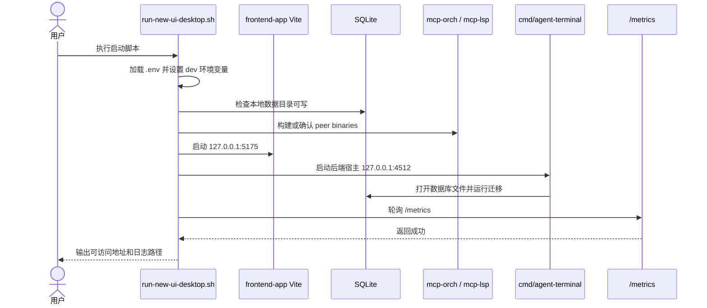
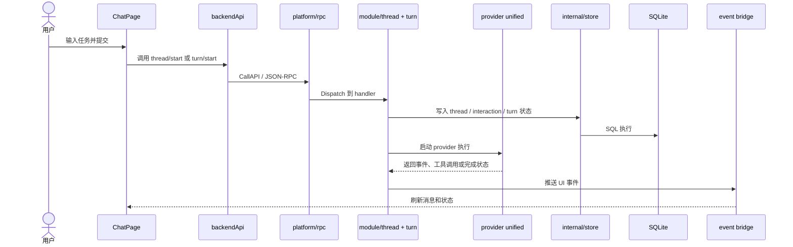
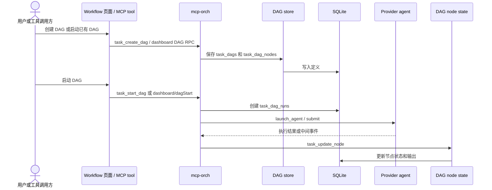
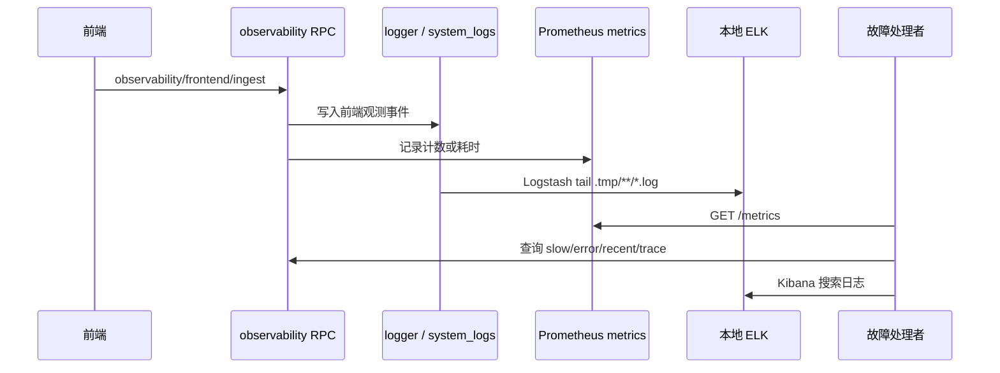

# Step 8：核心接口和关键时序图

## 核心接口面

| 接口面 | 入口 | 说明 |
| --- | --- | --- |
| Wails/HTTP | `internal/ui/wails/http_server.go` | 提供 `/`、`/wails/ws`、`/metrics` |
| JSON-RPC dispatch | `internal/platform/rpc/server.go` | 模块注册 handler，前端通过 CallAPI 或 WebSocket 调用 |
| 前端 API | `frontend-app/src/shared/api/backendApi.js` | 汇总当前 UI 使用的 RPC method |
| MCP HTTP legacy | `internal/mcpserver/common/http_transport.go` | 保留 `POST /mcp`，当前工具执行优先使用 stdio sidecar |
| mcp-orch RPC | `cmd/mcp-orch/orchestration/rpc.go`、`cmd/mcp-orch/workspace/rpc.go` | agent、DAG、workspace 运行控制 |
| mcp-lsp tools | `cmd/mcp-lsp/tools.go` | file、inspect、xref、grep、structure、edit、completion |

## 前端 RPC 分组

| 分组 | 代表方法 |
| --- | --- |
| 配置 | `config/read`、`config/lspPromptHint/read`、`config/builtinTools/write` |
| UI 状态 | `ui/windowBootstrap/get`、`ui/state/get`、`ui/sidebar/get`、`ui/preferences/*` |
| 线程和 turn | `thread/start`、`thread/messages`、`turn/start`、`turn/interrupt`、`approval/respond` |
| Dashboard | `dashboard/prompts`、`dashboard/dags`、`dashboard/dagDetail`、`dashboard/sharedFiles` |
| DAG | `dashboard/dagStart`、`dashboard/dagDispatchNode`、`dashboard/dagTerminate`、`dashboard/dagApplyOps` |
| Cron | `cronjob/list`、`cronjob/create`、`cronjob/update`、`cronjob/runOnce`、`cronjob/setEnabled` |
| Prompt | `prompts/get`、`prompts/write`、`prompt-sections/list`、`prompt-intents/draft` |
| Skill | `skills/local/read`、`skills/local/write`、`skills/create`、`skills/summary/suggest` |
| Memory/File | `ui/memory/get`、`ui/memory/shared-file/get`、`ui/memory/shared-file/delete` |
| Observability | `observability/status`、`observability/trace/get`、`observability/slow/list`、`observability/error/list` |
| App update | `app/update/check`、`app/update/download`、`app/update/installLatest` |

## 关键时序图：本地启动

## 关键时序图：线程发起 turn

## 关键时序图：DAG 创建和调度

## 关键时序图：观测和故障定位

## 接口变更规则

1. 新增前端 RPC method 时，同时更新 `backendApi.js` 和对应 Go handler 测试。
2. 新增 MCP tool 时，明确 tool name、输入 schema、输出 schema、失败语义和权限边界。
3. 修改 thread、turn、DAG、cron、provider 行为时，必须补充回归测试或 smoke 清单。
4. RPC 不应吞错或静默返回默认值；配置缺失和状态不一致应 fail-fast。
5. 外部可见 method name 改名必须提供迁移说明，避免旧 UI 或脚本调用断裂。
