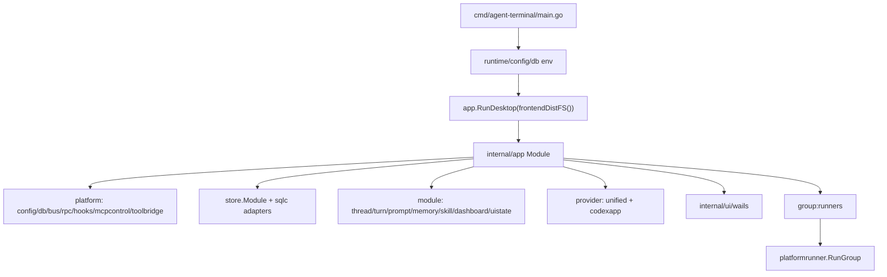
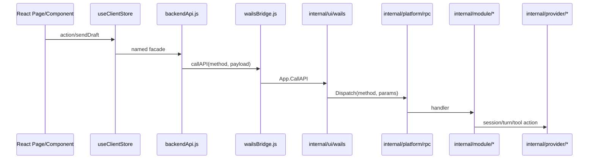

# 项目结构与核心链路

## 1. 项目结构概览

| 区域 | 角色 |
|---|---|
| `cmd/agent-terminal` | 桌面宿主入口。`main.go` 设置 runtime/env/db 后调用 `app.RunDesktop(frontendDistFS())`。 |
| `cmd/mcp-orch` | 独立 orchestration peer，负责 agent 生命周期、DAG、cron、tool registry 等。 |
| `cmd/mcp-lsp` | 多语言 LSP peer。 |
| `cmd/mcp-ida` | IDA MCP peer。 |
| `internal/app` | Fx 根装配层，组合 config、db、bus、rpc、store、module、provider、toolbridge、Wails UI。 |
| `internal/contract` | 跨模块窄接口和 DTO，例如 provider、prompt、memory、orchestration、skill、approval。 |
| `internal/module` | 业务模块层，包括 dashboard、datasource、mcp_server、memory、prompt、skill、thread、turn、cron、uistate 等。 |
| `internal/platform` | 基础设施层，包括 bus、config、db、rpc、hooks、mcpcontrol、toolbridge、runner、statemachine、observability。 |
| `internal/provider` | Provider 适配层。根装配当前加载 `unified.Module` 和 `codexapp.Module`；`claudecli.Module` 在 `internal/app/modules.go` 中被注释。 |
| `internal/store` | sqlc-backed 持久化层，按业务域拆 store adapter。 |
| `frontend-app` | 当前 React/Vite 新 UI，`run-new-ui-desktop.sh/.ps1` 默认使用它。 |
| `cmd/agent-terminal/frontend` | legacy Vue/Vite 和 embed dist 路径；当前只应作为 package/embed 或旧 UI 兼容面处理。 |

## 2. 构建与启动入口

开发态新 UI：

1. `run-new-ui-desktop.sh` 或 `run-new-ui-desktop.ps1` 读取 `.env`，设置 `GO_AGENT_CTL_SESSION_TOKEN`、`VITE_DEV_URL`、`SUPER_DOLPHIN_HTTP_ADDR` 等。
2. `frontend-app` 启动 Vite，默认 `127.0.0.1:5175`。
3. Go 桌面宿主运行 `go run ./cmd/agent-terminal`。
4. `internal/ui/wails/assets.go` 如果发现 `VITE_DEV_URL`，通过 reverse proxy 指向 Vite；非法 URL 会 panic fail-fast。
5. `frontend-app/src/main.jsx` 挂载 React 应用，并按固定顺序引入全局 CSS。

打包态或无 dev proxy：

1. `make frontend-app-build` 在 `frontend-app` 执行 `npm run build`。
2. `frontend-app/scripts/sync-frontend-dist.mjs` 将 `frontend-app/dist` 同步到 `cmd/agent-terminal/frontend/dist`，并校验 `index.html`。
3. `cmd/agent-terminal/frontend.go` 把 embed FS 注入 Wails asset handler。

## 3. 后端运行链路

关键点：

- `internal/app/modules.go` 是主装配事实源。
- `internal/app/runner.go` 用 Fx lifecycle 启动 `platformrunner.RunGroup`，并在停止时 drain memory extraction。
- `app.Module` 明确不内嵌 `cmd/mcp-orch/orchestration.Module`；桌面进程只暴露控制面和适配层，避免自我拉起桌面二进制。
- 业务模块尽量通过 `internal/contract` 窄端口互相连接，但仍存在 optional/noop 适配和 provider hook bridge，后续改动需注意边界。

## 4. UI 到后端 RPC 链路

当前保护：

- `frontend-app/src/shared/api/backendApi.js` 集中定义 RPC 方法名和 payload 规范化。
- `backendApi.contractMatrix.js` 维护 RPC 合同登记表，按 P0/P1/P2 标注重要度和测试归属。
- `backendApi.surface.test.js` 禁止业务代码绕过 facade 直接调用 raw bridge。
- `pages/backendApiConsumer.surface.test.js` 要求已迁移页面通过 service module 消费 backend facade。
- Go 侧 thread/turn handler 使用 strict decode，未知字段会拒绝。

剩余缺口：

- 这些保护仍以 JS 运行时和测试扫描为主，缺少编译期 schema。
- `backendApi.js` 自身仍有 1252 行，继续承担较多合同逻辑。

## 5. Provider 链路

设计层：

- `internal/contract/provider.go` 定义 `Driver`、`Session`、`TurnHandle`。
- `internal/provider/unified` 管 driver registry、session manager、session resolver、event dispatcher。
- `internal/module/thread` 负责 start/resume/recover/fork 等生命周期入口。
- `internal/module/turn` 负责 turn/start、interrupt、forceComplete、approval/respond 等运行态入口。

当前装配层：

- `internal/app/modules.go` 装入 `unified.Module`。
- `internal/app/modules.go` 注释掉 `claudecli.Module`。
- `internal/app/modules.go` 装入 `codexapp.Module`。
- `frontend-app/src/entities/client/model/providerPreferences.js` 定义 `RUNTIME_PROVIDER = 'codex'`，并对非 Codex runtime provider fail-fast。

审查结论：

- 当前桌面主 UI 应按“Codex runtime 为唯一可运行 provider”理解。
- 仓库中保留 Claude provider 包和抽象并不等价于当前桌面链路支持 Claude。
- 后续如果恢复 Claude，必须同时恢复 Fx 装配、UI 设置、provider preference、thread/start、端到端启动验证。

## 6. 工具系统链路

工具能力由三条链组成：

1. Provider-native mirror：`internal/module/skill` 将 canonical skills reconcile 到 provider 可发现目录。
2. Host toolbridge：`internal/platform/toolbridge` 在宿主进程内注册 host-direct 工具和 proxy 工具。
3. MCP peer 控制面：`internal/platform/mcpcontrol` 管 peer 注册、心跳、通知、hook callback；`cmd/mcp-orch`、`cmd/mcp-lsp` 作为独立 peer 运行。

风险点：

- 工具“能否被模型使用”不是单点判断，要同时看 skill mirror、toolbridge、mcpcontrol、provider session。
- `Makefile` 和 runner 会构建或寻找 `mcp-orch`、`mcp-lsp` peer binaries；Windows、macOS/Linux 的查找和清理路径要保持一致。

## 7. 状态管理与 UI 层

当前新 UI 结构：

- 应用入口：`frontend-app/src/main.jsx`
- App shell：`frontend-app/src/App.jsx`
- 全局状态：`frontend-app/src/entities/client/model/useClientStore.js`
- 已拆 slice：`composerSlice.js`、`forkSlice.js`、`projectSlice.js`、`runtimeSlice.js`
- Provider 偏好：`providerPreferences.js`
- 页面：`pages/chat`、`pages/workflows`、`pages/files`、`pages/skills`、`pages/memory`、`pages/settings`、`pages/observability`
- API facade：`shared/api/backendApi.js`
- Wails bridge：`shared/api/wailsBridge.js`
- UI helper：`shared/ui/runUIAction.js`

CSS 现状：

- `styles.css` 已降到 137 行，主要保留 tokens、字体、全局 box sizing 和基础元素。
- 页面、组件、polish、workbench、shared styles 已拆为 45 个 CSS 文件。
- 所有 CSS 仍在 `main.jsx` 以全局顺序导入，覆盖顺序是隐式契约。

## 8. 测试结构

后端：

- `cmd`、`internal`、`pkg`、`frontend-app/src` 范围内测试文件共 1249 个。
- Go package 测试通过 `scripts/test_with_guard.sh/.ps1` 和 `make test` 管理。
- `internal/archtest` 提供架构守卫、代码大小守卫、协议冻结等。

前端：

- `frontend-app` 使用 Vitest + jsdom + ESLint。
- `package.json` 脚本包括 `lint`、`test`、`build`、`smoke:desktop:rpc`、`smoke:desktop:ux`、`typecheck:contracts`。
- 新增/现有重点测试包括：
  - `backendApi.contractMatrix.test.js`
  - `backendApi.surface.test.js`
  - `pages/backendApiConsumer.surface.test.js`
  - `runUIAction.test.js`
  - `styles.test.js`
  - `desktop-runner-contract.test.mjs`
  - `sync-frontend-dist.test.mjs`
  - `internal/ui/wails/assets_test.go`

CI：

- `.github/workflows/ci.yml` 在 Ubuntu 跑 commit guard、Go build/test/lint、frontend lint/test/build。
- 安装 Linux WebView 依赖，说明桌面宿主构建对系统库敏感。
- Windows 原生路径目前主要靠本地脚本和专项测试，不是 GitHub Actions 主验证面。
