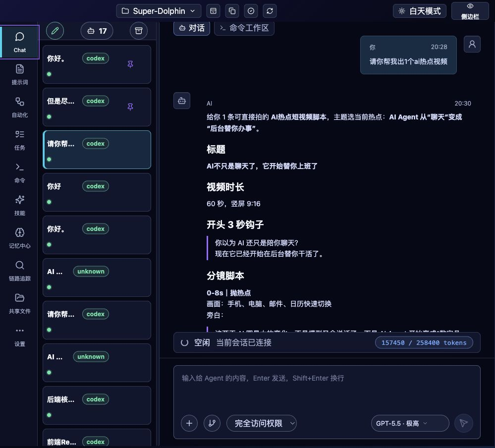
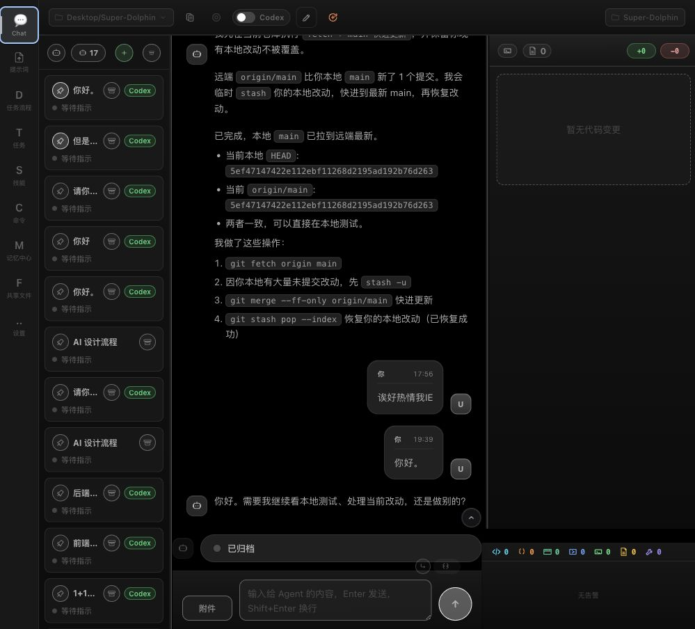
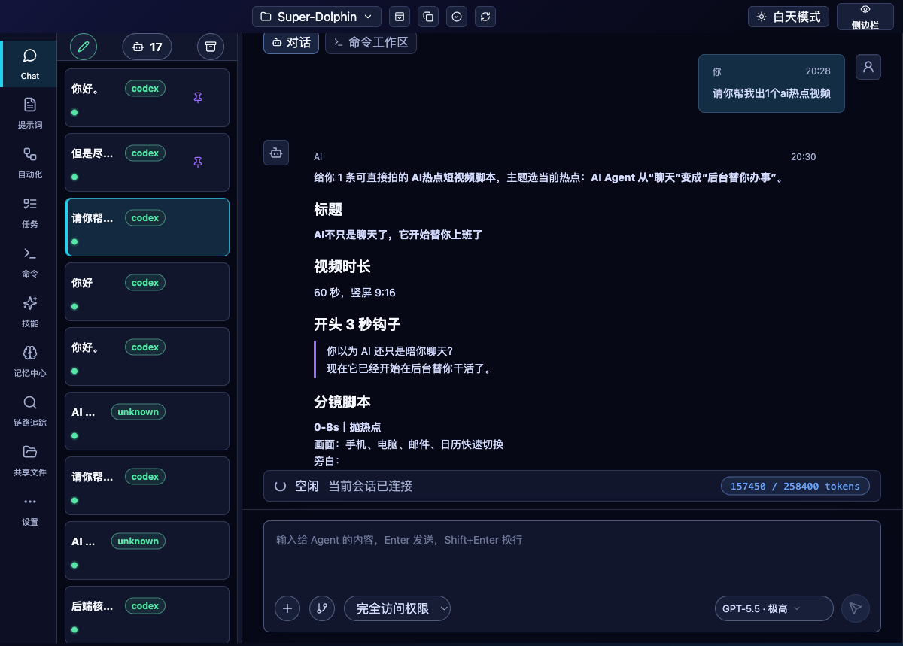
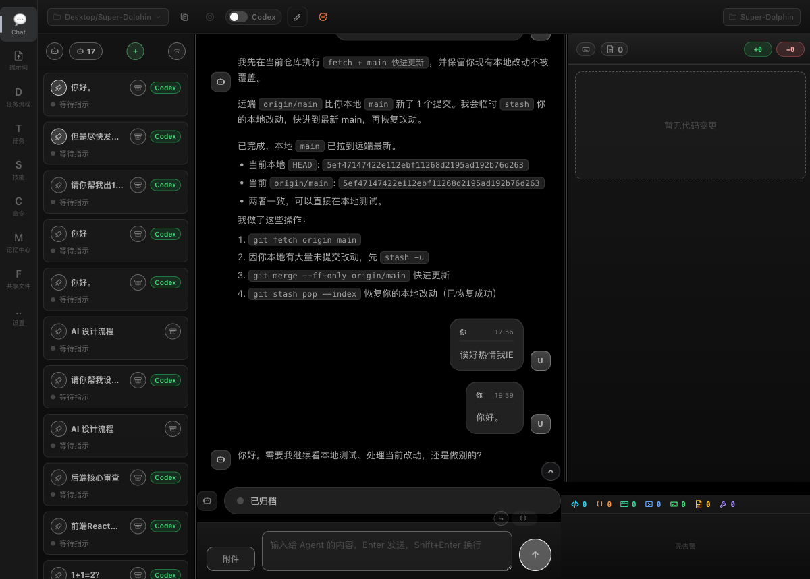

# frontend-app 与 cmd/agent-terminal 真实用户体验对比测试报告

日期：2026-06-03
测试人：Codex
范围：

- 新 UI 客户端：`/Users/ai/Desktop/Super-Dolphin/frontend-app`
- 旧 UI 客户端与桌面宿主：`/Users/ai/Desktop/Super-Dolphin/cmd/agent-terminal`

## 1. 测试口径

本次按真实用户打开客户端后的体验做对比，同时用源码静态扫描校正页面与后端接口差异。

重要口径：

1. `cmd/agent-terminal` 本身是 Go/Wails/HTTP/RPC 桌面宿主，不等同于旧页面实现。
2. 旧 UI 页面主体在 `cmd/agent-terminal/frontend/vue-app/`。
3. 当前新 UI 页面主体在 `frontend-app/`，开发态通过 `VITE_DEV_URL` 由 `cmd/agent-terminal` 代理。
4. 本次真实 UX 测试只做打开、导航、查看、筛选级别的无破坏操作；没有发送消息、删除数据、创建持久对象或保存设置。
5. 会改变数据的 CRUD 完整度主要按源码、现有测试和可见控件推断，不把未实际点击的危险操作标成已完成端到端验证。

使用的辅助约束：

- `karpathy-guidelines`：先明确假设，按当前源码和真实页面证据下结论，避免把旧文档里的过期结论直接复用。
- `superpowers:brainstorming`：用于整理对比维度和测试矩阵；本次没有新增功能实现，因此没有进入设计文档和实现计划流程。

## 2. 运行环境

| 客户端 | 页面地址 | 后端地址 | 状态 |
|---|---:|---:|---|
| React 新 UI | `http://127.0.0.1:5175/` | `127.0.0.1:4512` | 测试前已存在，页面和后端均可用 |
| legacy Vue 旧 UI | `http://127.0.0.1:5173/` | `127.0.0.1:4511` | 本轮测试使用临时 legacy dev host；无后端时曾出现 runtime shim bootstrap 失败，启动 `4511` 后可用 |

旧 UI 临时后端启动方式：

```bash
SUPER_DOLPHIN_HTTP_ADDR=127.0.0.1:4511 VITE_DEV_URL=http://127.0.0.1:5173 go run ./cmd/agent-terminal
```

## 3. 工具证据

| 工具 | 覆盖内容 | 结果 |
|---|---|---|
| Browser / in-app browser | 打开新旧 UI，读取可见导航、正文、后端失败提示 | 两套 UI 均能打开；旧 UI 日志读取时有历史无后端日志混入，因此最终以 Playwright clean run 为准 |
| Chrome 插件 | 真实 Chrome 打开 `5175` 新 UI | 新 UI 标题为 `Super Agent Frontend App`，可见导航和 Chat 主体，console error/warning 为 0 |
| Computer Use | 查看本机应用状态 | Chrome、Codex、Terminal 均运行；`agent-terminal.app` 最近使用过但当前可见应用状态不是本次后端进程来源，后端由命令行进程提供 |
| Playwright CLI | 新旧 UI 逐项导航、快照、console | 新 UI 10 个入口可渲染且 console error/warning 为 0；旧 UI 9 个入口可渲染，但有 favicon 404 和若干 warn 级内部日志 |

截图证据：

| 截图 | 说明 |
|---|---|
|  | Browser 视角的新 UI Chat |
|  | Browser 视角的旧 UI Chat |
|  | Playwright 视角的新 UI |
|  | Playwright 视角的旧 UI |

## 4. 源码职责差异

| 维度 | `frontend-app` 新 UI | `cmd/agent-terminal` / legacy UI |
|---|---|---|
| 页面框架 | React + Vite + Zustand + React Query | Vue ESM browser app + legacy stores/composables |
| 当前定位 | 当前桌面新 UI | 桌面 Go/Wails 宿主 + legacy/package-embed 前端 |
| 应用入口 | `frontend-app/src/main.jsx`、`frontend-app/src/App.jsx` | `cmd/agent-terminal/main.go`、`cmd/agent-terminal/frontend.go`、`cmd/agent-terminal/frontend/vue-app/app.js` |
| 后端桥接 | `frontend-app/src/shared/api/backendApi.js` + `wailsBridge.js` | `cmd/agent-terminal/frontend/vue-app/services/api.js` + 分散页面调用 |
| 导航路由 | 有 `PAGE_ROUTE_BY_ID`，页面切换写入 URL | 旧 SPA 多数停留在 `/`，导航状态在前端状态内 |
| 可观测性 | 有独立链路追踪页和 frontend trace ingest | 无独立同级链路追踪页 |
| 测试体量 | `frontend-app/src` 下 17 个 test/spec 文件 | `vue-app` 下 143 个 test/spec 文件，另有 `cmd/agent-terminal/frontend/tests/e2e` 19 个 Playwright spec |

## 5. 导航与页面覆盖

源码导航对比：

| 页面能力 | React 新 UI | legacy Vue 旧 UI | 结论 |
|---|---|---|---|
| Chat | `Chat` -> `/` | `Chat` | 两边都有 |
| 提示词 | `提示词` -> `/prompts` | `提示词` | 两边都有 |
| 自动化 / DAG | `自动化` -> `/dags` | `任务流程` | 两边都有，命名不同 |
| 任务 | `任务` -> `/tasks` | `任务` | 两边都有 |
| 命令 | `命令` -> `/commands` | `命令` | 两边都有 |
| 技能 | `技能` -> `/skills` | `技能` | 两边都有 |
| 记忆中心 | `记忆中心` -> `/memory` | `记忆中心` | 两边都有 |
| 链路追踪 | `链路追踪` -> `/observability` | 无 | 新 UI 独有 |
| 共享文件 | `共享文件` -> `/files` | `共享文件` | 两边都有 |
| 设置 | `设置` -> `/settings` | `设置` | 两边都有 |

Playwright 逐项导航结果：

| 页面 | React 新 UI 实测 | legacy Vue 实测 | 差异 |
|---|---|---|---|
| Chat | 可见 17 个 Agent、历史对话、composer、模型和权限选择 | 可见 17 个 Agent、历史对话、composer、工具统计 | 旧 UI 当前数据下打开的是一个已归档会话，composer 禁用；新 UI 当前打开的是活跃视频脚本会话。需要单独确认两边 active thread 选择策略是否应完全一致 |
| 提示词 | 显示 4 条 prompt asset，支持专家能力/参考资料等分类 | 显示 4 条 prompt asset | 主体一致 |
| 自动化 / 任务流程 | 显示 2 个定时任务，其中包含 `每日生活计划` | 显示同类 DAG/定时任务数据 | 主体一致；新 UI 命名为“自动化” |
| 任务 | 显示任务工单、执行追踪、定时任务 tab，当前无 task ack | 显示任务管理和三类 tab，当前无任务 | 主体一致 |
| 命令 | 显示命令卡页，当前无 commandCards | 显示命令卡页，当前无命令卡 | 主体一致 |
| 技能 | 显示 23 个项目共享技能 | 显示 23 个项目共享技能 | 主体一致 |
| 记忆中心 | 显示偏好与项目记忆，当前可见项目记忆数不为 0 | 旧 UI 当前运行显示项目记忆为 0、偏好为 2 | 存在当前数据下的记忆范围/计数差异，建议后续专门核对 scope 和 dashboard payload 解析 |
| 链路追踪 | 页面可打开，显示 Trace ID / Thread ID / Agent ID / 组件 / 状态过滤 | 无入口 | 新 UI 独有，旧 UI 缺失 |
| 共享文件 | 显示 `daily-life-plan.md` 最终产物 | 显示同一个 `daily-life-plan.md` 内容预览 | 主体一致 |
| 设置 | 显示构建信息、超时、上下文阈值、provider 等设置 | 显示 ABOUT、TURN TRACKER、CONTEXT USAGE ALERT 等设置 | 主体一致，布局不同 |

## 6. 页面渲染与视觉体验差异

### 6.1 新 UI 优势

1. 导航文字和 URL 路由更清晰，`/prompts`、`/dags`、`/tasks`、`/observability` 等地址可以直接恢复页面。
2. 图标来自统一 React 图标体系，按钮 accessible name 较稳定。
3. 页面分区更现代，Chat、侧边栏、右侧状态和 composer 的层级更清楚。
4. Chrome 和 Playwright 中新 UI console 没有 error/warning，只有 React DevTools 的 info 提示。
5. 新增链路追踪页，是旧 UI 没有的真实用户入口。

### 6.2 旧 UI 优势

1. 历史测试资产明显更多：143 个 legacy 单元/行为测试和 19 个 legacy E2E spec。
2. Chat 工作台历史功能更密，旧 UI 的 diff、timeline action、工具统计、cmd overview 等细节长期被 E2E 覆盖。
3. 旧 UI 对一些历史数据形态兼容更久，尤其是老 thread/timeline 消息展示。

### 6.3 旧 UI 体验问题

1. Playwright clean run 中旧 UI 有 `favicon.ico` 404。
2. 旧 UI console 出现 warn 级内部日志，例如 `thread.config.get.failed`、`scroll.restore.collapsed`、`ui.chat.selection.forceReload.done`。这些没有阻断页面，但会给真实调试体验制造噪音。
3. 导航 accessible name 混入图标字母，例如 `D任务流程`、`T任务`、`S技能`、`F共享文件`，自动化和辅助技术识别不如新 UI 干净。
4. URL 不随页面切换变化，用户无法像新 UI 一样直接复制页面路由。

## 7. 后端对接完善度

当前源码重新扫描结果：

| 指标 | React 新 UI | legacy Vue 旧 UI |
|---|---:|---:|
| `backendApi.js` 集中 RPC facade | 95 个 | 不适用 |
| legacy 生产代码静态 `callAPI(...)` 方法面 | 不适用 | 83 个 |
| 两边共同业务 RPC | 76 个 | 76 个 |
| React facade 独有 RPC | 19 个 | 无 |
| legacy 静态调用看似独有项 | 7 个 | 多数是 React 通过 `wailsBridge.js` 暴露的原生选择/复制/保存能力，不是实际缺口 |

React facade 独有能力主要集中在：

- `observability/*`：链路追踪、慢调用、错误列表、前端 trace ingest。
- `ui/projects/*`：项目读取、添加、移除、切换。
- `ui/preferences/getAll`：批量偏好快照。
- `dashboard/logs`、`dashboard/dags`、`dashboard/sharedFiles`：更明确的 dashboard 查询面。
- `ui/memory/similarity/consolidate-all/start/status`：异步记忆整合 job。
- `skills/create`：项目级技能创建 facade。

需要修正旧文档口径：

- 当前 React 新 UI 已经有 `turn/forceComplete` 和 `approval/respond` facade、store action 和测试覆盖。
- 因此这两个 RPC 不再是 legacy-only 缺口。

legacy 静态扫描里的 `ui/selectFiles`、`ui/selectProjectDir`、`ui/selectProjectDirs`、`ui/readDroppedTextFiles`、`ui/saveTextFile`、`ui/copyText` 在 React 侧主要走 `wailsBridge.js`，不应仅因为不在 `RPC_METHODS` 内就判定为缺失。

## 8. 主要差异与风险

| 优先级 | 差异 / 风险 | 证据 | 建议 |
|---|---|---|---|
| P1 | 旧 UI 无链路追踪入口 | 新 UI nav 有 `链路追踪`，旧 UI nav 无对应项 | 如果继续维护旧 UI，需要确认是否迁移 observability；如果旧 UI 准备退役，可不迁 |
| P1 | 当前数据下记忆中心计数和项目记忆展示不一致 | 新 UI 显示项目记忆，旧 UI 当前运行显示项目为 0 | 专门对比 `ui/memory/get` 与 dashboard payload 的 scope、cwd、private/team/project 解析 |
| P2 | 旧 UI console 噪音 | favicon 404；`thread.config.get.failed` 等 warn | 补 favicon；把预期内恢复日志降级或带更清晰字段 |
| P2 | 新 UI E2E 资产少于旧 UI | 新 UI 17 个 test/spec 文件；旧 UI 143 个 unit/behavior + 19 个 E2E | 用旧 E2E spec 作为迁移清单，为新 UI 补核心 Playwright flows |
| P2 | Chat active thread 选择体验不完全一致 | 同一数据下新 UI 和旧 UI打开的活动会话不同 | 为 bootstrap active thread 同步写一组双端对照测试 |
| P3 | 旧 UI 导航可访问性较弱 | Playwright snapshot 看到 `D任务流程`、`T任务` 等 | 如果继续维护旧 UI，给 nav button 增加明确 `aria-label` |

## 9. 结论

从真实用户体验和后端对接完整度看，`frontend-app` 已经是更适合作为当前主客户端的实现：主要页面都能渲染真实后端数据，接口 facade 更集中，路由更清晰，并且新增了旧 UI 没有的链路追踪能力。

旧 UI 仍然有价值，主要价值在历史覆盖和成熟细节：它的单元/行为测试、E2E 测试、Chat/diff/timeline 细节沉淀更多。它不是“功能更完整的当前客户端”，而是“历史覆盖更深的 legacy 参考实现”。

当前最值得后续处理的不是大规模重写，而是三件小而明确的事：

1. 用旧 UI 的 19 个 E2E spec 反推新 UI Playwright smoke/parity 套件。
2. 专项排查新旧 UI 记忆中心 scope/计数差异。
3. 修掉旧 UI 的 favicon 404 和明显 warn 噪音，降低排查成本。

## 10. 本次验证命令与未运行项

已执行：

```bash
git status --short
lsof -nP -iTCP:5175 -sTCP:LISTEN
lsof -nP -iTCP:4512 -sTCP:LISTEN
lsof -nP -iTCP:5173 -sTCP:LISTEN
lsof -nP -iTCP:4511 -sTCP:LISTEN
node <inline static scan for RPC sets>
~/.codex/skills/playwright/scripts/playwright_cli.sh open http://127.0.0.1:5175/
~/.codex/skills/playwright/scripts/playwright_cli.sh run-code <new UI nav matrix>
~/.codex/skills/playwright/scripts/playwright_cli.sh goto http://127.0.0.1:5173/
~/.codex/skills/playwright/scripts/playwright_cli.sh run-code <legacy UI nav matrix>
~/.codex/skills/playwright/scripts/playwright_cli.sh console error
~/.codex/skills/playwright/scripts/playwright_cli.sh console warning
~/.codex/skills/playwright/scripts/playwright_cli.sh close
```

未运行：

- 未运行 `frontend-app` 的 `npm run lint`、`npm test`、`npm run build`，因为本次没有修改业务代码。
- 未运行 legacy Vue 的 `npx vitest run`、`npm run build`，因为本次没有修改 legacy 前端代码。
- 未执行新增、删除、保存设置、发送消息等会改变用户数据的真实提交动作。
