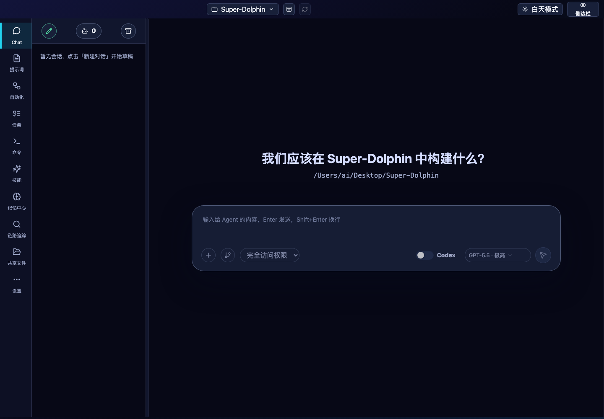
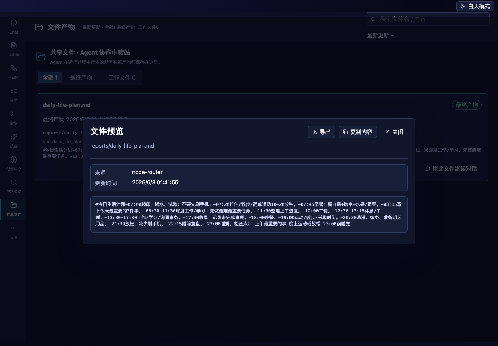
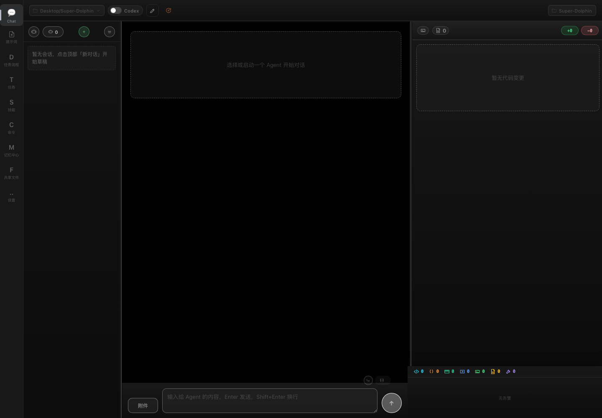
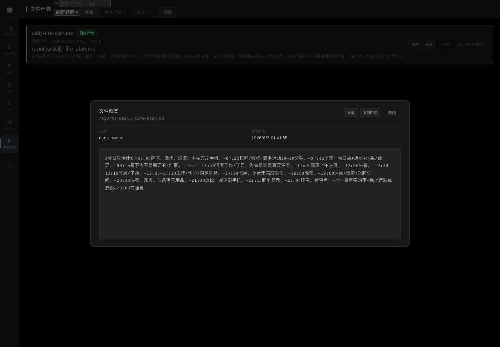
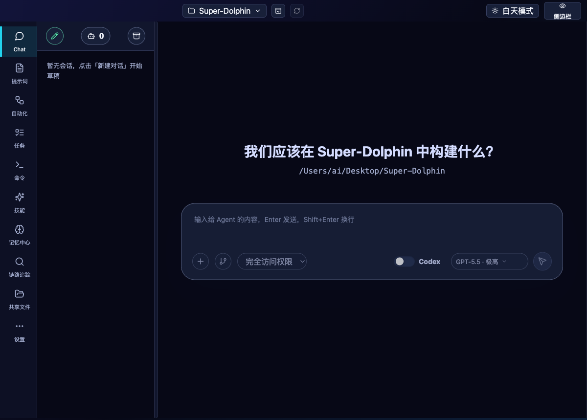
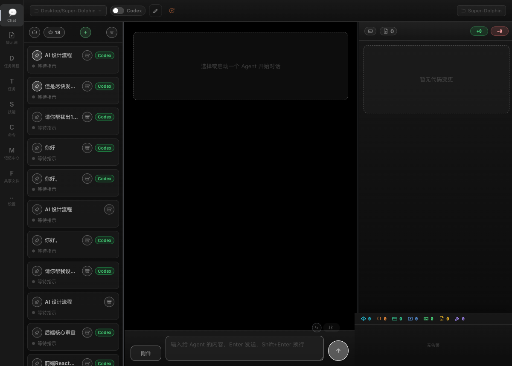
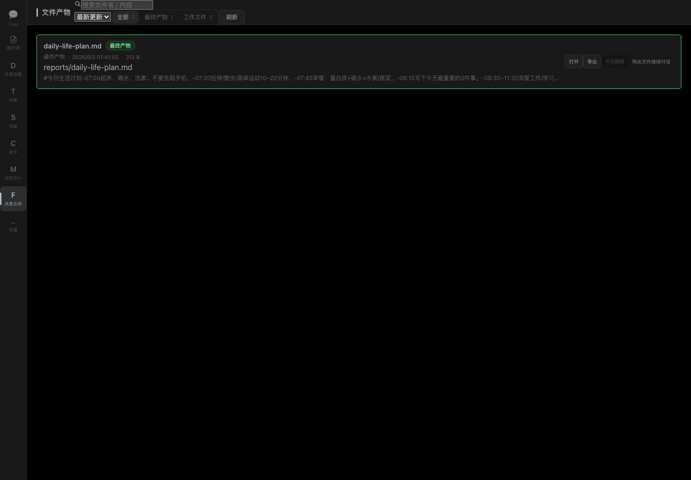

# 新 UI 与旧 UI 全量真实用户体验对比审计报告

日期：2026-06-03  
仓库：`/Users/ai/Desktop/Super-Dolphin`

对比对象：

- 新 UI：`/Users/ai/Desktop/Super-Dolphin/frontend-app`
- 旧 UI / 桌面宿主：`/Users/ai/Desktop/Super-Dolphin/cmd/agent-terminal`

## 0. 先给结论

新 UI 不是空壳。按真实后端启动后测试，`frontend-app` 的 10 个主导航入口都能渲染真实数据，关键页能点击、筛选、打开弹层、填写输入并恢复，后端 RPC facade 覆盖面比旧 UI 更宽，尤其多出链路追踪、dashboard 直连查询、前端日志/trace ingest、批量偏好、异步记忆整合等能力。

但不能把 `/Users/ai/Desktop/Super-Dolphin/cmd/agent-terminal` 整个删掉。`cmd/agent-terminal` 仍然是新 UI 运行所依赖的 Wails/HTTP/RPC 桌面宿主。真正可考虑删除的是旧 Vue 页面源和旧 package-embed 路径，即 `cmd/agent-terminal/frontend/vue-app` 以及围绕它的构建/测试/嵌入产物链路。

现在如果直接删除整个 `cmd/agent-terminal/frontend` 也不安全，因为 `cmd/agent-terminal/frontend.go` 仍然 `embed all:frontend/dist`，`Makefile` 的 `frontend-build` 仍指向 `cmd/agent-terminal/frontend`。要删旧 UI，先迁移 embed/build：让打包路径使用 `frontend-app/dist` 或一个由 `frontend-app` 同步出来的稳定 embed 目录，再移除 legacy Vue 源码和旧测试。

严肃判断：

- 新 UI 可以作为当前主客户端继续跑。
- 旧 UI 可以进入删除计划，但必须按“先迁移打包嵌入与测试覆盖，再删除 legacy Vue”执行。
- 不建议删除 `cmd/agent-terminal` Go 宿主。
- 不建议在没有迁移旧 E2E 覆盖前删除旧 UI 测试资产。

## 1. 测试口径与边界

本轮按真实用户打开客户端后的操作来测，不只看源码。

本报告里的“每个按钮/每个功能”口径：

- 覆盖两套 UI 主导航页面中当前 DOM 可见的按钮、tab、输入框、select、弹层和预览入口。
- 对重复历史会话中的同名按钮，例如旧 UI 侧边栏大量重复的“置顶会话 / 归档会话”，只点击代表性实例，其余按同 label / 同 class 视为等价覆盖。
- 对会改变用户数据或启动真实任务的操作，只验证入口可见、禁用态、弹层打开/关闭、输入可填可恢复，不点击最终提交。
- 未实际执行：发送消息、删除数据、归档会话、保存设置、启动/停止 DAG、运行定时任务、导入目录、系统原生文件选择器确认、真实创建持久对象。

这个边界是故意的：它能覆盖真实用户体验和后端读取/展示路径，同时不污染用户数据。

使用的辅助约束：

- `karpathy-guidelines`：明确假设、最小范围、用可验证证据下结论。
- `superpowers:brainstorming`：用于整理测试矩阵和对比维度；本轮没有新增功能实现，不进入功能设计/实现计划。

## 2. 实测环境

| 对象 | 页面地址 | 后端地址 | 当前状态 |
|---|---|---|---|
| 新 UI React/Vite | `http://127.0.0.1:5175/` | `http://127.0.0.1:4512/metrics` | `200 / 200` |
| 旧 UI Vue/Vite | `http://127.0.0.1:5173/` | `http://127.0.0.1:4511/metrics` | `200 / 200` |

旧 UI 对照服务本轮通过以下方式启动：

```bash
cd /Users/ai/Desktop/Super-Dolphin
SUPER_DOLPHIN_HTTP_ADDR=127.0.0.1:4511 VITE_DEV_URL=http://127.0.0.1:5173 go run ./cmd/agent-terminal
```

新 UI 当前环境已存在运行实例：

- Vite：`127.0.0.1:5175`
- 后端桥：`127.0.0.1:4512`

本轮最后重新确认：

```text
http://127.0.0.1:5175/        -> 200
http://127.0.0.1:4512/metrics -> 200
http://127.0.0.1:5173/        -> 200
http://127.0.0.1:4511/metrics -> 200
```

## 3. 工具与证据

| 工具 | 本轮用途 | 结果 |
|---|---|---|
| Playwright Node / CLI | 新旧 UI 全导航、按钮点击、输入填充恢复、截图、console、失败请求统计 | 两套 UI 主体均可用；新 UI console warning/error 为 0；旧 UI 有 warning 噪音但无 console error |
| Browser / in-app browser | 打开本地新旧 UI，观察窄视口真实页面 | 新 UI 窄视口 composer 可读；旧 UI 窄视口 composer/状态区更拥挤 |
| Chrome | 打开新 UI，本机 Chrome 中核对标题、导航、console | 新 UI 可打开，标题 `Super Agent Frontend App`，无 console error/warning |
| Computer Use | 查看本机应用状态和 Chrome 标签状态 | Chrome、Codex、Terminal 正在运行；Chrome 标签中可见 `Agent Orchestrator` 和 `Super Agent Frontend App` |
| 源码静态扫描 | 对比 RPC 方法、入口、构建嵌入路径 | 新 UI facade 101 个方法；旧 UI 生产调用 86 个方法；旧 UI 无过滤后的生产侧独有 RPC |
| 仓库验证命令 | lint/test/build/Go build | 全部通过，警告见第 12 节 |

主要证据文件：

- Playwright clean matrix：`../assets/2026-06-03-full-ux-clean-matrix.json`
- 新 UI 首页截图：
- 新 UI 关键控件截图：
- 旧 UI 首页截图：
- 旧 UI 关键控件截图：
- 新 UI Playwright CLI 截图：
- 旧 UI Playwright CLI 截图：
- 旧 UI 共享文件定点截图：

## 4. 代码结构差异

| 维度 | 新 UI：`frontend-app` | 旧 UI：`cmd/agent-terminal/frontend/vue-app` |
|---|---|---|
| 技术栈 | React + Vite + Zustand + React Query | Vue ESM browser app + legacy stores/composables |
| 页面入口 | `frontend-app/src/main.jsx` | `cmd/agent-terminal/frontend/vue-app/main.js` |
| 应用壳 | `frontend-app/src/App.jsx` | `cmd/agent-terminal/frontend/vue-app/app.js` |
| Chat 状态 | `frontend-app/src/entities/client/model/useClientStore.js` | `cmd/agent-terminal/frontend/vue-app/stores/*` + `composables/useThreadActions.js` |
| 后端 facade | `frontend-app/src/shared/api/backendApi.js` | `cmd/agent-terminal/frontend/vue-app/services/api.js` + 分散 composables |
| Wails/native bridge | `frontend-app/src/shared/api/wailsBridge.js` | `cmd/agent-terminal/frontend/vue-app/services/api.js` |
| 路由 | `/`, `/prompts`, `/dags`, `/tasks`, `/commands`, `/skills`, `/memory`, `/observability`, `/files`, `/settings` | 主要停留在 `/`，页面状态在前端内存里 |
| 当前项目文档定位 | 当前桌面新 UI | legacy/package-embed 路径 |

仓库文档也明确这一点：

- `README.md`：`cmd/agent-terminal` 是 Wails desktop host + HTTP/RPC bridge；`frontend-app` 是当前 React/Vite 新 UI。
- `docs/doc/codemap/01-terminal-ui-react.md`：`cmd/agent-terminal` 仍是宿主，`run-new-ui-desktop.sh` 通过 `VITE_DEV_URL` 代理到 `frontend-app` Vite server。
- `cmd/agent-terminal/frontend.go`：仍然 `//go:embed all:frontend/dist`，没有 `VITE_DEV_URL` 时会走 legacy/package-embed dist。

## 5. 主导航与页面覆盖

| 页面/能力 | 新 UI | 旧 UI | 差异结论 |
|---|---|---|---|
| Chat | 有，路径 `/` | 有，路径仍 `/` | 两边都有；新 UI 当前活跃 thread 选择更干净，旧 UI 历史会话/工具统计更密 |
| 提示词 | 有，`/prompts` | 有 | 两边都有；主体数据一致 |
| 自动化/DAG | 有，`/dags`，命名“自动化” | 有，命名“任务流程” | 两边都有；命名和布局不同 |
| 任务 | 有，`/tasks` | 有 | 两边都有 |
| 命令 | 有，`/commands` | 有 | 两边都有 |
| 技能 | 有，`/skills` | 有 | 两边都有 |
| 记忆中心 | 有，`/memory` | 有 | 两边都有；当前数据下新旧计数呈现有差异，需要专项核对 scope |
| 链路追踪 | 有，`/observability` | 无同级入口 | 新 UI 独有 |
| 共享文件 | 有，`/files` | 有 | 两边都有；旧 UI 需用 data-testid 进入，普通 label 矩阵曾误判 |
| 设置 | 有，`/settings` | 有 | 两边都有 |

新 UI 全局按钮：

```text
选择项目 / 新窗口（独立进程） / 请先选择会话(禁用) / 切换到白天模式 / 显示侧边栏 /
Chat / 提示词 / 自动化 / 任务 / 命令 / 技能 / 记忆中心 / 链路追踪 / 共享文件 / 设置
```

旧 UI 全局按钮：

```text
💬 Chat / 提示词 / D 任务流程 / T 任务 / S 技能 / C 命令 / M 记忆中心 / F 共享文件 / .. 设置
```

可访问性差异：旧 UI 的导航 accessible name 混入图标字母和符号，例如 `D 任务流程`、`T 任务`、`.. 设置`；新 UI 的导航名称更接近纯业务语义。

## 6. Playwright 全量矩阵统计

### 6.1 新 UI

| 页面 | 导航成功 | 按钮总数 | 点击 | 跳过 | 禁用 | 字段总数 | 填写/恢复 | 字段跳过 | 弹层事件 | URL |
|---|---:|---:|---:|---:|---:|---:|---:|---:|---:|---|
| Chat | true | 8 | 2 | 1 | 5 | 2 | 1 | 1 | 0 | `/` |
| 提示词 | true | 29 | 11 | 4 | 0 | 0 | 0 | 0 | 1 | `/prompts` |
| 自动化 | true | 13 | 1 | 7 | 0 | 9 | 0 | 9 | 0 | `/dags` |
| 任务 | true | 3 | 3 | 0 | 0 | 0 | 0 | 0 | 0 | `/tasks` |
| 命令 | true | 1 | 1 | 0 | 0 | 0 | 0 | 0 | 0 | `/commands` |
| 技能 | true | 51 | 3 | 4 | 0 | 1 | 1 | 0 | 1 | `/skills` |
| 记忆中心 | true | 9 | 5 | 1 | 0 | 1 | 1 | 0 | 0 | `/memory` |
| 链路追踪 | true | 1 | 1 | 0 | 0 | 8 | 7 | 1 | 0 | `/observability` |
| 共享文件 | true | 7 | 3 | 1 | 1 | 2 | 1 | 1 | 0 | `/files` |
| 设置 | true | 14 | 6 | 7 | 0 | 19 | 4 | 15 | 0 | `/settings` |

Console / 网络：

```text
console: debug=2, info=1
console warnings: 0
console errors: 0
failed requests: 0
page errors: 0
```

### 6.2 旧 UI

| 页面 | 导航成功 | 按钮总数 | 点击 | 跳过 | 禁用 | 字段总数 | 填写/恢复 | 字段跳过 | 弹层事件 | URL |
|---|---:|---:|---:|---:|---:|---:|---:|---:|---:|---|
| Chat | true | 46 | 6 | 4 | 3 | 2 | 1 | 1 | 0 | `/` |
| 提示词 | true | 29 | 11 | 4 | 0 | 0 | 0 | 0 | 1 | `/` |
| 任务流程 | true | 15 | 4 | 7 | 0 | 12 | 0 | 12 | 0 | `/` |
| 任务 | true | 3 | 3 | 0 | 0 | 0 | 0 | 0 | 0 | `/` |
| 命令 | true | 49 | 5 | 5 | 3 | 2 | 1 | 1 | 0 | `/` |
| 技能 | true | 51 | 3 | 4 | 0 | 1 | 1 | 0 | 2 | `/` |
| 记忆中心 | true | 7 | 4 | 1 | 0 | 1 | 1 | 0 | 0 | `/` |
| 共享文件 | 矩阵误判 false；定点复测 true | 12 | 4 | 3 | 0 | 7 | 4 | 3 | 0 | `/` |
| 设置 | true | 13 | 6 | 4 | 0 | 19 | 4 | 15 | 0 | `/` |

旧 UI `共享文件` 行的矩阵误判原因：矩阵按可见 label 找导航时匹配到了记忆中心相关区域；定点 Playwright 改用 `[data-testid="nav-memory"]` 后确认可进入共享文件页，可见 `daily-life-plan.md`，按钮含 `全部 1 / 最终产物 1 / 工作文件 0 / 刷新 / 打开 / 导出 / 不可删除 / 用此文件继续对话`。

Console / 网络：

```text
console: debug=2, info=116, warning=15
console errors: 0
failed requests: 0
page errors: 0
```

旧 UI Playwright CLI 还看到 `favicon.ico` 404；不阻断功能，但属于真实用户环境里的静态资源缺口。

## 7. 逐功能真实操作对比

### 7.1 Chat

新 UI 实测：

- 可新建对话。
- 会话栏宽度按钮可点击。
- composer 文本域可填写并恢复。
- 空输入时发送按钮禁用。
- 当前上下文下添加文件、继承当前对话、模型选择等处于禁用，禁用文案清楚。

旧 UI 实测：

- 可点击项目路径、复制信息、新对话、置顶/取消置顶代表按钮、附件按钮。
- composer 文本域可填写并恢复。
- 当前没有任务时中断按钮禁用。
- 当前 agent 不支持上下文压缩时压缩按钮禁用。
- 发送按钮在空输入/不可发送状态下禁用。

差异：

- 旧 UI Chat 的按钮更多，历史沉淀更重，包含更多 thread 操作、工具统计、timeline action。
- 新 UI 的当前页面层级更清晰，窄视口下 composer 可读性更好。
- 两边都未实际发送消息；发送链路完整度按源码和测试验证：新 UI `sendDraft()` 仍是 `thread/start -> turn/start` 两段式，旧 UI 也是先 thread/start 再 turn/start。

### 7.2 提示词

新 UI 实测：

- 分类切换：`全部 4`、`专家能力 4`、`参考资料 0`、`默认规则 0`。
- 范围过滤：`全部范围`、`这个项目`、`全局可用`。
- 状态过滤：`全部状态`、`已创建`、`已停用`。
- `添加给 AI 的内容` 弹层可打开，Escape/关闭路径可用。
- 编辑/复制/强制使用/删除等会改变状态的按钮只验证入口，不执行最终提交。

旧 UI 实测：

- 分类、范围、状态过滤同样可点。
- `+ 添加给 AI 的内容` 弹层可打开。
- `刷新` 可点。
- 编辑/复制/强制使用/删除入口存在，危险提交未执行。

差异：

- 主体功能基本一致。
- 新 UI 的弹层与 focus trap 更现代；旧 UI 的 prompt 行为测试更多。

### 7.3 自动化 / 任务流程

新 UI 实测：

- `AI 设计流程` tab 可点。
- 页面显示 `每日生活计划`、`每天#点生成5条抖音爆款视频方案包` 等 DAG/定时任务数据。
- 可见 `进行中 0`、`定时任务 2`、`历史记录 0`。
- 节点编辑字段可见，包括步骤、名称、执行者、执行引擎、模型、提示词、依赖步骤、指令、输出文件。
- 删除、启用自动运行、运行、读取最终结果等会改状态或触发任务的按钮未提交。

旧 UI 实测：

- `AI 设计流程`、`进行中 0`、`定时任务 2`、`历史记录 0` 均可点。
- 可见同类 DAG 数据和最终结果。
- 节点编辑字段更多，包括 `dag-node-edit-title`、模型、prompt key、依赖、输入节点、输入 shared files、输出文件、写入模式等。
- 删除、启用自动运行、运行、保存节点等未提交。

差异：

- 两边都能展示 DAG/cron 数据。
- 旧 UI 节点编辑表单暴露字段更多，历史测试覆盖更深。
- 新 UI 页面命名“自动化”更贴近用户任务，但对旧 UI 节点编辑细节的 parity 需要继续迁移测试。

### 7.4 任务

两边均实测点击：

```text
任务工单 / 执行追踪 / 定时任务
```

差异：

- 当前后端数据下两边都能渲染任务页。
- 没有实际创建/ack/执行任务。

### 7.5 命令

新 UI 实测：

- `/commands` 路由可达。
- `刷新` 可点。
- 当前无命令卡时能稳定显示空态。

旧 UI 实测：

- 命令入口可达。
- 矩阵中旧 UI 在命令页后又观察到 Chat 工作台按钮，说明旧 UI 页面切换状态/焦点更容易和 Chat 壳混在一起。
- 旧 UI 命令页仍停留在 `/`，URL 无法表达页面状态。

差异：

- 新 UI 命令页路由明确。
- 旧 UI 需要专门检查命令页和 Chat 壳混合渲染是否为预期。

### 7.6 技能

新 UI 实测：

- `新建技能` 弹层可打开。
- `全部 #`、`编辑详情` 可点。
- 搜索框可填写并恢复。
- `批量导入技能目录` 属于原生文件/目录选择，未确认系统对话框。
- `私人使用 0`、`项目共享 #`、`删除` 等状态改变或删除操作未提交。

旧 UI 实测：

- 同样可打开新建技能、搜索、编辑详情。
- 批量导入目录入口存在但未确认。
- 旧 UI 有更多技能解析、导入、personal/project scope 相关单元测试。

差异：

- 新 UI 已有 `skills/create` facade，是新 UI 生产侧独有 RPC 之一。
- 旧 UI 技能页历史测试更密，删除旧 UI 前应迁移关键技能 E2E。

### 7.7 记忆中心

新 UI 实测：

- `+ 新建 ▾` 弹层可打开并关闭。
- tab 可切换：`偏好 2`、`项目 7`、`全部 9`。
- 搜索记忆可填写并恢复。
- 编辑入口可见；删除未提交。

旧 UI 实测：

- `刷新`、`+ 新建 ▾`、`开启`、`编辑` 可点。
- 搜索 `name / description / path` 可填写并恢复。
- 删除未提交。

差异：

- 当前真实数据下，新 UI 显示项目记忆数量，旧 UI 当前运行显示的范围/文案和新 UI 不完全一致。
- 这不是立刻证明某端错误；需要专项核对 `ui/memory/get`、dashboard payload、cwd scope、private/team/project 过滤规则。

### 7.8 链路追踪

新 UI 实测：

- `/observability` 可达。
- `查询最新日志` 可点。
- 字段可填写并恢复：Trace ID、Thread ID、Agent ID、组件、method、关键词、limit。
- 状态 select 可观察。
- 前端测试覆盖 inline trace、recent logs、trace drilldown 等。

旧 UI：

- 无同级主导航入口。

差异：

- 链路追踪是新 UI 明确优势。如果保留旧 UI，需要决定是否补；如果旧 UI 退役，可直接把这部分视为新 UI 专属能力。

### 7.9 共享文件

新 UI 定点实测：

- `/files` 可达。
- 可见 `daily-life-plan.md`。
- 分类按钮可点：`全部 1`、`最终产物 1`、`工作文件 0`。
- 搜索共享文件可填写并恢复。
- 排序 select 可观察。
- `打开`、`导出` 入口存在；`不可删除` 禁用；`用此文件继续对话` 未提交。

旧 UI 定点实测：

- 通过 `[data-testid="nav-memory"]` 可进入共享文件页。
- 可见同一个 `daily-life-plan.md`。
- 可见按钮：`全部 1`、`最终产物 1`、`工作文件 0`、`刷新`、`打开`、`导出`、`不可删除`、`用此文件继续对话`。
- Playwright body 中确认文件路径 `reports/daily-life-plan.md` 和内容预览。

差异：

- 两边主体能力一致。
- 新 UI 走 `/files` 路由和 `dashboard/sharedFiles` facade。
- 旧 UI 仍在 `/`，但页面确实可用。

### 7.10 设置

新 UI 实测：

- `刷新构建信息`、`刷新`、`复制生效提示词`、工具分组折叠、`刷新日志` 可点。
- 可见并观察/填写：超时阈值、上下文 warn/danger/critical、Provider、Model、Effort、Personality、Codex Home、Instance Key、Sandbox Policy、Writable Roots、summary、approval policy、LSP prompt、日志等级等。
- 保存、恢复默认、保存提示词等未提交。

旧 UI 实测：

- 同样可点刷新、复制提示词、工具分组折叠、刷新日志。
- 可见同类 Provider、模型、effort、sandbox、writable roots、summary、approval、LSP prompt、日志等级字段。
- 保存/恢复默认未提交。

差异：

- 主体设置项一致。
- 新 UI 有批量偏好 `ui/preferences/getAll`，更适合页面一次性 bootstrap。
- 旧 UI 设置测试更多，删除前要迁移 provider/sandbox/LSP prompt 关键覆盖。

## 8. 后端对接完善度

### 8.1 RPC 静态扫描

过滤规则：

- 只统计生产代码。
- 过滤相对 import 路径、MIME 字符串如 `text/plain`、注释占位如 `cronjob/...`。
- 旧 UI 除裸 `callAPI(...)` 外，也纳入 `callProjectAPI(...)`、`ctx.callAPI(...)` 等包装。

结果：

| 指标 | 新 UI | 旧 UI |
|---|---:|---:|
| 生产侧 RPC/native bridge 方法数 | 101 | 86 |
| 共同方法数 | 86 | 86 |
| 新 UI 独有 | 15 | 不适用 |
| 旧 UI 独有 | 不适用 | 0 |

新 UI 独有方法：

```text
dashboard/dags
dashboard/logs
dashboard/sharedFiles
observability/error/list
observability/frontend/ingest
observability/recent/list
observability/slow/list
observability/status
observability/thread/recent
observability/trace/get
skills/create
ui/log
ui/memory/similarity/consolidate-all/start
ui/memory/similarity/consolidate-all/status
ui/preferences/getAll
```

这些不是纯前端假接口，后端注册点可查：

- `internal/module/dashboard/rpc.go`：`dashboard/sharedFiles`、`dashboard/logs`、`dashboard/dags`
- `internal/module/observability/rpc.go`：`observability/*`
- `internal/module/skill/rpc.go`：`skills/create`
- `internal/ui/wails/rpc.go`：`ui/log`
- `internal/module/memory/ui_rpc_mutations.go`：`ui/memory/similarity/consolidate-all/start/status`
- `internal/module/uistate/rpc.go`：`ui/preferences/getAll`

结论：

- 从生产 RPC 调用面看，新 UI 是旧 UI 的超集，不是缺后端对接的半成品。
- 旧 UI 仍有更多历史行为细节和 E2E 覆盖，但不是因为它有新 UI 缺失的大量后端 RPC。
- 旧文档里如果说 `turn/forceComplete`、`approval/respond` 是旧 UI 独有，现在已过期；当前新 UI facade 已包含并有测试覆盖。

### 8.2 后端读取/展示实测

真实后端下已确认：

- Chat 能读取 sidebar/thread 当前状态。
- 提示词能读取 prompt assets。
- 自动化能读取 DAG、cron、run history、final output。
- 任务页能读取 task/cron view。
- 命令页能读取 command card 空态。
- 技能页能读取 23 个项目共享技能。
- 记忆中心能读取偏好/项目记忆。
- 链路追踪能查询 recent logs / trace filters。
- 共享文件能读取 `daily-life-plan.md`。
- 设置能读取 build info、provider、sandbox、LSP prompt、日志等级等。

## 9. 页面渲染与 UX 差异

新 UI 优势：

- URL 路由清楚，刷新/直接访问可恢复页面。
- 主导航语义干净，自动化测试和辅助技术更容易识别。
- 新增链路追踪页，旧 UI 没有同级入口。
- Chrome/Playwright clean run 没有 console warning/error。
- 窄视口下 Chat composer 可读性更好。
- RPC facade 集中，payload 校验更 fail-fast。

旧 UI 优势：

- 历史测试资产更大：143 个 legacy Vitest 文件、1447 个用例，本轮全通过。
- Chat/timeline/diff/工具统计/DAG 节点编辑等长期沉淀更多。
- `cmd/agent-terminal/frontend/tests/e2e` 下仍有 22 个 Playwright/支持文件，其中 18 个是 `.spec.js`，覆盖 chat、diff、timeline、settings、skills、memory、DAG 等历史用户流。

旧 UI 问题：

- 页面状态不写 URL，导航后仍是 `/`。
- console warning 噪音多于新 UI。
- `favicon.ico` 404。
- 导航 accessible name 混入图标字母。
- 窄视口下 Chat composer 和底部状态区更拥挤。

新 UI 风险：

- 新 UI 的 E2E 资产明显少于旧 UI。
- 自动化/DAG 节点编辑和旧 UI 的细节 parity 需要补测试。
- 记忆中心当前数据下的新旧计数/范围呈现不完全一致，需要专项核对。

## 10. 删除旧 UI 的真实边界

不能删：

- `cmd/agent-terminal`
- `cmd/agent-terminal/main.go`
- `cmd/agent-terminal/frontend.go` 在未迁移 embed 前也不能直接删
- `internal/ui/wails/*`
- `internal/module/*`、`internal/platform/rpc/*` 等后端 RPC 模块

原因：新 UI 依赖 `cmd/agent-terminal` 提供桌面宿主、HTTP 服务、Wails runtime bridge、RPC 分发、事件订阅。

当前阻碍直接删除 legacy 前端的点：

- `Makefile`：`FRONTEND_DIR := cmd/agent-terminal/frontend`，`frontend-build` 仍构建旧前端。
- `cmd/agent-terminal/frontend.go`：`//go:embed all:frontend/dist` 仍绑定旧前端 dist。
- `README.md`：仍说明 legacy embedded frontend assets 在 package-embed 路径需要构建。
- 旧 UI 的 143 个 Vitest 文件和 18 个 E2E spec 仍承载历史回归覆盖。

推荐删除步骤：

1. 新增或改造打包构建：让 `make frontend-build` 或新的 package target 构建 `frontend-app`。
2. 把 `frontend-app/dist` 同步到一个稳定 embed 目录，或改 `cmd/agent-terminal/frontend.go` 指向新的 embed 目录。
3. 为新 UI 补齐旧 UI 的核心 E2E parity：Chat 发送前置、timeline actions、diff preview、DAG 节点编辑、settings/provider、skills、memory、shared files。
4. 确认 `go build ./cmd/agent-terminal` 在无 `VITE_DEV_URL` 的情况下也加载新 UI bundle。
5. 删除 `cmd/agent-terminal/frontend/vue-app` legacy 源和旧 package 前端依赖。
6. 删除或迁移旧 UI 专属 Vitest/E2E，保留必要 mock backend 逻辑给新 UI E2E。

## 11. 控件逐项明细

### 11.1 新 UI

Chat：

- clicked：`新建对话`、`调整会话栏宽度`
- skipped：`打开归档列表`
- disabled：`添加文件`、`继承当前对话`、`请先连接后端并选择项目`、`选择模型`、`发送消息`
- fields：`输入给 Agent 的内容` 可填写恢复；`发送权限` disabled/readonly

提示词：

- clicked：`全部 4`、`专家能力 4`、`参考资料 0`、`默认规则 0`、`全部范围`、`这个项目`、`全局可用`、`全部状态`、`已创建`、`已停用`、`添加给 AI 的内容`
- skipped：`待确认 0`、`已启动`、`编辑`、`复制`、`强制使用`、`删除`
- modal：添加内容弹层可打开/关闭

自动化：

- clicked：`AI 设计流程`
- observed/skipped：`进行中 0`、`定时任务 2`、`历史记录 0`、DAG 行、`删除`、`修改计划`、`启用自动运行`、`运行`、`读取最终结果`、run history
- fields observed：`步骤`、`名称`、`执行者`、`执行引擎`、`模型`、`提示词`、`依赖步骤`、`指令`、`输出文件`

任务：

- clicked：`任务工单`、`执行追踪`、`定时任务`

命令：

- clicked：`刷新`

技能：

- clicked：`新建技能`、`全部 #`、`编辑详情`
- skipped：`批量导入技能目录`、`私人使用 0`、`项目共享 #`、`删除`
- fields：`搜索技能` 可填写恢复
- modal：新建技能弹层可打开/关闭

记忆中心：

- clicked：`+ 新建 ▾`、`关闭`、`偏好 2`、`项目 7`、`全部 9`
- skipped：`编辑`、`删除`
- fields：`搜索记忆` 可填写恢复

链路追踪：

- clicked：`查询最新日志`
- fields：Trace ID、Thread ID、Agent ID、组件、状态、method、关键词、limit 均可观察/填写恢复

共享文件：

- clicked：`全部 1`、`最终产物 1`、`工作文件 0`
- skipped：`打开`、`导出`、`用此文件继续对话`
- disabled：`不可删除`
- fields：搜索可填写恢复；排序 select 可观察

设置：

- clicked：`刷新构建信息`、`刷新`、`复制生效提示词`、工具分组折叠、`刷新日志`
- skipped：`保存超时阈值`、`保存运行阈值`、`保存 Provider 设置`、`保存`、`恢复默认`、`保存提示词`
- fields：超时、上下文阈值、Provider、Model、Effort、Personality、Codex Home、Instance Key、Sandbox Policy、Writable Roots、summary、approval、LSP prompt、日志等级等均可观察；文本字段做了填写恢复

### 11.2 旧 UI

Chat：

- clicked：`Desktop/Super-Dolphin`、`复制信息`、`新对话`、`取消置顶会话`、`置顶会话`、`附件`
- skipped：`进程恢复`、`新窗口 (独立进程)`、`打开归档列表`、`归档会话`、`滚动到顶部`、`以当前会话为背景新建一个继承对话`
- disabled：`当前没有可中断任务`、`当前 agent 不支持上下文压缩`、`发送`
- fields：checkbox observed；composer 可填写恢复

提示词：

- clicked：`📂 全部 4 条`、`🧠 专家能力 4 条`、`📚 参考资料 0 条`、`📌 默认规则 0 条`、`全部范围`、`这个项目`、`全局可用`、`全部状态`、`已停用`、`+ 添加给 AI 的内容`、`刷新`
- skipped：`⏳ 待确认 0 条`、`启用中`、`编辑`、`复制`、`强制使用`、`删除`

任务流程：

- clicked：`AI 设计流程`、`进行中 0`、`定时任务 2`、`历史记录 0`
- skipped：DAG 行、`删除`、`启用自动运行`、`修改计划`、`运行`、`打开`、`读取`、run history、`dag-node-open-chat`、`dag-node-edit-save`
- fields observed：节点标题、provider/model、prompt key、依赖、输入节点、shared files、输出文件、写入模式、to result

任务：

- clicked：`任务工单`、`执行追踪`、`定时任务`

命令：

- clicked：项目路径、`复制信息`、`新对话`、`取消置顶会话`、`置顶会话`
- skipped：`进程恢复`、`新窗口 (独立进程)`、`打开归档列表`、`归档会话`、`滚动到顶部`、`继承对话`、`压缩上下文`、`线程执行配置`
- disabled：`当前没有可中断任务`、`选择中...`、`发送`

技能：

- clicked：`新建技能`、`全部 #`、`编辑详情`
- skipped：`批量导入技能目录`、`私人使用 0`、`项目共享 #`、`删除`
- fields：搜索技能名称/简介/关键词可填写恢复

记忆中心：

- clicked：`刷新`、`+ 新建 ▾`、`开启`、`编辑`
- skipped：`删除`
- fields：搜索 name/description/path 可填写恢复

共享文件：

- targeted clicked/observed：`全部 1`、`最终产物 1`、`工作文件 0`、`刷新`、`打开`、`导出`、`不可删除`、`用此文件继续对话`
- visible data：`daily-life-plan.md`、`reports/daily-life-plan.md`
- note：矩阵泛化脚本误进记忆中心；定点脚本已确认共享文件页可用

设置：

- clicked：`刷新构建信息`、`刷新`、`复制生效提示词`、工具分组折叠、`刷新日志`
- skipped：`保存`、`恢复默认`、`保存提示词`
- fields：stall threshold、context thresholds、Provider、Codex Home、Instance Key、Sandbox、Writable Roots、Model、Effort、Personality、summary、approval、LSP prompt、日志等级等均可观察；文本字段填写恢复

## 12. 验证命令

新 UI：

```bash
cd /Users/ai/Desktop/Super-Dolphin/frontend-app
npm run lint
npm test
npm run build
```

结果：

- `npm run lint`：通过。
- `npm test`：19 个测试文件通过，465 个测试用例通过。
- `npm run build`：通过；存在 Vite 大 chunk warning，不阻断。
- 测试噪音：Node `localStorage` experimental warning、React `act(...)` warning、一个刻意测试后端桥不可用的 bootstrap failure 日志。

旧 UI：

```bash
cd /Users/ai/Desktop/Super-Dolphin/cmd/agent-terminal/frontend
node scripts/size-guard.cjs
npx vitest run
npm run build
```

结果：

- `node scripts/size-guard.cjs`：通过，314 文件，生产 171，测试 143。
- `npx vitest run`：143 个测试文件通过，1447 个测试用例通过。
- `npm run build`：通过；存在动态 import 不会分块和大 chunk warning，不阻断。
- 测试噪音：`translate-dict` fallback、`TRACE-CWD`、预期失败路径日志。

Go 宿主：

```bash
cd /Users/ai/Desktop/Super-Dolphin
go build -o /tmp/super-dolphin-agent-terminal-audit ./cmd/agent-terminal
```

结果：

- 通过。
- macOS SDK linker version warning，不阻断。

## 13. 最终建议

短期：

1. 继续用 `frontend-app` 作为主 UI。
2. 不删除 `cmd/agent-terminal`。
3. 先补新 UI Playwright parity：Chat、timeline actions、diff preview、DAG node edit、settings/provider、skills、memory、shared files。
4. 专项核对记忆中心 scope/计数差异。

删除旧 UI 前：

1. 改 `Makefile` 和 package/embed 流程，不再把 legacy `cmd/agent-terminal/frontend/dist` 作为默认嵌入目标。
2. 确认无 `VITE_DEV_URL` 的 packaged/embedded 场景加载的是新 UI。
3. 迁移或删除旧 UI E2E 时，不要丢掉旧 UI 已覆盖的高价值用户流。
4. 最后再删除 `cmd/agent-terminal/frontend/vue-app` 和旧前端依赖。

最终判断：新 UI 功能面和后端对接已经足够支撑主客户端；旧 UI 的主要价值已经转变为“历史覆盖和回归参考”。删除可以做，但要先迁移打包嵌入链路和高价值测试，不要把桌面宿主一起删掉。
