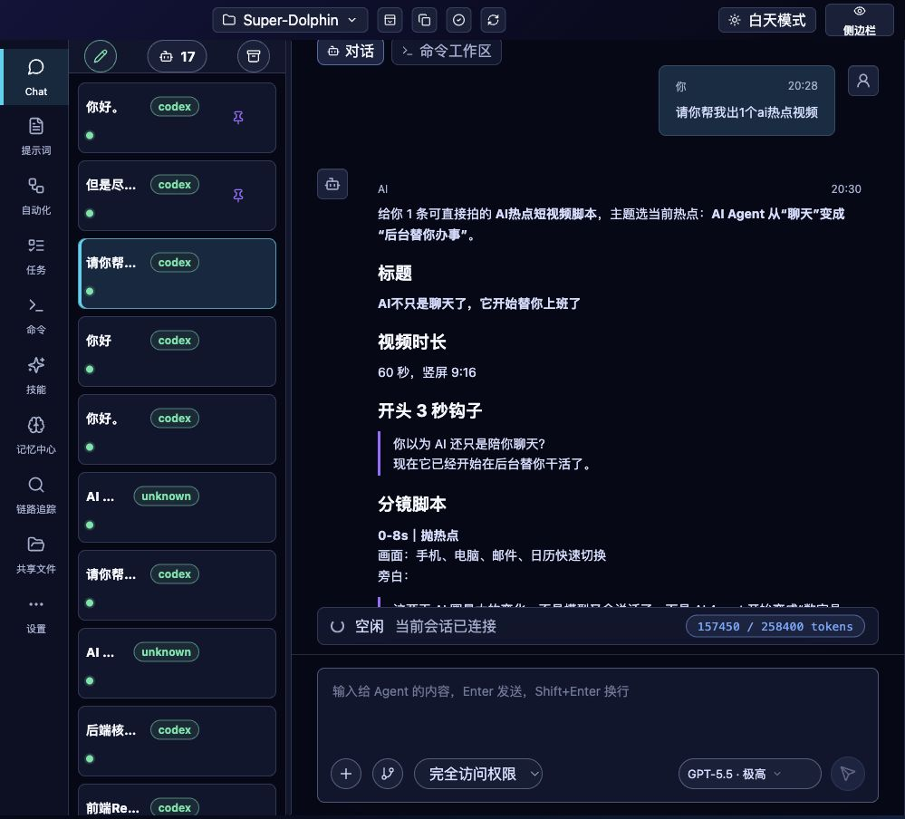
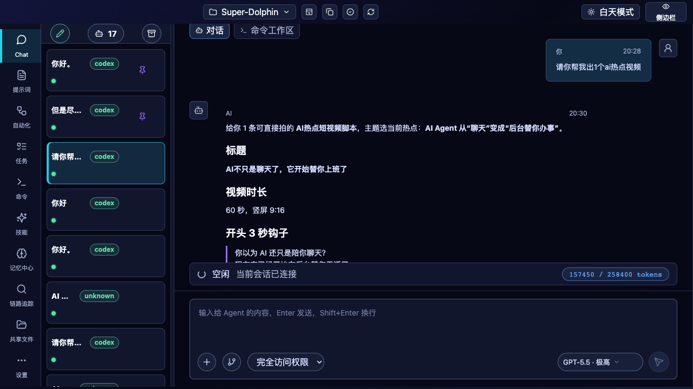

# 旧 UI 删除可行性与新 UI 运行路径差异分析

日期：2026-06-03
范围：

- 新 UI：`/Users/ai/Desktop/Super-Dolphin/frontend-app`
- 旧 UI 与桌面宿主目录：`/Users/ai/Desktop/Super-Dolphin/cmd/agent-terminal`

## 1. 结论

`frontend-app` 作为新 UI 已经可以跑起来，并且本轮验证覆盖了 Vite 开发页面、Chrome、Browser、Playwright CLI、生产 build、Go 宿主编译和新 UI 脚本契约测试。

但现在还不能直接删除整个 `cmd/agent-terminal/frontend`。原因不是旧 Vue 页面仍是主 UI，而是当前默认构建和打包链路仍把这个目录当作构建或 embed 目标：

1. `cmd/agent-terminal` 本身不能删。它是 Go/Wails/HTTP/RPC 桌面宿主，不是旧页面。
2. `cmd/agent-terminal/frontend.go` 仍 `go:embed all:frontend/dist`，Go embed 不能直接嵌入包目录外的 `frontend-app/dist`。
3. macOS 打包已经迁移为 build `frontend-app` 再同步到 `cmd/agent-terminal/frontend/dist`。
4. Makefile、Linux 打包、`run-debug.sh` 仍指向旧 `cmd/agent-terminal/frontend`。
5. 若直接删除旧 Vue 源码，部分 guard/code-map 测试仍引用旧 Vue 文件路径。

推荐先做“构建链路迁移 + 删除旧 Vue 源码”的小步方案：保留或迁移一个 Go package 内的生成式 embed dist 目录，然后删除 legacy Vue 源码、旧前端 package、旧 E2E 与旧 size/template guard。

## 2. 当前真实运行证据

### 2.1 服务状态

本轮复核到当前服务可用：

| 端口 | 作用 | 结果 |
|---|---|---|
| `127.0.0.1:5175` | `frontend-app` Vite | `curl /` 返回 200 |
| `127.0.0.1:4512` | `cmd/agent-terminal` 后端桥 | `curl /metrics` 返回 200 |

`run-new-ui-desktop.sh` 的当前合同是先启动后端，再启动 `frontend-app` Vite：

- 默认后端：`SUPER_DOLPHIN_HTTP_ADDR=127.0.0.1:4512`
- 默认 Vite：`VITE_DEV_URL=http://127.0.0.1:5175`
- 依赖目录：`FRONTEND_APP_DIR="$PROJECT_DIR/frontend-app"`
- 关键行：`run-new-ui-desktop.sh:608-688`

对应 Go 测试也锁住了这个合同，禁止脚本回退到 legacy frontend：

- `internal/app/new_ui_scripts_test.go:9-45`

### 2.2 Browser / Chrome / Computer Use / Playwright

| 工具 | 验证内容 | 结果 |
|---|---|---|
| Browser | 打开 `http://127.0.0.1:5175/`，读取标题、shell、导航和 console | 标题 `Super Agent Frontend App`；`data-testid=frontend-app` 为 1；10 个主导航均存在；error/warn 为 0 |
| Chrome | 通过 Chrome 插件认领本地标签，重载 `5175` 后复核 | 标题、shell、10 个导航均正常；error/warn 为 0 |
| Computer Use | 查看本机 Chrome 可见状态 | Chrome 正在运行；标签栏里同时存在正常 `Super Agent Frontend App` 和一个历史崩溃旧标签。自动化重载后的当前标签正常 |
| Playwright CLI | 独立打开 `5175`，snapshot、eval、console、截图 | 标题正确；shell 为 true；10 个导航均为 true；warning/error console 为 0 |

截图：





### 2.3 构建与嵌入验证

已执行并通过：

```bash
cd frontend-app
npm run lint
npm test
npm run build
```

结果：

- `npm run lint` 通过。
- `npm test` 通过：19 个 test files，465 个 tests。
- `npm run build` 通过；仅 Vite 大 chunk warning，非阻断。

生产 embed 路径验证：

```bash
rsync -a --delete frontend-app/dist/ cmd/agent-terminal/frontend/dist/
grep -o '<title>[^<]*</title>' cmd/agent-terminal/frontend/dist/index.html frontend-app/dist/index.html
go build ./cmd/agent-terminal
```

结果：

- 两边 dist 标题均为 `<title>Super Agent Frontend App</title>`。
- `go build ./cmd/agent-terminal` 通过，仅 macOS SDK 版本链接 warning。

脚本/守卫验证：

```bash
./scripts/test_with_guard.sh ./internal/app -run TestNewUI -count=1
./scripts/test_with_guard.sh ./scripts -run TestPackageMacOSScriptEmbedsNewFrontendApp -count=1
```

结果：

- `internal/app` 新 UI 脚本契约测试通过。
- macOS package 新 UI embed 守卫通过。
- 两条 Go 验证都有同一类 macOS SDK 链接 warning，但测试通过。

## 3. 运行路径删除风险矩阵

| 路径 | 当前是否用新 UI | 删除旧 Vue 源码后状态 | 证据 |
|---|---|---|---|
| `./run-new-ui-desktop.sh` | 是 | 可继续跑 | `run-new-ui-desktop.sh:608-688` 指向 `frontend-app`；`internal/app/new_ui_scripts_test.go:39-43` 禁止 legacy npm |
| `frontend-app npm run dev/build/test/lint` | 是 | 可继续跑 | `frontend-app/package.json:6-13` |
| 手动 `frontend-app build` + `rsync` + `go build ./cmd/agent-terminal` | 是 | 可继续跑 | 本轮已验证 |
| `scripts/package_macos.sh` | 是 | 可继续跑 | `scripts/package_macos.sh:1206-1219` build `frontend-app` 后 rsync 到 embed dist；`scripts/package_macos_guard_test.go:166-175` 有守卫 |
| `make build` / `make build-plain` / `make run` / `make test` | 否 | 会断或回构旧 UI | `Makefile:10` 仍是 `FRONTEND_DIR := cmd/agent-terminal/frontend`，`Makefile:40-49` 仍在旧目录 npm build |
| `scripts/package_linux.sh` | 否 | 会断或回构旧 UI | `scripts/package_linux.sh:642-646` 仍 `cd "$root/cmd/agent-terminal/frontend"` |
| `run-debug.sh` | 否 | 会断或回构旧 UI | `run-debug.sh:30`、`run-debug.sh:363-418` 仍指旧 frontend，端口 5173 |
| `internal/archtest/error_prone_pattern_guard.go` | 旧 Vue guard | 删除旧文件后 guard 不再覆盖目标 | `internal/archtest/error_prone_pattern_guard.go:54-95`、`:312-319` 锁的是旧 Vue streaming 文件 |
| `scripts/generate_ai_project_map.js` | 旧路径知识 | 删除后 code-map 文案会过期 | `scripts/generate_ai_project_map.js:66-75`、`:152-155` 仍把 Vue UI 作为 quick route |

## 4. 两套 UI 的逻辑和后端差异

### 4.1 规模与测试资产

| 指标 | `frontend-app` 新 UI | legacy Vue UI |
|---|---:|---:|
| 生产源码文件 | 40 | 193 |
| 单元/组件测试文件 | 17 | 143 |
| legacy E2E spec | 不在 `frontend-app` 内 | 19 |

含义：

- 新 UI 已是当前主客户端，但源码更集中，测试文件更少。
- 旧 UI 的最大保留价值是历史行为测试和 E2E 用例，不是当前默认运行价值。
- 删除旧 UI 前，应把旧 E2E 中仍有产品价值的场景迁移成 `frontend-app` 的 Playwright/Vitest 覆盖，尤其是 Chat timeline、diff、citation、settings、cron 边界。

### 4.2 页面和渲染

Browser/Playwright 实测新 UI 主导航均可见：

- `Chat`
- `提示词`
- `自动化`
- `任务`
- `命令`
- `技能`
- `记忆中心`
- `链路追踪`
- `共享文件`
- `设置`

新 UI 相对旧 UI 的主要变化：

1. React + Zustand + React Query，入口在 `frontend-app/src/App.jsx` 与 `frontend-app/src/main.jsx`。
2. 导航和路由更明确，包含旧 UI 没有的 `链路追踪` 页面。
3. 视觉渲染在 Browser、Chrome、Playwright CLI 中均可打开，console error/warn 为 0。
4. legacy Vue 的 UI 密度和历史细节更深，但并不等于当前运行路径更完整。

### 4.3 后端对接

静态扫描口径下，新 UI 的 RPC facade/bridge 面大于旧 UI：

| 指标 | React 新 UI | legacy Vue UI |
|---|---:|---:|
| 静态 RPC 方法面 | 101 | 83 |
| 共有方法 | 82 | 82 |

React-only 主要集中在：

- `observability/*`
- `dashboard/dags`
- `dashboard/logs`
- `dashboard/sharedFiles`
- `skills/create`
- `ui/preferences/getAll`
- `ui/projects/*`
- `ui/memory/similarity/consolidate-all/start`
- `ui/memory/similarity/consolidate-all/status`

注意：旧扫描中的 `cronjob/...` 是 `services/cron-api.js` 注释里的占位字符串，不是实际后端方法缺口。

实际判断：

1. 新 UI 已覆盖主业务页面和更多观测/项目状态接口。
2. legacy Vue 仍保留大量历史测试，尤其是旧 Chat timeline/diff/citation 的边界案例。
3. 删除旧 UI 的核心风险不是后端接口缺失，而是构建链路和测试资产迁移不完整。

## 5. 现在直接删除会断什么

如果现在删除 `cmd/agent-terminal/frontend` 整个目录，至少会出现这些问题：

1. `go build ./cmd/agent-terminal` 会因为 `//go:embed all:frontend/dist` 找不到路径而失败。
2. `make build`、`make build-plain`、`make run`、`make test` 会因为 `FRONTEND_DIR := cmd/agent-terminal/frontend` 失败。
3. `scripts/package_linux.sh` 会因为旧前端目录不存在而失败。
4. `run-debug.sh` 会因为旧前端目录不存在或仍启动旧 Vite 失败。
5. `internal/archtest/error_prone_pattern_guard.go` 中的旧 Vue guard 会失去目标文件；如果 guard 逻辑要求目标存在或后续修改触发，删除后需要改成 React 对应守卫或删除。
6. code-map 生成脚本和仓库说明会继续把 Vue 前端列为主修改入口，给后续 agent 带来错误上下文。

## 6. 推荐删除方案

### 方案 A：保留生成式 embed 目录，删除 legacy 源码

这是最小改动方案。

做法：

1. 保留 `cmd/agent-terminal/frontend/dist` 作为 Go embed 生成目录。
2. 删除 `cmd/agent-terminal/frontend/vue-app`、旧 `tests/e2e`、旧 `scripts`、旧 `package.json` / `package-lock.json`、旧 Vite/Vitest/Playwright 配置、旧 `lib` 等 legacy Vue 资产。
3. 修改 Makefile：`frontend-build` 改为在 `frontend-app` 执行 `npm run build`，然后 `rsync frontend-app/dist/ cmd/agent-terminal/frontend/dist/`。
4. 修改 `scripts/package_linux.sh`，对齐 macOS：build `frontend-app`，再 rsync 到 embed dist。
5. 修改或废弃 `run-debug.sh` 中旧 frontend 路径；推荐让它转调 `run-new-ui-desktop.sh` 或明确改到 `frontend-app`。
6. 把旧 Vue arch guards 迁移到 React 对应文件，或在删除 legacy 后移除这些旧 guard。
7. 更新 project map、README、AGENTS/CLAUDE 中旧路径说明。

优点：改动小，`cmd/agent-terminal/frontend.go` 可以暂时不动。
缺点：目录名仍叫 `frontend`，容易误解为旧 UI 仍存在。

### 方案 B：迁移 embed 目录后删除整个旧目录

这是更干净的方案。

做法：

1. 新建 Go package 内的 embed 目录，例如 `cmd/agent-terminal/web/dist`。
2. 修改 `cmd/agent-terminal/frontend.go`：
   - 从 `//go:embed all:frontend/dist`
   - 改为 `//go:embed all:web/dist`
   - `fs.Sub(frontendDist, "web/dist")`
3. 所有构建脚本把 `frontend-app/dist` rsync 到新 embed 目录。
4. 删除整个 `cmd/agent-terminal/frontend`。
5. 同步修改 Makefile、Linux/macOS package、run-debug、tests、project map、docs。

优点：旧 UI 目录可以真正消失，后续不再混淆。
缺点：改动比方案 A 大，需要更新更多路径和测试。

### 推荐

如果目标是“尽快删除旧 UI 源码，保持新 UI 可跑”，先用方案 A。
如果目标是“目录层面也不要再留下 `cmd/agent-terminal/frontend`”，用方案 B。

从当前仓库状态看，方案 A 是更稳的第一步：它已经被 macOS package 采用了同样的思路，并且本轮手动验证证明 `frontend-app/dist -> cmd/agent-terminal/frontend/dist -> go build ./cmd/agent-terminal` 可行。

## 7. 删除前后的验证清单

删除前必须先让这些命令通过：

```bash
cd frontend-app
npm run lint
npm test
npm run build
```

```bash
rsync -a --delete frontend-app/dist/ cmd/agent-terminal/frontend/dist/
go build ./cmd/agent-terminal
```

```bash
./scripts/test_with_guard.sh ./internal/app -run TestNewUI -count=1
./scripts/test_with_guard.sh ./scripts -run TestPackageMacOSScriptEmbedsNewFrontendApp -count=1
```

完成 Makefile/Linux/run-debug 迁移后，还应新增或更新验证：

```bash
make build-plain
make run-plain
./scripts/test_with_guard.sh ./scripts -run 'TestPackage.*Frontend' -count=1
```

若删除旧 Vue guard，还需要：

```bash
make guard
```

Browser/Chrome/Playwright smoke：

1. 打开 `http://127.0.0.1:5175/`。
2. 确认标题为 `Super Agent Frontend App`。
3. 确认 `data-testid=frontend-app` 存在。
4. 确认 10 个主导航存在。
5. 确认 console error/warn 为 0。

## 8. 当前最终判断

新 UI 本身已经可以跑，并且能被 Go 宿主嵌入。旧 UI 可以作为删除目标，但不能在不迁移构建链路的情况下直接删目录。

最小安全路径是：

1. 先把 Makefile、Linux package、run-debug 改成 `frontend-app build -> rsync embed dist -> Go build`。
2. 把旧 Vue guard/code-map/docs 改掉。
3. 再删除 legacy Vue 源码和旧前端 package。
4. 最后跑完整验证，确保默认 `make` 和 package 路径不再回到旧 UI。
