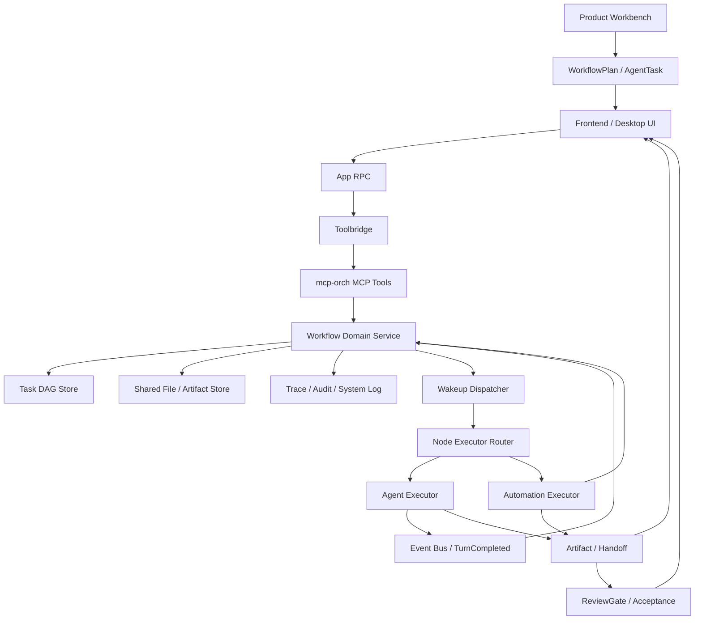

# Super-Dolphin 工作流基础架构设计方案

> 日期：2026-06-22  
> 状态：设计方案，已根据 6 个子代理交叉审查修订
> 参考文档：`docs/ai01-docs/工作流/调研go语言工作流相关参考方案.md`

## 1. 目标

本方案用于统一 Super-Dolphin 的工作流基础架构方向：保留并收敛当前项目已有的 DAG v2 / `cmd/mcp-orch` 编排能力，把它明确定位为 Workflow Runtime Kernel，同时在其上补齐 Agent 协作层和产品工作流层。

目标不是重新造一个 Go 版 LangGraph / CrewAI，也不是立即把现有 runtime 替换成 Temporal。目标是形成一个可长期演进、可审计、可恢复、可产品化的三层工作流基础架构：

1. **Runtime Kernel**：Go 持有确定性流程、持久状态、调度、重试、幂等、审计和追踪。
2. **Agent Workflow Layer**：把计划、任务拆分、子代理派发、交叉审查、交接、验收和 artifact 管理做成一等对象。
3. **Product Workflow Layer**：提供工作台、模板发现/保存、运行看板、失败恢复、审批 MVP、MR 集成和团队协作入口。

核心约束：

- LLM / Agent 只作为局部智能能力参与执行，不决定全局流程状态。
- MCP tools、RPC、UI 都是适配入口，不承载核心业务状态机。
- 模板、定义、运行、节点快照、调度、artifact、审查和验收必须分层。
- 未实现能力必须隐藏或 fail-fast，不能通过默认值、静默降级或半成品 UI 暴露给用户。
- 文档必须区分“当前已有事实”和“目标设计”，避免把未落地能力描述成已完成能力。

## 2. 结论摘要

推荐路线：

```text
现有 DAG v2 / cmd/mcp-orch
  -> 明确为 Workflow Runtime Kernel
  -> 修正状态模型与现有 DB/ADR/代码一致
  -> 补齐 policy、audit、trace、lease、idempotency、store 约束
  -> 在 runtime 之上增加 Agent Workflow Layer
  -> 再增加 Product Workflow Layer 和工作台能力
  -> Temporal / River / Eino 作为未来可选局部能力，不作为当前主引擎
```

不推荐路线：

```text
直接替换为 Temporal 主引擎
复制 LangGraph / CrewAI 的 LLM-first 全局编排模型
让 workflowtemplate 承担运行时职责
让 MCP tools 成为唯一业务逻辑层
继续暴露 Hybrid / HITL 等尚未完整实现的可运行能力
只做 runtime 内核，不补多 Agent 协作和产品工作台
```

## 3. 三层架构边界

### 3.1 Runtime Kernel

Runtime Kernel 是当前最扎实的基础，主要由 `cmd/mcp-orch` 承担。

它负责：

- Workflow definition / run / node run 的持久化。
- run 启动时克隆节点快照。
- root promotion、wakeup 创建、lease claim、dispatch。
- Agent / Automation executor 路由。
- Agent 完成事件订阅。
- retry / fail / cascade。
- 最终 run 状态推进。

它不负责：

- 让 LLM 动态改写全局流程。
- 解释自然语言计划。
- 代替 UI 做用户决策。
- 代替审查层判断代码正确性。
- 代替 MR/PR 系统管理代码交付。

### 3.2 Agent Workflow Layer

Agent Workflow Layer 建立在 Runtime Kernel 之上，用于表达“人类 + 多 Agent 协作”的工作流。

它需要把以下对象做成一等领域概念：

| 对象 | 含义 |
| --- | --- |
| `WorkflowPlan` | 目标、范围、风险、验收标准、eval 列表 |
| `AgentTask` | 15 分钟左右的可验证任务单元，含输入上下文、输出要求、验证命令、预算 |
| `AgentRole` | planner、implementer、reviewer、validator、integrator 等角色 |
| `ReviewGate` | 审查入口，记录阻塞意见、复审状态和通过条件 |
| `CrossValidation` | 多代理独立复核、差异比较和仲裁记录 |
| `HandoffPackage` | 交接摘要、已尝试方案、失败证据、剩余风险、下一步 |
| `Artifact` | 文档、补丁、日志、trace、测试输出、截图、MR 链接等产物 |
| `ArtifactLifecycle` | draft、candidate、reviewed、accepted、merged、discarded |
| `AcceptanceRecord` | 用户验收、自动验收、回归验证和残余风险 |
| `ChangeRequest` | 分支、提交、检查、审查、MR/PR、合并、回滚关联 |

这层不替代 DAG runtime。它把 DAG 节点中的 Agent Activity 组织成可审查、可交接、可验收的工程流程。

### 3.3 Product Workflow Layer

Product Workflow Layer 是用户真正感知“工作流基础架构”的层。

它需要覆盖：

- 模板发现、渲染、保存、发布、版本和信任。
- 工作流设计、微调、启动和运行。
- 运行看板：节点状态、失败原因、trace、artifact、最后一次调度。
- 失败恢复：retry failed node、rerun from node、resume run、cancel with cleanup、edit-and-retry。
- 审批 MVP：高风险操作挂起、approve/reject、timeout、审计、恢复。
- 多 Agent 工作台：计划、任务队列、审查队列、验收面板、artifact 浏览器。
- 代码交付：分支、提交、检查、MR/PR 状态回写和合并前验证。

如果只完成 Runtime Kernel，而不做这层，技术上可以调度 DAG，但用户仍然不会得到完整工作流基础设施。

## 4. 从参考文档采纳的原则

参考文档中最值得采纳的不是某一个库，而是架构分层原则。

### 4.1 Go 是生产工作流主控

生产级工作流不应由 LLM 动态决定下一步。Go 应该持有：

- 流程定义。
- 运行实例。
- 节点状态。
- 重试策略。
- 权限策略。
- 审计事件。
- 追踪上下文。
- 最终输出规则。

LLM 可以生成候选 DAG、执行 Agent 节点、总结上下文或判断局部结果，但不能绕过 Go runtime 直接改变全局运行状态。

### 4.2 所有状态结构化

工作流运行时不应依赖自然语言描述状态。状态必须落在结构化对象中：

- `WorkflowDefinition`：工作流定义。
- `WorkflowRun`：一次运行实例。
- `WorkflowNodeRun`：运行中的节点快照。
- `Wakeup`：待调度任务。
- `Lease`：调度租约。
- `NodeResult`：节点小结果。
- `SharedFile`：大结果和跨节点上下文。
- `Artifact`：工作流上层产物。
- `ReviewGate`：审查和验收状态。

### 4.3 工具注册必须可治理

工具不是简单函数表。每个 tool / activity 都必须具备治理元数据：

- 名称和版本。
- 输入输出 schema。
- capabilities。
- 权限等级。
- workspace scope。
- risk class。
- timeout。
- retry 策略。
- audit 策略。
- redaction 规则。
- idempotency 要求。
- 是否需要审批。

当前 `cmd/mcp-orch/tools` 的 `ToolDefinition` 主要包含 `Name`、`Description`、`InputSchema`、`Handler`，因此本节是目标设计，不是当前已落地事实。

### 4.4 观测、评估和验收是基础能力

工作流必须能回答：

- 哪个请求启动了哪个 workflow？
- 哪个 run 卡住了？
- 哪个 node 卡住了？
- 哪个 Agent 线程对应哪个 node？
- 哪个工具调用导致失败？
- 重试是否符合策略？
- 最终输出来自哪些上游节点？
- 哪个 artifact 被哪个 reviewer 接受？
- 哪个 MR/PR 对应哪个 workflow run？

因此 trace 维度应覆盖：

```text
request -> workflow -> run -> node -> executor -> tool/LLM/retrieval -> artifact -> review -> acceptance -> change request
```

## 5. 需要推翻或收敛的现有方向

### 5.1 不应把 Temporal 作为当前主引擎

参考文档推荐的生产组合是 `Temporal Go SDK + Eino/Genkit + Postgres/Redis + MCP + OTEL/Langfuse`。这在云端、高可用、跨服务长期工作流场景中合理，但不适合作为 Super-Dolphin 当前阶段的直接替换。

原因：

- 项目已有 `cmd/mcp-orch`，已经承担 sidecar 编排职责。
- 当前已有 DAG、run、node、wakeup、lease、dispatcher、executor、subscriber 等基础设施。
- 桌面应用通过 toolbridge 代理到 `mcp-orch`，直接引入 Temporal 会改变部署模型。
- 当前产品更像本地桌面 + sidecar runtime，不是多机高可用 workflow cluster。
- 直接迁移会把主要风险从“补齐 runtime 纪律”变成“重写运行时和数据模型”。

结论：Temporal 只作为未来 backend 选项保留，不进入当前主路径。

### 5.2 不应复制 LangGraph / CrewAI 的 LLM-first 模型

LangGraph / CrewAI 类框架适合原型和 Agent 编排实验，但 Super-Dolphin 的工作流需要：

- 可审计。
- 可恢复。
- 可重试。
- 可回放诊断。
- 可权限控制。
- 可跨 UI / MCP / RPC 访问。
- 可进入工程审查和 MR 生命周期。

因此不能让 LLM 直接决定全局边、状态和写操作。LLM 只能是节点能力。

### 5.3 `workflowtemplate` 不应承担运行时职责

现有 `workflowtemplate` 模块应保持为模板目录和草稿渲染层：

- list template。
- get template。
- render DAG draft。
- 生成 UI 可预览草稿。

它不应该：

- 写入 DAG 存储。
- 启动 run。
- 调度节点。
- 改变 node 状态。
- 存储运行结果。

模板和运行时必须分离，否则权限、审计、版本快照和回放都会混乱。

### 5.4 MCP tools 不应成为业务核心

当前 `task_create_dag`、`task_dag_apply_ops`、`task_dispatch_node`、`task_start_dag` 等 MCP tools 是必要入口，但核心逻辑必须逐步收敛在 orchestration domain service 中。

目标边界：

```text
MCP Tool Handler
  -> decode / validate request
  -> call Workflow Domain Service
  -> encode response

Workflow Domain Service
  -> validate state transition
  -> update store
  -> write events
  -> schedule wakeups
  -> enforce policy
```

现实约束：当前部分 task schema 和 handler 已承担输入归一化、拓扑校验、root assignee 启动校验等业务规则。实施时不能假设 MCP tools 已经是纯薄适配层，而应逐步迁移复杂状态逻辑。

### 5.5 不应继续暴露未实现的 Hybrid / HITL 可运行能力

当前 Hybrid 节点存在 schema / UI / 提示词层面的设计，但 runtime 明确未完整实现。`waiting_human`、`skipped`、`awaiting_verify` 等状态或路径也需要区分 legacy、保留状态和公开 API。

处理方式：

1. 从用户可见模板、设计器提示和 UI 中隐藏未闭环能力。
2. 如果保留展示，创建或启动时必须 fail-fast，并禁止创建可执行 run。
3. 不允许“可创建但运行时才失败”的半成品能力。

推荐选择 1，直到 runtime、状态机、UI 和测试全部闭环。

### 5.6 不应把 Runtime Kernel 误认为完整产品工作流

Runtime Kernel 解决“能不能可靠执行 DAG”。工作流基础架构还必须解决：

- 如何拆任务。
- 如何派发多个子代理。
- 如何审查和复审。
- 如何管理 artifact。
- 如何验收。
- 如何失败恢复。
- 如何进入 MR/PR。
- 如何让用户在工作台上理解和操作。

因此本方案必须同时规划 Agent Workflow Layer 和 Product Workflow Layer。

## 6. 推荐架构

### 6.1 总体分层



### 6.2 模块责任

| 层 | 责任 | 不负责 |
| --- | --- | --- |
| `frontend-app` | 工作台、模板、DAG、run、node、trace、artifact、审查和验收展示 | 本地决定持久状态迁移 |
| `internal/app` | 通过 `DAGRuntime` 代理调用 `mcp-orch` | 嵌入编排服务 |
| `internal/platform/toolbridge` | 工具传输桥、host-direct template tools、launch context 注入 | workflow 业务状态机 |
| `cmd/mcp-orch/tools` | MCP schema、参数校验、调用 domain service | 长期承载复杂状态迁移 |
| `cmd/mcp-orch/orchestration` | runtime、状态迁移、调度、执行、完成订阅 | UI 展示逻辑 |
| `cmd/mcp-orch/store/taskdag` | DAG、run、node、wakeup、lease 持久化 | shared file 全部语义 |
| shared file store | 大输出、跨节点上下文、artifact 引用 | node/run 状态迁移 |
| `internal/module/workflowtemplate` | 模板目录、草稿渲染、输入 schema | run / node 持久化 |
| Executor | 执行 Agent / Automation 节点 | 修改非本节点外的 workflow 结构 |
| Observability | trace、audit、system log、诊断 | 参与流程决策 |

### 6.3 核心领域对象和当前映射

| 领域对象 | 当前映射 | 成熟度 | 说明 |
| --- | --- | --- | --- |
| `WorkflowDefinition` | `task_dags` / DAG template | 已有基础 | 可运行定义 |
| `WorkflowVersion` | `task_dags.version` | 已有基础 | run 启动时快照 |
| `WorkflowRun` | `task_dag_runs` | 已有基础 | 当前持久状态受 DB CHECK 限制 |
| `WorkflowNodeRun` | `task_dag_nodes.run_id != NULL` | 已有基础 | 运行时节点快照 |
| `Wakeup` | taskdag wakeup store | 已有基础 | 调度任务 |
| `Lease` | wakeup claim fields | 已有基础但需补语义 | 需要 owner、TTL、fencing token、过期写拒绝 |
| `ActivityExecutor` | `nodeexec` / router | 已有基础 | Agent / Automation 已有，Hybrid 未闭环 |
| `NodeResult` | node result 字段 | 已有基础 | 小体积结构化输出 |
| `SharedFile` | shared file store adapter | 已有基础但需补安全规则 | 大输出和跨节点上下文 |
| `PolicyDecision` | 无统一对象 | 目标设计 | policy/audit/tool governance 待补 |
| `WorkflowTraceEvent` | run events / toolbridge trace 等分散能力 | 目标设计 | 需要统一字段和查询 API |
| `WorkflowPlan` | 无统一对象 | 目标设计 | Agent 工作流上层计划 |
| `AgentTask` | 当前多由 prompt/thread 隐式表达 | 目标设计 | 子代理可验证任务单元 |
| `ReviewGate` | 无统一对象 | 目标设计 | 质量审查，不等同 policy gate |
| `Artifact` | shared file、日志、MR 链接等分散对象 | 目标设计 | 需要生命周期和归属 |
| `ChangeRequest` | Git/GitLab/GitHub 外部对象 | 目标设计 | MR/PR 生命周期绑定 |

### 6.4 现有能力补充

文档和后续实施计划需要显式覆盖这些已存在能力：

- host-direct workflow template tools：`workflow_template_list`、`workflow_template_get`、`workflow_template_render_dag`。
- task tools 完整集合：`task_create_dag`、`task_dag_apply_ops`、`task_update_node`、`task_dispatch_node`、`task_start_dag`、`task_terminate_dag`、`task_delete_dag`、`task_get_run`、`task_list_runs`、`task_diagnose_dag_prompt_identity_gaps`。
- toolbridge launch context 注入能力。
- scheduled DAG cron runner。
- wakeup reclaimer。
- TurnCompleted subscriber。

## 7. Runtime 生命周期

### 7.1 创建定义

```text
workflow_template_render_dag
  -> 生成 DAGDraft
  -> 用户或 Agent 确认
  -> task_create_dag
  -> 持久化 WorkflowDefinition
```

约束：

- `task_create_dag` 只创建定义，不启动 run。
- 模板渲染结果必须通过 schema 校验。
- `final_node_key` 必须唯一。
- Agent node 必须声明 `config.exec.cwd`。
- 输出超过小结果限制时必须写 shared file。
- Hybrid / HITL 未闭环前不能生成可执行 DAG。

### 7.2 启动运行

```text
task_start_dag
  -> validate definition
  -> create WorkflowRun
  -> clone nodes into runtime snapshot
  -> promote root nodes
  -> create wakeups for runnable roots
  -> return run_id / ready roots / scheduled wakeups / execution_state
```

约束：

- run 使用 definition version 快照。
- 运行中节点只读 run snapshot，不回退读取 template。
- 幂等键冲突必须明确返回，不静默创建另一个 run。
- 当前不把 `waiting_for_assignee` 作为持久 node 状态；它应是 `ready + assigned_to 为空` 的派生展示状态，或 `StartDAG.execution_state`。
- 没有 assignee 的 root node 不发 wakeup，等待 `task_dispatch_node` 分配。

### 7.3 调度节点

```text
WakeupDispatcher
  -> claim due wakeups
  -> acquire short dispatch lease
  -> load WorkflowNodeRun
  -> route by node_type
  -> mark running or run automation
  -> complete / retry / fail / cascade when executor returns synchronously
```

约束：

- Dispatcher 是 `Runner`，由 RunGroup 管理。
- 不允许构造函数或 `OnStart` 中启动无管理 goroutine。
- Agent 长任务完成由 TurnCompleted subscriber 推进，不能把 dispatcher 设计成长期等待 Agent 完成。
- lease 语义必须区分短 dispatch lease 和长 Agent execution ownership。
- 每次 dispatch 必须写可查询事件；统一 `WorkflowTraceEvent` 属于目标设计。

### 7.4 Agent 节点

```text
AgentExecutor
  -> validate exec config
  -> policy check
  -> launch child agent
  -> record spawning_thread_id
  -> mark node running
  -> TurnCompleted subscriber materializes result
  -> domain service completes node
```

约束：

- provider、cwd、prompt、identity override 必须完整校验。
- 子 Agent 线程 ID 是 node 完成订阅的关联键。
- Agent 输出必须经过 result/shared file 物化规则。
- Agent 不直接修改下游 node 状态，由 domain service 完成状态推进。
- 重复 TurnCompleted 必须幂等处理。

### 7.5 Automation 节点

```text
AutomationExecutor
  -> validate command card
  -> policy check
  -> execute command with timeout
  -> map outputs
  -> write node result / shared file
  -> complete node
```

约束：

- Automation 输出不得注入 Agent prompt、provider routing、assignee 等控制字段。
- Windows / Unix 执行应通过 command runner adapter 区分，不能把单一 shell 当成长期方案。
- 默认使用 argv 风格执行；shell 执行需要显式高风险 policy。
- 命令风险等级必须进入 policy/audit。

### 7.6 完成与下游推进

```text
complete node
  -> validate transition
  -> persist result
  -> evaluate downstream dependencies
  -> promote ready downstream nodes
  -> schedule wakeups
  -> update run summary
  -> if final node completed, materialize final output by explicit rule
```

约束：

- 状态迁移必须经过统一 transition 函数。
- terminal node 不能重新进入 running。
- final output 只能从声明的 final node 或最终聚合规则产生。
- 当前 production store/sqlc 尚未把“完成 final node、写 `metadata.final_output`、设置 run `succeeded`”收敛到同一事务内，因此 final output 事务化是目标设计，不应写成当前事实。

## 8. Agent 与产品工作流生命周期

Runtime 之外，需要补一条上层工程工作流：

```text
capture intent
  -> create WorkflowPlan
  -> decompose AgentTask
  -> dispatch subagents
  -> collect Artifact
  -> ReviewGate
  -> CrossValidation
  -> AcceptanceRecord
  -> ChangeRequest / MR
  -> archive / handoff
```

### 8.1 WorkflowPlan

`WorkflowPlan` 至少包含：

- 目标。
- 非目标。
- 风险。
- 验收标准。
- eval 列表。
- 允许修改范围。
- 预期 artifact。
- 预算和超时。

### 8.2 AgentTask

`AgentTask` 必须能在有限上下文内完成和验证。默认按 15 分钟左右的工程单元拆分：

- 一个明确目标。
- 一个写入范围或只读范围。
- 输入上下文。
- 输出要求。
- 验证命令。
- 失败时交接格式。
- 与其它任务的依赖关系。

### 8.3 ReviewGate

`ReviewGate` 管正确性，不管权限。它和 `PolicyGate` 必须分开。

ReviewGate 至少记录：

- reviewer 类型：human、agent、tool。
- 审查对象：patch、doc、artifact、run、MR。
- 阻塞意见。
- 非阻塞意见。
- 复审状态。
- 通过条件。
- 关联验证证据。

### 8.4 HandoffPackage

长任务或失败任务必须生成 handoff package：

- 当前目标。
- 已完成内容。
- 已尝试方案。
- 失败证据。
- 残余风险。
- 相关 artifact。
- 下一步建议。
- 上下文预算提示。

### 8.5 Product Workbench

工作台应提供这些视图：

- 计划视图：目标、任务、依赖、验收标准。
- 任务队列：pending、running、reviewing、accepted、failed。
- 运行看板：run/node/trace/failure/artifact。
- 审查队列：review gate、阻塞意见、复审。
- 验收面板：验证命令、输出证据、残余风险。
- MR 面板：分支、提交、检查、评论、合并状态。

## 9. 状态机设计

### 9.1 持久 Node 状态

持久状态必须优先对齐当前 ADR、代码和 DB 约束。当前可见状态集合：

| 状态 | 含义 | 公开策略 |
| --- | --- | --- |
| `pending` | 等待上游完成 | 可公开 |
| `ready` | 可调度，或已满足依赖但等待 assignee | 可公开 |
| `running` | 已被 executor 接管 | 可公开 |
| `retrying` | 等待重试 | 可公开，但需要策略表 |
| `done` | 成功完成 | 可公开 |
| `failed` | 失败终止 | 可公开 |
| `cancelled` | run 终止导致取消 | 可公开 |
| `skipped` | 保留/历史能力 | 不对外创建，需说明 legacy 策略 |
| `waiting_human` | 保留/未闭环 HITL | 不对外创建 |

### 9.2 派生展示状态

这些状态不应直接写入 node status，除非后续显式做 DB migration 和状态迁移方案：

| 派生状态 | 来源 | 含义 |
| --- | --- | --- |
| `waiting_for_assignee` | `ready + assigned_to 为空` 或 `StartDAG.execution_state` | 依赖满足但缺执行者 |
| `waiting_timer` | wakeup due_at 在未来 | 等候定时触发 |
| `blocked_by_policy` | policy decision | 权限或风险策略阻塞 |
| `awaiting_review` | ReviewGate | 等待质量审查 |
| `awaiting_acceptance` | AcceptanceRecord | 等待验收 |

### 9.3 Node Transition Matrix

| From | To | 触发 |
| --- | --- | --- |
| `pending` | `ready` | 上游依赖全部满足 |
| `ready` | `running` | dispatcher 成功领取并开始执行 |
| `running` | `done` | executor / subscriber 完成 |
| `running` | `failed` | 不可重试失败 |
| `running` | `retrying` | 可重试失败且预算未耗尽 |
| `retrying` | `ready` | retry wakeup 到期 |
| `retrying` | `failed` | 重试预算耗尽 |
| `pending` / `ready` / `running` / `retrying` | `cancelled` | run 被终止 |

禁止迁移：

- `done -> *`
- `failed -> *`
- `cancelled -> *`
- `ready -> done`
- `pending -> running`
- `ready + assigned_to 为空 -> running`

### 9.4 持久 Run 状态

当前持久 run 状态应对齐 DB CHECK：

| 状态 | 含义 |
| --- | --- |
| `running` | run 已创建，存在未完成节点、等待调度、等待分配或正在执行 |
| `succeeded` | run 已成功终止 |
| `failed` | 失败策略导致 run 失败 |
| `cancelled` | 用户或系统终止 |

### 9.5 派生 Run 展示状态

| 展示状态 | 来源 |
| --- | --- |
| `created` | 如果未来引入启动前草稿 run，才可成为持久状态 |
| `waiting_for_assignee` | 存在 `ready + assigned_to 为空` 节点 |
| `waiting_timer` | 只剩未来 wakeup |
| `running_active` | 存在 running 节点 |
| `recoverable_failed` | failed 但存在可恢复动作 |

Run 状态由 node、wakeup、review、policy 和 artifact 状态聚合，不允许 UI 或 MCP handler 直接手写最终状态。

## 10. Policy、安全与工具治理

### 10.1 Policy Gate

Policy Gate 管权限和风险，不管质量审查。

当前阶段如果不实现审批 MVP，policy decision 只能是：

```text
allow
deny
fail-fast
```

如果允许 `require_approval`，必须同时实现最小审批闭环：

- pending approval 状态或等价派生状态。
- UI 审批卡片。
- approve/reject。
- timeout。
- audit event。
- 恢复执行。
- 回归测试。

必须进入 policy 的动作：

- 创建、修改、删除 DAG definition。
- 启动、终止 run。
- 分配节点执行者。
- 执行 command card。
- 写 shared file。
- 调用外部服务。
- 创建子 Agent 线程。
- provider identity override。
- 跨 workspace 访问。

### 10.2 Tool Registry 元数据

每个 tool/activity 至少声明：

```json
{
  "name": "task_start_dag",
  "version": "v1",
  "category": "workflow.write",
  "input_schema": "strongly typed schema",
  "output_schema": "strongly typed schema",
  "capabilities": ["workflow.run.start"],
  "risk_class": "write",
  "permission": "workflow:run:start",
  "workspace_scope": "current",
  "timeout_ms": 10000,
  "idempotency_key_required": true,
  "requires_approval": false,
  "retry": {
    "enabled": false
  },
  "audit": {
    "required": true,
    "event_type": "workflow.run.started",
    "redaction_policy": "workflow_default"
  }
}
```

### 10.3 MCP / toolbridge 安全模型

需要补齐的契约：

- stdio 和 HTTP 传输分别定义 client identity。
- session lifecycle：connect、capability negotiation、tool list、cancel、shutdown、reconnect。
- schema versioning：tool 输入输出 schema 变更必须可检测。
- toolbridge 代理必须记录来源、目标 peer、tool name、trace_id。
- 高风险 tool 必须验证 actor、workspace、cwd、capability 和 policy。
- 错误返回不得泄露 token、env、绝对敏感路径和 provider secret。

### 10.4 Command Runner 安全契约

Automation / command card 执行必须满足：

- cwd 必须 canonicalize 后落在允许的 workspace root 内。
- 禁止 `..`、symlink escape、绝对路径跨工作区。
- env 使用 allowlist。
- 默认 argv 执行；shell 执行需要显式高风险 policy。
- stdout/stderr 进入日志前做敏感信息脱敏。
- command result 必须绑定 run_id、node_key、wakeup_id 和 actor。

### 10.5 SharedFile 安全契约

SharedFile 至少需要：

- 路径归属。
- content-type。
- schema。
- 大小上限。
- owner node。
- producer actor。
- 控制字段剥离。
- 敏感内容脱敏策略。
- 作为后续 prompt 输入时的引用规则。
- 审计字段。

### 10.6 Lease 和幂等

Lease 需要明确：

- owner。
- TTL。
- renew。
- fencing token。
- release。
- expired lease write rejection。
- crash recovery。
- 重复 wakeup idempotency key。
- rows affected = 0 的处理。

Idempotency 需要明确：

| 旧 run 状态 | 同 key 行为 |
| --- | --- |
| `running` | 返回已有 run |
| `succeeded` | 返回已有成功 run |
| `failed` | 返回 exhausted / failed，不静默新建 |
| `cancelled` | 返回 exhausted / cancelled，不静默新建 |

## 11. 观测、审计与诊断

### 11.1 Trace 字段

统一事件字段属于目标设计，应逐步从现有 run events、toolbridge trace、system log 中收敛：

| 字段 | 含义 |
| --- | --- |
| `trace_id` | 请求级 trace |
| `workflow_id` | workflow definition |
| `workflow_version` | definition version |
| `run_id` | 运行实例 |
| `node_key` | 业务节点 key |
| `node_run_id` | 运行节点 ID |
| `wakeup_id` | 调度任务 |
| `lease_owner` | lease 持有者 |
| `executor_type` | agent / automation / hybrid |
| `thread_id` | Agent 线程 |
| `tool_name` | MCP/toolbridge/tool 调用 |
| `failure_class` | 现有 failure class |
| `artifact_id` | 输出产物 |
| `review_gate_id` | 审查入口 |
| `change_request_id` | MR/PR 关联 |

### 11.2 Failure Class

文档应对齐现有契约，不单独创造一套不可兼容分类。

现有 failure class 包含：

- `validation`
- `transient`
- `quota`
- `capability`
- `hard`
- `needs_human`
- `infrastructure`

`policy denied` 可以作为 policy decision / audit event，是否进入 failure class 需要单独设计，不能直接写成已存在分类。

### 11.3 事件类型

目标事件类型：

| 事件 | 触发 |
| --- | --- |
| `workflow.definition.created` | 创建 DAG definition |
| `workflow.run.started` | 启动 run |
| `workflow.node.ready` | 节点进入 ready |
| `workflow.node.dispatched` | 节点被分配并入队 |
| `workflow.node.running` | executor 接管 |
| `workflow.node.completed` | 节点完成 |
| `workflow.node.failed` | 节点失败 |
| `workflow.node.retry_scheduled` | 安排重试 |
| `workflow.run.completed` | run 完成 |
| `workflow.run.failed` | run 失败 |
| `workflow.policy.denied` | policy 拒绝 |
| `workflow.review.requested` | 发起审查 |
| `workflow.review.accepted` | 审查通过 |
| `workflow.acceptance.recorded` | 验收记录 |
| `workflow.change_request.linked` | 关联 MR/PR |

### 11.4 诊断入口

保留并增强现有诊断类工具：

- 根据 prompt identity 诊断 DAG。
- 根据 run_id 列出卡住节点。
- 根据 spawning_thread_id 反查 node。
- 根据 failure_class 聚合失败。
- 根据 shared file / artifact 追踪最终输出来源。
- 根据 MR/PR 反查 workflow run。
- 根据 review gate 反查阻塞原因。

## 12. 数据和存储边界

### 12.1 当前阶段

当前阶段继续使用项目已有本地存储模型，不引入新的外部数据库作为硬依赖。

原因：

- 桌面本地和 sidecar 架构更适合轻量持久化。
- 已有 DAG、run、node、wakeup、lease 语义。
- shared file 已是独立 store 能力，应和 taskdag store 分开描述。
- 主要问题是边界、状态机、policy 和产品层纪律，不是缺少外部 workflow database。

### 12.2 Store 约束

需要补齐或显式检查：

- node status enum CHECK。
- run status enum CHECK。
- run/node/wakeup FK。
- idempotency unique index。
- final node 唯一性。
- wakeup lease fence 字段。
- node completion 事务边界。
- final output 物化事务。
- duplicate TurnCompleted 幂等。
- stale lease reclaim。

### 12.3 Final Output 事务

目标语义：

```text
complete final node
  -> validate final_node_key
  -> materialize final output
  -> write run metadata.final_output
  -> set run status succeeded
  -> write audit / trace event
```

这些动作应在同一 store 事务内完成。若短期无法做到，文档和 UI 不能声称 `succeeded` 一定代表 final output 已物化。

### 12.4 未来 backend 抽象

当前不建议先抽象 backend。只有当出现明确第二实现，例如 Temporal backend，才引入接口。

未来评估 Temporal / River / Asynq 的量化触发条件：

- 并发 active run 长期超过本地 sidecar 可承受阈值。
- wakeup backlog 持续增长且 P95 调度延迟超过产品目标。
- 需要跨天任务恢复并有明确 RTO/RPO。
- 需要多机 HA。
- 需要服务端集中调度。
- 本地 SQLite/sidecar 模型无法满足团队共享运行。
- 外部队列运维成本低于继续扩展本地 runtime 的复杂度。

## 13. 产品能力地图

| 能力 | 当前定位 | 近期阶段 | 说明 |
| --- | --- | --- | --- |
| 模板发现和渲染 | 已有基础 | Phase 0/4 | host-direct template tools 已存在 |
| 模板保存和发布 | 缺失 | Product Phase 3 | 需要版本、信任、兼容性 |
| DAG 定义和启动 | 已有基础 | Phase 0/1 | 继续收敛术语和状态 |
| 运行看板 | 部分已有 | Product Phase 1 | 需补操作动作和 artifact |
| 失败恢复 | 缺失 | Product Phase 2 | retry/rerun/resume/cancel cleanup |
| 审批 MVP | 缺失 | Product Phase 2 | 若 policy 允许 approval，必须做最小闭环 |
| 多 Agent 工作台 | 缺失 | Agent Phase 1 | 计划、任务、审查、验收 |
| Artifact 生命周期 | 缺失 | Agent Phase 1 | 归属、状态、保留、审查 |
| MR/PR 集成 | 缺失 | Product Phase 4 | 分支、提交、检查、状态回写 |
| 团队协作 | 未定 | Future Phase | 需先定义 actor 和共享运行模型 |

## 14. 分阶段实施路线

路线拆成两条泳道：Runtime Kernel 和 Product / Agent Workflow。每个阶段都必须有可演示验收脚本。

### Phase 0：术语、状态和现有能力对齐

目标：让文档、代码和 UI 使用同一组事实。

交付：

- 新增 ADR：`DAG v2 as Workflow Runtime Kernel`。
- 明确 `workflowtemplate` 是模板层，不是 runtime。
- 明确 `mcp-orch` 是 runtime owner。
- 明确 Temporal 是 future backend，不是当前主线。
- 修正 `waiting_for_assignee` 为派生展示状态。
- 明确持久 run status 只包含当前 DB 支持集合。
- 建立 canonical term/state 表：领域名、现有代码名、存储字段、API 可见性、legacy 策略。

验收脚本：

- 打开工作流文档和 UI，未实现能力不再显示为可运行能力。
- `task_start_dag` 返回的 `execution_state` 能解释缺 assignee 场景，但不写入新 node status。

### Runtime Phase 1：状态机和 fail-fast 收敛

目标：把 node/run 状态迁移从分散判断收敛到统一入口。

交付：

- 定义持久状态 transition matrix。
- 定义派生展示状态规则。
- 为非法迁移添加表驱动测试。
- Hybrid / HITL 未实现路径创建期或启动期 fail-fast。
- 所有调度入口禁止绕过 transition 函数。
- 空 `node_type` 兼容路径标明退出路线。

验收脚本：

- 非法状态迁移测试全部通过。
- 未实现 node type 无法创建可执行 run。
- `ready + assigned_to 为空` 不会被 dispatcher 直接执行。

### Runtime Phase 2：Policy、Tool Registry 和安全边界

目标：让写操作和高风险执行可治理。

交付：

- 为 workflow write tools 增加 policy 分类。
- 为 command card / automation executor 增加风险等级。
- 写操作写 audit event。
- provider / cwd / shell / shared file 缺失时 fail-fast。
- cwd canonicalize 到 workspace root 内。
- Tool Registry 增加强制元数据。
- 如果不做审批 MVP，policy 不返回 `require_approval`。

验收脚本：

- 危险操作无 policy 时失败。
- audit event 可通过 run_id / node_key 查询。
- command runner 在 Windows / Unix 行为明确。
- 跨 workspace cwd 被拒绝。

### Runtime Phase 3：Lease、幂等和 final output 事务

目标：补齐可靠性硬边界。

交付：

- lease owner、TTL、renew、fencing token。
- stale lease reclaim 规则。
- duplicate TurnCompleted 幂等规则。
- retry 策略表。
- idempotency key 状态表。
- final output 物化事务。

验收脚本：

- 并发 claim 同一 wakeup 只有一个成功。
- 过期 lease 旧 owner 回写被拒绝。
- 重复 TurnCompleted 不重复推进下游。
- final node 完成后 run metadata 和 status 一致。

### Agent Phase 1：Agent 工作台与任务单元建模

目标：补齐多 Agent 协作基础对象。

交付：

- `WorkflowPlan`。
- `AgentTask`。
- `ReviewGate`。
- `CrossValidation`。
- `HandoffPackage`。
- `ArtifactLifecycle`。
- `AcceptanceRecord`。

验收脚本：

- 一个需求可以被拆成多个 AgentTask。
- 每个 AgentTask 有验证命令和输出 artifact。
- 审查意见能阻塞验收并触发复审。
- handoff package 能让另一个 Agent 接续任务。

### Product Phase 1：运行看板和诊断闭环

目标：让用户能定位 workflow 卡点并理解下一步动作。

交付：

- run 列表展示 active / waiting_for_assignee / waiting_timer / failed 原因摘要。
- node 详情展示 executor、thread_id、failure_class、last_wakeup。
- artifact 面板。
- 诊断工具支持从 thread_id 反查 workflow node。

验收脚本：

- 给定 trace_id 可定位 run。
- 给定 run_id 可定位卡住 node。
- 给定 child thread_id 可定位 spawning node。
- UI 能展示下一步可执行动作。

### Product Phase 2：失败恢复和审批 MVP

目标：让用户能处理失败和高风险挂起。

交付：

- retry failed node。
- rerun from node。
- resume run。
- cancel with cleanup。
- edit-and-retry。
- 审批 MVP：approve、reject、timeout、audit、恢复执行。

验收脚本：

- 一个失败 automation node 可被 retry。
- 一个缺审批的高风险 command 会挂起并显示审批卡片。
- approve 后继续执行，reject 后 fail-closed。

### Product Phase 3：模板执行稳定性和模板产品化

目标：先确保模板生成的 DAG 稳定可执行，再扩展为产品化模板。

交付：

- 模板 schema 覆盖 node type、exec config、output mapping。
- 设计器 prompt 禁止生成未实现 runtime 能力。
- final output 规则前置校验。
- 大输出默认写 shared file。
- save as template。
- template version。
- trust / compatibility metadata。
- search / category。
- update / rollback。

验收脚本：

- render 出来的 DAG draft 能被 `task_create_dag` 校验。
- 无 final node 或多个 final node 会失败。
- 大输出不会塞入 node_result。
- 用户能把一个可运行 DAG 保存为模板并再次启动。

### Product Phase 4：MR/PR 和团队协作入口

目标：把工程工作流接入代码交付链路。

交付：

- ChangeRequest 对象。
- branch / commit / check / MR 状态关联。
- review gate 与 MR 评论关联。
- 合并前验证记录。
- team actor / ownership 初版模型。

验收脚本：

- 一个 workflow run 能关联到一个 MR。
- MR 检查失败能回写到 workflow run。
- 审查阻塞能显示在工作台。

### Future Phase：外部 backend 评估

触发条件满足量化阈值后，再评估：

- Temporal Go SDK：远端 durable backend。
- River / Asynq：queue backend。
- Eino / Genkit：Agent Activity 内部 LLM orchestration，不作为全局 workflow 主控。

## 15. 测试策略

### 15.1 单元测试

覆盖：

- node transition matrix。
- derived state 计算。
- run 状态聚合。
- definition validation。
- final node validation。
- policy decision。
- failure classification。
- tool registry metadata validation。
- command cwd canonicalization。
- shared file path ownership。

### 15.2 Store / sqlc 集成测试

覆盖：

- enum CHECK。
- run/node/wakeup FK。
- idempotency unique index。
- final node 唯一性。
- wakeup fence 字段。
- stale lease reclaim。
- duplicate TurnCompleted。
- final output 真实事务。

### 15.3 Runtime 集成测试

覆盖：

- `task_create_dag -> task_start_dag -> wakeup -> executor -> complete`。
- Agent node 通过 `spawning_thread_id` 完成。
- Automation node 写 node result。
- shared file 大输出。
- retry budget 耗尽。
- terminate run 后 wakeup 不再执行。
- `ready + assigned_to 为空` 等待 dispatch。

### 15.4 Product / Agent Workflow 测试

覆盖：

- AgentTask 拆分和验证命令。
- ReviewGate 阻塞和复审。
- ArtifactLifecycle 状态推进。
- HandoffPackage 完整性。
- AcceptanceRecord 记录。
- ChangeRequest 状态回写。

### 15.5 回归测试

每个修复类变更必须有同提交回归测试，尤其是：

- 调度重复执行。
- node 状态越权迁移。
- run 列表读取巨大 events。
- 未实现 hybrid 被误执行。
- provider/cwd/shell 缺失后静默降级。
- policy denied 被误当作普通 transient retry。

### 15.6 推荐命令

Go 文件变更后先运行单文件守卫：

```powershell
powershell -NoProfile -ExecutionPolicy Bypass -File .\scripts\test_with_guard.ps1 <changed-file.go>
```

相关包验证：

```powershell
powershell -NoProfile -ExecutionPolicy Bypass -File .\scripts\test_with_guard.ps1 ./cmd/mcp-orch/... -count=1
```

架构/守卫变更：

```powershell
powershell -NoProfile -ExecutionPolicy Bypass -File .\scripts\test_with_guard.ps1 ./internal/archtest -count=1
```

前端变更：

```powershell
cd frontend-app
npm run lint
npm test
npm run build
```

文档变更：

```powershell
$pattern = ('TB' + 'D') + '|' + ('TO' + 'DO')
Select-String -LiteralPath .\docs\ai01-docs\工作流\workflow-runtime-architecture-design-2026-06-22.md -Pattern $pattern
git diff --check
```

## 16. 风险与处理

| 风险 | 处理 |
| --- | --- |
| 运行时术语继续混乱 | Phase 0 先做 ADR 和 canonical term/state 表 |
| 持久状态与派生状态混用 | 明确 `waiting_for_assignee` 等派生状态不入库 |
| Hybrid/HITL 被用户创建后不可执行 | 创建期或启动期 fail-fast，UI/schema 隐藏 |
| MCP handler 继续膨胀 | 复杂状态迁移逐步迁入 domain service |
| Policy 写成目标但未落地 | Phase 2 设为阻塞项，并区分现状/目标 |
| `require_approval` 语义悬空 | 不做审批 MVP 时禁止返回该 decision |
| 状态迁移散落导致回归 | transition matrix + 表驱动测试 |
| Automation 跨平台 shell 不一致 | command runner adapter + workspace/cwd 安全契约 |
| trace 过多影响列表性能 | 列表只读摘要字段，详情再读事件 |
| final output 与 run status 不一致 | store/sqlc 事务化或降低 UI 语义 |
| 过早抽象 backend | 等第二实现出现再抽象 |
| 只完成 runtime 用户不可感知 | Product Workflow 泳道提供可演示验收脚本 |

## 17. 非目标

本阶段不做：

- 全量迁移 Temporal。
- 全量重写 `mcp-orch`。
- 引入新的 LLM workflow 框架作为全局主控。
- 一次性重构所有 MCP tools。
- 实现完整 Hybrid runtime。
- 实现完整人工审批系统。
- 实现完整团队协作服务端。
- 改变桌面主进程和 sidecar 的部署关系。

注意：非目标不等于不设计边界。审批、团队协作和 MR/PR 可以先做 MVP 或 future phase，但不能在 policy、review、artifact 语义中留下悬空状态。

## 18. 最小可执行决策

建议先冻结以下决策：

1. `mcp-orch` 是 Workflow Runtime Kernel owner。
2. DAG v2 是当前工作流定义和运行模型。
3. `workflowtemplate` 只负责模板和草稿。
4. MCP tools 是 adapter，复杂业务逻辑逐步进入 orchestration domain service。
5. Agent / Automation 是 Activity Executor。
6. LLM 不决定全局流程。
7. Hybrid / HITL 在 runtime 闭环前不对用户开放。
8. `waiting_for_assignee` 是派生展示状态，不是当前持久 node status。
9. 当前持久 run status 对齐 DB CHECK，不新增虚构状态。
10. Policy Gate 和 Review Gate 分离。
11. 如果支持 `require_approval`，必须同时实现审批 MVP。
12. Agent Workflow Layer 必须补计划、任务、审查、交接、artifact 和验收对象。
13. Product Workflow Layer 必须补工作台、失败恢复、模板产品化和 MR/PR 路线。
14. Temporal 是未来 backend 选项，不是当前主线。

这些决策既保留现有 runtime 的工程资产，又把多 Agent 协作和产品化工作流纳入基础架构范围。
