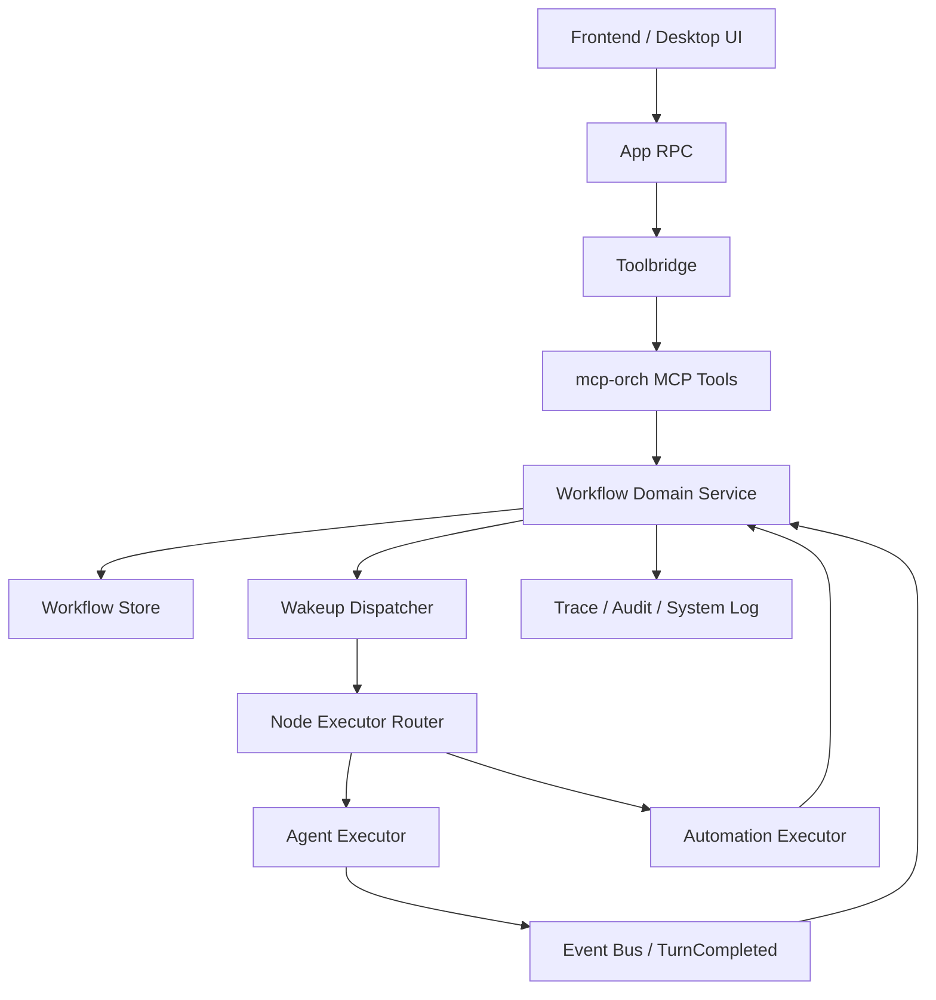

# Super-Dolphin 工作流基础架构设计方案

> 日期：2026-06-22  
> 状态：设计方案，待评审后拆分实施计划  
> 参考文档：`docs/ai01-docs/工作流/调研go语言工作流相关参考方案.md`

## 1. 目标

本方案用于统一 Super-Dolphin 的工作流基础架构方向：保留并收敛当前项目已有的 DAG v2 / `mcp-orch` 编排能力，把它明确定位为项目的 Workflow Runtime，而不是重新引入一套外部工作流框架作为主控。

目标是形成一个可长期演进的 Go 工作流运行时：

- Go 负责确定性流程控制、状态迁移、重试、权限、审计和追踪。
- LLM / Agent 只作为局部智能节点参与执行，不决定全局流程。
- MCP tools、RPC、UI 只是运行时的适配入口，不承载核心业务状态机。
- 模板、运行、节点执行、调度、观测和策略边界清晰。
- 任何未实现能力 fail-fast，不用隐式兜底掩盖运行时缺口。

## 2. 结论摘要

推荐路线：

```text
现有 DAG v2 Runtime
  -> 明确命名为 Workflow Runtime
  -> 收敛状态机、策略、观测和测试
  -> MCP / RPC / UI 作为适配层
  -> LLM / Agent / Automation 作为 Activity Executor
  -> Temporal / River / Eino 作为未来可选局部能力，不作为当前主引擎
```

不推荐路线：

```text
直接替换为 Temporal 主引擎
直接复制 LangGraph / CrewAI 的 LLM-first 编排模型
让 workflowtemplate 承担运行时职责
让 MCP tools 成为唯一业务逻辑层
继续暴露 Hybrid / HITL 等尚未完整实现的能力
```

## 3. 从参考文档采纳的原则

参考文档中最值得采纳的不是某一个库，而是架构分层原则。

### 3.1 Go 是生产工作流主控

生产级工作流不应由 LLM 动态决定下一步。Go 应该持有：

- 流程定义。
- 运行实例。
- 节点状态。
- 重试策略。
- 权限策略。
- 审计事件。
- 追踪上下文。
- 最终输出规则。

LLM 可以生成候选 DAG、执行 Agent 节点、总结上下文或判断局部结果，但不能绕过 Go runtime 直接改变全局运行状态。

### 3.2 所有状态结构化

工作流运行时不应依赖自然语言描述状态。状态必须落在结构化对象中：

- `WorkflowDefinition`：工作流定义。
- `WorkflowRun`：一次运行实例。
- `WorkflowNodeRun`：运行中的节点快照。
- `Wakeup`：待调度任务。
- `Lease`：调度租约。
- `NodeResult`：节点小结果。
- `SharedFile`：大结果和跨节点上下文。

### 3.3 工具注册必须可治理

工具不是简单函数表。每个工具或 Activity 都必须具备治理元数据：

- 名称。
- 输入输出 schema。
- 权限等级。
- 超时。
- 重试策略。
- 审计策略。
- 是否允许写操作。
- 是否需要人工确认。
- 失败分类。

### 3.4 观测和评估是基础能力

工作流必须能回答：

- 哪个请求启动了哪个 workflow？
- 哪个 node 卡住了？
- 哪个 Agent 线程对应哪个 node？
- 哪个工具调用导致失败？
- 重试是否符合策略？
- 最终输出来自哪些上游节点？

因此 trace 维度应覆盖：

```text
request -> workflow -> run -> node -> executor -> tool/LLM/retrieval -> artifact
```

## 4. 需要推翻或收敛的现有方向

### 4.1 不应把 Temporal 作为当前主引擎

参考文档推荐的生产组合是 `Temporal Go SDK + Eino/Genkit + Postgres/Redis + MCP + OTEL/Langfuse`。这在云端、高可用、跨服务长期工作流场景中合理，但不适合作为 Super-Dolphin 当前阶段的直接替换。

原因：

- 项目已有 `cmd/mcp-orch`，已经承担 sidecar 编排职责。
- 当前已有 DAG、run、node、wakeup、lease、dispatcher、executor、subscriber、tool registry 等基础设施。
- 桌面应用通过 toolbridge 代理到 `mcp-orch`，直接引入 Temporal 会改变部署模型。
- 当前产品更像本地桌面 + sidecar runtime，不是多机高可用 workflow cluster。
- 直接迁移会把主要风险从“补齐 runtime 纪律”变成“重写运行时和数据模型”。

结论：Temporal 只作为未来 backend 选项保留，不进入当前主路径。

### 4.2 不应复制 LangGraph / CrewAI 的 LLM-first 模型

LangGraph / CrewAI 类框架适合原型和 Agent 编排实验，但 Super-Dolphin 的工作流需要：

- 可审计。
- 可恢复。
- 可重试。
- 可回放诊断。
- 可权限控制。
- 可跨 UI / MCP / RPC 访问。

因此不能让 LLM 直接决定全局边、状态和写操作。LLM 只能是节点能力。

### 4.3 `workflowtemplate` 不应承担运行时职责

现有 `workflowtemplate` 模块应保持为模板目录和草稿渲染层：

- list template。
- get template。
- render DAG draft。
- 生成 UI 可预览草稿。

它不应该：

- 写入 DAG 存储。
- 启动 run。
- 调度节点。
- 改变 node 状态。
- 存储运行结果。

模板和运行时必须分离，否则后续权限、审计、版本快照和回放都会混乱。

### 4.4 MCP tools 不应成为业务核心

当前 `task_create_dag`、`task_dag_apply_ops`、`task_dispatch_node`、`task_start_dag` 等 MCP tools 是必要入口，但核心逻辑必须收敛在 orchestration service/domain service 中。

目标边界：

```text
MCP Tool Handler
  -> decode / validate request
  -> call Workflow Domain Service
  -> encode response

Workflow Domain Service
  -> validate state transition
  -> update store
  -> write events
  -> schedule wakeups
  -> enforce policy
```

MCP handler 不应直接拥有复杂状态迁移。

### 4.5 不应继续暴露未实现的 Hybrid / HITL 能力

当前 Hybrid 节点存在 schema / 提示词层面的设计，但 runtime 明确未完整实现。HITL、`waiting_human`、`skipped` 等状态也属于保留能力。

处理方式二选一：

1. 从用户可见模板、设计器提示和 UI 中隐藏这些能力。
2. 保留展示，但所有入口必须明确 fail-fast 返回“未实现”，并禁止创建可执行 run。

推荐选择 1，直到 runtime、状态机、UI 和测试全部闭环。

## 5. 推荐架构

### 5.1 总体分层



### 5.2 模块责任

| 层 | 责任 | 不负责 |
| --- | --- | --- |
| `frontend-app` | 展示模板、DAG、run、node、trace、失败原因 | 本地决定状态迁移 |
| `internal/app` | 通过 `DAGRuntime` 代理调用 `mcp-orch` | 嵌入编排服务 |
| `cmd/mcp-orch/tools` | MCP schema、参数校验、调用 domain service | 复杂业务状态机 |
| `cmd/mcp-orch/orchestration` | workflow runtime、状态迁移、调度、执行、完成订阅 | UI 展示逻辑 |
| `workflowtemplate` | 模板目录、草稿渲染、输入 schema | run / node 持久化 |
| Store | DAG、run、node、wakeup、lease、shared file 持久化 | 业务策略判断 |
| Executor | 执行 Agent / Automation 节点 | 修改非本节点外的 workflow 结构 |
| Observability | trace、audit、system log、诊断 | 参与流程决策 |

### 5.3 核心领域对象

| 对象 | 含义 |
| --- | --- |
| `WorkflowDefinition` | 可运行的工作流定义，当前可映射到 DAG template |
| `WorkflowVersion` | 定义版本，run 启动时快照 |
| `WorkflowRun` | 一次运行实例，持有 run 状态和执行摘要 |
| `WorkflowNodeRun` | 某个 run 中的节点快照，不能直接读取 template node 作为运行态 |
| `Wakeup` | 调度器可领取的执行任务 |
| `Lease` | 防止重复调度的租约 |
| `ActivityExecutor` | Agent / Automation / Future Hybrid 的执行适配 |
| `NodeResult` | 小体积结构化输出 |
| `SharedFile` | 大体积输出或跨节点共享上下文 |
| `PolicyDecision` | 写操作、危险命令、外部调用的策略判断 |
| `WorkflowTraceEvent` | 请求、运行、节点、工具、LLM、artifact 的观测事件 |

## 6. 运行生命周期

### 6.1 创建定义

```text
workflow_template_render
  -> 生成 DAGDraft
  -> 用户或 Agent 确认
  -> task_create_dag
  -> 持久化 WorkflowDefinition
```

约束：

- `task_create_dag` 只创建定义，不启动 run。
- 模板渲染结果必须通过 schema 校验。
- `final_node_key` 必须唯一。
- Agent node 必须声明 `config.exec.cwd`。
- 输出超过小结果限制时必须写 shared file。

### 6.2 启动运行

```text
task_start_dag
  -> validate definition
  -> create WorkflowRun
  -> clone nodes into runtime snapshot
  -> promote root nodes
  -> create wakeups for runnable roots
  -> return run_id / ready roots / scheduled wakeups
```

约束：

- run 使用 definition version 快照。
- 运行中节点只读 run snapshot，不回退读取 template。
- 幂等键冲突必须明确返回，不静默创建另一个 run。
- 没有 assignee 的 root node 必须进入等待分配状态，不能假装已调度。

### 6.3 调度节点

```text
WakeupDispatcher
  -> claim due wakeups
  -> acquire lease
  -> load WorkflowNodeRun
  -> route by node_type
  -> execute
  -> complete / retry / fail / cascade
```

约束：

- Dispatcher 是 `Runner`，由 RunGroup 管理。
- 不允许构造函数或 `OnStart` 中启动无管理 goroutine。
- 每次调度必须有 trace event。
- 超时和失败必须分类。

### 6.4 Agent 节点

```text
AgentExecutor
  -> validate exec config
  -> policy check
  -> launch child agent
  -> record spawning_thread_id
  -> mark node running
  -> wait TurnCompleted event
  -> materialize result
  -> complete node
```

约束：

- provider、cwd、prompt、identity override 必须完整校验。
- 子 Agent 线程 ID 是 node 完成订阅的关联键。
- Agent 输出必须经过 result/shared file 物化规则。
- Agent 不直接修改下游 node 状态，由 domain service 完成状态推进。

### 6.5 Automation 节点

```text
AutomationExecutor
  -> validate command card
  -> policy check
  -> execute command with timeout
  -> map outputs
  -> write node result / shared file
  -> complete node
```

约束：

- Automation 输出不得注入 Agent prompt、provider routing、assignee 等控制字段。
- Windows / Unix shell 执行应通过 command runner adapter 区分，不能硬编码单一 shell 作为长期方案。
- 命令风险等级必须进入 policy/audit。

### 6.6 完成与下游推进

```text
complete node
  -> validate transition
  -> persist result
  -> evaluate downstream dependencies
  -> promote ready downstream nodes
  -> schedule wakeups
  -> update run summary / final output
```

约束：

- 状态迁移必须经过统一 transition 函数。
- terminal node 不能重新进入 running。
- final output 只能从声明的 final node 或最终聚合规则产生。

## 7. 状态机设计

### 7.1 Node 状态

推荐先收敛为以下可执行子集：

| 状态 | 含义 |
| --- | --- |
| `pending` | 等待上游完成 |
| `waiting_for_assignee` | 需要分配执行者 |
| `ready` | 可调度 |
| `running` | 已被 executor 接管 |
| `done` | 成功完成 |
| `failed` | 失败终止 |
| `cancelled` | run 终止导致取消 |

保留但不对外开放：

| 状态 | 当前处理 |
| --- | --- |
| `retrying` | 可内部使用，但必须有明确重试策略和测试 |
| `waiting_human` | 暂不作为可创建节点能力 |
| `skipped` | 暂不作为可创建节点能力 |

### 7.2 Transition Matrix

| From | To | 触发 |
| --- | --- | --- |
| `pending` | `ready` | 上游依赖全部满足 |
| `pending` | `waiting_for_assignee` | 上游满足但缺 assignee |
| `waiting_for_assignee` | `ready` | `task_dispatch_node` 分配执行者 |
| `ready` | `running` | dispatcher 成功领取并开始执行 |
| `running` | `done` | executor / subscriber 完成 |
| `running` | `failed` | 不可重试失败 |
| `running` | `retrying` | 可重试失败且预算未耗尽 |
| `retrying` | `ready` | retry wakeup 到期 |
| `retrying` | `failed` | 重试预算耗尽 |
| `pending` / `ready` / `running` / `retrying` | `cancelled` | run 被终止 |

禁止迁移：

- `done -> *`
- `failed -> *`
- `cancelled -> *`
- `ready -> done`
- `pending -> running`
- `waiting_for_assignee -> running`

### 7.3 Run 状态

| 状态 | 含义 |
| --- | --- |
| `created` | run 已创建但未调度 |
| `running` | 存在可执行或执行中的节点 |
| `waiting` | 等待分配、定时或外部事件 |
| `succeeded` | final node 完成且最终输出已物化 |
| `failed` | 失败策略导致 run 失败 |
| `cancelled` | 用户或系统终止 |

Run 状态由 node 状态聚合，不允许 UI 或 MCP handler 直接手写最终状态。

## 8. 策略与权限

### 8.1 Policy Gate

所有写操作和高风险执行都经过 policy gate：

```text
request
  -> identify actor
  -> classify operation
  -> load workflow/node/tool policy
  -> allow / deny / require approval
  -> write audit event
```

必须进入 policy 的动作：

- 创建、修改、删除 DAG definition。
- 启动、终止 run。
- 分配节点执行者。
- 执行 command card。
- 写 shared file。
- 调用外部服务。
- 创建子 Agent 线程。

### 8.2 Tool Registry 元数据

每个 tool/activity 至少声明：

```json
{
  "name": "task_start_dag",
  "category": "workflow.write",
  "input_schema": "strongly typed schema",
  "permission": "workflow:run:start",
  "timeout_ms": 10000,
  "retry": {
    "enabled": false
  },
  "audit": {
    "required": true,
    "include_params": "redacted"
  }
}
```

### 8.3 Fail-Fast 规则

以下情况必须直接报错：

- node type 未实现。
- workflow definition schema 不合法。
- run snapshot 缺失。
- assignee 缺失但试图调度。
- provider identity override 不完整。
- command runner 找不到平台适配。
- shared file 写入失败。
- final output 节点不存在或不唯一。

不允许静默降级为默认 provider、默认 cwd、默认 shell 或空输出。

## 9. 观测、审计与诊断

### 9.1 Trace 维度

推荐统一事件字段：

| 字段 | 含义 |
| --- | --- |
| `trace_id` | 请求级 trace |
| `workflow_id` | workflow definition |
| `workflow_version` | definition version |
| `run_id` | 运行实例 |
| `node_key` | 业务节点 key |
| `node_run_id` | 运行节点 ID |
| `wakeup_id` | 调度任务 |
| `executor_type` | agent / automation / hybrid |
| `thread_id` | Agent 线程 |
| `tool_name` | MCP/toolbridge/tool 调用 |
| `failure_class` | validation / transient / quota / capability / policy |

### 9.2 事件类型

| 事件 | 触发 |
| --- | --- |
| `workflow.definition.created` | 创建 DAG definition |
| `workflow.run.started` | 启动 run |
| `workflow.node.ready` | 节点进入 ready |
| `workflow.node.dispatched` | 节点被分配并入队 |
| `workflow.node.running` | executor 接管 |
| `workflow.node.completed` | 节点完成 |
| `workflow.node.failed` | 节点失败 |
| `workflow.node.retry_scheduled` | 安排重试 |
| `workflow.run.completed` | run 完成 |
| `workflow.run.failed` | run 失败 |
| `workflow.policy.denied` | policy 拒绝 |

### 9.3 诊断入口

保留并增强现有诊断类工具：

- 根据 prompt identity 诊断 DAG。
- 根据 run_id 列出卡住节点。
- 根据 spawning_thread_id 反查 node。
- 根据 failure_class 聚合失败。
- 根据 shared file / artifact 追踪最终输出来源。

## 10. 数据和存储边界

### 10.1 当前阶段

当前阶段继续使用项目已有本地存储模型，不引入新的外部数据库作为硬依赖。

原因：

- 桌面本地和 sidecar 架构更适合轻量持久化。
- 已有 DAG、run、node、wakeup、lease、shared file 语义。
- 主要问题是边界和状态机纪律，不是缺少外部 workflow database。

### 10.2 未来 backend 抽象

可以在 runtime 稳定后引入 backend interface：

```go
type WorkflowBackend interface {
    CreateRun(ctx context.Context, input CreateRunInput) (WorkflowRun, error)
    TransitionNode(ctx context.Context, input TransitionNodeInput) (TransitionNodeResult, error)
    ClaimWakeups(ctx context.Context, input ClaimWakeupsInput) ([]Wakeup, error)
    CompleteNode(ctx context.Context, input CompleteNodeInput) (CompleteNodeResult, error)
}
```

但当前不建议先抽象。只有当出现明确第二实现，例如 Temporal backend，才引入接口。

## 11. 与现有代码的映射

| 现有路径 | 建议定位 |
| --- | --- |
| `cmd/mcp-orch` | Workflow Runtime 进程 |
| `cmd/mcp-orch/tools` | MCP adapter |
| `cmd/mcp-orch/orchestration` | Workflow domain/runtime |
| `cmd/mcp-orch/orchestration/nodeexec` | Activity executors |
| `cmd/mcp-orch/orchestration/wakeup_dispatcher.go` | 调度 runner |
| `cmd/mcp-orch/orchestration/dag_turn_completed_subscriber.go` | Agent 完成事件订阅 |
| `internal/contract/orchestration.go` | Desktop 与 runtime 的窄接口 |
| `internal/app/orchestration_dag_runtime_adapter.go` | toolbridge proxy adapter |
| `internal/module/workflowtemplate` | 模板目录与草稿渲染 |
| `internal/platform/toolbridge` | 工具传输桥，不拥有 workflow 业务逻辑 |
| `frontend-app` | 工作流定义、运行、节点和诊断 UI |

## 12. 分阶段实施路线

### Phase 0：统一术语和边界

目标：让团队明确 DAG v2 就是当前 Workflow Runtime。

交付：

- 新增 ADR：`DAG v2 as Workflow Runtime`。
- 明确 `workflowtemplate` 是模板层，不是 runtime。
- 明确 `mcp-orch` 是 runtime owner。
- 明确 Temporal 是 future backend，不是当前主线。
- 修正文档中 `task_start_node` / `task_dispatch_node` 等命名不一致。

验收：

- 架构文档、prompt 文档、code comment 使用同一组术语。
- UI / prompt 不再暗示未实现能力已可运行。

### Phase 1：状态机和 fail-fast 收敛

目标：把 node/run 状态迁移从分散判断收敛到统一入口。

交付：

- 定义 node transition matrix。
- 定义 run 聚合状态规则。
- 为非法迁移添加表驱动测试。
- Hybrid / HITL 未实现路径统一 fail-fast。
- 所有调度入口禁止绕过 transition 函数。

验收：

- 非法状态迁移测试全部通过。
- 未实现 node type 无法创建可执行 run。
- `task_dispatch_node` 只允许处理等待分配或 ready 的合法节点。

### Phase 2：Policy 和 Tool Registry 元数据

目标：让写操作和高风险执行可治理。

交付：

- 为 workflow write tools 增加 policy 分类。
- 为 command card / automation executor 增加风险等级。
- 写操作写 audit event。
- provider / cwd / shell / shared file 缺失时 fail-fast。

验收：

- 危险操作无 policy 时失败。
- audit event 可通过 run_id / node_key 查询。
- command runner 在 Windows / Unix 行为明确。

### Phase 3：观测和诊断闭环

目标：让用户能从 UI 或工具定位 workflow 卡点。

交付：

- 增加 workflow trace event 规范。
- run 列表展示 waiting / failed / running 原因摘要。
- node 详情展示 executor、thread_id、failure_class、last_wakeup。
- 诊断工具支持从 thread_id 反查 workflow node。

验收：

- 给定 trace_id 可定位 run。
- 给定 run_id 可定位卡住 node。
- 给定 child thread_id 可定位 spawning node。

### Phase 4：模板产品化

目标：让模板生成的 DAG 更稳定可执行。

交付：

- 模板 schema 覆盖 node type、exec config、output mapping。
- 设计器 prompt 禁止生成未实现 runtime 能力。
- final output 规则前置校验。
- 大输出默认写 shared file。

验收：

- render 出来的 DAG draft 能被 `task_create_dag` 校验。
- 无 final node 或多个 final node 会失败。
- 大输出不会塞入 node_result。

### Phase 5：未来 backend 评估

触发条件：

- workflow 需要跨机器高可用。
- 本地 sidecar 无法满足长周期任务。
- 需要服务端集中调度。
- 需要大量并发 workflow。
- 需要强 SLA 的跨天任务恢复。

可评估选项：

- Temporal Go SDK：作为远端 durable backend。
- River / Asynq：作为 queue backend。
- Eino / Genkit：作为 Agent Activity 内部 LLM orchestration，不作为全局 workflow 主控。

## 13. 测试策略

### 13.1 单元测试

覆盖：

- node transition matrix。
- run 状态聚合。
- definition validation。
- final node validation。
- output materialization。
- policy decision。
- failure classification。

### 13.2 集成测试

覆盖：

- `task_create_dag -> task_start_dag -> wakeup -> executor -> complete`。
- Agent node 通过 `spawning_thread_id` 完成。
- Automation node 写 node result。
- shared file 大输出。
- retry budget 耗尽。
- terminate run 后 wakeup 不再执行。

### 13.3 回归测试

每个修复类变更必须有同提交回归测试，尤其是：

- 调度重复执行。
- node 状态越权迁移。
- run 列表读取巨大 events。
- 未实现 hybrid 被误执行。
- provider/cwd/shell 缺失后静默降级。

### 13.4 推荐命令

Go 文件变更后先运行单文件守卫：

```powershell
powershell -NoProfile -ExecutionPolicy Bypass -File .\scripts\test_with_guard.ps1 <changed-file.go>
```

相关包验证：

```powershell
powershell -NoProfile -ExecutionPolicy Bypass -File .\scripts\test_with_guard.ps1 ./cmd/mcp-orch/... -count=1
```

架构/守卫变更：

```powershell
powershell -NoProfile -ExecutionPolicy Bypass -File .\scripts\test_with_guard.ps1 ./internal/archtest -count=1
```

前端变更：

```powershell
cd frontend-app
npm run lint
npm test
npm run build
```

## 14. 风险与处理

| 风险 | 处理 |
| --- | --- |
| 运行时术语继续混乱 | Phase 0 先做 ADR 和术语收敛 |
| Hybrid/HITL 被用户创建后不可执行 | 立即隐藏或 fail-fast |
| MCP handler 继续膨胀 | 所有复杂逻辑迁入 domain service |
| 状态迁移散落导致回归 | transition matrix + 表驱动测试 |
| Automation 跨平台 shell 不一致 | 引入 command runner adapter，但不提前重构无关执行器 |
| trace 过多影响列表性能 | 列表只读摘要字段，详情再读事件 |
| 过早抽象 backend | 等第二实现出现再抽象 |

## 15. 非目标

本阶段不做：

- 全量迁移 Temporal。
- 全量重写 `mcp-orch`。
- 引入新的 LLM workflow 框架作为主控。
- 重构所有 MCP tools。
- 实现完整 Hybrid runtime。
- 实现完整人工审批系统。
- 改变桌面主进程和 sidecar 的部署关系。

## 16. 最小可执行决策

建议先做以下决策并冻结：

1. `mcp-orch` 是 Workflow Runtime owner。
2. DAG v2 是当前工作流定义和运行模型。
3. `workflowtemplate` 只负责模板和草稿。
4. MCP tools 只是 adapter，业务逻辑进入 orchestration domain service。
5. Agent / Automation 是 Activity Executor。
6. LLM 不决定全局流程。
7. Hybrid / HITL 在 runtime 闭环前不对用户开放。
8. Temporal 是未来 backend 选项，不是当前主线。

这些决策足够支撑后续实施计划拆分，同时避免当前架构被过早外部框架替换。
