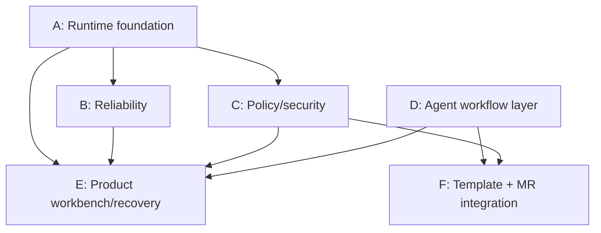

# Workflow Runtime Parallel Development Dispatch Index

> **For agentic workers:** REQUIRED SUB-SKILL: Use superpowers:subagent-driven-development (recommended) or superpowers:executing-plans to implement one plan task-by-task. Steps use checkbox (`- [ ]`) syntax for tracking.

**Goal:** 将 `workflow-runtime-architecture-design-2026-06-22.md` 拆成可并行派发的功能开发单元。

**Architecture:** 先由基础对齐任务冻结术语、状态和现有能力，再并行推进 runtime 可靠性、policy 安全、Agent 工作流、产品工作台、模板产品化和 MR 集成。每个子 agent 必须只修改自己文档列出的写入范围。

**Tech Stack:** Go 1.25.7, sqlc, SQLite, fx, oklog/run, jrpc2, MCP tools, React/Vite, PowerShell guard scripts.

---

## Source

- Source design: `docs/ai01-docs/工作流/workflow-runtime-architecture-design-2026-06-22.md`
- Target branch: `codex/feature-integration-20260622`
- Worktree: `D:\project\Super-Dolphin-worktrees\feature-integration-20260622`

## Dispatch Rules

- 每个子 agent 只执行一份功能开发文档。
- 每个子 agent 开始前先运行 `git status --short --branch`。
- 每个子 agent 不得修改其它子任务的文件范围。
- 如果任务需要修改共享契约文件，先只提交最小接口，并在最终报告中标明依赖。
- 每个子 agent 必须提供验证命令输出摘要。
- 修复类提交必须带回归测试或契约测试。
- Go 文件改动后先运行单文件守卫：

```powershell
powershell -NoProfile -ExecutionPolicy Bypass -File .\scripts\test_with_guard.ps1 <changed-file.go>
```

## Recommended Parallel Groups

| Group | Document | Parallel Level | Main Risk |
| --- | --- | --- | --- |
| A | `01-runtime-foundation-state-contract.md` | prerequisite | 术语、状态、现有能力对齐 |
| B | `02-runtime-reliability-lease-idempotency-final-output.md` | parallel after A contract skeleton | lease、幂等、final output 事务 |
| C | `03-policy-tool-registry-security.md` | parallel after A contract skeleton | policy、tool metadata、command/shared file 安全 |
| D | `04-agent-workflow-layer.md` | parallel | WorkflowPlan、AgentTask、ReviewGate、Artifact |
| E | `05-product-workbench-observability-recovery.md` | parallel with D, consumes A/B later | 工作台、诊断、失败恢复 |
| F | `06-template-productization-mr-integration.md` | parallel with D/E | 模板产品化、ChangeRequest、MR/PR |

## Dependency Map



## Integration Order

1. Merge A first because it defines shared terms and public states.
2. Merge B and C next; they harden runtime and security boundaries.
3. Merge D independently once its schema/store contract is stable.
4. Merge E after A/B/C/D expose enough contract for UI actions.
5. Merge F after D exposes artifact/change request linkage.

## Cross-Agent Review Checklist

- Does the implementation preserve `mcp-orch` as Workflow Runtime Kernel owner?
- Does it keep `workflowtemplate` as template/draft layer only?
- Does it avoid adding `waiting_for_assignee` as persisted node status?
- Does it separate Policy Gate from Review Gate?
- Does it fail fast for Hybrid/HITL until runtime closes the loop?
- Does it include targeted tests and guard output?
- Does the final diff avoid unrelated refactors?
