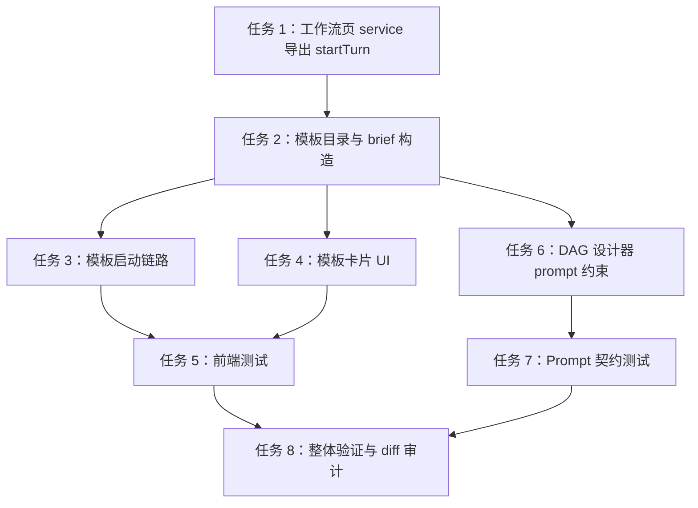

# 政企工作流模板包技术任务拆分

> 状态：待审批。本文档只拆分技术实施任务，未经审批不执行代码修改。
> 方案来源：`docs/superpowers/plans/2026-06-17-enterprise-workflow-template-package.md`
> 目标分支：`codex/feature-integration-20260617`
> 目标工作区：`D:\project\Super-Dolphin-worktrees\feature-integration-20260617`

## 1. 实施目标

在不新增工作流引擎、数据库 schema、RBAC、消息队列或 DAG 级审批阻断能力的前提下，把政企工作流模板包落到现有能力上：

- 前端工作流页常驻展示三张模板卡片：文档审查归档、数据报告发布、会议纪要督办。
- 点击模板后复用现有 DAG 设计器线程创建能力：先 `thread/start` 创建 deferred 线程，再 `turn/start` 发送模板 brief。
- DAG 设计器中文 prompt 增加政企模板包约束，确保生成方案符合当前可运行 DAG 能力。
- 测试覆盖模板渲染、模板启动链路、异常链路、prompt 契约。

首版交付不是固定 DAG 入库，而是“模板 brief 驱动 DAG 设计器生成可运行 DAG”。

## 2. 当前实现锚点

已确认的实现锚点如下，后续实现应只围绕这些点做最小改动：

- `frontend-app/src/pages/workflows/WorkflowPage.jsx`
  - 已有 `DAG_DESIGNER_ENABLED_TOOLS` 白名单。
  - 已有 `workflowDesignThreadPayload(...)`，固定使用 `agentKey: 'dag_designer'`、`promptKey: 'main/dag_designer_zh'`、`deferSpawn: true`、`providerNativeSkills: false`。
  - 已有 `useStartDesignFlowAction(...)`，当前只调用 `startThread(...)`。
  - 已有“通过聊天创建”入口。
  - 已有“查看模板”按钮，但当前不承载模板区滚动或启动逻辑。
- `frontend-app/src/pages/workflows/services/workflowPageService.js`
  - 已导出工作流页所需后端 API。
  - 当前未导出 `startTurn`。
- `frontend-app/src/shared/api/backendApi.js`
  - 已导出 `startThread` 和 `startTurn`。
  - `thread/start` 不应承载首条用户 brief，模板 brief 应通过 `turn/start` 发送。
- `frontend-app/src/pages/workflows/WorkflowPage.test.jsx`
  - 已 mock `backend.startThread` 和 `backend.startTurn`。
  - 已有通用 DAG 设计器启动测试，且当前断言通用入口不调用 `startTurn`。
- `internal/platform/shared/builtinprompts/assets/sections/main-dag-designer-zh/00-runtime-tools.md`
  - 已包含模型、prompt、command、sharedfile 发现规则。
  - 已包含 `task_create_dag`、`task_dag_apply_ops`、`final_node_key`、`outputs.to_sharedfile`、`CRON_TZ=Asia/Shanghai` 等关键约束。
- `internal/platform/shared/builtinprompts/dag_designer_prompt_contract_test.go`
  - 已有 DAG 设计器 prompt 契约测试。
  - 应扩展该测试覆盖政企模板包关键字和禁止旧字段约束。

## 3. 文件边界

### 允许修改

仅在审批后允许修改以下文件：

- `frontend-app/src/pages/workflows/services/workflowPageService.js`
- `frontend-app/src/pages/workflows/WorkflowPage.jsx`
- `frontend-app/src/pages/workflows/WorkflowPage.css`
- `frontend-app/src/pages/workflows/WorkflowPage.test.jsx`
- `internal/platform/shared/builtinprompts/assets/sections/main-dag-designer-zh/00-runtime-tools.md`
- `internal/platform/shared/builtinprompts/dag_designer_prompt_contract_test.go`

### 不允许修改

首版不修改以下范围：

- 后端 RPC 接口、store、数据库迁移、sqlc 文件。
- 工作流执行器、cron 执行器、agent provider、RBAC 或审批运行时。
- `cmd/agent-terminal/frontend` 旧 Vue 前端。
- `package.json`、锁文件和新增依赖。
- 现有无关未提交改动。

## 4. 任务依赖图



## 5. 任务 1：工作流页 service 导出 startTurn

### 目的

让工作流页复用现有 `turn/start` 能力发送模板 brief，不新增后端接口。

### 修改文件

- `frontend-app/src/pages/workflows/services/workflowPageService.js`

### 技术步骤

1. 从 `frontend-app/src/shared/api/backendApi.js` 引入 `startTurn`。
2. 在 `workflowPageService.js` 中导出同名薄封装。
3. 保持已有 service 风格，不改现有 API 调用签名。

### 验收标准

- `WorkflowPage.jsx` 可以从 `workflowPageService.js` 引入 `startTurn`。
- 不修改 `backendApi.js` 的 RPC payload 形态。
- 不新增后端 RPC。

## 6. 任务 2：模板目录与 brief 构造

### 目的

把三类政企模板固化为前端可渲染、可启动的轻量配置，并生成给 DAG 设计器的结构化 brief。

### 修改文件

- `frontend-app/src/pages/workflows/WorkflowPage.jsx`

### 技术步骤

1. 在 `DAG_DESIGNER_ENABLED_TOOLS` 附近新增 `ENTERPRISE_WORKFLOW_TEMPLATES` 常量。
2. 三个模板 key 固定为：
   - `document-review-archive`
   - `data-report-release`
   - `meeting-minutes-followup`
3. 每个模板至少包含：
   - `key`
   - `title`
   - `summary`
   - `scenario`
   - `nodes`
   - `approvalPolicy`
   - `outputPrefix`
   - `schedulePreference`
   - `finalNodeKey`
4. 新增 `buildEnterpriseWorkflowTemplateBrief(template)` 纯函数，输出给 `startTurn` 的中文 brief。
5. brief 必须包含以下约束：
   - 模板 key。
   - 政企场景说明。
   - 建议节点草图。
   - 审批口径：只生成审批材料、复核结论或待确认项；需要人工确认时由用户在聊天或流程页确认后再启动或派发后续节点。
   - 输出路径：`enterprise-workflows/<template-key>/{{run_id}}/...`。
   - 调度偏好：定时场景默认 `CRON_TZ=Asia/Shanghai`，但用户未说明具体时间时必须确认。
   - 资源发现约束：先发现模型、prompt、command_card、sharedfile，再落库。
   - DAG 工具约束：只使用现有工具白名单。
   - 自动化约束：`automation` 只能使用已发现的 `command_card`，不得硬编码 `command_ref`。
   - 输出约束：大结果写 `outputs.to_sharedfile`。
   - 终点约束：最终交付用唯一 `final_node_key`。
   - 禁止硬编码 `provider`、`model`、`prompt_key`、`command_ref`。

### 验收标准

- 三个模板的 brief 都包含模板 key、审批口径、输出路径、工具约束。
- brief 不承诺当前系统不存在的 DAG 级人工审批阻断能力。
- brief 只表达“设计器应生成可运行 DAG 方案”，不直接入库固定 DAG。

## 7. 任务 3：模板启动链路

### 目的

实现点击模板后按顺序调用 `startThread` 和 `startTurn`。

### 修改文件

- `frontend-app/src/pages/workflows/WorkflowPage.jsx`

### 技术步骤

1. 从 `workflowPageService.js` 引入 `startTurn`。
2. 调整 `useStartDesignFlowAction(...)`，支持可选参数 `template`：
   - 无 `template`：保持现有通用“通过聊天创建”行为，只调用 `startThread`。
   - 有 `template`：先调用 `startThread(workflowDesignThreadPayload(...))`。
3. 复用 `threadIdFromStartResponse(...)` 解析线程 ID。
4. 解析不到线程 ID 时 fail-fast，错误文案建议为：
   - `thread/start 未返回可用 threadId，无法发送模板需求`
5. 有线程 ID 后调用：
   - `startTurn({ cwd: workflowCwd, threadId, input: buildEnterpriseWorkflowTemplateBrief(template) })`
6. `startTurn` 成功后再保持现有体验：
   - 设置 active thread。
   - 切到 chat 页。
   - 清理启动中状态。
7. `startThread` 失败时不得调用 `startTurn`。
8. `startTurn` 失败时显示明确错误，例如：
   - `发送模板需求失败：<error message>`

### 验收标准

- 通用入口行为不变。
- 模板入口严格按 `startThread -> startTurn` 顺序执行。
- `startThread` 失败不触发 `startTurn`。
- `startTurn` 失败有可见错误。
- 不在 `thread/start` payload 中塞模板 brief。

## 8. 任务 4：模板卡片 UI

### 目的

在工作流页增加“政企工作流模板”常驻卡片区，让用户能直接启动三类模板。

### 修改文件

- `frontend-app/src/pages/workflows/WorkflowPage.jsx`
- `frontend-app/src/pages/workflows/WorkflowPage.css`

### 技术步骤

1. 新增 `EnterpriseWorkflowTemplates` 组件。
2. 组件接收：
   - `templates`
   - `onStartTemplate`
   - `starting`
3. 三张卡片常驻展示：
   - 文档审查归档：建议使用现有 `BookOpen` 图标。
   - 数据报告发布：建议使用现有 `BarChart3` 图标。
   - 会议纪要督办：建议使用现有 `Bell` 图标。
4. 每张卡片显示：
   - 标题。
   - 一句话场景。
   - 3 到 4 个节点摘要。
   - 默认输出路径前缀。
   - 启动按钮。
5. 启动按钮调用 `actions.startDesignFlow(template)`。
6. `starting` 期间禁用按钮并展示简短状态。
7. “查看模板”按钮建议改为滚动并聚焦模板区：
   - 在 `WorkflowPageView` 中持有 `templateSectionRef`。
   - 传给 `WorkflowHeader` 的 `onViewTemplates`。
   - 点击后 `scrollIntoView` 并 `focus` 模板区。
8. CSS 使用现有工作流页视觉风格，避免新增依赖和大规模重排。

### 验收标准

- 空状态和已有 DAG 列表状态下都能看到模板区。
- 三张模板卡片标题、摘要、启动按钮都可见。
- 模板区在移动端不溢出。
- 不引入新图标库或新样式系统。

## 9. 任务 5：前端测试

### 目的

锁定模板渲染、模板启动顺序和异常行为。

### 修改文件

- `frontend-app/src/pages/workflows/WorkflowPage.test.jsx`

### 测试用例

1. 模板卡片渲染：
   - 断言出现“政企工作流模板”。
   - 断言出现“文档审查归档”“数据报告发布”“会议纪要督办”。
2. 通用入口保持不变：
   - 点击“通过聊天创建”。
   - 断言调用 `startThread`。
   - 断言不调用 `startTurn`。
3. 文档审查归档模板启动：
   - 点击该模板启动按钮。
   - 断言先调用 `startThread`。
   - 断言随后调用 `startTurn`。
   - 断言 brief 包含 `document-review-archive`、`enterprise-workflows/document-review-archive/{{run_id}}/`、`审批`、`command_card`、`outputs.to_sharedfile`、`final_node_key`。
4. 数据报告发布模板启动：
   - 断言 brief 包含 `data-report-release`、`CRON_TZ=Asia/Shanghai` 和报告发布节点语义。
5. 会议纪要督办模板启动：
   - 断言 brief 包含 `meeting-minutes-followup` 和督办节点语义。
6. `startThread` 失败：
   - mock `startThread` reject。
   - 断言不调用 `startTurn`。
   - 断言页面出现启动失败提示。
7. `startTurn` 失败：
   - mock `startThread` 成功并返回 threadId。
   - mock `startTurn` reject。
   - 断言页面出现发送模板需求失败提示。

### 验证命令

```powershell
cd D:\project\Super-Dolphin-worktrees\feature-integration-20260617\frontend-app
npm test -- WorkflowPage
```

### 验收标准

- 目标测试通过。
- 旧的通用 DAG 设计器启动测试仍通过。
- 不扩大到无关页面测试，除非目标测试暴露共享组件回归。

## 10. 任务 6：DAG 设计器中文 prompt 约束

### 目的

让 DAG 设计器知道政企模板包首版边界，避免生成不可运行或超出现有能力的 DAG。

### 修改文件

- `internal/platform/shared/builtinprompts/assets/sections/main-dag-designer-zh/00-runtime-tools.md`

### 技术步骤

1. 在运行时工具约束或节点配置说明附近新增“政企模板包约束”小节。
2. 明确三类模板：
   - 文档审查归档。
   - 数据报告发布。
   - 会议纪要督办。
3. 明确资源发现顺序：
   - 先 `list_models`。
   - 再 `prompt_list`。
   - 再 `command_list`，只使用已发现 `command_card`。
   - 必要时 `shared_file_list`。
   - 再通过 `task_create_dag` 创建 DAG。
4. 明确禁止项：
   - 不得硬编码 `provider`。
   - 不得硬编码 `model`。
   - 不得硬编码 `prompt_key`。
   - 不得硬编码 `command_ref`。
   - 不得使用旧字段或不可用工具。
5. 明确输出：
   - 大结果写 `outputs.to_sharedfile`。
   - 输出路径建议为 `enterprise-workflows/<template_key>/{{run_id}}/...`。
6. 明确审批口径：
   - 审批节点只生成审批材料、复核意见、待确认项。
   - 需要人工确认时，应提示用户在聊天或流程页确认后再启动或派发后续节点。
   - 不宣称已有 DAG 级审批阻断。
7. 明确调度：
   - 定时场景默认 `CRON_TZ=Asia/Shanghai`。
   - 用户未说明具体时间时必须确认。
8. 明确终点：
   - 最终交付必须使用唯一 `final_node_key`。

### 验收标准

- prompt 包含三类模板名称。
- prompt 包含 `command_card`、`outputs.to_sharedfile`、`final_node_key`、`CRON_TZ=Asia/Shanghai`。
- prompt 不教授旧字段或不存在能力。

## 11. 任务 7：Prompt 契约测试

### 目的

用 Go 测试锁住 DAG 设计器 prompt 的政企模板包关键约束。

### 修改文件

- `internal/platform/shared/builtinprompts/dag_designer_prompt_contract_test.go`

### 技术步骤

1. 在现有 prompt 契约测试中增加关键字断言，或新增单独测试函数。
2. 必须断言包含：
   - `政企模板包`
   - `文档审查归档`
   - `数据报告发布`
   - `会议纪要督办`
   - `command_card`
   - `outputs.to_sharedfile`
   - `final_node_key`
   - `CRON_TZ=Asia/Shanghai`
   - `enterprise-workflows/<template_key>/{{run_id}}/`
3. 保留现有禁止旧字段断言：
   - 不教授 `"output_file"`。
   - 不教授 `config.provider`。
   - 不教授 `task_update_node`。
4. 不放宽任何 guard 或 baseline。

### 验证命令

```powershell
cd D:\project\Super-Dolphin-worktrees\feature-integration-20260617
pwsh -NoProfile -ExecutionPolicy Bypass -File .\scripts\test_with_guard.ps1 internal/platform/shared/builtinprompts/dag_designer_prompt_contract_test.go
```

如单文件守卫无法覆盖该 package，再补跑：

```powershell
cd D:\project\Super-Dolphin-worktrees\feature-integration-20260617
pwsh -NoProfile -ExecutionPolicy Bypass -File .\scripts\test_with_guard.ps1 ./internal/platform/shared/builtinprompts -count=1
```

### 验收标准

- prompt 契约测试通过。
- 单文件守卫通过。
- 未产生 baseline 异常变更。

## 12. 任务 8：整体验证与 diff 审计

### 目的

在实现完成后确认代码、测试、构建和 diff 都处于可审查状态。

### 验证命令

```powershell
cd D:\project\Super-Dolphin-worktrees\feature-integration-20260617\frontend-app
npm test -- WorkflowPage
npm run lint
npm run build
```

```powershell
cd D:\project\Super-Dolphin-worktrees\feature-integration-20260617
pwsh -NoProfile -ExecutionPolicy Bypass -File .\scripts\test_with_guard.ps1 internal/platform/shared/builtinprompts/dag_designer_prompt_contract_test.go
git diff --check
git diff --stat
git status --short --branch
```

### 验收标准

- 前端目标测试通过。
- 前端 lint 通过。
- 前端 build 通过。
- Go prompt 契约测试和守卫通过。
- `git diff --check` 无空白错误。
- diff 只包含审批范围内文件和本计划文档。
- 现有无关未提交改动未被修改、格式化、暂存或回滚。

## 13. 停止条件

实施中出现以下情况应停止并回报，而不是继续扩大范围：

- `startTurn` 无法通过现有前端 API 调用，且需要新增后端 RPC。
- 现有工作流页结构与当前锚点不一致，导致模板区需要大规模重构。
- 目标测试失败来自无关未提交改动，且无法通过只改审批范围内文件解决。
- prompt 守卫要求修改 baseline 或放宽 guard。
- 实现必须修改数据库、RBAC、provider、执行器或旧 Vue 前端。
- 用户审批范围与本文任务边界冲突。

## 14. 回滚策略

如实现后需要撤销，只回滚本次审批范围内的新增或修改：

- 删除或还原 `ENTERPRISE_WORKFLOW_TEMPLATES`、brief 构造和模板 UI。
- 还原 `useStartDesignFlowAction(...)` 的模板参数分支。
- 移除 `workflowPageService.js` 中新增的 `startTurn` 导出。
- 还原 DAG 设计器 prompt 政企模板小节和对应契约测试。
- 保留或删除本文档由用户决定。

不得使用 `git reset --hard` 或批量 checkout 回滚整个工作树。

## 15. 审批清单

审批前建议确认以下事项：

- 是否同意首版只做“三类模板卡片 + DAG 设计器 brief”，不做固定 DAG 入库。
- 是否同意“审批”只表达为审批材料和人工确认提示，不声明 DAG 级阻断。
- 是否同意默认输出路径为 `enterprise-workflows/<template-key>/{{run_id}}/...`。
- 是否同意模板卡片常驻展示在工作流页，而不是弹窗或二级页面。
- 是否同意“查看模板”按钮改为滚动聚焦模板区。
- 是否同意实现只触碰第 3 节列出的允许修改文件。
