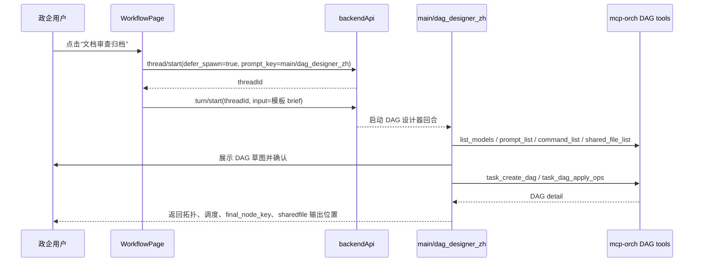
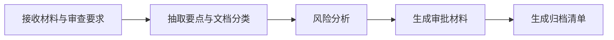
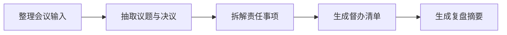

# 政企工作流模板包方案

> **For agentic workers:** 后续若执行本方案，必须使用 `superpowers:执行计划` 或等价的逐步执行流程。当前文件仅供审查，不代表已进入实现。

**目标:** 基于 Super-Dolphin 当前已实现的 DAG、Agent、prompt、sharedfile 和工作流页能力，提供一组面向政企内网高频工作的可启动模板入口。

**核心架构:** 不新增工作流引擎、数据库 schema、RBAC、NATS/Kafka 或 DAG 级 HITL。模板以 React 工作流页卡片呈现，点击后启动现有 `main/dag_designer_zh`，再发送模板 brief，让 DAG 设计器在当前环境内发现模型、prompt、command card、sharedfile 后创建可运行 DAG。

**Tech Stack:** `frontend-app` React/Vite、`thread/start`、`turn/start`、`cmd/mcp-orch` DAG tools、内置 prompt registry、sharedfile 输出。

---

## 1. 背景和约束

### 1.1 调研报告结论映射

用户提供的调研报告 `C:/Users/ai01/Downloads/deep-research-report.md` 建议方向是：

- 定义层采用 DAG 或 State Graph。
- 运行层采用事件驱动状态机。
- Agent Runtime 与 Workflow Engine 解耦。
- Prompt 绑定到节点，节点包含模型、工具策略、输入输出和失败策略。
- 多 Agent 流程采用固定图模式，不采用自由群聊。
- 政企场景需要审计、审批、数据边界、内网部署和可追踪输出。

当前 Super-Dolphin 已具备可以直接承接的能力：

- `cmd/mcp-orch` 已有 DAG template、run、node、wakeup、downstream scheduling。
- DAG 工具已暴露 `task_create_dag`、`task_get_dag`、`task_start_dag`、`task_dag_apply_ops`、`task_dispatch_node` 等。
- Agent 节点已支持 `config.exec.prompt_key`、`provider`、`model`、`cwd`、`agent_key`、`first_turn`。
- 输出已支持 `outputs.to_sharedfile` 和 `outputs.to_node_result`。
- 工作流页已经能启动 `main/dag_designer_zh`，且工具白名单覆盖资源发现和 DAG 创建。
- Automation 当前只稳定支持 `command_card`，不应在模板中承诺任意 shell、HTTP、SQL 或外部系统调用。

当前 Super-Dolphin 尚不适合在首版中承诺的能力：

- 不承诺独立 RBAC 层。
- 不承诺 Postgres + NATS/Kafka 生产级事件总线。
- 不承诺完整 DAG 级人工审批等待、批准、驳回、自动恢复下游。
- 不承诺跨系统自动归档、发布或数据库查询，除非当前环境已经存在相应 command card。

### 1.2 当前实现边界

本方案的首版定义为“模板启动包”，不是“政企工作流平台重写”。

必须保持：

- 不新增后端 RPC。
- 不新增数据库表或迁移。
- 不新增前端依赖。
- 不修改 legacy Vue 前端。
- 不直接 seed 固定 DAG 到用户数据库。
- 不硬编码 provider、model、prompt_key、command_ref。
- 不把 tool approval 说成 DAG 级业务审批。

首版审批口径：

- 模板中的“审批”是审批材料、复核结论、发布清单或归档清单的生成。
- 需要人工确认时，由用户在聊天或流程页确认后再启动、派发或继续后续节点。
- 如果未来要做真正 DAG HITL，需要另立后端设计，不混入本次模板包。

---

## 2. 产品方案

### 2.1 用户入口

在当前工作流页增加一个常驻区域：

- 标题：`政企工作流模板`
- 位置：工作流页 header 与 DAG 列表/grid 之间。
- 展示三张模板卡片：
  - 文档审查归档
  - 数据报告发布
  - 会议纪要督办
- 每张卡片包含：
  - 场景一句话。
  - 推荐节点数。
  - 默认触发方式。
  - 默认输出目录。
  - 主按钮：`用此模板设计`

点击模板卡片后的行为：

1. 读取当前项目 `cwd` 和模型启动偏好。
2. 调用 `thread/start` 创建 deferred DAG 设计器线程。
3. 从返回中解析真实 `threadId`。
4. 调用 `turn/start` 发送该模板的结构化 brief。
5. 打开 chat 页面并选中该线程。

普通 `通过聊天创建` 按钮保持现状：

- 仍只创建 deferred DAG 设计器线程。
- 不额外发送模板 brief。
- 现有测试语义不变。

如果 `thread/start` 失败：

- 不调用 `turn/start`。
- 页面展示 `启动政企模板失败：<error>`。

如果 `turn/start` 失败：

- 保留已创建线程。
- 页面展示 `发送政企模板需求失败：<error>`。
- 不伪装模板已提交。

### 2.2 交互流程



### 2.3 模板 brief 的统一要求

每个模板 brief 必须告诉 DAG 设计器：

- 先复述需求，再发现资源。
- 必须调用 `list_models()`、`prompt_list(keyword?)`、`command_list(keyword?)`、`shared_file_list(prefix?)`。
- 不得凭空编造 provider、model、prompt_key、agent_key、command_ref、sharedfile path。
- agent 节点必须使用 `node.config.exec`。
- 可运行节点必须有顶层 `assigned_to`。
- 大结果必须写 `outputs.to_sharedfile`。
- 只有一个 `final_node_key`。
- Automation 只能使用已发现的 `command_card`。
- 未发现合适 command card 时，使用 agent 节点说明需要人工提供数据或审批。
- 审批节点只生成审批材料和结论，不声称系统已经完成 DAG 级审批阻断。
- 如果用户要求现在执行，创建 DAG 后再调用 `task_start_dag`。

统一输出路径：

```text
enterprise-workflows/<template-key>/{{run_id}}/<artifact>.md
```

统一默认时区：

```text
CRON_TZ=Asia/Shanghai
```

如果用户没有明确触发频率：

- 文档审查归档：默认手动触发。
- 数据报告发布：默认手动触发，但 brief 可以建议工作日或月度定时。
- 会议纪要督办：默认手动触发，但 brief 可以建议工作日定时催办。

---

## 3. 三类模板设计

### 3.1 文档审查归档

**模板 key:** `document-review-archive`

**适用场景:** 政策文件、合同、制度、会议材料、外发材料在归档或发布前进行分类、要点抽取、风险识别和审批材料生成。

**默认触发:** 手动。

**默认输出目录:**

```text
enterprise-workflows/document-review-archive/{{run_id}}/
```

**建议 DAG 节点:**



**节点建议:**

| node_key | node_type | 作用 | 输出 |
|---|---|---|---|
| `intake` | agent | 梳理材料来源、审查目标、保密等级、归档口径 | `00-intake.md` |
| `extract_classify` | agent | 抽取标题、正文要点、责任部门、文档类型 | `01-extract-classify.md` |
| `risk_analysis` | agent | 识别涉密、合规、政策冲突、表述风险 | `02-risk-analysis.md` |
| `approval_pack` | agent | 生成审批意见单、风险摘要、需人工确认事项 | `03-approval-pack.md` |
| `archive_manifest` | agent | 在人工确认后生成归档目录、标签、后续处理建议 | `04-archive-manifest.md` |

**final_node_key 建议:**

- 默认：`approval_pack`
- 如果用户明确要求包含归档清单作为最终交付：`archive_manifest`

**审批口径:**

- `approval_pack` 不表示系统自动批准。
- `approval_pack` 输出“建议通过、建议退回、需补充材料、禁止发布”之一。
- 用户确认后，可手动运行或派发 `archive_manifest`。

**模板 brief 必须包含的文字:**

```text
这是政企文档审查归档模板。请先发现当前可用模型、prompt、command card 和 sharedfile 路径，再设计 DAG。
不要硬编码 provider/model/prompt_key/command_ref。
审批节点只生成审批材料和人工确认项，不代表系统已完成 DAG 级审批。
默认输出目录使用 enterprise-workflows/document-review-archive/{{run_id}}/。
```

### 3.2 数据报告发布

**模板 key:** `data-report-release`

**适用场景:** 周报、月报、经营数据、项目台账、风险台账、政务统计材料的查询、规则判断、报告生成和发布前复核。

**默认触发:** 手动。可由用户改为工作日、每周或每月定时。

**默认输出目录:**

```text
enterprise-workflows/data-report-release/{{run_id}}/
```

**建议 DAG 节点:**


**节点建议:**

| node_key | node_type | 作用 | 输出 |
|---|---|---|---|
| `scope` | agent | 确认数据范围、统计口径、报告周期、接收对象 | `00-scope.md` |
| `collect_data` | agent 或 automation | 若发现合规 command card，使用 `command_card` 采集；否则说明需要用户提供数据源或 sharedfile | `01-data-summary.md` |
| `rule_check` | agent | 按规则检查异常值、缺失项、口径冲突、敏感字段 | `02-rule-check.md` |
| `draft_report` | agent | 生成正式报告草稿、摘要、图表说明文字 | `03-report-draft.md` |
| `release_pack` | agent | 生成发布清单、风险提示、人工确认项 | `04-release-pack.md` |

**final_node_key 建议:**

- `release_pack`

**Automation 使用规则:**

- 只有 `command_list(keyword="data")`、`command_list(keyword="report")` 或 `command_list(keyword="query")` 发现合规 command card 时，才允许 `collect_data` 使用 automation。
- 未发现 command card 时，`collect_data` 使用 agent 节点，要求用户提供数据文件路径、sharedfile 或查询结果。

**模板 brief 必须包含的文字:**

```text
这是政企数据报告发布模板。数据采集不能臆造外部接口、SQL 或命令。
只有 command_list 发现明确可用的 command_card 后，collect_data 才能设计为 automation。
未发现 command_card 时，将 collect_data 设计为 agent 节点，要求用户提供数据源或 sharedfile。
默认输出目录使用 enterprise-workflows/data-report-release/{{run_id}}/。
```

### 3.3 会议纪要督办

**模板 key:** `meeting-minutes-followup`

**适用场景:** 会议录音转写稿、会议纪要、领导批示、项目例会材料的任务提取、责任拆解、督办清单生成和复盘。

**默认触发:** 手动。可由用户改为工作日定时检查。

**默认输出目录:**

```text
enterprise-workflows/meeting-minutes-followup/{{run_id}}/
```

**建议 DAG 节点:**



**节点建议:**

| node_key | node_type | 作用 | 输出 |
|---|---|---|---|
| `normalize_minutes` | agent | 整理会议材料、参会方、议题、时间线 | `00-normalized-minutes.md` |
| `decision_extract` | agent | 抽取决议、待办、风险、依赖和争议事项 | `01-decisions.md` |
| `owner_tasks` | agent | 拆解责任部门、责任人、截止时间、验收口径 | `02-owner-tasks.md` |
| `followup_list` | agent | 生成督办清单和催办措辞 | `03-followup-list.md` |
| `review_summary` | agent | 生成复盘摘要、延期风险和下一次会议议题建议 | `04-review-summary.md` |

**final_node_key 建议:**

- 默认：`followup_list`
- 若用户要求复盘闭环：`review_summary`

**审批口径:**

- 模板不自动通知责任人。
- 如果当前环境存在明确 command card，例如消息发送或工单创建卡片，DAG 设计器仍需先展示风险并让用户确认。
- 首版只保证督办材料生成和可追踪 sharedfile 输出。

**模板 brief 必须包含的文字:**

```text
这是政企会议纪要督办模板。不要自动发送通知或创建外部工单，除非 command_list 发现明确可用的 command_card 且用户确认。
默认输出目录使用 enterprise-workflows/meeting-minutes-followup/{{run_id}}/。
默认 final_node_key 为 followup_list。
```

---

## 4. 实现方案

### 4.1 文件结构

后续实现建议只修改以下文件：

| 文件 | 责任 |
|---|---|
| `frontend-app/src/pages/workflows/WorkflowPage.jsx` | 增加模板数据、模板卡片组件、模板启动动作、`startTurn` 调用 |
| `frontend-app/src/pages/workflows/WorkflowPage.css` | 增加模板卡片区域样式 |
| `frontend-app/src/pages/workflows/services/workflowPageService.js` | 透传 `startTurn`，保持页面只依赖 workflow service |
| `frontend-app/src/pages/workflows/WorkflowPage.test.jsx` | 覆盖模板渲染、启动顺序、异常路径 |
| `internal/platform/shared/builtinprompts/assets/sections/main-dag-designer-zh/00-runtime-tools.md` | 补充政企模板规则 |
| `internal/platform/shared/builtinprompts/dag_designer_prompt_contract_test.go` | 锁定 prompt 中的政企模板契约 |

明确不修改：

- `cmd/mcp-orch/**`
- `internal/store/**`
- `migrations/**`
- `frontend-app/package.json`
- `frontend-app/package-lock.json`
- `cmd/agent-terminal/frontend/**`
- provider、toolbridge、approval runtime

### 4.2 前端数据模型

建议在 `WorkflowPage.jsx` 内先定义静态数组，避免首版新增文件和导出面：

```js
const ENTERPRISE_WORKFLOW_TEMPLATES = Object.freeze([
  {
    key: 'document-review-archive',
    title: '文档审查归档',
    summary: '抽取材料要点、分类、风险分析，并生成审批材料和归档清单。',
    trigger: '手动触发',
    outputPrefix: 'enterprise-workflows/document-review-archive/{{run_id}}/',
    finalNodeKey: 'approval_pack',
    icon: BookOpen,
  },
  {
    key: 'data-report-release',
    title: '数据报告发布',
    summary: '确认数据口径、采集或读取数据、规则核验、生成报告与发布复核包。',
    trigger: '手动触发，可改定时',
    outputPrefix: 'enterprise-workflows/data-report-release/{{run_id}}/',
    finalNodeKey: 'release_pack',
    icon: BarChart3,
  },
  {
    key: 'meeting-minutes-followup',
    title: '会议纪要督办',
    summary: '整理纪要、抽取决议、拆解责任事项，并生成督办清单。',
    trigger: '手动触发，可改工作日定时',
    outputPrefix: 'enterprise-workflows/meeting-minutes-followup/{{run_id}}/',
    finalNodeKey: 'followup_list',
    icon: Bell,
  },
]);
```

静态放在同文件的理由：

- 模板只服务当前页面。
- 首版三张卡片，不需要跨模块复用。
- 避免新增 registry、schema 或配置文件。

后续如果模板增加到 8 个以上，再考虑拆到 `workflowEnterpriseTemplates.js`。

### 4.3 模板 brief 生成

建议新增纯函数：

```js
function enterpriseWorkflowTemplateBrief(template) {
  return [
    `请基于“${template.title}”政企模板设计一个可运行 DAG。`,
    `template_key: ${template.key}`,
    `默认输出目录: ${template.outputPrefix}`,
    `推荐 final_node_key: ${template.finalNodeKey}`,
    '必须先调用 list_models、prompt_list、command_list、shared_file_list 发现当前资源。',
    '不得硬编码 provider、model、prompt_key、agent_key、command_ref 或 sharedfile path。',
    'automation 节点只能使用 command_list 发现的 command_card。',
    '未发现合适 command_card 时，用 agent 节点说明需要用户提供数据或人工处理。',
    '审批节点只生成审批材料、复核结论和人工确认项，不代表系统已完成 DAG 级审批。',
    '大结果写 outputs.to_sharedfile，小摘要才写 outputs.to_node_result。',
    '每个可运行节点必须设置顶层 assigned_to，执行配置必须放在 node.config.exec。',
    '创建前先向用户展示 node_key/title/node_type/depends_on/config 草图并确认。',
  ].join('\n');
}
```

实际实现可根据三类模板增加节点列表细节，但必须保证 brief 包含：

- `template_key`
- `enterprise-workflows/<template-key>/{{run_id}}/`
- `final_node_key`
- “不得硬编码”
- “command_card”
- “审批节点只生成审批材料”
- `outputs.to_sharedfile`
- `node.config.exec`

### 4.4 启动流程

当前 `useStartDesignFlowAction` 只负责泛化启动：

```js
const response = await startThread(workflowDesignThreadPayload(...));
const threadId = threadIdFromStartResponse(response);
setActiveThread(threadId);
setActivePage('chat');
```

建议修改为接受可选 template：

```js
function useStartDesignFlowAction({ actionState, notices, store, workflowCwd }) {
  return useCallback(async (template = null) => {
    ...
    const response = await startThread(workflowDesignThreadPayload(...));
    const threadId = threadIdFromStartResponse(response);
    if (template) {
      if (!threadId) throw new Error('thread/start 未返回可用 threadId，无法发送模板需求');
      await startTurn({
        cwd: workflowCwd,
        threadId,
        input: enterpriseWorkflowTemplateBrief(template),
      });
    }
    if (threadId && typeof store?.setActiveThread === 'function') await store.setActiveThread(threadId);
    if (typeof store?.setActivePage === 'function') store.setActivePage('chat');
  }, [...]);
}
```

错误信息建议：

- generic 失败：`启动 AI 设计流程失败：<error>`
- template 失败：`启动政企模板失败：<error>`
- template thread 已创建但 turn 失败：`发送政企模板需求失败：<error>`

为保持改动小，也可统一使用 `启动 AI 设计流程失败：<error>`，但测试中必须覆盖 `startTurn` 失败会显示错误。

### 4.5 UI 组件

建议新增组件：

```jsx
function EnterpriseWorkflowTemplates({ actionState, onStartTemplate }) {
  return (
    <section className="enterprise-workflow-templates" aria-label="政企工作流模板">
      <header>
        <h2>政企工作流模板</h2>
        <p>选择一个模板后，AI 流程设计师会按当前环境资源生成 DAG。</p>
      </header>
      <div className="enterprise-template-grid">
        {ENTERPRISE_WORKFLOW_TEMPLATES.map((template) => (
          <button
            key={template.key}
            type="button"
            className="enterprise-template-card"
            onClick={() => { void onStartTemplate(template); }}
            disabled={actionState.actioning === 'design'}
          >
            <template.icon size={18} aria-hidden="true" />
            <strong>{template.title}</strong>
            <span>{template.summary}</span>
            <em>{template.trigger}</em>
          </button>
        ))}
      </div>
    </section>
  );
}
```

可访问性要求：

- `section` 有 `aria-label="政企工作流模板"`。
- 每张卡片是 `button`。
- `button` name 应包含模板标题，便于测试和键盘操作。
- 图标 `aria-hidden="true"`。

样式要求：

- 卡片是重复项，允许使用 card。
- 不要嵌套 card。
- 固定最小高度，防止内容加载时跳动。
- 长文本允许换行，不使用 viewport 字号缩放。
- 色彩沿用现有 `var(--surface)`、`var(--line)`、`var(--text-sec)`，不引入新主题色。

### 4.6 Header 中“查看模板”按钮

当前 `查看模板` 按钮没有实质动作。建议在实现中给它一个最小行为：

- 点击后聚焦或滚动到 `政企工作流模板` 区域。
- 如果不想引入 ref，也可暂时移除按钮。

推荐方案：

- 保留按钮。
- 用 `useRef` 指向模板 section。
- 点击后 `scrollIntoView({ block: 'nearest' })` 并聚焦 section。

如果这会扩大 `WorkflowPage.jsx` 状态复杂度，可以在首版不处理该按钮，但必须在最终说明中列为“未处理内容”。

---

## 5. Prompt 更新方案

更新文件：

```text
internal/platform/shared/builtinprompts/assets/sections/main-dag-designer-zh/00-runtime-tools.md
```

建议新增小节：

```markdown
# 政企模板包约束

当用户从“政企工作流模板”进入时，模板 brief 会包含 template_key、推荐节点、默认输出目录和 final_node_key。

- 仍必须先调用 list_models、prompt_list、command_list、shared_file_list 发现资源。
- 不得硬编码 provider/model/prompt_key/agent_key/command_ref/sharedfile path。
- automation 节点只能使用 command_list 返回的 command_card。
- 未发现合适 command_card 时，用 agent 节点说明需要用户提供数据或人工处理。
- 审批节点只生成审批材料、复核结论和人工确认项，不代表系统已完成 DAG 级审批阻断。
- 默认输出路径使用 enterprise-workflows/<template_key>/{{run_id}}/。
- 文档审查归档、数据报告发布、会议纪要督办这三类模板必须使用唯一 final_node_key，并把最终交付提升为 run-level final_output。
```

不修改英文 DAG designer prompt，除非后续产品要求英文模板入口。

原因：

- 当前模板入口是中文政企场景。
- 先锁中文 prompt 可以减小测试和翻译范围。

---

## 6. 测试方案

### 6.1 前端测试

更新文件：

```text
frontend-app/src/pages/workflows/WorkflowPage.test.jsx
```

新增测试 1：模板卡片渲染。

断言：

- 存在 `政企工作流模板` 区域。
- 存在三张按钮：
  - `文档审查归档`
  - `数据报告发布`
  - `会议纪要督办`
- 空列表和已有 DAG 列表状态下都能看到模板区。

新增测试 2：点击模板先启动 thread，再发送 turn。

准备：

- `backend.startThread.mockResolvedValue({ thread_id: 'thread-template' })`
- `backend.startTurn.mockResolvedValue({ ok: true })`
- `store.resolveLaunchPreferences` 返回 codex 配置。

断言：

```js
expect(backend.startThread).toHaveBeenCalledWith(expect.objectContaining({
  cwd: '/repo/app',
  name: 'AI 设计流程',
  agentKey: 'dag_designer',
  promptKey: 'main/dag_designer_zh',
  deferSpawn: true,
}));

expect(backend.startTurn).toHaveBeenCalledWith(expect.objectContaining({
  cwd: '/repo/app',
  threadId: 'thread-template',
}));

expect(backend.startTurn.mock.calls[0][0].input).toContain('template_key: document-review-archive');
expect(backend.startTurn.mock.calls[0][0].input).toContain('enterprise-workflows/document-review-archive/{{run_id}}/');
expect(backend.startTurn.mock.calls[0][0].input).toContain('command_card');
expect(backend.startTurn.mock.calls[0][0].input).toContain('审批节点只生成审批材料');
```

新增测试 3：泛化 `通过聊天创建` 不发送模板 turn。

当前已有测试可保留并改名：

- `starts the generic AI designer flow without sending a template brief`
- 继续断言 `backend.startTurn` 未调用。

新增测试 4：`thread/start` 失败不调用 `turn/start`。

断言：

- alert 中包含启动失败。
- `backend.startTurn` 未调用。

新增测试 5：`turn/start` 失败展示错误。

断言：

- `backend.startThread` 已调用。
- `backend.startTurn` 已调用。
- alert 中包含发送模板需求失败或启动 AI 设计流程失败。

### 6.2 Prompt 契约测试

更新文件：

```text
internal/platform/shared/builtinprompts/dag_designer_prompt_contract_test.go
```

在现有 `TestDAGDesignerPromptContractCoversRuntimeRecoveryAndSchedule` 中追加断言：

```go
for _, want := range []string{
    "政企模板包",
    "文档审查归档",
    "数据报告发布",
    "会议纪要督办",
    "enterprise-workflows/<template_key>/{{run_id}}/",
    "command_card",
    "审批节点只生成审批材料",
    "final_node_key",
    "outputs.to_sharedfile",
} {
    require.Contains(t, body, want)
}
```

继续保留 legacy 禁止断言：

- 不出现旧 `output_file` 教程。
- 不出现 `config.provider` 旧写法。
- 不出现不可用 `task_update_node`。

### 6.3 验证命令

文档审查后若进入实现，建议按顺序运行：

```powershell
cd D:\project\Super-Dolphin-worktrees\feature-integration-20260617
pwsh -NoProfile -ExecutionPolicy Bypass -File .\scripts\test_with_guard.ps1 internal/platform/shared/builtinprompts/dag_designer_prompt_contract_test.go
```

```powershell
cd D:\project\Super-Dolphin-worktrees\feature-integration-20260617\frontend-app
npm test -- WorkflowPage
npm run lint
npm run build
```

最后检查：

```powershell
cd D:\project\Super-Dolphin-worktrees\feature-integration-20260617
git diff --stat
git diff --check
```

---

## 7. 分步实施计划

### Task 1: 前端模板入口和启动链路

**Files:**

- Modify: `frontend-app/src/pages/workflows/WorkflowPage.jsx`
- Modify: `frontend-app/src/pages/workflows/services/workflowPageService.js`
- Modify: `frontend-app/src/pages/workflows/WorkflowPage.css`
- Test: `frontend-app/src/pages/workflows/WorkflowPage.test.jsx`

- [ ] **Step 1: 扩展 service**

在 `workflowPageService.js` 中从 `backendApi.js` 引入并导出 `startTurn`。

预期：

- 页面仍只依赖 workflow service。
- 不新增后端接口。

- [ ] **Step 2: 增加模板常量和 brief 生成函数**

在 `WorkflowPage.jsx` 中增加 `ENTERPRISE_WORKFLOW_TEMPLATES` 和 `enterpriseWorkflowTemplateBrief(template)`。

预期：

- 三个模板 key 固定。
- brief 包含统一要求和模板专属输出目录。

- [ ] **Step 3: 扩展 `useStartDesignFlowAction`**

让 `startDesignFlow(template)` 支持可选模板。

预期：

- 无模板时行为与当前一致。
- 有模板时 `thread/start` 成功后调用 `turn/start`。
- `thread/start` 失败不调用 `turn/start`。
- `threadId` 缺失时 fail-fast。

- [ ] **Step 4: 增加模板卡片 UI**

新增 `EnterpriseWorkflowTemplates`，并在 `WorkflowPageView` 中常驻渲染。

预期：

- 空列表和已有 DAG 都展示模板区。
- 点击卡片会调用 `actions.startDesignFlow(template)`。

- [ ] **Step 5: 增加样式**

在 `WorkflowPage.css` 增加模板区样式。

预期：

- 卡片不嵌套 card。
- 文本不溢出。
- 不引入新的色彩体系。

- [ ] **Step 6: 前端测试**

补齐 6.1 中的测试。

运行：

```powershell
cd frontend-app
npm test -- WorkflowPage
```

预期：

- WorkflowPage 相关测试通过。

### Task 2: DAG 设计器 prompt 约束

**Files:**

- Modify: `internal/platform/shared/builtinprompts/assets/sections/main-dag-designer-zh/00-runtime-tools.md`
- Test: `internal/platform/shared/builtinprompts/dag_designer_prompt_contract_test.go`

- [ ] **Step 1: 增加政企模板包小节**

在中文 DAG designer prompt 中增加“政企模板包约束”。

预期：

- 不改变现有 DAG schema 示例。
- 不引入新工具名。
- 明确 automation 只使用 `command_card`。
- 明确审批只是材料生成，不是 DAG HITL。

- [ ] **Step 2: 更新 prompt contract test**

追加政企模板断言。

运行：

```powershell
pwsh -NoProfile -ExecutionPolicy Bypass -File .\scripts\test_with_guard.ps1 internal/platform/shared/builtinprompts/dag_designer_prompt_contract_test.go
```

预期：

- 单文件守卫通过。

### Task 3: 全量相关验证和 diff 检查

**Files:**

- No source edits in this task.

- [ ] **Step 1: 前端完整验证**

运行：

```powershell
cd frontend-app
npm run lint
npm run build
```

预期：

- lint 通过。
- build 通过。

- [ ] **Step 2: 根目录 diff 检查**

运行：

```powershell
git diff --stat
git diff --check
```

预期：

- diff 仅包含本方案允许文件和用户已有未提交文件。
- 无 whitespace error。

- [ ] **Step 3: 最终报告**

最终说明必须列出：

- 修改了哪些文件。
- 运行了哪些命令。
- 未运行哪些命令以及原因。
- 现有 unrelated dirty files 未处理。

---

## 8. 验收标准

实现完成后，审查时按以下标准验收：

- 工作流页可见三张政企模板卡片。
- 点击每张模板后，会创建 DAG 设计器线程并自动发送对应模板 brief。
- generic `通过聊天创建` 不发送模板 brief。
- 模板 brief 不硬编码模型、prompt、命令卡或 provider。
- DAG 设计器 prompt 明确政企模板约束。
- 没有新增后端 API、DB 表、迁移、依赖或 legacy 前端改动。
- 测试覆盖模板渲染、启动顺序、失败路径和 prompt 契约。
- 最终 diff 小且可审查。

---

## 9. 风险和后续扩展

### 9.1 首版风险

- 模板创建质量依赖 `main/dag_designer_zh` 的资源发现和建图能力。
- 当前审批不是 DAG 级 HITL，用户可能误解“审批”含义。
- 当前 automation 只有 `command_card`，政企数据采集和外部系统发布不能默认自动化。
- 不同内网环境可用 prompt、command card、sharedfile 前缀不同，所以不适合固定 seed DAG。

### 9.2 风险缓解

- 模板 brief 明确“先发现资源，再设计 DAG”。
- prompt 中重复强调“审批只生成材料，不代表系统批准”。
- 未发现 command card 时降为 agent 节点和人工输入，不伪造自动化。
- 输出路径统一落在 `enterprise-workflows/`，便于审计和查找。

### 9.3 后续可扩展项

这些不属于首版：

- DAG 级 `waiting_human` 节点语义。
- 审批表、审批人、批准/驳回、恢复下游执行。
- 工作流模板 registry 和后端模板列表 RPC。
- 政企 RBAC。
- Postgres/NATS/Kafka 生产部署配置。
- 数据源连接器和外部发布 connector。
- 模板导入导出和版本化。

---

## 10. 审查重点

建议先审查这几个决策：

1. 是否接受“卡片启动 DAG 设计器”，而不是“预置 DAG 入库”。
2. 是否接受首版审批只表达为“审批材料生成 + 人工确认”，不做 DAG HITL。
3. 三类模板的节点和最终产物是否符合政企业务习惯。
4. 默认输出路径 `enterprise-workflows/<template-key>/{{run_id}}/` 是否合适。
5. 是否需要把模板区做成常驻展示，还是只在空状态展示。
