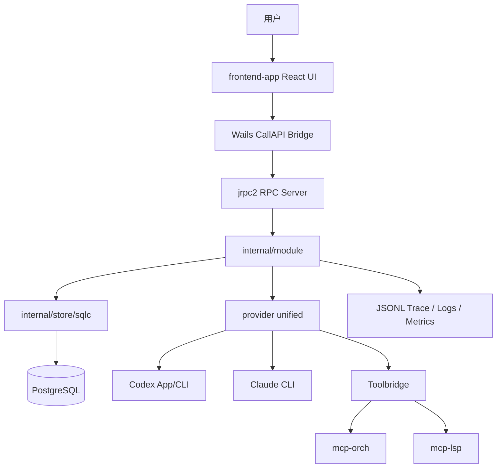
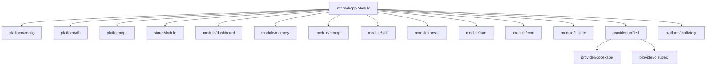

# 系统上下文与模块关系

## 1. 本阶段目标

梳理系统整体结构、模块边界、调用关系和外部依赖。

## 2. 已读取文件

- `internal/app/modules.go`
- `internal/platform/rpc/module.go`
- `internal/ui/wails/binding.go`
- `frontend-app/src/shared/api/backendApi.js`
- `internal/provider/unified/*`
- `internal/provider/codexapp/*`
- `internal/provider/claudecli/*`
- `cmd/mcp-orch/tools/registry.go`
- `cmd/mcp-lsp/tools.go`
- `internal/store/module.go`

## 3. 关键发现

## 4. 证据说明

- Fx 根组装由 `internal/app/modules.go` 定义，明确装配 config、db、bus、rpc、store、业务模块、provider 和 toolbridge。
- RPC 层由 `internal/platform/rpc/module.go` 注册 server、push bridge、approval manager、handler maps 和 `/ws` route。
- 前端 RPC 方法集中在 `frontend-app/src/shared/api/backendApi.js`，Wails 分发集中在 `internal/ui/wails/binding.go`。
- Provider 三层结构由 `docs/doc/codemap/09-provider.md` 与 `internal/provider/unified`、`codexapp`、`claudecli` 证实。
- mcp-orch 工具注册由 `cmd/mcp-orch/tools/registry.go` 汇总。

## 5. 风险与问题

- P1：`app.Module` 是高聚合点，新增模块容易扩大启动和测试影响面。
- P1：provider、toolbridge、MCP peer、UI push event 之间链路长，错误定位依赖 trace/log 完整性。
- P2：部分模块有 optional/noop 适配，文档分析需区分“能力存在”与“运行时已接线”。

## 6. 无法判断的信息

- 无法判断所有 MCP peer 在生产包中的启停策略；本次只从源码和脚本判断。
- 无法判断远端 provider 服务的 SLA 和速率限制。

## 7. 下一阶段建议

继续专项分析前端架构，重点看页面路由、状态、RPC facade、错误/空态和性能热点。
