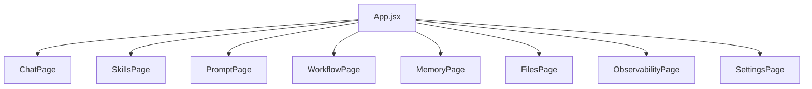
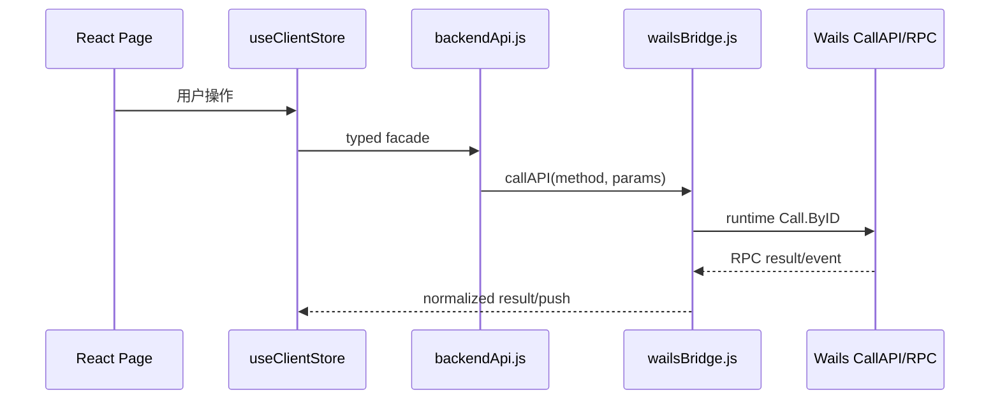

# 前端架构分析

## 1. 本阶段目标

分析当前 React/Vite 新 UI 的页面、路由、状态、API 调用、权限/校验、错误状态、样式、性能和测试覆盖。

## 2. 已读取文件

- `frontend-app/package.json`
- `frontend-app/src/main.jsx`
- `frontend-app/src/App.jsx`
- `frontend-app/src/entities/client/model/useClientStore.js`
- `frontend-app/src/shared/api/backendApi.js`
- `frontend-app/src/shared/api/wailsBridge.js`
- `frontend-app/src/pages/*`
- `frontend-app/src/styles.css`
- `frontend-app/src/*.test.*`

## 3. 关键发现

- 路由是轻量 browser history 同步，不是 React Router；页面 ID 和路径映射在 `App.jsx`。
- 状态集中在 Zustand store `useClientStore.js`，管理线程、timeline、provider 配置、warning、runtime result、bridge event。
- `backendApi.js` 对 `cwd`、`threadId`、skill scope、content、boolean、limit 等做前端 fail-fast。
- `wailsBridge.js` 负责 Wails runtime 加载、RPC pending trace、frontend trace batching、bridge log 脱敏。
- 测试覆盖集中在 `App.test.jsx`、`useClientStore.test.js`、`backendApi*.test.js`、页面测试和 `styles.test.js`。

## 4. 证据说明

| 结论 | 文件 |
|---|---|
| 页面导航包含 Chat/技能/提示词/自动化/记忆/共享文件/链路追踪/设置 | `frontend-app/src/App.jsx` |
| 状态管理使用 Zustand | `frontend-app/src/entities/client/model/useClientStore.js`、`frontend-app/package.json` |
| RPC facade 枚举和参数校验集中在 `backendApi.js` | `frontend-app/src/shared/api/backendApi.js` |
| Wails bridge 有敏感字段过滤和 trace 队列限制 | `frontend-app/src/shared/api/wailsBridge.js` |
| 前端测试使用 Vitest/Testing Library/Playwright 依赖 | `frontend-app/package.json` |

## 5. 风险与问题

- P1：`App.jsx`、`ChatPage.jsx`、`useClientStore.js` 和 `styles.css` 体积过大，是维护风险和回归风险。
- P1：状态和事件归一化逻辑集中在单一 store，大范围变更仍可能影响聊天、自动化、记忆等多个页面。
- P2：路由同步是自管 history，未来复杂路由/深链场景可能需要更严格测试。

## 6. 无法判断的信息

- 无法判断真实浏览器性能指标；本次未运行 Lighthouse 或浏览器性能采样。
- 无法判断当前 UI 与 legacy Vue 功能差距是否完全收敛。

## 7. 下一阶段建议

后端架构分析需要重点覆盖 Fx 组装、RPC handler、thread/turn、provider、MCP peer 和 fail-fast 边界。
