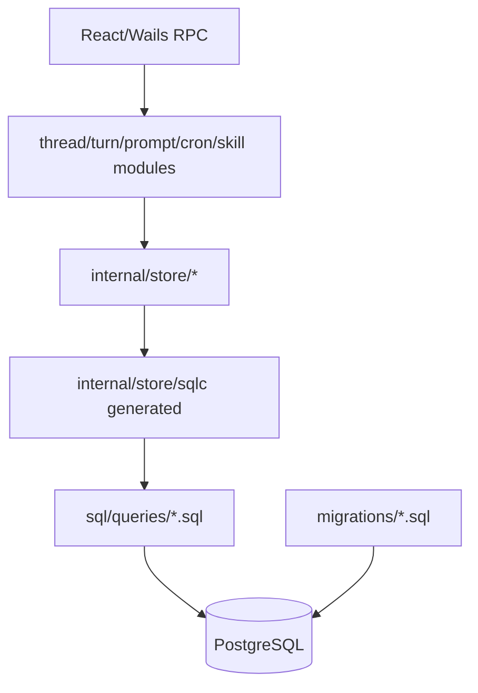

# 数据模型与数据流

## 1. 本阶段目标

分析数据库、实体关系、sqlc 查询、store 层、迁移和核心数据流。

## 2. 已读取文件

- `sqlc.yaml`
- `migrations/*.sql`
- `sql/queries/*.sql`
- `internal/store/module.go`
- `internal/store/*`
- `internal/platform/db/module.go`
- `docs/doc/codemap/10-store.md`

## 3. 关键发现

- `sqlc.yaml` 指定 PostgreSQL 引擎，schema 由 baseline、增量 migrations 和 `sql/schema/prompt_intent_drafts.sql` 组成。
- `internal/platform/db/module.go` 在启动生命周期中执行 auto-migrate，并通过 `MinRequiredSchemaVersion = 103` 做最低版本 fail-fast。
- store 设计以 sqlc 为主路径，store 包把 sqlc 结果包装为领域 DTO。
- 主要数据域包括 agent binding/status/thread、prompt/template/sections、memory/insight、cron jobs、DAG v2、shared files、system/audit/bus logs、workspace runs。
- 查询普遍有 `LIMIT`，运行时 `dbquery` 会为只读 SQL 自动补最大 limit。

## 4. 证据说明

| 结论 | 文件 |
|---|---|
| sqlc 输出到 `internal/store/sqlc` 并使用 pgx/v5 | `sqlc.yaml` |
| 启动自动迁移和最低 schema gate | `internal/platform/db/module.go` |
| store 层按 23+ 子包拆分，封装 sqlc | `docs/doc/codemap/10-store.md` |
| migrations 包含 agent、prompt、DAG、cron、shared files、logs 等表 | `migrations/*.sql` |
| 查询层有多处分页/limit | `sql/queries/*.sql` |

## 5. 风险与问题

- P1：migration gate 强依赖 `schema_migrations` 版本，环境未迁移到 `103` 以上会启动失败。
- P1：baseline + 大量增量迁移并存，迁移顺序和兼容列修复需要持续守护。
- P2：部分 codemap 记录提示 DTO 的 `ID` 字段可能未由 SQL 投影，属于可维护性债务。

## 6. 无法判断的信息

- 无法判断生产数据库大小、索引命中率、慢查询和备份恢复实际情况。
- 无法判断 migration 在所有目标平台上是否有独立发布流程；README 说明启动会自动迁移。

## 7. 下一阶段建议

继续测试体系分析，确认 Go、前端、guard、CI、E2E 和安全/性能测试边界。
