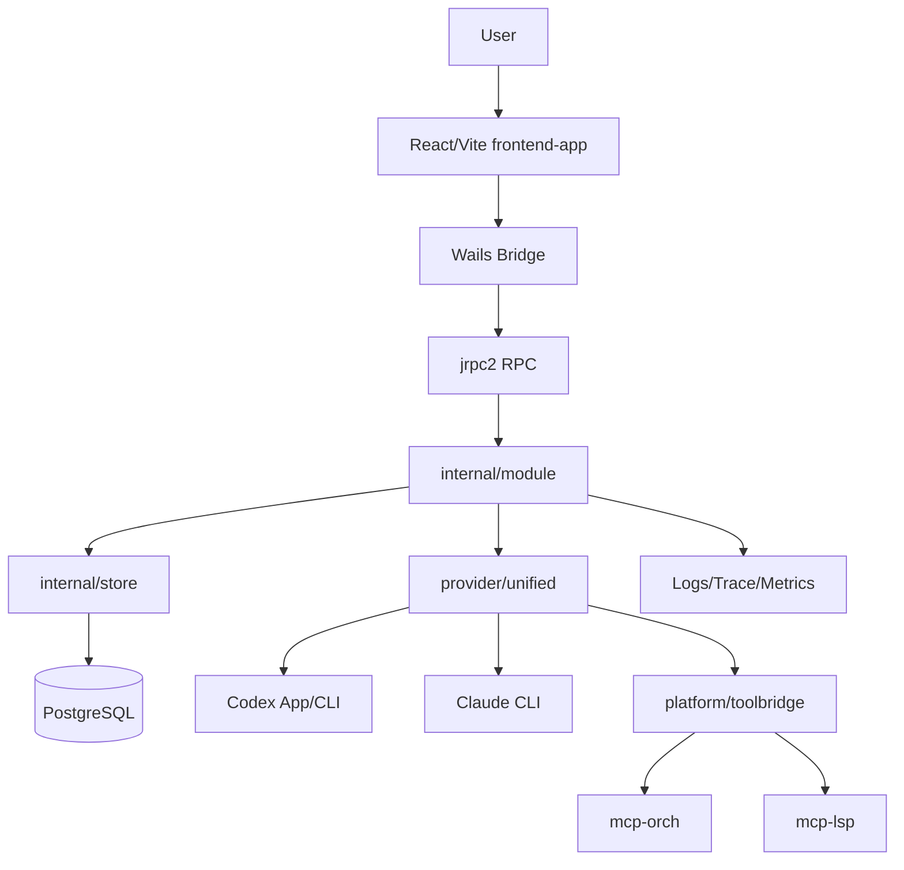
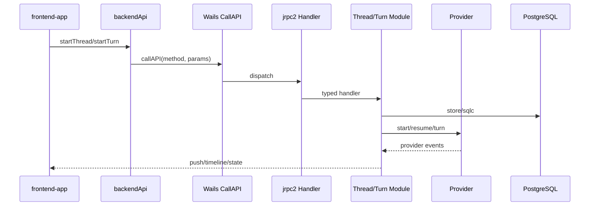

# 项目架构梳理报告

## 1. 项目一句话总结

Super-Dolphin 是一个本地/桌面优先的 AI 多代理编排平台，提供聊天线程、provider 会话、MCP 工具、DAG/cron 自动化、技能、提示词、记忆、共享文件和可观测性能力。

## 2. 项目核心业务目标

- 帮助用户在本地开发环境中启动和管理 AI agent/thread。
- 把 Claude/Codex provider、MCP 工具、LSP、共享文件、记忆和自动化编排统一到桌面 UI。
- 通过 trace、日志、metrics、测试和 guard 提高复杂 agent 任务的可观测性和可维护性。

## 3. 用户与核心场景

- 用户：AI 辅助开发操作者、工程团队内部工具使用者、多代理任务编排使用者。
- 场景：Chat 回合、自动化 DAG、cron、技能管理、prompt 管理、记忆检索、共享文件、链路追踪、子代理 orchestration。

## 4. 系统上下文图

## 5. 技术栈总览

| 层 | 技术 |
|---|---|
| 桌面宿主 | Wails v3、Go |
| 后端 | Go 1.25.7、Uber Fx、jrpc2、pgx、sqlc、oklog/run、stateless |
| 前端 | React 19、Vite、Zustand、TanStack Query、Vitest、ESLint |
| 数据 | PostgreSQL、migrations、sqlc |
| Provider | Codex App/CLI、Claude CLI、provider unified registry |
| 工具链 | mcp-orch、mcp-lsp、toolbridge、Git hooks、archtest、guard |
| 可观测性 | slog/ECS JSON、JSONL trace、Prometheus metrics、本地 ELK compose |

## 6. 目录结构说明

- `cmd/agent-terminal`：桌面宿主入口。
- `cmd/mcp-orch`：agent/DAG/cron/tool orchestration MCP peer。
- `cmd/mcp-lsp`：多语言 LSP MCP peer。
- `frontend-app`：当前 React/Vite UI。
- `cmd/agent-terminal/frontend`：legacy/package-embed Vue 前端。
- `internal/app`：Fx 根组装。
- `internal/module`：业务模块。
- `internal/platform`：基础设施。
- `internal/provider`：provider 适配。
- `internal/store`、`sql`、`migrations`：持久化。
- `docs/doc/codemap`：代码地图。

## 7. 核心模块说明

- Thread/turn：线程生命周期和回合执行核心。
- Prompt/memory/skill：上下文构建、技能发现、记忆注入。
- Cron/DAG/insight/notify：自动化和运行洞察。
- Provider unified/codexapp/claudecli：provider 会话和事件归一化。
- RPC/Wails bridge：前后端交互与 push event。
- Store/sqlc/db：持久化和 migration gate。

## 8. API 与数据流

## 9. 架构风险清单

| 优先级 | 风险 |
|---|---|
| P1 | 前端超大文件导致维护与回归风险。 |
| P1 | 生产部署、备份、告警、回滚证据不足。 |
| P1 | 本地桌面信任边界若扩展到多用户网络场景，需要重做安全边界。 |
| P1 | migration gate 和大量增量迁移增加环境兼容风险。 |
| P2 | legacy Vue 与 current React 并存造成路径误判成本。 |

## 10. 30 天行动计划

1. 给 `frontend-app` 大文件建立拆分计划和回归矩阵，先拆低风险纯 UI/样式片段。
2. 为生产部署补文档：部署拓扑、secret 管理、备份恢复、告警和回滚。
3. 对 mcp-orch 写能力做权限/cwd/trusted scope 回归清单。
4. 对 migration gate 编写运营手册，明确升级失败处理。
5. 建立性能基线：前端 bundle/渲染、DB 慢查询、provider 超时。

## 11. 需要补充的信息

- 生产部署平台、网络边界和 TLS/认证策略。
- 生产 DB 备份恢复和 migration 发布流程。
- 用户规模、SLO、告警阈值和历史事故记录。
- legacy Vue 的保留期限。

## 12. 本次生成文档

本次生成阶段 00-11 文档、最终架构报告、风险登记表、路线图、新人接手指南，并复制原始执行说明到 `docs/codex-analysis/codex-project-analysis-sequence.md`。
