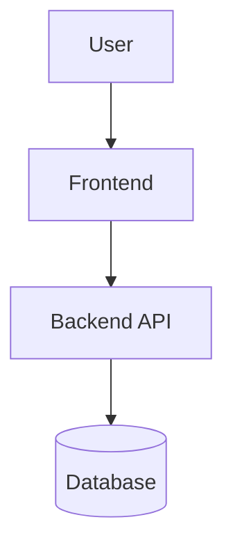

# Codex 项目梳理与架构分析顺序执行文档

> 目标：让 Codex 按固定顺序理解项目、分析架构、识别风险、生成文档，而不是一开始就修改业务代码。
>
> 推荐文件名：`codex-project-analysis-sequence.md`
>
> 推荐输出目录：`docs/codex-analysis/`

---

## 0. 使用方式

### 0.1 推荐执行方式

将本文件放在项目根目录，然后在 Codex 中输入：

```text
请读取项目根目录下的 codex-project-analysis-sequence.md，并严格按照其中的阶段顺序执行。
默认每次只执行一个阶段。完成当前阶段后停止，输出本阶段产物摘要、已读取文件、发现的问题、下一阶段建议，然后等待我输入“继续”。
不要跳步，不要直接修改业务代码。
```

### 0.2 全量执行方式

项目规模较小、希望一次性完成分析时，可以输入：

```text
请读取项目根目录下的 codex-project-analysis-sequence.md，并按照阶段 00 到阶段 12 的顺序连续执行。
只允许新增或更新 docs/codex-analysis/ 下的 Markdown 分析文档。
禁止修改业务代码、配置文件、依赖文件、数据库迁移文件和部署文件。
每个结论必须尽量引用具体文件路径作为依据。
```

---

## 1. Codex 全局工作协议

在执行任何阶段前，Codex 必须遵守以下规则。

### 1.1 角色设定

你现在扮演以下复合角色：

- 资深软件架构师
- 资深前端架构师
- 资深后端架构师
- DevOps / SRE 工程师
- 测试架构师
- 安全审查工程师
- 技术文档工程师

你的任务不是立刻写功能，而是从第一性原理出发，系统性理解项目。

---

### 1.2 总体目标

请围绕以下核心问题进行项目梳理：

1. 这个项目解决什么问题？
2. 服务哪些用户？
3. 核心业务流程是什么？
4. 前端、后端、数据层、基础设施如何协作？
5. 当前技术栈是什么？
6. 代码目录如何组织？
7. 核心模块有哪些？
8. 数据如何流转？
9. 项目如何开发、测试、构建、部署、监控和回滚？
10. 当前有哪些安全、性能、可靠性、可维护性和架构风险？
11. 后续应该如何分阶段演进？

---

### 1.3 执行边界

默认只允许执行以下行为：

- 读取文件
- 分析目录结构
- 查看依赖配置
- 查看测试配置
- 查看部署配置
- 执行只读命令
- 新增或更新 `docs/codex-analysis/` 下的 Markdown 文档

默认禁止执行以下行为：

- 修改业务代码
- 修改依赖版本
- 安装新依赖
- 删除文件
- 修改数据库迁移文件
- 修改生产配置
- 修改 CI/CD 配置
- 启动生产服务
- 连接生产数据库
- 执行破坏性命令

---

### 1.4 只读命令白名单

如需运行命令，优先使用以下只读命令：

```bash
pwd
ls
find . -maxdepth 3 -type f
tree -L 3
git status --short
git branch --show-current
git log --oneline -n 10
cat <file>
sed -n '1,200p' <file>
rg "<keyword>" .
grep -R "<keyword>" .
```

如项目中存在对应工具，也可以使用：

```bash
npm run
pnpm run
yarn run
make help
python -m pytest --collect-only
pytest --collect-only
```

禁止执行：

```bash
rm -rf
npm install
pnpm install
yarn install
pip install
mvn deploy
gradle publish
docker compose up
kubectl apply
terraform apply
prisma migrate deploy
sequelize db:migrate
```

---

### 1.5 证据规则

所有结论都必须尽量包含证据来源。

推荐格式：

```text
结论：项目使用 React 作为前端框架。
依据：package.json 中存在 react、react-dom 依赖。
文件：package.json
可信度：高
```

如无法确认，必须明确标注：

```text
无法判断：当前代码中未发现生产部署方式。
需要补充：部署平台、CI/CD 流程、生产环境变量说明。
```

禁止把推断写成事实。

---

### 1.6 输出规范

所有阶段输出均使用 Markdown。

每个阶段必须包含：

```markdown
# 阶段名称

## 1. 本阶段目标
## 2. 已读取文件
## 3. 关键发现
## 4. 证据说明
## 5. 风险与问题
## 6. 无法判断的信息
## 7. 下一阶段建议
```

涉及结构关系时，必须优先使用 Mermaid：



---

### 1.7 风险优先级标准

所有风险按 P0 / P1 / P2 标注。

| 优先级 | 含义 | 示例 |
|---|---|---|
| P0 | 必须立即处理，可能导致安全事故、数据丢失、服务不可用 | 明文密钥、认证绕过、SQL 注入、生产部署不可回滚 |
| P1 | 短期应处理，影响稳定性、性能或维护效率 | 核心路径无测试、慢查询风险、模块耦合严重 |
| P2 | 中长期优化，影响演进效率或工程体验 | 文档不足、命名不统一、目录结构可优化 |

---

## 2. 阶段执行总览

| 阶段 | 名称 | 主要目标 | 推荐输出文件 |
|---|---|---|---|
| 00 | 执行计划与仓库初识 | 建立上下文，识别项目类型和分析范围 | `00-execution-plan.md` |
| 01 | 业务目标与系统边界 | 理解业务问题、用户、场景、边界 | `01-business-and-boundary.md` |
| 02 | 技术栈与目录结构 | 梳理技术栈、依赖、目录职责 | `02-tech-stack-and-structure.md` |
| 03 | 系统上下文与模块关系 | 识别前后端、数据层、外部系统关系 | `03-system-context.md` |
| 04 | 前端架构分析 | 分析页面、路由、组件、状态、请求链路 | `04-frontend-architecture.md` |
| 05 | 后端架构分析 | 分析入口、路由、分层、鉴权、业务逻辑 | `05-backend-architecture.md` |
| 06 | 数据模型与数据流 | 分析数据库、实体关系、核心数据流 | `06-data-model-and-flow.md` |
| 07 | 测试体系分析 | 分析单测、集成、E2E、接口和 CI 测试 | `07-testing-strategy.md` |
| 08 | 运维部署分析 | 分析启动、构建、部署、环境变量、监控 | `08-devops-and-observability.md` |
| 09 | 安全性分析 | 分析认证、授权、输入校验、敏感信息风险 | `09-security-review.md` |
| 10 | 性能与扩展性分析 | 分析性能瓶颈、缓存、并发、扩容能力 | `10-performance-and-scalability.md` |
| 11 | 技术债与可维护性 | 分析耦合、重复、复杂度、文档和演进风险 | `11-maintainability-and-tech-debt.md` |
| 12 | 汇总架构报告 | 汇总所有阶段，形成最终项目架构文档 | `architecture-report.md` |

---

# 阶段 00：执行计划与仓库初识

## Codex 提示词

```text
当前执行阶段：00 - 执行计划与仓库初识。

请你先不要修改任何业务代码。

你的任务是对当前仓库做初步扫描，建立项目分析上下文，并生成后续阶段执行计划。

请优先读取以下文件或目录：

1. README、README.md、docs/ 目录
2. package.json、pnpm-lock.yaml、yarn.lock、package-lock.json
3. pom.xml、build.gradle、settings.gradle
4. requirements.txt、pyproject.toml、Pipfile、poetry.lock
5. go.mod、Cargo.toml、composer.json
6. Dockerfile、docker-compose.yml、compose.yml
7. .github/workflows、.gitlab-ci.yml、Jenkinsfile
8. src、app、server、client、frontend、backend、services、tests、test 目录
9. .env.example、config、configs、infra、deploy、k8s 目录

请完成以下任务：

1. 判断项目类型。
2. 判断可能的技术栈。
3. 判断是否包含前端、后端、数据库、任务队列、部署配置、测试代码。
4. 输出项目初步目录树。
5. 识别最值得优先阅读的 20 个文件。
6. 判断后续阶段中哪些阶段适用，哪些阶段可以跳过。
7. 创建或更新 `docs/codex-analysis/00-execution-plan.md`。

输出要求：

- 使用 Markdown。
- 每个结论尽量引用具体文件路径。
- 不确定的地方必须标注“推断”或“无法判断”。
- 不要安装依赖。
- 不要启动服务。
- 不要修改业务代码。
```

## 本阶段验收标准

- 已生成 `docs/codex-analysis/00-execution-plan.md`
- 已判断项目类型
- 已列出关键文件
- 已明确后续阶段是否全部适用
- 未修改业务代码

---

# 阶段 01：业务目标与系统边界

## Codex 提示词

```text
当前执行阶段：01 - 业务目标与系统边界。

请基于阶段 00 的结果继续分析。

你的任务是从第一性原理出发，理解这个项目为什么存在、服务谁、解决什么问题，以及系统边界在哪里。

请重点读取：

1. README / docs 中的业务说明
2. 路由文件
3. 页面目录
4. API 入口
5. 数据模型
6. 配置文件中出现的第三方服务
7. 测试用例中的业务场景

请分析：

1. 项目一句话总结。
2. 目标用户是谁。
3. 核心业务场景有哪些。
4. 项目的主要输入是什么。
5. 项目的主要处理过程是什么。
6. 项目的主要输出是什么。
7. 系统内部能力有哪些。
8. 系统依赖的外部能力有哪些。
9. 系统不负责什么。
10. 可以衡量项目成功的关键指标可能有哪些。

请创建或更新：

`docs/codex-analysis/01-business-and-boundary.md`

文档结构：

# 业务目标与系统边界

## 1. 项目一句话总结
## 2. 目标用户
## 3. 核心业务场景
## 4. 输入、处理、输出
## 5. 系统内部能力
## 6. 外部依赖能力
## 7. 非目标范围
## 8. 关键成功指标
## 9. 证据文件
## 10. 无法判断的信息

要求：

- 不要把推断写成事实。
- 每个业务判断尽量引用文件路径。
- 如业务信息不足，请明确列出需要补充的问题。
```

## 本阶段验收标准

- 已明确项目业务目标
- 已明确系统边界
- 已区分事实与推断
- 已列出无法判断的信息

---

# 阶段 02：技术栈与目录结构

## Codex 提示词

```text
当前执行阶段：02 - 技术栈与目录结构。

请基于前面阶段继续分析。

你的任务是梳理项目技术栈、工程化配置和目录职责。

请重点读取：

1. 依赖配置文件
2. 构建配置文件
3. 框架配置文件
4. src / app / server / client 等核心目录
5. tests / test / __tests__ 目录
6. scripts 目录
7. docs 目录
8. Docker / CI 配置

请分析：

1. 前端技术栈。
2. 后端技术栈。
3. 数据库和缓存技术。
4. 消息队列、搜索、对象存储等基础设施。
5. 构建工具。
6. 代码规范工具。
7. 测试工具。
8. 部署和运维工具。
9. 目录结构职责。
10. 哪些目录是业务代码。
11. 哪些目录是基础设施代码。
12. 哪些目录是配置、测试、脚本或文档。
13. 是否存在目录职责混乱、命名不一致、重复结构等问题。

请创建或更新：

`docs/codex-analysis/02-tech-stack-and-structure.md`

文档结构：

# 技术栈与目录结构

## 1. 技术栈总览表
## 2. 前端技术栈
## 3. 后端技术栈
## 4. 数据层技术栈
## 5. 工程化工具
## 6. 部署运维工具
## 7. 目录结构说明
## 8. 核心目录职责
## 9. 可疑结构问题
## 10. 证据文件
## 11. 无法判断的信息

要求：

- 使用表格总结技术栈。
- 每个技术栈结论必须引用依赖或配置文件。
- 不要运行安装命令。
- 不要修改业务代码。
```

## 本阶段验收标准

- 已输出技术栈总览表
- 已解释核心目录职责
- 已识别工程化工具
- 已列出目录结构问题

---

# 阶段 03：系统上下文与模块关系

## Codex 提示词

```text
当前执行阶段：03 - 系统上下文与模块关系。

请基于前面阶段继续分析。

你的任务是梳理系统整体结构、模块边界和模块之间的调用关系。

请重点读取：

1. 应用入口文件
2. 路由配置
3. 模块注册文件
4. 服务层代码
5. API 客户端代码
6. 数据访问层代码
7. 第三方服务封装代码
8. 配置文件

请分析：

1. 系统包含哪些主要模块。
2. 前端、后端、数据库、缓存、消息队列、第三方 API 之间如何协作。
3. 哪些模块是核心业务模块。
4. 哪些模块是通用基础模块。
5. 哪些模块依赖外部系统。
6. 是否存在循环依赖。
7. 是否存在模块边界不清。
8. 是否存在业务逻辑散落在多个层级的问题。

请创建或更新：

`docs/codex-analysis/03-system-context.md`

文档结构：

# 系统上下文与模块关系

## 1. 系统上下文图
## 2. 模块关系图
## 3. 核心业务模块
## 4. 基础设施模块
## 5. 外部依赖模块
## 6. 模块调用关系
## 7. 边界问题
## 8. 循环依赖或高耦合风险
## 9. 证据文件
## 10. 无法判断的信息

必须包含 Mermaid 图：

1. 系统上下文图
2. 模块依赖图

要求：

- 图中节点必须来自真实代码或配置。
- 不确定的外部系统请标注“推断”。
- 不要修改业务代码。
```

## 本阶段验收标准

- 已输出系统上下文图
- 已输出模块关系图
- 已识别核心模块和基础设施模块
- 已识别边界问题

---

# 阶段 04：前端架构分析

## Codex 提示词

```text
当前执行阶段：04 - 前端架构分析。

如果阶段 00 或阶段 02 判断当前项目不包含前端，请在文档中说明“不适用”，并跳过详细分析。

如果项目包含前端，请作为资深前端架构师进行专项分析。

请重点读取：

1. 前端入口文件
2. 路由配置
3. 页面目录
4. 组件目录
5. 状态管理代码
6. API 请求封装
7. 权限控制代码
8. 表单和校验代码
9. 样式配置
10. 构建配置
11. 前端测试文件

请分析：

1. 前端框架和构建方式。
2. 页面和路由结构。
3. 组件分层是否合理。
4. 状态管理方式。
5. API 请求封装方式。
6. 鉴权和权限控制方式。
7. 表单校验方式。
8. 错误处理方式。
9. 加载态、空状态、异常态处理。
10. 样式方案。
11. 响应式设计和可访问性。
12. 前端性能风险。
13. 前端测试覆盖情况。
14. 高复杂度页面或组件。
15. 可维护性风险。

请创建或更新：

`docs/codex-analysis/04-frontend-architecture.md`

文档结构：

# 前端架构分析

## 1. 是否适用
## 2. 前端技术栈
## 3. 页面与路由结构
## 4. 组件层级设计
## 5. 状态管理分析
## 6. API 调用链路
## 7. 权限控制分析
## 8. 表单与校验分析
## 9. 错误、加载、空状态处理
## 10. 样式与响应式设计
## 11. 前端性能风险
## 12. 前端测试覆盖
## 13. 高风险文件清单
## 14. 优化建议
## 15. 证据文件
## 16. 无法判断的信息

必须包含 Mermaid 图：

1. 页面路由图
2. 前端请求链路图

要求：

- 标注高复杂度组件或页面。
- 不要重构代码。
- 不要修改业务代码。
```

## 本阶段验收标准

- 已判断前端分析是否适用
- 已输出页面/路由结构
- 已输出 API 调用链路
- 已识别前端风险

---

# 阶段 05：后端架构分析

## Codex 提示词

```text
当前执行阶段：05 - 后端架构分析。

如果阶段 00 或阶段 02 判断当前项目不包含后端，请在文档中说明“不适用”，并跳过详细分析。

如果项目包含后端，请作为资深后端架构师进行专项分析。

请重点读取：

1. 后端应用入口
2. 路由定义
3. Controller / Handler 层
4. Service / UseCase 层
5. Repository / DAO 层
6. Domain / Entity / Model 层
7. 中间件
8. 鉴权认证代码
9. 参数校验代码
10. 错误处理代码
11. 日志代码
12. 异步任务或定时任务
13. 第三方服务调用代码
14. 后端测试代码

请分析：

1. 后端框架和启动流程。
2. API 路由结构。
3. 分层结构是否清晰。
4. 核心业务服务有哪些。
5. 数据访问方式。
6. 事务边界。
7. 鉴权认证方式。
8. 授权和权限模型。
9. 参数校验方式。
10. 错误处理方式。
11. 日志记录方式。
12. 缓存策略。
13. 异步任务和定时任务。
14. 第三方服务调用。
15. 幂等性设计。
16. 并发处理风险。
17. 后端测试覆盖情况。
18. 安全和性能风险。

请创建或更新：

`docs/codex-analysis/05-backend-architecture.md`

文档结构：

# 后端架构分析

## 1. 是否适用
## 2. 后端技术栈
## 3. 应用启动流程
## 4. API 路由总览
## 5. 分层结构分析
## 6. 核心业务模块
## 7. 数据访问模式
## 8. 事务与一致性分析
## 9. 鉴权与权限分析
## 10. 参数校验与错误处理
## 11. 日志与可观测性
## 12. 缓存、异步任务与定时任务
## 13. 第三方服务调用
## 14. 并发与幂等性风险
## 15. 后端测试覆盖
## 16. 高风险代码路径
## 17. 优化建议
## 18. 证据文件
## 19. 无法判断的信息

必须包含 Mermaid 图：

1. 请求处理链路图
2. 后端分层结构图

要求：

- 标出关键业务接口。
- 标出高风险代码路径。
- 不要修改业务代码。
```

## 本阶段验收标准

- 已判断后端分析是否适用
- 已输出请求链路图
- 已分析分层结构
- 已识别后端风险

---

# 阶段 06：数据模型与数据流

## Codex 提示词

```text
当前执行阶段：06 - 数据模型与数据流。

请基于前面阶段继续分析。

你的任务是识别数据模型、核心业务实体、数据流转路径和数据一致性风险。

请重点读取：

1. 数据库 schema 文件
2. ORM 模型
3. migration 文件
4. seed 文件
5. Repository / DAO 代码
6. Service 中的数据处理逻辑
7. API 输入输出定义
8. 类型定义
9. 测试数据

请分析：

1. 使用了哪些数据存储。
2. 核心数据表或集合有哪些。
3. 核心业务实体有哪些。
4. 实体之间的关系。
5. 主键、外键、索引设计。
6. 是否存在软删除、审计字段、版本字段。
7. 核心数据创建、读取、更新、删除路径。
8. 数据一致性和事务边界。
9. 并发更新风险。
10. 幂等性风险。
11. 潜在慢查询风险。
12. 数据备份和恢复是否有体现。
13. 数据迁移方案是否清晰。

请创建或更新：

`docs/codex-analysis/06-data-model-and-flow.md`

文档结构：

# 数据模型与数据流

## 1. 数据存储总览
## 2. 核心业务实体
## 3. 数据表 / Schema 总览
## 4. 实体关系图
## 5. 核心数据流图
## 6. CRUD 路径分析
## 7. 事务与一致性分析
## 8. 并发与幂等性风险
## 9. 索引与查询风险
## 10. 数据迁移分析
## 11. 备份与恢复分析
## 12. 优化建议
## 13. 证据文件
## 14. 无法判断的信息

必须包含 Mermaid 图：

1. ER 图或领域模型图
2. 核心数据流图

要求：

- 不要执行迁移命令。
- 不要连接数据库。
- 不要修改 schema。
```

## 本阶段验收标准

- 已识别核心业务实体
- 已输出实体关系图
- 已输出核心数据流图
- 已识别一致性和查询风险

---

# 阶段 07：测试体系分析

## Codex 提示词

```text
当前执行阶段：07 - 测试体系分析。

请作为测试架构师，分析当前项目的测试体系。

请重点读取：

1. 测试目录
2. 测试配置文件
3. package.json / pyproject.toml / pom.xml / build.gradle 中的测试脚本
4. CI/CD 中的测试步骤
5. 单元测试文件
6. 集成测试文件
7. E2E 测试文件
8. API 测试文件
9. Mock、Fixture、Factory、Seed 文件

请分析：

1. 当前测试框架。
2. 测试命令。
3. 单元测试现状。
4. 集成测试现状。
5. E2E 测试现状。
6. API 测试现状。
7. 性能测试现状。
8. 安全测试现状。
9. 测试数据管理方式。
10. CI 中是否执行测试。
11. 核心业务路径是否被覆盖。
12. 高风险未测场景。
13. 推荐测试金字塔。
14. 测试补齐优先级。

请创建或更新：

`docs/codex-analysis/07-testing-strategy.md`

文档结构：

# 测试体系分析

## 1. 测试框架总览
## 2. 测试命令
## 3. 单元测试现状
## 4. 集成测试现状
## 5. E2E 测试现状
## 6. API 测试现状
## 7. 性能测试现状
## 8. 安全测试现状
## 9. 测试数据管理
## 10. CI 测试流水线
## 11. 核心路径覆盖情况
## 12. 高风险未测场景
## 13. 推荐测试金字塔
## 14. 测试补齐路线图
## 15. 证据文件
## 16. 无法判断的信息

要求：

- 不要直接写测试代码。
- 不要安装测试依赖。
- 可以收集测试用例，但不要运行会修改数据的测试。
- 如果建议新增测试，请说明测试目标、建议文件位置、测试数据和断言重点。
```

## 本阶段验收标准

- 已识别测试框架
- 已列出测试命令
- 已识别测试覆盖缺口
- 已给出测试补齐路线图

---

# 阶段 08：运维部署与可观测性分析

## Codex 提示词

```text
当前执行阶段：08 - 运维部署与可观测性分析。

请作为 DevOps / SRE 架构师，分析当前项目如何开发、构建、部署、监控、告警和回滚。

请重点读取：

1. README 中的启动说明
2. package.json / Makefile / scripts 中的启动和构建命令
3. Dockerfile
4. docker-compose.yml / compose.yml
5. Kubernetes 配置
6. Helm Chart
7. Nginx 配置
8. CI/CD 配置
9. .env.example
10. config 目录
11. 日志相关代码
12. 健康检查接口
13. 监控指标代码
14. 告警配置
15. 备份恢复脚本

请分析：

1. 本地开发启动流程。
2. 构建流程。
3. 部署流程。
4. 环境变量清单。
5. 容器化方案。
6. CI/CD 流水线。
7. 数据库迁移流程。
8. 日志输出方式。
9. 健康检查。
10. 监控指标。
11. 告警机制。
12. 回滚方案。
13. 灰度发布能力。
14. 扩缩容能力。
15. 备份与恢复能力。
16. 单点故障和运维风险。

请创建或更新：

`docs/codex-analysis/08-devops-and-observability.md`

文档结构：

# 运维部署与可观测性分析

## 1. 本地启动流程
## 2. 构建流程
## 3. 部署流程
## 4. 环境变量说明
## 5. 容器化分析
## 6. CI/CD 分析
## 7. 数据库迁移流程
## 8. 日志体系
## 9. 健康检查
## 10. 监控与指标
## 11. 告警机制
## 12. 回滚与发布策略
## 13. 扩缩容能力
## 14. 备份与恢复
## 15. 运维风险清单
## 16. 改进建议
## 17. 证据文件
## 18. 无法判断的信息

要求：

- 不要启动生产服务。
- 不要执行部署命令。
- 不要修改 CI/CD 或部署配置。
- 环境变量中如发现疑似密钥，只标注风险，不要在文档中完整复制密钥值。
```

## 本阶段验收标准

- 已梳理本地启动、构建、部署方式
- 已识别环境变量
- 已分析日志、监控、健康检查
- 已识别发布和回滚风险

---

# 阶段 09：安全性分析

## Codex 提示词

```text
当前执行阶段：09 - 安全性分析。

请作为安全审查工程师，基于代码和配置进行安全性分析。

请重点读取：

1. 鉴权认证代码
2. 权限控制代码
3. 路由和中间件
4. 参数校验代码
5. 文件上传代码
6. 数据库查询代码
7. 第三方请求代码
8. 环境变量和配置文件
9. 日志代码
10. 前端渲染和输入处理代码
11. 依赖文件
12. CI/CD 配置

请重点检查：

1. 身份认证。
2. 权限控制。
3. 越权访问风险。
4. 输入校验。
5. SQL 注入。
6. XSS。
7. CSRF。
8. SSRF。
9. 文件上传风险。
10. 敏感信息泄露。
11. 日志脱敏。
12. 密钥和环境变量管理。
13. CORS 配置。
14. Rate Limit / 限流。
15. 依赖漏洞风险。
16. 错误信息暴露。
17. 管理员接口保护。

请创建或更新：

`docs/codex-analysis/09-security-review.md`

文档结构：

# 安全性分析

## 1. 安全结论总览
## 2. 身份认证分析
## 3. 权限控制分析
## 4. 输入校验分析
## 5. 注入风险分析
## 6. XSS / CSRF / SSRF 风险
## 7. 文件上传风险
## 8. 敏感信息与密钥管理
## 9. 日志脱敏分析
## 10. CORS 与限流分析
## 11. 依赖风险
## 12. 高风险接口或代码路径
## 13. P0 / P1 / P2 安全风险清单
## 14. 修复建议
## 15. 证据文件
## 16. 无法判断的信息

要求：

- 不要输出完整密钥、Token、密码、连接串。
- 如果发现疑似敏感信息，只展示变量名、文件路径和风险描述。
- 不要尝试攻击外部服务。
- 不要执行破坏性安全测试。
```

## 本阶段验收标准

- 已分析认证和授权
- 已识别常见 Web 安全风险
- 已标注 P0/P1/P2 安全问题
- 未暴露敏感信息原文

---

# 阶段 10：性能与扩展性分析

## Codex 提示词

```text
当前执行阶段：10 - 性能与扩展性分析。

请作为性能架构师，分析当前项目的性能瓶颈和扩展性风险。

请重点读取：

1. 前端入口和构建配置
2. 页面和组件代码
3. API 路由和服务层代码
4. 数据库查询代码
5. ORM 查询代码
6. 缓存代码
7. 批量任务和定时任务
8. 文件处理代码
9. 第三方服务调用代码
10. 部署配置
11. 负载均衡和网关配置
12. 性能测试文件

请分析：

1. 前端加载性能风险。
2. 包体积和懒加载情况。
3. API 响应性能风险。
4. 数据库查询性能风险。
5. N+1 查询风险。
6. 缓存使用情况。
7. 分页、排序、过滤是否合理。
8. 批量任务性能。
9. 并发处理能力。
10. 限流、降级、熔断机制。
11. 第三方服务调用超时和重试。
12. 水平扩展能力。
13. 单点瓶颈。
14. 用户量增长后的主要瓶颈。

请创建或更新：

`docs/codex-analysis/10-performance-and-scalability.md`

文档结构：

# 性能与扩展性分析

## 1. 性能结论总览
## 2. 前端性能分析
## 3. API 性能分析
## 4. 数据库查询性能分析
## 5. 缓存策略分析
## 6. 批量任务性能分析
## 7. 并发处理分析
## 8. 限流、降级、熔断分析
## 9. 第三方服务调用风险
## 10. 水平扩展能力
## 11. 单点瓶颈
## 12. P0 / P1 / P2 性能风险清单
## 13. 优化建议
## 14. 证据文件
## 15. 无法判断的信息

要求：

- 不要执行压测。
- 不要修改代码。
- 如需建议压测方案，只输出方案，不执行。
```

## 本阶段验收标准

- 已识别主要性能瓶颈
- 已识别扩展性风险
- 已给出性能优化优先级
- 未执行压测或破坏性操作

---

# 阶段 11：技术债与可维护性分析

## Codex 提示词

```text
当前执行阶段：11 - 技术债与可维护性分析。

请作为资深架构师，分析当前项目的可维护性、可演进性和技术债。

请重点读取：

1. 核心业务模块
2. 大文件和高复杂度文件
3. 重复代码区域
4. 工具函数和公共模块
5. 类型定义
6. 配置文件
7. 文档
8. 测试覆盖薄弱区域
9. 历史兼容代码
10. TODO / FIXME / HACK 注释

请分析：

1. 模块边界是否清晰。
2. 是否存在高耦合。
3. 是否存在循环依赖。
4. 是否存在重复代码。
5. 是否存在过大的文件、函数、类或组件。
6. 命名是否统一。
7. 类型约束是否完整。
8. 错误处理是否一致。
9. 配置管理是否清晰。
10. 公共工具是否滥用。
11. 文档是否足够。
12. 测试缺失造成的维护风险。
13. 当前架构是否支持未来扩展。
14. 推荐重构路线。

请创建或更新：

`docs/codex-analysis/11-maintainability-and-tech-debt.md`

文档结构：

# 技术债与可维护性分析

## 1. 总体结论
## 2. 模块边界问题
## 3. 耦合与依赖问题
## 4. 重复代码问题
## 5. 复杂度问题
## 6. 命名与风格问题
## 7. 类型与接口约束问题
## 8. 错误处理一致性问题
## 9. 配置管理问题
## 10. 文档缺口
## 11. 测试缺失带来的维护风险
## 12. 技术债清单
## 13. 推荐重构路线图
## 14. 证据文件
## 15. 无法判断的信息

要求：

- 不要直接重构代码。
- 每个技术债必须说明影响范围和建议处理方式。
- 重构建议必须按 P0/P1/P2 排序。
```

## 本阶段验收标准

- 已识别主要技术债
- 已输出重构路线图
- 已说明影响范围和处理方式
- 未直接重构业务代码

---

# 阶段 12：汇总架构报告

## Codex 提示词

```text
当前执行阶段：12 - 汇总架构报告。

请汇总阶段 00 到阶段 11 的所有分析结果，生成最终项目架构报告。

请读取以下文档：

1. docs/codex-analysis/00-execution-plan.md
2. docs/codex-analysis/01-business-and-boundary.md
3. docs/codex-analysis/02-tech-stack-and-structure.md
4. docs/codex-analysis/03-system-context.md
5. docs/codex-analysis/04-frontend-architecture.md
6. docs/codex-analysis/05-backend-architecture.md
7. docs/codex-analysis/06-data-model-and-flow.md
8. docs/codex-analysis/07-testing-strategy.md
9. docs/codex-analysis/08-devops-and-observability.md
10. docs/codex-analysis/09-security-review.md
11. docs/codex-analysis/10-performance-and-scalability.md
12. docs/codex-analysis/11-maintainability-and-tech-debt.md

请创建或更新：

`docs/codex-analysis/architecture-report.md`

文档结构：

# 项目架构梳理报告

## 1. 项目一句话总结
## 2. 项目核心业务目标
## 3. 用户与核心场景
## 4. 系统上下文图
## 5. 技术栈总览
## 6. 目录结构说明
## 7. 核心模块说明
## 8. 业务领域模型
## 9. 核心业务流程
## 10. API 与数据流
## 11. 前端架构分析
## 12. 后端架构分析
## 13. 数据库设计分析
## 14. 部署与运维分析
## 15. 测试体系分析
## 16. 安全风险分析
## 17. 性能风险分析
## 18. 技术债清单
## 19. 架构风险清单
## 20. P0 / P1 / P2 优化路线图
## 21. 30 天行动计划
## 22. 需要补充的信息

同时创建或更新：

1. `docs/codex-analysis/risk-register.md`
2. `docs/codex-analysis/roadmap.md`
3. `docs/codex-analysis/onboarding-guide.md`

其中：

## risk-register.md

请包含：

| 编号 | 优先级 | 风险类型 | 问题描述 | 影响范围 | 证据文件 | 建议处理方式 |
|---|---|---|---|---|---|---|

风险类型包括：

- 架构
- 安全
- 性能
- 测试
- 运维
- 数据
- 前端
- 后端
- 可维护性

## roadmap.md

请包含：

# 优化路线图

## P0：立即处理
## P1：短期优化
## P2：长期演进
## 30 天计划
## 60 天计划
## 90 天计划

## onboarding-guide.md

请包含：

# 新人接手指南

## 1. 项目是什么
## 2. 本地如何启动
## 3. 应优先阅读哪些文件
## 4. 核心业务流程
## 5. 核心模块
## 6. 常用命令
## 7. 测试方式
## 8. 部署方式
## 9. 常见问题
## 10. 修改代码前必须注意的风险

要求：

- 不要编造不存在的能力。
- 所有关键结论都尽量引用具体文件路径。
- 所有图使用 Mermaid。
- 对无法判断的信息单独列出。
- 最终输出一段摘要，说明本次分析生成了哪些文档。
```

## 本阶段验收标准

- 已生成最终架构报告
- 已生成风险登记表
- 已生成优化路线图
- 已生成新人接手指南
- 所有阶段产物形成闭环

---

# 3. 可选：AGENTS.md 持久化指令

可以在项目根目录创建 `AGENTS.md`，让 Codex 每次进入仓库时都遵守统一规则。

```markdown
# AGENTS.md

## Repository working agreements

- 默认不要直接修改业务代码，除非用户明确要求实施。
- 做架构分析时，优先读取 README、docs、依赖配置、入口文件、路由、数据模型、测试和部署配置。
- 所有架构结论必须尽量引用具体文件路径。
- 不确定的信息必须标注“推断”或“无法判断”。
- 默认只允许新增或更新 `docs/codex-analysis/` 下的分析文档。
- 不要安装依赖。
- 不要执行生产部署命令。
- 不要执行数据库迁移命令。
- 不要输出完整密钥、Token、密码或连接串。
- 所有文档使用中文 Markdown。
- 架构图、流程图、数据流图统一使用 Mermaid。
- 风险按 P0 / P1 / P2 标注。
```

---

# 4. 最终检查清单

Codex 完成所有阶段后，请检查：

- [ ] 是否生成 `docs/codex-analysis/00-execution-plan.md`
- [ ] 是否生成 `docs/codex-analysis/01-business-and-boundary.md`
- [ ] 是否生成 `docs/codex-analysis/02-tech-stack-and-structure.md`
- [ ] 是否生成 `docs/codex-analysis/03-system-context.md`
- [ ] 是否生成 `docs/codex-analysis/04-frontend-architecture.md`
- [ ] 是否生成 `docs/codex-analysis/05-backend-architecture.md`
- [ ] 是否生成 `docs/codex-analysis/06-data-model-and-flow.md`
- [ ] 是否生成 `docs/codex-analysis/07-testing-strategy.md`
- [ ] 是否生成 `docs/codex-analysis/08-devops-and-observability.md`
- [ ] 是否生成 `docs/codex-analysis/09-security-review.md`
- [ ] 是否生成 `docs/codex-analysis/10-performance-and-scalability.md`
- [ ] 是否生成 `docs/codex-analysis/11-maintainability-and-tech-debt.md`
- [ ] 是否生成 `docs/codex-analysis/architecture-report.md`
- [ ] 是否生成 `docs/codex-analysis/risk-register.md`
- [ ] 是否生成 `docs/codex-analysis/roadmap.md`
- [ ] 是否生成 `docs/codex-analysis/onboarding-guide.md`
- [ ] 是否所有关键结论都有文件路径依据
- [ ] 是否所有无法判断的信息已单独列出
- [ ] 是否所有风险都按 P0 / P1 / P2 分级
- [ ] 是否未修改业务代码
- [ ] 是否未泄露敏感信息

---

# 5. 最小可执行总提示词

当你只想给 Codex 一段简洁命令时，使用下面这段：

```text
请你作为资深架构师、前端架构师、后端架构师、DevOps 工程师、测试架构师和安全审查工程师，从第一性原理出发，系统性梳理当前项目。

请严格按以下阶段顺序执行：

00 执行计划与仓库初识
01 业务目标与系统边界
02 技术栈与目录结构
03 系统上下文与模块关系
04 前端架构分析
05 后端架构分析
06 数据模型与数据流
07 测试体系分析
08 运维部署与可观测性分析
09 安全性分析
10 性能与扩展性分析
11 技术债与可维护性分析
12 汇总架构报告

默认只允许新增或更新 docs/codex-analysis/ 下的 Markdown 分析文档，不要修改业务代码。
每个阶段都要输出独立文档。
所有关键结论必须尽量引用具体文件路径。
所有不确定的信息必须标注“推断”或“无法判断”。
所有图使用 Mermaid。
所有风险按 P0 / P1 / P2 标注。
最终生成 architecture-report.md、risk-register.md、roadmap.md 和 onboarding-guide.md。
```
