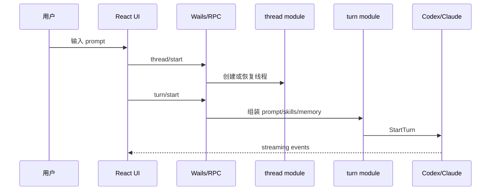

# 新人接手指南

## 1. 项目是什么

Super-Dolphin 是本地/桌面优先的 AI 多代理编排平台，整合 React UI、Wails 桌面宿主、Go RPC 后端、Codex/Claude provider、mcp-orch、mcp-lsp、PostgreSQL、技能、提示词、记忆、自动化和可观测性。

## 2. 本地如何启动

- 新 UI 桌面流：`./run-new-ui-desktop.sh`
- Windows 调试流：`.\run-debug.ps1`
- Go 构建：`make build-plain`
- 前端验证：进入 `frontend-app` 后运行 `npm run lint`、`npm test`、`npm run build`

启动前需要 PostgreSQL 和 `DATABASE_URL`，详见 `README.md` 和 `.env.example`。不要把真实 secret 提交到仓库。

## 3. 应优先阅读哪些文件

1. `README.md`
2. `AGENTS.md`
3. `docs/doc/codemap/README.md`
4. `docs/doc/codemap/01-terminal-ui-react.md`
5. `docs/doc/codemap/04-app-contract.md`
6. `docs/doc/codemap/07-module.md`
7. `docs/doc/codemap/08-platform.md`
8. `docs/doc/codemap/09-provider.md`
9. `docs/doc/codemap/10-store.md`

## 4. 核心业务流程

## 5. 核心模块

- `internal/app`：Fx 根组装。
- `internal/module/thread`：线程生命周期。
- `internal/module/turn`：回合执行。
- `internal/module/prompt`：prompt 组装。
- `internal/module/memory`：记忆。
- `internal/module/skill`：技能。
- `internal/provider`：Claude/Codex provider。
- `cmd/mcp-orch`：agent/DAG 工具。
- `cmd/mcp-lsp`：LSP 工具。
- `frontend-app`：当前 UI。

## 6. 常用命令

- `git status --short --branch`
- `make install-hooks`
- `./scripts/test_with_guard.sh <packages> -count=1`
- `make guard`
- `make build-plain`
- `cd frontend-app; npm run lint; npm test; npm run build`
- `make sqlc-verify`
- `make codemap-check`

## 7. 测试方式

- Go：优先 `./scripts/test_with_guard.sh <affected packages> -count=1`
- 前端：`frontend-app` 下运行 lint/test/build
- SQL/store：`make sqlc-verify`
- 架构/guard：`make guard` 或相关 archtest
- legacy Vue：只在明确修改 `cmd/agent-terminal/frontend` 时运行对应 size guard/Vitest/build

## 8. 部署方式

仓库内证据主要覆盖本地开发、CI 构建测试和平台打包脚本；生产部署、告警、备份和回滚需要补充外部资料。

## 9. 常见问题

- 当前 UI 在 `frontend-app`，不要误改 legacy Vue。
- 文档/分析任务不要启动服务、安装依赖或连接数据库。
- DB schema 版本落后会 fail-fast。
- mcp-orch/mcp-lsp 是 sidecar，stdout 对 JSON-RPC 协议敏感。

## 10. 修改代码前必须注意的风险

- 先读 `AGENTS.md`，保持最小改动。
- 先确认 dirty worktree，不要覆盖用户改动。
- Go 文件改动后按仓库规则运行 guard。
- 涉及 DB、auth、provider、toolbridge、MCP 工具时，需要加回归测试。
- 不要提交 `.env`、secret、生成噪声或本地配置。
