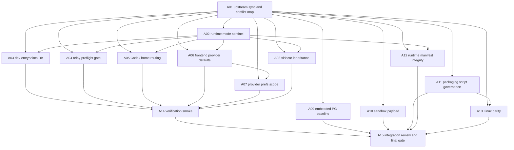

# package-embedded-pg P0 15-Agent DAG Plan

> **For agentic workers:** 本目录是 `package-embedded-pg` worktree 的 P0 DAG 拆分计划。执行前必须使用 TDD：先写红测并确认失败，再实现最小修复，最后跑绿测。所有子代理必须在自己的节点范围内工作，不得顺手重构或覆盖其他节点文件。

**Goal:** 先把落后 `origin/main` 的 worktree 安全同步并解决冲突，再解耦 `packaged app`、`dev/run-debug`、`sidecar/mcp` 三类运行模式，保留 macOS clean VM DMG 已验证可启动的 packaged 能力。

**Architecture:** `RuntimeMode` / runtime capabilities 是单一事实源。A02 负责输出 backend runtime capabilities contract；A06 只能消费该 contract，不能自行定义或推断 capabilities。开发入口显式进入 dev 并使用本机 PG/Codex/Claude；packaged-only relay、embedded PostgreSQL、bundled runtime、runtime manifest 只能在有效 packaged sentinel 后生效；sidecar 只继承 owner 传入的模式和资源路径。

**Source plan:** `docs/superpowers/plans/2026-05-29-package-embedded-pg-run-debug-compat-fix-plan.md`

**Current worktree observation:** `codex/package-embedded-pg` 当前 HEAD 是 `1af5b6ba637a5752c4e9dd3b5e27aff421e7174e`，`origin/main` 是 `bdf43d3cf3ce69fcae5454cd7137bc7b828be4d8`，`HEAD...origin/main` 为 `0	94`，说明本分支落后 94 个提交且当前没有领先提交。工作区存在大量未提交改动和新增文件，因此不能直接 `pull` 覆盖；必须先做变更归属盘点和安全快照。

---

## P0 问题总表

1. **上游同步风险：** worktree 落后 `origin/main` 94 个提交，且有大量未提交改动；直接 merge/rebase 会把冲突、已有打包改动、上游 React 19 前端迁移等混在一起。
2. **开发/打包边界污染：** packaged 默认被下沉成全局默认，破坏 `dev/run-debug` 使用本机 PG、Codex、Claude 的能力。
3. **dev DB DSN 丢失：** `run-debug` preflight 使用默认 DSN 检查，但没有把同一 DSN 导出给后端，后端可能以空 DSN fail-fast。
4. **relay preflight 误伤 dev：** desktop preflight 无条件校验 packaged relay env，`.env` 残留变量会阻断开发启动。
5. **Codex home 默认错误：** 空 `codexHome` 可能被后端解释为 app-managed home，绕过开发者已有 `~/.codex`。
6. **前端 provider 默认错误：** 缺省偏好时注入 `super-dolphin-relay`，导致 dev 使用 packaged provider。
7. **provider prefs scope 不一致：** active provider 可从 global fallback，但 provider 细节只读 project，project 空值可能吞掉 global 本机配置。
8. **runtime sentinel 过弱：** 仅凭 `.app/Contents/MacOS` 或 package 路径形态判定 packaged，debug `.app` 会被强制要求 bundled artifacts。
9. **sidecar 自行 auto-detect：** `mcp-orch` / `mcp-lsp` / `mcp-ida` 作为子进程时仍可能自行猜 packaged，破坏 owner 边界。
10. **embedded PG baseline 半损坏：** baseline 探测、SQL 读取、执行或 marker 写入缺乏原子性，可能把未执行 baseline 标记为 applied。
11. **Codex sandbox 默认覆盖：** undefined sandbox 被前端转成 `workspace-write`，且 writable roots/network access 细节可能丢失。
12. **packaging script 治理不足：** release 脚本不得硬编码私人 URL、`/Users/ai`、交互输入 key 或依赖打包机固定路径。
13. **runtime manifest 完整性不足：** packaged manifest、LSP/Codex/embedded PG 资源、digest、权限、路径归属需要继续 fail-fast 校验。
14. **macOS/Linux 打包路径不同步：** 脚本修复必须同步 macOS 和 Linux，不能只修一边。
15. **最终验证缺口：** 合并前必须覆盖 Go、scripts、frontend、release smoke、codemap，并检查 baseline diff 和未覆盖 diff。

---

## DAG



## 执行路径分层

- **P0-core dev/run-debug 解耦路径：** A01 → A02 → A03/A04/A05/A06/A07/A08 → A14。该路径用于判定开发入口是否已恢复本机 PG/Codex/Claude 能力，不被 A10 或 A13 阻塞。
- **Release/final-gate 路径：** A09/A11/A12/A13 与 A14 汇总到 A15，用于 packaged 完整性、script governance、Linux parity 和最终 merge/release readiness。
- **A10 状态：** A10 默认是 post-core payload cleanup；只有证明 sandbox 默认会重新触发 packaged relay/app-managed home 污染时，才升级为 P0-core blocker。无论是否升级，A15 必须记录 A10 是已完成、已验证不阻塞，还是显式延后。
- **A13 状态：** A13 不阻塞 P0-core dev 解耦验收；若本次要声明 merge/release ready，则必须通过 Linux parity gate 或在 A15 明确 Linux release out-of-scope。

## 15 个 Agent 节点

| Agent | 计划文件 | 目标 | 依赖 |
| --- | --- | --- | --- |
| A01 | `01-upstream-sync-conflict-map.md` | 安全同步 `origin/main` 并形成冲突处理清单 | 无 |
| A02 | `02-runtime-mode-sentinel.md` | 建立 `RuntimeMode` / packaged sentinel 单一判定源 | A01 |
| A03 | `03-dev-entrypoints-db-dsn.md` | 修复 `run-debug.sh` / `run-debug.ps1` / Makefile dev mode 与 DSN | A01, A02 |
| A04 | `04-relay-preflight-gating.md` | relay/bootstrap preflight 只在 packaged 或显式 app-managed 路径生效 | A01, A02 |
| A05 | `05-codex-home-routing.md` | dev 空 home 使用本机 Codex CLI/auth，packaged 才启用 app-managed home | A01, A02 |
| A06 | `06-frontend-provider-defaults.md` | 前端不再默认注入 `super-dolphin-relay`，只消费 A02 输出的 runtime capabilities contract | A01, A02 |
| A07 | `07-provider-prefs-scope.md` | 修复 global/project provider prefs fallback 一致性 | A01, A06 |
| A08 | `08-sidecar-runtime-inheritance.md` | sidecar 只继承 owner 传入的 mode/resource env | A01, A02 |
| A09 | `09-embedded-pg-baseline-atomicity.md` | baseline migration 与 marker 写入原子化 | A01 |
| A10 | `10-codex-sandbox-payload.md` | undefined sandbox 不发送，保留 writable roots/network access 语义；默认不阻塞 P0-core，除非证明会触发 packaged 污染 | A01 |
| A11 | `11-packaging-script-governance.md` | macOS/Linux release scripts 去私人 URL/key/path，显式 env/profile | A01 |
| A12 | `12-runtime-manifest-integrity.md` | packaged runtime manifest 与资源完整性 fail-fast | A01, A02 |
| A13 | `13-linux-packaging-parity.md` | Linux package verifier / guard 与 macOS 同步；不阻塞 P0-core dev 解耦，阻塞 release/merge readiness 除非显式 out-of-scope | A01, A11 |
| A14 | `14-verification-smoke-matrix.md` | 汇总 P0-core dev 解耦验证，并记录 release gate 是否进入最终门禁 | A03-A08 |
| A15 | `15-integration-review-final-gate.md` | 最终 diff、baseline、codemap、release gate 审查 | A09-A14 |

## 全局执行规则

- A01 完成前不得修改功能代码；A01 只做同步、冲突清单和安全检查。
- A02 是架构边界节点，A03/A04/A05/A06/A08/A12 必须消费它的结果，不能自行重新发明 runtime 判定或 capabilities contract。
- 所有 P0/P1 修复必须有同提交红测；先运行红测确认失败，再实现。
- 打包/验证脚本改动必须同步 macOS 和 Linux 路径。
- 任一 guard、TDD 红测、macOS clean VM packaged 启动路径回归，整个 DAG 不得标记完成。

## 合入门槛

节点内 targeted test 只作为红/绿内循环证据；合入门槛必须覆盖完整 changed surface。前端节点的 targeted vitest 不能替代完整 frontend gate。

```bash
./scripts/test_with_guard.sh ./internal/app ./internal/platform/config ./internal/platform/db ./internal/platform/embeddedpg ./internal/platform/runtimeenv ./internal/provider/codexapp ./internal/provider/shared ./internal/module/thread ./internal/module/uistate -count=1
./scripts/test_with_guard.sh ./cmd/agent-terminal ./cmd/mcp-orch ./cmd/mcp-lsp ./cmd/mcp-ida -count=1
./scripts/test_with_guard.sh ./scripts -count=1
bash -n run-debug.sh scripts/package_*.sh scripts/prepare_lsp_bundle_*.sh scripts/build_relocatable_postgres_macos.sh scripts/verify_packaged_app_macos.sh
if [ -f scripts/verify_packaged_app_linux.sh ]; then bash -n scripts/verify_packaged_app_linux.sh; fi
cd cmd/agent-terminal/frontend && node scripts/size-guard.cjs && npx vitest run && npm run build
make codemap-check
```

若 Go 改动跨 `cmd/` 与 `internal/`、触及共享 runtime/provider/config surface，或无法用 affected packages 精确界定，必须补跑 broad Go gate：

```bash
make test
make build-plain
```

合入前必须检查并报告 baseline diff；如 `internal/archtest/baseline.json` 或 guard 规则有改动，必须跑 archtest gate，且不得无审批 freeze baseline：

```bash
git diff -- internal/archtest/baseline.json
./scripts/test_with_guard.sh ./internal/archtest -count=1
```

Release smoke 是 hard gate，必须按实际产物运行并在报告中记录证据。macOS smoke 跳过或缺少产物表示 Not ready to merge/release；Linux 若显式 out-of-scope，可允许 P0-core dev handoff，但必须在 A15 标记 Linux release readiness 为 Deferred/Not ready，不能声明完整 release ready：

```bash
scripts/package_macos.sh
scripts/verify_packaged_app_macos.sh <path-to-built-app>
scripts/package_linux.sh
```
