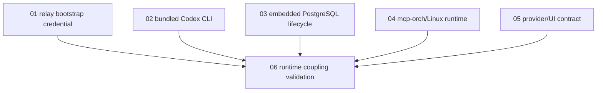

# package-embedded-pg 修复 DAG 计划索引

来源评审：`docs/reviews/package-embedded-pg-review-2026-05-28.md`

本目录把评审问题拆成 6 个可并行/分阶段执行的 DAG 计划：

1. `01-relay-bootstrap-credential.md` — relay 随包凭据安全属性与开箱即用配置。
2. `02-bundled-codex-cli.md` — Codex CLI 随包内置、校验与安全 fallback。
3. `03-embedded-postgres-lifecycle.md` — embedded PostgreSQL 权限、ownership、失败清理。
4. `04-mcp-orch-linux-runtime.md` — mcp-orch DB/schema fail-fast 与 Linux model registry。
5. `05-provider-ui-contract.md` — Codex provider identity、model/effort 默认值、错误分类。
6. `06-runtime-coupling-validation.md` — runtime manifest/契约收敛、端到端验证与未覆盖 diff 评审。

## 全局执行顺序

## 合入门槛

- P0：`01`、`02` 必须先关闭。
- P1：`03`、`04` 在目标平台 release scope 内必须关闭。
- P2：`05` 至少需要 owner、测试和明确验收；`06` 是 release gate，必须在合入/发布前完成最终验证闭环和未覆盖 diff 风险清单。
