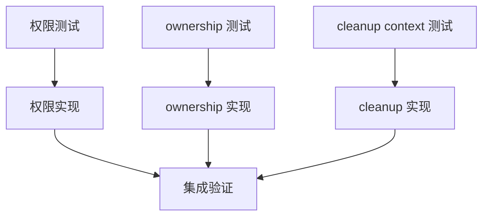

# DAG 03: Embedded PostgreSQL Lifecycle Plan

> **For agentic workers:** 使用子代理驱动开发或执行计划逐节点执行。优先写失败测试锁定每个生命周期 bug。

**Goal:** 修复 embedded PostgreSQL 的目录权限、进程 ownership、失败清理和重复实例问题。

**Architecture:** embeddedpg runtime 负责启动前安全校验和 ownership 判定；DB lifecycle 只停止当前进程拥有的实例；失败清理使用独立 shutdown context。

**Tech Stack:** Go, fx lifecycle, pg_ctl, filesystem permission tests.

---

## 覆盖评审项

- P1-1：目录权限未校验。
- P1-2：第二实例会停止第一实例 DB。
- P2-1：启动失败清理复用已取消 context。

## DAG



## Node A: 权限测试

**Files:**
- Modify: `internal/platform/embeddedpg/runtime_test.go`
- Modify: `internal/platform/db/embedded_postgres_lifecycle_test.go`

- [ ] 新增测试：预先创建 `RuntimeDir` 为 `0755`，`Start` 必须 fail-fast 或修正为 private。
- [ ] 新增测试：`cfg.DataDir` 本身已存在且为 `0755`/`0770` 时 fail-fast 或修正为 private。
- [ ] 新增测试：data parent、runtime dir、log parent 目录权限过宽时 fail-fast。

**验证命令:**

```bash
go test ./internal/platform/embeddedpg -run 'Permission|RuntimeDir' -count=1
```

Expected: 新测试先失败。

## Node B: 权限实现

**Files:**
- Modify: `internal/platform/embeddedpg/runtime.go`

- [ ] 创建目录后检查 `mode&0o077 == 0`。
- [ ] 对既有目录不静默接受过宽权限。
- [ ] 初始化后校验 `cfg.DataDir`、`RuntimeDir`、log parent，错误包含具体路径和 mode。

**验证命令:**

```bash
./scripts/test_with_guard.sh ./internal/platform/embeddedpg -count=1
```

## Node C: ownership 测试

**Files:**
- Modify: `internal/platform/embeddedpg/runtime_test.go`
- Modify: `internal/platform/db/embedded_postgres_lifecycle_test.go`

- [ ] 模拟 `Start` 发现已有 postgres 运行，返回本次启动 ownership 结果或明确错误。
- [ ] DB lifecycle 使用本次启动的 `Owned` 结果，而不是静态 `cfg.Owner`，决定是否调用 `Stop`。
- [ ] 如果产品决定单实例 fail-fast，则测试应断言第二实例启动失败且不会 stop 已有实例。

## Node D: ownership 实现

**Files:**
- Modify: `internal/platform/embeddedpg/runtime.go`
- Modify: `internal/platform/db/module.go`
- Modify: `internal/contract/config.go` if ownership state must be represented

- [ ] `embeddedpg.Start` 返回 `StartResult{Started, Owned}`，或在已有实例时 fail-fast。
- [ ] 不复用/覆盖静态 `EmbeddedPostgresConfig.Owner` 表示“本次启动拥有 DB”。
- [ ] `registerLifecycle` 只在当前进程拥有实例时 stop。
- [ ] shutdown 和 startup failure 使用相同 ownership 判断。

## Node E: cleanup context 测试

**Files:**
- Modify: `internal/platform/db/embedded_postgres_lifecycle_test.go`

- [ ] 新增测试：startup ctx canceled 后触发 `failAfterEmbeddedStart`，仍会用非 canceled context 调用 stop。
- [ ] 测试 stop 超时使用 shutdown timeout，而不是 startup ctx。

## Node F: cleanup 实现

**Files:**
- Modify: `internal/platform/db/module.go`

- [ ] `failAfterEmbeddedStart` 用 `context.WithoutCancel(ctx)` 派生 stop context。
- [ ] stop context 使用 `platformconfig.ShutdownTimeout`。
- [ ] `OnStop` 保持 shutdown context，不复用 startup context。

## Node G: 集成验证

**验证命令:**

```bash
./scripts/test_with_guard.sh ./internal/platform/embeddedpg ./internal/platform/db -count=1
```

**最终验收:** 权限过宽 fail-fast；重复实例不会互相 stop；启动失败清理可靠执行。
