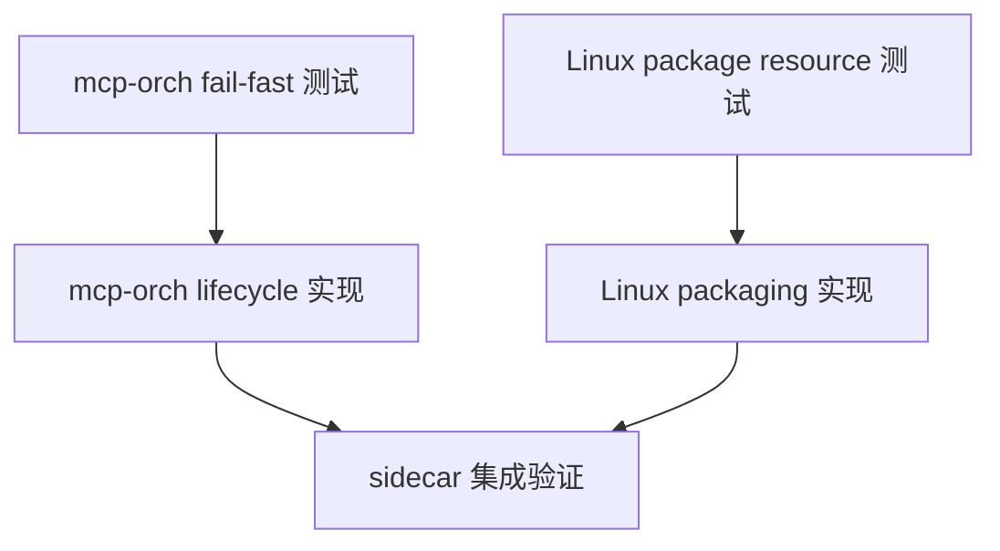

# DAG 04: MCP Orch and Linux Runtime Plan

> **For agentic workers:** 使用子代理驱动开发或执行计划逐节点执行。该计划处理 packaged sidecar 启动可靠性。

**Goal:** mcp-orch 在启动阶段 fail-fast 校验 DB/schema，Linux 包包含 model registry 并能启动 sidecar。

**Architecture:** sidecar 不负责启动 embedded PostgreSQL，但必须在 OnStart 校验 DB 可连接和 schema 可用。Linux packaging 必须复制 runtime 必需资源并设置对应 env。

**Tech Stack:** Go fx lifecycle, pgxpool, mcp-orch, shell packaging.

---

## 覆盖评审项

- P1-3：`mcp-orch` 缺少 DB/schema OnStart fail-fast。
- P1-4：Linux 包缺少 model registry。

## DAG



## Node A: mcp-orch fail-fast 测试

**Files:**
- Modify: `cmd/mcp-orch/runtime_test.go`

- [ ] 测试 DB 不可连接时 fx app Start 失败。
- [ ] 测试 schema 缺失时 fx app Start 失败且错误不是首次 tool call 才出现。
- [ ] 测试 `schema_migrations` 低于 `MinRequiredSchemaVersion` 时 fail-fast。
- [ ] 测试已有正常 DB/schema 时 Start 成功。

**验证命令:**

```bash
go test ./cmd/mcp-orch -run 'FailFast|Schema|Pool' -count=1
```

Expected: 新测试先失败。

## Node B: mcp-orch lifecycle 实现

**Files:**
- Modify: `cmd/mcp-orch/runtime.go`
- Modify: `cmd/mcp-orch/fx.go` if lifecycle wiring changes

- [ ] OnStart 执行 `pool.Ping(ctx)`。
- [ ] OnStart 校验 schema version；不要只检查关键表存在。
- [ ] 优先复用或导出 `platformdb.VerifyMinSchemaVersion(ctx, q)`，避免 mcp-orch 自己维护漂移的弱校验。
- [ ] 保留 OnStop close pool。
- [ ] 错误信息明确是 DB/schema 问题，不伪装成 LSP unavailable。

## Node C: Linux package resource 测试

**Files:**
- Create or Modify: `scripts/package_linux_guard_test.go`

- [ ] 测试 Linux script 包含复制 `cmd/mcp-orch/tools/modelregistry/models.yaml`。
- [ ] 测试 generated `run.sh` 设置 `SUPER_DOLPHIN_MODEL_REGISTRY`。
- [ ] 测试缺失 registry 文件时 packaging fail-fast。

## Node D: Linux packaging 实现

**Files:**
- Modify: `scripts/package_linux.sh`
- Modify: `internal/contract/manifest.go`
- Test: manifest passthrough tests if present

- [ ] 复制 `models.yaml` 到 package root 或 resources。
- [ ] `run.sh` export `SUPER_DOLPHIN_MODEL_REGISTRY="$here/models.yaml"`。
- [ ] MCP manifest/env passthrough 包含 `SUPER_DOLPHIN_MODEL_REGISTRY`，确保 sidecar 不是由 shell `run.sh` 启动时也能继承。
- [ ] Linux package guard 同时断言复制 `models.yaml`、`run.sh` export、manifest env passthrough。
- [ ] 与 macOS packaging 的 model registry 行为保持一致。

## Node E: sidecar 集成验证

**验证命令:**

```bash
./scripts/test_with_guard.sh ./cmd/mcp-orch/... -count=1
go test ./scripts -run 'PackageLinux|PackageMacOS|VerifyPackagedApp' -count=1
```

**最终验收:** Linux 解包运行时 mcp-orch 能找到 model registry；DB/schema 错误在 sidecar start 阶段 fail-fast。
