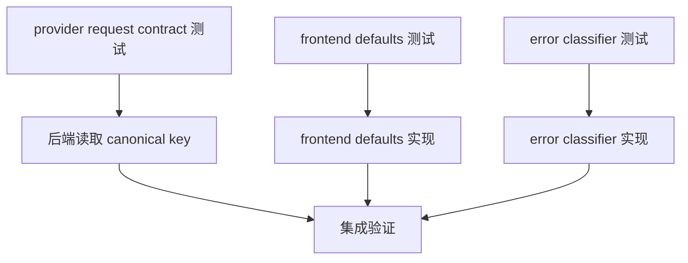

# DAG 05: Provider UI Contract Plan

> **For agentic workers:** 使用子代理驱动开发或执行计划逐节点执行。先锁定 payload/contract 测试，再改实现。

**Goal:** 收敛 Codex provider identity、model/effort 默认值和错误分类契约，减少 frontend/backend 不一致。

**Architecture:** 前端只发送用户明确选择和稳定 contract 字段；默认 model/effort 由后端/provider contract 补齐，或由前端消费后端返回的 defaults contract，不能在 UI 层硬编码 packaged 默认值。错误分类保留 DB/schema/task invalid input 的可诊断 code。

**Tech Stack:** Vue buildless frontend, Go provider adapter, MCP tool error envelope.

---

## 覆盖评审项

- P2-2：thread start 未读取 canonical `codexModelProvider`。
- P2-4：DB/schema 错误误报为 LSP unavailable。
- P2-5：新安装无 model/effort 默认值。

## DAG



## Node A: provider request contract 测试

**Files:**
- Modify: `internal/provider/codexapp/dream_executor_test.go` or `internal/provider/codexapp/driver_session_test.go`
- Modify: `internal/provider/codexapp/support.go` tests if existing

- [ ] 构造 config 只包含 `codexModelProvider`。
- [ ] 断言 `threadStartParams.ModelProvider` 非空且等于该值。
- [ ] 保留 legacy `modelProvider` 兼容测试。

## Node B: 后端读取 canonical key

**Files:**
- Modify: `internal/provider/codexapp/support.go`

- [ ] `buildThreadStartParams` 先读 `contract.CodexModelProviderKey`。
- [ ] 再兼容 legacy `modelProvider` / `model_provider`。
- [ ] 保持空值 fail-fast 或明确 fallback。

**验证命令:**

```bash
./scripts/test_with_guard.sh ./internal/provider/codexapp -count=1
```

## Node C: frontend defaults 测试

**Files:**
- Modify: `cmd/agent-terminal/frontend/vue-app/thread-store-provider-preference.test.js`
- Modify: `cmd/agent-terminal/frontend/vue-app/thread-store.actions.test.js`

- [ ] 测试只有 `settings.provider.active=codex` 且无用户 model/effort 偏好时，前端不硬编码 `gpt-5.5/xhigh`；后端/provider request 使用 contract 默认值，或前端使用后端返回的 defaults contract。
- [ ] 测试用户设置的 model/effort 覆盖 contract 默认值。
- [ ] 测试非 Codex provider 不被 Codex defaults 污染。
- [ ] 测试无 `codexHome` 偏好时 payload 不带 `codexHome`，保留 `thread-store-codex-default-home.test.js` 的行为。

## Node D: frontend defaults 实现

**Files:**
- Modify: `cmd/agent-terminal/frontend/vue-app/stores/thread-actions-helpers.js`
- Modify: `cmd/agent-terminal/frontend/vue-app/provider-config-options.js` if needed

- [ ] 若选择“后端负责默认值”，前端无用户偏好时不发送 model/effort；若选择“前端消费 defaults contract”，前端只使用后端返回的稳定 defaults，不硬编码 packaged 默认值。
- [ ] 日志中区分 pref 值、contract default 值和 payload 值。
- [ ] 不重新引入已删除的 false finding：仍不发送空 `codexHome`。

## Node E: error classifier 测试

**Files:**
- Modify: `internal/mcpserver/common/tool_error_envelope_test.go`

- [ ] `relation "task_dags" does not exist` 分类为 DB/schema code。
- [ ] invalid transition/input 分类为 invalid input code。
- [ ] 真正 LSP 启动中错误仍分类为 `lsp_unavailable`。

## Node F: error classifier 实现

**Files:**
- Modify: `internal/mcpserver/common/tool_error_envelope.go`

- [ ] 恢复或新增 DB schema classifier。
- [ ] 恢复或新增 task invalid input classifier。
- [ ] 默认 fallback 不把非 LSP 错误都标为 retryable LSP unavailable。

## Node G: 集成验证

**验证命令:**

```bash
./scripts/test_with_guard.sh ./internal/provider/codexapp ./internal/mcpserver/common -count=1
cd cmd/agent-terminal/frontend
node scripts/size-guard.cjs
npx vitest run thread-store-provider-preference.test.js thread-store.actions.test.js thread-store-codex-default-home.test.js
```

**最终验收:** provider identity 与默认值跨前后端一致；DB/schema 错误可诊断。
