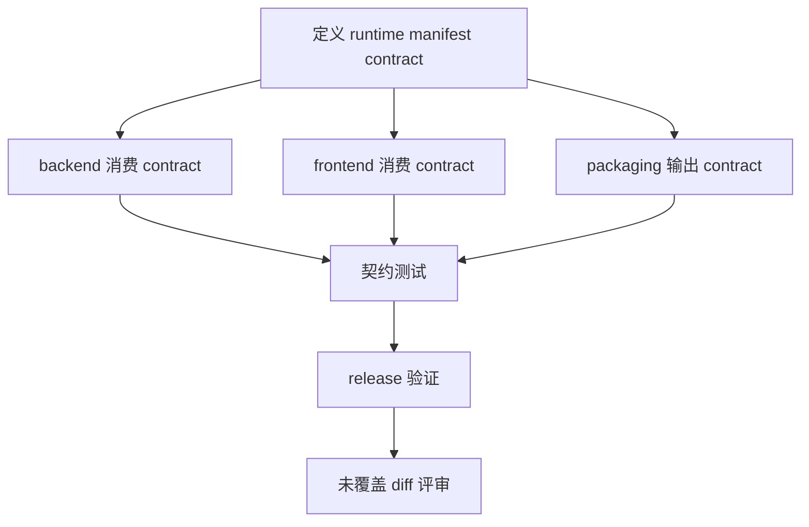

# DAG 06: Runtime Coupling and Release Validation Plan

> **For agentic workers:** 使用子代理驱动开发或执行计划逐节点执行。本计划在 DAG 01-05 后收口。

**Goal:** 收敛业务启动/UI 与打包 runtime 的契约边界，并完成最终发布验证与未覆盖 diff 评审。

**Architecture:** 先做最小 packaged runtime contract：资源路径解析、package guard、MCP env passthrough 和最终验证。relay 凭据安全属性由 DAG 01 负责，Codex checksum/signature 由 DAG 02 负责，frontend/provider defaults 由 DAG 05 负责；本计划只做收口和防漂移。

**Tech Stack:** Go config/runtimeenv, Vue frontend, shell packaging, docs/reviews.

---

## 覆盖评审项

- P2-6：业务启动和线程启动逻辑与打包/Codex 基础设施耦合偏高。
- 评审范围限制：当前文档不是完整 worktree diff 合并评审。
- 最终验证状态：frontend/build/package smoke 未完成。

## DAG



## Node A: 定义 runtime manifest contract

**Files:**
- Modify or Create: `internal/platform/runtimeenv/manifest.go`
- Modify: `internal/contract/config.go` if public DTO needed
- Test: `internal/platform/runtimeenv/*_test.go`

- [ ] 定义最小 packaged runtime contract 字段：bundled Codex path、model registry path、embedded PostgreSQL resource path、MCP env passthrough。
- [ ] 不在本计划重新定义 relay token 权限或 Codex checksum 规则；引用 DAG 01/02 的输出。
- [ ] contract 缺关键资源路径时 fail-fast。

## Node B: backend 消费 contract

**Files:**
- Modify: `internal/app/app.go`
- Modify: `internal/platform/config/config.go`
- Modify: `internal/provider/codexapp/codex_autoinstall.go`

- [ ] desktop preflight 从 runtime contract 读取 packaged resource path，不直接拼资源路径。
- [ ] provider bootstrap 使用 contract 中的 bundled Codex path。
- [ ] config.New 不把打包资源解析散落到业务模块。

## Node C: frontend 消费 contract

**Files:**
- Modify: `cmd/agent-terminal/frontend/vue-app/stores/thread-actions-helpers.js`
- Modify: `cmd/agent-terminal/frontend/vue-app/provider-config-options.js`
- Test: `cmd/agent-terminal/frontend/vue-app/thread-store-provider-preference.test.js`

- [ ] 前端只传用户 override 和 provider 选择。
- [ ] packaged defaults 从后端返回或稳定 contract 注入。
- [ ] 不在 UI 层硬编码打包资源路径或 app-managed home。

## Node D: packaging 输出 contract

**Files:**
- Modify: `scripts/package_macos.sh`
- Modify: `scripts/package_linux.sh`
- Test: `scripts/package_macos_guard_test.go`
- Test: `scripts/package_linux_guard_test.go`

- [ ] packaging 生成或更新 runtime contract/manifest 文件。
- [ ] contract 包含 bundled Codex path、model registry path、embedded PG resource path、MCP env passthrough。
- [ ] packaging guard test 校验关键字段；Codex digest/signature 仍由 DAG 02 校验。

## Node E: 契约测试

**Files:**
- Test: `internal/app/desktop_preflight_test.go`
- Test: `internal/platform/runtimeenv/*_test.go`
- Test: frontend thread-store tests

- [ ] 覆盖 app bootstrap、frontend start payload、provider request 三者边界。
- [ ] 测试 manifest 缺失字段时 fail-fast。
- [ ] 测试用户 override 不破坏 packaged defaults。

## Node F: release 验证

**Commands:**

```bash
./scripts/test_with_guard.sh ./internal/app ./internal/platform/runtimeenv ./internal/provider/codexapp ./internal/platform/embeddedpg ./internal/platform/db ./cmd/mcp-orch/... -count=1
go test ./scripts -run 'PackageLinux|PackageMacOS|VerifyPackagedApp' -count=1
cd cmd/agent-terminal/frontend
node scripts/size-guard.cjs
npx vitest run
npm run build
```

- [ ] macOS packaged app smoke：构建 DMG/app 后断言资源内存在 `bin/codex`、`models.yaml`、embedded PG bundle；断网环境启动后 Codex 可用。
- [ ] Linux packaged smoke：若 Linux 属于本次 release scope，构建 tarball 后断言 `bin/codex`、`models.yaml` 和 `SUPER_DOLPHIN_MODEL_REGISTRY` 可用，mcp-orch 可启动；若 Linux 不在 scope，必须在 release notes 中显式 out-of-scope。
- [ ] embedded PostgreSQL smoke：首启、失败清理、重复实例、权限预置。

## Node G: 未覆盖 diff 评审

**Commands:**

```bash
git diff --name-only origin/main...HEAD
```

**Files:**
- Modify: `docs/reviews/package-embedded-pg-review-2026-05-28.md` or create follow-up review

- [ ] 产出“已覆盖 / 未覆盖 / 新增 P0/P1”清单。
- [ ] 列出不在 01-06 范围内的改动文件。
- [ ] 对非打包主题改动另做 code review，避免用本目录计划替代全量合并评审。
- [ ] 若发现新的 P0/P1，创建追加计划或更新本目录索引。

**最终验收:** 01-05 的功能修复闭环，且 06 完成契约收敛、release 验证和全量 diff 风险声明。
