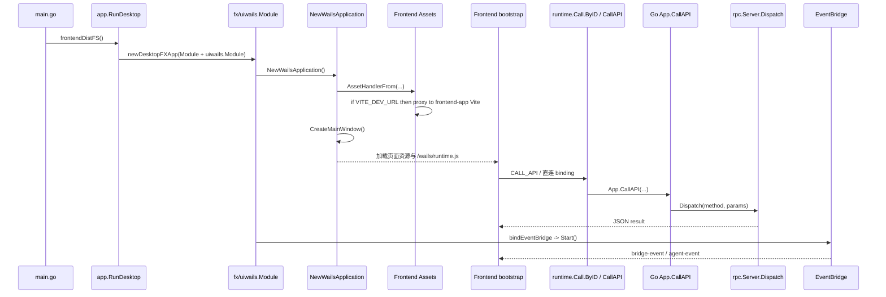
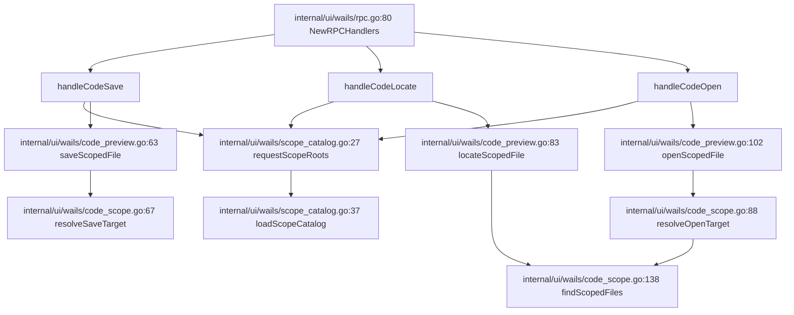
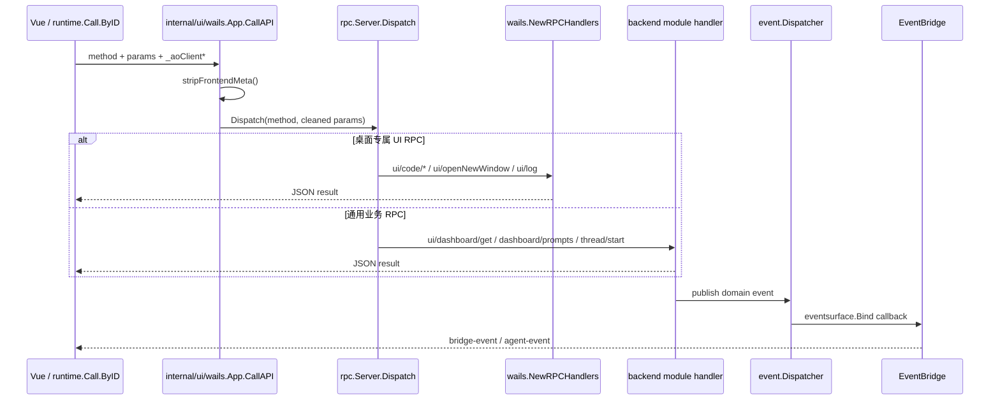

# super-agent-v3 代码地图：终端入口与 UI 层（Go / Wails）

> 2026-04-24 debt banner / authoritative pointer：本卷描述 `internal/ui/wails` 的稳定职责与装配结构，不再是 ui/wails 依赖方向 / hidden contract 的权威记录。`ui/wails` → `module/uistate` 直连、`NewActiveAgentCounter` 按 agent state 负面枚举等 debt 的 authoritative 入口是 [`docs/plans/迁移/p22/README.md`](../../plans/迁移/p22/README.md) 与 [`docs/plans/迁移/p22/P4_DependencyDirectionAndHiddenContracts.md`](../../plans/迁移/p22/P4_DependencyDirectionAndHiddenContracts.md)。若本卷与 P22/P4 冲突，以后者为准。

## 1. 阅读边界

- **本卷范围**：`cmd/agent-terminal/*.go`、`internal/ui/wails/*.go`，以及最少量 caller：`internal/app/app.go`、`internal/app/runner.go`。
- **本卷目标**：把 Go 桌面端 / Wails 运行时 / 内置 RPC / 多窗口与代码预览链路整理成可直接派单的后端地图。
- **明确不展开**：当前 `frontend-app/src/**` 的页面、store、快捷键注入由 React 新 UI 分卷负责；legacy `cmd/agent-terminal/frontend/vue-app/**` 由 Vue 分卷负责。
- **关键边界**：Go/Wails 层只负责窗口壳、事件面、原生能力与 RPC 入口；前端快捷键属于页面层，不在 Go 侧注册系统级 shortcut。
- **维护提示**：本卷只维护 Go/Wails transport 与桌面原生能力；`app.Module` 模块清单、`internal/contract` 与 module-local narrow port 真值看 [04-app-contract.md](04-app-contract.md)。

## 2. Go 桌面端层次图

```mermaid
graph TD
    A[cmd/agent-terminal/main.go:11 main] --> B[cmd/agent-terminal/frontend.go:15 frontendDistFS]
    B --> C[internal/app/app.go:105 RunDesktop]
    C --> D[internal/ui/wails/module.go:18 uiwails.Module]
    D --> E[internal/ui/wails/assets.go:34 AssetHandlerFrom]
    D --> F[internal/ui/wails/module.go:101 NewWailsApplication]
    D --> G[internal/ui/wails/rpc.go:80 NewRPCHandlers]
    D --> H[internal/ui/wails/lifecycle.go:56 NewWailsLifecycle]
    D --> I[internal/ui/wails/bridge.go:24 NewEventBridge]
    D --> J[internal/ui/wails/http_server.go:35 NewHTTPAssetServer]
    F --> K[internal/ui/wails/binding.go:20 App binding]
    F --> L[internal/ui/wails/window.go:14 CreateMainWindow]
    G --> M[internal/ui/wails/scope_catalog.go:27 requestScopeRoots]
    G --> N[internal/ui/wails/binding_native.go:16 SaveClipboardImage]
    G --> O[internal/ui/wails/window_state.go:90 consumeWindowBootstrapSnapshot]
    M --> P[internal/ui/wails/code_scope.go:67 resolveSaveTarget]
    M --> Q[internal/ui/wails/code_scope.go:138 findScopedFiles]
    Q --> R[internal/ui/wails/code_preview.go:102 openScopedFile]
    I --> S[bridge-event / agent-event]
    H --> T[app-will-quit]
    J --> U[/wails/ws + HTTP assets]
```

## 3. 时序图：Wails 启动 → RPC 接入 → 前端加载



## 4. 子模块拆解（文件地图 + 关键类型 + 关键流程）

### 4.1 桌面入口与前端资源注入

#### 文件地图
- `cmd/agent-terminal/main.go:11`：桌面可执行入口，只做 `app.RunDesktop(frontendDistFS())`。
- `run-new-ui-desktop.sh:6,353-358`：当前新 UI 开发入口；先启动 `frontend-app` Vite，再以 `VITE_DEV_URL` 运行 `cmd/agent-terminal`。
- `cmd/agent-terminal/frontend.go:15`：legacy/package-embed 路径；从 `cmd/agent-terminal/frontend/dist` embed 子目录导出 `fs.FS`。
- `internal/app/app.go:105`：桌面模式总入口；向 Fx 注入 `FrontendFS` 并 `Populate(&wailsApp, &lifecycle)`。
- `internal/ui/wails/assets.go:34`：资源服务选择器；`VITE_DEV_URL` dev proxy / 注入 FS / placeholder 三路回退。当前新 UI dev 通过 dev proxy 指向 `frontend-app`。

#### 关键类型
- `internal/ui/wails/assets.go:18` `FrontendFS`：入口层传给 Wails 资产服务的 `fs.FS` 包装。
- `internal/ui/wails/module.go:92` `httpAssetServerParams`：HTTP 调试模式复用同一份前端资源输入。

#### 关键流程
1. 当前新 UI dev 由 `run-new-ui-desktop.sh` 启动：`frontend-app` 提供 Vite 页面，`cmd/agent-terminal` 仍提供 Wails/HTTP/RPC 宿主。
2. `cmd/agent-terminal/main.go:11` 进入 `app.RunDesktop(frontendDistFS())`；入口本身不持有业务状态。
3. legacy/package-embed 路径由 `cmd/agent-terminal/frontend.go:15` 用 `fs.Sub(frontendDist, "frontend/dist")` 把 embed 根裁成前端产物目录。
4. `internal/app/app.go:105` 通过 `fx.Supply(uiwails.FrontendFS{FS: frontendFS})` 把资源文件系统注入 `uiwails.Module`，并在启动后直接调用 `wailsApp.Run()`。
5. `internal/ui/wails/assets.go:34` 按顺序选择：`VITE_DEV_URL` 反代 → 注入的 dist FS → `frontend/index.html` placeholder。
6. `AssetHandlerFrom` 的生产 consumer 有两处：`internal/ui/wails/module.go:116`（桌面 Wails 壳）和 `internal/ui/wails/http_server.go:36`（浏览器调试 HTTP 服务）。

### 4.2 Wails App 装配与主窗口创建

#### 文件地图
- `internal/ui/wails/module.go:18`：`uiwails.Module` 的 Provide / Invoke 装配面。
- `internal/ui/wails/module.go:101`：构造 `application.App`，绑定退出钩子、事件 emitter、主窗口。
- `internal/ui/wails/binding.go:20`：Wails 暴露对象 `App`，持有 `dispatch`、窗口组与 bootstrap 状态。
- `internal/ui/wails/window.go:14`：主窗口 / 新窗口创建、文件拖拽事件绑定、URL query 拼装。

#### 关键类型
- `internal/ui/wails/binding.go:20` `App`：Go 侧统一 binding；既是 RPC 入口，也是多窗口状态容器。
- `internal/ui/wails/module.go:76` `applicationParams`：Wails 壳构造参数集合。

#### 关键流程
1. `internal/ui/wails/module.go:18` 统一提供 `NewApp`、`NewRPCHandlers`、`NewService`、`NewWailsLifecycle`、`NewEventBridge`、`NewWailsApplication`、`NewHTTPAssetServer`。
2. `internal/ui/wails/module.go:33` `NewApp` 只注入 `rpc.Server.Dispatch`、窗口标题和 debug 标志；业务能力不在这里拼装。
3. `internal/ui/wails/module.go:101` `NewWailsApplication` 创建 `application.App`，把 `ShouldQuit` / `OnShutdown` 接到 `WailsLifecycle`，再用 `internal/ui/wails/binding.go:121` `bindRuntime` 回填 `wailsApp` 和事件 emitter。
4. `internal/ui/wails/module.go:129` 监听 `events.Common.ApplicationStarted`，触发 `internal/ui/wails/lifecycle.go:90` `MarkFrontendReady()`；这决定了退出 overlay 是否可以真正落地到前端。
5. `internal/ui/wails/window.go:14` `CreateMainWindow` 只创建主窗口；后续子窗口走 `internal/ui/wails/binding.go:93` `openNewWindow()`。
6. `internal/ui/wails/window.go:95` `windowURL` 会把 `ao_ui_bootstrap` / `ao_window_cwd` 注入 query string；Go 侧已写出，前端消费留给 Vue 分卷。

### 4.3 生命周期、Runner 与退出收口

#### 文件地图
- `internal/ui/wails/lifecycle.go:56`：退出状态机、overlay、backend shutdown、硬超时。
- `internal/ui/wails/module.go:52`：把 orchestration service 包装成 `ActiveAgentCounter`。
- `internal/app/runner.go:122`：统一启动 grouped runners，并在 runtime 异常退出时请求 Fx shutdown。
- `internal/app/app.go:210`：桌面路径单独 watch `app.Done()`，兜底调用 `NotifyBackendFailed()`。

#### 关键类型
- `internal/ui/wails/lifecycle.go:29` `ActiveAgentCounter`：退出前统计活跃 agent 的抽象。
- `internal/ui/wails/lifecycle.go:39` `WailsLifecycle`：退出拦截、事件发射、shutdown timer 的状态容器。
- `internal/app/runner.go:225` `runtimeParams`：runner group + lifecycle + shutdowner 的运行时依赖集合。

#### 关键流程
1. `internal/ui/wails/module.go:52` `NewActiveAgentCounter` 通过 `contract.OrchestrationService.ListAgents` 统计非 stopped/failed agent；退出是否弹 overlay 由它决定。
2. `internal/ui/wails/lifecycle.go:95` `ShouldQuit()` 首次拦截关闭事件：若有活跃 agent，则发 `app-will-quit` 并延迟 `requestBackendShutdown()`；否则直接请求 backend 关闭。
3. `internal/ui/wails/lifecycle.go:159` `requestBackendShutdown()` 只允许启动一次，同时 arm `shutdownHardDeadline` 定时器；超时后走 `NotifyBackendFailed()` 强退。
4. `internal/app/runner.go:122` `BindRuntime()` 启动 grouped runners；若 runner 异常退出，会在 `internal/app/runner.go:212` 调 `lifecycle.NotifyBackendFailed()`，再触发 Fx shutdown。
5. `internal/app/app.go:210` `watchFXShutdown()` 监听 `app.Done()`；一旦 Fx 提前结束，也会在 `internal/app/app.go:214` 调 `NotifyBackendFailed()`。

### 4.4 EventBridge：后端事件面到前端 runtime event

#### 文件地图
- `internal/ui/wails/bridge.go:24`：创建 bridge。
- `internal/ui/wails/bridge.go:35`：订阅 `event.Dispatcher`。
- `internal/ui/wails/bridge.go:66`：标准化通知并发往前端。
- `internal/ui/wails/module.go:156`：用 Fx lifecycle 驱动 bridge 的 Start/Stop。

#### 关键类型
- `internal/ui/wails/bridge.go:15` `EventBridge`：持有 `event.Dispatcher`、`WailsLifecycle` 和 cancel 列表。

#### 关键流程
1. `internal/ui/wails/module.go:156` `bindEventBridge()` 在 `OnStart` 调 `bridge.Start()`，在 `OnStop` 调 `bridge.Stop()`；`bridge.Start()` 的生产 caller 为 `internal/ui/wails/module.go:156`。
2. `internal/ui/wails/bridge.go:35` `Start()` 通过 `eventsurface.Bind(..., b.publish)` 订阅所有后端事件；重复启动会被 `cancels` 守卫挡住。
3. `internal/ui/wails/bridge.go:66` `publish()` 先做 `eventsurface.ExpandNotifications(...)`，再统一发 `bridge-event`。
4. `internal/ui/wails/bridge.go:81` `emitCompatAgentEvent()` 会从 payload 中抽 `threadId/agent_id`，额外补发 `agent-event`，兼容前端旧监听面。
5. 所有 runtime event 最终都经过 `internal/ui/wails/lifecycle.go:128` `EmitEvent()`，再由 Wails runtime 分发给前端。

### 4.5 内置 RPC 与原生 binding

#### 文件地图
- `internal/ui/wails/binding.go:38`：通用 `CallAPI` 桥。
- `internal/ui/wails/binding.go:159`：剥离 `_ao*` 前端元字段，避免 strict handler 因未知字段报错。
- `internal/ui/wails/rpc.go:80`：注册桌面专属 UI RPC。
- `internal/ui/wails/binding_native.go:16`：目录/文件选择、剪贴板文本、剪贴板图片等原生能力。

#### 关键类型
- `internal/ui/wails/rpc.go:18` `clientMetaParams`：前端注入的 `_aoClientKind/_aoClientRoute` 元字段模型。
- `internal/ui/wails/rpc.go:23` `scopeParams`：所有 scoped UI RPC 共享的 project/projects 参数模型。
- `internal/ui/wails/rpc.go:29` `codeSaveParams`、`internal/ui/wails/rpc.go:36` `codeLocateParams`、`internal/ui/wails/rpc.go:41` `codeOpenParams`、`internal/ui/wails/rpc.go:63` `openNewWindowParams`：内置 UI RPC 的 typed params。

#### 关键流程
1. **主 RPC 路径**：`internal/ui/wails/binding.go:38` `App.CallAPI()` 校验 method、补空 JSON、调用 `internal/ui/wails/binding.go:159` `stripFrontendMeta()`，再转发到 `rpc.Server.Dispatch`。
2. **兼容 binding**：`internal/ui/wails/binding.go:60` `LaunchAgent()` 仍把旧桌面入口映射到 `thread/start`；`internal/ui/wails/binding.go:69` `StopAgent()` 映射到 `thread/stop`；`internal/ui/wails/binding.go:76` `ListAgents()` 映射到 `agent.list`。
3. **UI RPC 注册**：`internal/ui/wails/rpc.go:80` `NewRPCHandlers()` 注册 `ui/code/*`、`ui/copyText`、`ui/log`、`ui/selectProjectDir(s)`、`ui/selectFiles`、`ui/windowBootstrap/get`、`ui/openNewWindow`。
4. **原生能力**：`internal/ui/wails/binding_native.go:16` `SaveClipboardImage()` 在 Go 侧直接解码 base64 并写临时 PNG；`internal/ui/wails/binding_native.go:83` `selectProjectDir()` / `internal/ui/wails/binding_native.go:104` `SelectProjectDirs()` / `internal/ui/wails/binding_native.go:129` `selectFiles()` 统一走 Wails `OpenFileDialog`；`internal/ui/wails/binding_native.go:199` `CopyText()` 走原生剪贴板。
5. **日志回传**：`internal/ui/wails/rpc.go:180` `handleUILog()` 把前端批量日志重新映射到 Go logger，并补 thread/agent/client 元信息。

### 4.6 项目作用域与代码预览 RPC

#### 文件地图
- `internal/ui/wails/scope_catalog.go:27`：把 config root + UI 注册项目汇总成 scope catalog。
- `internal/ui/wails/code_scope.go:67`：路径解析、后缀搜索、深度限制、symlink 安全检查。
- `internal/ui/wails/code_preview.go:63`：save / locate / open 的返回模型与文件读写实现。
- `internal/ui/wails/rpc.go:127`：三类 `ui/code/*` handler 的统一入口。

#### 关键类型
- `internal/ui/wails/scope_catalog.go:22` `scopeCatalog`：默认 root + known roots 的目录册。
- `internal/ui/wails/code_scope.go:29` `scopedPath`：`Root / Abs / Relative` 三元组。
- `internal/ui/wails/code_preview.go:20` `codeSaveResult`、`internal/ui/wails/code_preview.go:34` `codeLocateResult`、`internal/ui/wails/code_preview.go:46` `codeOpenResult`：预览 RPC 返回模型。

#### 关键流程
1. `internal/ui/wails/rpc.go:127` `handleCodeSave()`、`internal/ui/wails/rpc.go:140` `handleCodeLocate()`、`internal/ui/wails/rpc.go:153` `handleCodeOpen()` 都先调用 `internal/ui/wails/scope_catalog.go:27` `requestScopeRoots()`；其生产 callers 可在 `internal/ui/wails/rpc.go:133/146/159` 看到。
2. `internal/ui/wails/scope_catalog.go:41` `loadScopeCatalog()` 会把 `config.ProjectRoot`、`ProjectsState.Active`、`ProjectsState.Projects` 全部折叠进 `knownRoots`，只允许已注册项目作为 scope root。
3. `internal/ui/wails/code_scope.go:67` `resolveSaveTarget()` 和 `internal/ui/wails/code_scope.go:88` `resolveOpenTarget()` 负责把相对路径/绝对路径收束到 `scopedPath`；若目标越出项目根，最终会被 `internal/ui/wails/code_scope.go:309` `secureRelativeToRoot()` 拒绝。
4. `internal/ui/wails/code_scope.go:138` `findScopedFiles()` 在相对路径缺失时做限深、限时、去重搜索；`node_modules/dist/vendor/.git` 等目录会被显式跳过。
5. `internal/ui/wails/code_preview.go:63` `saveScopedFile()` 负责落盘并回传 `relative/totalLines`；`internal/ui/wails/code_preview.go:102` `openScopedFile()` 负责 snippet / full-text / image preview，并在 `internal/ui/wails/code_preview.go:306` `openCodeEditor()` 尝试打开 VS Code 或系统默认程序。

### 4.7 多窗口 bootstrap、窗口组与文件拖拽

#### 文件地图
- `internal/ui/wails/rpc.go:313`：`ui/openNewWindow` RPC 入口。
- `internal/ui/wails/binding.go:88`：兼容 binding 的 `OpenNewWindow()`，实质调用 `openNewWindow()`。
- `internal/ui/wails/window_state.go:9`：bootstrap snapshot 编解码与一次性消费。
- `internal/ui/wails/window.go:52`：文件拖拽事件 -> `files-dropped` runtime event。

#### 关键类型
- `internal/ui/wails/rpc.go:63` `openNewWindowParams`：窗口组、序号、bootstrap、cwd 与 snapshot。
- `internal/ui/wails/binding.go:20` `App`：内部持有 `windowBootstrapByName`、`windowGroups` 等窗口状态 map。

#### 关键流程
1. `internal/ui/wails/rpc.go:313` `handleUIOpenNewWindow()` 先校验 `n`，再调用 `internal/ui/wails/rpc.go:334` `resolveUIBootstrap()` 把 `snapshot/raw` 统一转为编码字符串。
2. `internal/ui/wails/binding.go:93` `openNewWindow()` 解码 snapshot、归一化 group、调用 `internal/ui/wails/window.go:43` `createWindow()`，最后把窗口状态落到 `internal/ui/wails/window_state.go:46` `registerWindowState()`。
3. `internal/ui/wails/window_state.go:9` `encodeWindowBootstrapSnapshot()` / `internal/ui/wails/window_state.go:20` `decodeWindowBootstrapSnapshot()` 采用 `base64.RawURLEncoding + JSON`，避免 query string 中出现额外转义负担。
4. `internal/ui/wails/rpc.go:307` `handleUIWindowBootstrapGet()` 直接消费 `internal/ui/wails/window_state.go:90` `consumeWindowBootstrapSnapshot()`；这是一次性读取，不是长期共享状态。
5. `internal/ui/wails/window.go:52` `bindFileDrop()` 监听 `WindowFilesDropped`，经 `internal/ui/wails/window.go:69` `buildFilesDroppedPayload()` 组装后统一发 `files-dropped`。
6. Go 侧已把 `ao_ui_bootstrap` / `ao_window_cwd` 注入 query（`internal/ui/wails/binding.go:110`、`internal/ui/wails/window.go:37` 的 TODO 均有说明），但前端消费仍需到 Vue 分卷确认。

### 4.8 浏览器调试 HTTP runner 与 dormant runner adapter

#### 文件地图
- `internal/ui/wails/http_server.go:35`：输出 grouped runner，提供 `127.0.0.1:4511` 浏览器调试入口。
- `internal/ui/wails/http_server.go:47`：同时挂 HTTP 资产服务与 `/wails/ws` JRPC 桥。
- `internal/app/runner.go:122`：统一启动 runners group。
- `internal/ui/wails/runner.go:18`：`application.App -> platformrunner.Runner` 适配器，但当前未接入 Module。

#### 关键类型
- `internal/ui/wails/http_server.go:19` `httpAssetServer`：浏览器调试模式的 HTTP server 容器。
- `internal/ui/wails/runner.go:14` `runner`：把 `application.App.Run()` 包成 `platformrunner.Runner` 的适配器。

#### 关键流程
1. `internal/ui/wails/http_server.go:35` `NewHTTPAssetServer()` 产出 `group:"runners"` 的 runner；`internal/app/runner.go:122` `BindRuntime()` 会把它拉进统一运行组。
2. `internal/ui/wails/http_server.go:47` `Run()` 在 `/wails/ws` 上挂 `rpc.WSHandler(s.server, nil)`，在 `/` 上挂前端资产服务，因此浏览器调试与桌面壳共用同一套 RPC surface。
3. `internal/app/runner.go:122` `BindRuntime()` 负责 runner group 的生命周期；它与 `WailsLifecycle` 的失败收口共用一个 shutdown 路径。
4. `internal/ui/wails/runner.go:18` `NewRunner()` 当前仍是 dormant adapter：`internal/ui/wails/module.go:18-29` 只提供 `NewHTTPAssetServer`，没有把 `NewRunner` 接进 Fx；桌面主路径仍由 `internal/app/app.go:130` 直接 `wailsApp.Run()`。

## 5. 可直接派单的切口

### 5.1 入口壳 / 资源链
- **文件边界**：`cmd/agent-terminal/*.go`、`internal/ui/wails/assets.go`
- **验收口**：dev/prod/placeholder 三种资源路径不互串；`RunDesktop` 不新增业务逻辑。

### 5.2 生命周期 / 退出体验
- **文件边界**：`internal/ui/wails/lifecycle.go`、`internal/app/runner.go`、`internal/app/app.go`
- **验收口**：活跃 agent 时必须先发 overlay，再进入 backend shutdown；hard deadline 不可失效。

### 5.3 UI RPC / 原生能力
- **文件边界**：`internal/ui/wails/rpc.go`、`internal/ui/wails/binding.go`、`internal/ui/wails/binding_native.go`
- **验收口**：strict params 不得被 `_ao*` 元字段污染；直连 binding 与主 RPC 路径职责分清。

### 5.4 Scoped 代码预览
- **文件边界**：`internal/ui/wails/scope_catalog.go`、`internal/ui/wails/code_scope.go`、`internal/ui/wails/code_preview.go`
- **验收口**：任何打开/保存/搜索都不能越出已注册 project root；搜索限深/限时仍生效。

#### 组件依赖图



### 5.5 多窗口 / bootstrap
- **文件边界**：`internal/ui/wails/rpc.go`、`internal/ui/wails/binding.go`、`internal/ui/wails/window.go`、`internal/ui/wails/window_state.go`
- **验收口**：snapshot 只能消费一次；窗口 group/name/bootstrap 必须可追踪；拖拽文件事件不丢。

### 5.6 浏览器调试运行态
- **文件边界**：`internal/ui/wails/http_server.go`、`internal/ui/wails/runner.go`、`internal/app/runner.go`
- **验收口**：`/wails/ws` 与 HTTP assets 共用同一 RPC server；若启用 `NewRunner`，必须先处理与 `RunDesktop` 的重复启动关系。

## 6. 当前代码事实（不是建议）

1. **`ui/code/save` 的 `createNew` 还没真正打通**：`internal/ui/wails/rpc.go:29` 暴露了 `CreateNew`，`internal/ui/wails/rpc.go:127` 也向下传参，但 `internal/ui/wails/code_scope.go:67` 的 `resolveSaveTarget(raw, roots, _ bool)` 明确忽略该布尔值，仍要求文件已存在。
2. **多窗口 query 注入已做，前端消费未做**：Go 侧在 `internal/ui/wails/binding.go:110`、`internal/ui/wails/window.go:37` 都写了 TODO，说明 `ao_ui_bootstrap/ao_window_cwd` 只是注入 URL，尚未形成前端运行态回填。
3. **桌面主路径仍是“直接 Run Wails App”**：`internal/app/app.go:130` 直接执行 `wailsApp.Run()`；`internal/ui/wails/runner.go:18` 的 adapter 目前未进入 `uiwails.Module`。
4. **EventBridge 是生产路径，不是测试专用 helper**：`internal/ui/wails/bridge.go:35` `Start()` 由 `internal/ui/wails/module.go:156` 的 Fx hook 启动，不是孤儿代码。
5. **UI 侧 dashboard/prompts 查询不归 Wails 专属 handler 管**：桌面层只负责 `internal/ui/wails/binding.go:38` `App.CallAPI()` 与 `internal/ui/wails/rpc.go:80` 这组 transport/helper；真正带 `cwd` 语义的 `ui/dashboard/get`、`dashboard/prompts`、`dashboard/skills` 仍在 `internal/module/dashboard/rpc.go:85-115`，并先走 `withDashboardPromptScopeCWD(ctx, p.Cwd)`。

### 6.3 一次桌面调用与事件回流时序图



- 事件回流分支只在后端实际发布事件时发生；Wails 层不拥有 `ui/dashboard/get` / `dashboard/prompts` 的查询语义，只负责 transport 与 runtime event 转发。

## 7. 测试入口 + archtest freeze 映射

| 包 | 测试文件 | 核心 Test* | freeze |
|---|---|---|---|
| `wails` | `internal/ui/wails/code_preview_test.go`（另见 `rpc_test.go` / `bridge_test.go` / `binding_test.go`） | `internal/ui/wails/code_preview_test.go:13` `TestSaveScopedFileWritesWithinScope` | —（`internal/archtest/freeze_registry.go:19-28` 当前无 wails 专项 freeze；接口隔离预算另见 `internal/archtest/interface_isolation_guard_test.go`） |

## 8. Go / Wails 变更 how-to

| 场景 | 触发 | 步骤 | 锚点 | 验证 |
|---|---|---|---|---|
| UI RPC / 原生能力 | 前端需要新的桌面 helper、原生 dialog、剪贴板、代码预览或窗口动作 | 1. 在 `internal/ui/wails/rpc.go` 增 typed params / handler；2. 若要走 Wails binding 兼容层，则接 `internal/ui/wails/binding.go` 或 `internal/ui/wails/window.go`；3. 保持 `_ao*` 元字段只在 transport 层剥离，不污染 `rpc.StrictHandler` | `internal/ui/wails/rpc.go:80`、`internal/ui/wails/binding.go:38`、`internal/ui/wails/window.go:95` | `internal/ui/wails/rpc_test.go:12`、`internal/ui/wails/binding_test.go:11` |
| 事件入 UI | 新后端事件要进桌面前端 runtime | 1. 事件继续发布到 bus / eventsurface；2. `internal/ui/wails/module.go:156` 启动 bridge；3. `internal/ui/wails/bridge.go:35` 订阅事件面；4. `internal/ui/wails/bridge.go:66` 标准化成 `bridge-event`，必要时由 `internal/ui/wails/bridge.go:81` 补 `agent-event` 兼容面 | `internal/ui/wails/module.go:156`、`internal/ui/wails/bridge.go:35`、`internal/ui/wails/bridge.go:66` | `internal/ui/wails/bridge_test.go:5`、`internal/ui/wails/bridge_test.go:32` |
