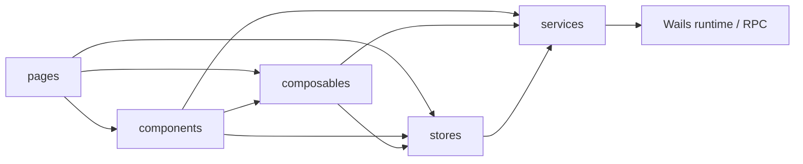
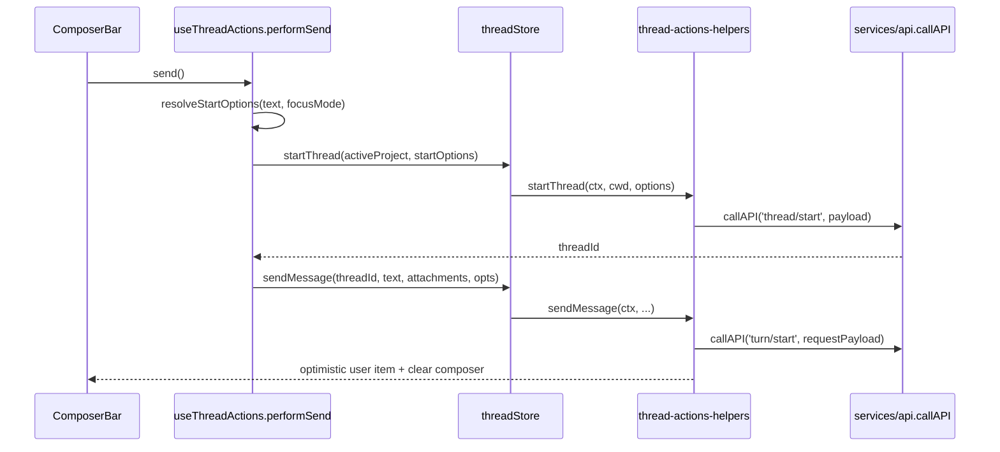
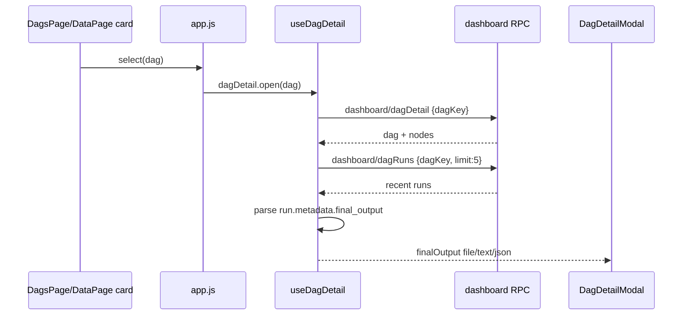

# super-agent-v3 代码地图：终端入口与 UI 层（legacy Vue 前端）

> 范围：`cmd/agent-terminal/frontend/vue-app/`
> 当前状态（2026-06-02）：当前新 UI 页面代码在 `frontend-app/`，由 [`01-terminal-ui-react.md`](01-terminal-ui-react.md) 覆盖。本卷保留 legacy/package-embed Vue 前端、历史链路和旧测试定位；除非任务明确要求旧 Vue 或 packaged embed，不要把当前页面修改定位到本卷路径。
> 关联后端卷：[`01-terminal-ui-go.md`](01-terminal-ui-go.md)；backend contract / module-local 窄端口看 [`04-app-contract.md`](04-app-contract.md)
> 维护提示：本卷仅维护 Vue 入口、页面、store 与 composable；58f19fa 接口隔离未改前端入口，后端端口归属不要在本卷展开。

## 1. 入口与总装点

- 应用挂载从 `main.js:6-17` 开始，`bootstrap()` 最终 `createApp(AppRoot).mount('#app')`。
- 根组件 `AppRoot` 负责页面切换、事件订阅、项目作用域下发与 chat/dashboard bootstrap（`app.js:115-389`）。
- 聊天工作台总装点在 `pages/UnifiedChatPage.js:247-530`，模板出口在 `pages/UnifiedChatPage.template.js:1-203`。
- 系统桥统一收口在 `services/api.js:195-289`；技能管理 RPC 薄封装在 `services/skills-api.js:3-79`。

## 2. 五层职责切片

| 层 | 职责切片 | 代表锚点 |
|---|---|---|
| `services/` | 唯一系统桥；封装 Wails by-ID / RPC、技能管理 API、日志回传；不持有页面响应式状态。 | `services/api.js:195-289`, `services/skills-api.js:3-79` |
| `stores/` | 全局状态中心；负责 snapshot/live patch、thread action、project scope、composer 输入。 | `stores/threads.js:36-151`, `stores/projects.js:14-209`, `stores/composer.js:5-307`, `stores/thread-prefs.js:37-190` |
| `composables/` | 把页面交互拆成 orchestration 单元；连接 store 与 view，不直接持有模板。 | `composables/useThreadActions.js:126-449`, `composables/useSkillEditor.js:617-690`, `composables/useSkillResolutions.js:502-650`, `composables/useDagDetail.js:36-119`, `composables/useThreadSelection.js:16-91` |
| `components/` | 视图与 emit 边界；负责局部渲染、局部交互、少量近边界系统调用。 | `components/ChatTimeline.js:18-279`, `components/ComposerBar.js:10-217`, `components/DagDetailModal.js:17-99`, `components/DiffPanel.js:257-458` |
| `pages/` | 页面级编排、依赖装配、跨组件时序控制；把 stores/composables/components 组装成完整工作台。 | `app.js:292-367`, `app.js:574-648`, `pages/UnifiedChatPage.js:247-530`, `pages/SharedFilesPage.js:142-520` |

- 主路径是 `pages -> composables/stores/components`；不存在反向依赖。
- 近系统边界例外是 `components/DiffPanel.js:5,214,257,271`：组件自身会直接拿 `useProjectStore()`，并调用 `ui/code/save`。

## 3. 核心 store / 状态字段职责

### 3.1 `threads`（`stores/threads.js:36-151`）

| 字段 | 职责 | 主要读写方 |
|---|---|---|
| `activeThreadId` / `activeCmdThreadId` | chat/cmd 双模式当前选中 thread 指针。 | `stores/thread-actions-helpers.js:172-192`, `pages/UnifiedChatPage.js:330-339` |
| `pinnedThreadAtById` / `archivedThreadAtById` | thread rail 排序、筛选、归档显示的本地 UI 元数据。 | `stores/thread-actions-helpers.js:539-611` |
| `threads` / `statuses` / `interruptibleByThread` | sidebar 卡片列表、toolbar stop 按钮、状态门控的基础 runtime 快照。 | `stores/threads.js:37-38`, `composables/useThreadStatus.js:20-57` |
| `viewPrefsChat` / `viewPrefsCmd` | 后端偏好快照；派生 layout、splitRatio、cardCols。 | `stores/threads.js:38`, `stores/thread-prefs.js:119-175` |
| `statusHeadersByThread` / `statusDetailsByThread` | ChatToolbar 主状态文本与细节文案来源。 | `stores/threads.js:39`, `composables/useThreadStatus.js:35-108` |
| `overlayTextByThread` / `overlayTypeByThread` / `overlayPriorityByThread` | 线程卡片 overlay/runtime 提示层。 | `stores/threads.js:39`, `stores/thread-snapshot.js:48-85` |
| `timelinesByThread` | ChatTimeline 主数据源；承接 snapshot/live patch/history hydrate/optimistic item。 | `stores/threads.js:40`, `stores/thread-snapshot.js:191-253`, `stores/thread-actions-helpers.js:447-458` |
| `diffTextByThread` / `diffRevisionByThread` | DiffPanel 正文与 lazy sync revision 对账。 | `stores/threads.js:40`, `stores/thread-diff-sync.js:52-131` |
| `tokenUsageByThread` | token inline/tooltip 与 compact 结果基线。 | `stores/threads.js:41`, `composables/useThreadStatus.js:48-78` |
| `agentMetaById` / `agentRuntimeById` / `mainAgentId` / `mainAgentState` | provider/runtime/capabilities/copy thread info 的运行态来源。 | `stores/threads.js:41`, `composables/useThreadActions.js:26-38`, `composables/useCopyThreadInfo.js:26-178` |
| `activityStatsByThread` / `alertsByThread` / `skillRevision` | ActivityPanel 指标、alerts、技能目录变更事件 revision；聊天页不再消费该 revision 做技能预览。 | `stores/threads.js:42`, `stores/thread-sync-helpers.js:361-379` |

### 3.2 `projects`（`stores/projects.js:14-209`）

| 字段 | 职责 | 主要读写方 |
|---|---|---|
| `projects` | 已注册项目根目录列表。 | `stores/projects.js:34-42,167-196` |
| `active` | 当前项目作用域；驱动 thread scope、代码预览 scope、技能管理 cwd。 | `stores/projects.js:34-42,64-73`, `app.js:165-176,324-335` |
| `showModal` | 添加项目弹窗显示态。 | `stores/projects.js:17,100-111` |
| `modalPath` | 弹窗内待确认目录。 | `stores/projects.js:18,100-152` |
| `browsing` | 原生目录选择器进行中态。 | `stores/projects.js:19,113-139` |

### 3.3 `preferences`（`stores/thread-prefs.js:37-190`）

| 字段 | 职责 | 主要读写方 |
|---|---|---|
| `preferenceWriteQueueByKey` | 同 key 偏好串行写入，避免并发覆盖。 | `stores/thread-prefs.js:37,72-118` |
| `preferenceScopeCwd` | 把活动项目 cwd 注入 `ui/preferences/*` 与相关 sync 请求。 | `stores/thread-prefs.js:38,45-70`, `app.js:286-288,324-329` |
| `viewPrefsChat.layout/splitRatio/threadRailWidth` | chat 页面布局、split、thread rail 宽度的远端偏好切片。 | `stores/thread-prefs.js:119-166` |
| `viewPrefsCmd.layout/splitRatio/cardCols` | cmd 视图布局、split、卡片列数的远端偏好切片。 | `stores/thread-prefs.js:123-175` |

### 3.4 `composer`（`stores/composer.js:5-307`）

| 字段 | 职责 | 主要读写方 |
|---|---|---|
| `text` | composer 文本输入。 | `stores/composer.js:5-16`, `composables/useThreadActions.js:133-170` |
| `attachments` | 本地文件 / 图片附件列表，发送时转成 `input[]`。 | `stores/composer.js:7,28-149,224-280`, `stores/thread-actions-helpers.js:391-417` |
| `attaching` | 原生文件选择器进行中态。 | `stores/composer.js:8,101-122` |

### 3.5 `skill-local`（技能管理页面局部态）

| 字段 | 职责 | 主要读写方 |
|---|---|---|
| `form.scope` / `form.personalType` | 技能保存目标：项目共享或私人使用。 | `composables/useSkillEditor.js:617-690` |
| `resolutionItems` / `resolutionPreview` | 同名、drift、外部 unmanaged 冲突的用户处理状态。 | `composables/useSkillResolutions.js:502-650` |

## 4. 关键 composable：输入 → 行为 → 副作用

| 符号 | 输入 | 行为 | 副作用 |
|---|---|---|---|
| `useThreadActions` | `threadStore`、`projectStore`、`selectedThreadId`、`composer`（`pages/UnifiedChatPage.js:175-190`） | 组装 `launchOne/send/interrupt/compact/recover/openNewWindow`。 | 调 `thread/start`、`turn/start`、`turn/interrupt`、`ui/openNewWindow`；清空/恢复 composer，更新选中 thread，alert/log（`composables/useThreadActions.js:126-449`）。 |
| `useSkillResolutions` | `SkillsPage` 的 active cwd、notice/emit（`pages/SkillsPage.js:141-145`） | 读取 mirror/canonical 冲突，按 provider entry 生成 resolution action，mutating action 先生成 preview/proof。 | 调 `skills/resolution_list`、`skills/resolution_preview`、确认后才调 `skills/resolution_apply` 并刷新 skill/resolution 列表（`composables/useSkillResolutions.js:12-172`）。 |
| `useTimelineItems + useTimelineHelpers` | `props.items/pinnedPlan*` + `approvalRequestId/commandTitle`（`components/ChatTimeline.js:65-113`） | 过滤/折叠 timeline、生成角色/状态/plan spec/copy helpers。 | 记录 fallback key/perf 日志，触发 clipboard copy（`components/timeline/useTimelineItems.js:69-177`, `components/timeline/useTimelineHelpers.js:37-317`）。 |

- caller xref：`useThreadActions` 由 `pages/UnifiedChatPage.js:175-190` 装配；timeline 能力入口是 `components/ChatTimeline.js:74,109`。

## 5. UnifiedChatPage 首发时序

### 5.1 blank-thread 首发时序（`pages/UnifiedChatPage.js:151-169` → `composables/useThreadActions.js:120-173`）

- 固定顺序是 `resolveStartOptions -> startThread -> sendMessage`：`performSend()` 在拿到新 `threadId` 前不会下发 `turn/start`（`composables/useThreadActions.js:126-174`, `stores/thread-actions-helpers.js:288-318,380-463`）。
- 首发时 `resolveStartOptions()` 会把非空 composer 文本放入 `thread/start` 的 `prompt`，让后端 router 有首轮输入可判定；空 composer 则写 `deferSpawn: true`，延后到首个 `turn/start` 再启动 provider（`composables/useThreadActions.js:126-140`）。
- 已有 thread 的续发路径会跳过 `startThread()`，直接走 `sendMessage()`；当前 send options 固定带 `manualSkillSelection: false` 与 cwd，provider-native skill 发现依赖 mirror，不由聊天页 prompt 注入（`composables/useThreadActions.js:160-174`）。

### 5.2 聊天页技能边界

- 聊天页不再维护 blank-thread 技能选择器，也不再显示/维护已有 thread 的技能建议勾选态；`useThreadActions.performSend()` 只负责 thread/turn 时序与错误提示。
- `ComposerBar` 只负责输入、附件、发送、停止、压缩和线程配置；不再接收 `skillMatches/selectedSkillRefs`，也不再发出 `toggle-skill/select-all-skills/clear-skills`。
- 技能的真实可发现性由后端 canonical skill 管理与 provider-native mirror reconcile 负责；前端管理入口在 `SkillsPage`。

## 6. 关键数据流补记

- **事件驱动状态刷新**：`app.js:247-302` 先订阅 `onAgentEvent/onBridgeEvent/onAppWillQuit`，再做 bootstrap；事件最后汇入 `stores/threads.js:61-92` 组装的 sync manager。
- **Diff lazy sync**：`composables/useDiffPreview.js:6-171` 消费 `threadStore.getThreadDiff()`；真正的 revision 对账在 `stores/thread-diff-sync.js:52-131`。
- **File ref / citation 预览**：`composables/useFileRefPreview.js:27-233` 与 `composables/useFileRefPreview.helpers.js` 负责从 timeline/citation 跳到 DiffPanel；模板触发点在 `pages/UnifiedChatPage.template.js:103-120`。
- **生命周期副作用**：`composables/usePageLifecycle.js:18-42` 统一接入 Escape、原生文件拖放、provider 偏好加载与卸载清理；接线点在 `pages/UnifiedChatPage.js:472-479`。
- **DAG final output 入口**：`app.js:292-300,356-367` 把 `ui/dashboard/get?page=memory` 返回的 `finalOutputRefs` 放入 dashboard state；`DagsPage` 通过 `@select="dagDetail.open"` 打开详情（`app.js:574-579`），`DagDetailModal` 消费 `dagDetail.state.finalOutput`（`app.js:635-648`）。
- **Shared Files 最终产物筛选**：`SharedFilesPage` 通过 `finalOutputRefs` prop 建 path 索引（`pages/SharedFilesPage.js:68-110,142-148`），toolbar 的“最终产物 N”只筛选被 `metadata.final_output` 引用的 sharedfile（`pages/SharedFilesPage.js:180-202,457-463`），正文读取仍走 `ui/memory/shared-file/get`（`pages/SharedFilesPage.js:215-244`）。

### 6.1 DAG detail / final_output 读取链

- `useDagDetail.open()` 先拉 `dashboard/dagDetail`，再拉 `dashboard/dagRuns`；run 拉取失败只清空 run/finalOutput 并写 warn，不阻断 DAG 基础详情（`composables/useDagDetail.js:73-91`）。
- `openSeq` 防止快速切换 DAG 时旧请求覆盖新详情（`composables/useDagDetail.js:37-45,58-99`）。
- `DagDetailModal` 对 file 输出显示 path，对 text/json 使用 `previewValue()`，避免对象渲染成 `[object Object]`（`components/DagDetailModal.js:3-15,42-56,82-86`）。

## 7. 文档 / 代码现状差异

1. 用户任务里旧称的 `useSkillSelection` / `LaunchSkillPicker` / `useSkillPreview` 已退出聊天页生产链路。
2. 用户任务里写的 `useTimeline`，源码实际拆成 `components/timeline/useTimelineItems.js:93-177` 与 `components/timeline/useTimelineHelpers.js:283-317`。
3. Legacy Vue 聊天页不做技能选择或 prompt 注入；真实 runtime 路径看 `07-module-read.md` §4 与 `09-provider.md`。

## 8. C19 补遗：技能管理与 provider-native mirror

### 8.1 `SkillsPage` 本地技能编辑与冲突处理

| 文件 | 锚点 | 职责 |
|---|---|---|
| `pages/SkillsPage.js` | `pages/SkillsPage.js:19-205,302-365` | 技能管理页面；列表卡片保留 `personal_type`，编辑/导入透传 personal 类型；冲突区展示 provider entry、preview hash/path/diff，并把 mutating action 明确拆成“预览 -> 确认应用”。 |
| `composables/useSkillEditor.js` | `composables/useSkillEditor.js:407-624` | 管理 SkillsPage 表单、导入、保存与 personal/project scope；保存时把 `scope + personal_type` 传给 `skills/local/write`。 |
| `composables/useSkillResolutions.js` | `composables/useSkillResolutions.js:12-172` | resolution 状态机；`onApplyResolution()` 只生成 preview，`confirmResolutionPreview()` 带 `preview_id + preview_hash` 调 apply。 |
| `services/skills-api.js` | `services/skills-api.js:16-79` | `skills/local/write/importDir` 透传 `personal_type`；`skills/resolution_*` wrapper 负责 camelCase 到 snake_case。 |

- `resolutionPreview` 是 mutating action 的前置门：`sync_back_to_canonical`、`canonical_overwrite_mirror`、`save_as_new_skill` 等必须先展示 proof/diff，只有用户点确认后才写 canonical 或 mirror（`composables/useSkillResolutions.js:103-150`）。
- provider-native mirror 的生产语义不在本卷展开：后端 canonical/effective set、mirror drift 与用户处理入口看 `07-module-read.md` 与 `09-provider.md`。

### 8.2 `ComposerBar` 技能边界

- `ComposerBar` 不再展示技能建议，也不再维护同名技能选择态或手动勾选状态。
- `useThreadActions.performSend()` 固定发送 `{manualSkillSelection:false, cwd}`；发送给 provider 的能力来自 provider-native mirror，避免回到前端注入模式。

## 9. C19 补遗：SystemPromptPage 结构化 404 fallback

### 9.1 `isReadonlyFallbackListError()` 判定口径

| 条件 | 锚点 | 说明 |
|---|---|---|
| `status == 404` | `pages/SystemPromptPage.js:71-72` | 接受 `status/statusCode` 数值化后的 404。 |
| `code == -32601` | `pages/SystemPromptPage.js:73` | 接受 number 或可转 number 的 `-32601`。 |
| `name in {method_not_found, notfounderror}` | `pages/SystemPromptPage.js:74-75` | 先经 `normalizeFallbackErrorToken()` 标准化，再做白名单匹配。 |
| `code == method_not_found` | `pages/SystemPromptPage.js:76-77` | 仅补一条结构化 code-name 兜底。 |

- **禁止 `message` fuzzy match**：`pages/SystemPromptPage.js` 当前没有 `message.includes(...)` 分支；只认上表的结构化字段。
- `loadPrompts()` 仅在命中该 detector 时进入只读降级；普通报错仍走 `load.failed` + `setNotice('error', ...)`（`pages/SystemPromptPage.js:218-239`）。

### 9.2 readonly 列表回填链路

- `hydrateReadonlyPrompts()` 直接调 `callAPI('dashboard/prompts', { cwd: resolveReadonlyFallbackCwd(props) })`，命中只读旁路后写回 `promptCards` 并把 `fallbackSource` 标成 `dashboard/prompts`（`pages/SystemPromptPage.js:197-205`）。
- `resolveReadonlyFallbackCwd(props)` 优先取 `threadStore.state.cwd`，否则退到 `projectStore.state.cwd`；因此 fallback 列表和主聊天页 scope 并不强绑定 `projectStore.state.active`（`pages/SystemPromptPage.js:35-37,199-203`）。

## 10. 测试入口 + how-to 补记

### 10.1 测试入口

- `use-thread-actions.test.js:90-244`：验证空 composer 首发走 `deferSpawn`，有文本首发会先 `startThread(prompt)` 再 `sendMessage()`，且不转发 skill selection。
- `composer-bar.behavior.test.js:159-177,370-403`：验证 ComposerBar 不再暴露聊天内技能选择控件或事件。
- `unified-chat-component.test.js:380-408`：验证首发请求带活动 cwd/prompt，且聊天 composer setup 不再请求 `skills/list`。
- `skills-page.test.js` + `skills-api.test.js` + `use-skill-editor-personal.test.js` + `use-skill-resolutions.test.js`：验证 Skills 管理页保留 personal type、local write/import payload、resolution list/preview/apply payload，以及 mutating action 必须经 preview 确认后才 apply。
- `system-prompt-page.behavior.test.js:65-175`：验证 `message-only user not found` 不触发 fallback，结构化 404 会进入 readonly + `dashboard/prompts` hydrate。
- `app-root.behavior.test.js:131-159` + `thread-store.runtime-bridge-e2e.test.js:90-147`：验证 `onBridgeEvent` 订阅装配与 bridge patch 入 store 的端到端链路。

### 10.2 how-to（页面 / 事件）

- **页面**：新增 page/tab 时，前端最少要补 `pages/*.js` 页面组件、`app.js` 的 `import + components` 注册、`NAV_ITEMS` 与 `refreshDashboardByPage(targetPage)` 对应 `page key`；回归入口优先看页面自己的 `*.behavior.test.js`，再看 `app-root.behavior.test.js` 的装配层。
- **事件**：新增后端事件进 UI 时，前端接线固定是 `services/api.onBridgeEvent/onAgentEvent` -> `app.js bootstrap()` -> `threadStore.handleBridgeEvent()/handleAgentEvent()`；UI 侧回归入口优先看 `thread-store.runtime-bridge-e2e.test.js`，上游桥接入口见关联后端卷 `01-terminal-ui-go.md`。
