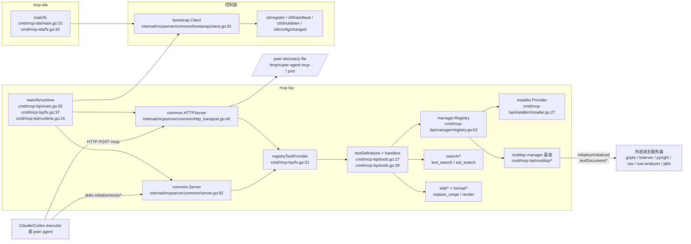
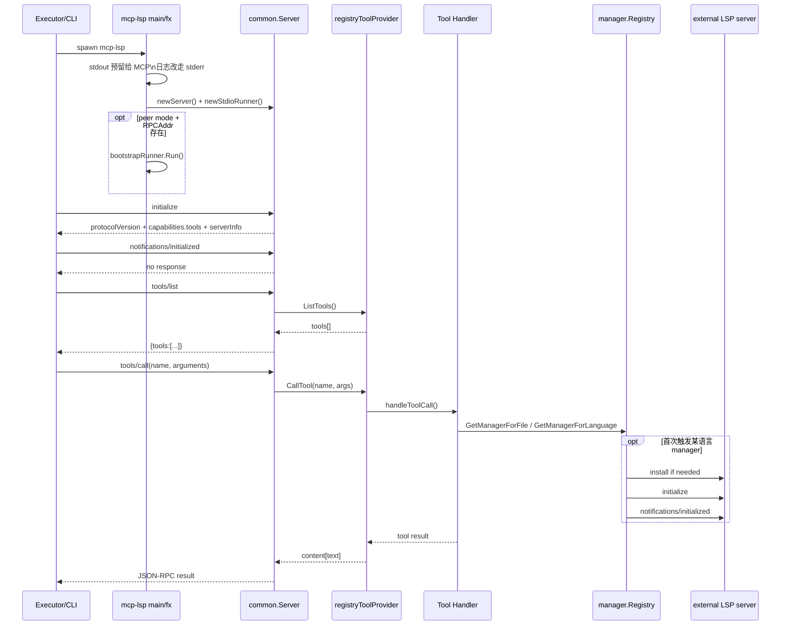
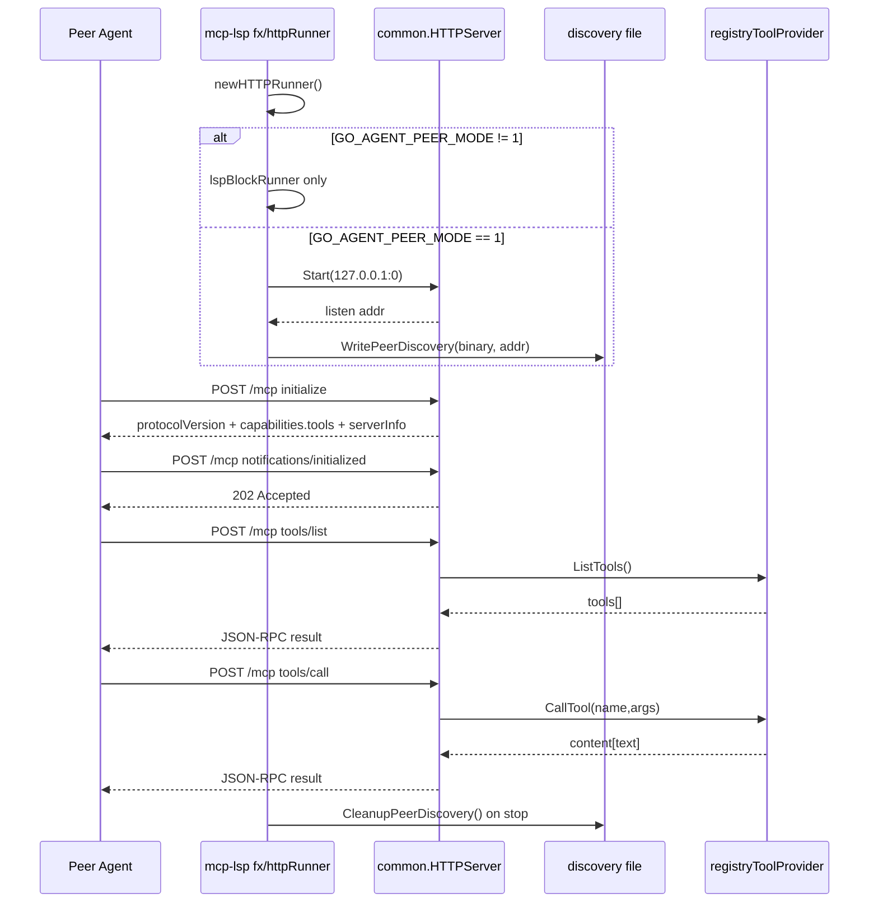
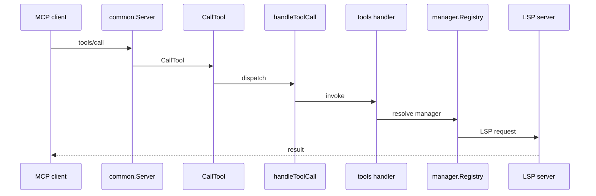

# super-agent-v3 代码地图（03）

## MCP LSP / IDA 服务

> 当前工作树实测：LSP 家族子包已全部并入 `cmd/mcp-lsp/*`；`mcp-ida` 仍是 bootstrap-only 二进制。本文锚点均按当前路径 grep 验真。
>
> 核对范围：`cmd/mcp-lsp/*`、`cmd/mcp-ida/*`、`internal/mcpserver/common/*`、`internal/dto/mcp/{constants,errors}.go`。

---

## 1. 先看结论

- `mcp-lsp` 是完整 MCP 工具服务：**stdio MCP server 始终开启**，**HTTP MCP server 仅在 peer mode 开启**。
- `mcp-lsp` 的工具面固定为 7 个 LSP 工具：`file`、`inspect`、`xref`、`grep`、`structure`、`edit`、`completion`；执行命令和测试走独立 CLI/命令工具，不在 `mcp-lsp` 暴露。
- `mcp-lsp` 的真正 handler 全在 `cmd/mcp-lsp/tools/*`；传输层统一落在 `internal/mcpserver/common/server.go:92` 与 `internal/mcpserver/common/http_transport.go:40`。
- **首个真正依赖语言服务器的工具调用**会懒触发：`registry.GetManagerForFile/GetManagerForLanguage` → `installer.EnsureInstalled` → `multilsp.Manager.EnsureClient`（`ClientEnsurer`）→ `client.Initialize` / `initialized`。
- `mcp-ida` 当前只有 `tools/ida` bootstrap 能力，没有本地 `tools/list` / `tools/call`、没有 schema / manifest / handler 映射，也没有 stdio/HTTP MCP tool server。
- `ast_search`、`semantic_tokens`、markdown/json/yaml 文档符号 fallback 都属于 **LSP toolchain**；当前 **不属于** `mcp-ida` 暴露面。

---

## 2. 总体组件图

---

## 3. 代码分层与关键锚点

| 层 | 关键锚点 | 作用 |
|---|---|---|
| 二进制入口 | `cmd/mcp-lsp/main.go:20` / `cmd/mcp-ida/main.go:10` | `mcp-lsp` 抢占 `stdout` 作为 MCP 通道；`mcp-ida` 只做极简错误退出。 |
| Fx 装配 | `cmd/mcp-lsp/fx.go:37` / `cmd/mcp-ida/fx.go:30` | 装配 bootstrap runner、stdio runner、HTTP runner（仅 LSP）并托管生命周期。 |
| LSP runtime | `cmd/mcp-lsp/runtime.go:24` | 生成 registry、installer、6 个通用 LSP manager、10 个 language ID 注册。 |
| MCP tool manifest | `cmd/mcp-lsp/tools.go:27` | 声明 9 个工具的 manifest 文案。 |
| MCP tool handler 绑定 | `cmd/mcp-lsp/tools.go:39` | 把 tool 名绑定到 `cmd/mcp-lsp/tools/*` 的具体 handler。 |
| stdio transport | `internal/mcpserver/common/server.go:92` | 循环读取 stdio JSON-RPC，处理 `initialize/ping/shutdown/tools/*`。 |
| HTTP transport | `internal/mcpserver/common/http_transport.go:40` | peer mode 下监听 `POST /mcp`，同样处理 `initialize/ping/shutdown/tools/*`。 |
| bootstrap client | `internal/mcpserver/common/bootstrap/client.go:91` | 回连控制面 `register`，启动 heartbeat，接收 `ctl/shutdown` / `ctl/config/changed` 与 toolbridge callback。 |
| IDA 当前能力 | `cmd/mcp-ida/fx.go:30` / `cmd/mcp-ida/fx.go:87` | 只做 bootstrap 生命周期，不提供本地工具面。 |

---

## 4. 启动与 handshake

### 4.1 `mcp-lsp` stdio 入口

- `main()` 把原始 `stdout` 保存到 `mcpStdout`，再把普通日志重定向到 `stderr`，防止污染 MCP JSON-RPC 通道：`cmd/mcp-lsp/main.go:20`。
- `run()` 通过 Fx 装配 `newManager`、`newToolHandlers`、`newServer`、`newBootstrapRunner`、`newStdioRunner`、`newHTTPRunner`：`cmd/mcp-lsp/fx.go:37`。
- `newServer()` 以 `common.NewStdioTransport(os.Stdin, stdout)` 构建 stdio MCP server：`cmd/mcp-lsp/fx.go:105`。
- `common.Server.dispatch()` 只认 `initialize`、`notifications/initialized`、`ping`、`shutdown`、`exit`、`tools/list`、`tools/call`：`internal/mcpserver/common/server.go:160`。
- 真正 tool 调用链是 `tools/call` → `registryToolProvider.CallTool` → `handleToolCall` → `toolDefinition.Handler`：`internal/mcpserver/common/server.go:221`、`cmd/mcp-lsp/fx.go:136`、`cmd/mcp-lsp/fx.go:151`。
- 若 handler 需要语言服务器，则继续进入 `registry.GetManagerForFile`，并懒触发语言服务器 `Initialize` / `initialized`：`cmd/mcp-lsp/manager/registry.go:76`、`cmd/mcp-lsp/multilsp/client.go:98`。

### 4.2 `mcp-lsp` HTTP 入口（peer mode）

- `newHTTPRunner()` 先看 `GO_AGENT_PEER_MODE`；不是 `1` 时直接返回 `lspBlockRunner`，不会起 HTTP server：`cmd/mcp-lsp/http_runner.go:22`。
- peer mode 下，`httpRunner.Run()` 调 `common.NewHTTPServer(...).Start(ctx, "127.0.0.1:0")`，随后把真实端口写入 discovery file：`cmd/mcp-lsp/http_runner.go:37`、`cmd/mcp-lsp/http_runner.go:45`、`internal/mcpserver/common/discovery.go:60`。
- `common.HTTPServer.dispatch()` 与 stdio 入口共享同一组 MCP 方法语义：`internal/mcpserver/common/http_transport.go:105`。
- HTTP `tools/call` 同样委托给 `registryToolProvider.CallTool`，只差 transport 变成 `POST /mcp`：`internal/mcpserver/common/http_transport.go:161`。

#### B17 请求时序图（transport → tool handler → manager）

---

## 5. 工具注册与 handler 调用链

| LSP 工具 | manifest | handler 绑定 | 实际入口 |
|---|---|---|---|
| `lsp_file` | `cmd/mcp-lsp/tools.go:28` | `cmd/mcp-lsp/tools.go:53` | `cmd/mcp-lsp/tools/tool_file.go:90` |
| `lsp_inspect` | `cmd/mcp-lsp/tools.go:29` | `cmd/mcp-lsp/tools.go:54` | `cmd/mcp-lsp/tools/tool_inspect.go:26` |
| `lsp_xref` | `cmd/mcp-lsp/tools.go:30` | `cmd/mcp-lsp/tools.go:55` | `cmd/mcp-lsp/tools/tool_xref.go:26` |
| `lsp_grep` | `cmd/mcp-lsp/tools.go:31` | `cmd/mcp-lsp/tools.go:56` | `cmd/mcp-lsp/tools/tool_grep.go:50` |
| `lsp_structure` | `cmd/mcp-lsp/tools.go:32` | `cmd/mcp-lsp/tools.go:57` | `cmd/mcp-lsp/tools/tool_structure.go:25` |
| `lsp_edit` | `cmd/mcp-lsp/tools.go:33` | `cmd/mcp-lsp/tools.go:58` | `cmd/mcp-lsp/tools/tool_edit.go:65` |
| `lsp_completion` | `cmd/mcp-lsp/tools.go:34` | `cmd/mcp-lsp/tools.go:59` | `cmd/mcp-lsp/tools/tool_completion.go:20` |

调用链实测（由 `lsp_xref` 反查）：

1. `common.Server` / `common.HTTPServer` 的 `tools/call` 最终调用 `registryToolProvider.CallTool`：`internal/mcpserver/common/server.go:221`、`internal/mcpserver/common/http_transport.go:161`、`cmd/mcp-lsp/fx.go:136`。
2. `registryToolProvider.CallTool` 只做名字分发，核心逻辑在 `handleToolCall`：`cmd/mcp-lsp/fx.go:151`。
3. `newToolHandlers` 把每个 tool 名绑定到 `tools.New*Handler(...)`：`cmd/mcp-lsp/tools.go:39`。
4. 具体 handler 里再决定是否走 registry / search / edit / format / sandbox：`cmd/mcp-lsp/tools/factory.go:35`。

### 5.1 `manager.Registry` / language 检测真实调用链

| 阶段 | 真实动作 | 关键锚点 |
|---|---|---|
| runtime 组装 | `newManager()` 先 `setupInstaller()`，再 `manager.NewRegistry(inst)`，随后把 `go/gomod/gosum/gowork/javascript/typescript/python/css/rust/java` 注册到 registry。 | `cmd/mcp-lsp/runtime.go:24`、`cmd/mcp-lsp/runtime.go:30`、`cmd/mcp-lsp/runtime.go:32`、`cmd/mcp-lsp/runtime.go:35`、`cmd/mcp-lsp/runtime.go:42`、`cmd/mcp-lsp/runtime.go:47`、`cmd/mcp-lsp/runtime.go:51`、`cmd/mcp-lsp/runtime.go:55`、`cmd/mcp-lsp/runtime.go:59` |
| installer 口径 | `setupInstaller()` 只登记“语言 → binary/install cmd”；真正触发安装发生在 `registry.GetManagerForFile/GetManagerForLanguage` 内部的 `EnsureInstalled`。 | `cmd/mcp-lsp/runtime.go:65`、`cmd/mcp-lsp/installer/installer.go:35`、`cmd/mcp-lsp/installer/installer.go:44` |
| generic manager 口径 | `createGenericManager()` 并不区分“专用 manager 类型”；所有语言都复用 `multilsp.NewManager(Config{ClientFactory: ...})`，差别只在 binary / args / initOpts。 | `cmd/mcp-lsp/runtime.go:107`、`cmd/mcp-lsp/runtime.go:112`、`cmd/mcp-lsp/runtime.go:114`、`cmd/mcp-lsp/runtime.go:127` |
| file → languageID | 文件型工具进入 `registry.GetManagerForFile()` 后，先跑 `DetectLanguageID(filePath)`：优先 basename 映射 `go.mod/go.sum/go.work`，再看扩展名映射，最后才 fallback 为去点扩展名。 | `cmd/mcp-lsp/manager/registry.go:16`、`cmd/mcp-lsp/manager/registry.go:22`、`cmd/mcp-lsp/manager/registry.go:76`、`cmd/mcp-lsp/manager/registry.go:130` |
| language → manager | `GetManagerForLanguage()` 只 lower-case + trim，再查已注册 manager；如果没注册，直接 `ErrUnsupportedLanguage`，不会进入安装。 | `cmd/mcp-lsp/manager/registry.go:96`、`cmd/mcp-lsp/manager/registry.go:103` |
| manager 二次检测 | 进入 multilsp manager 后，`resolveDocumentRef()` 在调用方没显式给 languageID 时会再次 `DetectLanguageID(absPath)`；随后 `resolveProjectRoot()` 按 Go/JSTS/Java 选择 workspace root。 | `cmd/mcp-lsp/multilsp/manager.go:151`、`:180`、`:193` |
| 惰性 client 初始化 | `multilsp.Manager` 先由 `ClientEnsurer + lspmanager.Manager + BackgroundRunnerProvider` 组合出对外端口；`EnsureClient()` → `ensureClientForFile/ensureClientForLanguage()` → `ensureClient()` → `createAndRegisterClient()` → `client.Initialize()` + `initialized`，这才是真正拉起外部语言服务器的点。 | `cmd/mcp-lsp/multilsp/manager.go:36`、`:42`、`:46`、`cmd/mcp-lsp/multilsp/manager_lifecycle.go:30`、`:105`、`:117`、`:231`、`:260`、`cmd/mcp-lsp/multilsp/client.go:98`、`:119` |
| workspace symbol 特例 | `lsp_structure.workspace_symbol` 是唯一可直接走 `language` 的 tool action：`resolveWorkspaceSymbolManager()` 强制 `file_path` 与 `language` 二选一；language 模式走 `GetManagerForLanguage()`，file 模式仍会经 `DetectLanguageID()`。 | `cmd/mcp-lsp/tools/tool_structure.go:68`、`cmd/mcp-lsp/tools/tool_structure.go:75`、`cmd/mcp-lsp/tools/tool_structure.go:84`、`cmd/mcp-lsp/tools/tool_structure.go:91` |
| 非 registry 旁路 | `lsp_grep.text_search` / `ast_search` 都是搜索子系统直连：前者本地 walk，后者 `sg`，不经过 `manager.Registry`。 | `cmd/mcp-lsp/tools/tool_grep.go:73`、`cmd/mcp-lsp/search/searchutil.go:64`、`cmd/mcp-lsp/search/searchutil.go:84` |

| action | 参数 | 内部动作 | 返回字段 |
|---|---|---|---|
| `open_file` | `file_path` | `search.ReadToolFileContent` 校验 root/regular file/symlink/binary/大小；`registry.GetManagerForFile` 成功时 best-effort `DidOpen` | `{success,status,message,file_path,bytes}` |
| `read_file` 单文件 | `file_path`,`offset`,`limit` | `ReadToolFileContent` + `renderReadContent`，输出行号文本；超范围 offset 会被 clamp | **字符串**：行号文本；非全量时追加 `...[showing lines ...]` |
| `read_file` 批量 | `file_paths[]`,`offset`,`limit` | 最多 10 个文件并发读取；超 16KiB 结果会截断内容/条目 | `{success,data:[{file_path,success,content,error}],meta:{count,success_count,error_count,truncated,requested_count,max_batch,dropped,message}}` |
| `diagnostics` | `file_path` / `file_paths[]` | 解析 URI → `WaitDiagnosticsStable` → `Diagnostics`；空结果时最多对 30 个 URI 做 reactive bootstrap | `{success,data:[{file,cols,rows}],meta:{count,source,message}}`，其中 `rows=[L,C,sev,msg,src,code]` |

## 7. 独立能力边界：LSP toolchain vs IDA

### 7.1 LSP toolchain 的独立能力

| 能力 | 实现锚点 | 与语言服务器关系 | 说明 |
|---|---|---|---|
| 文本搜索 | `cmd/mcp-lsp/search/searchutil.go:64` | **独立于** LSP server | 纯本地扫描，适合 grep/批量验真。 |
| AST 搜索 | `cmd/mcp-lsp/search/searchutil.go:84` | **独立于** LSP server，但依赖 `sg` | `lsp_grep.ast_search` 不走 `manager.Registry`。 |
| semantic tokens | `cmd/mcp-lsp/tools/tool_structure.go:160` | **依赖** LSP server | 由具体语言服务器返回 token data。 |
| markdown/json/yaml 文档符号 fallback | `cmd/mcp-lsp/multilsp/manager_symbols_fallback.go:33` | **不依赖** 外部 LSP server | 能力存在于 manager 基座，但当前 cmd 层未把这些 language ID 注册进 registry。 |

### 7.2 `mcp-ida` 当前独立能力

| 能力面 | 当前状态 | 锚点 |
|---|---|---|
| bootstrap 注册 `tools/ida` | 已实现 | `cmd/mcp-ida/fx.go:37` |
| `FinalReport` / `OnConfigChanged` / `OnShutdown` | 已实现 | `cmd/mcp-ida/fx.go:38`、`cmd/mcp-ida/fx.go:49`、`cmd/mcp-ida/fx.go:59` |
| 本地 `tools/list` / `tools/call` | **未实现** | 当前二进制无 `common.Server` / `common.HTTPServer` 装配 |
| `ast_search` / `semantic_tokens` / `DocumentSymbol` / 编辑能力 | **未暴露** | 当前代码面无 schema/manifest/handler |

结论：现在的 **AST 搜索、semantic tokens、文档结构树、编辑链** 全在 `mcp-lsp`；`mcp-ida` 仍只是一个挂到控制面的能力占位 binary。

---

## 8. 错误码映射

### 8.1 stdio / HTTP MCP server

| code | 含义 | 触发点 | 锚点 |
|---|---|---|---|
| `-32700` | parse error | stdio/HTTP 收到非法 JSON 或 HTTP body 读取失败 | `internal/mcpserver/common/server.go:150`、`internal/mcpserver/common/http_transport.go:79` |
| `-32600` | invalid request | `jsonrpc` 不是 `2.0` | `internal/mcpserver/common/server.go:161`、`internal/mcpserver/common/http_transport.go:106` |
| `-32601` | method not found | 非法 MCP method | `internal/mcpserver/common/server.go:177`、`internal/mcpserver/common/http_transport.go:120` |
| `-32602` | invalid params | `initialize/tools/list/tools/call` 参数解码失败 | `internal/mcpserver/common/server.go:187`、`internal/mcpserver/common/server.go:223`、`internal/mcpserver/common/http_transport.go:130`、`internal/mcpserver/common/http_transport.go:163` |
| `-32603` | internal error | `tools/list` provider 失败、HTTP marshal 失败、tool provider 未配置 | `internal/mcpserver/common/server.go:215`、`internal/mcpserver/common/http_transport.go:155`、`internal/mcpserver/common/http_transport.go:182` |
| `-32000` | tool call error | 任意 tool handler 返回 error；包括 path outside root / file not found / unsupported language / sg not found 等 | `internal/mcpserver/common/server.go:233`、`internal/mcpserver/common/http_transport.go:174` |

### 8.2 bootstrap / ctl RPC

| code | 含义 | 来源 |
|---|---|---|
| `-32603` | ctl/internal error 基线码 | `internal/dto/mcp/errors.go:5` |
| `-32602` | ctl invalid params 基线码 | `internal/dto/mcp/errors.go:6` |
| `4101` | lease not found | `internal/dto/mcp/errors.go:7`；heartbeat 识别丢 lease 时会触发重连 |
| `4102` | lease stale | `internal/dto/mcp/errors.go:8`；同上 |
| `4105` | approval unavailable | `internal/dto/mcp/errors.go:11`；`approvalUnavailableErr()` 使用 |
| `4106` | persist/report conflict | `internal/dto/mcp/errors.go:12`、`:20` |

> 注意：当前 `mcp-lsp` / `mcp-ida` 入口代码里**没有**使用 `-31001` 这类“not found”业务码。对这两个 binary 来说，路径越界、文件不存在、语言不受支持、外部依赖缺失，都会先变成 handler error，再由 `tools/call` 统一包成 `-32000`。

### 8.3 handler / ctl 细粒度映射补表

| 场景 | 原始错误来源 | 最终码 | 说明 | 锚点 |
|---|---|---|---|---|
| `tools/call` 外层 envelope 解码失败 | `toolCallParams` 反序列化失败 | `-32602` | 这是 transport 层错误，尚未进入具体 tool handler。 | `internal/mcpserver/common/server.go:221`、`internal/mcpserver/common/http_transport.go:161` |
| tool 内部严格参数校验失败 | `decodeStrictToolParams` / `requireFilePath` / `requirePosition` / `unsupported <tool> action` | `-32000` | 已进入具体 handler，因此统一由 `tools/call` 包装成 tool call error。 | `cmd/mcp-lsp/tools/factory.go:92`、`cmd/mcp-lsp/tools/factory.go:120`、`cmd/mcp-lsp/tools/factory.go:144`、`cmd/mcp-lsp/tools/factory.go:152`、`internal/mcpserver/common/server.go:233` |
| path 越界 / symlink / binary / file too large | `search.ResolvePath` / `readValidatedFile` | `-32000` | 常见于 `lsp_file` 与 `lsp_grep`。 | `cmd/mcp-lsp/search/fileutil.go:112`、`cmd/mcp-lsp/search/fileutil.go:147`、`cmd/mcp-lsp/search/fileutil.go:156`、`cmd/mcp-lsp/search/fileutil.go:162`、`cmd/mcp-lsp/search/fileutil.go:169` |
| registry 未注册语言 | `ErrUnsupportedLanguage` | `-32000` | registry 直接拒绝；不会进入 auto-install。 | `cmd/mcp-lsp/manager/registry.go:14`、`cmd/mcp-lsp/manager/registry.go:83`、`cmd/mcp-lsp/manager/registry.go:103` |
| LSP binary 缺失且安装失败 | `installer.EnsureInstalled` | `-32000` | LookPath 失败后尝试安装；安装失败同样按 tool error 上抛。 | `cmd/mcp-lsp/installer/installer.go:44`、`cmd/mcp-lsp/installer/installer.go:65`、`cmd/mcp-lsp/installer/installer.go:70` |
| bootstrap lease 被拒绝 | jrpc2 error `4101/4102` | `4101` / `4102` | `mcp-lsp` / `mcp-ida` 本地不制造该码，但 heartbeat 会识别并走重连。 | `internal/dto/mcp/errors.go:7`、`internal/dto/mcp/errors.go:8`、`internal/mcpserver/common/bootstrap/heartbeat.go:172` |
| bootstrap approval 不可用 | `approvalUnavailableErr()` | `4105` | 主要出现在控制面 live lifecycle 不可用时。 | `internal/dto/mcp/errors.go:11`、`internal/mcpserver/common/bootstrap/env.go:203` |
| ctl 业务错误目录 | capability / scope / peer / auth / busy / timeout | `4103`~`4110` | 这些码定义在 DTO 与 mcpcontrol，但 03 这两个 binary 主要是“消费/透传”，不是本地 tool server 主动发射点。 | `internal/dto/mcp/errors.go:9`、`internal/dto/mcp/errors.go:10`、`internal/dto/mcp/errors.go:13`、`internal/dto/mcp/errors.go:14`、`internal/dto/mcp/errors.go:15`、`internal/dto/mcp/errors.go:16`、`internal/platform/mcpcontrol/errors.go:30`、`internal/platform/mcpcontrol/errors.go:34`、`internal/platform/mcpcontrol/errors.go:50`、`internal/platform/mcpcontrol/errors.go:42`、`internal/platform/mcpcontrol/errors.go:54` |

---

## 9. 关键补充结论

1. **stdio 与 HTTP 只是两种 MCP transport，工具注册与 handler 完全共用。** 真正差异只有入口 runner、discovery file 和 HTTP `POST /mcp` 包装。
2. **下游语言服务器 handshake 是惰性的。** `mcp-lsp` 启动时并不会一次性初始化全部语言服务器，只有首个相关工具调用才触发 `Initialize` / `initialized`。
3. **Manager 端口已完成接口隔离。** `manager.Manager` 聚合细分 LSP 能力端口，`multilsp.Manager` 再组合 `ClientEnsurer`、`lspmanager.Manager` 与 `BackgroundRunnerProvider`，不要按旧的直铺方法签名理解。
4. **`ast_search` 是“搜索子系统能力”，不是 LSP server 能力。** 它依赖 `sg`，不依赖 `manager.Registry`。
5. **`semantic_tokens` 是“结构子系统能力”，但依赖具体语言服务器是否支持。** handler 只做请求与裁剪，不自行生成 token。
6. **manager 基座已有 markdown/json/yaml 文档符号 fallback，但 cmd 层没把这些语言注册进 registry。** 这就是“能力已写、工具面未完全打通”的真实断点。
7. **`mcp-ida` 当前不应被视为“对等工具服务器”。** 它在今天的代码面只是控制面注册 + 生命周期代理，尚未拥有 LSP 那种本地工具面。

---

## 10. 测试入口 + freeze 映射

| 包 | 测试文件 | 核心 Test* | freeze |
|---|---|---|---|
| `edit` | `cmd/mcp-lsp/edit/patchparse_test.go` | `TestParseImplicitSingleHunk` (`cmd/mcp-lsp/edit/patchparse_test.go:9`) | — |
| `multilsp` | `cmd/mcp-lsp/multilsp/gomod_test.go` | `TestFindJSTSProjectRootWithinFindsFirstValidProject` (`cmd/mcp-lsp/multilsp/gomod_test.go:9`) | — |
| `manager` | `cmd/mcp-lsp/manager/registry_multilang_e2e_test.go` | `TestMultiLanguageLSP_E2E` (`cmd/mcp-lsp/manager/registry_multilang_e2e_test.go:242`) | — |
| `search` | `cmd/mcp-lsp/search/language_inference_test.go` | `TestInferLanguage` (`cmd/mcp-lsp/search/language_inference_test.go:5`) | — |
| `tools` | `cmd/mcp-lsp/tools/tool_edit_support_test.go` | `TestReadFileWithModeNormalizesCRLF` (`cmd/mcp-lsp/tools/tool_edit_support_test.go:11`) | — |

补充：本卷覆盖的 5 个子包当前都**没有独立 archtest freeze 数字**；冻结压力仍主要落在 11 卷 `memory/prompt` 等包，而 03 卷更像“运行时与工具语义”地图。

## 11. how-to（新增 tool / language / action）

| 场景 | 何时改 | 步骤 | 锚点 | 验证 |
|---|---|---|---|---|
| LSP tool | 新增理解/编辑/执行类工具 | `schema.go` 增 schema → `lspToolManifests` / `newToolHandlers` 接 manifest+handler → `tools/tool_*.go` 落 action，并经 `wrapToolHandler()` 接入治理 | `cmd/mcp-lsp/tools.go:27`、`cmd/mcp-lsp/tools.go:39` | `cmd/mcp-lsp/tools/tool_*_test.go` |
| language | 引入新语言 server | `setupInstaller()` 登 binary/install cmd → `createGenericManager()` 指定 binary/args/initOpts → `registry.Register(languageID, mgr)` 暴露给文件型工具 | `cmd/mcp-lsp/runtime.go:65`、`cmd/mcp-lsp/runtime.go:107`、`cmd/mcp-lsp/manager/registry.go:70` | `cmd/mcp-lsp/manager/registry_multilang_e2e_test.go:242` |
| action | 给已有 tool 补新 action | `schema.go` 扩 enum → `dispatchToolAction()` 分发表补 case → 视需要补 `WithOutputBudget` / timeout tier / format helper | `cmd/mcp-lsp/schema.go:56`、`cmd/mcp-lsp/tools/factory.go:120`、`cmd/mcp-lsp/middleware/budget.go:17`、`cmd/mcp-lsp/middleware/timeout.go:11` | `cmd/mcp-lsp/tools/tool_structure_test.go` / 同类 handler test |
