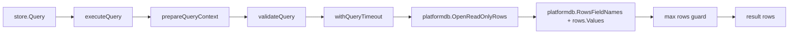

# 10. 数据存储层代码地图

> 范围：`internal/store/*` + `internal/store/sqlc/*` + `sql/queries/*` + `migrations/*`
>
> 与第 11 卷的边界：本卷聚焦 `internal/store/*`、`sql/queries/*`、`migrations/*` 的持久化职责；`prompt snapshot` 在 thread / prompt 生命周期里的运行时语义请结合 `11-memory-prompt-thread.md` 阅读。

### 1.2 共性设计

1. **接口优先**
   - 大多数包暴露 `Store` 接口。
   - `commandcard`、`sharedfile` 只暴露 `Reader`；`prompt` 模块同时提供 `Store` 与 `AsReader(store Store) Reader`，保留给 dashboard 等 caller 的只读视图。
   - `hookstore` 暴露的是 `internal/contract.HookReviewStore`，不再重复定义本地接口。

2. **sqlc 作为主访问层**
   - 主路径是：`sql/queries/*.sql` → `internal/store/sqlc/*.sql.go` → `internal/store/*/store.go`
   - store 层负责把 `sqlc` 的 `Column1/Column2/...`、`[]byte`、`Row struct` 包装成更稳定的领域 DTO。

3. **统一错误包裹**
   - 大多数 store 都调用 `internal/platform/db.WrapStoreError`。
   - 统一分类为 `ErrNotFound / ErrConflict / ErrTimeout`，并保留 `Operation / Entity / Err`。

4. **测试友好**
   - `ailog`、`binding`、`thread` 等包没有直接把整个 `*sqlc.Queries` 写死到实现内部，而是先抽一层窄 `querier` 接口，便于 stub/单测。

5. **显式例外**
   - `dbquery`：不是静态 CRUD 仓储，而是“受限运行时只读 SQL 查询引擎”。
   - `hookstore`：明确绕过 sqlc 生成查询，直接基于 `internal/platform/db.Queryable` 执行手写 SQL。

### 1.3 按职责划分的 5 类存储面

- **运行态 / 绑定**：`agentstatus`、`binding`、`thread`、`cwdlock`、`uipreference`
- **日志 / 审计 / 追踪**：`systemlog`、`ailog`、`auditlog`、`buslog`、`tasktrace`
- **配置 / 资产**：`prompt`、`commandcard`、`sharedfile`、`topologyapproval`
- **交互 / 人工审批**：`interaction`、`hookstore`
- **通用查询能力**：`dbquery`

---

## 2. 各子 store 详述

> 下列 23 个子包均已按源码核对（以 `internal/store/module.go` 为准）；contract 接口也全部补齐。23 个子包都包含 `module.go`；`hookstore` 的例外仅是没有本地 `contract.go`，而是实现 `internal/contract.HookReviewStore`。

### 2.1 `agentstatus`
- **文件**：`contract.go` / `store.go` / `module.go`
- **职责**：保存 Agent 运行状态快照。
- **contract**：
  - `Upsert(ctx context.Context, params UpsertParams) (*AgentStatus, error)`
  - `Get(ctx context.Context, agentID string) (*AgentStatus, error)`
  - `List(ctx context.Context, status string) ([]AgentStatus, error)`
- **关键实现**：
  - `Upsert` → `sqlc.UpsertAgentStatus`，`created_at/updated_at` 都由 SQL 内部 `NOW()` 维护。
  - `List` → `sqlc.ListAgentStatuses`，SQL 内置 `LIMIT 500`。
- **表 / SQL**：`agent_status` / `sql/queries/agent_status.sql`
- **备注**：`output_tail` 经 `[]byte -> json.RawMessage` 映射。

### 2.2 `ailog`
- **文件**：`contract.go` / `store.go` / `module.go` / `store_test.go`
- **职责**：从 `system_logs` 派生“AI 日志视图”，不是独立落表仓储。
- **contract**：
  - `List(ctx context.Context, filter ListFilter) ([]AILog, error)`
  - `ListByCategory(ctx context.Context, category string, keyword string, limit int32) ([]AILog, error)`
  - `CountByStatus(ctx context.Context) ([]StatusCount, error)`
  - `ListRecent(ctx context.Context, limit int32) ([]AILog, error)`
- **关键实现**：
  - `List`：直接读 `system_logs`。
  - `ListByCategory`：使用 CTE + 正则从 `message` 中派生 `category/method/url/endpoint/status/status_text/model`。
  - `CountByStatus`：从消息文本中提取 HTTP status 聚合统计。
  - `ListRecent`：最近日志投影。
- **表 / SQL**：底层表是 `system_logs`；查询定义在 `sql/queries/ai_log.sql`
- **备注**：当前分类规则覆盖 `api_request / api_error / compat_fallback / runtime_config / error / ai_event`。

### 2.3 `auditlog`
- **文件**：`contract.go` / `store.go` / `module.go`
- **职责**：审计事件写入与检索。
- **contract**：
  - `List(ctx context.Context, filter ListFilter) ([]AuditEvent, error)`
  - `Insert(ctx context.Context, params InsertParams) error`
- **关键实现**：
  - `Insert`：写 `audit_events`，`ts=NOW()` 由 SQL 内部生成。
  - `List`：支持 `event_type/action/actor/keyword/limit`。
- **表 / SQL**：`audit_events` / `sql/queries/audit_log.sql`
- **备注**：DTO 有 `ID` 字段，但 `ListAuditEvents` SQL 没有投影 `id`，因此返回对象里的 `ID` 实际保持零值。

### 2.4 `binding`
- **文件**：`contract.go` / `store.go` / `module.go` / `store_test.go`
- **职责**：维护 agent 与 provider thread / codex thread 的绑定关系。
- **contract**：
  - `GetByProviderThread(ctx context.Context, provider, providerThreadID string) (*Binding, error)`
  - `Upsert(ctx context.Context, params UpsertParams) error`
  - `DeleteByAgentID(ctx context.Context, agentID string) error`
  - `UpdateSessionUUID(ctx context.Context, params UpdateSessionUUIDParams) error`
  - `SetArchived(ctx context.Context, params SetArchivedParams) error`
  - `GetByAgentID(ctx context.Context, agentID string) (*Binding, error)`
  - `BindAgentThread(ctx context.Context, params BindAgentThreadParams) error`
  - `UnbindAgentThread(ctx context.Context, agentID string) error`
  - `ListAgentThreadBindings(ctx context.Context) ([]Binding, error)`
  - `GetThreadByAgent(ctx context.Context, agentID string) (string, error)`
  - `UpdateAgentCwd(ctx context.Context, params UpdateAgentCwdParams) error`
- **关键实现**：
  - `Upsert`：写 `agent_provider_binding`；若遇到 `(provider, provider_thread_id)` 唯一冲突，会回查旧记录，若 `agent_id` 相同则视作幂等成功。
  - `BindAgentThread`：使用 `thread_binding.sql`。**插入路径**会写入 `provider='codex'`、`provider_thread_id=thread_id`、`codex_thread_id=thread_id`；**agent_id 冲突路径**只更新 `codex_thread_id/cwd/updated_at`，不会改写 `provider/provider_thread_id`。
  - `GetThreadByAgent`：`COALESCE(NULLIF(codex_thread_id, ''), provider_thread_id)`，优先取 `codex_thread_id`。
  - `UpdateSessionUUID / SetArchived / UpdateAgentCwd`：更新可变元数据列。
- **表 / SQL**：
  - 主查询：`agent_provider_binding.sql`
  - 线程绑定辅助查询：`thread_binding.sql`
- **Schema 要点**：
  - `PRIMARY KEY (agent_id)`
  - `UNIQUE (provider, provider_thread_id)`
  - `CHECK (provider <> '')`
  - `CHECK (provider_thread_id <> '')`
  - `BEFORE UPDATE` trigger 禁止修改 `agent_id/provider/provider_thread_id`
  - `session_uuid` 由 `0022_binding_session_uuid.sql` 后补为可变列
- **备注**：当前 V3 的真实绑定主表是 `agent_provider_binding`；`agent_codex_binding` 已退为兼容遗留对象。

### 2.5 `buslog`
- **文件**：`contract.go` / `store.go` / `module.go`
- **职责**：总线异常日志查询。
- **contract**：`List(ctx context.Context, filter ListFilter) ([]BusExceptionLog, error)`
- **关键实现**：
  - `List`：支持 `category/severity/keyword/limit`。
- **表 / SQL**：`bus_exception_logs` / `sql/queries/bus_log.sql`
- **备注**：和 `auditlog` 一样，DTO 里有 `ID`，但 SQL 未选择 `id`，返回时 `ID` 为零值。

### 2.6 `commandcard`
- **文件**：`contract.go` / `store.go` / `module.go`
- **职责**：命令卡读取 / 列表查询。
- **contract**：`Reader` 接口：`List(ctx context.Context, filter ListFilter) ([]CommandCard, error)`
- **关键实现**：
  - `List`：查询 `command_cards`，并左连接 `command_card_runs` 聚合 `last_run_at` 与 `run_count`。
- **表 / SQL**：`command_cards`、`command_card_runs` / `sql/queries/command_card.sql`
- **备注**：
  - `store.Module` 只暴露读接口；底层 sqlc 其实还生成了 `Get/Upsert/Delete/InsertVersion/ListCommandCardVersions`。
  - `timePtr` 用于兼容 `last_run_at` 的可空时间。

### 2.7 `cwdlock`
- **文件**：`contract.go` / `store.go` / `module.go`
- **职责**：同一工作目录（CWD）互斥锁。
- **contract**：
  - `Acquire(ctx context.Context, params AcquireParams) (int64, error)`
  - `ForceAcquire(ctx context.Context, params ForceAcquireParams) (int64, error)`
  - `Release(ctx context.Context, params ReleaseParams) (int64, error)`
  - `Heartbeat(ctx context.Context, params HeartbeatParams) error`
  - `DeleteStale(ctx context.Context) (int64, error)`
  - `GetHolder(ctx context.Context, cwd string) (*LockHolder, error)`
- **关键实现**：
  - `Acquire`：若同实例重入，或旧锁 `heartbeat_at < NOW()-45s`，允许抢占。
  - `ForceAcquire`：仅当当前 holder 的 `pid` 等于指定 `HolderPID` 时强制顶替。
  - `DeleteStale`：清理 45 秒无心跳锁。
- **表 / SQL**：`cwd_instance_locks` / `sql/queries/cwd_lock.sql`

### 2.8 `dbquery`
- **文件**：`contract.go` / `store.go` / `executor.go` / `executor_parser.go` / `normalize.go` / `module.go`
- **职责**：受限的运行时只读 SQL 查询引擎。
- **contract**：
  - `Placeholder(ctx context.Context) ([]PlaceholderRow, error)`
  - `Query(ctx context.Context, query string, args ...any) ([]map[string]any, error)`
- **关键实现**：
  - `Query`：走手写执行器 `executeQuery(...)`，并不依赖静态 sqlc query。
  - `Placeholder`：仅保留一个 `PlaceholderDBQuery` 占位 query，以维持整体 store 结构。
- **表 / SQL**：`sql/queries/db_query.sql` 仅提供占位定义；真正逻辑在手写执行器中。
- **备注**：安全校验、只读事务、参数归一化见第 5 节。

### 2.9 `hookstore`
- **文件**：`hookstore.go` / `module.go` / 多个测试文件
- **职责**：保存待人工 / 订阅者决策的 Hook review。
- **contract**：实现 `internal/contract.HookReviewStore`，完整签名为：
  - `SavePendingReview(ctx context.Context, review mcp.PendingHookReview) error`
  - `GetPendingReview(ctx context.Context, hookCallID string) (mcp.PendingHookReview, error)`
  - `GetResolvedReview(ctx context.Context, hookCallID string) (string, time.Time, string, error)`（返回 `decision/resolved_at/subscriber_lease`）
  - `ListPendingReviews(ctx context.Context, agentID string) ([]mcp.PendingHookReview, error)`
  - `ResolvePendingReview(ctx context.Context, hookCallID, decision, reason, idempotencyKey, resolvedBy string) error`
  - `CancelPendingReviewsByLease(ctx context.Context, subscriberLease string) (int, error)`
  - `CancelPendingReviewsByAgent(ctx context.Context, agentID string) (int, error)`
  - `CancelExpiredReviews(ctx context.Context) (int, error)`
  - `RecoverOnStartup(ctx context.Context) ([]mcp.PendingHookReview, error)`
- **关键实现**：
  - `SavePendingReview`：只写 `hook_call_id/topic/agent_id/subscriber_lease/default_action/status/created_at/deadline_at`，`status` 固定为 `pending`，并使用 `ON CONFLICT (hook_call_id) DO NOTHING`；当前不会写 `thread_id/turn_id/payload`。
  - `GetPendingReview / ListPendingReviews / RecoverOnStartup`：只扫描 `PendingHookReview` 暴露的字段；`ListPendingReviews` 按 `created_at ASC`，`RecoverOnStartup` 按 `deadline_at ASC`。
  - `ResolvePendingReview`：先检查 `status='resolved' AND idempotency_key=$2` 做幂等返回，再把 `pending -> resolved`，并写入 `decision/reason/idempotency_key/resolved_by/resolved_at`。
  - `GetResolvedReview`：仅读 `decision/resolved_at/subscriber_lease`，不返回 `resolved_by`。
  - `CancelPendingReviewsByLease / CancelPendingReviewsByAgent`：把匹配的 `pending` 置为 `cancelled` 并写 `resolved_at`，不写 `decision`。
  - `CancelExpiredReviews`：把过期 `pending` 置为 `expired`，同时把 `decision = default_action` 并写 `resolved_at`。
- **表**：`hook_pending_reviews`
- **备注**：
  - 明确是 **sqlc 例外**：`NewStore(platformdb.Queryable)` 直接对 `Exec/Query/QueryRow` 发手写 SQL；Task13 后产品运行时通过 SQLite `*sql.DB` / queryable 注入。
  - schema 已有 `thread_id/turn_id/payload/resolved_by` 等列；当前 contract 只暴露其中一部分，`GetResolvedReview` 也尚未把 `resolved_by` 暴露出来。

### 2.10 `interaction`
- **文件**：`contract.go` / `store.go` / `module.go`
- **职责**：Agent 间交互消息 / 审批记录。
- **contract**：
  - `Create(ctx context.Context, interaction Interaction) (*Interaction, error)`
  - `Get(ctx context.Context, id int64) (*Interaction, error)`
  - `List(ctx context.Context, filter ListFilter) ([]Interaction, error)`
  - `Review(ctx context.Context, input ReviewInput) (*Interaction, error)`
- **关键实现**：
  - `Create`：实际写入的核心列是 `thread_id/parent_id/sender/receiver/msg_type/status/requires_review/payload`。
  - `Review`：更新 `status/reviewed_by/review_note/reviewed_at/updated_at`。
  - `List`：按 `thread_id` 精确过滤，或按 `sender/receiver/msg_type` 做关键词模糊过滤。
- **表 / SQL**：`agent_interactions` / `sql/queries/interaction.sql`

### 2.11 `prompt`
- **文件**：`contract.go` / `store.go` / `module.go`
- **职责**：提示模板读写；对只读 caller 额外暴露 `Reader` adapter。
- **contract**：
  - `Reader`：`List(ctx context.Context, filter ListFilter) ([]PromptTemplate, error)`
  - `Store`：`Reader + WithTx/Get/Delete/InsertVersion/Upsert`
- **关键实现**：
  - `List`：按 `agent_key + keyword` 查询 `prompt_templates`；`ListFilter.CWD` 已进入 contract，但 `sql/queries/prompt_template.sql` 还没有把它下推进 SQL，当前仍由 caller 后置过滤。`dashboard/ui_page.go` 会先传 `ListFilter{CWD: cwd}`，再执行 `filterDashboardPromptsByCWD(...)`。
  - `WithTx`：`prompt/module.go` 的 `newStoreWithPool` 用共享 `*sqlc.Queries` 绑定 tx，供归档 + 修改共用。
  - `Get / Upsert / Delete / InsertVersion`：`internal/module/prompt/service.go` 已在真实创建 / 更新 / 归档 / 删除路径使用。
- **表 / SQL**：`prompt_templates` + `prompt_versions` / `sql/queries/prompt_template.sql`
- **备注**：
  - `prompt.Module` 同时提供 `Store` 与 `AsReader(store Store) Reader`；`dashboard` 取只读 `Reader`，`prompt/service` 取可写 `Store`。
  - 底层 sqlc 已有 `GetPromptTemplate / UpsertPromptTemplate / DeletePromptTemplate / InsertPromptVersion`，但仍没有单独的 `prompt version list` store 包装。

### 2.12 `sharedfile`
- **文件**：`contract.go` / `store.go` / `module.go` / `disk_integration_test.go`
- **职责**：共享文件读 / 写 / 删 / 列；Phase 3.6 起改为**磁盘 source / DB 索引**模式（桌面端与 mcp-orch 双 store 同源）。
- **contract**：
  - `Get(ctx context.Context, path string) (*SharedFile, error)`
  - `List(ctx context.Context, filter ListFilter) ([]SharedFile, error)`
  - `Upsert(ctx context.Context, params UpsertParams) (*SharedFile, error)`（Upserter）
  - `Delete(ctx context.Context, path string) (int64, error)`（Deleter）
- **关键实现**：
  - `Upsert`：先 `internal/platform/sharedfilepath.ValidateWritePath` 校验路径（Phase 3.7 白名单 + traversal/absolute reject），然后调 `internal/platform/sharedfilefs.WriteAtomic` 落盘 `<cwd>/.agnet/shared/<path>`（mkdir + tmp + fsync + rename + 目录 fsync）；正文 > `Config.InlineThresholdBytes`（默认 100KB）时 DB content 写空串、磁盘是真理来源；写盘前 best-effort 调 `sharedfilegitignore.Ensure` 追加 `.agnet/shared/_internal/` 到 `<cwd>/.gitignore`（Phase 3.8，per-process `sync.Once`，识别 leading slash / 无 trailing slash / 父目录通配等价形式）。
  - `Get`：先 `ValidateReadPath`（不强制白名单兼容历史行），磁盘命中即覆盖 DB content（保留 DB 元数据 updated_by/timestamps）；磁盘 miss fallback DB（DB 也无 → notfound）。
  - `Delete`：双层删（磁盘 RemoveDisk + DB 删行）。
  - `List`：底层 SQL 使用 `ILIKE '%...%'`，是包含匹配而不是真前缀匹配；不扫磁盘（DB 索引视角）。
  - `Config.CWD` 空 → 整体退化 DB-only（兼容遗留 caller / 测试）。
- **表 / SQL**：`shared_files` / `sql/queries/shared_file.sql`
- **平台依赖**：`internal/platform/sharedfilefs`（disk primitive）+ `internal/platform/sharedfilepath`（路径策略 + 5 个 sentinel error）+ `internal/platform/sharedfilegitignore`（Ensure helper）。
- **备注**：`ListFilter.Prefix` 这个命名与实际 SQL 语义并不完全一致。

### 2.13 `systemlog`
- **文件**：`contract.go` / `store.go` / `module.go`
- **职责**：系统日志读写。
- **contract**：
  - `List(ctx context.Context, filter ListFilter) ([]SystemLog, error)`
  - `Insert(ctx context.Context, params InsertParams) error`
- **关键实现**：
  - `Insert`：当前只写基础列 `level/logger/message/raw`。
  - `List`：支持 `level/logger/source/component/agent_id/thread_id/event_type/tool_name` 的精确过滤，以及关键词检索。
- **表 / SQL**：`system_logs` / `sql/queries/system_log.sql`
- **备注**：关键词搜索字段实际只覆盖 `level/logger/message/raw/source/component`，扩展元数据字段主要通过精确过滤使用。

### 2.14 `tasktrace`
- **文件**：`contract.go` / `store.go` / `module.go`
- **职责**：任务链路追踪。
- **contract**：
  - `Insert(ctx context.Context, trace TaskTrace) (*TaskTrace, error)`
  - `List(ctx context.Context, filter ListFilter) ([]TaskTrace, error)`
- **关键实现**：
  - `Insert`：写 `trace_id/span_id/parent_span_id/span_name/component/input_payload/output_payload/status/error_text/duration_ms/metadata`。
  - `List`：支持 `component/since/keyword/limit`。
- **表 / SQL**：`task_traces` / `sql/queries/task_trace.sql`
- **备注**：SQL 固定 `started_at=NOW(), finished_at=NULL`，所以当前实现更像“插入式 trace 快照”，而不是完整 span 生命周期仓储。

### 2.15 `thread`
- **文件**：`contract.go` / `store.go` / `module.go` / `store_test.go` / `snapshot_test.go`
- **职责**：线程注册、服务发现、运行态恢复、prompt snapshot 持久化。
- **contract**：
  - `GetByThreadID(ctx context.Context, threadID string) (*Thread, error)`
  - `GetByPort(ctx context.Context, port int32) (*Thread, error)`
  - `ListAll(ctx context.Context) ([]Thread, error)`
  - `ListRunning(ctx context.Context) ([]Thread, error)`
  - `ListRecoverable(ctx context.Context) ([]Thread, error)`
  - `ListRunningAgents(ctx context.Context) ([]RunningAgent, error)`
  - `Upsert(ctx context.Context, params UpsertParams) error`
  - `SavePromptSnapshot(ctx context.Context, threadID string, snapshot PromptSnapshot) error`
  - `LoadPromptSnapshot(ctx context.Context, threadID string) (*PromptSnapshot, error)`
  - `UpdateStatus(ctx context.Context, params UpdateStatusParams) error`
  - `DeleteByThreadID(ctx context.Context, threadID string) error`
  - `ResetRunning(ctx context.Context) error`
  - `ExpireStale(ctx context.Context, params ExpireStaleParams) (int64, error)`
  - `RunningExists(ctx context.Context, threadID string) (bool, error)`
  - `ListCwds(ctx context.Context) ([]ThreadCwd, error)`
  - `ListCwdsByPrefix(ctx context.Context, prefix string) ([]ThreadCwd, error)`
- **关键实现**：
  - `Upsert`：写 `agent_threads` 主运行信息与 `config_override`。
  - `SavePromptSnapshot`：把 `PromptSnapshot{displayName, baseInstructions, boundary, developerInstructions, provider, version, hash, sectionSnapshot, generation}` 序列化为 JSON，写回 `agent_threads.prompt_snapshot`；若 `SectionSnapshot=nil` 会先归一化为空 map，避免落成 `null`。
  - `LoadPromptSnapshot`：走独立 SQL 只取 `prompt_snapshot` 列；空 payload 或字面量 `null` 视为“没有快照”，反序列化后再次保证 `SectionSnapshot` 非 nil；`UnmarshalJSON` 会同时兼容 modern camelCase 与 legacy snake_case 字段。
  - `Save/LoadPromptSnapshot` 的 not-found 语义来自两条不同路径：`Save` 依赖 `UPDATE ... :execrows` 的 `RowsAffected==0` 主动返回 `ErrNotFound`，`Load` 则因为 `SELECT ... :one` 在缺行时产生 driver not-found error，再经 `WrapStoreError` 统一归类为 `ErrNotFound`。
  - `GetByThreadID / GetByPort / List*`：SQL 会回查 `agent_provider_binding`，按 `provider_thread_id/codex_thread_id`，必要时还会利用 `owner_thread_id` 派生 `AgentID`。
  - `GetByPort`：只看 `status='running'`，按 `updated_at DESC` 取最新。
  - `ListRecoverable`：只返回 `status='created'`。
  - `ResetRunning`：批量把 `running -> created`。
  - `ExpireStale`：把过旧的 `created/running` 线程标为 `expired`。
  - `ListCwdsByPrefix`：SQL 为 `LIKE prefix || '%'`，是大小写敏感前缀匹配。
- **表 / SQL**：`agent_threads`（并通过子查询关联 `agent_provider_binding`；prompt snapshot 走独立查询）/ `sql/queries/agent_thread.sql` + `sql/queries/agent_thread_prompt_snapshot.sql`
- **备注**：
  - `created_at/updated_at/finished_at` 使用 Unix `BIGINT`，不是 `TIMESTAMPTZ`。
  - `config_override` 来自 `0025_agent_thread_config_override.sql`。
  - `prompt_snapshot` 来自 `0031_prompt_snapshot.sql`，当前 `Thread` DTO 不直接暴露该列，而是通过 `Load/SavePromptSnapshot` 专门读写。
  - `parent_agent_id/agent_type/agent_memory_scope` 来自 `0032_agent_memory_identity.sql`，当前 `Thread` / `UpsertParams` 已同步承载这些字段。
  - `thread.PromptSnapshot` 已是与 runtime 对齐的 modern 持久化 DTO：包含 `DisplayName/Boundary/Provider/Version/Hash` 等字段；自定义 `UnmarshalJSON` 再兼容 legacy snake_case payload 与 `int64` generation。
  - store/runtime snapshot 的生产桥接已经存在：`internal/module/thread/prompt_snapshot.go` 里有 `toStoredPromptSnapshot(...)` 写入 store，也有 `fromStoredPromptSnapshot(...)` 在恢复 / resume 路径回转为 `contract.PromptAssemblySnapshot`。
  - 当前真实调用面不再只在测试：`internal/module/thread/lifecycle.go` 启动时调用 `savePromptSnapshot(...)`，`internal/module/thread/prompt_snapshot.go` 的 `loadStoredPromptSnapshot(...)` / `resolveResumePromptSnapshot(...)` 会在恢复与 resume 路径读取。
  - 测试覆盖已拆成两层：`store_test.go` 关注 round-trip、save 缺失线程、load nil payload；`snapshot_test.go` 关注 nil map 归一化、字面量 `null` 兼容、并发 save 安全性。`LoadPromptSnapshot` 的“缺失 thread 行 -> ErrNotFound”分支当前没有对应单测。

### 2.16 `topologyapproval`
- **文件**：`contract.go` / `store.go` / `module.go`
- **职责**：拓扑 / 架构审批。
- **contract**：
  - `Create(ctx context.Context, approval TopologyApproval) (*TopologyApproval, error)`
  - `Approve(ctx context.Context, reviewer, id string) (int64, error)`
  - `Reject(ctx context.Context, reviewer, id string) (int64, error)`
  - `ListPending(ctx context.Context) ([]TopologyApproval, error)`
- **关键实现**：
  - `Create`：SQL 强制写 `status='pending'`，因此输入 DTO 里的 `Status/ReviewedAt/Reviewer/ReviewNote` 不参与插入。
  - `Approve/Reject`：仅设置 `status/reviewer/reviewed_at`。
  - `ListPending`：只返回 `status='pending' AND expire_at > NOW()`。
- **表 / SQL**：`topology_approvals` / `sql/queries/topology_approval.sql`
- **备注**：表里有 `review_note`，但当前 store API 不写该列。

### 2.17 `uipreference`
- **文件**：`contract.go` / `store.go` / `module.go`
- **职责**：UI 偏好持久化。
- **contract**：
  - `GetValue(ctx context.Context, cwd, key string) (json.RawMessage, error)`
  - `Upsert(ctx context.Context, params UpsertParams) error`
  - `List(ctx context.Context, cwd string) ([]UIPreference, error)`
- **关键实现**：
  - `GetValue`：严格按 `(cwd, key)` 精确读取，**不会**自动回退到全局 `cwd=''`。
  - `Upsert`：按 `(cwd, key)` UPSERT。
  - `List`：总是返回全局 `cwd=''` 行；当传入非空 `cwd` 时，再额外返回该 cwd 下的行。
- **表 / SQL**：`ui_preferences` / `sql/queries/ui_preference.sql`
- **备注**：`0020_ui_preferences_cwd.sql` 之后主键从单列 `key` 升级为复合主键 `(cwd, key)`。

---

## 3. sqlc 使用

### 3.1 生成入口
根配置在 `sqlc.yaml`：

- `queries: sql/queries/`
- `out: internal/store/sqlc`
- `package: sqlc`
- `sql_package` / `sql_driver` 名称仍保留部分 pgx 历史痕迹；Task13 产品运行时实际入口为 SQLite `database/sql`
- 打开了：
  - `emit_json_tags`
  - `emit_db_tags`
  - `emit_empty_slices`
  - `emit_interface`
  - `omit_unused_structs`
  - `emit_pointers_for_null_types`
- `initialisms` 显式声明：`id / ui / uuid`
- `overrides` 把：
  - `timestamptz/timestamp` → `time.Time` 或 `*time.Time`
  - `json/jsonb` → `json.RawMessage`

### 3.2 schema 输入的真实组织方式
根 `sqlc.yaml` **不是**直接读取完整历史迁移链，而是使用以下“代码生成输入集”：

- `migrations/001_baseline.sql`
- `migrations/0022_binding_session_uuid.sql`
- `migrations/0023_dag_watcher_phase1.sql`
- `migrations/0024_prompt_versions_description.sql`
- `migrations/0025_agent_thread_config_override.sql`
- `migrations/0031_prompt_snapshot.sql`
- `migrations/0032_agent_memory_identity.sql`

这意味着：

- **sqlc 生成 schema**：来自“`001_baseline` + 6 个补丁”。其中 `0022` 增补 `agent_provider_binding.session_uuid`，`0023` 增补 DAG watcher 相关列 / 表，`0024` 增补 `prompt_versions.description`，`0025_agent_thread_config_override` 增补 `agent_threads.config_override`，`0031_prompt_snapshot` 再为 `agent_threads` 增补 `prompt_snapshot JSONB`，`0032_agent_memory_identity` 则把 `parent_agent_id/agent_type/agent_memory_scope` 同步补到 `agent_threads` 与 `agent_provider_binding`。
- **不在根 sqlc 输入里的后续迁移**：`0025_hook_pending_reviews.sql`、`0026_hook_pending_reviews_resolved_by.sql`、`0027_prompt_description_columns.sql` 仍然没有被根 `sqlc.yaml` 读取；这也解释了 `hookstore` 为什么必须手写 SQL，而 `prompt_templates.description` 需要依赖 `001_baseline` 或运行时 `0027`。
- **重要审查结论**：当前 `001_baseline.sql` 是 sqlc 可解析的扁平 schema 快照；它包含表、索引、触发器函数与触发器，但没有为大多数既有表写出 `PRIMARY KEY / UNIQUE / CHECK` 约束。因此，凡涉及“约束是否存在”的描述，必须同时看历史增量迁移（如 `0001/0003/0005/0006/0012/0020/0021/0006_workspace_runs`）或真实数据库，而不能只把 `001_baseline.sql` 当成完整 runtime DDL。

`hook_pending_reviews` 整张表都没有进入 `sqlc.yaml`，这与 `hookstore` 采用手写 SQL 的设计完全对应。

### 3.3 生成代码目录结构
`internal/store/sqlc/` 可以分成 4 类：

1. **基础生成类型**
   - `db.go`：sqlc 生成的 `DBTX`、`Queries`、`Queries.WithTx(...)`（事务句柄由当前 SQLite runtime 提供）

2. **全量接口**
   - `querier.go`：sqlc 生成的总接口 `Querier`

3. **模型 / 行结构**
   - `models.go`：保留被查询命中的表模型（受 `omit_unused_structs: true` 影响）
   - 各 `*.sql.go`：每个 SQL 文件生成 `Params/Row/Method`

4. **按 SQL 文件一一对应的查询实现**
   - `agent_provider_binding.sql.go`
   - `agent_status.sql.go`
   - `agent_thread.sql.go`
   - `agent_thread_prompt_snapshot.sql.go`
   - `ai_log.sql.go`
   - `audit_log.sql.go`
   - `bus_log.sql.go`
   - `command_card.sql.go`
   - `cwd_lock.sql.go`
   - `db_query.sql.go`
   - `interaction.sql.go`
   - `prompt_template.sql.go`
   - `shared_file.sql.go`
   - `system_log.sql.go`
   - `task_trace.sql.go`
   - `thread_binding.sql.go`
   - `topology_approval.sql.go`
   - `ui_preference.sql.go`
   - `workspace_run.sql.go`

> 反向核对：`internal/store/sqlc/*.sql.go` 当前能反查到 19 个 `// source:` 条目，其中新增的 `agent_thread_prompt_snapshot.sql.go` 对应 `sql/queries/agent_thread_prompt_snapshot.sql`；没有发现文档未提及的查询文件。
>
> 补充：只读事务封装与 `RowsFieldNames(...)` 这类运行时辅助当前位于 `internal/platform/db/tx.go`，不在 `internal/store/sqlc/` 目录下。

### 3.4 store 与 sqlc 的边界
store 层的主要价值在于：

- 封装 `sqlc` 生成的 `Column1/Column2/...` 参数名
- 把 `[]byte`、可空时间、查询结果行结构映射成领域 DTO
- 把多个 SQL 文件拼装成统一仓储语义
  - 例如 `binding` 同时使用 `agent_provider_binding.sql` 与 `thread_binding.sql`
  - `thread` 同时使用 `agent_thread.sql`（线程注册 / 查询）与 `agent_thread_prompt_snapshot.sql`（`prompt_snapshot` JSONB 专用读写）
  - `agent_thread.sql` / `agent_thread.sql.go` 的常规线程 row 并不携带 `prompt_snapshot`；只有 `agent_thread_prompt_snapshot.sql.go` 暴露该列，且它在 xref 上只被 `internal/store/thread/store.go` 单点消费，说明 snapshot SQL 被刻意限制在 thread store 边界内
- 统一错误语义（`WrapStoreError`）

### 3.5 sqlc 已覆盖、但 `internal/store` 没有直接包装成子 store 的能力
从 `internal/store/sqlc/querier.go` 可见，底层还生成了这些能力：

- `workspace_run.sql.go`
  - `UpsertWorkspaceRun`
  - `GetWorkspaceRun`
  - `ListWorkspaceRuns`
  - `UpdateWorkspaceRunStatus`
  - `TransitionWorkspaceRunStatus`
  - `UpsertWorkspaceRunFile`
  - `GetWorkspaceRunFile`
  - `ListWorkspaceRunFiles`
- `prompt_template.sql.go`
  - `GetPromptTemplate / UpsertPromptTemplate / DeletePromptTemplate / InsertPromptVersion`
- `command_card.sql.go`
  - `GetCommandCard / UpsertCommandCard / DeleteCommandCard / InsertCommandCardVersion / ListCommandCardVersions`
- `shared_file.sql.go`
  - `UpsertSharedFile / DeleteSharedFile`

这说明 `internal/store` 只是“核心通用 store 面”，并不是项目全部数据库访问点的唯一集合。

---

## 4. 数据库 Schema（按 baseline + 增量 / 历史约束视角）

### 4.1 解读原则
本节按“**当前源码实际依赖的列 / 索引**”描述 schema，并明确区分两类来源：

- **sqlc 生成输入**：根 `sqlc.yaml` 读取 `001_baseline.sql + 0022_binding_session_uuid.sql + 0023_dag_watcher_phase1.sql + 0024_prompt_versions_description.sql + 0025_agent_thread_config_override.sql + 0031_prompt_snapshot.sql + 0032_agent_memory_identity.sql`。
- **手写 / 运行时补丁**：`hookstore` 依赖 `0025_hook_pending_reviews.sql + 0026_hook_pending_reviews_resolved_by.sql`；`0027_prompt_description_columns.sql` 对 `prompt_templates.description / prompt_versions.description` 做运行时幂等兜底，但不在根 sqlc 输入中。
- **约束来源说明**：`001_baseline.sql` 对多数既有表只给出列、索引、触发器，不给出 PK/UNIQUE/CHECK；下文写到的主键、唯一约束、检查约束来自历史迁移链（例如 `0001/0003/0005/0006/0006_workspace_runs/0010/0012/0019/0020/0021`）或 post-baseline 手写迁移（例如 `0025_hook_pending_reviews`）。

> 审查结论：列 / 索引必须优先对齐 `001_baseline.sql + post-baseline 增量`；约束必须额外对照历史迁移链，因为当前 `001_baseline.sql` 本身并不是完整可执行 runtime DDL。

### 4.2 运行态 / 绑定相关表

#### `agent_provider_binding`
- 最终主列：`agent_id, provider, provider_thread_id, codex_thread_id, rollout_path, cwd, parent_agent_id, agent_type, agent_memory_scope, archived, created_at, updated_at, session_uuid`
- 约束：
  - `PRIMARY KEY (agent_id)`
  - `UNIQUE (provider, provider_thread_id)`
  - `CHECK (provider <> '')`
  - `CHECK (provider_thread_id <> '')`
  - `BEFORE UPDATE` trigger 禁止改写 `agent_id/provider/provider_thread_id`
- 对应 store：`binding`
- **审查修正**：最新迁移里**没有**给该表增加 `cwd` 或 `created_at DESC` 二级索引；旧文档里这部分描述混入了 legacy `agent_codex_binding` 的索引信息。

#### `agent_threads`
- 最终主列：`thread_id, prompt, model, cwd, status, port, pid, created_at, updated_at, finished_at, last_event_type, error_message, workspace_run_key, owner_thread_id, parent_agent_id, agent_type, agent_memory_scope, config_override, prompt_snapshot`
- 索引：`status / port / pid / owner_thread_id / workspace_run_key`（后两者出现在 `001_baseline.sql`；旧的 `0012_agent_threads.sql` 只建 `status/port/pid`）
- 对应 store：`thread`
- 备注：
  - 时间字段是 Unix `BIGINT`；更像运行时注册表而非纯审计表。
  - `prompt_snapshot` 是 `0031_prompt_snapshot.sql` 新增的 `JSONB` 列；常规线程查询仍主要使用 `agent_thread.sql`，而 snapshot 读写走独立的 `agent_thread_prompt_snapshot.sql`。
  - `0031_prompt_snapshot.sql` 本身只有 `ADD COLUMN IF NOT EXISTS prompt_snapshot jsonb DEFAULT NULL`，没有回填、索引或额外约束；因此历史线程默认表现为“无 snapshot”。

#### `agent_status`
- 主列：`agent_id, agent_name, session_id, status, stagnant_sec, error, output_tail, created_at, updated_at`
- 约束：
  - `PRIMARY KEY (agent_id)`
  - `CHECK status IN ('running','idle','stuck','error','disconnected','unknown')`
  - `CHECK (stagnant_sec >= 0)`
- 索引：`(status, updated_at DESC)`、`updated_at DESC`（`001_baseline.sql` 中同时存在 `idx_agent_status_status_updated` / `idx_agent_status_status_updated_at` 与 `idx_agent_status_updated_at` / `idx_agent_status_updated_at_desc` 这两组重复语义索引名）
- 对应 store：`agentstatus`

#### `cwd_instance_locks`
- 主列：`cwd, instance_id, pid, acquired_at, heartbeat_at`
- 约束：`PRIMARY KEY (cwd)`
- 索引：`heartbeat_at`
- 对应 store：`cwdlock`

#### `ui_preferences`
- 最终主列：`cwd, key, value, updated_at`
- 最终主键：`(cwd, key)`
- 索引：`key`
- 对应 store：`uipreference`
- 备注：`0010` 初始版本只有 `key` 主键；`0020` 增加 `cwd` 维度并重建主键。

### 4.3 日志 / 审计 / 追踪表

#### `system_logs`
- 初始列：`id, ts, level, logger, message, raw`
- `0009_system_logs_v2.sql` 后扩展为：
  `source, component, agent_id, thread_id, trace_id, event_type, tool_name, duration_ms, extra`
- 索引：
  - 基础索引：`ts / level / logger`
  - 部分索引：`source / agent_id / thread_id / event_type / tool_name`（仅非空值）
- 对应 store：`systemlog`
- 投影 store：`ailog`

#### `audit_events`
- 主列：`id, ts, event_type, action, result, actor, target, detail, level, extra`
- 约束：`PRIMARY KEY (id)`
- 索引：`ts / event_type / action / result / actor`
- 对应 store：`auditlog`

#### `bus_exception_logs`
- 主列：`id, ts, category, severity, source, tool_name, message, traceback, extra`
- 约束：`PRIMARY KEY (id)`
- 索引：`ts / category / severity`
- 对应 store：`buslog`

#### `task_traces`
- 主列：`id, trace_id, span_id, parent_span_id, span_name, component, status, input_payload, output_payload, error_text, metadata, started_at, finished_at, duration_ms`
- 约束：
  - `PRIMARY KEY (id)`
  - `UNIQUE (span_id)`
  - `CHECK status IN ('running','ok','error','cancelled')`
  - `CHECK (duration_ms >= 0)`
- 索引：`(trace_id, started_at, id)`、`(component, started_at DESC)`
- 对应 store：`tasktrace`

### 4.4 交互 / 审批 / 配置资产表

#### `agent_interactions`
- 主列：`id, thread_id, parent_id, sender, receiver, msg_type, status, requires_review, reviewed_by, review_note, reviewed_at, payload, created_at, updated_at`
- 约束：`PRIMARY KEY (id)`
- 索引：`(thread_id, created_at DESC)`、`(sender, receiver)`、`(status, requires_review, created_at DESC)`
- 对应 store：`interaction`

#### `topology_approvals`
- 主列：`id, status, requested_by, reason, created_at, expire_at, reviewed_at, reviewer, review_note, arch_hash, proposed_architecture`
- 约束：`PRIMARY KEY (id)`
- 索引：`(status, created_at DESC)`、`arch_hash`
- 对应 store：`topologyapproval`

#### `hook_pending_reviews`
- 最终主列：`hook_call_id, topic, agent_id, thread_id, turn_id, subscriber_lease, payload, decision, reason, default_action, status, created_at, deadline_at, resolved_at, idempotency_key, resolved_by`
- 约束：`PRIMARY KEY (hook_call_id)`
- 索引：`(agent_id, status)`、`deadline_at WHERE status='pending'`
- 对应 store：`hookstore`
- 备注：`payload` 当前是 `TEXT`，不是 `JSONB`。

#### `shared_files`
- 主列：`path, content, updated_by, created_at, updated_at`
- 约束：`PRIMARY KEY (path)`
- 索引：`updated_at DESC`
- 对应 store：`sharedfile`

#### `prompt_templates` / `prompt_versions`
- `prompt_templates`：当前生效模板；`prompt_key` 唯一
- `prompt_versions`：历史版本归档
- 两张表最终都带 `description` 列：
  - `prompt_templates.description` 已在 `001_baseline.sql` 中出现，`0027_prompt_description_columns.sql` 再做一次幂等兜底
  - `prompt_versions.description` 由 `0024_prompt_versions_description.sql` 增补，`0027_prompt_description_columns.sql` 再做一次幂等兜底
- 关键索引：
  - `prompt_templates(agent_key, tool_name)`
  - `prompt_templates(enabled, updated_at DESC)`
  - `prompt_versions(prompt_key, id DESC)`
- 对应 store：`prompt`（只读当前模板）

#### `command_cards` / `command_card_versions` / `command_card_runs`
- `command_cards`：当前命令卡定义；`card_key` 唯一
- `command_card_versions`：版本归档
- `command_card_runs`：执行历史，用于统计 `run_count / last_run_at`
- 关键索引：
  - `command_cards(risk_level, enabled, updated_at DESC)`
  - `command_card_versions(card_key, id DESC)`
  - `command_card_runs(status, created_at DESC)`
  - `command_card_runs(card_key, created_at DESC)`
- 对应 store：`commandcard`（只读当前卡片 + 运行统计）

### 4.5 sqlc 低层已覆盖、但当前 `internal/store` 未包装成子 store 的表

#### `workspace_runs`
- 主列：`id, run_key, dag_key, source_root, workspace_path, status, created_by, updated_by, metadata, created_at, updated_at, finished_at`
- 约束：
  - `PRIMARY KEY (id)`
  - `UNIQUE (run_key)`
- 索引：`(status, updated_at DESC)`、`(dag_key, updated_at DESC)`
- SQL：`sql/queries/workspace_run.sql`
- 生成代码：`internal/store/sqlc/workspace_run.sql.go`

#### `workspace_run_files`
- 主列：`id, run_key, relative_path, baseline_sha256, workspace_sha256, source_sha256_before, source_sha256_after, state, last_error, created_at, updated_at`
- 约束：
  - `PRIMARY KEY (id)`
  - `UNIQUE (run_key, relative_path)`
- 索引：`(run_key, state, updated_at DESC)`、`(run_key, relative_path)`
- 同样只有 sqlc 低层，没有 `internal/store/workspace...` 包

### 4.6 schema 中仍存在、但当前 store 根模块未直接包装的遗留 / 外围对象
- `agent_codex_binding`
- `prompt_template_versions`（存在于 `001_baseline.sql`；历史链里 `0003_task_trace_prompt_versions.sql` 会在条件满足时把旧表名迁到 `prompt_versions`）
- `prompts`
- `topology_approval_archives`
- `schema_migrations`
- `task_acks`
- `task_dags`
- `task_dag_nodes`
- `task_dag_wakeups`
- `task_dag_worker_leases`

另说明：`task_dag_runs` 已由 `cmd/mcp-orch/store/taskdag.RunStore` 包装（commit eb341e54 起走 `ProvideRunStore`），**不**列在上述“未包装”清单里；它也不是 `internal/store.Module` 的成员，而是在 `cmd/mcp-orch/store/taskdag` 这个独立包里（详见下面§4.7）。

其中：
- `task_dag_*` 在 schema 中仍然有效，且 `0023_dag_watcher_phase1.sql` 还继续扩展 `task_dag_nodes` 并新增 `task_dag_wakeups / task_dag_worker_leases`；
- 但这些对象当前都不在 `store.Module` 的 23 个子 store 注册面里（`task_dag_runs` 上面已说明，由 `cmd/mcp-orch/store/taskdag.RunStore` 在独立 fx 包里装载；commit eb341e54 之后 taskdag 包中的 RunStore binding 已被 `ProvideRunStore` 补齐，internal/store 侧子 store 计数仍以 `internal/store/module.go` 为准）；
- `dbquery` 的白名单也**没有**向这些表开放。

### 4.7 `cmd/mcp-orch/store/taskdag` — 独立 fx 包装的 DAG / Run 存储

该包是 `internal/store/` 之外的另一块“独立 fx store 子包”，不在 §3 “23 个子 store”表内，但仍是运行时装配面的一员。

| 子项 | 接口位置 | 实现位置 | Module 注册 | sqlc query 来源 | 关键方法 |
| --- | --- | --- | --- | --- | --- |
| `Store`（聚合） | `cmd/mcp-orch/store/taskdag/contract.go:13-21` | `cmd/mcp-orch/store/taskdag/store.go` | `Module` 中 `fx.Provide(NewStore)` + `ProvideOrchestrationStore` | `task_dags / task_dag_nodes` 等（sqlc 生成仓位于 `internal/store/sqlc`） | `WithTx`、`UpsertDAG`、`UpsertNode`、`UpdateNodeStatus`、`AcquireDAGLock`、节点生命周期等 |
| `RunStore`（独立窄接口） | `cmd/mcp-orch/store/taskdag/contract.go:RunStore` 区段 | `cmd/mcp-orch/store/taskdag/store.go`（同一 `*store` 类型实现，编译期由 `store_compile_assertions_test.go` 里 `var _ RunStore = (*store)(nil)` 守住） | `Module` 中 `fx.Provide(ProvideRunStore)`，从聚合 `Store` type-assert 到 `RunStore`（commit eb341e54） | `task_dag_runs`（`sql/queries/task_dag_run.sql`） | `CreateRun`、`GetRun`、`ListRuns`、`UpdateRunStatus`、`AppendRunEvent` 等 |

设计说明：`RunStore` **故意不嵌入** `taskdag.Store` 聚合接口，以保住 `OrchestrationStore` / `DAGMutationStore` 的 `InterfaceIsolation` 预算（·04 §2.1 接口隔离预算注脚同步列出；源码凭证见 `cmd/mcp-orch/store/taskdag/contract.go:25-27` 与 `:39-42`）。`cmd/mcp-orch/orchestration.service` 同时持有 `dagStore`（`OrchestrationStore`）与 `runStore`（`RunStore`）两个字段；事务内需要联合语义（例如 StartDAG 同一事务内 `CreateRun + PromoteRootNodesToReady`）时，走扩展接口 `DAGMutationWithRunStore`。

**本次 DAG 改造新增 store 文件与 sqlc 手维**（F1.5 / F4.1 / F4.2 / F6.3）：
- `cmd/mcp-orch/store/taskdag/store_node_spawn.go`：F1.5 `NodeSpawnRecorderStore` 实现 `RecordNodeSpawn`；migration 0083 加列 `task_dag_nodes.spawning_thread_id`；commits `edc22076` `f111c12b` + follow-up `970cb5aa`（从聚合 Store 拆窄端口）。
- `cmd/mcp-orch/store/taskdag/store_dag_ops.go`：F4.1 / F4.2 `DAGOpsStore` 实现 add_node + update_node 同事务批写 + OCC bump；commits `13a81828` `848f1188`。
- `cmd/mcp-orch/store/taskdag/store_complete_downstream.go`：F6.3 `CompleteNode` 同事务 promote 下游 pending→ready，返回 `PromotedDownstream`；commit `34240412`（与 F6.4 `ScheduledDownstream` 分工：promote=状态机真相 / enqueue=路由后子集）。
- sqlc 手维 5 文件（4 W1 / 1 W3 / 1 W2 db_accessor）集中在 `cmd/mcp-orch/sqlc.yaml` 顶部 marker：`task_dag_node_write.sql.go`（F6.3 新增 `PromoteSingleNodePendingToReady`）、F1.5 加列后的 `task_dag_node_*.sql.go`、F4.1 `db_accessor.go`；不通过 `sqlc generate` 覆盖，每次重生成需对照 marker 手补。详 commit `bec17a85`（sqlc.yaml marker 注释）。
- 新 SQL：`migrations/0083_dag_v2_spawning_thread_id.sql`（F1.5）+ `cmd/mcp-orch/sql/queries/task_dag_node_write.sql` 中 `PromoteSingleNodePendingToReady`（F6.3）+ `cmd/mcp-orch/sql/queries/task_dag_ops.sql`（F4.1 / F4.2）。

---

## 5. 查询引擎：`dbquery` 设计

`dbquery` 是整个存储层中最特殊的一块：它不是围绕固定表做 CRUD，而是提供“**受控 SQL 自助查询**”。

### 5.1 入口与执行流程
- `store.Query(...)` → `executeQuery(...)`
- `executeQuery` 的执行路径：
  1. `prepareQueryContext`：校验 `ctx/queryer/query` 是否有效
  2. `validateQuery`：做 SQL 文本、安全、占位符、白名单校验
  3. `withQueryTimeout`：默认加 10 秒 deadline
  4. `platformdb.OpenReadOnlyRows`：优先在只读事务中执行
  5. `platformdb.RowsFieldNames(rows)` + `rows.Values()`：逐行组装 `[]map[string]any`
  6. 超过 `maxQueryRows = 10000` 直接拒绝



### 5.2 只读事务策略
`internal/platform/db/tx.go` 提供了统一封装：

- 若底层 `Queryable` 支持 `BeginTx`（例如 SQLite `*sql.DB`），则打开只读事务。
- 若底层不支持 `BeginTx`，则回退为 `openDirectRows(...)` 直接查询，不强行造事务。
- 成功路径 commit，失败路径 rollback。
- 清理阶段使用 `context.WithoutCancel(ctx)` + `1s` 超时，避免上游取消把提交 / 回滚也中断。

### 5.3 安全校验
`executor.go + executor_parser.go` 共同构成了多层防护：

1. **文本级约束**
   - 先 `TrimSpace`，空 SQL 直接拒绝。
   - 先用 `maskQuotedStrings(...)` 抹掉单引号字符串字面量，再做风险扫描，避免把字符串常量里的关键字误判为真正 SQL 指令。
   - 禁止注释：`--`、`/* */`
   - 禁止多语句：`;`
   - 只允许以 `SELECT` 或 `WITH` 开头
   - 禁止危险关键字：
     `insert/update/delete/drop/alter/truncate/create/grant/revoke/comment/vacuum/analyze/copy/merge/call/do`

2. **危险函数黑名单**
   - 禁止 `pg_sleep`
   - 禁止连接 / 权限 / 文件 / 统计类函数：
     `pg_terminate_backend`、`pg_cancel_backend`、`set_config`、`version`、`current_setting`、`current_user`、`inet_server_addr`、`inet_server_port`、`pg_read_file`、`pg_read_binary_file`、`pg_ls_dir`、`pg_stat_*`、`lo_import`、`lo_export`

3. **占位符完整性检查**
   - 只允许 `$1..$N` 连续编号
   - 最大占位符序号必须与传入参数个数严格一致
   - 缺失中间编号（如只有 `$2` 没有 `$1`）会直接报错

4. **CTE 解析与绕过防护**
   - 支持 `WITH` / `WITH RECURSIVE`
   - 手写解析 CTE 名称、可选列名列表、`MATERIALIZED / NOT MATERIALIZED`、括号范围
   - 如果使用了 CTE，外层最终 `SELECT` 仍必须引用表，不能写成 `WITH x AS (...) SELECT 1`

5. **表白名单 + 至少命中一张允许表**
   当前仅允许访问以下表：
   - `agent_interactions`
   - `agent_provider_binding`
   - `agent_status`
   - `agent_threads`
   - `audit_events`
   - `bus_exception_logs`
   - `command_card_runs`
   - `command_card_versions`
   - `command_cards`
   - `cwd_instance_locks`
   - `prompt_templates`
   - `prompt_versions`
   - `shared_files`
   - `system_logs`
   - `task_traces`
   - `topology_approvals`
   - `ui_preferences`
   - `workspace_run_files`
   - `workspace_runs`

   补充说明：
   - `SELECT 1`、`SELECT now()` 这类**不引用白名单表**的查询也会被拒绝。
   - `hook_pending_reviews`、`agent_codex_binding`、`prompt_template_versions`、`prompts`、`schema_migrations`、`topology_approval_archives`、`task_acks`、`task_dag_*` 都不在开放名单里。

6. **运行时保护**
   - 默认 `10s` 超时
   - 最多返回 `10000` 行
   - 优先只读事务执行

### 5.4 参数归一化
`normalize.go` 会把“JSON 世界里的整数语义 `float64`”递归转成 `int64`，包括：

- 顶层参数
- `[]any`
- `map[string]any`

但只有在值是**整数且落在安全精度范围内**（`|x| <= 2^53`）时才会转换。

### 5.5 与 sqlc 的关系
`db_query.sql` 目前只有一个占位查询 `PlaceholderDBQuery`。原因是：

- sqlc 无法静态建模“运行时决定 SQL shape”的查询；
- 真正执行路径走 `Queries.Queryable()` + 手写执行器；
- 仍保留 `dbquery` 子包和占位 query，用于保持整体 store 结构统一。

---

## 6. fx 模块组装

### 6.1 根模块
`internal/store/module.go` 与当前源码完全一致：

```go
var Module = fx.Module("store",
    fx.Provide(func(db *sql.DB) *sqlc.Queries { return sqlc.New(db) }),
    agentstatus.Module,
    ailog.Module,
    auditlog.Module,
    binding.Module,
    buslog.Module,
    commandcard.Module,
    cwdlock.Module,
    dbquery.Module,
    hookstore.Module,
    interaction.Module,
    prompt.Module,
    sharedfile.Module,
    systemlog.Module,
    tasktrace.Module,
    thread.Module,
    topologyapproval.Module,
    uipreference.Module,
)
```

## 2. `prompt` 新接线（p20.1）

### 2.1 contract 面
- `internal/store/prompt/contract.go:11`：`Reader` 只保留读面 `List(...)`。
- `internal/store/prompt/contract.go:15`：新增 `Store`，把 `Reader`、`WithTx`、`Get`、`Delete`、`InsertVersion`、`Upsert` 合在一起。
- `internal/store/prompt/contract.go:24` + `:27`：`ListFilter` 现在带 `CWD string`。
- `internal/store/prompt/contract.go:49`：新增 `PromptTemplateVersion`，承接 prompt 归档版本写入。

- 普通型：`fx.Provide(NewStore)`
- 特例：
  - `dbquery.Module`：`fx.Provide(newDefaultStore)`，其中注入默认超时 `10s`
  - `hookstore.Module`：`NewStore(platformdb.Queryable)` 返回 `contract.HookReviewStore`
  - `prompt.Module`：`newStoreWithPool(...)` 返回 `Store`，再通过 `AsReader(store Store) Reader` 补一个只读 adapter
- `commandcard`：`NewStore` 返回 `Reader`
  - `sharedfile`：`provideStore(*sqlc.Queries, *platformconfig.Config)` 返回 `Store`（含 Reader+Upserter+Deleter），再分别 provide 各窄接口

### 2.3 `Store -> Reader` adapter 与 tx wiring
- `internal/store/prompt/module.go:13`：`store.prompt` module。
- `internal/store/prompt/module.go:20-22`：`AsReader(store Store) Reader`，保证 dashboard 继续注入只读接口。
- `internal/store/prompt/module.go:24-42`：`newStoreWithPool(pool, q)`；这里不是直接把 pool 暴露给上层，而是预装事务 runner 后再返回 `Store`。
- `internal/store/prompt/module.go:53`：真正把 tx 绑定回 sqlc 的动作是反射调用 `Queries.WithTx(...)`。

- `agentstatus.NewStore(*sqlc.Queries) Store`
- `ailog.NewStore(*sqlc.Queries) Store`
- `auditlog.NewStore(*sqlc.Queries) Store`
- `binding.NewStore(*sqlc.Queries) Store`
- `buslog.NewStore(*sqlc.Queries) Store`
- `commandcard.NewStore(*sqlc.Queries) Reader`
- `cwdlock.NewStore(*sqlc.Queries) Store`
- `dbquery.NewStore(*sqlc.Queries, time.Duration) Store`；fx 实际通过 `newDefaultStore(*sqlc.Queries) Store` 注入默认 `10s` 超时
- `hookstore.NewStore(platformdb.Queryable) contract.HookReviewStore`
- `interaction.NewStore(*sqlc.Queries) Store`
- `prompt.newStoreWithDB(*sql.DB, *sqlc.Queries) Store`；同时 `prompt.AsReader(Store) Reader`
- `sharedfile.NewStoreWithConfig(*sqlc.Queries, sharedfilefs.Config) Store`；fx 实际通过 `provideStore(*sqlc.Queries, *platformconfig.Config) Store`，再分别 `fx.Provide(func(s Store) Reader/Deleter/Upserter)`
- `systemlog.NewStore(*sqlc.Queries) Store`
- `tasktrace.NewStore(*sqlc.Queries) Store`
- `thread.NewStore(*sqlc.Queries) Store`
- `topologyapproval.NewStore(*sqlc.Queries) Store`
- `uipreference.NewStore(*sqlc.Queries) Store`

### 2.5 当前真实状态
- **`ListFilter.CWD` 已进入 contract，但还没下推到 SQL**：
  - store 侧 `List` 只把 `AgentKey/Keyword/Limit` 传给 sqlc（`internal/store/prompt/store.go:62`）；
  - SQL 侧 `ListPromptTemplates` 只有 `$1/$2/$3`（`sql/queries/prompt_template.sql:43`）；
  - 当前 CWD scope 仍由 caller 后置过滤：dashboard 在 `internal/module/dashboard/ui_page.go:151` 传 `CWD` 后再本地过滤，prompt service 列表面仍在 `internal/module/prompt/service.go:259` 先全量查再过滤可见性。

## 3. 23 个 store 子包一览

| 包名 | 核心实体 | 对应 SQL 文件 | 主要 caller 模块 |
|---|---|---|---|
| `agentstatus` | `AgentStatus` | `agent_status.sql` | `internal/module/dashboard` |
| `ailog` | `AILog` / `StatusCount` | `ai_log.sql` | `internal/module/dashboard` |
| `auditlog` | `AuditEvent` | `audit_log.sql` | `internal/module/dashboard` |
| `binding` | `Binding` | `agent_provider_binding.sql` + `thread_binding.sql` | `internal/module/thread` / `internal/module/uistate` / `internal/platform/toolbridge` / `internal/provider/unified` / `internal/platform/cachekeepalive` |
| `buslog` | `BusExceptionLog` | `bus_log.sql` | `internal/module/dashboard` |
| `commandcard` | `CommandCard` | `command_card.sql` | `internal/module/dashboard` |
| `cwdlock` | `LockHolder` / cwd lock | `cwd_lock.sql` | `internal/store.Module` |
| `dbquery` | runtime query result / `PlaceholderRow` | `db_query.sql` + `executor.go` | `internal/module/dashboard` |
| `hookstore` | `mcp.PendingHookReview` | **无 sqlc SQL 文件；手写 SQL 在 `hookstore.go`** | `internal/platform/hooks` |
| `interaction` | `Interaction` | `interaction.sql` | `internal/store.Module` |
| `prompt` | `PromptTemplate` / `PromptTemplateVersion` | `prompt_template.sql` | `internal/module/prompt` / `internal/module/dashboard` / `cmd/mcp-orch/tools` |
| `sharedfile` | `SharedFile` | `shared_file.sql` | `internal/module/dashboard` / `internal/module/uistate` |
| `systemlog` | `SystemLog` | `system_log.sql` | `internal/module/dashboard` |
| `tasktrace` | `TaskTrace` | `task_trace.sql` | `internal/module/dashboard` |
| `thread` | `Thread` / `PromptSnapshot` / `ThreadCwd` | `agent_thread.sql` + `agent_thread_prompt_snapshot.sql` | `internal/module/thread` / `internal/provider/unified` / `internal/platform/cachekeepalive` / `internal/module/memory`（经 metadata adapter） |
| `topologyapproval` | `TopologyApproval` | `topology_approval.sql` | `internal/store.Module` |
| `uipreference` | `UIPreference` | `ui_preference.sql` | `internal/module/uistate` |

| 子包 | fx 暴露类型 | 主要表 / 投影 | 关键 SQL 文件 |
| --- | --- | --- | --- |
| `agentstatus` | `agentstatus.Store` | `agent_status` | `agent_status.sql` |
| `ailog` | `ailog.Store` | `system_logs` 投影 | `ai_log.sql` |
| `auditlog` | `auditlog.Store` | `audit_events` | `audit_log.sql` |
| `binding` | `binding.Store` | `agent_provider_binding` | `agent_provider_binding.sql` + `thread_binding.sql` |
| `buslog` | `buslog.Store` | `bus_exception_logs` | `bus_log.sql` |
| `commandcard` | `commandcard.Reader` | `command_cards` + `command_card_runs` | `command_card.sql` |
| `cwdlock` | `cwdlock.Store` | `cwd_instance_locks` | `cwd_lock.sql` |
| `dbquery` | `dbquery.Store` | 多表白名单查询 | `db_query.sql`（占位） + 手写执行器 |
| `hookstore` | `contract.HookReviewStore` | `hook_pending_reviews` | 手写 SQL |
| `interaction` | `interaction.Store` | `agent_interactions` | `interaction.sql` |
| `prompt` | `prompt.Store` + `prompt.Reader` adapter | `prompt_templates` + `prompt_versions` | `prompt_template.sql` |
| `sharedfile` | `sharedfile.Store` + `Reader`/`Upserter`/`Deleter` adapters | `shared_files` | `shared_file.sql` |
| `systemlog` | `systemlog.Store` | `system_logs` | `system_log.sql` |
| `tasktrace` | `tasktrace.Store` | `task_traces` | `task_trace.sql` |
| `thread` | `thread.Store` | `agent_threads`（并关联 `agent_provider_binding`） | `agent_thread.sql` |
| `topologyapproval` | `topologyapproval.Store` | `topology_approvals` | `topology_approval.sql` |
| `uipreference` | `uipreference.Store` | `ui_preferences` | `ui_preference.sql` |

### 7.1 测试入口 + archtest freeze 映射（23 子包）

> `internal/archtest/freeze_registry.go` 当前只登记 `internal/module/memory` 与 `internal/module/prompt`，没有 `internal/store/` 项；因此下表 freeze 一列统一记为 `—`。

| 子包 | 入口测试文件 | 代表性 Test* | freeze |
| --- | --- | --- | --- |
| `agentstatus` | `contract_test.go` | `TestAgentStatusJSONUsesSnakeCase` | `—` |
| `ailog` | `store_test.go` | `TestList` | `—` |
| `auditlog` | `contract_test.go` | `TestAuditEventJSONUsesSnakeCase` | `—` |
| `binding` | `store_test.go` | `TestUpsertAgentProviderBinding` | `—` |
| `buslog` | `contract_test.go` | `TestBusExceptionLogJSONUsesSnakeCase` | `—` |
| `commandcard` | `store_test.go` | `TestListForwardsFilterAndMapsRows` | `—` |
| `cwdlock` | `store_test.go` | `TestAcquireForwardsParamsAndReturnsCount` | `—` |
| `dbquery` | `executor_test.go` | `TestValidateQuery` | `—` |
| `hookstore` | `hookstore_resolve_test.go` | `TestResolvePendingReview` | `—` |
| `interaction` | `store_test.go` | `TestCreateForwardsParamsAndMapsResult` | `—` |
| `prompt` | `store_test.go` | `TestListForwardsAgentKeyKeywordAndLimit` | `—` |
| `sharedfile` | `store_test.go`、`disk_integration_test.go`（Phase 3.6 落盘 7 case：small inline / large DB 空 / disk hit override DB / disk miss fallback DB / 双 miss notfound / Delete 双删 / List 不扫盘） | `TestGetMapsRow` | `—` |
| `systemlog` | `store_test.go` | `TestListForwardsAll9ColumnsAndLimit` | `—` |
| `tasktrace` | `store_test.go` | `TestInsertForwardsAllColumnsAndMapsResult` | `—` |
| `thread` | `store_test.go` | `TestUpsertPersistsConfigOverride` | `—` |
| `topologyapproval` | `store_test.go` | `TestCreateForwardsParamsAndMapsResult` | `—` |
| `uipreference` | `store_test.go` | `TestGetValueForwardsParamsAndReturnsBytes` | `—` |

### 7.2 Store 侧维护 how-to（三条）

| 场景 | 最小步骤 | 源码锚点 | 最小验证 |
| --- | --- | --- | --- |
| 新增子 store | 1) 建 `contract.go/store.go/module.go`；2) 在 `sql/queries/` 补 SQL；3) 把子模块接入 `internal/store/module.go` | `internal/store/module.go` 的 `var Module = fx.Module("store",` | `lsp_grep "var Module = fx.Module(\"store\"" internal/store/module.go` |
| 给已有 store 增读写 SQL | 1) 改 `sql/queries/*.sql` 新 query；2) 重新生成 `internal/store/sqlc/*.sql.go`；3) 在 `store.go` 做 DTO 映射 + `WrapStoreError` | `sql/queries/prompt_template.sql` 的 `UpsertPromptTemplate`，以及 `internal/store/prompt/store.go` 对应映射 | `internal/store/prompt/store_test.go` |
| 新增 prompt snapshot / 其它持久化字段 | 1) 迁移 + `sqlc.yaml` schema 列表一起更新；2) 在 `sql/queries/agent_thread_prompt_snapshot.sql` 增 load/save；3) `internal/store/thread/store.go` 与 `internal/module/thread/prompt_snapshot.go` 同步桥接 store/runtime DTO | `UpdateAgentThreadPromptSnapshot` + `toStoredPromptSnapshot(...)` | `internal/store/thread/{store_test,snapshot_test}.go` |

---

## 5. sqlc 实现面
- `sqlc.yaml:4`：queries 输入目录是 `sql/queries/`。
- `sqlc.yaml:16`：生成输出目录是 `internal/store/sqlc`。
- `internal/store/sqlc/querier.go:11`：`Querier` 是跨所有 query 文件的总接口。
- `internal/store/sqlc/db.go:24`：`Queries` 持有底层 `DBTX`。
- `internal/store/sqlc/db.go:28-32`：`Queries.WithTx(...)` 负责把同一组 query 方法重绑到事务句柄上。
- `sqlc.yaml:12`：当前 sqlc schema 输入已包含 `migrations/0032_agent_memory_identity.sql`；因此“sqlc 只读到 0031”为旧结论，不再成立。

## 6. 最近 5 条 migrations

1. **对上层坚持接口化、DTO 化**：把 `sqlc` 细节压在仓储内部。
2. **对底层坚持 SQL-first**：查询定义集中在 `sql/queries/`，`sqlc` 只做生成。
3. **允许显式例外**：`dbquery` 与 `hookstore` 都绕过了“普通静态 sqlc CRUD”路径。
4. **读写面按场景拆分**：`commandcard / sharedfile` 仍只暴露读能力；`prompt` 同一实现同时暴露可写 `Store` 与只读 `Reader` adapter。
5. **schema 明显大于 23 个子 store 的注册面**：workspace、dag、legacy 表仍存在于 schema 或 sqlc 低层，但未全部被注册成统一 store。

如果从代码地图视角看，`internal/store` 更像“**项目核心数据访问骨架**”，而不是“数据库全部访问能力的唯一入口”。

## 审查补遗

1. 已逐一核对 `internal/store/`、`internal/store/sqlc/`、`migrations/`、`sql/queries/`，当前 `store.Module` 注册的 **23 个子 store 均已覆盖**（以 `internal/store/module.go` 为准）；`thread` 与 `hookstore` 的 contract 也已改成完整方法签名。
2. 修正了 `agent_provider_binding` 的 schema 描述：最新迁移并**没有**为它建立 `cwd / created_at DESC` 二级索引；旧描述混入了 `agent_codex_binding` 的遗留索引信息。
3. 修正了 `binding.BindAgentThread` 的行为说明：它在插入路径会写入 `provider='codex'` 与 `provider_thread_id=thread_id`，但在 `agent_id` 冲突路径只更新 `codex_thread_id/cwd/updated_at`。
4. 补强了 sqlc 组织描述：补充 `sql_driver`，确认 `command_card.sql.go` 还生成了 `ListCommandCardVersions`，`workspace_run.sql.go` 已完整生成但未包装成 store 子包，并反向确认 `sql/queries/` 的 19 个 `.sql` 文件没有遗漏。
5. 修正了 schema 解读口径：列 / 索引以 `001_baseline.sql + 0022/0023/0024/0025_agent_thread_config_override` 为主，`hook_pending_reviews` 来自 `0025_hook_pending_reviews + 0026`；但 `001_baseline.sql` 自身缺少多数 PK/UNIQUE/CHECK，约束说明必须结合历史迁移链。
6. 补全了 `hookstore` 手写 SQL 说明：明确 `SavePendingReview` 当前不写 `thread_id/turn_id/payload`，`GetResolvedReview` 不返回 `resolved_by`，cancel 与 expire 的更新列不同。
7. 补全了 `dbquery` 安全校验说明：新增写明了**引号内容屏蔽、表白名单必须命中、CTE 外层 SELECT 仍需引用表、只读事务回退策略、10 秒超时、10000 行上限**等关键细节。
8. 修正了 `prompt` store 口径：当前已是**可读写 Store + Reader adapter**，真实写路径已被 `internal/module/prompt/service.go` 生产使用；`ListFilter.CWD` 已进入 contract，但 SQL 仍未下推，继续由 caller 后置过滤。
9. 修正了 `thread.PromptSnapshot` 口径：当前持久化 DTO 已包含 modern 字段（`DisplayName/Boundary/Provider/Version/Hash/...`），同时通过自定义 `UnmarshalJSON` 兼容 legacy snake_case payload。
10. 修正了 `sqlc.yaml` 输入集：根配置现在已包含 `0032_agent_memory_identity.sql`，`agent_threads` / `agent_provider_binding` 的 agent identity 列不能再按“只到 0031”理解。
11. 追加了 `dbquery` 数据流 Mermaid、23 个 store 子包测试入口 + freeze 表，以及 3 条 store 维护 how-to，便于后续按锚点增量维护。
