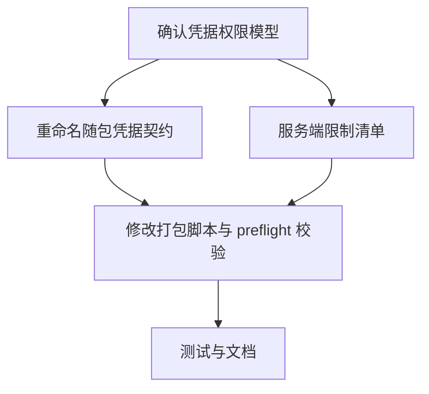

# DAG 01: Relay Bootstrap Credential Plan

> **For agentic workers:** 使用子代理驱动开发或执行计划逐节点执行。每个节点完成后更新状态并运行对应验证。

**Goal:** 在保留安装包开箱即用的前提下，证明并实现随包 relay 凭据不是 privileged secret。

**Architecture:** relay URL 可以内置；随包凭据必须被定义为 public/bootstrap credential，并由服务端限权、限流、可撤销。打包脚本和文档不得把 privileged API key 注入发布包。

**Tech Stack:** Go desktop preflight, shell packaging scripts, relay config `.env`, docs.

---

## 覆盖评审项

- P0-2：随包 relay 凭据属性未证明，当前按 privileged secret 泄露风险处理。
- P3-2：Linux 文档 relay env 说明依赖本计划结论。

## DAG



## Node A: 确认凭据权限模型

**Files:**
- Read: `scripts/package_macos.sh`
- Read: `scripts/package_linux.sh`
- Read: `internal/app/app.go`
- Modify: `docs/cc/t1/01-relay-bootstrap-credential.md` execution notes if needed

- [x] 明确当前 `SUPER_DOLPHIN_CODEX_RELAY_API_KEY` 是否能直接消费模型额度。
- [x] 明确该值泄露后的最大影响：额度、租户、用户数据、撤销方式。
- [x] 若它是 privileged secret，停止本计划后续“随包注入”路径，先设计 public/bootstrap token。

**验收:** 有书面结论：`privileged secret` 或 `public/bootstrap credential`。

## Node B: 重命名随包凭据契约

**Files:**
- Modify: `scripts/package_macos.sh`
- Modify: `scripts/package_linux.sh`
- Modify: `internal/app/app.go`
- Modify: `internal/provider/codexapp/codex_autoinstall.go`
- Test: `internal/app/desktop_preflight_test.go`
- Test: `internal/provider/codexapp/codex_autoinstall_test.go`
- Test: `scripts/package_macos_guard_test.go`

- [x] 将随包公开凭据命名改成 public/bootstrap 语义，例如 `SUPER_DOLPHIN_CODEX_RELAY_BOOTSTRAP_TOKEN`。
- [x] 保留对旧 env 的 fail-fast 检查：如果 release packaging 使用 privileged key 名称，直接失败。
- [x] desktop preflight 明确只接受 public/bootstrap credential；不把它记录到普通日志。
- [x] `CodexBootstrapConfig` 生成的 Codex `config.toml` 使用新的 bootstrap token env key，不再引用 privileged API key 名称。

**验收:** 脚本、preflight 和 Codex bootstrap config 不再把 privileged API key 名称作为发布包输入。

## Node C: 服务端限制清单

**Files:**
- Modify: `docs/运维发布/打包发布/embedded-postgres.md`
- Modify: `docs/cc/t1/01-relay-bootstrap-credential.md`

- [x] 文档列出 bootstrap credential 必须具备的服务端属性：低权限、限流、配额、可撤销、可轮换。
- [x] 附 relay owner 或服务端配置证明，说明 bootstrap token 不能直接消费 privileged 模型额度，不能访问租户/用户数据。
- [x] 写明没有服务端证明时 release packaging 必须 fail-fast，不能生成包含 token 的包。
- [x] 文档说明 relay URL 可内置，但 token 不是 secret 的前提条件。

**验收:** 文档不会指导把 privileged secret 写进 DMG/tarball；有服务端证明或自动化检查证明该凭据是 public/bootstrap credential。

## Node D: 修改打包脚本与 preflight 校验

**Files:**
- Modify: `scripts/package_macos.sh`
- Modify: `scripts/package_linux.sh`
- Modify: `internal/app/app.go`
- Modify: `internal/provider/codexapp/codex_autoinstall.go`
- Test: `internal/app/desktop_preflight_test.go`
- Test: `internal/provider/codexapp/codex_autoinstall_test.go`

- [x] packaging 从 public/bootstrap env 读取 token。
- [x] `.env` 写入 public/bootstrap token 和 relay URL。
- [x] preflight 缺一项时 fail-fast。
- [x] preflight 遇到旧 privileged env 名称时给出明确错误。
- [x] Codex bootstrap 写入的 `env_key` 与新 bootstrap token env 名称一致。

**验证命令:**

```bash
./scripts/test_with_guard.sh ./internal/app ./internal/provider/codexapp -count=1
go test ./scripts -run TestPackageMacOS -count=1
```

## Node E: 测试与文档

**Files:**
- Modify: `docs/运维发布/打包发布/embedded-postgres.md`
- Modify: `docs/运维发布/打包发布/macos-clean-vm-checklist.md`
- Test: `scripts/package_macos_guard_test.go`

- [x] macOS/Linux 文档使用 public/bootstrap 术语。
- [x] clean VM checklist 说明包内凭据可被用户读取，因此不能是 secret。
- [x] guard test 覆盖旧 env 名称不再作为 release packaging 输入。

**最终验收:** P0-2 可从“secret 泄露风险”降级为“public bootstrap credential 契约”；降级前必须有服务端限权/限流/撤销/轮换证明和代码测试覆盖。

## Execution notes — 2026-05-28

- 结论：随包凭据路径改为 `public/bootstrap credential`；旧
  `SUPER_DOLPHIN_CODEX_RELAY_API_KEY` 继续按 privileged secret 输入处理，
  不允许进入 release packaging 或 desktop preflight。
- 泄露影响边界：如果旧 privileged key 泄露，最大影响按模型额度、租户/
  用户数据访问与上游密钥轮换处理；新 bootstrap token 的可分发前提是 relay
  服务端把它限制为低权限、限流、有限配额、可撤销、可轮换，且不能直接映射
  到 privileged/admin 模型额度。
- 证明机制：release packaging 现在必须提供
  `SUPER_DOLPHIN_CODEX_RELAY_BOOTSTRAP_PROOF`，值为 relay owner attestation
  或服务端配置 ID；缺失时脚本 fail-fast，且该证明不会写入包内 `.env`。
- 自动化覆盖：Go preflight 测试覆盖新 env、旧 env fail-fast、缺项 fail-fast；
  Codex bootstrap 测试覆盖 `config.toml env_key` 使用新 bootstrap token env；
  script guard 测试覆盖 macOS/Linux 脚本不再从旧 privileged env 读取发布包 token。
