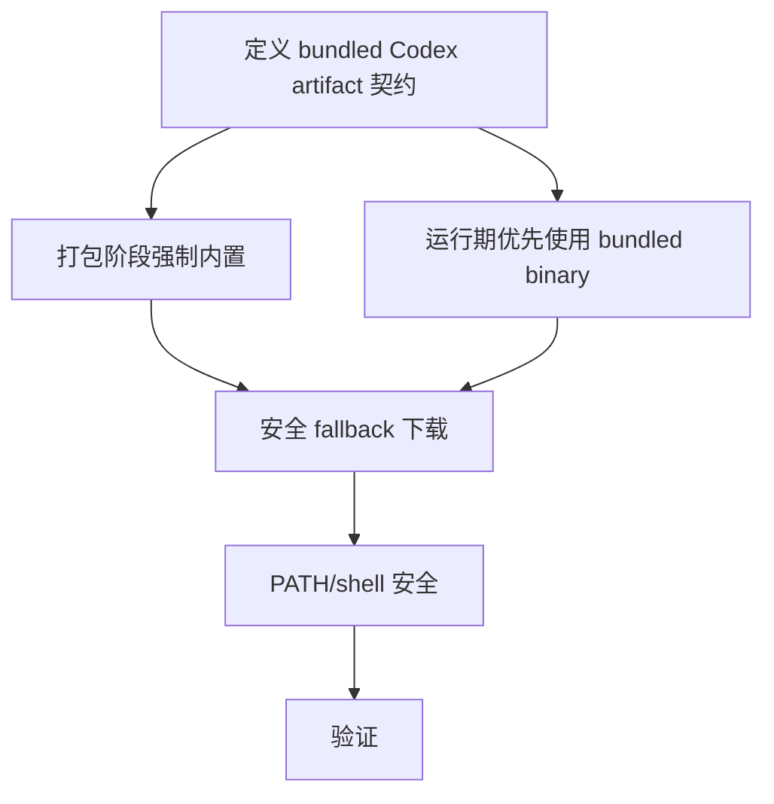

# DAG 02: Bundled Codex CLI Plan

> **For agentic workers:** 使用子代理驱动开发或执行计划逐节点执行。不要把首次启动 GitHub 下载作为开箱即用主路径。

**Goal:** Codex CLI 随包内置并可验证，运行期下载只作为安全 fallback。

**Architecture:** release 构建阶段选定 Codex CLI 版本并校验 checksum/signature，然后复制到 app resources。运行期优先使用 bundled binary；fallback 下载必须校验来源和完整性，且失败不能破坏 bundled Codex 可用性。

**Tech Stack:** shell packaging scripts, Go codex autoinstall/bootstrap, runtimeenv PATH, tests.

---

## 覆盖评审项

- P0-1：Codex 开箱即用路径不能依赖运行期网络下载，fallback 不能执行未校验二进制。
- P2-3：内部 shell wrapper 不应通过用户可写 PATH 解析 `sh`。

## DAG



## Node A: 定义 bundled Codex artifact 契约

**Files:**
- Modify: `docs/运维发布/打包发布/embedded-postgres.md`
- Modify: `scripts/package_macos.sh`
- Modify: `scripts/package_linux.sh`

- [ ] 指定 Codex CLI artifact 的版本、平台、pinned checksum 或签名来源；checksum/signature 必须来自可信锚，不能来自同一个未受信下载通道。
- [ ] 明确 release 构建必须提供 Codex CLI；不再把 GitHub 运行期下载作为主路径。
- [ ] 明确 `SUPER_DOLPHIN_REQUIRE_BUNDLED_CODEX=1` 是 release packaging 默认要求。

**验收:** 文档和脚本都表达“bundled first”。

## Node B: 打包阶段强制内置

**Files:**
- Modify: `scripts/package_macos.sh`
- Modify: `scripts/package_linux.sh`
- Test: `scripts/package_macos_guard_test.go`
- Test: `scripts/package_linux_guard_test.go`

- [ ] macOS packaging 没有显式指定且校验通过的 Codex artifact 时 fail-fast，而不是自动发现本机 `command -v codex` 或只打印 auto-install 提示。
- [ ] Release 模式禁止把 `/Applications/Codex.app/...` 或用户 PATH 中的本机二进制当作可信来源。
- [ ] Linux packaging 增加同等 Codex CLI copy/verify 逻辑。
- [ ] 打包前验证 pinned checksum 或签名；校验失败必须 fail-fast。
- [ ] 打包时记录 bundled Codex 版本/checksum 到资源 manifest。

**验证命令:**

```bash
go test ./scripts -run 'PackageMacOS|PackageLinux' -count=1
```

## Node C: 运行期优先使用 bundled binary

**Files:**
- Modify: `internal/platform/runtimeenv/runtimeenv.go`
- Modify: `internal/provider/codexapp/codex_autoinstall.go`
- Test: `internal/provider/codexapp/codex_autoinstall_test.go`

- [ ] runtime env 将 app resources 中的 `bin/codex` 放在查找优先级最高的受控路径。
- [ ] 当 bundled Codex 存在且可执行时，不触发网络下载。
- [ ] bundled Codex 不可执行时 fail-fast，错误指出打包资产损坏。

**验证命令:**

```bash
./scripts/test_with_guard.sh ./internal/platform/runtimeenv ./internal/provider/codexapp -count=1
```

## Node D: 安全 fallback 下载

**Files:**
- Modify: `internal/provider/codexapp/codex_autoinstall.go`
- Test: `internal/provider/codexapp/codex_autoinstall_test.go`

- [ ] fallback 只允许官方 HTTPS release endpoint，或显式配置的受信 mirror。
- [ ] 下载 asset 必须验证 checksum/signature。
- [ ] env override 不能在生产路径绕过来源校验。
- [ ] 下载失败只影响 fallback，不覆盖或删除 bundled binary。

**验收:** 非官方 URL、无 checksum、checksum mismatch 都失败且不会执行二进制。

## Node E: PATH/shell 安全

**Files:**
- Modify: `internal/provider/codexapp/process_unix.go`
- Test: `internal/provider/codexapp/pool_spawn_cmd_test.go`

- [ ] `exec.Command("sh", "-c", ...)` 改为绝对 `/bin/sh`。
- [ ] 区分内部解释器路径与 Codex 查找 PATH。
- [ ] 加测试覆盖用户目录中存在 `sh` 时不会被使用。

## Node F: 验证

**验证命令:**

```bash
./scripts/test_with_guard.sh ./internal/provider/codexapp ./internal/platform/runtimeenv -count=1
go test ./scripts -run 'PackageMacOS|PackageLinux' -count=1
make guard
```

**P0 packaged/offline 验收:**

- [ ] dry-run 或 package guard 断言包内存在 macOS `Contents/Resources/bin/codex` 和 Linux 对应 `bin/codex`。
- [ ] manifest 中有 Codex version 与 digest/signature。
- [ ] 测试证明 bundled path 存在时不会触发 HTTP 下载。
- [ ] 无网络环境安装后可启动 Codex；fallback 下载安全且不会破坏 bundled path。
