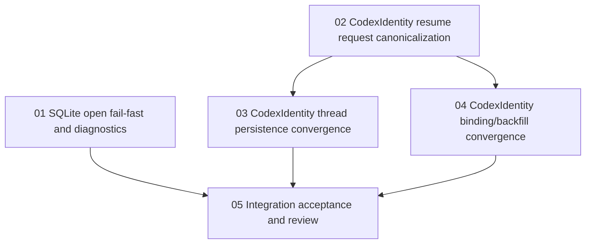

# MR !52 SQLite/CodexIdentity Bugfix Implementation Plan

> **For agentic workers:** REQUIRED SUB-SKILL: use `superpowers:subagent-driven-development` or repo-local `子代理驱动开发` to implement the task files under `docs/cc/数据库切换/bugfix/dags` one by one. Steps use checkbox syntax for tracking. Do not widen the bugfix beyond the reviewed MR !52 findings.

**Goal:** 修复 MR !52 评审确认的 SQLite 启动 fail-fast、SQLite 底层诊断一致性、CodexIdentity realpath 收敛问题，并给出可验收的小范围任务拆分。

**Architecture:** SQLite 修复放在 `internal/platform/db/sqlite` 打开期边界，确保配置层和 DB 打开层都 fail-fast 且路径脱敏。CodexIdentity 修复先建立 thread 内共享 canonicalization helper，再分别收敛 resume 请求、thread 持久化、binding/backfill 写入边界，统一复用 `contract.ResolveCodexIdentity()`。最终通过小任务 DAG 串联 SQLite 小修、CodexIdentity 三段收敛和集成验收。

**Tech Stack:** Go, `database/sql`, modernc SQLite driver, Super-Dolphin thread service, binding store, provider Codex identity contract, PowerShell guard/test wrappers on Windows.

---

## 评审修正摘要

按生产就绪性、性能、风险、可维护性和验收标准复审后，原计划有 5 个需要修正的点：

1. 生产就绪性不足：原计划说明了源码证据，但没有把“启动期必须阻断、不允许自动 chmod、不允许 fallback 到默认 Codex home、不允许路径泄露”写成硬验收。
2. 性能边界不清：`CodexIdentity.Home` realpath 规范化如果放在消息读取或列表查询热路径，会引入多余 filesystem stat；SQLite 写探测如果放在每次查询前也会放大启动外开销。
3. 风险边界不清：binding 已有非空 identity 时，不能用新请求任意覆盖 instance key/model provider；只能修正等价 realpath alias，字段冲突必须 fail-fast 或保持不可变错误。
4. 可维护性不足：thread 侧不能复制 provider driver 的零散逻辑，应集中到 thread 小 helper，并继续以 `contract.ResolveCodexIdentity()` 作为唯一契约入口。
5. 验收标准缺失：原计划只有命令建议，没有逐条说明 P1/P2/P3 什么结果算通过，也没有要求单 review 覆盖生产、性能、风险、安全、可维护性和测试充分性。

本文件已补齐上述约束，并把执行拆到 `docs/cc/数据库切换/bugfix/dags`。

## 源码追溯结论

### P1：SQLite 只读数据库 fail-fast

结论：真阳性，但当前表现有平台差异；Windows 已有防护，Unix/macOS 缺少显式已有 DB 写探测。

证据：

- `internal/platform/db/module.go` 的 `NewDB()` 直接调用 `sqlite.Open()`，启动生命周期迁移在打开 DB 之后才执行，因此打开阶段必须自己完成 fail-fast。
- `internal/platform/db/sqlite/open.go` 的 `Open()` 调用顺序是 `prepareFilesystem()`、`ensureDatabaseFile()`、`sql.Open()`、`PingContext()`、PRAGMA 配置。已有 DB 文件在 `ensureDatabaseFile()` 中直接返回，没有显式 `O_RDWR` 探测。
- `internal/platform/db/sqlite/open.go` 的 `validateExistingDatabasePath()` 只调用 `securefs.CheckExistingOwnerOnly()`。
- Windows 版 `internal/platform/securefs/owner_only_windows.go` 会拒绝非目录且 owner 不可写的 DB 文件，也会检查 ACL 当前用户写权限。
- Unix 版 `internal/platform/securefs/owner_only_unix.go` 只拒绝 group/world writable，不拒绝 `0400` 这种 owner read-only 文件。

上层防护：未发现比 `NewDB()` 更早的已有 DB 文件写权限探测。目录可写有 `ProbeWritableDir()`，但已有 leaf DB 写权限没有跨平台统一探测。

### P2：CodexIdentity realpath 与 thread 启动/恢复路径

结论：真阳性，且存在“provider 边界有晚期防护，但 thread 层仍可能持久化或匹配 raw alias”的缺口。

证据：

- `internal/contract/codex_identity.go` 明确要求 `CodexIdentity.Home` 必须由 `CanonicalizeCodexHome()` 得到 canonical realpath。
- `internal/provider/codexapp/driver.go` 和 `internal/provider/codexapp/driver_pool_routing.go` 在 provider 边界会 canonicalize `codexHome`。
- `internal/module/thread/start_session.go` 的 `hydrateResumeCodexIdentity()`、`resolveResumeRequest()` 只从 request、binding、runtime config 取首个非空值，没有 canonicalize。
- `internal/module/thread/start_session_helpers.go` 的 `mergeResumeBindingState()` 直接把 `binding.CodexHome` trim 后写入 `resumeState`。
- `internal/module/thread/lifecycle.go` 的 `persistResumedSession()` 以 `req.CodexHome`、`state.CodexHome`、`sessionRuntimeConfigString()` 的首个非空值持久化；如果 state/request 是 raw alias，会优先于 provider session 返回的 canonical runtime config。
- `internal/module/thread/binding_registration.go` 的 `bindingNeedsCodexIdentityUpdate()` 只允许空值首次填充，不会把已有 raw alias 更新为 canonical realpath。

上层防护：Codex provider 层有 late canonicalization；thread 层在恢复请求拼装、binding 校验、历史读取、持久化前没有统一 canonicalization，因此仍会留下 alias 路径影响去重、恢复匹配和历史文件定位。

### P3：SQLite 显式路径父级为普通文件的诊断

结论：作为“启动期 `SUPER_DOLPHIN_SQLITE_PATH`”问题不成立；作为 `NewDB()`/`sqlite.Open()` 直调的底层诊断一致性问题成立。

证据：

- `internal/platform/config/config.go` 的 `resolveSQLitePath()` 会先处理 `SUPER_DOLPHIN_SQLITE_PATH`，再进入 `validateSQLitePath()`。
- `validateSQLiteParent()` 明确检查父路径存在但不是目录的情况，并返回 `SQLite database parent is not a directory: <redacted:parent>`。
- `internal/platform/config/config_test.go` 已有 `TestResolveSQLitePathRejectsParentFileWithRedactedPath`，覆盖 env 显式路径父级为文件的启动配置错误。
- 但 `internal/platform/db/sqlite/open.go` 的 `prepareFilesystem()` 先调用 `validateExistingDatabasePath(clean)`；当父级是普通文件时，`os.Stat(clean)` 可能返回 `ENOTDIR`，错误会定位为 leaf DB path，尚未进入 `ensureParentDirectory(parent)` 的父路径检查。

上层防护：正常启动路径经由 `config.New()`，已有父路径诊断防护；绕过 config 直接构造 `config.Config{SQLitePath: ...}` 调 `NewDB()` 时，底层诊断仍不一致。

## 生产就绪标准

本 bugfix 只有同时满足以下条件才允许进入 ready-to-merge：

- SQLite 已有 DB 文件不可写时，`NewDB()` 在打开期返回错误，不等到后续 migration 或业务写入。
- SQLite DB 文件、父路径、错误包装都只输出 `securefs.RedactPath` 形式，不泄露完整用户路径。
- 显式无效路径、只读文件、父级为文件、父级不可写都 fail-fast，不自动 chmod 修复用户已有文件，不 fallback 到内存库、临时目录或旧 PG runtime。
- Codex resume/start 进入 provider 前，如果携带完整或部分 Codex identity，必须通过 `contract.ResolveCodexIdentity()`；部分 identity 不能被静默补成错误组合。
- thread 持久化的 `CodexHome`、binding 中的 `CodexHome`、runtime config 中的 `codexHome` 必须收敛到 canonical realpath。
- 已有 binding 的 instance key/model provider 非空且与新请求冲突时，不允许覆盖；只有同一个 identity tuple 的 home alias 可以被修正成 canonical realpath。
- 所有改动必须有同提交回归测试，且每个 Go 文件修改后先跑单文件 guard。

## 性能约束

- SQLite 写权限探测只允许发生在 `sqlite.Open()` 打开期，每次打开最多增加一次 `os.OpenFile(path, os.O_RDWR, 0)` 和 close，不进入查询、migration 循环或业务写路径。
- Codex home canonicalization 只允许发生在 start/resume 请求整理、auto-resume identity backfill、thread/binding 持久化这些冷路径，不允许放到 message page/list/history 每行读取循环。
- binding alias 比较可以对 existing home 做一次 `CanonicalizeCodexHome()`，但只能在即将决定是否持久化 binding 时执行，不允许批量扫描全部 binding。
- 新增测试不得依赖真实用户 home、大型 fixtures 或长时间 sleep；symlink 测试在 Windows 权限不可用时必须 skip。

## 风险与回滚边界

- SQLite 修复风险集中在 `internal/platform/db/sqlite/open.go` 检查顺序。回归必须覆盖缺失父目录仍可创建、父目录为文件报父路径、DB path 为目录仍报 leaf path、已有 DB 只读报 leaf path。
- CodexIdentity 修复风险集中在恢复旧 binding。实现必须区分“同一 identity 的 home alias 修正”和“instance key/model provider 冲突”，后者不能被合并。
- 不允许修改 provider pool identity 规则、SQLite migration schema、generated sqlc、历史 JSONL 文件布局。
- 若修复导致旧 alias binding 因 home 不存在而 fail-fast，这是符合契约的阻断；不得 fallback 到默认 app-managed Codex home。
- 本计划不处理 PG 到 SQLite 数据迁移，不处理 MR !52 以外的 dashboard、cron、DAG 或 packaging 问题。

## 可维护性约束

- 新增 thread helper 应放在 `internal/module/thread` 内的聚焦文件，例如 `codex_identity_canonical.go`，并只依赖 `contract.ResolveCodexIdentity()`。
- SQLite helper 应放在 `internal/platform/db/sqlite/open.go` 或同包小文件中，保持打开期路径检查集中。
- 测试命名必须直接描述回归，例如 `TestNewDBRejectsParentFileWithParentRedaction`、`TestResumeCanonicalizesSymlinkCodexHomeBeforeProvider`。
- 不要把 provider driver 的 canonicalization 复制到 thread；thread 只调用 contract 层。
- 不要手改 generated 文件，不要改 guard 阈值，不要更新 baseline 绕过失败。

## 验收标准

### P1 验收

- `NewDB(&config.Config{SQLitePath: existingReadOnlyDB})` 返回非 nil error。
- error 不包含完整 DB path，只包含 `<redacted:super-dolphin.db>` 或等价 redacted basename。
- 错误发生在 `sqlite.Open()` 打开期，不需要执行 migration 或业务 SQL 才暴露。
- Windows 当前 ACL/只读测试继续通过；Unix/macOS 源码路径通过显式 `O_RDWR` 探测。

### P2 验收

- 使用真实目录和 symlink alias 作为 `codexHome` 时，resume 发送给 provider 的 `CodexHome` 是 `filepath.EvalSymlinks` 后的 realpath。
- resume 的 `req.Config["codexHome"]`、thread runtime config、binding `CodexHome` 都是同一个 canonical realpath。
- 已有 binding 存 raw alias 且 instance key/model provider 与 incoming 相同时，会被修正为 canonical realpath。
- 已有 binding 的 instance key/model provider 与 incoming 不同，保持不可变冲突，不被覆盖。
- history 读取继续使用 binding 中的 `CodexHome`，但测试证明 binding 已在写入或 backfill 时 canonicalize。

### P3 验收

- `config.New()` 的 `SUPER_DOLPHIN_SQLITE_PATH=parentFile/secret.db` 仍报父路径 redacted 错误。
- 直接 `NewDB(&config.Config{SQLitePath: parentFile/secret.db})` 也报父路径 redacted 错误。
- error 不包含完整 parent path，不包含完整 leaf DB path。
- DB path 本身为目录时仍报 leaf DB path redacted 错误，不被父路径检查误吞。

### 验证命令

实现后至少运行：

```powershell
pwsh -NoProfile -ExecutionPolicy Bypass -File .\scripts\test_with_guard.ps1 internal/platform/db/sqlite/open.go
pwsh -NoProfile -ExecutionPolicy Bypass -File .\scripts\test_with_guard.ps1 internal/platform/db/module_config_test.go
pwsh -NoProfile -ExecutionPolicy Bypass -File .\scripts\test_with_guard.ps1 internal/module/thread/start_session.go
pwsh -NoProfile -ExecutionPolicy Bypass -File .\scripts\test_with_guard.ps1 internal/module/thread/lifecycle.go
pwsh -NoProfile -ExecutionPolicy Bypass -File .\scripts\test_with_guard.ps1 internal/module/thread/binding_registration.go
& 'C:\Program Files\Go\bin\go.exe' test ./internal/platform/db ./internal/platform/config -run 'NewDBRejects|ResolveSQLitePathRejectsParentFile|SQLitePath' -count=1
& 'C:\Program Files\Go\bin\go.exe' test ./internal/module/thread ./internal/provider/unified ./internal/provider/codexapp -run 'CodexIdentity|Resume|AutoResume|Pool|Start|Binding' -count=1
```

如果当前 Windows worktree 没有 `scripts/test_with_guard.ps1`，必须报告 skip reason，并运行可执行的 `gofmt`、focused `go test`、`git diff --check` 作为替代，不能在 PowerShell 里直接跑 `.sh`。

## 小范围任务 DAG

任务文档已落盘到 `docs/cc/数据库切换/bugfix/dags`：

- `README.md`：bugfix DAG、派发原则、单 review 要求。
- `01-sqlite-open-failfast-diagnostics.md`：P1 与 P3 的 SQLite 打开期 fail-fast 和父路径诊断。
- `02-codex-identity-resume-request-canonicalization.md`：P2 的共享 helper 与 resume 请求进入 provider 前 canonicalization。
- `03-codex-identity-thread-persistence-convergence.md`：P2 的 thread start/resume 持久化和 runtime config 收敛。
- `04-codex-identity-binding-backfill-convergence.md`：P2 的 binding alias 修正、auto-resume backfill 和历史读取输入收敛。
- `05-integration-acceptance-review.md`：全量验收、diff 复核、单 review checklist。

依赖顺序：



`01` 和 `02` 可并行；`03` 与 `04` 都依赖 `02`，二者修改范围不重叠，可并行；`05` 依赖 `01`、`03` 和 `04`。

## 已执行验证

当前只做追溯和计划/任务文档修正，未改 Go 代码。

已在当前 Windows 环境执行：

```powershell
& 'C:\Program Files\Go\bin\go.exe' test ./internal/platform/db -run 'NewDBRejectsReadOnly|NewDBRejectsUnwritable|RejectsParentFile|RejectsDirectory' -count=1
```

结果：通过。

说明：该结果证明当前 Windows 分支的 SQLite 相关既有窄测通过；P1 的缺口来自非 Windows 源码路径缺少显式已有 DB 写探测，仍需按任务 01 补回归测试和实现。
