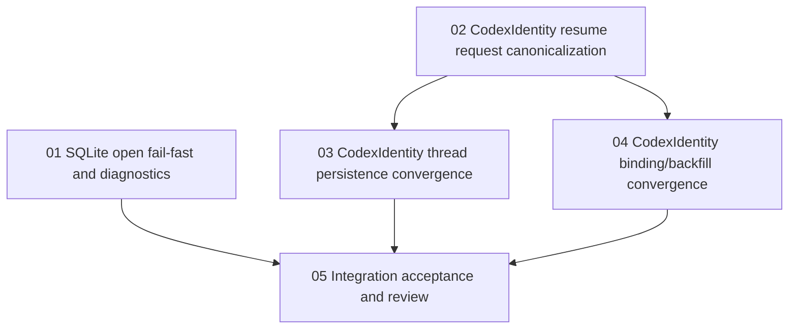

# MR !52 Bugfix 任务 DAG

来源计划：`docs/cc/数据库切换/bugfix/2026-06-16-mr52-sqlite-codex-identity-bugfix-plan.md`

集成 worktree：`.worktrees/bugfix-sqlite-codex-identity-mr52`

目标：只修 MR !52 评审确认的 SQLite 打开期 fail-fast/诊断和 CodexIdentity realpath 收敛问题，不扩大到其他 SQLite 切换遗留项。

## 派发原则

- 每个任务只能在自己的 task worktree 中实施，不要多个任务共用同一个 worktree。
- 每个 codeagent 开始前必须读本 README、总计划、对应任务文档和任务列出的源码。
- 涉及 Go 文件时，每改完一个 Go 文件先运行单文件 guard。Windows PowerShell 使用 `pwsh -NoProfile -ExecutionPolicy Bypass -File .\scripts\test_with_guard.ps1 <file.go>`；如果当前 worktree 没有 `.ps1` 入口，必须报告 skip reason 并运行真实可执行的替代验证。
- 不允许 silent fallback，不允许自动 chmod 修复用户已有 DB/Codex home，不允许路径泄露。
- 不允许手改 generated 文件，不允许修改 guard 阈值，不允许更新 baseline 绕过失败。
- 每个任务完成后必须拉起一个 reviewagent。该 reviewagent 必须覆盖生产就绪性、性能、风险、安全、可维护性、回滚风险和任务验收标准。
- reviewagent 未通过时，当前 codeagent 停止交付；新 codeagent 接手同一任务 worktree，修复后重新跑验收并重新单评审。

## DAG

## 并行波次

Wave 1：`01` 和 `02` 可并行。二者修改文件不重叠，分别覆盖 SQLite 底层和 thread CodexIdentity 入口 helper/request 边界。

Wave 2：`03` 和 `04` 都依赖 `02`，且可并行。`03` 只改 thread start/resume 持久化和 runtime config；`04` 只改 binding 注册、auto-resume backfill 测试和历史读取输入收敛。两者不得互相修改对方文件。

Wave 3：`05` 依赖 `01`、`03` 和 `04`。该任务只做验收、扫描、单 review 整理，不应再新增业务修复。

## 修改范围总表

| Task | 允许修改 | 禁止修改 |
| --- | --- | --- |
| 01 | `internal/platform/db/sqlite/open.go`、`internal/platform/db/module_config_test.go` | config env 优先级、SQLite migration、generated 文件 |
| 02 | `internal/module/thread/codex_identity_canonical.go`、`internal/module/thread/start_session.go`、`internal/module/thread/start_session_helpers.go`、resume/codex identity request tests | binding 注册、lifecycle 持久化、provider driver |
| 03 | `internal/module/thread/lifecycle.go`、thread codex identity persist/resume tests | `binding_registration.go`、provider unified、SQLite open |
| 04 | `internal/module/thread/binding_registration.go`、`internal/module/thread/binding_registration_test.go`、必要的 `internal/provider/unified/session_resolver_auto_resume*_test.go` | `lifecycle.go`、provider codexapp pool/driver、SQLite open |
| 05 | 文档化验收记录；如需修代码必须退回对应任务 | Go 业务代码、generated 文件、migration、guard baseline |

## 任务文档

- `01-sqlite-open-failfast-diagnostics.md`
- `02-codex-identity-resume-request-canonicalization.md`
- `03-codex-identity-thread-persistence-convergence.md`
- `04-codex-identity-binding-backfill-convergence.md`
- `05-integration-acceptance-review.md`
