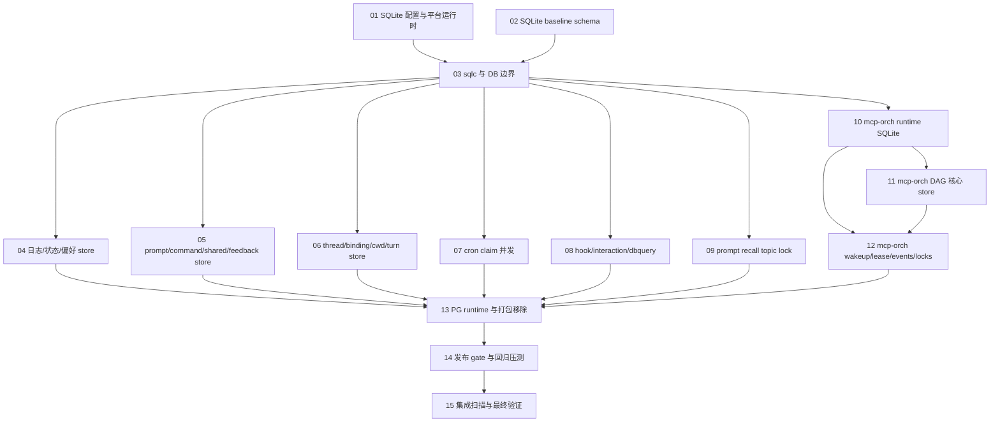

# SQLite 切换任务 DAG

来源规格：`docs/cc/数据库切换/postgres-to-sqlite-switch-review-2026-06-11.md`

集成 worktree：`.worktrees/sqlite-switch-integration`

目标：把 PostgreSQL / embedded PostgreSQL 产品运行时硬切到本地 SQLite，不做旧 PG 数据迁移，且在发布 gate 通过前不得进入 RC。

源码追溯裁决：执行任何任务前先读 `00-source-trace-risk-review.md`。该文件把每个风险点反查到当前源码，并标注为什么没有上层防护可以替代任务修复。

## 派发原则

- 每个任务文档都是可复制给 agent 的自包含提示词。
- 一个任务只能对应一个专属 task worktree；禁止多个任务共用同一个 task worktree，也禁止只开分支直接在集成 worktree 里改代码。
- 一个 task worktree 只能由一个 codeagent 根据对应任务文档实施代码修改；codeagent 不得顺手实现其他任务文档的范围。
- task worktree 修改完成并跑完本任务验收命令后，必须拉起两个彼此独立的 reviewagent 审查同一个 worktree diff。
- 两个 reviewagent 都必须覆盖生产就绪性、性能、风险、安全、可维护性、回滚风险、测试充分性，并逐条确认任务文档里的验收标准已满足。
- 任何一个 reviewagent 未通过时，当前 codeagent 停止交付；必须新开一个 codeagent 在同一个 task worktree 接手修改，并基于 reviewagent 反馈重新运行任务验收。
- 新 codeagent 修改完成后，必须重新拉起两个彼此独立的 reviewagent 审查该 task worktree 的完整 diff；不允许复用上一轮 reviewagent 的通过结论。
- 双 reviewagent 通过后，才允许在 task worktree 用中文 commit message 提交该任务改动，然后合并回集成分支 `codex/sqlite-switch-integration`。
- 每个 task worktree 的生命周期必须用 `mcp-go-agent-orchestration` 记录：创建任务节点、启动 codeagent、记录验收命令、启动两个 reviewagent、记录 review 结论；若未双通过，记录新 codeagent 接手、修复验收、重新双评审；双通过后记录 commit 与 merge 结果。
- Go 文件每次改完后先跑单文件守卫：`./scripts/test_with_guard.sh <file.go>`。
- `internal/store/sqlc/**` 与 `cmd/mcp-orch/store/sqlc/**` 是共享生成物，任何任务都不得手改。单个任务可以本地生成用于编译验证，但最终提交的 generated diff 只能由串行 sqlc finalize 检查点统一产生。
- 不允许静默兜底：配置缺失、PRAGMA 未生效、schema 版本不足、SQLite lock 重试耗尽都必须 fail-fast。
- 不做 PG -> SQLite 历史数据迁移；旧 PG data dir 只能被忽略或在文档中说明清理方式。
- `DATABASE_URL` / `POSTGRES_CONNECTION_STRING` 在产品运行时不得作为 DB 配置源，也不得继续透传给 sidecar/provider 当作数据库依赖。

## Task Worktree 流程

1. 从集成分支 `codex/sqlite-switch-integration` 为单个任务创建专属 worktree，命名建议：`.worktrees/sqlite-switch-task-XX-<slug>`。
2. codeagent 只读取 `README.md`、`00-source-trace-risk-review.md`、对应 `XX-*.md` 任务文档，以及任务明确要求的源码；实施修改前先记录计划和预期验收。
3. codeagent 完成本任务修改后，运行任务文档列出的验收命令；涉及 Go 文件时同时遵守单文件守卫和受影响 package 测试。
4. reviewagent A 与 reviewagent B 分别独立审查 task worktree 的全部 diff 和验收输出，不共享审查结论。
5. 只要任一 reviewagent 不通过，当前 codeagent 不再继续改该 worktree；新开 codeagent 接手同一 task worktree，修复后重新运行验收，并重新执行第 4 步双评审。
6. 只有两个 reviewagent 都明确给出“通过，可以合并”时，才允许提交；commit message 必须为中文，建议格式：`sqlite切换：完成任务XX <任务名>`。
7. commit 后把 task 分支合并回 `codex/sqlite-switch-integration`，再在集成分支运行冲突面相关的最小验证；有冲突或验证失败时按未双通过处理，重新开 codeagent 接手修复并再走双评审。

## DAG

## 并行波次

Wave 0：`01`、`02` 可以并行；`03` 等两者落地后执行。

Wave 1：`04`、`05`、`06`、`07`、`08`、`09` 可并行，但必须基于 `03` 的 DB/sqlc 接口；不要各自改写同一层抽象。

Wave 1.5：串行 root sqlc finalize，由集成者在 `04` 到 `09` 合并后运行 `make sqlc-generate && make sqlc-verify`，统一解决 `internal/store/sqlc/**` drift。

Wave 2：`10` 先做 mcp-orch SQLite 注入；`11` 与 `12` 在 `10` 后可分工，`12` 依赖 `11` 的核心 DAG schema/store 类型。

Wave 2.5：串行 mcp-orch sqlc finalize，由集成者在 `11` 与 `12` 合并后运行 `make sqlc-generate && make sqlc-verify`，统一解决 `cmd/mcp-orch/store/sqlc/**` drift。

Wave 3：`13` 移除 PG runtime/packaging 残留；`14` 和 `15` 做发布 gate、压测与最终扫描。

## 任务文档

- `00-source-trace-risk-review.md`
- `01-sqlite-platform-config.md`
- `02-sqlite-schema-baseline.md`
- `03-sqlc-db-boundary.md`
- `04-main-store-logs-status-preferences.md`
- `05-main-store-assets-feedback.md`
- `06-main-store-thread-binding-locks.md`
- `07-cron-claim-concurrency.md`
- `08-hook-interaction-dbquery.md`
- `09-prompt-recall-topic-lock.md`
- `10-mcp-orch-runtime-sqlite.md`
- `11-mcp-orch-dag-core-store.md`
- `12-mcp-orch-wakeup-lease-events-locks.md`
- `13-pg-runtime-packaging-removal.md`
- `14-release-gates-regression-smoke.md`
- `15-integration-final-scan.md`
