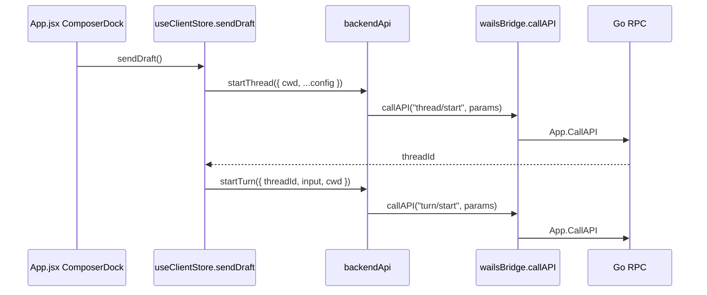

# super-agent-v3 代码地图：终端入口与 UI 层（当前 React/Vite 新 UI）

> 范围：`frontend-app/`
> 关联后端卷：[`01-terminal-ui-go.md`](01-terminal-ui-go.md)；prompt/thread 写链看 [`07-module-write.md`](07-module-write.md) 与 [`11-prompt-thread.md`](11-prompt-thread.md)。
> 维护提示：这是当前桌面新 UI 的页面代码。`cmd/agent-terminal` 仍是 Wails/HTTP/RPC 宿主，但 `run-new-ui-desktop.sh` 会通过 `VITE_DEV_URL` 把页面代理到 `frontend-app` Vite dev server。

## 1. 当前入口与启动链

- 一键启动脚本：`run-new-ui-desktop.sh`
  - `FRONTEND_APP_DIR="$PROJECT_DIR/frontend-app"`
  - 启动 `frontend-app` 的 Vite dev server。
  - 再运行 `go run ./cmd/agent-terminal`，由 Wails host 代理 `VITE_DEV_URL`。
- 页面入口：`frontend-app/src/main.jsx`
- 应用主壳：`frontend-app/src/App.jsx`
- 样式入口：`frontend-app/src/styles.css`
- 嵌入产物目录：`cmd/agent-terminal/web-dist/`，由 `frontend-app/scripts/sync-frontend-dist.mjs` 从 `frontend-app/dist` 同步。
<!-- codemap-absent path="cmd/agent-terminal/web-dist" -->
<!-- codemap-absent path="frontend-app/dist" -->

## 2. 文件地图

| 路径 | 角色 | 修改时优先看 |
|---|---|---|
| `frontend-app/src/App.jsx` | React app shell、导航、chat workspace、composer、timeline、modal | 页面结构、交互、消息渲染、执行计划展示 |
| `frontend-app/src/entities/client/model/useClientStore.js`、`runtimeSlice.js` | Zustand store、bootstrap、事件订阅、thread list、composer、preferences、send actions | 状态流、订阅就绪、历史恢复、`sendDraft()`、provider/cwd fail-fast |
| `frontend-app/src/shared/api/backendApi.js` | 后端 RPC facade 与 payload 校验 | RPC 方法名、参数 shape、cwd/threadId 校验 |
| `frontend-app/src/shared/api/wailsBridge.js` | Wails runtime bridge、event subscription、日志回传 | `/wails/runtime.js`、`callAPI()`、bridge event |
| `frontend-app/public/wails/runtime.js` | Vite 开发环境 Wails WebSocket shim | `/wails/ws`、断线重连、`wails:loaded` 恢复通知 |
| `frontend-app/src/pages/chat/components/ChatPageHeader.jsx` | Chat 标题栏与 bootstrap 错误恢复入口 | 显式“重新连接后端”、重试中禁用 |
| `frontend-app/src/features/prompts/PromptPageView.jsx` | Prompt 页面视图 | prompt 列表、编辑、向导弹层 |
| `frontend-app/src/shared/ui/FocusTrapDialog.jsx` | 共享弹层 focus trap | modal 可访问性、Escape/Tab 行为 |
| `frontend-app/src/styles.css` | 全局视觉样式 | shell、toolbar、chat、timeline、弹层样式 |

## 3. 运行与验证命令

```bash
./run-new-ui-desktop.sh
```

当前新 UI 改动的前端验证：

```bash
cd frontend-app
npm run lint
npm test
npm run build
```

旧 Vue/package-embed 前端已删除；当前前端验证只跑 `frontend-app` 的 lint/test/build。

## 4. Chat / Thread 当前链路



关键点：

- blank-thread 首发仍是 `thread/start -> turn/start` 两段式。
- “继承当前对话”走 `sessionApi.fork({ threadId }) -> thread/fork`；响应必须是 `created_only`，随后只发送一次 `turn/start` kickoff。不得退回摘要式 `thread/start`。
- fork kickoff 的共享文件使用 `filecontent` input；RPC response 与 `thread.Started`/UI patch 无论谁先到，都按同一 thread identity 去重合并，事件中的运行时字段优先。
- `backendApi.js` 对 cwd、threadId 等关键参数保持 fail-fast。
- 历史消息与 timeline 可见性在 `useClientStore.js` 标准化和过滤。
- 前端执行计划、reasoning/tool/timeline 渲染集中在 `App.jsx`。

## 5. Bootstrap 与事件就绪

```text
bootstrap()
  -> initializeEvents() single-flight
  -> bridge-event ready + wails:loaded ready（全有或全无）
  -> config/window/provider/sidebar RPC
  -> applySnapshot(..., preserveLiveBusyStatus=true)
  -> bootstrapStatus=ready
```

- `initializeEvents()` 以 generation 保护 pending/committed unsubscribe；任一订阅 `false` 或 reject 时清理本轮全部订阅并拒绝，`destroy()` 会使迟到 readiness 失效。
- listener 必须在首个 bootstrap RPC 前 ready。启动期间先到的 live running 状态不会被随后返回的 stale idle sidebar 快照覆盖。
- 失败复用唯一的 `bootstrapStatus/error`，Chat header 提供有限、显式的重试；没有后台无限重试或静默兜底，失败/重试中 composer 与附件动作保持禁用。
- 开发 shim 首次正常 WebSocket open 不发送恢复通知；只有初连失败或已连接后断线的下一次成功 open，才为该重连周期发送一次本地 `wails:loaded`。

## 6. 路径判断规则

- 问“当前页面在哪里改”：先看 `frontend-app/src/App.jsx`、`useClientStore.js`、`backendApi.js`。
- 问“Wails 桌面宿主怎么加载页面”：看 `run-new-ui-desktop.sh` 与 `internal/ui/wails/assets.go`。
- 问“没有 VITE_DEV_URL 时嵌入什么”：看 `cmd/agent-terminal/frontend.go`、`cmd/agent-terminal/web-dist` 和 `frontend-app/scripts/sync-frontend-dist.mjs`。
- 不要因为桌面进程仍是 `cmd/agent-terminal`，就把当前 React 页面误判到 Go host 目录。
