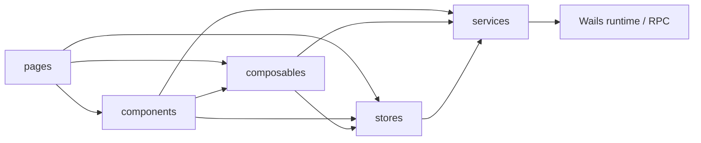
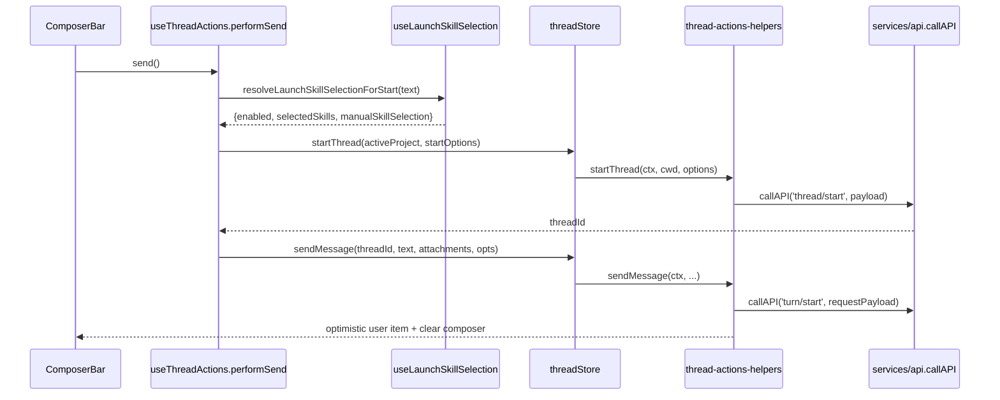

# super-agent-v3 代码地图：终端入口与 UI 层（Vue 前端）

> 范围：`cmd/agent-terminal/frontend/vue-app/`
> 关联后端卷：[`01-terminal-ui-go.md`](01-terminal-ui-go.md)；backend contract / module-local 窄端口看 [`04-app-contract.md`](04-app-contract.md)
> 维护提示：本卷仅维护 Vue 入口、页面、store 与 composable；58f19fa 接口隔离未改前端入口，后端端口归属不要在本卷展开。

## 1. 入口与总装点

- 应用挂载从 `main.js:6-17` 开始，`bootstrap()` 最终 `createApp(AppRoot).mount('#app')`。
- 根组件 `AppRoot` 负责页面切换、事件订阅、项目作用域下发与 chat/dashboard bootstrap（`app.js:115-389`）。
- 聊天工作台总装点在 `pages/UnifiedChatPage.js:247-530`，模板出口在 `pages/UnifiedChatPage.template.js:1-203`。
- 系统桥统一收口在 `services/api.js:195-289`；技能 RPC 薄封装在 `services/skills-api.js:3-14`。

## 2. 五层职责切片

| 层 | 职责切片 | 代表锚点 |
|---|---|---|
| `services/` | 唯一系统桥；封装 Wails by-ID / RPC、技能 API、日志回传；不持有页面响应式状态。 | `services/api.js:195-289`, `services/skills-api.js:3-14` |
| `stores/` | 全局状态中心；负责 snapshot/live patch、thread action、project scope、composer 输入。 | `stores/threads.js:36-151`, `stores/projects.js:14-209`, `stores/composer.js:5-307`, `stores/thread-prefs.js:37-190` |
| `composables/` | 把页面交互拆成 orchestration 单元；连接 store 与 view，不直接持有模板。 | `composables/useThreadActions.js:179-449`, `composables/useLaunchSkillSelection.js:53-281`, `composables/useSkillPreview.js:19-250`, `composables/useThreadSelection.js:16-91` |
| `components/` | 视图与 emit 边界；负责局部渲染、局部交互、少量近边界系统调用。 | `components/ChatTimeline.js:18-279`, `components/LaunchSkillPicker.js:22-140`, `components/unified-chat/WorkspaceChatPanel.js:7-91`, `components/DiffPanel.js:257-458` |
| `pages/` | 页面级编排、依赖装配、跨组件时序控制；把 stores/composables/components 组装成完整工作台。 | `app.js:115-389`, `pages/UnifiedChatPage.js:247-530`, `pages/UnifiedChatPage.template.js:1-203` |



- 主路径是 `pages -> composables/stores/components`；不存在反向依赖。
- 近系统边界例外是 `components/DiffPanel.js:5,214,257,271`：组件自身会直接拿 `useProjectStore()`，并调用 `ui/code/save`。

## 3. 核心 store / 状态字段职责

### 3.1 `threads`（`stores/threads.js:36-151`）

| 字段 | 职责 | 主要读写方 |
|---|---|---|
| `activeThreadId` / `activeCmdThreadId` | chat/cmd 双模式当前选中 thread 指针。 | `stores/thread-actions-helpers.js:172-192`, `pages/UnifiedChatPage.js:330-339` |
| `pinnedThreadAtById` / `archivedThreadAtById` | thread rail 排序、筛选、归档显示的本地 UI 元数据。 | `stores/thread-actions-helpers.js:539-611` |
| `threads` / `statuses` / `interruptibleByThread` | sidebar 卡片列表、toolbar stop 按钮、状态门控的基础 runtime 快照。 | `stores/threads.js:37-38`, `composables/useThreadStatus.js:20-57` |
| `viewPrefsChat` / `viewPrefsCmd` | 后端偏好快照；派生 layout、splitRatio、cardCols。 | `stores/threads.js:38`, `stores/thread-prefs.js:119-175` |
| `statusHeadersByThread` / `statusDetailsByThread` | ChatToolbar 主状态文本与细节文案来源。 | `stores/threads.js:39`, `composables/useThreadStatus.js:35-108` |
| `overlayTextByThread` / `overlayTypeByThread` / `overlayPriorityByThread` | 线程卡片 overlay/runtime 提示层。 | `stores/threads.js:39`, `stores/thread-snapshot.js:48-85` |
| `timelinesByThread` | ChatTimeline 主数据源；承接 snapshot/live patch/history hydrate/optimistic item。 | `stores/threads.js:40`, `stores/thread-snapshot.js:191-253`, `stores/thread-actions-helpers.js:447-458` |
| `diffTextByThread` / `diffRevisionByThread` | DiffPanel 正文与 lazy sync revision 对账。 | `stores/threads.js:40`, `stores/thread-diff-sync.js:52-131` |
| `tokenUsageByThread` | token inline/tooltip 与 compact 结果基线。 | `stores/threads.js:41`, `composables/useThreadStatus.js:48-78` |
| `agentMetaById` / `agentRuntimeById` / `mainAgentId` / `mainAgentState` | provider/runtime/capabilities/copy thread info 的运行态来源。 | `stores/threads.js:41`, `composables/useThreadActions.js:26-38`, `composables/useCopyThreadInfo.js:26-178` |
| `activityStatsByThread` / `alertsByThread` / `skillRevision` | ActivityPanel 指标、alerts、技能目录变更后的预览刷新触发器。 | `stores/threads.js:42`, `stores/thread-sync-helpers.js:345-357`, `composables/useSkillPreview.js:216-221` |

### 3.2 `projects`（`stores/projects.js:14-209`）

| 字段 | 职责 | 主要读写方 |
|---|---|---|
| `projects` | 已注册项目根目录列表。 | `stores/projects.js:34-42,167-196` |
| `active` | 当前项目作用域；驱动 thread scope、代码预览 scope、launch cwd。 | `stores/projects.js:34-42,64-73`, `app.js:165-176,324-335` |
| `showModal` | 添加项目弹窗显示态。 | `stores/projects.js:17,100-111` |
| `modalPath` | 弹窗内待确认目录。 | `stores/projects.js:18,100-152` |
| `browsing` | 原生目录选择器进行中态。 | `stores/projects.js:19,113-139` |

### 3.3 `preferences`（`stores/thread-prefs.js:37-190`）

| 字段 | 职责 | 主要读写方 |
|---|---|---|
| `preferenceWriteQueueByKey` | 同 key 偏好串行写入，避免并发覆盖。 | `stores/thread-prefs.js:37,72-118` |
| `preferenceScopeCwd` | 把活动项目 cwd 注入 `ui/preferences/*` 与相关 sync 请求。 | `stores/thread-prefs.js:38,45-70`, `app.js:286-288,324-329` |
| `viewPrefsChat.layout/splitRatio/threadRailWidth` | chat 页面布局、split、thread rail 宽度的远端偏好切片。 | `stores/thread-prefs.js:119-166` |
| `viewPrefsCmd.layout/splitRatio/cardCols` | cmd 视图布局、split、卡片列数的远端偏好切片。 | `stores/thread-prefs.js:123-175` |

### 3.4 `composer`（`stores/composer.js:5-307`）

| 字段 | 职责 | 主要读写方 |
|---|---|---|
| `text` | composer 文本输入。 | `stores/composer.js:5-16`, `composables/useThreadActions.js:133-170` |
| `attachments` | 本地文件 / 图片附件列表，发送时转成 `input[]`。 | `stores/composer.js:7,28-149,224-280`, `stores/thread-actions-helpers.js:391-417` |
| `attaching` | 原生文件选择器进行中态。 | `stores/composer.js:8,101-122` |

### 3.5 `skill-local`（页面局部态）

| 字段 | 职责 | 主要读写方 |
|---|---|---|
| `composerSkillMatches` / `composerSelectedSkillNames` | 当前 thread 内的技能建议与手动勾选集合。 | `composables/useSkillPreview.js:26-95,181-206` |
| `launchAvailableSkills` | blank-thread 可选技能目录。 | `composables/useLaunchSkillSelection.js:61-64,126-140` |
| `launchSkillMatches` / `launchManualSkillNames` | 首发技能匹配结果与手动勾选集合。 | `composables/useLaunchSkillSelection.js:62-65,97-124,142-226` |
| `launchSkillSelectionEnabled` / `launchSkillSelectionLoading` | 首发技能开关与目录/预览加载态；直接驱动 `LaunchSkillPicker`。 | `composables/useLaunchSkillSelection.js:66-72`, `pages/UnifiedChatPage.template.js:129-140` |

## 4. 关键 composable：输入 → 行为 → 副作用

| 符号 | 输入 | 行为 | 副作用 |
|---|---|---|---|
| `useThreadActions` | `threadStore`、`projectStore`、`selectedThreadId`、`composer`、技能选择 resolver（`pages/UnifiedChatPage.js:151-169`） | 组装 `launchOne/send/interrupt/compact/recover/openNewWindow`。 | 调 `thread/start`、`turn/start`、`turn/interrupt`、`ui/openNewWindow`；清空/恢复 composer，更新选中 thread，alert/log（`composables/useThreadActions.js:120-449`）。 |
| `useSkillPreview` | `composer`、`selectedThreadId`、`skillRevision`（`pages/UnifiedChatPage.js:350-366`） | 对已有 thread 做技能预览、防抖、force/manual 合并。 | 调 `skills/match/preview`，更新局部 refs，记录 warn/debug（`composables/useSkillPreview.js:19-250`）。 |
| `useLaunchSkillSelection` | `composer`、`selectedThreadId`、`featureSource`、`activeCwdSource`（`pages/UnifiedChatPage.js:88-116`） | 对 blank-thread 拉目录、预估技能匹配、生成 launch `startOptions`。 | 调 `services/skills-api.listSkills/previewSkillMatches`，在 `threadId/text/skillRevision/cwd` 变化时重置或刷新本地选择（`composables/useLaunchSkillSelection.js:53-281`）。 |
| `useTimelineItems + useTimelineHelpers` | `props.items/pinnedPlan*` + `approvalRequestId/commandTitle`（`components/ChatTimeline.js:65-113`） | 过滤/折叠 timeline、生成角色/状态/plan spec/copy helpers。 | 记录 fallback key/perf 日志，触发 clipboard copy（`components/timeline/useTimelineItems.js:69-177`, `components/timeline/useTimelineHelpers.js:37-317`）。 |

- caller xref：`useThreadActions` 仅由 `pages/UnifiedChatPage.js:152` 调用；`useLaunchSkillSelection` 仅由 `pages/UnifiedChatPage.js:109` 调用；timeline 能力入口是 `components/ChatTimeline.js:74,109`。

## 5. UnifiedChatPage 首发时序与 feature flag

### 5.1 blank-thread 首发时序（`pages/UnifiedChatPage.js:151-169` → `composables/useThreadActions.js:120-173`）



- 固定顺序是 `resolveLaunchSkillSelectionForStart -> startThread -> sendMessage`：`performSend()` 在拿到新 `threadId` 前不会下发 `turn/start`（`composables/useThreadActions.js:137-163`, `stores/thread-actions-helpers.js:288-318,380-463`）。
- 首发技能选择来自 `createPageLaunchSkillSelection()` 装配的 `useLaunchSkillSelection()`（`pages/UnifiedChatPage.js:88-116,367-379`）；模板侧由 `LaunchSkillPicker` 与 `ComposerBar` 同时消费（`pages/UnifiedChatPage.template.js:129-178`）。
- 已有 thread 的续发路径会跳过 `startThread()`，改走 `resolveComposerSkillSelectionForSend()` 合并 force/manual 技能选择（`composables/useThreadActions.js:146-162`, `composables/useSkillPreview.js:181-206`）。

### 5.2 `launchSkillSelectionEnabled` 合并链路

```mermaid
flowchart LR
  TF[threadStore.state.features?.launchSkillSelection] --> R[resolveLaunchSkillSelectionFeature()]
  PF[projectStore.state.features?.launchSkillSelection] --> R
  R --> E[launchSkillSelectionEnabled]
  R --> F[fallback false]
  E --> P[LaunchSkillPicker v-if]
  E --> C[ComposerBar legacy selector gate]
```

- merge 顺序固定为 `threadStore.state.features.launchSkillSelection -> projectStore.state.features.launchSkillSelection -> false`，判定逻辑集中在 `resolveLaunchSkillSelectionFeature()`（`pages/UnifiedChatPage.js:101-109`, `composables/useLaunchSkillSelection.js:14-29,66-70`）。
- UI 消费点有两个：`LaunchSkillPicker` 的 `v-if` 与 props 透传（`pages/UnifiedChatPage.template.js:129-140`），以及 `ComposerBar` 的 legacy selector gate（`components/ComposerBar.js:16,79-88`）。
- **现状差异**：`stores/threads.js:36-43` 与 `stores/projects.js:14-20` 都未声明 `state.features`；当前实现依赖 optional chaining，因此未注入额外 runtime state 时默认回落到 `false`。

## 6. 关键数据流补记

- **事件驱动状态刷新**：`app.js:247-302` 先订阅 `onAgentEvent/onBridgeEvent/onAppWillQuit`，再做 bootstrap；事件最后汇入 `stores/threads.js:61-92` 组装的 sync manager。
- **Diff lazy sync**：`composables/useDiffPreview.js:6-171` 消费 `threadStore.getThreadDiff()`；真正的 revision 对账在 `stores/thread-diff-sync.js:52-131`。
- **File ref / citation 预览**：`composables/useFileRefPreview.js:27-233` 与 `composables/useFileRefPreview.helpers.js` 负责从 timeline/citation 跳到 DiffPanel；模板触发点在 `pages/UnifiedChatPage.template.js:103-120`。
- **生命周期副作用**：`composables/usePageLifecycle.js:18-42` 统一接入 Escape、原生文件拖放、provider 偏好加载与卸载清理；接线点在 `pages/UnifiedChatPage.js:472-479`。

## 7. 文档 / 代码现状差异

1. 用户任务里写的 `useSkillSelection`，源码实际对应 `composables/useSkillPreview.js:19-250`。
2. 用户任务里写的 `useTimeline`，源码实际拆成 `components/timeline/useTimelineItems.js:93-177` 与 `components/timeline/useTimelineHelpers.js:283-317`。
3. `launchSkillSelectionEnabled` 的 merge 链会读取 `pages/UnifiedChatPage.js:101-109` 中的 `threadStore.state.features` / `projectStore.state.features`，但 `stores/threads.js:36-43`、`stores/projects.js:14-20` 当前都没有声明该字段。

## 8. C19 补遗：blank-thread 首发技能三件套

### 8.1 `LaunchSkillPicker` / `useLaunchSkillSelection` / `skills-api`

| 文件 | 锚点 | 职责 |
|---|---|---|
| `components/LaunchSkillPicker.js` | `components/LaunchSkillPicker.js:22-140` | blank-thread 专用技能面板；合并 `matches + skills` 生成 `skillEntries`，把 `matchedBy === 'force'` 标为 `autoApplied` 并禁用取消，向外只发 `toggle-skill/select-all/clear/refresh`。 |
| `composables/useLaunchSkillSelection.js` | `composables/useLaunchSkillSelection.js:21-29,53-281` | 首发技能编排器；负责 feature merge、技能目录拉取、preview 防抖、manual/force 合并，以及 `resolveLaunchSkillSelectionForStart()` 产出 launch `startOptions`。 |
| `services/skills-api.js` | `services/skills-api.js:3-14` | 技能 RPC 薄封装；`listSkills(cwd)` -> `callAPI('skills/list', { cwd })`，`previewSkillMatches()` -> `callAPI('skills/match/preview', ...)`。 |

- `LaunchSkillPicker` 由 `pages/UnifiedChatPage.template.js:129-146` 在 `launchSkillSelectionEnabled && !selectedThreadId` 条件下挂载，和已有 thread 的 composer preview 是两条链路。
- `useLaunchSkillSelection()` 的 blank-thread 本地状态是 `launchAvailableSkills / launchSkillMatches / launchManualSkillNames / launchSkillSelectionLoading`；目录刷新、preview、start 前最终解析都集中在这一处（`composables/useLaunchSkillSelection.js:61-72,126-226`）。

### 8.2 `ComposerBar` legacy selector gate

- `ComposerBar` 的 `showLegacySkillSelector` 不是单纯看 feature flag：只有 **blank-thread + `launchSkillSelectionEnabled=true`** 时才隐藏 legacy selector；已有 thread 即使开关打开也继续显示旧 selector（`components/ComposerBar.js:77-83`）。
- 因而模板层形成双轨：blank-thread 走 `LaunchSkillPicker`，已有 thread 继续走 `ComposerBar` 内部的 legacy selector / composer preview。

### 8.3 blank-thread 首发发送顺序补丁

- `performSend()` 在 blank-thread 固定先跑 `resolveLaunchStartPayload()`，再 `threadStore.startThread()`，最后才 `threadStore.sendMessage()`；中间仅在成功拿到 `threadId` 后执行一次 `clearLaunchSkillSelection()`（`composables/useThreadActions.js:139-158`）。
- `resolveLaunchStartPayload()` 自身会把 `focusMode` 固化到 `startOptions`，并仅在 `enabled && (selectedSkills.length > 0 || manualSkillSelection)` 时把 `selectedSkills/manualSkillSelection` 带进 `thread/start`（`composables/useThreadActions.js:100-118`）。

## 9. C19 补遗：SystemPromptPage 结构化 404 fallback

### 9.1 `isReadonlyFallbackListError()` 判定口径

| 条件 | 锚点 | 说明 |
|---|---|---|
| `status == 404` | `pages/SystemPromptPage.js:71-72` | 接受 `status/statusCode` 数值化后的 404。 |
| `code == -32601` | `pages/SystemPromptPage.js:73` | 接受 number 或可转 number 的 `-32601`。 |
| `name in {method_not_found, notfounderror}` | `pages/SystemPromptPage.js:74-75` | 先经 `normalizeFallbackErrorToken()` 标准化，再做白名单匹配。 |
| `code == method_not_found` | `pages/SystemPromptPage.js:76-77` | 仅补一条结构化 code-name 兜底。 |

- **禁止 `message` fuzzy match**：`pages/SystemPromptPage.js` 当前没有 `message.includes(...)` 分支；只认上表的结构化字段。
- `loadPrompts()` 仅在命中该 detector 时进入只读降级；普通报错仍走 `load.failed` + `setNotice('error', ...)`（`pages/SystemPromptPage.js:218-239`）。

### 9.2 readonly 列表回填链路

- `hydrateReadonlyPrompts()` 直接调 `callAPI('dashboard/prompts', { cwd: resolveReadonlyFallbackCwd(props) })`，命中只读旁路后写回 `promptCards` 并把 `fallbackSource` 标成 `dashboard/prompts`（`pages/SystemPromptPage.js:197-205`）。
- `resolveReadonlyFallbackCwd(props)` 优先取 `threadStore.state.cwd`，否则退到 `projectStore.state.cwd`；因此 fallback 列表和主聊天页 scope 并不强绑定 `projectStore.state.active`（`pages/SystemPromptPage.js:35-37,199-203`）。

## 10. 测试入口 + how-to 补记

### 10.1 测试入口

- `use-thread-actions.test.js:230-267`：验证 blank-thread 首发会先解析 launch skill，再 `startThread`，最后把同一组 `selectedSkills/manualSkillSelection` 复用于 `sendMessage`。
- `composer-bar.behavior.test.js:159-173`：验证 `launchSkillSelectionEnabled` 只在 blank-thread 隐藏 legacy selector；已有 thread 保持显示。
- `unified-chat-component.test.js:370-388`：验证 launch skill catalog 请求会带活动 cwd。
- `system-prompt-page.behavior.test.js:65-175`：验证 `message-only user not found` 不触发 fallback，结构化 404 会进入 readonly + `dashboard/prompts` hydrate。
- `app-root.behavior.test.js:131-159` + `thread-store.runtime-bridge-e2e.test.js:90-147`：验证 `onBridgeEvent` 订阅装配与 bridge patch 入 store 的端到端链路。

### 10.2 how-to（页面 / 事件）

- **页面**：新增 page/tab 时，前端最少要补 `pages/*.js` 页面组件、`app.js` 的 `import + components` 注册、`NAV_ITEMS` 与 `refreshDashboardByPage(targetPage)` 对应 `page key`；回归入口优先看页面自己的 `*.behavior.test.js`，再看 `app-root.behavior.test.js` 的装配层。
- **事件**：新增后端事件进 UI 时，前端接线固定是 `services/api.onBridgeEvent/onAgentEvent` -> `app.js bootstrap()` -> `threadStore.handleBridgeEvent()/handleAgentEvent()`；UI 侧回归入口优先看 `thread-store.runtime-bridge-e2e.test.js`，上游桥接入口见关联后端卷 `01-terminal-ui-go.md`。
