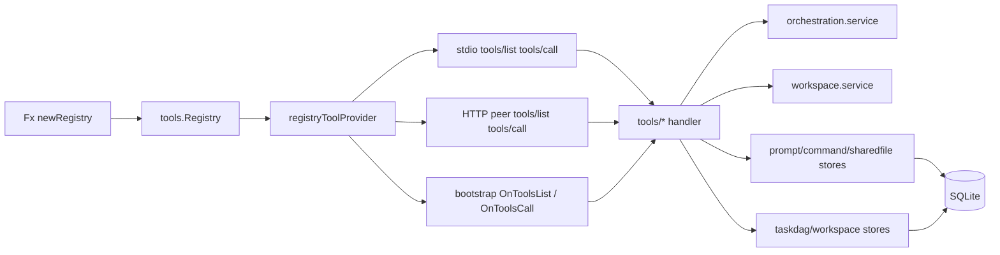

# mcp-orch 代码地图

> 当前导航边界：本卷描述 `cmd/mcp-orch` 的职责与装配结构；依赖方向和运行契约以源码、同包测试、`docs/契约/mcp-service-convention.md`、`docs/契约/onion-architecture-convention.md` 和生成的第 13 卷边界规则为准。历史迁移计划只用于追溯，不覆盖当前事实。

## 1. 模块概述

`cmd/mcp-orch` 是 `super-agent-v3` 的编排侧车 / peer 服务，核心职责可归纳为 5 类：

1. **Agent 编排**：维护 agent 生命周期、状态机、turn 队列、停止 / 恢复、report 请求者等内存态。
2. **MCP 工具出口**：把 orchestration / task DAG / workspace / prompt / command card / shared file 能力注册进 `tools.Registry`，再通过 stdio / HTTP MCP 与 bootstrap `OnToolsList` / `OnToolsCall` 暴露给 Claude 或主控代理；当前 registry 不含 memory tools。
3. **包级 JSON-RPC handler 映射**：定义 `agent.*`、`task/dag/*`、`workspace/run/*` 等 handler map；它们不是 Claude 侧 MCP tools，是否暴露取决于外层 Fx / RPC 组合。
4. **持久化层**：维护 DAG / wakeup / worker lease / workspace run / shared file / prompt / command card 等 SQLite 数据；SQLite 路径由主进程解析后通过内部配置传入，`DATABASE_URL` / `POSTGRES_CONNECTION_STRING` 不作为 mcp-orch DB 配置。
5. **peer / bootstrap 桥接**：在 peer 模式下注册到主控、订阅 hooks，并把远端 thread/state/turn/runtime 事件回灌到本地编排内存态；`tools/list` / `tools/call` 也会经 bootstrap 回调代理到同一份 registry。

### 作为 MCP server 暴露给 Claude 的方式

- `main.go`
  - 保存原始 `stdout` 到 `mcpStdout`。
  - 把普通 `os.Stdout` 重定向到 `stderr`，防止日志污染 MCP JSON-RPC 流。
  - 把 `GOMAXPROCS` 上限压到 2，避免轻量 sidecar 空转占 CPU。
- `fx.go`
  - 组装 Fx app。
  - 注入 store / workspace / orchestration / registry / bootstrap / stdio runner / http runner。
  - 根据 `GO_AGENT_CTL_RPC_ADDR` 选择 `localLauncher` 或 `remoteLauncher`。
- `runtime.go`
  - `newLogger(cfg *platformconfig.Config)`：默认写 `/tmp/mcp-orch-<pid>.log`。
  - `newQueries(db *sql.DB)`：使用主进程提供的 SQLite `*sql.DB` 初始化 sqlc 查询器；不从 PostgreSQL DSN 创建连接池。
  - `newRegistry(p newRegistryParams)`：构造运行时 `tools.Registry`；`toolPortsFromRegistryParams()` 先拆出各 tool 需要的窄端口，再交给 `tools.NewRegistry()` 汇总 orchestration / task / workspace / prompt / command / shared_file，当前 registry 不含 memory tools。
  - `registryToolProvider`：把 `tools.Registry` 适配为 `common.ToolProvider`；stdio MCP、HTTP MCP、bootstrap `OnToolsList` / `OnToolsCall` 都复用这层 `ListTools` / `CallTool` 出口。
  - `newStdioRunner()`：基于 `common.NewServer("mcp-orch", "dev", transport, provider)` 启动 stdio MCP。
  - `newBootstrapRunner(cfg bootstrap.Config, client *bootstrap.Client)` / `bootstrapRunner.Run(ctx)`：runner 总是被加入 runner group，但只有在 `GO_AGENT_PEER_MODE=1` 且 `GO_AGENT_CTL_RPC_ADDR` 非空时才真正向控制面注册；否则只是阻塞等待 ctx 结束。
  - `bindRuntime()`：把 stdio / HTTP / bootstrap runner 注入同一个 `platformrunner.RunGroup` 生命周期。
  - 还包含 `newNoopSessionCleaner()` / `newNoopTurnStarter()`，作为 standalone / 测试兜底实现。
- 记忆工具边界
  - `internal/module/memory/module.go:456-465` 导出 `AgentMemoryReader/Writer`，`internal/platform/toolbridge/memory_read_tool.go:14-74` 与 `internal/platform/toolbridge/module.go:84-123` 负责 host-direct 暴露。
  - `runtime_memory_test.go:8-17` 和 `tools/memory_tools_test.go:5-12` 锁定本 peer 不注册 `memory_read` / `memory_write`。
- `http_runner.go`
  - 仅在 `GO_AGENT_PEER_MODE=1` 时启用 `common.NewHTTPServer`。
  - 监听 `127.0.0.1:0`，并把地址写入 peer discovery file。
  - 非 peer 模式返回 `blockRunner`，仅阻塞等待上下文结束。
- `buildBootstrapConfig()`
  - 给控制面注册 `OnToolsList` / `OnToolsCall`，使主控可代理调用本服务工具；底层直接复用 `registryToolProvider`。
  - 声明能力：`tools/orchestration`、`tools/task`、`tools/workspace`、`tools/prompt`、`tools/command`、`tools/shared_file`；当前不声明 `tools/memory`。
  - 配置 `OnShutdown`、`OnConfigChanged`、`FinalReport`、`Hooks.OnAfter`。

### 与第 11 卷的边界

- 本卷聚焦 `cmd/mcp-orch` 的编排侧车、registry、bootstrap 与 tool 暴露；`memory / prompt / thread snapshot` 的跨模块语义请结合 `11-memory-prompt-thread.md` 阅读。
- `cmd/mcp-orch` 当前**没有直接 import** `internal/module/{memory,prompt,thread}`；它消费的是 `internal/contract`、`store/*`、`internal/mcpserver/common/bootstrap` 这些边界层，因此这里描述的是“暴露 / 注入 / 存储读取”，不是第 11 卷那种“语义组装 / 生命周期编排”。
- `prompt_list` / `prompt_get` 读取的是 `cmd/mcp-orch/store/prompt` 里的 prompt template 资源，不等于 `internal/module/prompt` 的 system prompt assembly。
- `memory_read` / `memory_write` 现由 app host-direct toolbridge registry 暴露并调用 `internal/module/memory` 的窄 contract；本卷只记录 `cmd/mcp-orch` 不再持有 memory tool registry / handler。
- `UpdateRuntime()` 作为编排内存态的收口点仍在本卷说明；但 provider 何时上报 runtime、thread/session 如何消费这些元数据，属于第 11 卷与 provider/runtime 侧共同关注的链路。

### 运行组合关系

`mcp-orch` 的“传输方式”和“agent 启动后端”是两条正交维度，不能简单合并成一个模式表：

| 维度 | 条件 | 实现 |
|---|---|---|
| MCP 传输 | 默认 | stdio MCP |
| MCP 传输 | `GO_AGENT_PEER_MODE=1` | stdio MCP + HTTP MCP |
| bootstrap 注册 | `GO_AGENT_PEER_MODE=1` 且 `GO_AGENT_CTL_RPC_ADDR` 非空 | 向主控注册并订阅 hooks |
| agent 启动后端 | `GO_AGENT_CTL_RPC_ADDR` 为空 | `localLauncher`，本地拉起进程 |
| agent 启动后端 | `GO_AGENT_CTL_RPC_ADDR` 非空 | `remoteLauncher`，经主控 RPC 调 `thread/start` / `turn/start` / `thread/stop` |

> 也就是说：**即便不是 peer 模式，只要设置了 `GO_AGENT_CTL_RPC_ADDR`，stdio sidecar 也会改用 `remoteLauncher`**；只是 bootstrap / HTTP runner 不会启动。

---

## 2. 目录结构

### 顶层

- `cmd/mcp-orch/main.go`：保护 stdout 的 MCP 通道，限制 `GOMAXPROCS`。
- `cmd/mcp-orch/fx.go`：Fx 装配入口；拼装 store、workspace、orchestration、launcher、bootstrap、runner。
- `cmd/mcp-orch/runtime.go`：logger / SQLite sqlc queries / registry / stdio runner / bootstrap runner / runtime 绑定。
- 记忆工具不属于本 peer：`runtime_memory_test.go:8-17` 与 `tools/memory_tools_test.go:5-12` 锁定 registry 不注册 `memory_read` / `memory_write`；当前实现位于 `internal/module/memory` 与 `internal/platform/toolbridge`。
- `cmd/mcp-orch/http_runner.go`：peer 模式 HTTP MCP server、peer discovery file、非 peer 模式阻塞 runner。
- `cmd/mcp-orch/hook_subscription.go`：hook topic 常量与 `subscribeOrchestrationHooks()` 辅助函数；主启动路径未直接调用，主要被测试覆盖。
- `cmd/mcp-orch/sqlc.yaml`：`sql/queries/*` 到 `store/sqlc/*` 的 sqlc 生成配置。
- 顶层测试：`fx_test.go`、`runtime_test.go` 覆盖 Fx 装配与 bootstrap runner 行为。

### `orchestration/`

- `service.go`：模块导出、`service` 主体、Fx provider、turn / approval 生命周期订阅。
- `launcher.go`：`AgentLauncher` 接口；`localLauncher` 与 `remoteLauncher` 两种实现。
- `launch_helpers.go`：launch 请求归一化、端口 / provider 推断、`SubmissionQueue`。
- `service_launcher_bridge.go`：launch / stop / submit 在 service 与 launcher 之间的桥接层。
- `process_lifecycle.go`：`runnerActor`、进程退出监控、session 清理、stall 检测与恢复入口。
- `helpers.go`：状态机辅助、`BindActiveTurnID`、session-ready 等待、本地进程启动、快照列举。
- `turn_lifecycle.go`：turn 完成 / 中断 / 用户输入审批的状态流转与兜底修复。
- `hook_consumer.go`：bootstrap `after` hooks 消费器；同步 thread/state/turn/item/process 事件。
- `runtime.go`：runtime port/provider 上报、provider 归一化、snapshot 组装。
- `report.go`：agent report 聚合、`report_seq`/`updated_at` 版本化、report requester 跟踪、终态事件判定与 drain；report 文件由 `reportstore/` 用 Markdown front matter 持久化版本元数据，老纯文本按 `report_seq=0` 兼容读取。
- `dag.go`：DAG create/get/list/update 的 service 层映射，兼容旧 JSON 字段别名；Phase 3.5w 起 `UpdateNodeStatus` 在 `status="done"` 分支 type-assert `taskdag.NodeFlowStore` 走 `CompleteNodeAndScheduleDownstream` 自动入队下游 wakeup（不能 type-assert 时回退旧路径，兼容 mock store 测试）。**F4.1**（commit `13a81828` + merge `e89f9231`）起 `ApplyOps` add_node 真实业务实装：OCC 双重护栏（pre-check + bump 失锁 post-check）+ Kahn 环检测（`nodeexec/cycle.go` 的 `DetectCycle`）+ `applyTypedOps` helpers；**F4.2**（commits `7611c268` `65c977d8` `848f1188` + merge `d63a623d` + fix `6f333dd1`）起 `ApplyOps` update_node 真实业务，同批 add+update 串行执行、节点 status 门禁（done 节点不可改 config）；**F6.3**（commits `34240412` `05d93f96` + merge `7f51b91e`）起 `UpdateNodeStatus` done 分支走 store 同事务 `PromoteSingleNodePendingToReady`。
- `dag_query.go`：DAG / Run / node 读查 + `applyTypedOps` 节点读 helpers；**F1.5** 起 task_get_dag DTO 透出 `spawning_thread_id`（commit `61d41a7a`）。
- `nodeexec/` 子包：executor / typed ops / inputs / 环检测实现集中地。
  - `nodeexec/cycle.go`：Kahn 环检测 `DetectCycle`（F4.1 / commit `f716aa5c`），返回 `CycleError` 携 `NodeKeys`。
  - `nodeexec/ops.go`：typed ops payload + `NodePatch` strict UnmarshalJSON + `AssignedTo` 字段位（F4.2 / commit `7611c268`）。
  - `nodeexec/plan.go`：`PlanUpdateNodes` 纯函数预算 update_node patch + 节点 status 防御（F4.2 / commit `65c977d8`）；不碰 store。
  - `nodeexec/inputs.go`：`RunContext` + `InputsConfig` 沉淀 + `BuildPromptPrefix`（F1.2 / commit `3317b00f`）；AgentExecutor / AutomationExecutor 共用。
  - `nodeexec/executor_agent.go`：AgentExecutor；F1.1 解码 exec、F1.2 注入 inputs、**F1.5** spawn 成功后调 `NodeSpawnRecorderStore.RecordNodeSpawn` 写回 `spawning_thread_id`（commit `2c2e0044`）。
  - `nodeexec/executor_automation.go`：AutomationExecutor；F2.1 解码 command_ref + F2.2 处理 inputs/outputs（commit `3d8526ab` + merge `4dd5307a`）。
- `retry_strategy.go`：Phase 3.5 / F1.4 helper —— 把 DAG metadata `schedule.{default_retry, fail_fast}` + node `config.execution.retry` 解析为 `RetryPolicy{MaxAttempts, FailFast}`，并把 F1.4 transient/quota/validation 基础重试收敛到 dispatcher retry/fail 决策。
- `rpc.go`：编排 JSON-RPC handler 映射；把 RPC 参数转成 `contract` 请求。
- `rpc_types.go`：RPC 入参结构与旧字段兼容（如 `agentId` / `dagKey` / `selectedSkills` / `outputSchema`）。
- `events.go`：封装 state / launched / stopped / recovering / failed / runtime / stalled / resumed 事件发布。
- `factory.go`：事件 DTO 封装、agent 读写锁辅助、状态切换底层工具、legacy alias 解码。
- `recover.go`：agent 恢复与基于 DAG wakeup 的 turn replay。
- `wakeup_dispatcher.go`：Phase 3.1/3.2/3.5w/3.9 wakeup dispatcher。10s ticker 调 `taskdag.Store.ClaimDueWakeups` 拿到一批 `dispatching` wakeup，按 `buildLaunchRequestFromWakeup` 解 `taskdag.DownstreamWakeupPayload`（3.9 起把 `UpstreamOutputs` 的路径列表渲染成中文 prompt 注入下游 launch），调 `WakeupLauncher.LaunchAgent`；成功 → `MarkWakeupSent`；失败按 1.8b `classifyLaunchError` 分 transient/permanent，DAG-driven wakeup（DagKey/NodeKey 非空）走 `tryDAGFailWithCascade` → `resolveDAGRetryPolicy(GetDAG metadata + ListNodes node config → ResolveRetryPolicy)`，AttemptCount ≥ MaxAttempts 时 `markPermanentFail` + `FailNodeAndCancelDownstream(FailFast)`；非 DAG wakeup 走旧 `RetryWakeup`/`FailWakeup`。`buildLaunchRequestFromWakeup` 解不出 DownstreamWakeupPayload 时 fallback 到老式 `LaunchRequest` 形状（兼容手工 enqueue / 测试）。
- `wakeup_reclaim.go`：Phase 3.3 wakeup lease 过期回收。独立 30s ticker 调 `taskdag.Store.ReclaimStaleDispatchingWakeups`，把 lease 过期的 `dispatching` wakeup 回收为 `pending`；与 dispatcher 解耦，store 错误不退出 loop（DB 抖动由下次 tick 吸收）。
- 测试文件：`execution_test.go`、`hook_consumer_test.go`、`launcher_test.go`、`recover_test.go`、`rpc_golden_test.go`、`runtime_report_test.go`、`runtime_test.go`、`stop_test.go`、`submission_test.go`、`turn_lifecycle_test.go`、`user_input_test.go`、`wakeup_dispatcher_test.go`（dispatcher 决策分支 + 3.9 prompt 注入 4 case）、`wakeup_reclaim_test.go`（lease 过期回收 9 case）、`dag_complete_downstream_test.go`（service.UpdateNodeStatus done 分支 type-assert 路由 3 case）、`retry_strategy_test.go`（ResolveRetryPolicy + F1.4 failure-class retry 策略）；`testdata/golden/turn-agent/rpc_samples.golden.json` 是 RPC golden fixture。

### `tools/`

- `types.go`：`ToolDefinition`、`Schema`、常用 JSON Schema 构造器。
- `factory.go`：通用 handler 工厂、依赖检查、raw JSON 编码、list limit 规范化、not-found 翻译。
- `registry.go`：把各类 tool definition 汇总到 `Registry`。
- `orchestration_tools.go`：agent 启动 / 发消息 / 停止 / 枚举 / report 工具。
- `task_tools.go`：DAG 工具；`schedule` / `execution` 仍编码进 DAG metadata / node config JSON。
- `workspace_tools.go`：workspace create/get/list/merge/abort 工具。
- `workspace_tool_compat.go`：把 workspace service 输出适配成 MCP 兼容 DTO，补 `workspace_root` / `files_merged` / `finished_at` 等字段。
- `prompt_tools.go`：prompt template list/get 工具；走通用 resource tool builder。
- `command_tools.go`：command card list/get 工具；带固定 list limit（50）。
- `shared_file_tools.go`：shared file read/write MCP 工具；保留 10 MiB 内容上限；read 走 `sharedfilepath.ValidateReadPath`，write 走 `sharedfilepath.ValidateAgentWritePath`；3.7 起不再持有本地路径 normalize 逻辑。
- `memory_tools.go`：当前仅保留 package 壳，不定义或注册 `memory_read` / `memory_write`。
- 测试文件：`handler_regression_test.go`、`orchestration_tools_test.go`、`parity_v2_test.go`、`workspace_tools_compat_test.go`。

### `workspace/`

- `contract.go`：workspace service 接口、请求 / 结果类型、legacy JSON 兼容。
- `event.go`：workspace 领域事件定义。
- `factory.go`：文件复制、原子写回、symlink 防护、merge 评估、RPC 校验辅助。
- `module.go`：Fx module，可导出 workspace service 与 workspace RPC handlers；`cmd/mcp-orch/fx.go` 当前是手动 `fx.Provide` workspace service，没有直接引入这个 module。
- `rpc.go`：workspace JSON-RPC 方法映射。
- `rpc_types.go`：workspace RPC 参数类型与旧字段兼容。
- `service.go`：workspace run 生命周期主逻辑。
- `service_delete_removed.go`：`delete_removed=true` 时的删除候选构建。
- `service_dry_run.go`：dry-run merge 路径。
- `service_helpers.go`：相对路径校验、hash、事件发送、merge 统计、持久化与回滚。
- `service_merge.go`：真正的文件写回 / 删除、失败收敛、最终状态迁移。

### `store/`

- `commandcard/contract.go`：command card 读写契约与 version 结构。
- `commandcard/module.go`：Fx provider。
- `commandcard/store.go`：`command_cards` / `command_card_versions` 读写与映射。
- `prompt/contract.go`：prompt template 读写契约与 version 结构。
- `prompt/module.go`：Fx provider。
- `prompt/store.go`：`prompt_templates` / `prompt_template_versions` 读写，支持事务 `WithTx()`。
- `sharedfile/contract.go`：shared file 读写契约。
- `sharedfile/module.go`：Fx provider；从 `*platformconfig.Config` 派生 `sharedfilefs.Config{CWD: ProjectRoot, InlineThresholdBytes: 100KB}` 注入 store。
- `sharedfile/store.go`：Phase 3.6 起改为磁盘 source / DB 索引 —— Upsert 走 `internal/platform/sharedfilefs.WriteAtomic` 落盘 `<cwd>/.agnet/shared/<path>`，正文超 InlineThresholdBytes 时 DB content 写空串；Get 磁盘命中覆盖 DB content（保留 DB 元数据），磁盘 miss fallback DB；Delete 双层删；List 不扫磁盘；写盘前 best-effort 调用 `sharedfilegitignore.Ensure` 追加 `.agnet/shared/_internal/` 到 `<cwd>/.gitignore`。Config.CWD 空 → 整体退化 DB-only。所有路径走 `internal/platform/sharedfilepath` 校验。
- `taskdag/contract.go`：DAG / node / wakeup / worker lease 的完整持久化接口。
- `taskdag/factory.go`：通用 query helper、interval 解析、wakeup fencing 辅助。
- `taskdag/module.go`：Fx provider。
- `taskdag/store.go`：DAG / node CRUD、running node 绑定、灵活状态更新、事务封装。
- `taskdag/store_lease.go`：worker lease 抢占 / 续约 / 释放。
- `taskdag/store_wakeup.go`：wakeup 入队 / claim / sent / retry / fail / bind turn / reclaim / 查询。
- `taskdag/*_test.go`：`scan_helpers_test.go`、`store_fencing_test.go`、`test_helpers_test.go`，覆盖 wakeup fencing、running node turn 绑定与 fake DB 扫描。
- `workspace/contract.go`：workspace run / file 的持久化契约。
- `workspace/module.go`：Fx provider。
- `workspace/store.go`：`workspace_runs` / `workspace_run_files` 的 upsert / list / get / CAS 状态迁移。
- `workspace/*_test.go`：`store_test.go`、`test_helpers_test.go`，覆盖 workspace store 的 query 参数和扫描。
- `sqlc/`：sqlc 生成层。
  - `db.go`：`Queries` 与 `DBTX`。
  - `db_ext.go`：事务辅助 `WithTx()` / `WithTxOrReuse()`。
  - `types_ext.go`：pgtype/time/string/int64 转换。
  - `models.go`：生成模型。
  - `command_card.sql.go`、`prompt_template.sql.go`、`shared_file.sql.go`、`workspace_run.sql.go`：资源 / workspace SQL 的 Go 封装。
  - `task_dag_dag.sql.go`、`task_dag_node_read.sql.go`、`task_dag_node_write.sql.go`、`task_dag_node_runtime.sql.go`、`task_dag_wakeup_dispatch.sql.go`、`task_dag_wakeup_query.sql.go`、`task_dag_worker_lease.sql.go`：DAG / wakeup / lease SQL 的 Go 封装。
  - `task_ack.sql.go`：已生成但尚未接入手写 store / tool 包装。

### `sql/queries/`

- `README.md`：说明哪些 SQL 与仓库根目录同名，需要双边同步。
- `command_card.sql`：command card 查询与 version 历史。
- `prompt_template.sql`：prompt template 查询与 version 历史。
- `shared_file.sql`：shared file 查询。
- `workspace_run.sql`：workspace run / file 查询与状态迁移。
- `task_dag_dag.sql`：DAG 主表 CRUD / `FOR UPDATE`。
- `task_dag_node_read.sql`：node 读取、按 assignee 查 running node、`FOR UPDATE` 读取。
- `task_dag_node_write.sql`：node upsert 与通用状态更新。
- `task_dag_node_runtime.sql`：running node turn 绑定、事件 touch，以及带状态前置约束的运行时更新（`pending` gated update、`running` gated update、`running|awaiting_verify` complete）。
- `task_dag_wakeup_dispatch.sql`：wakeup 入队、claim、mark sent、bind turn、retry、fail。
- `task_dag_wakeup_query.sql`：stale reclaim、sent-unbound / pending-or-dispatching 查询、单条读取。
- `task_dag_worker_lease.sql`：worker lease 抢占、续约、释放。
- `task_ack.sql`：task ack SQL；当前已生成 sqlc，但还没有对应手写 store/tool 包装。

---

### `internal/platform/sharedfile*`（跨包共享）

sharedfile 三个 leaf helper 包不在 `cmd/mcp-orch/` 树下，但同时被 mcp-orch store 与桌面端 `internal/store/sharedfile` 复用，故在此一并登记：

- `internal/platform/sharedfilepath/policy.go`：Phase 3.7 路径校验。`ValidateWritePath`（白名单 handoff/ dag/ inbox/ reports/ _internal/ + traversal/absolute reject）/ `ValidateAgentWritePath`（当前等同 `ValidateWritePath`）/ `ValidateReadPath`（仅 traversal/absolute；不强制白名单以兼容历史行）+ 4 个 sentinel error（`ErrPathEmpty` / `ErrPathAbsolute` / `ErrPathTraversal` / `ErrPathPrefixNotAllowed`）。
- `internal/platform/sharedfilefs/disk.go`：Phase 3.6 disk primitive。`Config{CWD, InlineThresholdBytes}`（CWD 空 → 上层退化 DB-only） / `ResolveAbs` 二次 sandbox 边界 / `WriteAtomic`（mkdir + tmp + fsync + rename + 目录 fsync） / `ReadDisk` / `RemoveDisk` / `ModTime`；`SandboxDir = ".agnet/shared"`；`DefaultInlineThresholdBytes = 100*1024`；不依赖 SQL，只做 IO。
- `internal/platform/sharedfilegitignore/gitignore.go`：Phase 3.8 `.gitignore` 默认策略。`Ensure(cwd, *slog.Logger)` per-process `sync.Once` per cwd，识别 leading slash / 无 trailing slash / 父目录通配 `.agnet/shared/` 等价形式；写入走 tmp+fsync+rename；空 cwd no-op。接通点目前只在两个 sharedfile store 的 `writeDiskAndDecideInline` 写盘前 best-effort 调一次（失败被吞掉，不阻断 sharedfile 写）；plan §3.8 提到的 startThread 触发器尚未额外接通——若 thread 启动后从未写 sharedfile，`.gitignore` 不会被追加（接受退化）。

## 3. 核心类型 / 接口

| 类型 / 接口 | 位置 | 职责 |
|---|---|---|
| `type service struct` | `orchestration/service.go` | 编排门面；只持有 logger/eventBus 与 `agentRegistry`、`lifecycleController`、`dagController`、`turnController`、`reportController` 委派入口。 |
| `type agentRuntime struct` | `orchestration/service.go` | 单个 agent 的内存态：state、thread/turn、runtime port/provider、queue、`exec.Cmd`、报告与错误信息。 |
| `type AgentLauncher interface` | `orchestration/launcher.go` | 抽象 agent 的 `Launch/Stop/SubmitTurn/IsRunning`。 |
| `type localLauncher` | `orchestration/launcher.go` | 本地进程模式，直接 `exec.Command` 启动命令。 |
| `type remoteLauncher` | `orchestration/launcher.go` | 远程模式，调用主控 RPC：`thread/start`、`thread/stop`、`turn/start`。 |
| `type SubmissionQueue` | `orchestration/launch_helpers.go` | 本地 turn 队列；支持 `Enqueue/Prepend/Dequeue/Peek/Len/Clear`。 |
| `type HookConsumer interface` | `orchestration/hook_consumer.go` | bootstrap hooks 的 `After` 处理入口。 |
| `type runnerActor` | `orchestration/process_lifecycle.go` | 本地模式 runner；处理进程 wait、队列消费、stall 恢复。 |
| `type StallDetector` | `orchestration/recover.go` | `turn_running` 超时检测，触发恢复。 |
| `type Registry struct` | `tools/registry.go` | 汇总当前 mcp-orch MCP tool definitions，并支持 `List/Lookup`；当前不含 `memory_read` / `memory_write`。 |
| `type ToolDefinition` | `tools/types.go` | MCP tool 元信息：名字、描述、输入 schema、handler。 |
| `type workspace.Service interface` | `workspace/contract.go` | workspace run 的 create/get/list/merge/abort/file 查询能力。 |
| `type workspace.service struct` | `workspace/service.go` | workspace 领域实现，负责路径校验、bootstrap copy、merge、事件发送。 |
| `type taskdag.Store interface` | `store/taskdag/contract.go` | 兼容聚合持久化接口；真实消费面拆成 `OrchestrationStore` / `DAGMutationStore` / `DAGReadStore` / `DAGDetailStore` / `NodeStatusStore` / `RecoveryStore` / `RunningNodeStore` / `WakeupStore` / `WorkerLeaseStore`。 |
| `type workspace.Store interface` | `store/workspace/contract.go` | `workspace_runs` / `workspace_run_files` 的持久化接口。 |
| `type prompt.Store` / `commandcard.Store` / `sharedfile.Store` | `store/*/contract.go` | prompt / command / shared_file 资源查询与写入。 |
| memory tool 排除边界 | `runtime_memory_test.go` / `tools/memory_tools_test.go` | mcp-orch registry 明确不暴露 `memory_read` / `memory_write`；当前 host-direct 实现由 `internal/module/memory/module.go:456-465` 和 `internal/platform/toolbridge/memory_read_tool.go:14-74` 提供。 |
| `type sqlc.Queries` | `store/sqlc/db.go` | 所有 SQL 的底层执行器。 |

### `agentRuntime` 里最关键的字段

- 标识：`id`、`name`、`parentID`
- 启动参数：`cwd`、`command`、`env`
- 进程 / 线程：`cmd`、`threadID`、`remoteThreadID`、`remoteAgentID`
- turn：`activeTurnID`、`queue`
- 运行时：`port` / `runtimePort`、`provider` / `runtimeProvider`、`portSource` / `providerSource`
- 状态：`state`、`sm`、`lastError`、`lastReport`、`reportRequesters`
- 生命周期：`startedAt`、`updatedAt`、`exitedAt`、`launchSeq`、`lastExitedSeq`、`monitoredSeq`、`sessionGeneration`
- 停止 / 恢复：`stopRequested`、`stopReason`

### 状态机来源

`orchestration` 不自定义状态常量，而是复用 `internal/dto/agent`：

- state：`provisioning`、`idle`、`turn_queued`、`turn_starting`、`turn_running`、`awaiting_user_input`、`recovering`、`stopping`、`stopped`、`failed`
- trigger：`launch_succeeded`、`launch_failed`、`turn_enqueued`、`turn_accepted`、`turn_completed`、`turn_aborted`、`user_input_requested`、`user_input_resolved`、`recover_requested`、`stop_requested`、`process_exited`

`internal/dto/agent/state.go` 中的实际 transition 是：

| From | Trigger | To |
|---|---|---|
| `provisioning` | `launch_succeeded` | `idle` |
| `provisioning` | `launch_failed` | `failed` |
| `idle` | `turn_enqueued` | `turn_queued` |
| `idle` | `recover_requested` | `recovering` |
| `idle` | `stop_requested` | `stopping` |
| `idle` | `process_exited` | `failed` |
| `turn_queued` | `turn_accepted` | `turn_starting` |
| `turn_queued` | `recover_requested` | `recovering` |
| `turn_queued` | `stop_requested` | `stopping` |
| `turn_queued` | `process_exited` | `failed` |
| `turn_starting` | `turn_completed` | `idle` |
| `turn_starting` | `turn_accepted` | `turn_running` |
| `turn_starting` | `recover_requested` | `recovering` |
| `turn_starting` | `stop_requested` | `stopping` |
| `turn_starting` | `process_exited` | `failed` |
| `turn_running` | `turn_completed` | `idle` |
| `turn_running` | `turn_aborted` | `idle` |
| `turn_running` | `user_input_requested` | `awaiting_user_input` |
| `turn_running` | `recover_requested` | `recovering` |
| `turn_running` | `process_exited` | `failed` |
| `turn_running` | `stop_requested` | `stopping` |
| `awaiting_user_input` | `user_input_resolved` | `turn_running` |
| `awaiting_user_input` | `turn_aborted` | `idle` |
| `awaiting_user_input` | `recover_requested` | `recovering` |
| `awaiting_user_input` | `process_exited` | `failed` |
| `awaiting_user_input` | `stop_requested` | `stopping` |
| `recovering` | `launch_succeeded` | `idle` |
| `recovering` | `launch_failed` | `failed` |
| `stopping` | `process_exited` | `stopped` |
| `stopped` | `recover_requested` | `recovering` |
| `stopped` | `launch_succeeded` | `idle` |
| `failed` | `recover_requested` | `recovering` |
| `failed` | `stop_requested` | `stopping` |

### 其他关键状态值

- workspace run：`active`、`merging`、`merged`、`failed`、`aborted`
- workspace run file：`synced`、`tracked`、`merged`、`removed`、`conflict`、`error`、`unchanged`
- DAG 默认状态：`draft`
- wakeup：`pending`、`dispatching`、`sent`、`failed`
- task DAG node 运行时 SQL 体现出的常见状态：`pending`、`running`、`awaiting_verify`，以及终态如 `done` / `failed`；其中 `UpdateRunningTaskDagNodeStatus` 实际只匹配 `status IN ('pending')`（通常用于把 pending 节点推进到 running），`UpdateAwaitingVerifyTaskDagNodeStatus` 只匹配 `running`，`CompleteTaskDagNode` 只匹配 `running` / `awaiting_verify`

---

## 4. RPC / 工具清单

### 4.1 对外暴露的 MCP tools

当前 `tools.Registry` 暴露 orchestration / task / workspace / prompt / command / shared_file 这些 tool family；当前 registry 不含 memory tools。`memory_read` / `memory_write` 由 app host-direct toolbridge registry 暴露，不经过 `cmd/mcp-orch` 的 registry/list/call handler。

> `buildBootstrapConfig()` 里的 `cfg.Capabilities` 当前显式声明 `tools/orchestration|tools/task|tools/workspace|tools/prompt|tools/command|tools/shared_file`，不声明 `tools/memory`。
>
> bootstrap 元数据声明与实际工具暴露链仍共用同一份 `registryToolProvider`：`ListTools()` 暴露当前 registry 中的非 memory tool definitions，`CallTool()` 也只路由到同一份 mcp-orch registry。

#### 编排类

| Tool | 功能 | 备注 |
|---|---|---|
| `launch_agent` | 异步启动一个受编排管理的 agent。`name` 目前直接作为用户可见名称；稳定身份优先用 `agent_id`。 | 仅允许 `provider=codex/claude`；底层命令固定为当前 `mcp-orch` 可执行文件；旧 `orchestration_*` 前缀工具名不再作为 registry alias 暴露。 |
| `send_message` | 给指定 agent 追加一条文本 turn。 | 自动把消息包装为 `[{type:"text", content: message}]`；目标优先用 `pos=agent:<agent_id>`，`agent_id` 仅作 legacy 字段。 |
| `stop_agent` | 停止指定 agent。 | 远程 agent 走 `thread/stop`，本地 agent 走进程 kill + 等待退出。 |
| `recover_agent` | 恢复 stopped / failed agent 并返回最新 snapshot。 | 目标优先用 `pos`，`agent_id` 仅作 legacy 字段。 |
| `interrupt_agent` | 中断运行中 agent 的当前 turn 并等待状态稳定。 | 支持 `source` 与 `timeout_ms`。 |
| `list_agents` | 返回当前所有 agent snapshot。 | 包含 thread / runtime / report / state 等快照；trusted ToolScope 的 `_cwd` 会覆盖用户传入 cwd。 |
| `get_agent_report` | 读取指定 agent 的最后 report。 | 返回 `report + report_seq + updated_at + state + requester metadata`；`wait=true` 可传 `after_report_seq`，只在读到更大版本时返回，避免多轮操作读到旧 report。 |
| `get_agent_reports` | 批量读取多个 agent report，或等待所有目标产生新 report。 | `wait=true` 只支持 all 语义，不支持 any/quorum/first_success。 |

#### DAG / task 类

| Tool | 功能 | 备注 |
|---|---|---|
| `task_create_dag` | create-only 创建新 DAG 模板与节点；已有 `dag_key` 不替换。 | writes。creator 来自可信 ToolScope `_agentId`（不要教模型编 `agent_id`）；`schedule.trigger=scheduled` fail-fast，定时用 `task_get_dag` 取 `base_version` 后走 `task_dag_apply_ops(update_dag, trigger, cron_expr)`，本地定时保留 `CRON_TZ=Asia/Shanghai`。 |
| `task_dag_apply_ops` | 提交 typed ops batch（`add_node` / `update_node` / `remove_node` / `update_dag`）以 `base_version` OCC 原子应用。 | writes（T1.1 落地）。ops shape 参见 `nodeexec.Ops`；base_version 不匹配返回 conflict；修改已有 DAG、启用 scheduled cron、补 `assigned_to` 都走这里；running / active run 下节点结构变更（add/update/remove node）fail-fast，`update_dag` 仅改未来调度/展示元数据。 |
| `task_update_node` | 更新节点运行状态。 | writes。MCP schema 把状态枚举收敛为 `pending/running/done/failed`；DAG 设计/落库流程不手动调用，留给 executor 或用户显式运行时操作。 |
| `task_start_dag` | 触发一次 DAG 执行：创建 run、snapshot `dag.version`。 | lifecycle（T1.2 落地）。支持 `idempotency_key` 防重；`ErrDAGNotFound` / `ErrDAGAlreadyRunning` 双语转译。 |
| `task_dispatch_node` | 给 pending/ready runtime 节点补派 `assigned_to` 并入队 wakeup。 | writes。用于 `task_start_dag` 返回 `waiting_for_assignee` / `scheduled_wakeups=0` 时显式推进。 |
| `task_get_dag` | 获取 DAG 详情和节点列表。 | reads。返回 `dag + nodes`。 |
| `task_get_run` | 按 `run_key` 获取单个 DAG run。 | reads（T3.1 落地）。仅返 run 行，不 inline 节点；node-level 数据走 `task_get_dag`。 |
| `task_list_runs` | 按 DAG / status 过滤近期 run。 | reads（T3.2 落地）。`{runs: [...]}` 包对象返回；`status` 枚举对齐 migration 0080 CHECK；limit 默认 50，service 端 cap 到 200。 |

> 当前**没有**对 Claude 暴露 `task_list_dags`；但包级 JSON-RPC handler 已有 `task/dag/list`。

#### workspace 类

| Tool | 功能 | 备注 |
|---|---|---|
| `workspace_create_run` | 创建虚拟 workspace run，并可把指定文件从 source root 拷入 workspace。 | `source_root` 必填。 |
| `workspace_get_run` | 读取单个 run 详情。 | 兼容返回 `workspace_root` 字段。 |
| `workspace_list_runs` | 按状态 / DAG 过滤 run 列表。 | tool 层默认 limit=200，最大 5000。 |
| `workspace_merge_run` | 把 workspace 变更回写 source root。 | 支持 `dry_run`、`delete_removed`；兼容返回 `files_merged`。 |
| `workspace_abort_run` | 将 run 标记为 aborted。 | 直接更新状态并读取最新 run 返回。 |

#### prompt / command / shared file 类

| Tool | 功能 | 备注 |
|---|---|---|
| `prompt_list` | 列出 prompt template。 | 通过 `resourceToolDefinitions()` 暴露的 list 端点，固定 keyword 检索，limit=50；读取的是 template store，不是 system prompt assembly。由于 `fx.go` 已加载 `promptstore.Module`，它在默认 wiring 下是可用的。 |
| `prompt_get` | 读取指定 prompt template。 | 使用 `prompt_key`；底层走 `promptstore.Store.Get()`，不进入 `internal/module/prompt` 的 section 组装链。 |
| `command_list` | 列出 command card。 | 固定 keyword 检索，limit=50。 |
| `command_get` | 读取指定 command card。 | 使用 `card_key`。 |
| `shared_file_read` | 读取 shared file。 | 路径会先把 `\` 归一化成 `/`，再做 `path.Clean` 和前导 `/` 清理。 |
| `shared_file_write` | 写入 shared file。 | 内容大小限制 10 MiB。 |

> 当前 mcp-orch registry 不含 `memory_read` / `memory_write`。`prompt_*` / `command_*` 走 `resourceToolDefinitions()` 成对导出 list/get；memory tools 由 app host-direct toolbridge registry 暴露，不走本卷的 `tools.Registry`。

### 4.2 包级 JSON-RPC handlers（非 Claude MCP tools）

这些名称来自 `orchestration.ProvideRPCFacade()` 与 `workspace.NewWorkspaceHandlers()` 的 handler map。它们不是 `tools.Registry` 注册的 MCP tools；`cmd/mcp-orch` 运行时的 Claude-facing 出口仍是 stdio / HTTP MCP，远程 launcher 调用的是控制面 `thread/start` / `turn/start` / `thread/stop`。

#### orchestration RPC

- `agent.launch`
- `agent.submit`
- `agent.submitPrompt`
- `agent.stop`
- `agent.list`
- `agent.snapshot`
- `orchestration.reportRuntime`
- `agent.getState`
- `agent.getReport`
- `agent.rememberReportRequest`
- `agent.reportEvent`
- `task/dag/create`
- `task/dag/get`
- `task/dag/list`
- `task/node/update`
- `orchestration/report`

#### workspace RPC

- `workspace/run/create`
- `workspace/run/get`
- `workspace/run/list`
- `workspace/run/merge`
- `workspace/run/abort`
- `workspace/run/files/list`
- `workspace/run/file/get`

> `orchestration/rpc_types.go` 兼容旧字段别名，如 `agentId`、`agent_id`、`dagKey`、`selectedSkills`、`manualSkillSelection`、`outputSchema` 等；`workspace/rpc_types.go` 则兼容 `runKey`、`dagKey`、`updatedBy`、`dryRun`、`deleteRemoved` 等 legacy / camelCase 字段。
>
> `orchestration.reportRuntime` 的 JSON 解码走 `decodeStrictRuntimeReportJSON()`，会显式拒绝未知字段。

---

## 5. 关键函数 / 方法

### 启动与传输层

| 签名 | 作用 |
|---|---|
| `func run() error` | 创建 Fx app，启动所有 runner；当前 provider 列表不装配 mcp-orch memory service。 |
| `func buildBootstrapConfig(shutdowner fx.Shutdowner, hookAfter contract.BootstrapHookAfterHandler, registry tools.Registry) bootstrap.Config` | 配置 bootstrap 注册、工具代理、能力声明、hook 回调；`OnToolsList` / `OnToolsCall` 直接复用 `registryToolProvider`，其中 `OnToolsCall` 会把 tool 返回值再包装成 text content。当前 after-hook 入口是 `contract.BootstrapHookAfterHandler` 函数型，不再 import `orchestration.HookConsumer`。 |
| `func buildOrchestrationOptions(remoteAddr string) []fx.Option` | 根据是否存在 `GO_AGENT_CTL_RPC_ADDR` 选择 launch backend，并在本地模式注入 `runnerActor`。 |
| `func buildLauncher(lc fx.Lifecycle, turnStarter contract.OrchestrationTurnStarter, logger *slog.Logger, remoteAddr string) orchestration.AgentLauncher` | 选择 `localLauncher` 或 `remoteLauncher`。 |
| `func newRegistry(p newRegistryParams) tools.Registry` | 构造运行时 registry；通过 `ToolPorts` 只把各 tool 需要的窄端口传给 `tools.NewRegistry()`，不装配 memory tools。 |
| `func newStdioRunner(registry tools.Registry) platformrunner.Runner` | 用 stdio 启动 MCP server。 |
| `func newHTTPRunner(registry tools.Registry) platformrunner.Runner` | peer 模式启 HTTP MCP；否则返回阻塞 runner。 |
| `func (p registryToolProvider) ListTools(context.Context) ([]common.MCPTool, error)` | 把 registry definitions 编码成 MCP `tools/list` 响应；stdio/HTTP/bootstrap 共用。 |
| `func (p registryToolProvider) CallTool(ctx context.Context, name string, args json.RawMessage) (any, error)` | 把 `tools/call` 请求转给 `handleToolCall()`；与 `ListTools()` 共享同一份 registry。 |
| `func (r bootstrapRunner) Run(ctx context.Context) error` | runner 始终存在，但只有 peer mode + RPC addr 时才真正向主控注册；成功后还会订阅 `agent.session.start` / `agent.turn.*` / `agent.state.change` / `agent.process.exit` hooks。 |
| `func handleToolCall(ctx context.Context, registry tools.Registry, name string, args json.RawMessage) (any, error)` | `tools/call` 的统一查表与 handler 调度入口。 |
| `func bindRuntime(lc fx.Lifecycle, params runtimeParams)` | 把所有 runner 注入同一个 `platformrunner.RunGroup` 生命周期统一管理。 |
| `func subscribeOrchestrationHooks(ctx context.Context, client hookSubscriber) error` | 旧式 hook 订阅辅助函数；主路径未直接使用。 |

### 编排核心

| 签名 | 作用 |
|---|---|
| `func NewService(logger *slog.Logger, eventBus *event.Dispatcher, launcher AgentLauncher, sessionCleaner contract.OrchestrationSessionCleaner, turnStarter contract.OrchestrationTurnStarter, dagStore taskdag.OrchestrationStore) *service` | 创建编排核心服务，初始化状态机配置和 agent map；编排层只消费 `taskdag.OrchestrationStore` 窄端口。 |
| `func (s *service) LaunchAgent(ctx context.Context, req LaunchRequest) error` | 统一入口：发起 agent 启动。 |
| `func (s *service) SubmitTurn(ctx context.Context, req TurnSubmission) error` | 统一入口：提交 turn。 |
| `func (s *service) StopAgent(ctx context.Context, agentID string) error` | 统一入口：停止 agent。 |
| `func (s *service) StopAllAgents()` | 进程退出时批量停止全部 agent。 |
| `func (s *service) Snapshot(ctx context.Context, agentID string) (AgentSnapshot, error)` | 读取单个 agent snapshot。 |
| `func (s *service) UpdateRuntime(ctx context.Context, report RuntimeReport) error` | 更新 runtime port/provider，并在快照变化时发布 runtime reported 事件；这是 runtime report 最终收口点。 |
| `func (r runtimeReporter) ReportRuntime(ctx context.Context, report contract.RuntimeReport) error` | `contract.RuntimeReporter` 的本地适配器；本地 provider driver 可直接通过它把 runtime report 转发到 `UpdateRuntime()`。 |
| `func (s *service) GetState(ctx context.Context, agentID string) (AgentStateResult, error)` | 返回 agent 当前状态。 |
| `func (s *service) GetReport(ctx context.Context, agentID string) (AgentReportResult, error)` | 返回最后 report 和 metadata。 |
| `func (s *service) RememberReportRequest(ctx context.Context, req RememberReportRequest) (RememberReportRequestResult, error)` | 记录谁在等待某 agent 的最终报告。 |
| `func (s *service) HandleReportEvent(ctx context.Context, event ReportEvent) (ReportEventResult, error)` | 吸收 report 事件并在终态时 drain requester。 |
| `func (s *service) CreateDAG(ctx context.Context, req CreateDAGRequest) (DAGDetail, error)` | 事务性创建 DAG 与 node；tool/service 入口先校验拓扑，已有 `dag_key` 按 create-only 合约拒绝。 |
| `func (s *service) GetDAG(ctx context.Context, dagKey string) (DAGDetail, error)` | 读取 DAG 详情。 |
| `func (s *service) ListDAGs(ctx context.Context, filter ListDAGsFilter) ([]DAGSummary, error)` | 按 status/keyword/limit 列出 DAG。 |
| `func (s *service) UpdateNodeStatus(ctx context.Context, req UpdateNodeStatusRequest) (DAGNode, error)` | 更新 DAG node 状态。 |
| `func (s *service) Recover(ctx context.Context, agentID string) error` | 手动触发恢复。 |
| `func (s *service) BindSessionGeneration(ctx context.Context, agentID string, generation uint64) error` | 记录 generation-aware session cleaner 所需 session 代次。 |
| `func (a *runnerActor) Run(ctx context.Context) error` | 轮询队列、监控进程退出、做 stall 检测。 |
| `func (c *hookConsumer) After(ctx context.Context, payload mcp.HookPayload) (mcp.AfterDecision, error)` | 消费控制面 hooks，把外部线程/turn/state/process 事件同步回 orchestration 内存态。 |

### launch / turn / recover 细节

| 签名 | 作用 |
|---|---|
| `func (s *service) launchAgentViaLauncher(ctx context.Context, req LaunchRequest) error` | launch 的主桥接逻辑。 |
| `func (s *service) prepareLauncherLaunch(ctx context.Context, req LaunchRequest) (launcherLaunchAttempt, bool, error)` | 校验请求、创建/重置 `agentRuntime`、判断是否 launch 中。 |
| `func (s *service) finishLauncherLaunch(ctx context.Context, attempt launcherLaunchAttempt, result LaunchResult, launchErr error) error` | 处理 launch 成功 / 失败 / 过期结果。 |
| `func (s *service) stopAgentViaLauncher(ctx context.Context, agentID, reason string) error` | 停止远程或本地 agent。 |
| `func (s *service) submitTurnViaLauncher(ctx context.Context, req TurnSubmission) error` | 优先走 remote submit，否则入本地队列。 |
| `func (s *service) trySubmitRemoteTurn(ctx context.Context, agentID string, req TurnSubmission) (bool, error)` | 远程 agent 提交 turn，并驱动本地状态机到 `turn_starting`。 |
| `func (s *service) claimTurnWork(ctx context.Context) []turnWork` | 本地模式从队列取出待执行 turn。 |
| `func (s *service) startTurnExecution(ctx context.Context, work turnWork)` | 真正启动本地 turn；必要时等待 session ready。 |
| `func (s *service) handleProcessExit(ctx context.Context, agentID string, launchSeq uint64, err error)` | 处理进程退出，清理 runtime/session 并推进状态机。 |
| `func handleTurnCompletedEvent(svc *service, logger *slog.Logger, ev turndto.TurnCompleted)` / `func handleTurnInterruptedEvent(svc *service, logger *slog.Logger, ev turndto.TurnInterrupted)` | 收敛 turn 完成 / 中断事件，并在必要时强制修复回 idle。 |
| `func handleToolApprovalRequestedEvent(svc *service, logger *slog.Logger, ev tooldto.ToolApprovalRequested)` / `func handleToolApprovalResolvedEvent(svc *service, logger *slog.Logger, ev tooldto.ToolApprovalResolved)` | 把审批类事件转换为 `awaiting_user_input` 状态流转。 |
| `func recoverAgent(ctx context.Context, s *service, agent *agentRuntime) (bool, error)` | 停掉旧进程、重置状态、重启、必要时回放 DAG wakeup。 |
| `func loadRecoveredTurnSubmission(ctx context.Context, s *service, agent *agentRuntime) (TurnSubmission, bool, error)` | 从 `task_dag_wakeups.prompt_payload` 恢复 turn payload。 |
| `func (s *service) completeNodeWithDownstream(ctx context.Context, flow taskdag.NodeFlowStore, input taskdag.NodeStatusUpdate, result *DAGNode) error` | Phase 3.5w：service 层把 `UpdateNodeStatus(status="done")` 路由到 `CompleteNodeAndScheduleDownstream`，让生产路径自动 spawn 下游。 |

### wakeup dispatcher / reclaim

| 签名 | 作用 |
|---|---|
| `func NewWakeupDispatcher(store taskdag.Store, launcher WakeupLauncher, logger *slog.Logger, cfg WakeupDispatcherConfig) (*WakeupDispatcher, error)` | 构造 dispatcher；`WakeupDispatcherConfig{ClaimedBy, LeaseInterval, BatchLimit}`，零值由 `ConfigOrDefaults` 兜底。 |
| `func (d *WakeupDispatcher) Run(ctx context.Context) error` | 10s ticker 主循环；每 tick 调一次 `ProcessBatch`；ctx 取消即退出，store 错误不中断循环。 |
| `func (d *WakeupDispatcher) ProcessBatch(ctx context.Context) (int, error)` | 单批：`ClaimDueWakeups` → 对每条调 `handleClaimed`；返回处理条数 + claim 错误（每条 wakeup 自身错误已在 `handleClaimed` 内吞掉）。 |
| `func (d *WakeupDispatcher) handleClaimed(ctx, wakeup)` | 拆三个 mark helper（CC ≤ 5）：`markLaunched`(MarkWakeupSent) / `markPermanentFail`(classifyLaunchError 5 类关键字 → FailWakeup) / `markTransientRetry`(RetryWakeup with 2min 默认 backoff；rows=0 即 SQL `attempt_count<8` 上限触达 → 自动切 FailWakeup 防卡 dispatching)。 |
| `func (d *WakeupDispatcher) tryDAGFailWithCascade(ctx context.Context, w *taskdag.Wakeup, fence wakeupFence, lastErr string, launchErr error) bool` | Phase 3.5w：DAG-driven wakeup（DagKey/NodeKey 非空）调 `resolveDAGRetryPolicy`，AttemptCount ≥ MaxAttempts 时 `markPermanentFail`(fence/lastErr/launchErr) + `FailNodeAndCancelDownstream(FailFast)`；fence 用于 store CAS；返回 true 表示已接管，false 表示 fallback 到旧 `markTransientRetry`。 |
| `func (d *WakeupDispatcher) resolveDAGRetryPolicy(ctx context.Context, dagKey, nodeKey string) (RetryPolicy, bool)` | `GetDAG` metadata + `ListNodes` node config → 调 `ResolveRetryPolicy(dagMetadata, nodeConfig)` 取 `RetryPolicy{MaxAttempts, FailFast}`；store 错误时返回 `(_, false)`，caller 据此决定 fallback。 |
| `func buildLaunchRequestFromWakeup(wakeup taskdag.Wakeup) LaunchRequest` | Phase 3.9：优先解 `taskdag.DownstreamWakeupPayload`，`UpstreamOutputs` 非空时调 `renderUpstreamPromptHint` 渲染中文 prompt（"上游节点已完成，产出文件位于：…，请用 Read 工具读取"）写入 `LaunchRequest.Prompt`；`AgentID` 取 payload 优先 fallback `wakeup.TargetAgentID`。解码失败 fallback 老式 `LaunchRequest` 形状。 |
| `func renderUpstreamPromptHint(refs []taskdag.DownstreamUpstreamRef) string` | 把 `[{NodeKey, Path}]` 渲染成"- node-X: path"列表 + Read 提示文案；空 path ref 静默跳过。 |
| `func RegisterWakeupDispatcher(p WakeupDispatcherParams)` | fx hook：OnStart go Run + OnStop cancel 等 done；`taskdag.Store` optional，未注入时禁用。 |
| `func NewWakeupReclaimer(store taskdag.Store, logger *slog.Logger, cfg WakeupReclaimerConfig) (*WakeupReclaimer, error)` | 构造 reclaim ticker；`Config.Interval` 默认 30s。 |
| `func (r *WakeupReclaimer) Run(ctx context.Context) error` / `func (r *WakeupReclaimer) ReclaimOnce(ctx) (int64, error)` | 30s ticker 调 `ReclaimStaleDispatchingWakeups`；rows>0 打 info 让运维看节奏，rows=0 静默；store 错误不退出 loop。 |

### 工具与 workspace

| 签名 | 作用 |
|---|---|
| `func NewRegistry(deps Dependencies) Registry` | 汇总全部 mcp-orch MCP tools；当前 append orchestration / task / workspace / prompt / command / shared_file，不 append memory tools。 |
| `func makeHandler[T any, R any](dependency any, dependencyName string, exec func(context.Context, T) (R, error)) ToolHandler` | 通用 handler 工厂：依赖检查 + 输入解码。 |
| `func resourceToolDefinitions(spec resourceToolSpec) []ToolDefinition` | 构造 prompt / command 这类 list/get 资源型工具。 |
| `func promptToolDefinitions(store promptstore.Store) []ToolDefinition` | 通过 `resourceToolDefinitions()` 暴露 `prompt_list` / `prompt_get` 两个出口。 |
| `memory_tools.go` | 当前不定义 memory tool；`tools.NewRegistry()` 不挂入 `memory_read` / `memory_write`。 |
| `func HandleLaunchAgent(svc agentLaunchPort) ToolHandler` | `launch_agent` 实现；只依赖 launch 所需窄端口，异步 launch。 |
| `func createDAGRequestFromInput(in CreateDAGInput, trustedAgentID string) (contract.CreateDAGRequest, error)` | 把 tool 输入转成 service contract；可信 ToolScope `_agentId` 优先供 creator，公开 `agent_id` 只能匹配可信值。 |
| `func createWorkspaceRun(ctx context.Context, svc workspace.Service, input WorkspaceCreateRunRequest) (*workspaceRunDTO, error)` | `workspace_create_run` 工具实现。 |
| `func workspaceRunDTOFromRun(ctx context.Context, svc workspace.Service, run *workspace.Run) (*workspaceRunDTO, error)` | 把 workspace service 输出补齐兼容字段与文件列表。 |
| `func (s *service) CreateRun(ctx context.Context, req CreateRunRequest) (*Run, error)` | 创建 workspace run，并 bootstrap 文件。 |
| `func (s *service) dryRunMerge(ctx context.Context, run *Run, req MergeRunRequest, updatedBy string) (*MergeRunResult, error)` | dry-run merge：`active -> merging -> active`。 |
| `func (s *service) executeMerge(ctx context.Context, run *Run, req MergeRunRequest, updatedBy string) (*MergeRunResult, error)` | 真正执行写回与状态迁移。 |
| `func (s *service) buildMergePlan(run *Run, files []RunFile, req MergeRunRequest) (*MergeRunResult, []storeworkspace.WorkspaceRunFile, error)` | 计算 tracked / removed / conflict / unchanged / error。 |
| `func (s *service) transitionMergeRun(ctx context.Context, run *Run, fromStatus, toStatus string, req MergeRunRequest, updatedBy string, result *MergeRunResult, message string) (*Run, error)` | 基于 CAS 状态迁移 workspace run。 |
| `func validateRelativePath(raw string) (string, error)` | 防止 workspace 文件路径逃逸 source root。 |

### 存储层

| 签名 | 作用 |
|---|---|
| `func (s *store) WithTx(ctx context.Context, fn func(txStore DAGMutationStore) error) error` | taskdag 事务封装，只向 DAG 创建流程暴露 tx 内 `DAGMutationStore`；workspace / prompt 仍各自使用自己的 `Store` callback。 |
| `func sqlc.WithTx(ctx context.Context, q *Queries, fn func(txq *Queries) error) error` | sqlc 查询集的 pool-backed 事务封装。 |
| `func sqlc.WithTxOrReuse(ctx context.Context, q *Queries, fn func(txq *Queries) error) error` | 已在事务中则复用，否则新开事务。 |
| `func (s *store) UpsertDAG(ctx context.Context, dag DAG) (*DAG, error)` | DAG 主记录低层写入 helper；public `task_create_dag` / service create-only 合约已在调用前拒绝既有 `dag_key`，修改已有 DAG 走 `ApplyOps`。 |
| `func (s *store) UpsertNode(ctx context.Context, node Node) (*Node, error)` | DAG node upsert。 |
| `func (s *store) BindRunningNodeTurn(ctx context.Context, input BindRunningNodeTurnInput) (*Node, error)` | 把 running node 和 wakeup 绑定到 turn。 |
| `func (s *store) TouchRunningNodeEvent(ctx context.Context, input TouchRunningNodeEventInput) (*Node, error)` | 更新运行中节点的 `last_event_at`。 |
| `func (s *store) UpdateRunningNodeStatus(ctx context.Context, input RunningNodeStatusUpdate) (*Node, error)` | 只匹配 `pending` 节点，设置新状态 / result / active wakeup，常用于 `pending -> running`。 |
| `func (s *store) UpdateAwaitingVerifyNodeStatus(ctx context.Context, input AwaitingVerifyNodeStatusUpdate) (*Node, error)` | 只匹配 `running` 节点，设置新状态 / result 并清空 active turn / wakeup，常用于 `running -> awaiting_verify`。 |
| `func (s *store) CompleteNode(ctx context.Context, input CompleteNodeInput) (*Node, error)` | 把节点推进到终态，并清空 active turn/wakeup 绑定。 |
| `func (s *store) CompleteNodeAndScheduleDownstream(ctx context.Context, input CompleteNodeInput) (*CompleteNodeWithDownstreamResult, error)` | Phase 3.4：在同事务内完成节点并对所有 ready 下游入队 wakeup（idempotency_key=`dag/<dagKey>/<nodeKey>/start`）。 |
| `func (s *store) FailNodeAndCancelDownstream(ctx context.Context, input FailNodeInput) (*FailNodeResult, error)` | Phase 3.5：把节点标 failed；FailFast=true 时同事务内对所有 transitively-pending 下游 cascade 标 failed（已 running/done 节点不动）。 |
| `func (s *store) UpdateNodeStatusFlexible(ctx context.Context, input FlexibleNodeStatusUpdate) (*Node, error)` | 无状态前置约束的通用节点状态更新。 |
| `func (s *store) EnqueueWakeup(ctx context.Context, input EnqueueWakeupInput) (int64, error)` | 入队 wakeup。 |
| `func (s *store) ClaimDueWakeups(ctx context.Context, input ClaimDueWakeupsInput) ([]Wakeup, error)` | 抢占可发送 wakeup。 |
| `func (s *store) MarkWakeupSent(ctx context.Context, input MarkWakeupSentInput) (int64, error)` | 把 wakeup 从 `dispatching` 标记成 `sent`。 |
| `func (s *store) BindWakeupTurn(ctx context.Context, input BindWakeupTurnInput) (int64, error)` | 对 `sent` 且未绑定的 wakeup 写入 turn id。 |
| `func (s *store) RetryWakeup(ctx context.Context, input RetryWakeupInput) (int64, error)` | 派发失败后重回 `pending`。 |
| `func (s *store) FailWakeup(ctx context.Context, input FailWakeupInput) (int64, error)` | 派发失败并进入 `failed`。 |
| `func (s *store) ReclaimStaleDispatchingWakeups(ctx context.Context) (int64, error)` | 把 lease 过期的 `dispatching` wakeup 回收为 `pending`。 |
| `func (s *store) ListSentUnboundWakeups(ctx context.Context, targetAgentID string) ([]Wakeup, error)` | 查询指定 agent 的 `sent` 且未绑定 turn 的 wakeup。 |
| `func (s *store) ListPendingOrDispatchingWakeups(ctx context.Context) ([]Wakeup, error)` | 查询仍待派发或派发中的 wakeup。 |
| `func (s *store) GetWakeup(ctx context.Context, id int64) (*Wakeup, error)` | 按 id 读取 wakeup。 |
| `func (s *store) AcquireWorkerLease(ctx context.Context, input AcquireWorkerLeaseInput) (int64, error)` | 抢占 worker lease。 |
| `func (s *store) RenewWorkerLease(ctx context.Context, input RenewWorkerLeaseInput) (int64, error)` | 续约 worker lease。 |
| `func (s *store) ReleaseWorkerLease(ctx context.Context, input ReleaseWorkerLeaseInput) error` | 释放 worker lease。 |
| `func (s *store) TransitionRunStatus(ctx context.Context, input TransitionRunStatusInput) (*WorkspaceRun, error)` | workspace run CAS 状态切换。 |
| `func (s *store) UpsertFile(ctx context.Context, file WorkspaceRunFile) (*WorkspaceRunFile, error)` | 持久化 workspace tracked file 状态。 |

---

## 6. 依赖关系

### 6.1 关键 internal 包依赖

| 依赖 | 用途 |
|---|---|
| `internal/contract` | 编排服务、workspace 对外契约；`orchestration.Service` 直接 alias 这些类型。 |
| `internal/dto/agent` | agent 状态机状态、trigger、事件 DTO。 |
| `internal/dto/turn` | turn started/completed/interrupted/stalled/resumed/item completed 事件。 |
| `internal/dto/tool` | tool approval 请求/解决事件。 |
| `internal/dto/thread` | thread started/stopped hook 事件。 |
| `internal/dto/shared` | 输入项、事件时间透传、header 结构。 |
| `internal/dto/mcp` | bootstrap hook / report / shutdown / selector DTO。 |
| `internal/mcpserver/common` | stdio/HTTP MCP server、tool provider 协议、peer discovery。 |
| `internal/mcpserver/common/bootstrap` | 向控制面注册、订阅配置与 hooks、转发 `tools/list` / `tools/call`。 |
| `internal/platform/config` | RPC timeout、async launch timeout、runner stop timeout 等。 |
| `internal/platform/runner` | runner group 管理。 |
| `internal/platform/bus` | resilient 事件订阅。 |
| `internal/platform/statemachine` | 基于 `dto/agent` 构建状态机。 |
| `internal/platform/shared` | 输入解码、路径标准化、raw JSON/time clone、payload 取值。 |
| `internal/platform/db` | SQLite 连接、迁移、最小 schema 校验、事务与 store 错误包装。 |
| `internal/platform/rpc` | JSON-RPC handler map 注册类型。 |
| `internal/store` / `internal/store/{prompt,commandcard,sharedfile}` | prompt/command/sharedfile 的共享 reader 模型与 Fx module。 |
| `pkg/logger` | 统一日志输出；`mcp-orch` 默认写 `/tmp/mcp-orch-<pid>.log`。 |

> 反过来说，`cmd/mcp-orch` 对 `internal/module/memory`、`internal/module/prompt`、`internal/module/thread` 没有直接包依赖；这也是本卷与第 11 卷的源码边界。

### 6.2 分层关系

```text
main/fx/runtime
  -> tools.Registry
  -> orchestration.Service
  -> workspace.Service
  -> store.{taskdag,workspace,prompt,commandcard,sharedfile}
  -> sqlc.Queries -> SQLite

transport
  -> stdio runner (always)
  -> http runner (peer mode only)
  -> bootstrap runner (peer mode + RPC addr)

orchestration.Service
  -> internal/contract
  -> internal/dto/{agent,turn,tool,thread,shared,mcp}
  -> internal/platform/{bus,statemachine,shared,config}
  -> store/taskdag
  -> AgentLauncher(local|remote)

workspace.Service
  -> store/workspace
  -> internal/platform/{shared,db}

tools.Registry
  -> orchestration.Service
  -> workspace.Service
  -> store/{prompt,commandcard,sharedfile}
```

> 当前 source tree 没有独立的 mcp-orch memory 包，`newRegistryParams` 也没有 memory 依赖（`runtime.go:158-180`）；`runtime_memory_test.go:8-17` 与 `tools/memory_tools_test.go:5-12` 锁定本 peer 不暴露 memory tools。实际调用链是 `internal/module/memory/module.go:456-465` 导出 `AgentMemoryReader/Writer`，再由 `internal/platform/toolbridge/memory_read_tool.go:14-74` 和 `module.go:84-123` 组装 host-direct registry。

- `run()`：Fx 装配总入口（`cmd/mcp-orch/fx.go:30`）。
- `buildBootstrapConfig()`：注册 `OnToolsList` / `OnToolsCall` / `Hooks.OnAfter` / capabilities（`cmd/mcp-orch/fx.go:77`）。
- `newRegistry()`：把 orchestration / task / workspace / prompt / command / shared_file 组装成统一 registry；当前不含 memory tools。
- `bootstrapRunner.Run()`：仅在 peer mode + RPC addr 下真正 register + subscribe hooks（`cmd/mcp-orch/runtime.go:184`）。
- `newHTTPRunner()`：peer mode 下在 `cmd/mcp-orch/http_runner.go:33-57` 构造 HTTP MCP runner；`Run()` 在 `:68-96` 启动端点并调用 `internal/platform/discovery/discovery.go:157-162` 写 discovery file。

## 3. Agent 生命周期（launch / list / report / send_message / stop）

### 3.1 完整时序图

```mermaid
sequenceDiagram
    autonumber
    participant U as Claude/主控
    participant T as tools/orchestration_tools
    participant S as orchestration.service
    participant L as localLauncher/remoteLauncher
    participant R as runnerActor/bootstrap hooks
    participant Core as 主控 thread/turn/session
    participant Rep as report.go

    U->>T: launch_agent(name,prompt,...)
    T-->>U: {agent_id,status:"launching"}
    T->>S: LaunchAgent(req)（异步 goroutine）
    S->>S: prepareLauncherLaunch()
    alt localLauncher
        S->>L: Launch()
        L->>L: exec.Command().Start()
        R->>S: startWaiters()
    else remoteLauncher
        S->>L: Launch()
        L->>Core: thread/start RPC
        Core-->>L: thread_id / remote_agent_id
    end
    S->>S: finishLauncherLaunch()
    S-->>R: state_changed + agent_launched/agent_failed

    U->>T: list_agents()
    T->>S: ListAgents()
    S-->>U: []AgentSnapshot

    U->>T: send_message(agent_id,message)
    T->>S: SubmitTurn(submission)
    alt remote agent
        S->>L: SubmitTurn()
        L->>Core: turn/start RPC
        Core-->>S: turn_id
    else local agent
        S->>S: enqueueLocalTurnSubmission()
        R->>Core: TurnStarter.StartTurn()
    end
    R-->>S: TurnStarted/Completed/Interrupted or hook.after
    S->>Rep: HandleReportEvent()/setReportLocked()

```mermaid
sequenceDiagram
  participant C as Claude
  participant T as send_message
  participant S as orchestration.Service
  participant L as AgentLauncher
  participant Q as SubmissionQueue
  participant A as agent/provider
  participant H as hooks or local events
  C->>T: send message
  T->>S: SubmitTurn(TurnSubmission)
  alt remoteLauncher
    S->>L: SubmitTurn -> turn/start
    L->>A: start remote turn
    A-->>H: turn/state/process hooks
    H-->>S: handleTurnCompleted / Interrupted / After
  else localLauncher
    S->>Q: enqueueLocalTurnSubmission
    Q-->>S: claimTurnWork
    S->>A: TurnStarter.StartTurn()
    A-->>S: TurnStarted / Completed / Interrupted
  end
  S-->>C: state + report updates
```

1. Claude 调用 `send_message`。
2. `submissionFromMessage()` 生成 `TurnSubmission`：
    - `Inputs = [{type:"text", content: message}]`
   - `ThreadID` 优先取现有 snapshot 的 `thread_id`，否则回退到 `agent_id`
3. `service.SubmitTurn()` 进入 `submitTurnViaLauncher()`。
4. 分支：
   - **远程 agent**：
     - `remoteLauncher.SubmitTurn()` 调主控 `turn/start`
     - 本地状态机先走 `turn_enqueued -> turn_accepted`，把状态推进到 `turn_starting`
     - 真正进入 `turn_running/idle/stopped/failed` 依赖后续 hook / state change 同步
   - **本地 agent**：
     - `enqueueLocalTurnSubmission()` 先确认 agent 正在运行，必要时等 session ready
     - turn 入 `SubmissionQueue`
     - 若当前 `idle`，立即触发 `turn_enqueued`，状态进入 `turn_queued`
     - `runnerActor.claimTurnWork()` 取出 queued work，并触发第一次 `turn_accepted`，状态进入 `turn_starting`
     - `startTurnExecution()` 调 `TurnStarter.StartTurn()`
     - 若 provider 返回了新的 turn id，则 `BindActiveTurnID()` 回填；随后再次触发 `turn_accepted`，状态进入 `turn_running`
5. turn 生命周期事件来源：
   - 本地总线：`turndto.TurnStarted / TurnCompleted / TurnInterrupted`
   - peer hooks：`turn.completed` / `turn.interrupted` / `turn.item_completed`
   - 审批：`tooldto.ToolApprovalRequested / Resolved`
6. 状态推进：
   - `idle -> turn_queued -> turn_starting -> turn_running`
   - 审批阻塞时：`turn_running -> awaiting_user_input`
   - 审批恢复：`awaiting_user_input -> turn_running`
   - 完成：`turn_running -> idle`，且状态机也允许 `turn_starting --turn_completed--> idle`
   - 中断 / abort：`turn_running -> idle` 或 `awaiting_user_input -> idle`
7. report 路径：
   - `hookConsumer.handleTurnCompleted()` 把 `result/summary/message` 写入 `lastReport`
   - `handleItemCompleted()` 遇到 final answer item 也会更新 report
   - `HandleReportEvent()` 在终态事件时 drain `reportRequesters`
8. 异常与恢复：
    - `runnerActor` 每 200ms tick 一次
    - 若 `turn_running` 且 `updatedAt` 超过 30s 未刷新，`StallDetector` 触发 `recoverWithReason(ctx, agentID, "stall_detected")`
    - `Recover()` 会重启 agent；若 DAG store 中存在与 `activeTurnID` 精确绑定、且 wakeup 仍是 `sent` 的记录，则把原 prompt 回放回队列

    U->>T: stop_agent(agent_id)
    T->>S: StopAgent()
    alt remote agent
        S->>L: Stop()
        L->>Core: thread/stop RPC
        R-->>S: hook thread.stopped / state.change
    else local agent
        S->>L: Stop()
        L->>L: kill process
        R-->>S: handleProcessExit()
    end
    S->>S: removeSession()
    S-->>R: state_changed + agent_stopped/agent_failed
```

### 3.2 生命周期要点

- `launch_agent` 是**立即返回**的异步工具；真正 launch 在后台跑，避免 MCP tool-call 超时（`cmd/mcp-orch/tools/orchestration_tools.go:36`、`cmd/mcp-orch/orchestration/service.go:273`、`cmd/mcp-orch/orchestration/service_launcher_bridge.go:53`）。
- launch 先经过 `prepareLauncherLaunch()` 归一化 `agentRuntime`，再由 `localLauncher` 执行本地进程或由 `remoteLauncher` 发 `thread/start` RPC（`cmd/mcp-orch/orchestration/launcher.go:141`）。
- `list_agents` 纯读 `agents` map 并返回 snapshot，不做副作用（`cmd/mcp-orch/orchestration/service.go:301`）。
- 报告读取与报告写入分离：`GetReport()` 只读；真正写 `lastReport` 的入口是 `HandleReportEvent()`、`hookConsumer.handleTurnCompleted()` 与 final-answer item 镜像（`cmd/mcp-orch/orchestration/report.go:49`、`cmd/mcp-orch/orchestration/report.go:81`、`cmd/mcp-orch/orchestration/hook_consumer.go:53`）。
- stop 统一收口到 `stopAgentViaLauncher()`；本地进程退出走 `handleProcessExit()`，远端线程退出主要靠 hook 镜像回灌（`cmd/mcp-orch/orchestration/service.go:277`、`cmd/mcp-orch/orchestration/service_launcher_bridge.go:180`、`cmd/mcp-orch/orchestration/process_lifecycle.go:82`）。
- `sessionGeneration` 在 thread 启动/恢复后从 `SessionManager` 回写给 mcp-orch；退出时优先调用 generation-aware cleaner，避免误删新 session（`internal/module/thread/lifecycle.go:62`、`cmd/mcp-orch/orchestration/process_lifecycle.go:21`、`internal/provider/unified/session_adapter.go:54`）。

## 4. 三条核心数据流

### 4.1 Registry → handler → service/store



1. **恢复 replay**：`recover.go` 根据 `assigned_to + active_turn_id + active_wakeup_id` 找回原 prompt payload。
2. **未来 watcher / dispatcher 扩展**：store + SQL 已齐备，但尚未全部暴露成 MCP tools。
3. **包级 RPC 扩展面**：已存在 `task/dag/list`，但尚无 Claude 侧直接工具入口。

## 8. 测试入口 + archtest freeze 映射

本卷涉及的 `cmd/mcp-orch` 子树当前有明确测试入口；冻结债务统一以 `internal/archtest/freeze_baseline.json` 为唯一真值。

| 包 | 测试文件 | 核心 Test* | freeze |
|---|---|---|---|
| `mcp-orch` | `runtime_memory_test.go` | `TestNewRegistryDoesNotIncludeMemoryTools` | — |
| `memory` | `memory/service_test.go` | `TestServiceReadByNameReturnsEntryContentAndMetadata`（旧 standalone 包隔离测试） | — |
| `orchestration` | `orchestration/submission_test.go` | `TestEnqueueDequeue` | — |
| `store/taskdag` | `store/taskdag/store_fencing_test.go` | `TestClaimDueWakeupsSkipsAlreadyClaimedWakeups` | — |
| `store/workspace` | `store/workspace/store_test.go` | `TestCreateWorkspaceRun` | — |
| `tools` | `tools/parity_v2_test.go` | `TestHandleWorkspaceGetRunNilMapsToNotFound` | — |

## 9. 常见改动 how-to

| 场景 | 触发 | 步骤 | 锚点 | 验证 |
|---|---|---|---|---|
| MCP tool | 暴露新的 mcp-orch Claude-facing 工具能力 | 1. 在 `tools/*_tools.go` 增 schema / handler。<br>2. 在 `tools.NewRegistry()` 挂入 definition。<br>3. 回看 `newRegistry()` 与 `buildBootstrapConfig()`，按 tool family 同步依赖注入和 capability；memory tools 不在 mcp-orch 新增，走 app host-direct toolbridge。 | `tools.NewRegistry()` / `newRegistry()` / `buildBootstrapConfig()` | `tools/parity_v2_test.go`、相关 runtime 测试 |
| orch RPC | 新增 agent / task / report 类 JSON-RPC | 1. 先补 `orchestration/rpc_types.go` 参数结构与 legacy alias。<br>2. 在 `ProvideRPCFacade()` 注册 handler。<br>3. 复用 `service` / helper 做 contract 映射与严格解码。 | `ProvideRPCFacade()` | `orchestration/rpc_golden_test.go` |
| workspace op | 补 run / query / merge / abort 等 workspace 能力 | 1. 先补 `workspace/contract.go` / `workspace/rpc_types.go`。<br>2. 在 `workspace/service*.go` 实现校验、状态迁移与 merge 计划。<br>3. 经 `NewWorkspaceHandlers()` 与 `createWorkspaceRun()` / `workspaceRunDTOFromRun()` 同步暴露到 RPC / MCP。 | `NewWorkspaceHandlers()` / `createWorkspaceRun()` / `workspaceRunDTOFromRun()` | `tools/workspace_tools_compat_test.go`、`store/workspace/store_test.go` |
