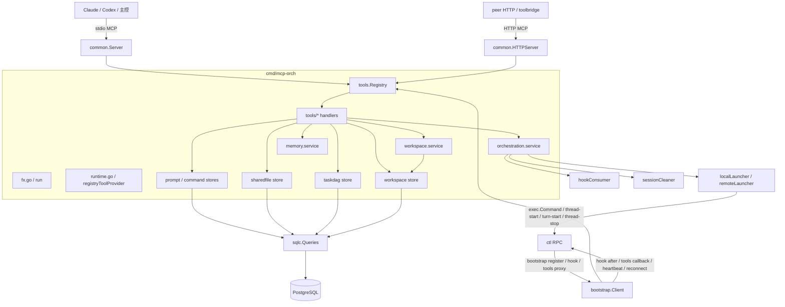
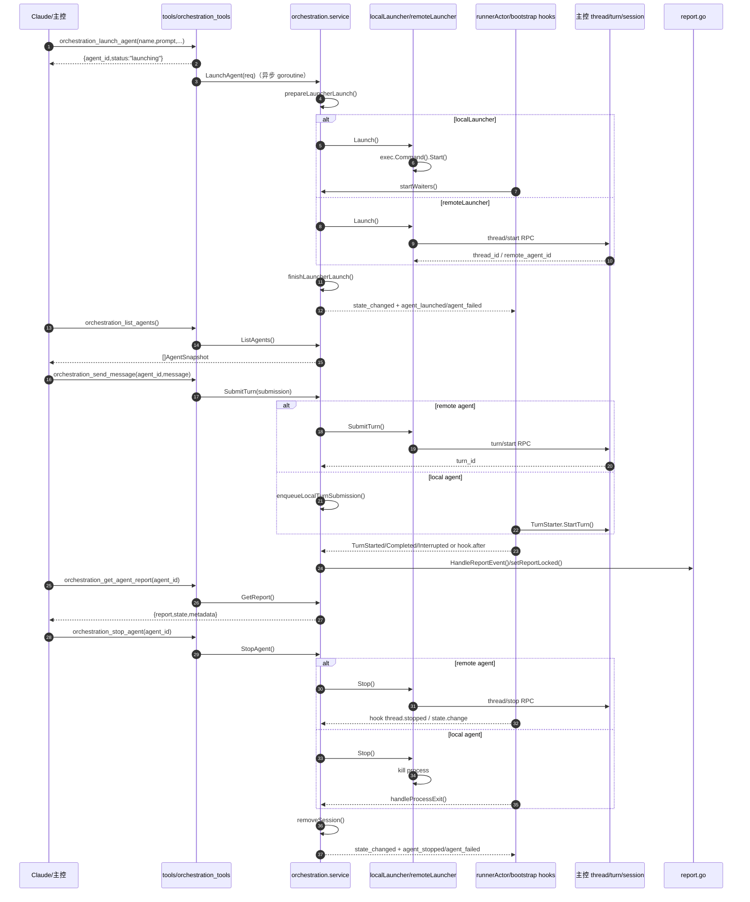
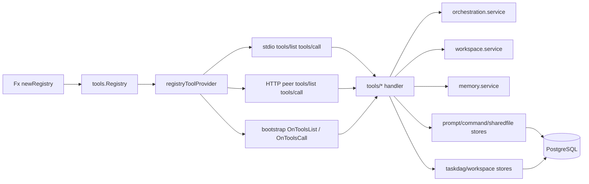

# mcp-orch 代码地图

## 1. 边界与当前真相

- `cmd/mcp-orch` 是独立的编排 / DAG / workspace / shared-file / prompt / command / memory MCP binary；入口由 `run()` 组装，而不是回收 `internal/module/*` 的整包装配（`cmd/mcp-orch/fx.go:30`）。
- bootstrap 回连、tools 代理、peer hooks、stdio/HTTP MCP 共用同一份 `tools.Registry`；registry 是工具定义的唯一真相源，不存在第二份 side registry（`cmd/mcp-orch/fx.go:77`、`cmd/mcp-orch/runtime.go:110`、`cmd/mcp-orch/tools/registry.go:25`、`internal/mcpserver/common/bootstrap/lifecycle.go:98`）。
- 当前源码已把 `memory.NewConfig` / `memory.NewService` 接入 Fx，并在 capabilities 中显式声明 `tools/memory`；`memory_read` 现在是已接线工具，不再是“列得出、调不了”的漂移状态。
- `cmd/mcp-orch` 自带本地 store：`cmd/mcp-orch/store/{taskdag,workspace,prompt,commandcard,sharedfile}`；`shared_file_*` 也走本地 store，而不是 `internal/store/*`。
- 仓库里没有 `internal/module/orchestration*` 包；编排消费面主要是 `internal/module/thread` 与 `internal/module/turn/orchestration_starter.go`。
- session 的 durable 事实不在 `mcp-orch` 自身：`internal/module/thread` 负责 thread binding / prompt snapshot 落盘，`mcp-orch` 只缓存 `sessionGeneration`，用于退出时精确清理当前 session（`cmd/mcp-orch/orchestration/process_lifecycle.go:21`、`internal/module/thread/lifecycle.go:62`、`internal/module/thread/lifecycle.go:314`、`internal/provider/unified/session.go:39`、`internal/provider/unified/session_adapter.go:54`）。

## 2. 总体架构



### 关键入口

- `run()`：Fx 装配总入口（`cmd/mcp-orch/fx.go:30`）。
- `buildBootstrapConfig()`：注册 `OnToolsList` / `OnToolsCall` / `Hooks.OnAfter` / capabilities（`cmd/mcp-orch/fx.go:77`）。
- `newRegistry()`：把 orchestration / task / workspace / prompt / command / shared_file / memory 组装成统一 registry（`cmd/mcp-orch/runtime.go:110`）。
- `bootstrapRunner.Run()`：仅在 peer mode + RPC addr 下真正 register + subscribe hooks（`cmd/mcp-orch/runtime.go:184`）。
- `newHTTPRunner()`：peer mode 下启动 HTTP MCP，并写 discovery file（`cmd/mcp-orch/http_runner.go:23`、`internal/mcpserver/common/discovery.go:62`）。

## 3. Agent 生命周期（launch / list / report / send_message / stop）

### 3.1 完整时序图



### 3.2 生命周期要点

- `orchestration_launch_agent` 是**立即返回**的异步工具；真正 launch 在后台跑，避免 MCP tool-call 超时（`cmd/mcp-orch/tools/orchestration_tools.go:36`、`cmd/mcp-orch/orchestration/service.go:273`、`cmd/mcp-orch/orchestration/service_launcher_bridge.go:53`）。
- launch 先经过 `prepareLauncherLaunch()` 归一化 `agentRuntime`，再由 `localLauncher` 执行本地进程或由 `remoteLauncher` 发 `thread/start` RPC（`cmd/mcp-orch/orchestration/launcher.go:141`）。
- `orchestration_list_agents` 纯读 `agents` map 并返回 snapshot，不做副作用（`cmd/mcp-orch/orchestration/service.go:301`）。
- 报告读取与报告写入分离：`GetReport()` 只读；真正写 `lastReport` 的入口是 `HandleReportEvent()`、`hookConsumer.handleTurnCompleted()` 与 final-answer item 镜像（`cmd/mcp-orch/orchestration/report.go:49`、`cmd/mcp-orch/orchestration/report.go:81`、`cmd/mcp-orch/orchestration/hook_consumer.go:53`）。
- stop 统一收口到 `stopAgentViaLauncher()`；本地进程退出走 `handleProcessExit()`，远端线程退出主要靠 hook 镜像回灌（`cmd/mcp-orch/orchestration/service.go:277`、`cmd/mcp-orch/orchestration/service_launcher_bridge.go:180`、`cmd/mcp-orch/orchestration/process_lifecycle.go:82`）。
- `sessionGeneration` 在 thread 启动/恢复后从 `SessionManager` 回写给 mcp-orch；退出时优先调用 generation-aware cleaner，避免误删新 session（`internal/module/thread/lifecycle.go:62`、`cmd/mcp-orch/orchestration/process_lifecycle.go:21`、`internal/provider/unified/session_adapter.go:54`）。

## 4. 三条核心数据流

### 4.1 Registry → handler → service/store



- registry 不持久化；它只是 tool definition 路由表。真正持久化发生在各 store。
- `tools/list` / `tools/call` 在 stdio、HTTP、bootstrap callback 三条传输面上共享同一份 registry，因此 peer 模式与 sidecar 模式看到的是同一组工具。

### 4.2 Session generation / durability / cleanup

```mermaid
flowchart LR
    A[thread.Start / Resume] --> B[SessionManager.Register(agentID, session)]
    A --> C[persistThreadState + savePromptSnapshot]
    B --> D[SessionGeneration(agentID)]
    D --> E[thread.bindSessionGeneration()]
    E --> F[mcp-orch BindSessionGeneration()]
    F --> G[agentRuntime.sessionGeneration]
    H[process exit / thread stop] --> I[removeSession(agent)]
    I --> J[sessionCleaner.RemoveSessionGeneration(agentID,generation)]
    J --> K[SessionManager.Remove(agentID,generation)]
```

- **durable 部分**在 `internal/module/thread`：thread binding + prompt snapshot 由 thread 模块落盘（`internal/module/thread/lifecycle.go:314`）。
- **运行态 session**在 `internal/provider/unified.SessionManager`：按 `agentID -> {generation, session}` 管理（`internal/provider/unified/session.go:39`）。
- **mcp-orch 只保存 generation**：它没有自己的 session store，只负责在 stop/exit 时把“当前代”交给 cleaner 删除，防止误清理重连后的新 session。

### 4.3 Peer bridge / bootstrap hook mirror

```mermaid
flowchart LR
    A[peer mode] --> B[newHTTPRunner]
    B --> C[WritePeerDiscovery]
    A --> D[bootstrap.Client.Start]
    D --> E[registerConn ctl/register]
    D --> F[SubscribeHooks(agent.session.start / state.change / turn.* / process.exit)]
    G[ctl callback tools/list or tools/call] --> H[bootstrap.handleCallback]
    H --> I[OnToolsList / OnToolsCall]
    I --> J[registryToolProvider]
    K[ctl hook after] --> L[hookConsumer.After]
    L --> M[thread.started / state_changed / turn.completed / item_completed / thread.stopped]
    M --> N[UpdateRuntime / HandleReportEvent / state mirror / stop mirror]
```

- discovery file 是 peer HTTP 的旁路发现层，不承载 JSON，只写 `host:port` 文本。
- `handleCallback()` 同时承接两类桥接：`tools/list|tools/call` 回调，以及 hook before/check/after callback 分发（`internal/mcpserver/common/bootstrap/lifecycle.go:98`、`internal/mcpserver/common/bootstrap/hooks.go:166`）。
- `hookConsumer.After()` 要求 `HookPayload.Context` 里带 `{kind,event}` envelope；否则直接忽略（`cmd/mcp-orch/orchestration/hook_consumer.go:53`、`internal/dto/mcp/hook.go:11`）。

## 5. 工具四列表（参数 / Service 调用 / 副作用 / 事件）

> 工具定义总装配：`cmd/mcp-orch/tools/registry.go:25`。

| Tool | 参数 | 内部 Service 调用 | 副作用 | 事件 |
|---|---|---|---|---|
| `orchestration_launch_agent` | `name,prompt,parent_id,agent_type,memory_scope,cwd,provider` | `HandleLaunchAgent -> launchRequestFromInput -> OrchestrationService.LaunchAgent -> launchAgentViaLauncher` | 异步 goroutine；写 `agents` map / state；本地 `exec.Command` 或远端 `thread/start` | `state_changed`、`agent_launched`、`agent_failed`；后续可能 `agent_runtime_reported` |
| `orchestration_send_message` | `agent_id,message` | `HandleSendMessage -> submissionFromMessage -> SubmitTurn -> submitTurnViaLauncher` | 本地入 `SubmissionQueue` 或远端 `turn/start`；更新 `activeTurnID/state` | 本地 turn 事件；审批事件；peer hook 镜像；可能更新 report |
| `orchestration_stop_agent` | `agent_id` | `HandleStopAgent -> StopAgent -> stopAgentViaLauncher` | 标记 stopping；本地 kill / 远端 `thread/stop`；清 runtime/session | `state_changed`、`agent_stopped`、`agent_failed` |
| `orchestration_list_agents` | 无 | `HandleListAgents -> ListAgents` | 无 | 无 |
| `orchestration_get_agent_report` | `agent_id` | `HandleGetAgentReport -> GetReport` | 无 | 无 |
| `task_create_dag` | `agent_id,dag_key,title,description,metadata,schedule,nodes[]` | `HandleCreateDAG -> CreateDAG -> store.WithTx -> UpsertDAG/UpsertNode` | Postgres upsert DAG + nodes；`schedule/execution` 先编码进 `metadata/config` JSON | 无 |
| `task_get_dag` | `dag_key` | `HandleGetDAG -> GetDAG -> loadDAGDetail` | DB 读取 DAG + nodes | 无 |
| `task_update_node` | `dag_key,node_key,status,result` | `HandleUpdateNode -> UpdateNodeStatus -> store.UpdateNodeStatus` | 更新 `task_dag_nodes.status/result` | 无 |
| `workspace_create_run` | `run_key,dag_key,source_root,created_by,files,metadata` | `HandleWorkspaceCreateRun -> workspace.Service.CreateRun` | 建目录、复制 bootstrap 文件、写 `workspace_runs/workspace_run_files` | `WorkspaceRunCreated` |
| `workspace_get_run` | `run_key` | `HandleWorkspaceGetRun -> workspace.Service.GetRun` | 读取 run，并补 files DTO | 无 |
| `workspace_list_runs` | `status,dag_key,limit` | `HandleWorkspaceListRuns -> workspace.Service.ListRuns` | 批量读取 run 列表 | 无 |
| `workspace_merge_run` | `run_key,updated_by,dry_run,delete_removed` | `HandleWorkspaceMergeRun -> workspace.Service.MergeRun` | CAS 改状态；dry-run 或真正写回 source tree；更新 file states | `WorkspaceRunStatusChanged`、`WorkspaceRunMerged`、`WorkspaceRunMergeError` |
| `workspace_abort_run` | `run_key,updated_by,reason` | `HandleWorkspaceAbortRun -> workspace.Service.AbortRun` | 把 run 标成 `aborted` 并写 reason metadata | `WorkspaceRunStatusChanged`、`WorkspaceRunAborted` |
| `prompt_list` | `keyword` | `prompt store.List` | DB 读 `prompt_templates` | 无 |
| `prompt_get` | `prompt_key` | `prompt store.Get` | DB 单条读取 | 无 |
| `command_list` | `keyword` | `command card store.List` | DB 读 `command_cards` | 无 |
| `command_get` | `card_key` | `command card store.Get` | DB 单条读取 | 无 |
| `shared_file_read` | `path` | `readSharedFile -> sharedfile.Store.Get` | 规范化 path 后读 `shared_files` | 无 |
| `shared_file_write` | `path,content` | `writeSharedFile -> sharedfile.Store.Upsert` | path normalize；10 MiB 限制；upsert `shared_files`；`updated_by="agent"` | 无 |
| `memory_read` | `name,path,scope,type` | `HandleMemoryRead -> MemoryService.Read` | 只读扫描 index / entry 文件；sanitize + authorize；可能返回 `denyReason/degraded` | 无 |

## 6. 消息格式约定

### 6.1 Peer bridge

#### `ctl/register`

```json
{
  "instance_id": "inst-...",
  "binary_name": "mcp-orch",
  "agent_id": "",
  "thread_id": "thread-...",
  "pid": 12345,
  "session_token": "...",
  "boot_id": "boot-...",
  "client_kind": "orch",
  "peer_kind": "tool",
  "capabilities_offered": ["tools/orchestration", "tools/task", "tools/workspace", "tools/prompt", "tools/command", "tools/shared_file", "tools/memory"],
  "capabilities_required": [],
  "subscriptions": ["config/agent", "config/thread"],
  "resume_from_generation": 12
}
```

- 结构体来源：`internal/dto/mcp/protocol.go:12`。
- 发送入口：`internal/mcpserver/common/bootstrap/lifecycle.go:58`。

#### `tools/call` callback

```json
{
  "jsonrpc": "2.0",
  "id": 1,
  "method": "tools/call",
  "params": {
    "name": "orchestration_launch_agent",
    "arguments": {"name": "worker-1"}
  }
}
```

返回值被 `buildBootstrapConfig()` 包成 MCP text content：

```json
{
  "content": [
    {"type": "text", "text": "{\"agent_id\":\"worker-1\",\"status\":\"launching\"}"}
  ]
}
```

- callback 分发点：`internal/mcpserver/common/bootstrap/lifecycle.go:98`。
- mcp-orch 包装点：`cmd/mcp-orch/fx.go:77`。

#### `ctl/hook/subscribe`

```json
{
  "subscription_id": "mcp-orch-agent-lifecycle",
  "topics": [
    "agent.session.start",
    "agent.state.change",
    "agent.turn.after",
    "agent.turn.failed",
    "agent.turn.progress",
    "agent.process.exit"
  ],
  "scope": {},
  "filters": null,
  "mode": "sync"
}
```

- request 结构：`internal/dto/mcp/hook.go:57`。
- 发送入口：`internal/mcpserver/common/bootstrap/hooks.go:166`。

#### hook callback payload

```json
{
  "hook_call_id": "hook-...",
  "agent_id": "worker-1",
  "thread_id": "thread-...",
  "turn_id": "turn-...",
  "topic": "agent.turn.after",
  "context": {
    "kind": "turn.completed",
    "event": {"agent_id": "worker-1", "thread_id": "thread-...", "turn_id": "turn-..."}
  }
}
```

- envelope 结构：`internal/dto/mcp/hook.go:11`。
- mcp-orch 消费入口：`cmd/mcp-orch/orchestration/hook_consumer.go:53`。
- `context.kind` 当前约定值：`thread.started` / `thread.stopped` / `agent.state_changed` / `turn.completed` / `turn.interrupted` / `turn.item_completed`。

#### `ctl/report`

```json
{
  "lease": {"instance_id": "inst-...", "generation": 12},
  "report_id": "ctl_report-...",
  "report": {
    "type": "runtime|completion|progress|diagnostic",
    "runtime": {"port": 8080, "provider": "codex"},
    "completion": {"status": "done", "report": "..."}
  }
}
```

- 结构体来源：`internal/dto/mcp/protocol.go:162`。
- 发送入口：`internal/mcpserver/common/bootstrap/client.go:236`。
- `mcp-orch` 关闭时会自动发 final completion report。

#### peer discovery file

```text
/tmp/super-agent-mcp-mcp-orch-<ppid>.port
127.0.0.1:<port>\n
```

- 写入入口：`internal/mcpserver/common/discovery.go:62`。

### 6.2 `shared_file_read` / `shared_file_write`

#### request / response

```json
// read request
{"path":"config/settings.json"}

// write request
{"path":"config/settings.json","content":"..."}

// read/write response
{
  "path": "config/settings.json",
  "content": "...",
  "updated_by": "agent",
  "created_at": "2026-04-20T12:00:00Z",
  "updated_at": "2026-04-20T12:05:00Z"
}
```

- handler：`cmd/mcp-orch/tools/shared_file_tools.go:36`、`cmd/mcp-orch/tools/shared_file_tools.go:43`。
- store：`cmd/mcp-orch/store/sharedfile/store.go:18`、`cmd/mcp-orch/store/sharedfile/store.go:31`。
- `path` 是 **DB 逻辑键**，不是 repo 绝对路径；进入 handler 后会执行：trim → `\\` 转 `/` → `path.Clean` → 去掉前导 `/`。
- `write` 没有 append 语义，始终是覆盖式 upsert；`content` 上限 10 MiB。
- 这组工具不发事件，只改 `shared_files` 表。

## 7. 已用 `lsp_grep` 回验的关键锚点

| 锚点 | 含义 |
|---|---|
| `cmd/mcp-orch/fx.go:30` | `run()` 入口 |
| `cmd/mcp-orch/fx.go:77` | `buildBootstrapConfig()` |
| `cmd/mcp-orch/runtime.go:110` | `newRegistry()` |
| `cmd/mcp-orch/runtime.go:184` | `bootstrapRunner.Run()` |
| `cmd/mcp-orch/http_runner.go:23` | `newHTTPRunner()` |
| `cmd/mcp-orch/orchestration/service.go:273` | `LaunchAgent()` |
| `cmd/mcp-orch/orchestration/service.go:297` | `SubmitTurn()` |
| `cmd/mcp-orch/orchestration/service.go:301` | `ListAgents()` |
| `cmd/mcp-orch/orchestration/report.go:49` | `GetReport()` |
| `cmd/mcp-orch/orchestration/report.go:81` | `HandleReportEvent()` |
| `cmd/mcp-orch/orchestration/process_lifecycle.go:21` | `BindSessionGeneration()` |
| `cmd/mcp-orch/orchestration/process_lifecycle.go:82` | `handleProcessExit()` |
| `cmd/mcp-orch/orchestration/process_lifecycle.go:198` | `runnerActor.Run()` |
| `cmd/mcp-orch/orchestration/hook_consumer.go:53` | `hookConsumer.After()` |
| `cmd/mcp-orch/orchestration/launcher.go:141` | `remoteLauncher.Launch()` |
| `internal/mcpserver/common/bootstrap/lifecycle.go:58` | `registerConn()` |
| `internal/mcpserver/common/bootstrap/lifecycle.go:98` | `handleCallback()` |
| `internal/mcpserver/common/bootstrap/hooks.go:166` | `SubscribeHooks()` |
| `internal/module/thread/lifecycle.go:314` | `persistThreadState()` |
| `internal/provider/unified/session_adapter.go:54` | `RemoveSessionGeneration()` |
| `internal/dto/mcp/protocol.go:12` | `RegisterRequest` |
| `internal/dto/mcp/protocol.go:162` | `ReportRequest` |
| `internal/dto/mcp/hook.go:11` | `HookPayload` |

## 8. 本卷纠偏结论

- 旧文档里“`memory_read` 已列出但未注入 / capabilities 未含 `tools/memory`”的描述已失真；当前源码已接线。
- 旧文档里把 `prompt/command/shared_file` 依赖写成 `internal/store/*` 也已失真；当前实际实现都在 `cmd/mcp-orch/store/*`。
- 对 session 的正确表述应是：`mcp-orch` 只保存 generation 并负责清理；session durable state 仍由 thread/provider 侧维护。
