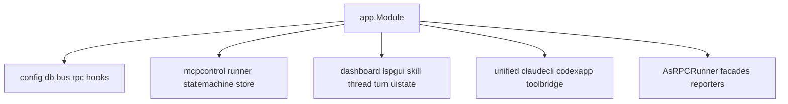

# 04 App 核心与契约层代码地图

> 扫描范围：`internal/app/*.go` 与 `internal/contract/*.go`。交叉核对实现包：`internal/platform/rpc`、`internal/platform/hooks`、`internal/platform/mcpcontrol`、`internal/provider/unified`、`internal/provider/claudecli`、`internal/provider/codexapp`、`internal/module/thread`、`internal/module/turn`、`internal/module/dashboard`、`internal/module/uistate`、`internal/ui/wails`、`cmd/mcp-orch`。

## 1. 模块概述

### 1.1 `internal/app`：根级组装层 / 运行入口层

`app` 包本身不承载业务规则，职责非常集中：

- 作为 **Uber Fx 根组装层**，把 platform / store / module / provider 组装成一个可运行应用；
- 暴露应用入口：`NewApp()`、`Run()`、`RunDesktop()`；
- 聚合 `group:"runners"` 的多个 `platformrunner.Runner`，统一管理 start / stop 生命周期；
- 提供两类跨边界适配器：
  - `contract.RuntimeReporter`
  - `thread.OrchestrationFacade`
- 桌面模式额外叠加 `uiwails.Module`，并通过 `fx.Populate` 取出 `*application.App` 和 `*uiwails.WailsLifecycle`。

**关键边界：** `app.Module` 明确 **不内嵌 `cmd/mcp-orch/orchestration.Module`**。源码注释也写明：agent orchestration 由独立 `mcp-orch` MCP 服务承载；桌面进程只暴露控制面与适配层，避免桌面二进制被再次拉起成子进程。

### 1.2 `internal/contract`：稳定契约层

`contract` 包是项目的稳定边界，设计意图很清晰：

- 只定义 **窄接口、数据结构、哨兵错误**，不放实现；
- 把 provider / thread / turn / hooks / mcpcontrol / orchestration 之间的依赖压缩为接口依赖；
- 把 RPC、sqlc、provider transport、standalone orchestration 这类易变实现隔离到外层；
- 允许桌面态在 **没有 orchestration service** 时，依靠 `optional:"true"` + noop 适配器完成大部分组装；
- 按能力域拆分：`approval`、`errors`、`hooks`、`mcp_control`、`memory`、`orchestration`、`prompt`、`provider`、`runtime_reporter`、`session_resolver`、`skill_injection`、`team_memory`、`thread_metadata`，以及与 prompt / memory 边界配套的 `dream`、`frc`、`prompt_attachment`。

一句话：**`app` 负责“怎么装”，`contract` 负责“装出来的东西如何说话”。**

---

## 1. `internal/app`：root Fx 组装层

### 1.1 根模块树（按 `Module` 粒度）

```mermaid
flowchart TD
  app["app.Module\nfx.Options"]
  app --> local["fx.Provide\nNewLogger\npidregistry.New\nAsRPCRunner\nnewThreadOrchestrationFacade\nnewRuntimeReporter"]
  app --> config["config.Module"]
  app --> db["db.Module"]
  app --> bus["bus.Module"]
  app --> rpc["rpc.Module"]
  app --> hooks["platform.hooks.Module"]
  app --> keepalive["platform.cachekeepalive.Module"]
  app --> mcpcontrol["mcpcontrol.Module"]
  app --> runner["runner.Module"]
  app --> sm["statemachine.Module"]
  app --> store["store.Module"]
  store --> s1["store.agentstatus"]
  store --> s2["store.ailog"]
  store --> s3["store.auditlog"]
  store --> s4["store.binding"]
  store --> s5["store.buslog"]
  store --> s6["store.commandcard"]
  store --> s7["store.cwdlock"]
  store --> s8["store.dbquery"]
  store --> s9["store.hookstore"]
  store --> s10["store.interaction"]
  store --> s11["store.prompt"]
  store --> s12["store.sharedfile"]
  store --> s13["store.systemlog"]
  store --> s14["store.tasktrace"]
  store --> s15["store.thread"]
  store --> s16["store.topologyapproval"]
  store --> s17["store.uipreference"]
  app --> dashboard["dashboard.Module\nfx.Options"]
  app --> memory["memory.Module"]
  memory --> mema["memory-agent.Module"]
  memory --> memn["memory.nested.Module"]
  memory --> memr["memory.retrieval.Module"]
  memory --> memt["memory.team.Module"]
  app --> prompt["prompt.Module"]
  app --> skill["skill.Module"]
  app --> thread["thread.Module"]
  app --> turn["turn.Module"]
  app --> uistate["uistate.Module\nfx.Options"]
  app --> unified["provider.unified.Module"]
  app --> claude["provider.claudecli.Module"]
  app --> codex["provider.codexapp.Module"]
  app --> toolbridge["toolbridge.Module"]
  app -. desktop only .-> wails["ui.wails.Module"]
  app -. not embedded .-> orch["cmd/mcp-orch/orchestration.Module"]
```



### 1.2 启动变体

| 文件 | 作用 |
| --- | --- |
| `approval.go` | 工具调用审批契约：`ApprovalResponder`、`ApprovalRequester`、`ApprovalRequest`、`ApprovalDecision`。 |
| `errors.go` | 通用哨兵错误：`ErrSessionNotFound`。 |
| `hooks.go` | Hook 管理、生命周期、审批持久化契约；定义 hook 相关错误。 |
| `mcp_control.go` | MCP 控制面注册/通知/回调/组合控制面的契约与 `ToolInstance` 快照。 |
| `memory.go` | memory 只读契约：`MemoryService`、`MemoryReadRequest/Result`、scope/type 枚举。 |
| `orchestration.go` | agent orchestration 的总边界：生命周期、turn、runtime、report、DAG。 |
| `prompt.go` | system prompt 组装契约：`PromptAssemblyService`、`DynamicSectionRegistrar`、`SectionInvalidator`、`BuildCtx`、`StartInput/TurnInput`。 |
| `provider.go` | provider 三层抽象：`Driver` / `Session` / `TurnHandle`。 |
| `runtime_reporter.go` | provider 向 orchestration 回报 runtime 元信息的最小契约。 |
| `session_resolver.go` | 由 threadID 解析运行中或可恢复 session 的契约。 |
| `skill_injection.go` | provider skill 注入桥：`SkillInjectionPort`。 |
| `team_memory.go` | team-memory 只读桥：`TeamMemoryManager`。 |
| `thread_metadata.go` | memory 侧线程元数据桥：`ThreadMetadataStore`、`ThreadMetadata`。 |

---

## 2. `internal/contract`：稳定契约面

### 2.1 控制面 / RPC / orchestration 契约

| 接口 | 方法签名 | 使用者（RPC / Module / Store / 其它） | 实现所在包 |
|---|---|---|---|
| `ApprovalResponder` | `Respond(callID string, requestID *int64, decision ApprovalDecision) error` | Module：`internal/module/turn` RPC 审批回调 | `internal/platform/rpc` (`ApprovalManager`) |
| `ApprovalRequester` | `RequestApproval(ctx context.Context, req ApprovalRequest) (ApprovalDecision, error)` | Module：`internal/module/skill` | `internal/platform/rpc` (`approvalRequester`) |
| `HookManager` | `Subscribe(...); DispatchBefore(...); DispatchCheck(...); DispatchAfter(...); Resolve(...); GetPendingReviews(...)` | Platform：`internal/platform/mcpcontrol` | `internal/platform/hooks` (`Manager`) |
| `HookLifecycle` | `ShutdownHooks(ctx context.Context, lease mcp.LeaseKey) error` | Platform：`internal/platform/mcpcontrol` registry cleanup | `internal/platform/hooks` (`Manager`) |
| `HookReviewStore` | `SavePendingReview(...); GetPendingReview(...); GetResolvedReview(...); ListPendingReviews(...); ResolvePendingReview(...); CancelPendingReviewsByLease(...); CancelPendingReviewsByAgent(...); CancelExpiredReviews(...); RecoverOnStartup(...)` | Platform：`internal/platform/hooks` | `internal/store/hookstore` |
| `ToolRegistry` | `Register(...); Heartbeat(...); GetInstance(...); ShutdownInstance(...)` | Module：`internal/module/thread`；Platform：`internal/platform/mcpcontrol` | `internal/platform/mcpcontrol` (`ToolRegistry`) |
| `ToolNotifier` | `NotifyBySubscription(...); NotifyByCapability(...); NotifyBySelector(...); NotifyConfigChanged(...)` | Platform：`internal/platform/mcpcontrol` config change | `internal/platform/mcpcontrol` (`ToolRegistry`) |
| `ToolHookCallback` | `CallbackHookBefore(...); CallbackHookCheck(...); CallbackHookAfter(...)` | Platform：`internal/platform/mcpcontrol` | `internal/platform/mcpcontrol` (`ToolRegistry`) |
| `PeerCallback` | `CallbackBefore(...); CallbackCheck(...); CallbackAfter(...)` | Platform：`internal/platform/hooks` dispatcher | `internal/platform/mcpcontrol` (`ToolRegistry`) |
| `ToolControlPlane` | `ToolRegistry + ToolNotifier + ToolHookCallback + PeerCallback` | 当前主要作为组合别名；无独立消费面 | `internal/platform/mcpcontrol` (`ToolRegistry`) |
| `OrchestrationService` | `LaunchAgent(...); ListAgents(...); StopAgent(...); SubmitTurn(...); CompleteTurn(...); Recover(...); BindSessionGeneration(...); Snapshot(...); UpdateRuntime(...); GetState(...); GetReport(...); RememberReportRequest(...); HandleReportEvent(...); CreateDAG(...); GetDAG(...); ListDAGs(...); UpdateNodeStatus(...)` | App：`internal/app`；Module：`dashboard/uistate`；UI：`internal/ui/wails`；Platform：`mcpcontrol`；cmd：`cmd/mcp-orch/tools` | `cmd/mcp-orch/orchestration` (`service`) |
| `OrchestrationSessionCleaner` | `RemoveSession(agentID string)` | cmd：`cmd/mcp-orch/orchestration` | `internal/provider/unified` (`sessionCleanerAdapter`)；standalone fallback：`cmd/mcp-orch` (`noopSessionCleaner`) |
| `OrchestrationTurnStarter` | `StartTurn(ctx context.Context, submission TurnSubmission) (string, error)` | cmd：`cmd/mcp-orch/orchestration` | `internal/module/turn` (`orchestrationTurnStarter`)；standalone fallback：`cmd/mcp-orch` (`noopTurnStarter`) |
| `RuntimeReporter` | `ReportRuntime(ctx context.Context, report RuntimeReport) error` | Provider：`internal/provider/{claudecli,codexapp}` | `internal/app` (`orchestrationRuntimeReporter` / `noopRuntimeReporter`)；`cmd/mcp-orch/orchestration.runtimeReporter` 仅辅类型，未导出到 app 图 |
| `SessionResolver` | `ResolveSession(ctx context.Context, threadID string) (Session, error)` | RPC：`internal/platform/rpc` capability gate；Module：`internal/module/turn`；Platform：`internal/platform/cachekeepalive` | `internal/provider/unified` (`sessionResolver`) |
| `MemoryService` | `Read(ctx context.Context, req MemoryReadRequest) (MemoryReadResult, error)` | cmd：`cmd/mcp-orch/tools` / `tools.Registry` | `cmd/mcp-orch/memory` (`service`) |

### 2.2 Prompt / memory / attachment 契约

| 接口 | 方法签名 | 使用者（RPC / Module / Store / 其它） | 实现所在包 |
|---|---|---|---|
| `PromptAssemblyService` | `AssembleStart(ctx context.Context, in StartInput) (StartAssembly, error); AssembleTurn(ctx context.Context, in TurnInput) (TurnAssembly, error); Invalidate(ctx context.Context, reason InvalidateReason) error` | Module：`internal/module/{thread,turn,memory/team}` | `internal/module/prompt` (`service`) |
| `DynamicSectionProvider` | `SectionName() string; Resolve(ctx context.Context, input SectionContext) (*string, error)` | Module：`internal/module/prompt` registry；Module：`internal/module/memory` 注册 prompt provider | `internal/module/prompt`（内建 providers）、`internal/module/memory`、`internal/module/memory/agent` |
| `InvalidationAwareProvider` | `OnPromptInvalidate(reason InvalidateReason)` | Module：`internal/module/prompt` invalidation pipeline | `internal/module/memory`、`internal/module/memory/nested` |
| `SectionInvalidator` | `InvalidateSections(reason InvalidateReason, names ...string) uint64` | Module：`internal/module/memory` lifecycle / extractor | `internal/module/prompt` (`service`) |
| `DynamicSectionRegistrar` | `RegisterDynamicProvider(provider DynamicSectionProvider) error` | Module：`internal/module/prompt` skill-catalog 注册；Module：`internal/module/memory` registerPromptProviders | `internal/module/prompt` (`service`) |
| `ClaudeMdSourceProviderRegistrar` | `RegisterClaudeMdSourceProvider(provider ClaudeMdSourceProvider) error` | Module：`internal/module/memory` registerPromptProviders | `internal/module/prompt` (`service`) |
| `ClaudeMdSourceProvider` | `ResolveClaudeMdSources(ctx context.Context, buildCtx BuildCtx) []ClaudeMdSource` | Module：`internal/module/prompt` build ctx / assembly；Module：`internal/module/memory` | `internal/module/memory/nested` (`ClaudeMdSourcesProvider`) |
| `TurnAttachmentProvider` | `ResolveTurnAttachments(ctx context.Context, buildCtx BuildCtx, turn TurnInput, baseSources []ClaudeMdSource) []dto.AttachmentEnvelope` | Module：`internal/module/prompt` assembler 通过 type assertion 消费 | `internal/module/memory/nested` (`ClaudeMdSourcesProvider`) |
| `TurnContextProvider` | `PrepareTurnContext(ctx context.Context, session Session, buildCtx BuildCtx, threadID, query string) TurnContextPayload` | Module：`internal/module/turn` | `internal/module/memory` (`MemoryContextProvider`) |
| `DreamExecutor` | `ExecuteDream(ctx context.Context, prompt string) (string, error)` | Module：`internal/module/memory` auto-dream consolidation | 聚合器：`internal/provider/unified`；provider 侧执行器：`internal/provider/{claudecli,codexapp}` |
| `SkillInjectionPort` | `DetectNativeSkills(cwd string) []string; ReservedTokens() int` | Module：`internal/module/prompt` skill catalog / native detector | `internal/provider/{claudecli,codexapp}` |
| `TeamMemoryManager` | `GetTeamMemPath(buildCtx ...BuildCtx) string; GetTeamMemEntrypoint(buildCtx ...BuildCtx) string` | Module：`internal/module/memory/nested` | `internal/module/memory/team` (`TeamMemoryManager`) |
| `ThreadMetadataStore` | `GetByThreadID(ctx context.Context, threadID string) (*ThreadMetadata, error); ListAll(ctx context.Context) ([]ThreadMetadata, error)` | Module：`internal/module/memory/team` | `internal/store/thread` (`metadataStoreAdapter`) |

| 接口 | 定义文件 | 核心职责 | 生产实现者 | Fx / 备注 |
| --- | --- | --- | --- | --- |
| `ApprovalResponder` | `approval.go` | 响应工具审批结果 | `*internal/platform/rpc.ApprovalManager` | 由 `internal/platform/rpc.Module` 导出。 |
| `ApprovalRequester` | `approval.go` | 主动向 UI / 活跃 RPC peer 请求审批决定 | `internal/platform/rpc.approvalRequester` | 由 `internal/platform/rpc.Module` 中的闭包 provider 导出；`module/skill.NewSkillHandlers` 消费。 |
| `HookManager` | `hooks.go` | Hook 订阅、三阶段分发、resolve、查询待审批 | `*internal/platform/hooks.Manager` | 由 `internal/platform/hooks.Module` 导出。 |
| `HookLifecycle` | `hooks.go` | Hook 关闭与清理 | `*internal/platform/hooks.Manager` | 由 `internal/platform/hooks.Module` 导出。 |
| `HookReviewStore` | `hooks.go` | 持久化 pending hook review | `*internal/store/hookstore.Store` | `hookstore.NewStore` 返回 `contract.HookReviewStore`。 |
| `ToolRegistry` | `mcp_control.go` | MCP peer 注册、心跳、实例查询、关闭 | `*internal/platform/mcpcontrol.ToolRegistry` | 由 `internal/platform/mcpcontrol.Module` 导出。 |
| `ToolNotifier` | `mcp_control.go` | 按订阅/能力/selector 广播通知 | `*internal/platform/mcpcontrol.ToolRegistry` | 同上。 |
| `ToolHookCallback` | `mcp_control.go` | 向订阅 peer 分发 hook callback | `*internal/platform/mcpcontrol.ToolRegistry` | 同上。 |
| `PeerCallback` | `mcp_control.go` | 对单个 lease 做 before/check/after callback | `*internal/platform/mcpcontrol.ToolRegistry` | 同上。 |
| `ToolControlPlane` | `mcp_control.go` | 上述 4 个 MCP 控制面接口的组合 | `*internal/platform/mcpcontrol.ToolRegistry` | 组合接口，无单独实现。 |
| `MemoryService` | `memory.go` | `memory_read` 背后的只读 memory 查询 | `*cmd/mcp-orch/memory.service` | 仅在 `cmd/mcp-orch` standalone 图由 `memory.NewService` 提供；`app.Module` 当前不装它。 |
| `OrchestrationService` | `orchestration.go` | agent 生命周期、turn、runtime、report、DAG | `*cmd/mcp-orch/orchestration.service` | 由 `cmd/mcp-orch/orchestration.Module` 导出；桌面态默认不内嵌该模块。 |
| `OrchestrationSessionCleaner` | `orchestration.go` | orchestration 关闭 agent 时清理本地 session | `*internal/provider/unified.sessionCleanerAdapter`；standalone noop：`cmd/mcp-orch.noopSessionCleaner` | `app.Module` 侧由 `unified.NewSessionCleaner` 提供；`mcp-orch` standalone 图由 `newNoopSessionCleaner` 提供。`sessionCleanerAdapter` 额外实现了非契约方法 `RemoveSessionGeneration(...)`，供 orchestration 通过类型断言使用。 |
| `OrchestrationTurnStarter` | `orchestration.go` | orchestration 触发 turn 启动 | `internal/module/turn.orchestrationTurnStarter`；standalone noop：`cmd/mcp-orch.noopTurnStarter` | `turn.Module` 直接提供返回值类型 `contract.OrchestrationTurnStarter`；当前 `app.Module` 不内嵌 `orchestration.Module`，`mcp-orch` standalone 图则使用 `newNoopTurnStarter`。 |
| `PromptAssemblyService` | `prompt.go` | 统一组装 start / turn system prompt，并支持失效刷新 | `*internal/module/prompt.service` | `internal/module/prompt.Module` 通过 `AsPromptAssemblyService` 导出。 |
| `Driver` | `provider.go` | provider 工厂抽象：启动/恢复 session | `*internal/provider/claudecli.driver`、`*internal/provider/codexapp.driver` | 通过 `contract.DriverFactory` 注入 `group:"drivers"`。 |
| `Session` | `provider.go` | 统一 provider session 抽象 | `*internal/provider/claudecli.session`、`*internal/provider/codexapp.session` | 由各 `Driver` 返回；由 `unified.SessionManager` 管理。 |
| `TurnHandle` | `provider.go` | 运行中 turn 的句柄 | `*internal/provider/claudecli.turnHandle`、`*internal/provider/codexapp.turnHandle` | 分别由 provider 的 `Session.StartTurn` 返回。 |
| `RuntimeReporter` | `runtime_reporter.go` | provider 上报 runtime 信息 | `internal/app.orchestrationRuntimeReporter`、`internal/app.noopRuntimeReporter` | `internal/app.Module` 提供 app 侧实现（`Run` / `RunDesktop` 均会加载）。另有 `cmd/mcp-orch/orchestration.runtimeReporter` 辅助类型定义在 `service.go`，但当前 Fx 图未导出它。 |
| `SessionResolver` | `session_resolver.go` | 由 threadID 解析/自动恢复 session | `*internal/provider/unified.sessionResolver` | 由 `internal/provider/unified.Module` 导出。 |
| `SkillInjectionPort` | `skill_injection.go` | 汇报 provider 原生 skill 注入与 token 预算 | `internal/provider/claudecli.claudecliSkillInjectionPort`、`internal/provider/codexapp.codexSkillInjectionPort` | 两个 provider 模块均输出到 `group:"skill_injection_ports"`，由 `prompt.NewCompositeNativeSkillDetector` 汇总。 |
| `TeamMemoryManager` | `team_memory.go` | 暴露 team memory path / entrypoint 的只读桥 | `*internal/module/memory/team.TeamMemoryManager` | `internal/module/memory.Module` 通过 `provideTeamMemoryManagerContract` 导出。 |
| `ThreadMetadataStore` | `thread_metadata.go` | 向 memory 域暴露线程元数据查找最小面 | `*internal/store/thread.metadataStoreAdapter` | `internal/store/thread.NewMetadataStore` 返回该契约；`memory` 生命周期 / team sync 消费。 |

### 3.3 `app` 包实现的外部桥接

| 外部接口 / 约束 | `app` 中实现 | 说明 |
| --- | --- | --- |
| `thread.OrchestrationFacade` | `threadOrchestrationAdapter` / `noopThreadOrchestrationFacade` | 把“大而全”的 `contract.OrchestrationService` 缩减成 `thread` 模块真正需要的 4 个动作：launch / stop / recover / bindSessionGeneration。 |
| `contract.RuntimeReporter` | `orchestrationRuntimeReporter` / `noopRuntimeReporter` | 把 `OrchestrationService.UpdateRuntime` 缩减成 provider 可消费的最小接口。 |
| `group:"runners"` 输出 | `AsRPCRunner(*rpc.Server)` | 这是 Fx 结果适配，不是行为适配；作用是把 `*rpc.Server` 包装进 `RunnerResult`。 |

补充：除 `app` 自身桥接外，根装配图里还有一组“契约端口 → 跨模块 bridge / adapter / store-adapter”映射：

| 契约端口 | 具体实现 / 适配器 | 所在包 |
| --- | --- | --- |
| `ApprovalResponder` | `ApprovalManager` | `internal/platform/rpc` |
| `SessionResolver` | `sessionResolver` | `internal/provider/unified` |
| `OrchestrationTurnStarter` | `orchestrationTurnStarter` | `internal/module/turn` |
| `PromptAssemblyService` | `service` + `AsPromptAssemblyService` | `internal/module/prompt` |
| `ThreadMetadataStore` | `metadataStoreAdapter` + `NewMetadataStore` | `internal/store/thread` |

### 3.4 契约相关核心数据与错误

- `ApprovalDecision`：审批结果载体；包含 `Approved *bool`、`Reason`、`Detail json.RawMessage`。
- `ApprovalRequest`：主动请求审批时的统一载荷；包含 `CallID`、`ApprovalID`、`ToolName`、`AgentID`、`ThreadID`、`TurnID`、`Reason`、`Kind`、`SourceMethod`、`Payload`。
- `MemoryEntry`、`MemoryReadRequest`、`MemoryReadResult`：`memory_read` 契约模型；涵盖 `Scope/Type`、`denyReason`、`degraded`、`source` 等返回元数据。
- `BuildCtx`、`StartInput`、`TurnInput`、`StartAssembly`、`TurnAssembly`、`InvalidateReason`：prompt assembly 主契约模型；跨 thread / turn / prompt / memory 共享。
- `ToolInstance`：MCP peer 快照；字段包含 `Lease`、废弃中的 `LeaseID`、`BinaryName`、`AgentID`、`ThreadID`、`PID`、`Capabilities`、`Subscriptions`、`PeerKind`、`ClientKind`、`Status`、`ConfigVersion`。
- `ThreadMetadata`：提供 memory / team sync 所需的 thread 只读字段；包含 `ThreadID`、`ParentAgentID`、`AgentMemoryScope`、`Cwd`、`OwnerThreadID`、`ConfigOverride` 等。
- `DriverFactory`：provider DI 注册载体；包含 `Name string`、`Create func() Driver`，由 provider 模块输出到 `group:"drivers"`。
- `RuntimeReport`：provider 上报 runtime 的最小载荷，仅含 `AgentID`、`Port`、`Provider`。
- `TurnSubmission`：`turndto.TurnSubmission` 的类型别名，用作 orchestration 向 turn 模块提交工作的契约载体。
- `LaunchRequest`、`AgentSnapshot`、`AgentStateResult`、`AgentReportMetadata`、`AgentReportResult`、`RememberReportRequest`、`RememberReportRequestResult`、`ReportEvent`、`ReportEventResult`：orchestration 核心输入/输出模型。
- `CreateDAGRequest`、`CreateDAGNodeRequest`、`ListDAGsFilter`、`UpdateNodeStatusRequest`、`DAGSummary`、`DAGNode`、`DAGDetail`：任务编排 / DAG 相关模型。
- 哨兵错误：
  - `ErrSessionNotFound`
  - `ErrAgentNotFound`
  - `ErrHookReviewPermissionDenied`
  - `ErrHookReviewNotFound`

---

## 3. Provider / bridge 契约映射表

| 契约 | Fx 接线位置 | 实现映射 | 备注 |
|---|---|---|---|
| `contract.ApprovalResponder` | `internal/platform/rpc/module.go` | `func(m *ApprovalManager) contract.ApprovalResponder { return m }` | `turn` 只依赖契约，不碰 RPC concrete。 |
| `contract.ApprovalRequester` | `internal/platform/rpc/module.go` | `approvalRequester{manager, bridge, server}` | `skill` 发审批请求的反向桥。 |
| `contract.SessionResolver` | `internal/provider/unified/module.go` | `NewSessionResolver -> *sessionResolver` | 由 threadID / binding / providerThreadID 自动恢复 session。 |
| `contract.OrchestrationSessionCleaner` | `internal/provider/unified/module.go`；`cmd/mcp-orch/fx.go` | 真实：`sessionCleanerAdapter`；standalone：`noopSessionCleaner` | standalone 图只保留占位，不回连桌面 runtime。 |
| `contract.OrchestrationTurnStarter` | `internal/module/turn/module.go`；`cmd/mcp-orch/fx.go` | 真实：`NewOrchestrationTurnStarter`；standalone：`noopTurnStarter` | 同一契约，两张 Fx 图不同实现。 |
| `contract.RuntimeReporter` | `internal/app/modules.go` | `newRuntimeReporter -> orchestrationRuntimeReporter/noopRuntimeReporter` | provider 只依赖最小 runtime 上报口。 |
| `contract.ClaudeMdSourceProvider` | `internal/module/memory/nested/module.go` | `fx.Annotate(NewClaudeMdSourcesProvider, fx.As(new(contract.ClaudeMdSourceProvider)))` | 同一 concrete 额外实现 `TurnAttachmentProvider`，由 prompt assembler 用 type assertion 消费。 |
| `contract.TurnContextProvider` | `internal/module/memory/module.go` | `AsTurnContextProvider(*MemoryContextProvider)` | turn 模块不直接 import memory concrete。 |
| `contract.DynamicSectionRegistrar` / `SectionInvalidator` / `PromptAssemblyService` | `internal/module/prompt/module.go` | `AsDynamicSectionRegistrar/AsSectionInvalidator/AsPromptAssemblyService` -> `*prompt.service` | prompt 模块一份实现对外投影三种契约面。 |
| `group:"drivers"` | `internal/provider/{claudecli,codexapp}/module.go` | `contract.DriverFactory` fan-in 到 `internal/provider/unified.RegistryParams` | 新 provider 走 group 扩展，不改 thread/turn。 |
| `group:"dream_executors"` | `internal/provider/{claudecli,codexapp}/module.go` | `contract.DreamExecutorProvider` fan-in 到 `unified.NewDreamExecutor` | dream 执行器也是 group 聚合。 |
| `group:"skill_injection_ports"` | `internal/provider/{claudecli,codexapp}/module.go` | `contract.SkillInjectionPort` fan-in 到 `prompt.NewCompositeNativeSkillDetector` | provider 原生 skill 能力以 group 聚合。 |

---

## 4. 与 07 / 09 的边界

| 问题 | 留在 04 | 去 07 / 09 |
|---|---|---|
| `app` 根装了哪些模块？ | `internal/app/modules.go` root 图、`BindRuntime`、desktop 差异 | 各模块内部 provider / handler / 生命周期细节不在本卷展开 |
| `internal/contract` 暴露了什么稳定面？ | 接口、DTO、哨兵错误、桥接关系 | 具体 service 字段、状态机、事件翻译器不在本卷 |
| `thread/turn/prompt/memory` 怎么实现？ | 只写“谁消费哪个 contract” | 实现细节、handler、事件、缓存，去 07 / 11 |
| `claudecli/codexapp/unified` 怎么跑 session / turn？ | 只写 `Driver/Session/TurnHandle/RuntimeReporter` 等契约面 | driver/session/transport/event map 去 09 |
| `cmd/mcp-orch` 为什么需要这些 contract？ | 只写 `OrchestrationService/MemoryService` 与 fallback 契约 | DAG/store/runtime/tool server 细节去 02 / 09 / 10 |

**切线规则：**

1. **契约留在这里**：`internal/contract/*` 中真正跨 root 包复用、且需要被 `app / module / provider / cmd` 共同理解的接口。  
2. **实现留在模块包**：谁拥有运行时状态、生命周期、缓存、transport、store，就把 concrete 留在自己的 `internal/module/*` / `internal/provider/*` / `internal/platform/*` / `cmd/mcp-orch/*`。  
3. **不是所有 outward interface 都该进 `internal/contract`**：若接口只属于单个业务模块内部 outward surface，应留在拥有者模块（看 07 / 09），不要把 module-local 接口抬升成全局 contract。  

---

## 5. 新增契约如何接线（`fx.Provide` + `fx.Group`）

### 5.1 单实现绑定：`fx.As` / 返回接口

1. 先判断是否真的需要放进 `internal/contract`：只有跨 root 包稳定复用时才提升。
2. 在拥有实现的包里保留 concrete，导出构造器。
3. 用 `fx.As(new(contract.X))` 或显式 provider 把 concrete 投影成 contract。

```go
var Module = fx.Module("provider.unified",
    fx.Provide(
        fx.Annotate(NewSessionCleaner, fx.As(new(contract.OrchestrationSessionCleaner))),
        NewSessionResolver, // 直接返回 contract.SessionResolver
    ),
)
```

#### B17 组件依赖图



**源码对照结论：** 文档所述根模块清单与 `internal/app/modules.go` 当前实现一致；没有内嵌 orchestration module。

### 4.2 `NewApp` / `RunDesktop` 的组装差异

- `newFXApp(...)`
  - `Module`
  - `fx.Invoke(BindRuntime)`
- `newDesktopFXApp(...)`
  - `Module`
  - `uiwails.Module`
  - `fx.Invoke(BindRuntime)`

即：**桌面态 = 核心 `app.Module` + `uiwails.Module`。**

补充对照（standalone vs 桌面）：

| 装配图 | 入口 / 组成 | `OrchestrationSessionCleaner` / `OrchestrationTurnStarter` 的装配 |
| --- | --- | --- |
| 普通 / 桌面 `app` 图 | `newFXApp(Module)`；桌面额外叠加 `uiwails.Module` | 真实 bridge 仍由 `unified.NewSessionCleaner`、`turn.NewOrchestrationTurnStarter` 导出，但桌面默认不加载 `orchestration.Module` 去消费它们。 |
| `cmd/mcp-orch` standalone 图 | `run()` + `buildOrchestrationOptions(remoteAddr)` | 直接 `fx.Provide(newNoopSessionCleaner, newNoopTurnStarter)`，仅满足 `orchestration.Module` 的契约依赖。 |

### 4.3 `group:"runners"` 的运行时汇聚

`BindRuntime` 消费所有 `platformrunner.Runner`：

```text
AsRPCRunner(*rpc.Server) ------------------------┐
uiwails.NewHTTPAssetServer() [desktop only] -----┼--> []platformrunner.Runner
(未来其它 Runner 也可继续追加) ------------------┘
                                       ↓
                                BindRuntime(...)
                                       ↓
                         platformrunner.RunGroup(ctx, runners, ...)
```

`BindRuntime` 的行为：

1. `OnStart`：创建后台 `runCtx`；
2. goroutine 中运行 `platformrunner.RunGroup`；
3. 任一 Runner 退出后：
   - 若是异常退出且不是 `context.Canceled`，记日志；
   - 若存在 `WailsLifecycle`，通知前端 backend failed；
   - 无论成功/失败，都调用 `fx.Shutdowner.Shutdown()`；
4. `OnStop`：取消 `runCtx`，等待 Runner 组退出或 stop 超时。

### 4.4 契约与关键桥接的 Fx 输出图

| 输出接口 / 值 | 提供者 | 主要消费者 |
| --- | --- | --- |
| `contract.ApprovalResponder` | `rpc.Module` 中 `func(m *ApprovalManager) contract.ApprovalResponder { return m }` | `module/turn`、provider 审批回调 |
| `contract.ApprovalRequester` | `rpc.Module` 中返回 `approvalRequester{manager, bridge, server}` 的闭包 provider | `module/skill.NewSkillHandlers` |
| `contract.HookManager` / `HookLifecycle` | `platform/hooks.Module` | `platform/mcpcontrol` |
| `contract.HookReviewStore` | `store/hookstore.NewStore` | `platform/hooks.HookResolver` |
| `contract.ToolRegistry` / `ToolNotifier` / `ToolHookCallback` / `PeerCallback` / `ToolControlPlane` | `platform/mcpcontrol.Module` | hooks / MCP 控制面 / 相关集成 |
| `thread.SessionStarter` | `unified.NewClient`（`fx.As(new(thread.SessionStarter))`） | `module/thread.NewService` |
| `thread.SessionProvider` | `unified.NewSessionProvider`（`fx.As(new(thread.SessionProvider))`） | `module/thread.NewService` |
| `turn.SessionProvider` | `unified.NewTurnSessionProvider` | `turn.NewOrchestrationTurnStarter` |
| `contract.OrchestrationSessionCleaner` | `unified.NewSessionCleaner`（`fx.As(new(contract.OrchestrationSessionCleaner))`）；`mcp-orch` standalone 图中为 `newNoopSessionCleaner` | `cmd/mcp-orch/orchestration.NewService`（仅在同一 Fx 图加载 `orchestration.Module` 时消费；`app.Module` 当前不加载它） |
| `contract.SessionResolver` | `unified.NewSessionResolver` | `rpc.NewCapabilityResolver`、`turn.NewTurnHandlers` |
| `rpc.CapabilityResolver` | `rpc.NewCapabilityResolver(contract.SessionResolver)` | `thread.NewThreadHandlers`、`turn.NewTurnHandlers` |
| `group:"drivers"` (`contract.DriverFactory`) | `provider/claudecli.Module`、`provider/codexapp.Module` | `unified.NewRegistry` |
| `contract.OrchestrationTurnStarter` | `turn.NewOrchestrationTurnStarter`；`mcp-orch` standalone 图中为 `newNoopTurnStarter` | `cmd/mcp-orch/orchestration.NewService`（仅在同一 Fx 图加载 `orchestration.Module` 时消费；当前 `app.Module` 导出但不消费真实 starter） |
| `contract.PromptAssemblyService` | `prompt.AsPromptAssemblyService` | `module/thread.NewService`、`turn.NewServiceWithPromptAssembly...`、`memory/team` prompt 失效链 |
| `group:"skill_injection_ports"` (`contract.SkillInjectionPort`) | `provider/claudecli.NewSkillInjectionPort`、`provider/codexapp.NewSkillInjectionPort` | `prompt.NewCompositeNativeSkillDetector` |
| `contract.TeamMemoryManager` | `memory.provideTeamMemoryManagerContract` | `memory/nested.NewClaudeMdSourcesProvider`、`memory.NewRulesProvider` |
| `contract.ThreadMetadataStore` | `store/thread.NewMetadataStore` | `memory` 生命周期 / team sync |
| `contract.RuntimeReporter` | `app.newRuntimeReporter` | `provider/claudecli.NewDriverFactory`、`provider/codexapp.NewDriverFactory` |
| `thread.OrchestrationFacade` | `app.newThreadOrchestrationFacade` | `module/thread.NewService` |

> 另：`contract.MemoryService` 不属于 `app.Module` 根图；它由 `cmd/mcp-orch/memory.NewService` 在 standalone `run()` 图中注入 `tools.NewRegistry` / `memory_read`。

### 4.5 关键注入链（按职责）

#### A. Provider 装配链

```text
claudecli.Module / codexapp.Module
        ↓ (group:"drivers")
provider/unified.Registry
        ↓
provider/unified.Client  --as--> thread.SessionStarter
provider/unified.SessionManager
        ├─> provider/unified.NewSessionProvider --as--> thread.SessionProvider
        ├─> provider/unified.NewTurnSessionProvider ----> turn.SessionProvider
        ├─> provider/unified.NewSessionCleaner ---------> contract.OrchestrationSessionCleaner
        └─> provider/unified.NewSessionResolver --------> contract.SessionResolver
```

#### B. Thread / Turn / RPC 链

```text
thread.SessionStarter + thread.SessionProvider + thread.OrchestrationFacade
        ↓
module/thread.Service
        ├─> Start / Resume / Recover / Stop 线程生命周期
        └─> bindSessionGeneration(...)
                ↓
      thread.OrchestrationFacade.BindSessionGeneration(...)
                ↓
      contract.OrchestrationService.BindSessionGeneration(...)

contract.SessionResolver
        ↓
rpc.NewCapabilityResolver(...)
        ↓
thread RPC handlers / turn RPC handlers

turn.SessionProvider + turn.Service
        ↓
turn.NewOrchestrationTurnStarter
        ↓
contract.OrchestrationTurnStarter
        ↓（仅当 `orchestration.Module` 与真实 starter 位于同一 Fx 图）
cmd/mcp-orch/orchestration.service
```

注意：当前 `app.Module` 会导出 `turn.NewOrchestrationTurnStarter`，但不会加载 `cmd/mcp-orch/orchestration.Module`；`cmd/mcp-orch` standalone 图则加载 `orchestration.Module`，并用 `newNoopTurnStarter` / `newNoopSessionCleaner` 满足其依赖。

#### C. Hook 与 MCP 控制面链

```text
store/hookstore.Store
        ↓ as contract.HookReviewStore
platform/hooks.HookResolver
        ↓
platform/hooks.Manager
        ↓ as contract.HookManager + contract.HookLifecycle
platform/mcpcontrol.ToolRegistry
        ↓ as ToolRegistry / ToolNotifier / ToolHookCallback / PeerCallback / ToolControlPlane
```

#### D. 可选 orchestration 链

```text
[optional] contract.OrchestrationService
        ├─> app.newRuntimeReporter ---------> contract.RuntimeReporter
        ├─> app.newThreadOrchestrationFacade -> thread.OrchestrationFacade
        ├─> dashboard.Module / uistate.Module / uiwails.Module（均 optional 注入）
        └─> platform/mcpcontrol 默认 runtime/completion report handler（optional 注入）
```

**重点：** 桌面 App 默认不提供 `contract.OrchestrationService`，因此依赖它的桌面侧链路必须要么 `optional:"true"`，要么通过 noop 适配器降级。

---

## 5. 关键函数 / 方法签名

### 5.1 `internal/app/app.go`

```go
// producer
fx.Provide(
    fx.Annotate(NewDriverFactory, fx.ResultTags(`group:"drivers"`)),
)

// consumer
type RegistryParams struct {
    fx.In
    Drivers []contract.DriverFactory `group:"drivers"`
}
```

当前仓内已落地三种 group 模式：

- `group:"drivers"`：`claudecli/codexapp -> unified.Registry`
- `group:"dream_executors"`：`claudecli/codexapp -> unified.NewDreamExecutor`
- `group:"skill_injection_ports"`：`claudecli/codexapp -> prompt.NewCompositeNativeSkillDetector`

### 5.3 standalone / optional 场景

若某契约只在另一张 Fx 图里有真实实现，当前图必须显式声明**fallback**，而不是偷 import 对方模块 concrete：

```go
fx.Provide(
    newNoopSessionCleaner,
    newNoopTurnStarter,
)
```

### 5.3 `internal/app/runner.go`

```go
type RunnerResult struct {
    fx.Out
    Runner platformrunner.Runner `group:"runners"`
}

func BindRuntime(lc fx.Lifecycle, p runtimeParams)
```

### 5.4 `internal/app/runtime_reporter_adapter.go`

```go
func newRuntimeReporter(p runtimeReporterParams) contract.RuntimeReporter
func (r orchestrationRuntimeReporter) ReportRuntime(ctx context.Context, report contract.RuntimeReport) error
func (r noopRuntimeReporter) ReportRuntime(_ context.Context, report contract.RuntimeReport) error
```

### 5.5 `internal/app/thread_orchestration_adapter.go`

```go
func newThreadOrchestrationFacade(p threadOrchestrationParams) thread.OrchestrationFacade
func (a threadOrchestrationAdapter) LaunchAgent(ctx context.Context, req thread.LaunchAgentRequest) error
func (a threadOrchestrationAdapter) StopAgent(ctx context.Context, agentID string) error
func (a threadOrchestrationAdapter) Recover(ctx context.Context, agentID string) error
func (a threadOrchestrationAdapter) BindSessionGeneration(ctx context.Context, agentID string, generation uint64) error
func (noopThreadOrchestrationFacade) LaunchAgent(context.Context, thread.LaunchAgentRequest) error
func (noopThreadOrchestrationFacade) StopAgent(context.Context, string) error
func (noopThreadOrchestrationFacade) Recover(context.Context, string) error
func (noopThreadOrchestrationFacade) BindSessionGeneration(context.Context, string, uint64) error
```

### 5.6 `contract` 包接口与关键契约签名（按领域完整列出）

#### 审批

```go
type ApprovalResponder interface {
    Respond(callID string, requestID *int64, decision ApprovalDecision) error
}

type ApprovalRequester interface {
    RequestApproval(ctx context.Context, req ApprovalRequest) (ApprovalDecision, error)
}
```

#### Hook

```go
type HookManager interface {
    Subscribe(ctx context.Context, lease mcp.LeaseKey, req mcp.HookSubscribeRequest) (mcp.HookSubscribeResponse, error)
    DispatchBefore(ctx context.Context, topic string, payload mcp.HookPayload) (mcp.BeforeDecision, error)
    DispatchCheck(ctx context.Context, topic string, payload mcp.HookPayload) (mcp.CheckDecision, error)
    DispatchAfter(ctx context.Context, topic string, payload mcp.HookPayload) (mcp.AfterDecision, error)
    Resolve(ctx context.Context, callerLease mcp.LeaseKey, req mcp.HookResolveRequest) (mcp.HookResolveResponse, error)
    GetPendingReviews(ctx context.Context, agentID string) ([]mcp.PendingHookReview, error)
}

type HookLifecycle interface {
    ShutdownHooks(ctx context.Context, lease mcp.LeaseKey) error
}

type HookReviewStore interface {
    SavePendingReview(ctx context.Context, review mcp.PendingHookReview) error
    GetPendingReview(ctx context.Context, hookCallID string) (mcp.PendingHookReview, error)
    GetResolvedReview(ctx context.Context, hookCallID string) (string, time.Time, string, error)
    ListPendingReviews(ctx context.Context, agentID string) ([]mcp.PendingHookReview, error)
    ResolvePendingReview(ctx context.Context, hookCallID, decision, reason, idempotencyKey, resolvedBy string) error
    CancelPendingReviewsByLease(ctx context.Context, subscriberLease string) (int, error)
    CancelPendingReviewsByAgent(ctx context.Context, agentID string) (int, error)
    CancelExpiredReviews(ctx context.Context) (int, error)
    RecoverOnStartup(ctx context.Context) ([]mcp.PendingHookReview, error)
}
```

#### MCP 控制面

```go
type ToolRegistry interface {
    Register(ctx context.Context, req mcp.RegisterRequest) (mcp.RegisterResponse, error)
    Heartbeat(ctx context.Context, req mcp.HeartbeatRequest) (mcp.HeartbeatResponse, error)
    GetInstance(key mcp.LeaseKey) (ToolInstance, bool)
    ShutdownInstance(ctx context.Context, key mcp.LeaseKey, req mcp.ShutdownRequest) error
}

type ToolNotifier interface {
    NotifyBySubscription(ctx context.Context, topic, method string, params any) error
    NotifyByCapability(ctx context.Context, capability, method string, params any) error
    NotifyBySelector(ctx context.Context, sel mcp.Selector, method string, params any) error
    NotifyConfigChanged(ctx context.Context, topic string, scope *mcp.SelectorScope, configVersion int64, payload json.RawMessage) error
}

type ToolHookCallback interface {
    CallbackHookBefore(ctx context.Context, topic string, payload mcp.HookPayload) error
    CallbackHookCheck(ctx context.Context, topic string, payload mcp.HookPayload) error
    CallbackHookAfter(ctx context.Context, topic string, payload mcp.HookPayload) error
}

type PeerCallback interface {
    CallbackBefore(ctx context.Context, lease mcp.LeaseKey, payload mcp.HookPayload) (mcp.BeforeDecision, error)
    CallbackCheck(ctx context.Context, lease mcp.LeaseKey, payload mcp.HookPayload) (mcp.CheckDecision, error)
    CallbackAfter(ctx context.Context, lease mcp.LeaseKey, payload mcp.HookPayload) (mcp.AfterDecision, error)
}

type ToolControlPlane interface {
    ToolRegistry
    ToolNotifier
    ToolHookCallback
    PeerCallback
}
```

#### Orchestration

```go
type OrchestrationService interface {
    LaunchAgent(ctx context.Context, req LaunchRequest) error
    ListAgents(ctx context.Context) ([]AgentSnapshot, error)
    StopAgent(ctx context.Context, agentID string) error
    SubmitTurn(ctx context.Context, req TurnSubmission) error
    CompleteTurn(ctx context.Context, agentID, turnID string, success bool, errMsg string) error
    Recover(ctx context.Context, agentID string) error
    BindSessionGeneration(ctx context.Context, agentID string, generation uint64) error
    Snapshot(ctx context.Context, agentID string) (AgentSnapshot, error)
    UpdateRuntime(ctx context.Context, report RuntimeReport) error
    GetState(ctx context.Context, agentID string) (AgentStateResult, error)
    GetReport(ctx context.Context, agentID string) (AgentReportResult, error)
    RememberReportRequest(ctx context.Context, req RememberReportRequest) (RememberReportRequestResult, error)
    HandleReportEvent(ctx context.Context, event ReportEvent) (ReportEventResult, error)
    CreateDAG(ctx context.Context, req CreateDAGRequest) (DAGDetail, error)
    GetDAG(ctx context.Context, dagKey string) (DAGDetail, error)
    ListDAGs(ctx context.Context, filter ListDAGsFilter) ([]DAGSummary, error)
    UpdateNodeStatus(ctx context.Context, req UpdateNodeStatusRequest) (DAGNode, error)
}

type OrchestrationSessionCleaner interface {
    RemoveSession(agentID string)
}

type OrchestrationTurnStarter interface {
    StartTurn(ctx context.Context, submission TurnSubmission) (string, error)
}
```

#### Provider

```go
type Driver interface {
    Name() string
    StartSession(ctx context.Context, req dto.StartSessionRequest) (Session, error)
    ResumeSession(ctx context.Context, req dto.ResumeSessionRequest) (Session, error)
}

type DriverFactory struct {
    Name   string
    Create func() Driver
}

type Session interface {
    ThreadID() string
    RolloutPath() string
    Capabilities() dto.CapabilitySet

    StartTurn(ctx context.Context, req dto.TurnRequest) (TurnHandle, error)
    Interrupt(ctx context.Context, req dto.InterruptRequest) error
    ForceComplete(ctx context.Context, req dto.ForceCompleteRequest) error

    ListThreads(ctx context.Context) ([]dto.ThreadRef, error)
    ForkThread(ctx context.Context, req dto.ForkRequest) (dto.ForkResult, error)
    ReadHistory(ctx context.Context, threadID string, limit int) ([]dto.Message, error)

    Configure(ctx context.Context, patch dto.ThreadConfigPatch) error
    Close(ctx context.Context) error
    ForceStop() error
}

type TurnHandle interface {
    LocalID() string
    ProviderID() string
    Done() <-chan struct{}
    Err() error
}
```

#### Memory / Prompt / Skill / Thread Metadata

```go
type MemoryService interface {
    Read(ctx context.Context, req MemoryReadRequest) (MemoryReadResult, error)
}

type PromptAssemblyService interface {
    AssembleStart(ctx context.Context, in StartInput) (StartAssembly, error)
    AssembleTurn(ctx context.Context, in TurnInput) (TurnAssembly, error)
    Invalidate(ctx context.Context, reason InvalidateReason) error
}

type SkillInjectionPort interface {
    DetectNativeSkills(cwd string) []string
    ReservedTokens() int
}

type TeamMemoryManager interface {
    GetTeamMemPath(buildCtx ...BuildCtx) string
    GetTeamMemEntrypoint(buildCtx ...BuildCtx) string
}

type ThreadMetadataStore interface {
    GetByThreadID(ctx context.Context, threadID string) (*ThreadMetadata, error)
    ListAll(ctx context.Context) ([]ThreadMetadata, error)
}
```

#### 其它桥接契约

```go
type RuntimeReporter interface {
    ReportRuntime(ctx context.Context, report RuntimeReport) error
}

type SessionResolver interface {
    ResolveSession(ctx context.Context, threadID string) (Session, error)
}
```

---

## 6. 依赖关系

### 6.1 `contract` 被哪些生产包消费

| 包 | 主要引用的 contract 能力 |
| --- | --- |
| `internal/app` | `OrchestrationService`、`RuntimeReporter`、`LaunchRequest`、`RuntimeReport` |
| `internal/platform/rpc` | `ApprovalResponder`、`ApprovalRequester`、`SessionResolver`、`ApprovalDecision` |
| `internal/platform/hooks` | `HookManager`、`HookLifecycle`、`HookReviewStore`、`PeerCallback`、hook 错误 |
| `internal/platform/mcpcontrol` | `ToolRegistry`、`ToolNotifier`、`ToolHookCallback`、`PeerCallback`、`ToolControlPlane`、`ToolInstance`、`HookManager`、`HookLifecycle`、`OrchestrationService`、`AgentSnapshot`、`ApprovalDecision`、`RuntimeReport`、`ReportEvent`、hook 错误 |
| `internal/store/hookstore` | `HookReviewStore`、`ErrHookReviewNotFound` |
| `internal/provider/unified` | `DriverFactory`、`Driver`、`Session`、`SessionResolver`、`OrchestrationSessionCleaner`、`ErrSessionNotFound` |
| `internal/provider/claudecli` | `DriverFactory`、`Driver`、`Session`、`TurnHandle`、`RuntimeReporter`、`RuntimeReport`、`SkillInjectionPort` |
| `internal/provider/codexapp` | `DriverFactory`、`Driver`、`Session`、`TurnHandle`、`RuntimeReporter`、`RuntimeReport`、`ApprovalDecision`、`SkillInjectionPort` |
| `internal/module/prompt` | `PromptAssemblyService`、`DynamicSectionRegistrar`、`SectionInvalidator`、`SkillInjectionPort`、`BuildCtx` |
| `internal/module/thread` | `Session`、`PromptAssemblyService`、`ErrAgentNotFound` |
| `internal/module/turn` | `Session`、`TurnHandle`、`SessionResolver`、`ApprovalResponder`、`OrchestrationTurnStarter`、`PromptAssemblyService`、`ErrSessionNotFound` |
| `internal/module/skill` | `ApprovalRequester` |
| `internal/module/memory` | `PromptAssemblyService`、`ThreadMetadataStore`、`TeamMemoryManager`、`BuildCtx`、`InvalidateReason` |
| `internal/module/dashboard` | `OrchestrationService`、`AgentSnapshot`、`AgentReportResult`、`ListDAGsFilter`、`DAGSummary`、`DAGDetail` |
| `internal/module/uistate` | `OrchestrationService`、`AgentSnapshot` |
| `internal/ui/wails` | `OrchestrationService` |
| `internal/store/thread` | `ThreadMetadataStore` |
| `cmd/mcp-orch` / `cmd/mcp-orch/orchestration` | `OrchestrationService`、`OrchestrationSessionCleaner`、`OrchestrationTurnStarter`、`MemoryService`、`RuntimeReport`、DAG/report 相关请求/响应模型 |

### 6.2 `app.Module` 直接纳入的模块

**Platform 层**

- `config.Module`
- `db.Module`
- `bus.Module`
- `rpc.Module`
- `hooks.Module`
- `mcpcontrol.Module`
- `platformrunner.Module`
- `statemachine.Module`

**Store 层**

- `store.Module`

**业务模块层**

- `dashboard.Module`
- `lspgui.Module`
- `skill.Module`
- `thread.Module`
- `turn.Module`
- `uistate.Module`

**Provider / 集成层**

- `unified.Module`
- `claudecli.Module`
- `codexapp.Module`
- `toolbridge.Module`

**本地提供者 / 适配器**

- `NewLogger`
- `pidregistry.New`
- `AsRPCRunner`
- `newThreadOrchestrationFacade`
- `newRuntimeReporter`

**桌面模式额外叠加**

- `uiwails.Module`

### 6.3 适配器模式落点（源码校对后修正）

1. **`newThreadOrchestrationFacade` 是“窄门面适配器”**  
   它把大的 `contract.OrchestrationService` 缩成 `thread` 模块只需要的 4 个动作：
   - `LaunchAgent`
   - `StopAgent`
   - `Recover`
   - `BindSessionGeneration`

   该适配器还做了字段裁剪：`thread.LaunchAgentRequest` 只映射到 `contract.LaunchRequest` 的 `AgentID / Name / ParentID / Cwd / Command / Env`，并不会传 `Prompt / Instructions`。

2. **`newRuntimeReporter` 是“单方法端口适配器”**  
   它只暴露 `ReportRuntime(...)`，内部实际转调 `OrchestrationService.UpdateRuntime(...)`；如果 orchestration service 不存在，则退化为 debug 日志 noop。

3. **`AsRPCRunner` 只是 Fx 结果适配，不是业务适配器**  
   它的职责只是把 `*rpc.Server` 包装为 `RunnerResult{Runner: server}`，让 RPC Server 进入 `group:"runners"`。

4. **桌面态的 noop 不是“假实现业务”，而是“断开可选 orchestration 链路”**  
   即使 `contract.OrchestrationService` 缺失，`thread.Start/Resume` 依旧会通过 `unified.Client` 启动 provider session；只是外部 orchestration 进程的 launch / stop / recover / generation bind 不再发生。

### 6.4 关键依赖结论

1. **`contract` 是真正的横向边界层。** provider、thread、turn、rpc、hooks、mcpcontrol、dashboard、uistate、wails、`cmd/mcp-orch` 都通过它解耦。  
2. **`app` 是根组装层，不是业务层。** 它只决定“装哪些模块、以什么生命周期运行”。  
3. **桌面端对 orchestration 是可选依赖。** `contract.OrchestrationService` 缺失时，通过 `noopRuntimeReporter` 与 `noopThreadOrchestrationFacade` 保证 provider / thread 仍可构造。  
4. **provider 装配采用 `group:"drivers"`。** 新增 provider 只需追加一个 `contract.DriverFactory`，无需改 thread / turn / rpc 调用链。  
5. **session generation 是 thread ↔ orchestration 的关键衔接点。** `SessionManager.Register()` 生成 generation；当同一 Fx 图中存在真实 `contract.OrchestrationService` 时，`thread.bindSessionGeneration()` 会上报，`mcp-orch/orchestration` 在进程退出时再用 generation-aware cleaner 做精确清理。  

---

## 7. 速记版架构图

```text
internal/app
  ├─ NewApp / Run / RunDesktop
  ├─ Module = 平台模块 + store + 业务模块 + provider 模块 + 适配器
  ├─ AsRPCRunner ------------------------------------┐
  ├─ [desktop] uiwails.NewHTTPAssetServer -----------┴--> group:"runners" --> BindRuntime --> RunGroup
  ├─ newRuntimeReporter -------------------------------> contract.RuntimeReporter --> providers
  └─ newThreadOrchestrationFacade ----------------------> thread.OrchestrationFacade --> thread.Service

internal/contract
  ├─ approval         -> rpc / turn 审批流
  ├─ errors           -> session / hook / orchestration 通用哨兵错误
  ├─ hooks            -> hooks / mcpcontrol / hookstore
  ├─ mcp_control      -> mcpcontrol / hooks
  ├─ memory           -> cmd/mcp-orch memory_read
  ├─ orchestration    -> cmd/mcp-orch / dashboard / uistate / wails / app
  ├─ prompt           -> prompt / thread / turn / memory
  ├─ provider         -> unified / claudecli / codexapp / thread / turn
  ├─ runtime_reporter -> app / providers
  ├─ session_resolver -> unified / rpc / turn
  ├─ skill_injection  -> claudecli / codexapp / prompt
  ├─ team_memory      -> memory
  └─ thread_metadata  -> store/thread / memory

provider/unified
  ├─ group:"drivers" -> Registry
  ├─ Client -----------------------> thread.SessionStarter
  ├─ SessionManager
  ├─ SessionProviderAdapter -------> thread.SessionProvider / turn.SessionProvider
  ├─ SessionCleanerAdapter --------> contract.OrchestrationSessionCleaner
  └─ SessionResolver -------------> contract.SessionResolver -> rpc.CapabilityResolver

module/prompt
  ├─ AsPromptAssemblyService ------> contract.PromptAssemblyService -> thread / turn / memory
  └─ NativeSkillDetector <--------- group:"skill_injection_ports" <----- claudecli / codexapp

platform/rpc
  └─ approvalRequester -----------> contract.ApprovalRequester -> skill

store/thread
  └─ NewMetadataStore -----------> contract.ThreadMetadataStore -> memory
```

## 8. 测试入口 + archtest freeze 映射

| 包 | 测试文件 | 核心 Test* | freeze |
| --- | --- | --- | --- |
| `app` | `runner_test.go` | `TestBindRuntimeDrainsExtractionBeforeCancel` | — |

补充：`04` 这卷自身没有额外 freeze 豁免；与组装边界最相关的跨卷 guard 仍是 `internal/archtest/code_size_guard_test.go` + `internal/archtest/freeze_registry.go` 中对 `internal/module/prompt` 的 `27` 文件冻结。

## 9. 常见修改路径（how-to）

| 场景 | 触发 | 步骤 | 锚点 | 验证 |
| --- | --- | --- | --- | --- |
| 根 Module | 新模块 / provider / platform 启动接线 | 1. 先在 owning `Module` 内导出 provider；2. 再把模块纳入 `internal/app/modules.go`；3. 如需跨边界收口，再补 `fx.Provide` adapter（如 `AsRPCRunner` / facade / reporter）。 | `internal/app/modules.go`、`AsRPCRunner` | `lsp_grep` `modules.go`；必要时跑 `internal/app/runner_test.go` |
| RPC 收编 | 新模块需要暴露 JSON-RPC / Wails RPC | 1. 返回 `rpc.HandlerMapResult`；2. 在模块侧提供 `New*Handlers`；3. 由 `internal/platform/rpc.registerAllHandlers` 统一收编。 | `internal/platform/rpc/module.go`、`registerAllHandlers` | `internal/platform/rpc/server_minimal_test.go` |
| freeze | 适配层膨胀 / bridge 临时收口触发架构 guard | 1. 优先把 helper / adapter 收回 owning module；2. 对照 `freeze_registry.go` 找当前真值；3. 用 `TestCodeSizeGuard` 校验是否需要同步调整 freeze。 | `internal/archtest/freeze_registry.go`、`internal/archtest/code_size_guard_test.go` | `go test ./internal/archtest -run TestCodeSizeGuard` |

## 审查补遗

- 已补齐 `5.6` 节中先前遗漏的接口签名：`HookReviewStore`、`ToolHookCallback`、`PeerCallback`、`ToolControlPlane`、`OrchestrationSessionCleaner`、`OrchestrationTurnStarter`。  
- 已补充此前漏写的源码符号：`internal/app/app.go` 中的 `currentBuildInfo` / `applyBuildSetting`，以及 `contract.DriverFactory`、`TurnSubmission`、`AgentReportMetadata`、`RememberReportRequest`、`RememberReportRequestResult`、`ReportEventResult` 等契约类型。  
- 已修正 `RuntimeReporter` 的实现说明：`cmd/mcp-orch/orchestration` 中确有 `runtimeReporter` 辅助类型，但它定义在 `service.go` 内，**当前并未进入 Fx 导出图**；桌面态真正接线的是 `internal/app` 下两种 reporter。  
- 已修正跨 Fx 图的依赖描述：`turn.NewOrchestrationTurnStarter` / `unified.NewSessionCleaner` 会在 `app.Module` 中导出，但当前生产 `mcp-orch` standalone 图分别实际注入的是 `newNoopTurnStarter` / `newNoopSessionCleaner`。  
- 已补全此前文档未展开的依赖注入链：`group:"drivers" -> unified.Registry -> Client / SessionManager / SessionResolver -> thread / turn / rpc`，以及 `SessionGeneration -> BindSessionGeneration -> generation-aware session cleaner` 这条链路。  
- 已澄清适配器模式的真实落点：`newThreadOrchestrationFacade` 与 `newRuntimeReporter` 是薄适配层；`AsRPCRunner` 只是 Fx 结果包装，不属于业务语义适配。  
- 已核对 `internal/app/modules.go`：根模块清单与文档一致，仍然 **不内嵌 orchestration module**；桌面态仅通过 optional 依赖和 noop 适配器感知 orchestration。  
